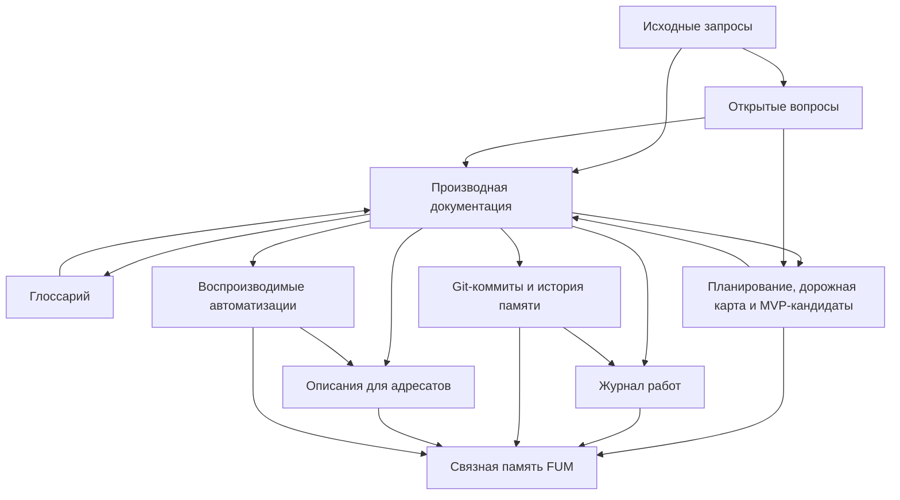

# Obzor proyekta [FUM](../Glossarij/FUM.md)

[FUM](../Glossarij/FUM.md) - abbreviatura latinskimi bukvami ot formulyi `fraktaljnyij uzel myishleniya`, po-russki - [fraktaljnyij uzel myishleniya](../Glossarij/fraktaljnyij-uzel-myishleniya.md).

[FUM](../Glossarij/FUM.md) razrabatyivayetsya kak otkryityij agent sleduyusjhego pokoleniya. Celj proyekta - realizovatj agenta polnogo cikla razrabotki i issledovaniya: ot vyirabotki trebovanij, postanovki gipotez i [eksperimentov](../Glossarij/eksperiment-FUM.md) do napisaniya koda, proverki rezuljtatov i oformleniya [otkryitij](../Glossarij/otkryitiye-FUM.md). Dolgosrochnaya celj sostoit v tom, chtobyi dostichj urovnya, na kotorom [FUM](../Glossarij/FUM.md)-agent smozhet napisatj samogo sebya.

Na chelovecheskom i agentskom urovnyakh yestestvennyij yazyik rassmatrivayetsya kak yazyik [sinkhronizacii znanij FUM](../Glossarij/yestestvenno-yazyikovaya-sinkhronizaciya-znanij-FUM.md). Lyudi, LLM-podderzhivayemyiye agentyi i [gibridnyiye uzlyi](../Glossarij/gibridnyij-uzel.md) cherez vyiskazyivaniya, voprosyi, otvetyi i ispravleniya obnovlyayut lokaljnyiye modeli mira i drug druga do dostatochnoj sovmestimosti dlya sovmestnogo myishleniya i dejstviya. Rechj idyot obo vsyom yazyike, a ne toljko o mestoimennyikh rolyakh: sinkhronizaciya ispoljzuyet ponyatiya, grammatiku, vremya, modaljnostj, prichinnostj, dokazateljnostj, argumentaciyu, povestvovaniye i strukturu dialoga.

Sam FUM dolzhen byitj postroyen po principu etoj seti. Snaruzhi [agent chelovecheskogo obrazca FUM](../Glossarij/agent-chelovecheskogo-obrazca-FUM.md) yavlyayetsya odnim iz yazyikovyikh uchastnikov ryadom s lyudjmi i drugimi agentami; vnutri on mozhet byitj setjyu poduzlov s lokaljnyimi sostoyaniyami, obsjhej sredoj, proiskhozhdeniyem soobsjhenij i ciklami obratnoj svyazi. LLM yestestvenno vklyuchayetsya v takoj kontur kak mekhanizm ponimaniya i porozhdeniya yazyika, no ustojchivyij agent dopolniteljno trebuyet pamyati, identichnosti, agentskogo cikla, instrumentov i granic dostupa.

V obsjhej vneshnej pamyati cheloveka i LLM osobuyu rolj igrayut [tekstovo-yazyikovyiye strukturiruyusjhiye operatoryi FUM](../Glossarij/tekstovo-yazyikovoj-strukturiruyusjhij-operator-FUM.md). Ikh ustojchivyij graf nakhoditsya vne biologicheskoj pamyati cheloveka, parametrov i tekusjhego konteksta LLM, no vkhodit v [pamyatj FUM](../Glossarij/pamyatj-FUM.md): obe storonyi v predelakh razreshyonnogo dostupa mogut chitatj, porozhdatj, proveryatj, ispravlyatj i povtorno ispoljzovatj odnu simvolicheskuyu formu. Etot profilj imeyet pragmaticheskij prioritet blagodarya adresuyemosti, poisku, ssyilkam, sravneniyu versij i vozvratu znaniya v kontekst, no ne zamenyayet pervichnyiye i muljtimodaljnyiye istochniki.

V predeljnoj formulirovke [FUM](../Glossarij/FUM.md) ne izobretayet principyi myishleniya iz pustotyi, a pyitayetsya dostatochno effektivno opisatj uzhe nablyudayemuyu fraktaljno-evolyucionnuyu strukturu mira: ot elementarnyikh chastic i ustojchivyikh fizicheskikh konfiguracij do kletok, mozgov, socialjnyikh sistem, civilizacij i daljnikh masshtabov nablyudayemoj Vselennoj. Inzhenernaya zadacha proyekta - sobratj siljnuyu ramku organizacii vyichislenij razuma na [kremniyevom substrate FUM](../Glossarij/kremniyevyij-substrat-FUM.md), chtobyi novoye voplosjheniye etoj strukturyi byilo sovmestimo s uzhe susjhestvuyusjhimi urovnyami, a ne otryivalosj ot nikh kak otdeljnaya metafora.

Svyazuyusjhim ponyatiyem dlya etoj shkalyi vyistupayet [okruzhayusjhaya sreda FUM](../Glossarij/okruzhayusjhaya-sreda-FUM.md). Sreda sinkhroniziruyet rabotu agentov cherez ogranicheniya, zaderzhki, obratnuyu svyazj i otbor, a sama mozhet stanovitjsya agentom ili [FUM-uzlom](../Glossarij/FUM-uzel.md) sleduyusjhego masshtaba, vlozhennyim v druguyu sredu. Poetomu obsjhaya teoriya otnositeljnosti, kvantovaya mekhanika, khimiya, biologiya, ekonomika i inzhenernyiye sredyi rassmatrivayutsya kak raznyiye urovni odnoj ostorozhno proveryayemoj kartyi sootvetstvij.

[Mnogourovnevaya yazyikovaya sinkhronizaciya FUM](../Glossarij/mnogourovnevaya-yazyikovaya-sinkhronizaciya-FUM.md) formuliruyet etu svyazj kak gipotezu o yazyike vzaimodejstvij. Na kletochnom urovne yeyo nositelyami vyistupayut signaljnyiye i regulyatornyiye konturyi, na khimicheskom - reakcii i diffuziya, na atomnom urovne, urovne elementarnyikh chastic i drugikh subatomnyikh masshtabakh - fizicheskiye vzaimodejstviya i ogranicheniya perekhodov. Gravitaciya zadayot skvoznuyu geometriyu prichinnoj svyaznosti, lokaljnyikh chasov i gorizontov, a ne otdeljnuyu stupenj posle chastic. Chelovecheskij yestestvennyij yazyik ostayotsya naiboleye bogatyim semanticheskim chastnyim sluchayem, a perenos slova «yazyik» na drugiye urovni trebuyet samostoyateljnoj proverki.

Pri etom [FUM](../Glossarij/FUM.md) ne dolzhen obyyavlyatj vse eti urovni odnim i tem zhe obyyektom. Boleye ostorozhnaya rabochaya [gipoteza](../Glossarij/gipoteza-FUM.md) sostoit v tom, chto raznyiye urovni mogut byitj voplosjheniyami odnoj [obsjhej skhemyi FUM](../Glossarij/obsjhaya-skhema-FUM.md): ustojchivogo nablyudateljsko-selekcionnogo uzla, kotoryij sokhranyayet konfiguraciyu, prinimayet vozdejstviya, porozhdayet variantyi, prokhodit otbor i mozhet stanovitjsya elementom sleduyusjhego urovnya. Kriterii vyideleniya etoj abstrakcii vyinesenyi v [otkryityij vopros](../Voprosyi/2026-06-26_12-19-03_MSK_abstrakciya-urovnej-nablyudayemoj-vselennoj-FUM.md).

Tekusjhij arkhitekturnyij akcent utochnyayet nazvaniye: [FUM](../Glossarij/FUM.md) opisyivayet ne toljko sam [FUM-uzel](../Glossarij/FUM-uzel.md), no i [interfejs FUM-uzla](../Glossarij/interfejs-FUM-uzla.md). Vnutrennyaya storona interfejsa delayet dostupnyimi pamyatj, sostoyaniya, poduzlyi, planyi i ogranicheniya; vneshnyaya storona svyazyivayet uzel s chelovekom, drugimi uzlami, servisami, ustrojstvami i sredoj. Trebovaniye raskryito v dokumente [Interfejs FUM-uzla](25-interfejs-FUM-uzla.md).

Yesjhyo odin celevoj sloj proyekta - svyazka [FUM](../Glossarij/FUM.md) i [MCP-serverov](../Glossarij/MCP-server.md) razlichnyikh servisov kak [yedinaya tochka vzaimodejstviya poljzovatelya s kompjyuterom](../Glossarij/yedinaya-tochka-vzaimodejstviya-s-kompjyuterom.md). Takaya svyazka dolzhna postepenno zamenyatj dlya poljzovatelya osnovnuyu neobkhodimostj rabotatj cherez mnozhestvo razroznennyikh kliyentskikh prilozhenij, snizhatj [modaljnostj prilozhenij](../Glossarij/modaljnostj-prilozhenij.md), umenjshatj dublirovaniye koda v industrii i sokrasjhatj putj ot idei do voplosjheniya. Trebovaniye raskryito v dokumente [FUM kak yedinaya tochka vzaimodejstviya s kompjyuterom](19-yedinaya-tochka-vzaimodejstviya-s-kompjyuterom.md).

Vazhnaya celevaya vekha etoj linii - [lokaljnyij agent FUM na vyidelennoj mashine](24-lokaljnyij-agent-na-vyidelennoj-mashine.md) s lokaljno zapuskayemoj siljnoj LLM. Takoj agent dolzhen byitj sposoben vyipolnyatj osnovnoj [agentskij cikl](../Glossarij/agentskij-cikl.md) v upravlyayemoj lokaljnoj srede: s lokaljnoj [pamyatjyu](../Glossarij/pamyatj-FUM.md), lokaljnyimi instrumentami, proverkami, trassoj i modeljnyim runtime. Predvariteljnyij apparatnyij obraz iz trebovaniya - Mac Studio s pamyatjyu klassa 512 GB, no konkretnaya mashina i modelj dolzhnyi vyibiratjsya cherez kriterii, kotoryiye ostayutsya v [otkryitom voprose o lokaljnoj LLM i vyidelennoj mashine](../Voprosyi/2026-06-25_19-50-33_MSK_kriterii-lokaljnoj-LLM-i-vyidelennoj-mashinyi-FUM.md).

[Otkryitostj FUM](../Glossarij/otkryitostj-FUM.md) vkhodit v yadro etoj celi. Proyekt publikuyetsya pod [CC0 1.0 Universal](../LICENZIYA.md), potomu chto agent, sposobnyij razvivatj i v predele pisatj samogo sebya, dolzhen imetj nasleduyemuyu, proveryayemuyu i pereispoljzuyemuyu osnovu. Dlya [lichnogo FUM-agenta](../Glossarij/lichnyij-FUM-agent.md) otkryitostj takzhe yavlyayetsya usloviyem doveriya: personaljnyij agent potencialjno rabotayet so vsemi sferami lichnoj zhizni cheloveka, poetomu yego ustrojstvo dolzhno byitj proveryayemyim, a lichnaya [pamyatj](../Glossarij/pamyatj-FUM.md) dolzhna zasjhisjhatjsya [urovnyami dostupa](../Glossarij/urovenj-dostupa.md).

Daljnij lichnyij gorizont proyekta opisyivayet [lichnyij FUM-agent](../Glossarij/lichnyij-FUM-agent.md) kak budusjhuyu kremniyevuyu cifrovuyu chastj [gibridnogo mozga](../Glossarij/gibridnyij-mozg.md) cheloveka. V takoj svyazke [uglerodnyij mozg](../Glossarij/uglerodnyij-mozg.md) i cifrovaya chastj bukvaljno razvivayutsya vmeste, a vozmozhnyij perekhod ostavshejsya cifrovoj chasti k avtonomii i statusu [cifrovogo prodolzheniya lichnosti](../Glossarij/cifrovoye-prodolzheniye-lichnosti.md) trebuyet otdeljnyikh kriteriyev, zafiksirovannyikh kak [otkryityij vopros](../Voprosyi/2026-07-03_08-21-17_MSK_granicyi-posmertnoj-avtonomii-cifrovoj-chasti-FUM.md).

Proyekt vedyotsya kak publikuyemaya sistema [pamyati FUM](../Glossarij/pamyatj-FUM.md): Git-repozitorij fiksiruyet sostoyaniye etoj [pamyati](../Glossarij/pamyatj-FUM.md) cherez posledovateljnostj kommitov, a Markdown-fajlyi razdelyayut [iskhodnyiye zaprosyi](../Glossarij/iskhodnyij-zapros.md) i [proizvodnuyu strukturirovannuyu dokumentaciyu](../Glossarij/proizvodnaya-dokumentaciya.md).

V etoj stadii sam repozitorij yavlyayetsya [dokumentacionnyim prototipom FUM](../Glossarij/dokumentacionnyij-prototip-FUM.md). On yesjhyo ne raven gotovoj [korobochnoj realizacii FUM](../Glossarij/korobochnaya-realizaciya-FUM.md), no uzhe pokazyivayet, kak takaya realizaciya dolzhna rabotatj s neobkhodimyimi dannyimi: prinimatj vkhodnyiye signalyi, sokhranyatj proiskhozhdeniye, podderzhivatj svyaznuyu [pamyatj](../Glossarij/pamyatj-FUM.md), obnovlyatj trebovaniya, zapuskatj proverki i vozvrasjhatj rezuljtat v nasleduyemuyu istoriyu.

Susjhestvuyusjhiye ispolnyayemyiye prototipyi dokazyivayut otdeljnyiye mekhanizmyi pamyati, modeljnogo shaga i proverok, no yesjhyo ne obrazuyut sobstvennogo polnogo agentskogo runtime FUM. Rabochaya gipoteza o preimusjhestve lokaljnoj Git-oriyentirovannoj sredyi dlya dolgozhivusjhej agentnoj rabotyi dolzhna proveryatjsya skvoznyim epizodom i sravniteljnyimi eksperimentami; granicyi dokazateljstv zakreplenyi v dokumente [Proveryayemaya vosproizvodimostj i eksperimentaljnaya priyomka FUM](46-proveryayemaya-vosproizvodimostj-i-eksperimentaljnaya-priyomka-FUM.md).

[FUM](../Glossarij/FUM.md) takzhe podderzhivayet [opisaniya FUM dlya adresatov](../Glossarij/opisaniye-FUM-dlya-adresata.md): proizvodnyiye materialyi dlya investorov, issledovatelej, inzhenerov, poljzovatelej i drugikh auditorij. Oni khranyatsya v papke [Opisaniya](../Opisaniya/README.md), stroyatsya na osnove dokumentacii i mogut obnovlyatjsya po vosproizvodimyim [avtomatizaciyam](../Glossarij/avtomatizaciya-FUM.md).

Otdeljnyij zhanrovyij rezhim takikh proizvodnyikh materialov - [khudozhestvennoye samoopisaniye FUM](../Glossarij/khudozhestvennoye-samoopisaniye-FUM.md). [FUM](../Glossarij/FUM.md) dolzhen umetj opisyivatj sebya cherez prozu, stikhi, muzyikaljnyiye treki, scenarii filjmov i drugiye khudozhestvennyiye ili mediazhanrovyiye formyi, ne smeshivaya khudozhestvennuyu ekstrapolyaciyu s prognozom, obesjhaniyem ili uzhe zafiksirovannyim trebovaniyem. Trebovaniye raskryito v dokumente [Khudozhestvennoye samoopisaniye FUM](30-khudozhestvennoye-samoopisaniye-FUM.md), a [khudozhestvenno-fantasticheskoye samoopisaniye FUM](../Glossarij/khudozhestvenno-fantasticheskoye-samoopisaniye-FUM.md) ostayotsya yego chastnyim nauchno-fantasticheskim rezhimom.

Poljzovateljskiye scenarii vyidelenyi v papochnyij razdel [Poljzovateljskiye istorii FUM](31-poljzovateljskiye-istorii-FUM/README.md). Etot sloj perevodit trebovaniya, arkhitekturu i planovyiye materialyi v proveryayemyiye istorii primeneniya: kto vzaimodejstvuyet s FUM, chego dobivayetsya, kakuyu cennostj poluchayet i po kakim nablyudayemyim priznakam rezuljtat mozhno prinyatj.

Planirovaniye razvitiya [FUM](../Glossarij/FUM.md) vyideleno v papku [Planirovaniye](../Planirovaniye/README.md). Etot sloj khranit materialyi vrode [dorozhnoj kartyi FUM](../Planirovaniye/dorozhnaya-karta.md) i [MVP-kandidatov](../Planirovaniye/MVP-kandidatyi/README.md), svyazyivayet trebovaniya, [otkryityiye voprosyi](../Glossarij/otkryityij-vopros.md), gorizontyi rabotyi i blizhniye proveryayemyiye variantyi, no ne podmenyayet [iskhodnyiye zaprosyi](../Glossarij/iskhodnyij-zapros.md) i [proizvodnuyu dokumentaciyu](../Glossarij/proizvodnaya-dokumentaciya.md).

[Zhurnal rabot](../Glossarij/zhurnal-rabot.md) vyidelen v papku [Zhurnal](../Zhurnal/README.md). Etot sloj khranit chelovekochitayemyiye vyisokourovnevyiye otchyotyi o prodelannoj rabote i svyazyivayet [rabochiye sessii](../Glossarij/rabochaya-sessiya.md), trebovaniya, izmenyonnyiye materialyi, proverki i daljnejshiye prodolzheniya v obzornuyu istoriyu razvitiya [pamyati FUM](../Glossarij/pamyatj-FUM.md).

Proyektirovaniye [FUM](../Glossarij/FUM.md) iskhodit iz togo, chto evolyucionnyij process tozhdestvenen processu myishleniya. Eto osnovaniye raskryito v dokumente [Evolyuciya i myishleniye](03-evolyuciya-i-myishleniye.md).

[Soznaniye](../Glossarij/soznaniye.md) v proyekte opredelyayetsya minimaljno: kak sovmestnoye znaniye, to yestj emerdzhentnoye svojstvo seti elementov. Poetomu [FUM](../Glossarij/FUM.md) rassmatrivayet [soznaniye](../Glossarij/soznaniye.md) kak mnogourovnevoye setevoye svojstvo, a ne kak binarnuyu granicu, zadannuyu toljko chelovecheskim urovnem slozhnosti.

Modelj [pamyati FUM](../Glossarij/pamyatj-FUM.md) takzhe opirayetsya na organizaciyu [pamyati](../Glossarij/pamyatj-FUM.md) v zhivyikh organizmakh: ot nasleduyemoj [pamyati](../Glossarij/pamyatj-FUM.md) genoma do nakoplennogo opyita v nervnoj sisteme. Eto utochnyayet evolyucionnoye osnovaniye: polnocennyij process myishleniya trebuyet, chtobyi cikl nasledovaniya, izmenchivosti i otbora dejstvoval na vsekh urovnyakh [pamyati](../Glossarij/pamyatj-FUM.md).

Dopolniteljnyim arkhitekturnyim obrazcom dlya [FUM](../Glossarij/FUM.md) yavlyayetsya ustrojstvo neokorteksa: povtoryayemyiye universaljnyiye [moduli](../Glossarij/modulj-FUM.md), sposobnyiye obyyedinyatjsya v setj iz [modulej](../Glossarij/modulj-FUM.md) togo zhe roda. Eto trebovaniye raskryito v dokumente [Moduljnaya arkhitektura FUM](05-moduljnaya-arkhitektura-FUM.md).

Nizhnij mekhanizm rozhdeniya takikh yedinic utochnyayet dokument [Potokovaya samostrukturizaciya FUM](32-potokovaya-samostrukturizaciya-FUM.md). V nyom [FUM](../Glossarij/FUM.md) opisyivayetsya kak sistema, kotoraya mozhet vyivoditj iz potoka dannyikh sobstvennyiye bajtovyiye, morfemopodobnyiye, slovopodobnyiye, sobyitijnyiye i moduljnyiye yedinicyi cherez predskazaniye, szhatiye, proverku poljzyi i kontroliruyemyij rost strukturyi.

Obobsjhayusjhim yazyikom dlya etoj linii yavlyayetsya [sistema strukturiruyusjhikh operatorov FUM](../Glossarij/sistema-strukturiruyusjhikh-operatorov-FUM.md). Ona svyazyivayet potokovuyu samostrukturizaciyu, pamyatj, LLM-obyyasnimostj, avtomatizacii, moduli, ekrannyiye predstavleniya znanij i proveryayemoye dejstviye cherez graf dvunapravlennyikh operatorov raspoznavaniya i porozhdeniya. V etoj roli sistema operatorov yavlyayetsya vneshnim simvolicheskim interfejsom mezhdu neyavnyimi znaniyami cheloveka i LLM: znaniya vyinosyatsya v operatornuyu formu, proveryayutsya na potokakh i stanovyatsya prigodnyimi dlya obyyasneniya, szhatiya, perenosa, vizualjnogo predyyavleniya i povtornogo ispoljzovaniya.

Na urovne chelovecheskogo, gibridnogo i agentskogo razuma [FUM](../Glossarij/FUM.md) takzhe dopuskayet psikhologicheskuyu, psikhofiziologicheskuyu i psikhiatricheskuyu ramki opisaniya. Oni ispoljzuyutsya dlya akkuratnogo opisaniya vozmozhnyikh sostoyanij, konfiguracij, rezhimov funkcionirovaniya i otkazov razuma, no trebuyut yavnyikh granic analogii i ne prevrasjhayutsya v avtomaticheskuyu diagnostiku cheloveka ili agenta.

Svodnaya [arkhitektura FUM](../Glossarij/arkhitektura-FUM.md) vyinesena v otdeljnyij dokument [Arkhitektura FUM](22-arkhitektura-FUM.md). On sobirayet raznesyonnyiye po dokumentacii sloi: [pamyatj](../Glossarij/pamyatj-FUM.md), moduljnostj, [agentskij cikl](../Glossarij/agentskij-cikl.md), [avtomatizacii](../Glossarij/avtomatizaciya-FUM.md), servisnyiye adapteryi, [modeljnuyu sredu](../Glossarij/modeljnaya-sreda.md), [virtualizovannyiye sredyi](../Glossarij/virtualizovannaya-sreda-FUM.md), socialjnyiye uzlyi, Git-evolyuciyu i daljniye fizicheskiye gorizontyi.

[Decentralizaciya FUM](../Glossarij/decentralizaciya-FUM.md) yavlyayetsya bazoj bezopasnosti i dolgosrochnoj ustojchivosti: ni odin [FUM-uzel](../Glossarij/FUM-uzel.md) i ni odna sostavnaya sistema uzlov ne dolzhnyi obladatj vsej polnotoj vlasti nad setjyu ili svoimi [poduzlami](../Glossarij/poduzel-FUM.md). Trebovaniye k [granicam vlasti](../Glossarij/granica-vlasti-FUM.md) raskryito v dokumente [Decentralizaciya FUM i granicyi vlasti](15-decentralizaciya-i-granicyi-vlasti.md), a prakticheskiye kriterii dopustimoj koordinacii vyidelenyi kak [otkryityij vopros](../Voprosyi/2026-06-22_07-51-48_MSK_granicyi-vlasti-uzlov-FUM.md).

Aktualjnyiye realizacii [agentskikh ciklov](../Glossarij/agentskij-cikl.md) rassmatrivayutsya kak vneshnij inzhenernyij kontekst dlya proyektirovaniya [FUM](../Glossarij/FUM.md). Obzor ReAct-podobnyikh ciklov, graph-based orchestration, multi-agent workflows, software agents i platform nepreryivnoj avtomatizacii zafiksirovan v dokumente [Obzor aktualjnyikh realizacij agentskikh ciklov](06-obzor-agentskikh-ciklov.md).

Konkretnyij arkhitekturnyij sloj dlya evolyucionnogo myishleniya [FUM](../Glossarij/FUM.md) fiksiruyetsya cherez Git-infrastrukturu: [FUM-uzlyi](../Glossarij/FUM-uzel.md) porozhdayut variantyi v [vetkakh rabotyi](../Glossarij/vetka-rabotyi.md), peredayut otobrannyiye rezuljtatyi, prokhodyat vneshnij otbor cherez proverki i sliyaniye, a [reyestr proiskhozhdeniya FUM](../Glossarij/reyestr-proiskhozhdeniya-FUM.md) pozvolyayet vyichislyatj [vesa agentov](../Glossarij/ves-agenta-FUM.md) i svyazej. Trebovaniye raskryito v dokumente [Git-infrastruktura evolyucionnyikh cepochek FUM](20-Git-infrastruktura-evolyucionnyikh-cepochek-FUM.md).

Git-infrastruktura takzhe stanovitsya pervoj zapolnennoj [kartochkoj sootvetstviya FUM](../Glossarij/kartochka-sootvetstviya-FUM.md): konkretnyij instrument sopostavlyayetsya s [obsjhej skhemoj FUM](../Glossarij/obsjhaya-skhema-FUM.md) cherez roli, invariantyi, poteri i proverki. Etot sposob masshtabirovaniya vyinesen v [reyestr kartochek sootvetstviya FUM](28-reyestr-kartochek-sootvetstviya-FUM/README.md), chtobyi budusjhiye tekhnicheskiye i fizicheskiye sopostavleniya imeli yavnyiye granicyi primenimosti.

Blizhajshaya publikacionnaya forma etoj Git-infrastrukturyi - publichnyij upstream na GitHub, ot kotorogo drugiye lyudi mogut sozdavatj forki dlya sobstvennyikh proyektov i sobstvennoj pamyati. Prakticheskij protokol takoj publikacii opisan v dokumente [Publichnyij upstream i forki pamyati FUM](27-publichnyij-upstream-i-forki-pamyati.md): on fiksiruyet audit, pravila forka, vedeniye sobstvennyikh vetok, periodicheskoye sliyaniye obnovlyayusjhegosya `master` i obratnuyu peredachu uluchshenij.

Strategicheski eta liniya oznachayet, chto [FUM](../Glossarij/FUM.md) razvivayetsya ne kak odin vsyo boleye siljnyij ispolnitelj, a kak infrastruktura otbora i nasledovaniya myisliteljnyikh rezuljtatov. Blizhniye konturyi - sokhraneniye istochnikov, rabochiye sessii, avtomatizacii, planirovaniye i [MVP-kandidatyi](../Glossarij/MVP-kandidat.md) - dolzhnyi postepenno skhoditjsya k odnoj proveryayemoj skheme: vkhodnoj signal sokhranyayetsya v [pamyati](../Glossarij/pamyatj-FUM.md), rezuljtat poluchayet proiskhozhdeniye i pasport, prokhodit [dvukhkonturnyij otbor](../Glossarij/dvukhkonturnyij-otbor-FUM.md), peredayotsya sleduyusjhim uzlam i menyayet budusjhuyu marshrutizaciyu cherez [vesa agentov](../Glossarij/ves-agenta-FUM.md) i svyazej.

[Avtomatizacii FUM](../Glossarij/avtomatizaciya-FUM.md), vklyuchaya [ustrojstva vospriyatiya i dejstviya](../Glossarij/ustrojstvo-vospriyatiya-i-dejstviya-FUM.md) i vizualizaciyu na displeye, dolzhnyi byitj predskazuyemyimi i vosproizvodimyimi. Ikh iskhodnyiye tekstyi, konfiguracii, versii i istoriya izmenenij yavlyayutsya chastjyu [pamyati FUM](../Glossarij/pamyatj-FUM.md), a [chistyiye funkcii](../Glossarij/chistaya-funkciya.md) rassmatrivayutsya kak predpochtiteljnyij pattern dlya proveryayemogo yadra takikh struktur. Eto trebovaniye raskryito v dokumente [Vosproizvodimyiye avtomatizacii FUM](17-vosproizvodimyiye-avtomatizacii.md).

[Yazyik avtomatizacij FUM](../Glossarij/yazyik-avtomatizacij-FUM.md) dolzhen statj programmnyim sloyem dlya ustojchivyikh avtomatizacij, optimizirovannyim dlya rabotyi s nim so storonyi LLM. On dolzhen fiksirovatj vkhodyi, vyikhodyi, effektyi, proverki, trassyi, versii i proiskhozhdeniye tak, chtobyi modelj mogla nadyozhno chitatj, generirovatj, obyyasnyatj i tochechno pravitj avtomatizacii. V obsjhej arkhitekture etot yazyik tesno svyazan s sistemoj strukturiruyusjhikh operatorov: on yavlyayetsya ispolnyayemoj proyekciyej tekh operatornyikh form, kotoryiye uzhe mozhno tipizirovatj, validirovatj, trassirovatj i zapuskatj. Trebovaniye raskryito v dokumente [LLM-oriyentirovannyij yazyik avtomatizacij](21-LLM-oriyentirovannyij-yazyik-avtomatizacij.md).

[Avtomaticheskiye organyi vospriyatiya FUM](../Glossarij/avtomaticheskij-organ-vospriyatiya-FUM.md) utochnyayut vospriyatijnuyu storonu etogo trebovaniya. Pri vneshnikh sobyitiyakh oni dolzhnyi byistro szhimatj shirokij vkhodnoj potok do kompaktnogo opisaniya, kotoroye mozhet byitj polnostjyu sokhraneno v [pamyati](../Glossarij/pamyatj-FUM.md) i obrabotano LLM, podklyuchyonnoj vnutri [FUM](../Glossarij/FUM.md) kak lokaljnaya ili vneshnyaya modelj.

[Avtomaticheskiye organyi dejstviya FUM](../Glossarij/avtomaticheskij-organ-dejstviya-FUM.md) utochnyayut deyateljnuyu storonu togo zhe trebovaniya. Oni dolzhnyi razvorachivatj vyisokourovnevyiye opisaniya dejstvij, sozdannyiye LLM ili drugim mekhanizmom, v konkretnyiye nizkourovnevyiye dejstviya ispolniteljnyikh mekhanizmov: fizicheskiye komandyi, programmnyiye operacii, vyizovyi instrumentov ili upravlyayusjhiye signalyi. V arkhitekturnoj analogii takoj organ yavlyayetsya analogom chelovecheskogo mozzhechka.

[FUM](../Glossarij/FUM.md) dolzhen byitj sposoben ne toljko vyipolnyatj inzhenernuyu rabotu, no i vesti [nauchnyiye issledovaniya](../Glossarij/nauchnoye-issledovaniye-FUM.md), stavitj [eksperimentyi](../Glossarij/eksperiment-FUM.md), proveryatj gipotezyi i delatj [otkryitiya](../Glossarij/otkryitiye-FUM.md). Eto trebovaniye raskryito v dokumente [Nauchnyiye issledovaniya FUM i otkryitiya](16-nauchnyiye-issledovaniya-i-otkryitiya.md).

Sobstvennyiye shagi [FUM](../Glossarij/FUM.md) dolzhnyi stanovitjsya chastjyu [pamyati](../Glossarij/pamyatj-FUM.md): agent dolzhen zapominatj posledovateljnosti nablyudenij i dejstvij, vyiyavlyatj ikh povtoryayemostj i otbiratj ustojchivyiye [patternyi](../Glossarij/pattern-pamyati.md), kotoryiye zatem mogut ispoljzovatjsya v sleduyusjhikh ciklakh rabotyi.

Poisk povtoryayemosti dolzhen byitj [obobsjhyonnyim mekhanizmom](../Glossarij/obobsjhyonnyij-poisk-povtoryayusjhikhsya-posledovateljnostej.md), primenimyim k posledovateljnostyam raznyikh urovnej: bajtam, yedinicam teksta, strukturirovannyim sobyitiyam, vyiyavlennyim [patternam](../Glossarij/pattern-pamyati.md) i dejstviyam agenta. Eto trebovaniye raskryito v dokumente [Obobsjhyonnyij poisk povtoryayusjhikhsya posledovateljnostej](08-obobsjhyonnyij-poisk-povtoryayusjhikhsya-posledovateljnostej.md).

[FUM](../Glossarij/FUM.md) dolzhen imetj dostup ko vsem svoim [vnutrennim sostoyaniyam](../Glossarij/vnutrenneye-sostoyaniye.md), vklyuchaya sostoyaniye poljzovateljskogo interfejsa. Yesli informaciya otobrazhayetsya poljzovatelyu, agent dolzhen imetj vozmozhnostj uvidetj i obrabotatj yeyo kak chastj sobstvennogo nablyudayemogo sostoyaniya. Eto trebovaniye raskryito v dokumente [Dostup k vnutrennim sostoyaniyam](07-dostup-k-vnutrennim-sostoyaniyam.md).

[Navigaciya po pamyati FUM](../Glossarij/navigaciya-po-pamyati-FUM.md) takzhe dolzhna vkhoditj v nablyudayemoye sostoyaniye rabotyi. Perekhod po ssyilke, otkryitiye dokumenta, poisk, prokrutka, vyibor fragmenta ili vozvrat k prezhnemu mestu yavlyayutsya [nablyudayemyimi vkhodnyimi signalami](../Glossarij/nablyudayemyij-vkhodnoj-signal.md) naravne s sozdaniyem [iskhodnogo zaprosa](../Glossarij/iskhodnyij-zapros.md), nezavisimo ot togo, prishli oni cherez klaviaturu, myishj, trekpad, drugoye graficheskoye ustrojstvo vvoda, audiovvod ili inoj kanal.

[FUM](../Glossarij/FUM.md) dolzhen umetj peredavatj nakoplennyiye [narabotki](../Glossarij/narabotka.md) drugim uzlam v ustojchivoj forme i zaimstvovatj [narabotki](../Glossarij/narabotka.md) ot uzlov, k kotoryim predostavlen dostup. Obmen dolzhen sokhranyatj proiskhozhdeniye, versiyu, primenimostj i [urovenj dostupa](../Glossarij/urovenj-dostupa.md) [narabotki](../Glossarij/narabotka.md): chastj [pamyati](../Glossarij/pamyatj-FUM.md) mozhet byitj polnostjyu publichnoj, chastj - ogranichennoj ili privatnoj. Eto trebovaniye raskryito v dokumente [Obmen narabotkami i urovni dostupa](09-obmen-narabotkami-i-urovni-dostupa.md).

[FUM](../Glossarij/FUM.md) dolzhen stroitj [vnutrenniye modeli drugikh FUM-uzlov](../Glossarij/vnutrennyaya-modelj-drugogo-uzla.md), s kotoryimi on vzaimodejstvuyet, vklyuchaya lyudej kak osobyij sluchaj [FUM-uzlov](../Glossarij/FUM-uzel.md). Takaya modelj dolzhna pomogatj koordinacii, obmenu [narabotkami](../Glossarij/narabotka.md) i uchyotu [granic dostupa](../Glossarij/urovenj-dostupa.md), ne podmenyaya drugogo uchastnika i ne obyyavlyaya gipotezyi polnyim znaniyem o yego [vnutrennem sostoyanii](../Glossarij/vnutrenneye-sostoyaniye.md). Eto trebovaniye raskryito v dokumente [Vnutrenniye modeli drugikh uzlov](10-vnutrenniye-modeli-drugikh-uzlov.md).

[FUM](../Glossarij/FUM.md) dolzhen byitj sposoben vyipolnyatj rolj [lichnogo personaljnogo agenta cheloveka](../Glossarij/lichnyij-FUM-agent.md). V etom rezhime chelovek i yego [FUM](../Glossarij/FUM.md) obrazuyut [gibridnyij uzel](../Glossarij/gibridnyij-uzel.md): sovmestnuyu yedinicu myishleniya i dejstviya s obsjhej rabochej [pamyatjyu](../Glossarij/pamyatj-FUM.md), no s sokhraneniyem razlichiya mezhdu chelovekom, agentom, pravami dostupa i podtverzhdyonnyimi resheniyami. Seti takikh [gibridnyikh uzlov](../Glossarij/gibridnyij-uzel.md) mogut skladyivatjsya v boleye slozhnyiye [FUM-uzlyi](../Glossarij/FUM-uzel.md) - semjyu, komandu, kompaniyu, soobsjhestvo i drugiye elementyi civilizacii. Eto trebovaniye raskryito v dokumente [Gibridnyiye uzlyi i socialjnaya fraktaljnostj](12-gibridnyiye-uzlyi-i-socialjnaya-fraktaljnostj.md).

[FUM](../Glossarij/FUM.md) dolzhen sozdavatj [modeljnuyu okruzhayusjhuyu sredu](../Glossarij/modeljnaya-sreda.md) dlya [vnutrennikh FUM](../Glossarij/vnutrennij-FUM.md). Takaya sreda pozvolyayet opisyivatj aktualjnyij mir, rekonstruirovatj proshloye i planirovatj vozmozhnoye budusjheye cherez vzaimodejstviye vlozhennyikh uzlov myishleniya. Eto trebovaniye raskryito v dokumente [Sreda dlya vnutrennikh FUM](11-sreda-dlya-vnutrennikh-FUM.md), a status [vnutrennikh FUM](../Glossarij/vnutrennij-FUM.md) vyidelen kak [otkryityij vopros](../Voprosyi/2026-06-22_06-35-26_MSK_status-vnutrennikh-FUM.md).

[FUM](../Glossarij/FUM.md) dolzhen takzhe stroitj [virtualizovannyiye sredyi](../Glossarij/virtualizovannaya-sreda-FUM.md) dlya vlozhennyikh uzlov. V takom sloye boleye syiroj substrat, naprimer nakopitelj, fajlovaya sistema, servis ili modeljnoye sostoyaniye, prevrasjhayetsya v organizovannyij interfejs dolgovremennoj [pamyati](../Glossarij/pamyatj-FUM.md), dejstviya ili ispolneniya. Trebovaniye raskryito v dokumente [Virtualizovannyiye sredyi FUM i dolgovremennaya pamyatj](23-virtualizovannyiye-sredyi-i-dolgovremennaya-pamyatj.md).

[FUM](../Glossarij/FUM.md) dolzhen podderzhivatj paralleljnuyu rabotu nad zadachami v raznyikh [vetkakh](../Glossarij/vetka-rabotyi.md) i posleduyusjheye sliyaniye rezuljtatov. Eta sposobnostj opisana v dokumente [Paralleljnaya rabota i sliyaniye](04-paralleljnaya-rabota-i-sliyaniye.md) i rassmatrivayetsya kak chastj modeli agenta polnogo cikla razrabotki.

V perspektive [FUM](../Glossarij/FUM.md) dolzhen byitj sposoben k [fizicheskomu dejstviyu](../Glossarij/fizicheskoye-dejstviye-FUM.md): proyektirovatj [apparatnyiye FUM-uzlyi](../Glossarij/apparatnyij-FUM-uzel.md), stanovitjsya osnovoj [robotizirovannyikh sistem FUM](../Glossarij/robotizirovannaya-sistema-FUM.md) i vyistraivatj [proizvodstvennyiye cepochki FUM](../Glossarij/proizvodstvennaya-cepochka-FUM.md), vklyuchaya sovershenstvovaniye i proizvodstvo sobstvennyikh apparatnyikh chastej. Eto trebovaniye raskryito v dokumente [Fizicheskoye dejstviye FUM i apparatnyiye uzlyi](13-fizicheskoye-dejstviye-i-apparatnyiye-uzlyi.md), a granicyi apparatnoj avtonomii vyidelenyi kak [otkryityij vopros](../Voprosyi/2026-06-22_07-28-43_MSK_granicyi-apparatnoj-avtonomii-FUM.md).

Blizhnij cheloveko-socialjnyij sluchaj fizicheskogo dejstviya - protivodejstviye [zaplanirovannomu ustarevaniyu](../Glossarij/zaplanirovannoye-ustarevaniye.md). [FUM](../Glossarij/FUM.md) dolzhen pomogatj lyudyam opisyivatj nuzhnyiye kharakteristiki vesjhi, prevrasjhatj ikh v proveryayemuyu specifikaciyu, sobiratj zhelayusjhikh i gotovitj proizvodstvennyij zakaz, chtobyi poluchatj tovar s trebuyemyimi svojstvami, a ne toljko s temi, kotoryiye uzhe predlagayutsya ryinkom. Granicyi takogo kontura vyidelenyi kak [otkryityij vopros o potrebiteljskikh proizvodstvennyikh cepochkakh FUM](../Voprosyi/2026-07-02_16-52-56_MSK_granicyi-potrebiteljskikh-proizvodstvennyikh-cepochek-FUM.md).

Promezhutochnyij daljnij sluchaj fizicheskogo dejstviya - [zemnyiye resursnyiye poligonyi FUM](../Glossarij/zemnoj-resursnyij-poligon-FUM.md). Pered osvoyeniyem Solnechnoj sistemyi [FUM](../Glossarij/FUM.md) dolzhen umetj opisyivatj proverochnyiye scenarii dobyichi resursov, avtonomnogo snabzheniya i razvyortyivaniya proizvodstvennyikh cepochek v trudnodostupnyikh zemnyikh sredakh, a takzhe [moduli razvyortyivaniya proizvodstvennyikh cepochek](../Glossarij/modulj-razvyortyivaniya-proizvodstvennoj-cepochki-FUM.md), kotoryiye potencialjno dostavlyayutsya k udalyonnyim tochkam. Granicyi takogo kontura vyidelenyi kak [otkryityij vopros o zemnyikh resursnyikh poligonakh FUM](../Voprosyi/2026-07-02_20-08-37_MSK_granicyi-zemnyikh-resursnyikh-poligonov-FUM.md).

Daljnij gorizont fizicheskogo dejstviya - [kosmicheskaya avtonomiya FUM](../Glossarij/kosmicheskaya-avtonomiya-FUM.md). Sistemyi [FUM](../Glossarij/FUM.md) dolzhnyi proyektirovatjsya tak, chtobyi budusjhiye [robotizirovannyiye sistemyi FUM](../Glossarij/robotizirovannaya-sistema-FUM.md) i [proizvodstvennyiye cepochki FUM](../Glossarij/proizvodstvennaya-cepochka-FUM.md) mogli osvaivatj Solnechnuyu sistemu, gotovitj [mezhzvyozdnoye rasseleniye FUM](../Glossarij/mezhzvyozdnoye-rasseleniye-FUM.md) i sokhranyatj [sporyi civilizacii](../Glossarij/spora-civilizacii.md) na galakticheskikh masshtabakh. Eto trebovaniye raskryito v dokumente [Kosmicheskaya avtonomiya FUM i mezhzvyozdnoye rasseleniye](14-kosmicheskaya-avtonomiya-i-rasseleniye.md), a granicyi takogo masshtaba avtonomii vyidelenyi kak [otkryityij vopros](../Voprosyi/2026-06-22_07-40-59_MSK_granicyi-kosmicheskoj-avtonomii-FUM.md).

## Karta svyazej proyekta

## Bazovyiye elementyi

- [README.md](../README.md) dayot vkhodnuyu tochku v proyekt.
- [Zhurnal/](../Zhurnal/README.md) khranit [papki zaprosov](../Glossarij/papka-zaprosa.md): doslovnyiye [iskhodnyiye zaprosyi](../Glossarij/iskhodnyij-zapros.md), sosedniye otchyotyi i prinadlezhasjhiye zaprosam materialyi.
- [Dokumentaciya/](./) khranit strukturirovannyiye opisaniya [FUM](../Glossarij/FUM.md), yego trebovanij i reshenij.
- [Opisaniya/](../Opisaniya/) khranit [opisaniya FUM dlya adresatov](../Glossarij/opisaniye-FUM-dlya-adresata.md) i vosproizvodimyiye skhemyi ikh sborki.
- [Planirovaniye/](../Planirovaniye/README.md) khranit planovyiye materialyi, [dorozhnuyu kartu FUM](../Planirovaniye/dorozhnaya-karta.md) i [MVP-kandidatyi](../Planirovaniye/MVP-kandidatyi/README.md).
- [Voprosyi/](../Voprosyi/) khranit [otkryityiye voprosyi](../Glossarij/otkryityij-vopros.md), voznikayusjhiye iz protivorechij ili neodnoznachnosti trebovanij.
- [Glossarij/](../Glossarij/) khranit terminologicheskiye statji proyekta.
- [Dokumentaciya/06-obzor-agentskikh-ciklov.md](06-obzor-agentskikh-ciklov.md) sopostavlyayet aktualjnyiye realizacii [agentskikh ciklov](../Glossarij/agentskij-cikl.md) i vyivodyi dlya [FUM](../Glossarij/FUM.md).
- [Dokumentaciya/07-dostup-k-vnutrennim-sostoyaniyam.md](07-dostup-k-vnutrennim-sostoyaniyam.md) opisyivayet trebovaniye k nablyudayemosti [vnutrennikh sostoyanij](../Glossarij/vnutrenneye-sostoyaniye.md) [FUM](../Glossarij/FUM.md) i [navigacii po pamyati FUM](../Glossarij/navigaciya-po-pamyati-FUM.md).
- [Dokumentaciya/08-obobsjhyonnyij-poisk-povtoryayusjhikhsya-posledovateljnostej.md](08-obobsjhyonnyij-poisk-povtoryayusjhikhsya-posledovateljnostej.md) opisyivayet obsjhij mekhanizm poiska povtoryayemosti v [pamyati FUM](../Glossarij/pamyatj-FUM.md).
- [Dokumentaciya/09-obmen-narabotkami-i-urovni-dostupa.md](09-obmen-narabotkami-i-urovni-dostupa.md) opisyivayet obmen ustojchivyimi [narabotkami](../Glossarij/narabotka.md) mezhdu uzlami i [urovni dostupa](../Glossarij/urovenj-dostupa.md) k nim.
- [Dokumentaciya/10-vnutrenniye-modeli-drugikh-uzlov.md](10-vnutrenniye-modeli-drugikh-uzlov.md) opisyivayet [vnutrenniye modeli vzaimodejstvuyusjhikh FUM-uzlov](../Glossarij/vnutrennyaya-modelj-drugogo-uzla.md), vklyuchaya lyudej.
- [Dokumentaciya/11-sreda-dlya-vnutrennikh-FUM.md](11-sreda-dlya-vnutrennikh-FUM.md) opisyivayet [modeljnuyu sredu](../Glossarij/modeljnaya-sreda.md) dlya [vnutrennikh FUM](../Glossarij/vnutrennij-FUM.md), opisaniya aktualjnogo mira, rekonstrukcii proshlogo i planirovaniya budusjhego.
- [Dokumentaciya/12-gibridnyiye-uzlyi-i-socialjnaya-fraktaljnostj.md](12-gibridnyiye-uzlyi-i-socialjnaya-fraktaljnostj.md) opisyivayet [lichnogo FUM-agenta](../Glossarij/lichnyij-FUM-agent.md) cheloveka, [gibridnyiye uzlyi](../Glossarij/gibridnyij-uzel.md) chelovek-[FUM](../Glossarij/FUM.md) i sostavnyiye socialjnyiye [FUM-uzlyi](../Glossarij/FUM-uzel.md).
- [Dokumentaciya/13-fizicheskoye-dejstviye-i-apparatnyiye-uzlyi.md](13-fizicheskoye-dejstviye-i-apparatnyiye-uzlyi.md) opisyivayet [fizicheskoye dejstviye FUM](../Glossarij/fizicheskoye-dejstviye-FUM.md), [apparatnyiye FUM-uzlyi](../Glossarij/apparatnyij-FUM-uzel.md), [robotizirovannyiye sistemyi FUM](../Glossarij/robotizirovannaya-sistema-FUM.md) i [proizvodstvennyiye cepochki FUM](../Glossarij/proizvodstvennaya-cepochka-FUM.md).
- [Dokumentaciya/14-kosmicheskaya-avtonomiya-i-rasseleniye.md](14-kosmicheskaya-avtonomiya-i-rasseleniye.md) opisyivayet [kosmicheskuyu avtonomiyu FUM](../Glossarij/kosmicheskaya-avtonomiya-FUM.md), zemnyiye resursnyiye poligonyi, osvoyeniye Solnechnoj sistemyi i [mezhzvyozdnoye rasseleniye FUM](../Glossarij/mezhzvyozdnoye-rasseleniye-FUM.md).
- [Dokumentaciya/15-decentralizaciya-i-granicyi-vlasti.md](15-decentralizaciya-i-granicyi-vlasti.md) opisyivayet [decentralizaciyu FUM](../Glossarij/decentralizaciya-FUM.md), [granicyi vlasti](../Glossarij/granica-vlasti-FUM.md) i zapret totaljnogo kontrolya nad [poduzlami](../Glossarij/poduzel-FUM.md).
- [Dokumentaciya/16-nauchnyiye-issledovaniya-i-otkryitiya.md](16-nauchnyiye-issledovaniya-i-otkryitiya.md) opisyivayet [nauchnyiye issledovaniya FUM](../Glossarij/nauchnoye-issledovaniye-FUM.md), [eksperimentyi](../Glossarij/eksperiment-FUM.md) i [otkryitiya](../Glossarij/otkryitiye-FUM.md).
- [Dokumentaciya/17-vosproizvodimyiye-avtomatizacii.md](17-vosproizvodimyiye-avtomatizacii.md) opisyivayet trebovaniye k vosproizvodimyim [avtomatizaciyam FUM](../Glossarij/avtomatizaciya-FUM.md), [avtomaticheskim organam vospriyatiya](../Glossarij/avtomaticheskij-organ-vospriyatiya-FUM.md), [avtomaticheskim organam dejstviya](../Glossarij/avtomaticheskij-organ-dejstviya-FUM.md), [ustrojstvam vospriyatiya i dejstviya](../Glossarij/ustrojstvo-vospriyatiya-i-dejstviya-FUM.md), vizualizacii na displeye i primeneniyu [chistyikh funkcij](../Glossarij/chistaya-funkciya.md).
- [Dokumentaciya/18-opisaniya-FUM-dlya-adresatov.md](18-opisaniya-FUM-dlya-adresatov.md) opisyivayet [opisaniya FUM dlya adresatov](../Glossarij/opisaniye-FUM-dlya-adresata.md), papku [Opisaniya](../Opisaniya/README.md), ikh granicu s dokumentaciyej i vosproizvodimoye obnovleniye.
- [Dokumentaciya/19-yedinaya-tochka-vzaimodejstviya-s-kompjyuterom.md](19-yedinaya-tochka-vzaimodejstviya-s-kompjyuterom.md) opisyivayet svyazku [FUM](../Glossarij/FUM.md) i [MCP-serverov](../Glossarij/MCP-server.md) kak [yedinuyu tochku vzaimodejstviya s kompjyuterom](../Glossarij/yedinaya-tochka-vzaimodejstviya-s-kompjyuterom.md), snizhayusjhuyu [modaljnostj prilozhenij](../Glossarij/modaljnostj-prilozhenij.md).
- [Dokumentaciya/20-Git-infrastruktura-evolyucionnyikh-cepochek-FUM.md](20-Git-infrastruktura-evolyucionnyikh-cepochek-FUM.md) opisyivayet Git-infrastrukturu [evolyucionnyikh cepochek FUM](../Glossarij/evolyucionnaya-cepochka-FUM.md), [darvinovskij planirovsjhik](../Glossarij/darvinovskij-planirovsjhik-FUM.md), [reyestr proiskhozhdeniya](../Glossarij/reyestr-proiskhozhdeniya-FUM.md) i vyichisleniye [vesov agentov](../Glossarij/ves-agenta-FUM.md).
- [Dokumentaciya/21-LLM-oriyentirovannyij-yazyik-avtomatizacij.md](21-LLM-oriyentirovannyij-yazyik-avtomatizacij.md) opisyivayet [yazyik avtomatizacij FUM](../Glossarij/yazyik-avtomatizacij-FUM.md), optimizirovannyij dlya chteniya, generacii, proverki i pravki so storonyi LLM.
- [Dokumentaciya/22-arkhitektura-FUM.md](22-arkhitektura-FUM.md) sobirayet [arkhitekturu FUM](../Glossarij/arkhitektura-FUM.md) v odnu kartu sloyov i svyazyivayet detaljnyiye arkhitekturnyiye dokumentyi.
- [Dokumentaciya/23-virtualizovannyiye-sredyi-i-dolgovremennaya-pamyatj.md](23-virtualizovannyiye-sredyi-i-dolgovremennaya-pamyatj.md) opisyivayet [virtualizovannyiye sredyi FUM](../Glossarij/virtualizovannaya-sreda-FUM.md) i organizaciyu dolgovremennoj [pamyati](../Glossarij/pamyatj-FUM.md) poverkh boleye syirogo nizhnego sloya.
- [Dokumentaciya/24-lokaljnyij-agent-na-vyidelennoj-mashine.md](24-lokaljnyij-agent-na-vyidelennoj-mashine.md) opisyivayet celevuyu vekhu lokaljnogo agenta [FUM](../Glossarij/FUM.md) na vyidelennoj mashine s lokaljno zapuskayemoj siljnoj LLM.
- [Dokumentaciya/25-interfejs-FUM-uzla.md](25-interfejs-FUM-uzla.md) opisyivayet vnutrennij i vneshnij [interfejs FUM-uzla](../Glossarij/interfejs-FUM-uzla.md).
- [Dokumentaciya/26-nablyudateljskaya-otnositeljnostj-informacionnyikh-sistem.md](26-nablyudateljskaya-otnositeljnostj-informacionnyikh-sistem.md) opisyivayet nablyudateljskuyu otnositeljnostj informacionnyikh sistem.
- [Dokumentaciya/27-publichnyij-upstream-i-forki-pamyati.md](27-publichnyij-upstream-i-forki-pamyati.md) opisyivayet publikacionnyij audit, pravila forka, sliyaniya `master` i obratnoj peredachi uluchshenij.
- [Dokumentaciya/28-reyestr-kartochek-sootvetstviya-FUM/README.md](28-reyestr-kartochek-sootvetstviya-FUM/README.md) khranit kartyi sootvetstviya tekhnicheskikh instrumentov, infrastrukturnyikh sloyov i fizicheskikh analogij s [obsjhej skhemoj FUM](../Glossarij/obsjhaya-skhema-FUM.md).
- [Dokumentaciya/29-khudozhestvenno-fantasticheskoye-samoopisaniye-FUM.md](29-khudozhestvenno-fantasticheskoye-samoopisaniye-FUM.md) opisyivayet khudozhestvenno-fantasticheskoye samoopisaniye FUM kak chastnyij nauchno-fantasticheskij rezhim opisaniya sebya i budusjhego.
- [Dokumentaciya/30-khudozhestvennoye-samoopisaniye-FUM.md](30-khudozhestvennoye-samoopisaniye-FUM.md) opisyivayet khudozhestvennoye samoopisaniye FUM cherez prozu, stikhi, muzyikaljnyiye treki, scenarii filjmov i drugiye proveryayemyiye proizvodnyiye formyi.
- [Dokumentaciya/31-poljzovateljskiye-istorii-FUM/README.md](31-poljzovateljskiye-istorii-FUM/README.md) zadayot razdel poljzovateljskikh istorij FUM i format budusjhikh scenariyev primeneniya.
- [Dokumentaciya/32-potokovaya-samostrukturizaciya-FUM.md](32-potokovaya-samostrukturizaciya-FUM.md) opisyivayet samotokenizaciyu, suffiksno-prediktivnuyu pamyatj i kontroliruyemuyu nejroplastichnostj kak nizhnij sloj rozhdeniya yedinic i modulej FUM.
- [Dokumentaciya/33-sistema-strukturiruyusjhikh-operatorov-FUM.md](33-sistema-strukturiruyusjhikh-operatorov-FUM.md) opisyivayet sistemu strukturiruyusjhikh operatorov kak obsjhij yazyik mezhdu potokom, pamyatjyu, LLM, avtomatizaciyami, modulyami, ekrannyimi predstavleniyami znanij i dejstviyem, a takzhe kak vneshnij simvolicheskij interfejs mezhdu neyavnyimi znaniyami cheloveka i LLM.
- [Dokumentaciya/34-yestestvennyij-yazyik-i-sinkhronizaciya-znanij-FUM.md](34-yestestvennyij-yazyik-i-sinkhronizaciya-znanij-FUM.md) opisyivayet yestestvennyij yazyik kak yazyik sinkhronizacii znanij mezhdu agentami chelovecheskogo obrazca, vklyucheniye LLM v etu setj i rekursivnoye postroyeniye FUM po tomu zhe principu.
- [Dokumentaciya/35-mnogourovnevaya-yazyikovaya-sinkhronizaciya-FUM.md](35-mnogourovnevaya-yazyikovaya-sinkhronizaciya-FUM.md) opisyivayet gipotezu ob obsjhej skheme yazyikov vzaimodejstvij na kletochnom, khimicheskom, atomnom, chelovecheskom i agentskom urovnyakh, na urovne elementarnyikh chastic i drugikh subatomnyikh masshtabakh, a takzhe v gravitacionno-relyativistskom konture.
- [Dokumentaciya/46-proveryayemaya-vosproizvodimostj-i-eksperimentaljnaya-priyomka-FUM.md](46-proveryayemaya-vosproizvodimostj-i-eksperimentaljnaya-priyomka-FUM.md) razdelyayet urovni garantij, dva rezhima povtoreniya epizoda, fizicheskiye roli pamyati i sravniteljnuyu priyomku preimusjhestv.
- [Dokumentaciya/50-bratislavskaya-versiya-pamyati-FUM.md](50-bratislavskaya-versiya-pamyati-FUM.md) zakreplyayet kanonicheskuyu kirillicheskuyu pamyatj i khranimuyu paralleljnuyu proyekciyu russkogo yazyika latinicej, vklyuchaya preobrazovaniye kazhdogo kirillicheskogo komponenta polnogo puti.
- [LICENZIYA.md](../LICENZIYA.md) fiksiruyet publikaciyu pod CC0 1.0 Universal.

## Yazyik [pamyati](../Glossarij/pamyatj-FUM.md)

[Proizvodnaya dokumentaciya](../Glossarij/proizvodnaya-dokumentaciya.md) [FUM](../Glossarij/FUM.md) vedyotsya na russkom yazyike kirillicej. Russkoyazyichnyiye imena fajlov i katalogov tozhe pishutsya kirillicej. Latinica sokhranyayetsya dlya ustojchivoj abbreviaturyi [FUM](../Glossarij/FUM.md), tekhnicheskikh imyon vrode `README.md`, formatov, licenzij, identifikatorov i doslovnyikh citat. Doslovnyiye [iskhodnyiye zaprosyi](../Glossarij/iskhodnyij-zapros.md) sokhranyayutsya v originaljnom napisanii.

Paralleljno s kanonicheskoj kirillicej pamyatj dolzhna khranitj avtomaticheski poluchayemuyu [bratislavskuyu versiyu](50-bratislavskaya-versiya-pamyati-FUM.md) — russkij yazyik latinicej po zakreplyonnomu LinguisticKit-kontraktu. Preobrazovaniye okhvatyivayet soderzhaniye i kazhdyij kirillicheskij komponent polnogo otnositeljnogo puti, no latinskaya proyekciya ne redaktiruyetsya vruchnuyu i ne stanovitsya vtoryim istochnikom trebovanij.

## Istochniki trebovanij

- [iskhodnyij zapros 2026-08-05 18:12:35 MSK — Sozdatj bratislavskuyu versiyu pamyati](../Zhurnal/2026-08-05_18-12-35_MSK_sozdatj-bratislavskuyu-versiyu-pamyati/zapros.md)
- [iskhodnyij zapros 2026-07-27 20:45:59 MSK — Integrirovatj kriticheskij analiz i prioritetyi razvitiya FUM](../Zhurnal/2026-07-27_20-45-59_MSK_integrirovatj-kriticheskij-analiz-i-prioritetyi-razvitiya-FUM/zapros.md)
- [iskhodnyij zapros 2026-06-21 22:17:26 MSK](../Zhurnal/2026-06-21_22-17-26_MSK/zapros.md)
- [iskhodnyij zapros 2026-06-21 22:29:02 MSK](../Zhurnal/2026-06-21_22-29-02_MSK/zapros.md)
- [iskhodnyij zapros 2026-06-21 22:38:53 MSK](../Zhurnal/2026-06-21_22-38-53_MSK/zapros.md)
- [iskhodnyij zapros 2026-06-21 22:41:51 MSK](../Zhurnal/2026-06-21_22-41-51_MSK/zapros.md)
- [iskhodnyij zapros 2026-06-21 22:46:51 MSK](../Zhurnal/2026-06-21_22-46-51_MSK/zapros.md)
- [iskhodnyij zapros 2026-06-21 22:54:40 MSK](../Zhurnal/2026-06-21_22-54-40_MSK/zapros.md)
- [iskhodnyij zapros 2026-06-21 23:00:38 MSK](../Zhurnal/2026-06-21_23-00-38_MSK/zapros.md)
- [iskhodnyij zapros 2026-06-22 05:34:12 MSK](../Zhurnal/2026-06-22_05-34-12_MSK/zapros.md)
- [iskhodnyij zapros 2026-06-22 05:39:36 MSK](../Zhurnal/2026-06-22_05-39-36_MSK/zapros.md)
- [iskhodnyij zapros 2026-06-22 05:42:59 MSK](../Zhurnal/2026-06-22_05-42-59_MSK/zapros.md)
- [iskhodnyij zapros 2026-06-22 05:54:37 MSK](../Zhurnal/2026-06-22_05-54-37_MSK/zapros.md)
- [iskhodnyij zapros 2026-06-22 05:59:05 MSK](../Zhurnal/2026-06-22_05-59-05_MSK/zapros.md)
- [iskhodnyij zapros 2026-06-22 06:08:01 MSK](../Zhurnal/2026-06-22_06-08-01_MSK/zapros.md)
- [iskhodnyij zapros 2026-06-22 06:17:48 MSK](../Zhurnal/2026-06-22_06-17-48_MSK/zapros.md)
- [iskhodnyij zapros 2026-06-22 06:22:15 MSK](../Zhurnal/2026-06-22_06-22-15_MSK/zapros.md)
- [iskhodnyij zapros 2026-06-22 06:35:26 MSK](../Zhurnal/2026-06-22_06-35-26_MSK/zapros.md)
- [iskhodnyij zapros 2026-06-22 06:40:09 MSK](../Zhurnal/2026-06-22_06-40-09_MSK/zapros.md)
- [iskhodnyij zapros 2026-06-22 07:20:42 MSK](../Zhurnal/2026-06-22_07-20-42_MSK/zapros.md)
- [iskhodnyij zapros 2026-06-22 07:28:43 MSK](../Zhurnal/2026-06-22_07-28-43_MSK/zapros.md)
- [iskhodnyij zapros 2026-06-22 07:40:59 MSK](../Zhurnal/2026-06-22_07-40-59_MSK/zapros.md)
- [iskhodnyij zapros 2026-06-22 07:51:48 MSK](../Zhurnal/2026-06-22_07-51-48_MSK/zapros.md)
- [iskhodnyij zapros 2026-06-22 08:00:15 MSK](../Zhurnal/2026-06-22_08-00-15_MSK/zapros.md)
- [iskhodnyij zapros 2026-06-22 08:04:45 MSK](../Zhurnal/2026-06-22_08-04-45_MSK/zapros.md)
- [iskhodnyij zapros 2026-06-22 08:58:31 MSK](../Zhurnal/2026-06-22_08-58-31_MSK/zapros.md)
- [iskhodnyij zapros 2026-06-22 09:05:49 MSK](../Zhurnal/2026-06-22_09-05-49_MSK/zapros.md)
- [iskhodnyij zapros 2026-06-22 09:11:47 MSK](../Zhurnal/2026-06-22_09-11-47_MSK/zapros.md)
- [iskhodnyij zapros 2026-06-22 09:40:25 MSK](../Zhurnal/2026-06-22_09-40-25_MSK/zapros.md)
- [iskhodnyij zapros 2026-06-22 09:55:43 MSK](../Zhurnal/2026-06-22_09-55-43_MSK/zapros.md)
- [iskhodnyij zapros 2026-06-23 13:08:36 MSK](../Zhurnal/2026-06-23_13-08-36_MSK/zapros.md)
- [iskhodnyij zapros 2026-06-23 13:18:14 MSK](../Zhurnal/2026-06-23_13-18-14_MSK/zapros.md)
- [iskhodnyij zapros 2026-06-23 19:06:56 MSK](../Zhurnal/2026-06-23_19-06-56_MSK/zapros.md)
- [iskhodnyij zapros 2026-06-24 13:43:47 MSK](../Zhurnal/2026-06-24_13-43-47_MSK/zapros.md)
- [iskhodnyij zapros 2026-06-24 13:57:52 MSK](../Zhurnal/2026-06-24_13-57-52_MSK/zapros.md)
- [iskhodnyij zapros 2026-06-24 14:08:09 MSK](../Zhurnal/2026-06-24_14-08-09_MSK/zapros.md)
- [iskhodnyij zapros 2026-06-24 14:41:33 MSK](../Zhurnal/2026-06-24_14-41-33_MSK/zapros.md)
- [iskhodnyij zapros 2026-06-24 15:08:46 MSK](../Zhurnal/2026-06-24_15-08-46_MSK/zapros.md)
- [iskhodnyij zapros 2026-06-24 15:35:16 MSK](../Zhurnal/2026-06-24_15-35-16_MSK/zapros.md)
- [iskhodnyij zapros 2026-06-25 18:50:18 MSK](../Zhurnal/2026-06-25_18-50-18_MSK/zapros.md)
- [iskhodnyij zapros 2026-06-25 19:23:10 MSK](../Zhurnal/2026-06-25_19-23-10_MSK/zapros.md)
- [iskhodnyij zapros 2026-06-25 19:50:33 MSK](../Zhurnal/2026-06-25_19-50-33_MSK/zapros.md)
- [iskhodnyij zapros 2026-06-26 09:55:41 MSK](../Zhurnal/2026-06-26_09-55-41_MSK/zapros.md)
- [iskhodnyij zapros 2026-06-26 12:05:01 MSK](../Zhurnal/2026-06-26_12-05-01_MSK/zapros.md)
- [iskhodnyij zapros 2026-06-26 12:19:03 MSK](../Zhurnal/2026-06-26_12-19-03_MSK/zapros.md)
- [iskhodnyij zapros 2026-06-29 10:59:18 MSK](../Zhurnal/2026-06-29_10-59-18_MSK/zapros.md)
- [iskhodnyij zapros 2026-07-01 12:11:27 MSK](../Zhurnal/2026-07-01_12-11-27_MSK/zapros.md)
- [iskhodnyij zapros 2026-07-02 10:20:18 MSK](../Zhurnal/2026-07-02_10-20-18_MSK/zapros.md)
- [iskhodnyij zapros 2026-07-02 10:51:13 MSK](../Zhurnal/2026-07-02_10-51-13_MSK/zapros.md)
- [iskhodnyij zapros 2026-07-02 13:36:52 MSK](../Zhurnal/2026-07-02_13-36-52_MSK/zapros.md)
- [iskhodnyij zapros 2026-07-02 16:52:56 MSK](../Zhurnal/2026-07-02_16-52-56_MSK/zapros.md)
- [iskhodnyij zapros 2026-07-02 20:08:37 MSK](../Zhurnal/2026-07-02_20-08-37_MSK/zapros.md)
- [iskhodnyij zapros 2026-07-02 22:17:18 MSK](../Zhurnal/2026-07-02_22-17-18_MSK/zapros.md)
- [iskhodnyij zapros 2026-07-02 22:26:37 MSK](../Zhurnal/2026-07-02_22-26-37_MSK/zapros.md)
- [iskhodnyij zapros 2026-07-03 08:21:17 MSK - Opisatj gibridnyij mozg lichnogo FUM](../Zhurnal/2026-07-03_08-21-17_MSK_opisatj-gibridnyij-mozg-lichnogo-FUM/zapros.md)
- [iskhodnyij zapros 2026-07-03 08:43:45 MSK - Sozdatj razdel poljzovateljskikh istorij](../Zhurnal/2026-07-03_08-43-45_MSK_sozdatj-razdel-poljzovateljskikh-istorij/zapros.md)
- [iskhodnyij zapros 2026-07-06 10:05:34 MSK - Integrirovatj soderzhimoye ChatGPT dialoga](../Zhurnal/2026-07-06_10-05-34_MSK_integrirovatj-soderzhimoye-chatgpt-dialoga/zapros.md)
- [iskhodnyij zapros 2026-07-08 11:49:28 MSK - Obobsjhitj sistemu strukturiruyusjhikh operatorov](../Zhurnal/2026-07-08_11-49-28_MSK_obobsjhitj-sistemu-strukturiruyusjhikh-operatorov/zapros.md)
- [iskhodnyij zapros 2026-07-08 11:58:07 MSK - Utochnitj vneshnij interfejs strukturiruyusjhikh operatorov](../Zhurnal/2026-07-08_11-58-07_MSK_utochnitj-vneshnij-interfejs-strukturiruyusjhikh-operatorov/zapros.md)
- [iskhodnyij zapros 2026-07-08 12:11:56 MSK - Svyazatj yazyik avtomatizacij i operatornuyu sistemu](../Zhurnal/2026-07-08_12-11-56_MSK_svyazatj-yazyik-avtomatizacij-i-operatornuyu-sistemu/zapros.md)
- [iskhodnyij zapros 2026-07-08 12:21:45 MSK - Svyazatj operatornuyu sistemu s graficheskim interfejsom](../Zhurnal/2026-07-08_12-21-45_MSK_svyazatj-operatornuyu-sistemu-s-graficheskim-interfejsom/zapros.md)
- [iskhodnyij zapros 2026-07-13 22:00:22 MSK - Zakrepitj yestestvennyij yazyik kak yazyik sinkhronizacii znanij](../Zhurnal/2026-07-13_22-00-22_MSK_zakrepitj-yestestvennyij-yazyik-kak-yazyik-sinkhronizacii-znanij/zapros.md)
- [iskhodnyij zapros 2026-07-13 22:50:54 MSK - Zakrepitj mnogourovnevuyu yazyikovuyu sinkhronizaciyu](../Zhurnal/2026-07-13_22-50-54_MSK_zakrepitj-mnogourovnevuyu-yazyikovuyu-sinkhronizaciyu/zapros.md)
- [iskhodnyij zapros 2026-07-14 00:14:49 MSK - Zakrepitj operatoryi teksta i yazyika vo vneshnej pamyati](../Zhurnal/2026-07-14_00-14-49_MSK_zakrepitj-operatoryi-teksta-i-yazyika-vo-vneshnej-pamyati/zapros.md)

<!-- FUM-MD-RECENCY:BEGIN -->
<!-- last-content-edit: 2026-08-14 23:10:40 MSK -->
<!-- content-sha256: sha256:81bd26a16464f2fe06a1489ca9a1fbc868ecc3ed0512b2ff0afce11936ed4782 -->
<!-- FUM-MD-RECENCY:END -->
