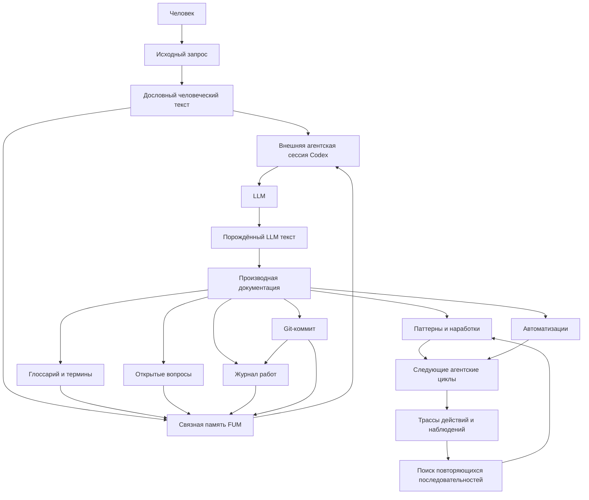

# Modelj [pamyati FUM](../Glossarij/pamyatj-FUM.md)

[FUM](../Glossarij/FUM.md) razrabatyivayetsya kak otkryityij agent sleduyusjhego pokoleniya: sistema, kotoraya ne toljko vyipolnyayet otdeljnyiye zadachi, no i nakaplivayet svyaznuyu [pamyatj](../Glossarij/pamyatj-FUM.md) o sobstvennom razvitii, trebovaniyakh, resheniyakh, [issledovaniyakh](../Glossarij/nauchnoye-issledovaniye-FUM.md) i proiskhozhdenii etikh reshenij. Celevoj gorizont [FUM](../Glossarij/FUM.md) - agent polnogo cikla razrabotki i [issledovaniya](../Glossarij/nauchnoye-issledovaniye-FUM.md), sposobnyij prokhoditj putj ot vyirabotki trebovanij i postanovki gipotez do napisaniya koda, [eksperimentov](../Glossarij/eksperiment-FUM.md), proverki rezuljtatov i oformleniya [otkryitij](../Glossarij/otkryitiye-FUM.md).

## Rolj [pamyati](../Glossarij/pamyatj-FUM.md)

[Pamyatj FUM](../Glossarij/pamyatj-FUM.md) dolzhna byitj proveryayemoj i publikuyemoj. Kazhdyij znachimyij zapros sokhranyayetsya kak [pervichnyij istochnik](../Glossarij/iskhodnyij-zapros.md), a [proizvodnaya dokumentaciya](../Glossarij/proizvodnaya-dokumentaciya.md) pokazyivayet, kak etot istochnik prevrasjhayetsya v trebovaniya, opisaniya i proyektnyiye resheniya.

Na dokumentacionnoj stadii tekusjhij repozitorij sluzhit [dokumentacionnyim prototipom FUM](../Glossarij/dokumentacionnyij-prototip-FUM.md). Eto oznachayet, chto [pamyatj](../Glossarij/pamyatj-FUM.md) uzhe proveryayetsya kak budusjhaya rabochaya forma: vkhodyi, dokumentyi, terminyi, avtomatizacii, proverki, zhurnal i Git-istoriya svyazanyi tak, chtobyi pozzhe statj dannyimi i kontraktami [korobochnoj realizacii FUM](../Glossarij/korobochnaya-realizaciya-FUM.md).

## Tekstovyij sostav dokumentacionnogo prototipa

V grubom soderzhateljnom priblizhenii tekusjhaya [pamyatj FUM](../Glossarij/pamyatj-FUM.md) na stadii [dokumentacionnogo prototipa](../Glossarij/dokumentacionnyij-prototip-FUM.md) sostoit iz teksta, porozhdyonnogo chelovekom, i teksta, porozhdyonnogo LLM vo vneshnej agentskoj sessii Codex. Eto dva svyazannyikh, no razlichimyikh po proiskhozhdeniyu sloya: chelovek zadayot iskhodnyiye formulirovki, namereniya, ogranicheniya i podtverzhdeniya, a LLM porozhdayet i pererabatyivayet proizvodnuyu dokumentaciyu, glossarij, zhurnaljnyiye otchyotyi i drugiye rabochiye tekstyi.

Codex v etoj formule oboznachayet vneshnij agentskij kontur, kotoryij chitayet kontekst, vyizyivayet instrumentyi, vnosit izmeneniya, provodit proverki i fiksiruyet sessiyu. Nazvaniye ChatGPT oboznachayet nablyudayemuyu poverkhnostj tekusjhej rabotyi i ne podmenyayet otdeljnyiye sloi aktivnoj modeli, agentskoj sessii, runtime, CLI i instrumentaljnyikh kontraktov. Poetomu iskhodnyij tezis ob «LLM ChatGPT v cikle Codex-agenta» v tekhnicheskom opisanii razvorachivayetsya v eti razlichimyiye roli.

Eto priblizheniye ne svodit vsyu pamyatj k tekstu. Kod, strukturirovannyiye dannyiye, ssyilki, metadannyiye, testyi, importirovannyiye istochniki, vlozheniya i Git-istoriya tozhe vkhodyat v [pamyatj FUM](../Glossarij/pamyatj-FUM.md). Dvukhslojnaya tekstovaya formula opisyivayet dominiruyusjhij semanticheskij nositelj nyineshnej stadii i yeyo proiskhozhdeniye, no ne celevuyu ontologiyu FUM.

Vneshnyaya sessiya Codex ne yavlyayetsya sobstvennyim ispolnyayemyim [agentskim ciklom](../Glossarij/agentskij-cikl.md) FUM: modelj, sozdaniye zadach i orkestraciya ostayutsya vo vneshnej srede. V dejstvuyusjhej ruchnoj skheme poljzovatelj sam zapuskayet kazhduyu pishusjhuyu zadachu, a Git-pamyatj sluzhit nositelem prichinnoj nepreryivnosti: lokaljnyij rezuljtat odnoj zavershyonnoj sessii menyayet dostupnyij kontekst sleduyusjhej. Zaraneye sozdavayemoye [obyazateljnoye prodolzheniye vetki](../Glossarij/obyazateljnoye-prodolzheniye-vetki.md), FIFO, povtornyij vyibor shaga i atomarnaya peredacha sokhranenyi kak otlozhennyij povedencheskij prototip, a ne kak tekusjhij marshrut zapisi.

Poljzovateljskaya zadacha vkhodit v etot kontur kak novyij [nablyudayemyij vkhodnoj signal](../Glossarij/nablyudayemyij-vkhodnoj-signal.md). Izmenyaya trebovaniya ili pamyatj, ona mozhet perenapravitj posleduyusjhuyu nablyudayemuyu celj, prioritet, plan, dejstviye ili proverku; odnovremennoj vtoroj pishusjhej zadachi dejstvuyusjhaya skhema ne dopuskayet. Korobochnyij runtime dolzhen umenjshitj granulyarnostj etoj svyazi ot otpravlennyikh soobsjhenij k razreshyonnomu potoku sobyitij vo vremya aktivnogo cikla; eto ne trebuyet nepreryivnogo inference ili sokhraneniya skryityikh rassuzhdenij.

## Vyisokourovnevaya istoriya rabot

[Zhurnal rabot](../Glossarij/zhurnal-rabot.md) dobavlyayet k [pamyati FUM](../Glossarij/pamyatj-FUM.md) sloj chelovekochitayemoj istorii. Kazhdaya [papka zaprosa](../Glossarij/papka-zaprosa.md) obyyedinyayet doslovnyij [iskhodnyij zapros](../Glossarij/iskhodnyij-zapros.md), otchyot i prinadlezhasjhiye zaprosu materialyi obsjhej vremennoj identichnostjyu. Zhurnal ne podmenyayet [proizvodnuyu dokumentaciyu](../Glossarij/proizvodnaya-dokumentaciya.md), proverki ili Git-kommityi, a svyazyivayet ikh s pervichnyim trebovaniyem i obzorom togo, chto byilo sdelano i zachem.

Takoj sloj nuzhen, chtobyi razvitiye [pamyati](../Glossarij/pamyatj-FUM.md) mozhno byilo chitatj ne toljko kak posledovateljnostj fajlovyikh izmenenij, no i kak istoriyu rabochikh namerenij, reshenij, rezuljtatov i sleduyusjhikh vozmozhnyikh shagov.

## Skhema [pamyati FUM](../Glossarij/pamyatj-FUM.md)

## Fizicheskiye roli pamyati

Celevaya pamyatj ne svoditsya k odnomu khranilisjhu. Git sokhranyayet prinyatuyu konstituciyu trebovanij, reshenij, kontraktov i koda; dopisyivayemyij zhurnal epizodov khranit polnyiye kanonicheskiye sobyitiya; tranzakcionnyij sloj obsluzhivayet aktivnoye sostoyaniye i konkuriruyusjhiye zapisi; poiskovyiye, grafovyiye i vektornyiye indeksyi ostayutsya perestraivayemyimi proyekciyami; krupnyiye artefaktyi mogut nakhoditjsya v adresuyemom obyyektnom sloye s khyeshem, proiskhozhdeniyem i rezhimom dostupa.

Ni kyesh, ni indeks ne stanovitsya skryityim istochnikom istinyi. Proizvodnoye sostoyaniye dolzhno vosstanavlivatjsya iz prinyatoj istorii i zhurnala po zakreplyonnyim versiyam preobrazovanij. Razlichiye bajtovoj celostnosti, strukturnoj soglasovannosti, vyivodimosti, proiskhozhdeniya, podlinnosti i istinnosti podrobno zakrepleno v dokumente [Proveryayemaya vosproizvodimostj i eksperimentaljnaya priyomka FUM](46-proveryayemaya-vosproizvodimostj-i-eksperimentaljnaya-priyomka-FUM.md).

## Upravlyayemoye zabyivaniye, porog aktivacii i vosstanovleniye

[Upravlyayemoye zabyivaniye FUM](../Glossarij/upravlyayemoye-zabyivaniye-FUM.md) yavlyayetsya otborom nad pryamyim operacionnyim vliyaniyem proizvodnyikh struktur pamyati v obyichnom rabochem konture. Ogranichennaya aktivnaya pamyatj ne dolzhna beskonechno podderzhivatj kazhdyij indeks, marshrut, kandidatnyij pattern, operator ili modulj: sokhranyayusjhaya poljzu struktura podtverzhdayetsya, ispravlyayetsya libo peresmatrivayetsya, a davno ne ispoljzovavshayasya oslablyayetsya i mozhet perestatj vyipolnyatj prezhnyuyu funkciyu.

Modelj razlichayet aktivnyij ves, porog aktivacii, pokonturnuyu oblastj rabotosposobnosti i dostatochnostj osnovaniya vosstanovleniya, ne zakreplyaya poka ikh ispolnyayemoye predstavleniye. Nizhe poroga mekhanizm ne rabotayet v dannom konture dazhe pri nenulevom vese; nolj yavlyayetsya vozmozhnyim predelom, a ne opredeleniyem zabyivaniya. Odin obyyekt mozhet ostavatjsya aktivnyim ili obyazateljnyim dlya drugogo nablyudatelya, zadachi, runtime libo operacii, poetomu razborka zapresjhena pri nalichii zasjhisjhyonnogo aktivnogo kontura ili zavisimosti. Zabyivaniye ostayotsya obratimyim, yesli identichnostj, kholodnyij arkhiv, proiskhozhdeniye, recept postroyeniya i zavisimosti obrazuyut dostatochnoye razreshyonnoye osnovaniye dlya [vspominaniya FUM](../Glossarij/vspominaniye-FUM.md); budusjhaya realizaciya dolzhna podtverzhdatj dostatochnostj vosstanoviteljnyim progonom v zadannom gorizonte, a ne toljko nalichiyem recepta.

Bezvozvratnostj utverzhdayetsya toljko dlya yavno nazvannoj oblasti vosstanovleniya, gde dostatochnogo dopustimogo osnovaniya ustojchivo ne ostalosj; vremennaya poterya klyucha, ACL, seti ili uzla yeyo ne dokazyivayet. Tochnaya razreshyonnaya replika s nepreryivnoj identichnostjyu i proiskhozhdeniyem sokhranyayet vozmozhnostj vspominaniya, togda kak nezavisimyij skhodnyij istochnik sozdayot novoye obucheniye. Fizicheskoye udaleniye yavlyayetsya otdeljnoj polnomochnoj operaciyej khraneniya. Yego kontrakt otdelyayet payload ot sokhranyayemogo bessoderzhateljnogo sobyitiya, udalyayet v kontroliruyemoj oblasti okhvachennyiye pervichnyiye kopii, rezervnyiye kopii, kyeshi, indeksyi, embeddingi i inyiye soderzhateljnyiye proizvodnyiye, invalidiruyet dopustimyiye bessoderzhateljnyiye ssyilki i yavno soobsjhayet o vneshnikh ili avtonomnyikh kopiyakh, udaleniye kotoryikh ne dokazano.

Yesli resursyi i pravila dostupa pozvolyayut, ves nizhe poroga ne trebuyet unichtozheniya soderzhimogo. Kholodnyij arkhiv yavlyayetsya klassom khraneniya s inoj cenoj, zaderzhkoj ili dostupnostjyu i mozhet khranitj identichnostj strukturyi, yeyo proiskhozhdeniye, istoriyu vesa, porog i prichinu zabyivaniya. FUM dolzhen obnaruzhivatj otsutstviye ozhidayemogo mekhanizma nezavisimo ot zabyivayemogo rabochego indeksa, no tochnoye predstavleniye etogo meta-urovnya poka ne vyibrano. Novaya potrebnostj ili nablyudayemyij otkaz zapuskayet otdeljnyij poisk vosstanovleniya, sozdaniye kandidata i proverku yego aktualjnosti pered naznacheniyem novogo vesa; obyichnyij poisk ne dolzhen skryito vozvrasjhatj mekhanizm v dejstviye. Aktivnyij ves ne smeshivayetsya s istinnostjyu, doveriyem, celostnostjyu khraneniya, klassom khraneniya i prioritetom izvlecheniya.

Skorostj zabyivaniya i kriterii yeyo regulirovaniya sami prokhodyat otbor. Politika zadayotsya versionno dlya konkretnogo tempa pamyati, zadachi, nablyudatelya i riska i ocenivayetsya po kachestvu posleduyusjhikh predskazanij i dejstvij, cene oshibochnogo zabyivaniya, stoimosti i tochnosti vspominaniya ili novogo obucheniya i sokhraneniyu redkikh kritichnyikh signalov. Avtomaticheskij otbor ne izmenyayet poljzovateljskiye pravila khraneniya, udaleniya i dostupa, zasjhitu pervichnyikh istochnikov i obyazateljnyiye ogranicheniya bezopasnosti bez otdeljnogo polnomochnogo sobyitiya. Issledovaniye togo, chto i pochemu byilo zabyito, vkhodit v obucheniye toljko kak novyij otdeljno prinyatyij artefakt s sobstvennyim proiskhozhdeniyem, a ne kak skryitoye vozvrasjheniye soderzhimogo kholodnogo arkhiva v aktivnuyu pamyatj.

[Profilj vnimaniya FUM](../Glossarij/profilj-vnimaniya-FUM.md) upravlyayet resursom izvlecheniya, nablyudeniya, proverki i osvezheniya, no ne podmenyayet aktivnyij ves mekhanizma ili sostoyaniye khraneniya. Chastyiye znachimyiye i potencialjno ustranimyiye oshibki mogut poroditj kandidatnoye uvelicheniye vnimaniya, zamedlitj obratimoye zabyivaniye i pri otsutstvii ozhidayemogo mekhanizma zapustitj vspominaniye. Ustojchivaya kalibrovannaya predskazuyemostj i otsutstviye oshibok pri dostatochnom pokryitii mogut umenjshitj dopolniteljnoye vnimaniye i obyichnuyu dostupnostj proizvodnyikh struktur. Ponizhennoye vnimaniye sokhranyayet storozhevuyu vyiborku: bez neyo otsutstviye nablyudayemyikh oshibok byilo byi sledstviyem samooslepleniya, a ne svideteljstvom predskazuyemosti.

Oblastj zabyivaniya zavisit ot topologii FUM i roli materiala. Dlya lichnogo FUM na odnoj mashine vkhodnaya sensornaya informaciya, razreshyonnaya imenno k dolgovremennomu khraneniyu i dopustimaya po pravam subyyektov dannyikh, pri dostatochnom byudzhete po umolchaniyu ostayotsya zasjhisjhyonnyim pervichnyim osnovaniyem. Etu rolj poluchayet syiroj zakhvat libo zaraneye razreshyonnoye proiskhozhdyonnoye szhatiye, prinyatoye kak yedinstvennaya kanonicheskaya zapisj; zamena uzhe prinyatogo syirogo originala svodkoj schitayetsya otdeljnyim neobratimyim udaleniyem. U zapisi mogut menyatjsya klass khraneniya i prioritet izvlecheniya, no ona ne zabyivayetsya avtomaticheski radi proizvodnoj II-strukturyi. Pri ischerpanii byudzheta snachala ustranyayutsya perestraivayemyiye proizvodnyiye dannyiye, zatem ogranichivayetsya ili ostanavlivayetsya novyij sbor i zaprashivayetsya polnomochnoye resheniye; deficit sam po sebe ne razreshayet udalitj prinyatyij pervichnyij material. V decentralizovannoj seti cena khraneniya, peredachi i soglasovaniya delayet zabyivaniye proizvodnyikh osobenno poleznyim, ne davaya odnomu uzlu prava stiratj pervichnuyu pamyatj drugogo ili trebovatj yeyo globaljnoj replikacii.

## [Navigaciya po pamyati FUM](../Glossarij/navigaciya-po-pamyati-FUM.md) kak vkhodnoj signal

[Navigaciya po pamyati FUM](../Glossarij/navigaciya-po-pamyati-FUM.md) ne dolzhna teryatjsya kak vtorichnyij interfejsnyij zhest. Dlya [pamyati FUM](../Glossarij/pamyatj-FUM.md) znachimyi otkryitiye dokumenta, perekhod po ssyilke, poisk, prokrutka, vyibor fragmenta, vozvrat k prezhnemu mestu i drugoj putj poljzovatelya ili agenta po materialam [pamyati](../Glossarij/pamyatj-FUM.md).

[FUM](../Glossarij/FUM.md) dolzhen rassmatrivatj [navigaciyu po pamyati FUM](../Glossarij/navigaciya-po-pamyati-FUM.md) kak [nablyudayemyij vkhodnoj signal](../Glossarij/nablyudayemyij-vkhodnoj-signal.md) naravne s sozdaniyem [iskhodnogo zaprosa](../Glossarij/iskhodnyij-zapros.md). Eto trebovaniye ne zavisit ot modaljnosti vvoda: klaviaturyi, myishi, trekpada, drugikh graficheskikh ustrojstv, audiovvoda ili budusjhikh interfejsov.

V [pamyati](../Glossarij/pamyatj-FUM.md) dolzhen sokhranyatjsya ne toljko itogovyij otkryityij fragment, no i nablyudayemyij putj: iskhodnaya poziciya, celevoj obyyekt, sposob perekhoda, posledovateljnostj sobyitij, vremya i svyazj s posleduyusjhimi dejstviyami [agentskogo cikla](../Glossarij/agentskij-cikl.md).

## [Pamyatj](../Glossarij/pamyatj-FUM.md) shagov i [patternov](../Glossarij/pattern-pamyati.md)

[FUM](../Glossarij/FUM.md) dolzhen zapominatj ne toljko vneshniye trebovaniya i itogovyiye resheniya, no i sobstvennyiye shagi: vyibrannyiye dejstviya, poluchennyiye nablyudeniya, promezhutochnyiye sostoyaniya, oshibki, vozvratyi i uspeshnyiye perekhodyi. Takaya [pamyatj](../Glossarij/pamyatj-FUM.md) delayet trayektoriyu rabotyi samostoyateljnyim obyyektom analiza.

Na osnove nakoplennyikh shagov [FUM](../Glossarij/FUM.md) dolzhen vyiyavlyatj povtoryayusjhiyesya posledovateljnosti nablyudenij i dejstvij. Povtoryayemostj sama po sebe ne schitayetsya dostatochnoj: posledovateljnosti dolzhnyi prokhoditj otbor po ustojchivosti, primenimosti i svyazi s rezuljtatami. Zakreplyonnyiye takim obrazom [patternyi](../Glossarij/pattern-pamyati.md) stanovyatsya materialom dlya sleduyusjhikh [agentskikh ciklov](../Glossarij/agentskij-cikl.md), workflow i [modulej](../Glossarij/modulj-FUM.md) [pamyati](../Glossarij/pamyatj-FUM.md).

Mekhanizm vyiyavleniya povtoryayemosti dolzhen byitj obobsjhyon za predelyi posledovateljnostej dejstvij agenta. [Pamyatj FUM](../Glossarij/pamyatj-FUM.md) dolzhna umetj primenyatj odin i tot zhe princip k bajtam, tekstovyim yedinicam, strukturirovannyim sobyitiyam, sostoyaniyam, trassam i uzhe najdennyim [patternam](../Glossarij/pattern-pamyati.md). Podrobnoye trebovaniye opisano v dokumente [Obobsjhyonnyij poisk povtoryayusjhikhsya posledovateljnostej](08-obobsjhyonnyij-poisk-povtoryayusjhikhsya-posledovateljnostej.md) i termine [obobsjhyonnyij poisk povtoryayusjhikhsya posledovateljnostej](../Glossarij/obobsjhyonnyij-poisk-povtoryayusjhikhsya-posledovateljnostej.md).

Nizhnim utochneniyem etoj modeli yavlyayetsya [potokovaya samostrukturizaciya FUM](../Glossarij/potokovaya-samostrukturizaciya-FUM.md). [Pamyatj](../Glossarij/pamyatj-FUM.md) dolzhna khranitj ne toljko gotovyiye dokumentyi i shagi, no i byistryiye statisticheskiye gipotezyi o yedinicakh potoka: bajtovyikh regulyarnostyakh, skryityikh kodakh, morfemopodobnyikh fragmentakh, slovopodobnyikh blokakh, klassakh zamenyayemosti, konstrukciyakh i sobyitijnyikh skhemakh. Takiye gipotezyi prokhodyat putj ot [suffiksno-prediktivnoj pamyati FUM](../Glossarij/suffiksno-prediktivnaya-pamyatj-FUM.md) k [patternam pamyati](../Glossarij/pattern-pamyati.md), a zatem, pri dostatochnoj poljze i proverke, k [kontroliruyemoj nejroplastichnosti FUM](../Glossarij/kontroliruyemaya-nejroplastichnostj-FUM.md).

Minimaljnyim rabochim yadrom etoj linii yavlyayetsya pamyatj [strukturiruyusjhikh operatorov FUM](../Glossarij/strukturiruyusjhij-operator-FUM.md). Ona khranit ne toljko to, chto sistema sama vyivela iz potoka, no i predvariteljnyiye znaniya, zadannyiye chelovekom, LLM ili avtomatizaciyej: formyi raspoznavaniya, pravila porozhdeniya, priznaki, usloviya primenimosti, ogranicheniya, cenu, doveriye, proiskhozhdeniye i istoriyu podtverzhdenij. Takaya pamyatj dolzhna popolnyatjsya kak zaraneye, tak i v processe analiza vkhodnogo potoka, no kazhdoye popolneniye ocenivayetsya po tomu, delayet li ono opisaniye potoka kompaktneye, predskazuyemeye i polezneye dlya posleduyusjhej obrabotki.

Strukturiruyusjhiye operatoryi v pamyati dolzhnyi obrazovyivatj iyerarkhiyu, a ne odin obsjhij sloj pravil. V rabochej forme eto ne chistoye derevo, a mnogourovnevyij graf: nizkaya forma mozhet uchastvovatj v neskoljkikh sintaksicheskikh, semanticheskikh i diskursivnyikh svyazyakh. Nizkiye operatoryi mogut byitj privyazanyi k konkretnomu yazyiku, pisjmennosti ili formatu: naprimer, k russkomu okonchaniyu, suffiksu, variantu transliteracii ili svyazi kirillicheskoj i latinskoj zapisi. Boleye vyisokiye operatoryi dolzhnyi svyazyivatj uzhe semanticheskiye strukturyi: oni mogut soyedinyatj russkiye i anglijskiye konstrukcii, yesli sokhranyayut obsjhij smyisl, rolj v vyiskazyivanii ili perevodimyij shablon i yavno ukazyivayut, kakiye poverkhnostnyiye detali, yazyikovo-specifichnyiye priznaki i smyislovyiye ottenki teryayutsya ili ostayutsya kak ostatok.

Nedostayusjhij strukturiruyusjhij element yavlyayetsya diagnosticheskim signalom. On mozhet oznachatj oshibku, shum, nepolnotu ili netochnostj vkhodnogo potoka; mozhet oznachatj, chto tekusjhaya pamyatj operatorov nedostatochna; a mozhet ukazyivatj na poleznuyu novuyu formu. Poetomu [pamyatj FUM](../Glossarij/pamyatj-FUM.md) dolzhna khranitj ne toljko prinyatyiye operatoryi, no i ostatki razbora, chastichnyiye sovpadeniya, konfliktyi, otklonyonnyiye kandidatyi, prichinyi otkaza, sluchai neodnoznachnosti i svyazj mezhdu vyiigryishem szhatiya, kachestvom predskazaniya, obratnyim porozhdeniyem i stoimostjyu khraneniya. Kandidatyi mogut zhitj v statusakh gipotezyi, nizkodoveriteljnogo operatora, podtverzhdyonnogo operatora, otklonyonnogo operatora ili ustarevshego operatora.

V etoj roli pamyatj strukturiruyusjhikh operatorov yavlyayetsya yesjhyo i sloyem obyyasnimosti. Ona ne raskryivayet vesa LLM napryamuyu, no sozdayot vneshnij simvolicheskij interfejs mezhdu neyavnyimi znaniyami cheloveka i neyavnyimi znaniyami LLM, gde obe storonyi mogut sami i sovmestno predyyavlyatj znaniya v forme proveryayemyikh operatorov. Dlya [pamyati FUM](../Glossarij/pamyatj-FUM.md) vazhno khranitj ne toljko itogovyij operator, no i svyazj mezhdu chelovecheskim obyyasneniyem, LLM-obyyasneniyem, primerami primeneniya, povedeniyem modeli, proverkami, najdennyimi oshibkami, nedostayusjhimi strukturami i ekonomiyej resursov daljnejshego vyivoda.

V boleye obsjhej forme eta liniya obrazuyet [sistemu strukturiruyusjhikh operatorov FUM](../Glossarij/sistema-strukturiruyusjhikh-operatorov-FUM.md). Dlya modeli pamyati eto oznachayet, chto operatornaya pamyatj khranit ne toljko lokaljnyiye formyi razbora, no i obsjhij graf perekhodov mezhdu potokami, simvolicheskimi obyyasneniyami, avtomatizaciyami, modulyami, dejstviyami i proverkami.

## Tekstovo-yazyikovoj sloj vneshnej pamyati

Dlya sovmestnogo kontura cheloveka i LLM [tekstovo-yazyikovyiye strukturiruyusjhiye operatoryi FUM](../Glossarij/tekstovo-yazyikovoj-strukturiruyusjhij-operator-FUM.md) yavlyayutsya prioritetnyim profilem operatornoj pamyati. Ikh ustojchivyij graf vneshen po otnosheniyu k biologicheskoj pamyati cheloveka, parametram i tekusjhemu kontekstu LLM, no vkhodit v [pamyatj FUM](../Glossarij/pamyatj-FUM.md) i v predelakh razreshyonnogo dostupa mozhet byitj prochitan, porozhdyon, proveren, ispravlen i povtorno ispoljzovan obeimi storonami.

Tekstovyij nositelj i yazyikovaya struktura v etom profile razlichayutsya. Tekst dayot adresuyemuyu zapisj, pisjmennostj, razmetku i dokumentnuyu formu; yazyik zadayot leksiku, morfologiyu, sintaksis, semantiku, pragmatiku i diskurs. Operator svyazyivayet eti urovni dvunapravlenno i sokhranyayet proiskhozhdeniye, aljternativnyiye prochteniya, ogranicheniya, diagnosticheskij ostatok, a takzhe tochnyij ili smyislovoj rezhim vosstanovimosti.

Preimusjhestvo etogo sloya yavlyayetsya prakticheskim: odnu zapisj mozhno iskatj, citirovatj, svyazyivatj, sravnivatj po versiyam, predyyavlyatj cheloveku i povtorno pomesjhatj v kontekst LLM posle razryiva rabochej sessii. Eto ne delayet tekst polnoj kopiyej vnutrennego sostoyaniya i ne pozvolyayet zamenyatj im syiroj istochnik, izobrazheniye, zvuk, dejstviye, formaljnuyu mashinnuyu strukturu ili druguyu modaljnostj; pamyatj dolzhna sokhranyatj svyazi s takim materialom i izvestnyiye poteri proyekcii.

V tekstovom voplosjhenii [lichnogo FUM-agenta](../Glossarij/lichnyij-FUM-agent.md) etot sloj mozhet predyyavlyatjsya cheloveku kak Obsidian-podobnaya pamyatj vzaimosvyazannyikh tekstov: adresuyemyikh fragmentov, dokumentov i dostupnyikh perekhodov mezhdu nimi. Skhodstvo otnositsya k chelovekochitayemoj forme, a ne k ruchnomu sposobu sozdaniya vsej svyaznosti. Poljzovatelj ne dolzhen byitj obyazan zaraneye rasstavitj kazhduyu smyislovuyu ssyilku, chtobyi svyazannyij kontekst stal dostupen pamyati.

Ispolniteljnyij sloj FUM s pomosjhjyu [sistemyi strukturiruyusjhikh operatorov FUM](../Glossarij/sistema-strukturiruyusjhikh-operatorov-FUM.md) dolzhen avtomaticheski vyiyavlyatj vozmozhnyiye semanticheskiye otnosheniya mezhdu fragmentami i predyyavlyatj ikh kak tipizirovannyiye [perekhodyi navigacii](../Glossarij/navigaciya-po-pamyati-FUM.md). Takoj perekhod mozhet vyichislyatjsya po zaprosu libo materializovatjsya kak Markdown-ssyilka, rebro grafa, rekomendaciya ili marshrut. Dlya kazhdoj svyazi razdeljno sokhranyayutsya iniciator predlozheniya ili vyivoda (chelovek, LLM libo avtomatizaciya), ispolniteljnyij kontur, primenyonnyij operator, iskhodnyiye materialyi i ikh proiskhozhdeniye, status proverki (kandidatnaya, podtverzhdyonnaya libo otklonyonnaya svyazj) i forma predyyavleniya. Iniciator ili sposob vyivoda sam po sebe ne dokazyivayet istinnostj svyazi.

## Pamyatj yazyikovoj sinkhronizacii znanij

V seti agentov chelovecheskogo obrazca yestestvennyij yazyik yavlyayetsya yazyikom [sinkhronizacii znanij FUM](../Glossarij/yestestvenno-yazyikovaya-sinkhronizaciya-znanij-FUM.md). Dlya znachimogo yazyikovogo akta, kotoryij razresheno fiksirovatj i kotoryij povliyal na pamyatj ili dejstviye, dolzhno sokhranyatjsya sobyitiye obnovleniya: iskhodnaya forma libo dopustimaya proizvodnaya zapisj, avtor i adresatyi, kontekst, referentyi, interpretaciya, modaljnostj, dokazateljnostj, rechevoj akt, proiskhozhdeniye i sdelannoye na yego osnove izmeneniye lokaljnoj modeli ili obsjhej rabochej oblasti. Vyibor mezhdu iskhodnoj i proizvodnoj zapisjyu dolzhen uchityivatj privatnostj, urovenj dostupa, srok khraneniya i pravo uchastnika na fiksaciyu.

Pamyatj dolzhna razlichatj soobsjheniye drugogo uzla, sobstvennuyu interpretaciyu FUM, prinyatoye rabocheye znaniye, podtverzhdyonnyij rezuljtat i sokhranivsheyesya raskhozhdeniye. Otvetyi, voprosyi, utochneniya, vzaimnyij pereskaz, vozrazheniya i ispravleniya yavlyayutsya ne sluzhebnyim shumom vokrug soderzhaniya, a nablyudeniyami o kachestve sinkhronizacii. Oni dolzhnyi pozvolyatj vosstanovitj, pochemu predstavleniye izmenilosj, gde uchastniki dostigli dostatochnoj sovmestimosti i chto ostalosj neizvestnyim ili spornyim.

Takaya pamyatj ne sozdayot yedinogo globaljnogo sostoyaniya dlya vsej seti. Lyudi, LLM-podderzhivayemyiye agentyi i vnutrenniye poduzlyi sokhranyayut lokaljnyiye, chastichnyiye i razlichayusjhiyesya sostoyaniya; obsjhaya pamyatj khranit toljko dostupnuyu uchastnikam chastj, istoriyu soglasovaniya, versii, zaderzhki, ogranicheniya dostupa i izvestnyiye poteri. Podrobnyij kontur opisan v dokumente [Yestestvennyij yazyik i sinkhronizaciya znanij FUM](34-yestestvennyij-yazyik-i-sinkhronizaciya-znanij-FUM.md).

## [Pamyatj](../Glossarij/pamyatj-FUM.md) [avtomatizacij](../Glossarij/avtomatizaciya-FUM.md)

Ustojchivyiye [avtomatizacii FUM](../Glossarij/avtomatizaciya-FUM.md) dolzhnyi vkhoditj v [pamyatj](../Glossarij/pamyatj-FUM.md) ne toljko kak rezuljtatyi rabotyi, no i kak vosstanovimyiye istochniki povedeniya. Dlya nikh sokhranyayutsya iskhodnyiye tekstyi, konfiguracii, versii, vkhodnyiye i vyikhodnyiye skhemyi, testyi, trassyi zapuskov i istoriya izmenenij.

[Pamyatj FUM](../Glossarij/pamyatj-FUM.md) dolzhna pozvolyatj vosstanovitj, pochemu konkretnaya avtomatizaciya vosprinyala signal, vyibrala dejstviye, postroila vizualizaciyu na displeye ili izmenila sostoyaniye imenno tak. Yesli povedeniye zavisit ot vneshnego servisa, vremeni, sluchajnosti, modeli ili nedostupnogo sostoyaniya, eti zavisimosti dolzhnyi byitj yavno zafiksirovanyi.

[Avtomaticheskiye organyi vospriyatiya FUM](../Glossarij/avtomaticheskij-organ-vospriyatiya-FUM.md) dobavlyayut k etoj modeli pervichnoye szhatiye vneshnikh sobyitij. Kogda vkhodnoj potok slishkom shirok dlya polnogo pryamogo zapominaniya, [FUM](../Glossarij/FUM.md) dolzhen sokhranyatj kompaktnoye opisaniye, dostatochnoye dlya obrabotki LLM vnutri sistemyi, a takzhe proiskhozhdeniye, vremya, kanal, ogranicheniya i izvestnyiye poteri detalej.

Ideya [chistyikh funkcij](../Glossarij/chistaya-funkciya.md) ispoljzuyetsya kak predpochtiteljnyij pattern: preobrazovaniya dannyikh i postroyeniye reshenij po vozmozhnosti otdelyayutsya ot pobochnyikh effektov, a dejstviya, vyizovyi instrumentov, zapisj fajlov, interfejsnoye otobrazheniye i fizicheskoye vozdejstviye fiksiruyutsya otdeljnyimi nablyudayemyimi shagami. Podrobnoye trebovaniye opisano v dokumente [Vosproizvodimyiye avtomatizacii FUM](17-vosproizvodimyiye-avtomatizacii.md).

## Dostup k [vnutrennim sostoyaniyam](../Glossarij/vnutrenneye-sostoyaniye.md)

[Pamyatj FUM](../Glossarij/pamyatj-FUM.md) trebuyet dostupa ko vsem sobstvennyim [vnutrennim sostoyaniyam](../Glossarij/vnutrenneye-sostoyaniye.md) agenta. Agent dolzhen videtj i obrabatyivatj ne toljko vneshniye rezuljtatyi instrumentov, no i sobstvennyiye rabochiye sostoyaniya: celi, planyi, aktivnyiye [vetki](../Glossarij/vetka-rabotyi.md), promezhutochnyiye rezuljtatyi, oshibki, sostoyaniye interfejsa i dannyiye, iz kotoryikh etot interfejs postroyen.

Yesli informaciya otobrazhayetsya poljzovatelyu, ona dolzhna byitj dostupna [FUM](../Glossarij/FUM.md) kak nablyudeniye. Inache [pamyatj](../Glossarij/pamyatj-FUM.md) stanovitsya nepolnoj: agent ne mozhet vosstanovitj sobstvennyij khod rabotyi, vyiyavitj [pattern](../Glossarij/pattern-pamyati.md) ili ispravitj oshibku, yesli znachimaya chastj sostoyaniya byila vidima cheloveku, no nevidima samomu agentu.

Podrobnoye trebovaniye k nablyudayemosti [vnutrennikh sostoyanij](../Glossarij/vnutrenneye-sostoyaniye.md) opisano v dokumente [Dostup k vnutrennim sostoyaniyam](07-dostup-k-vnutrennim-sostoyaniyam.md).

## Obmen [narabotkami](../Glossarij/narabotka.md) mezhdu uzlami

Samosovershenstvovaniye [FUM](../Glossarij/FUM.md) trebuyet, chtobyi nakoplennyiye [narabotki](../Glossarij/narabotka.md) mogli sokhranyatjsya ne toljko vnutri odnogo uzla, no i peredavatjsya drugim uzlam v ustojchivoj forme. [Narabotka](../Glossarij/narabotka.md) stanovitsya perenosimoj yedinicej [pamyati](../Glossarij/pamyatj-FUM.md), yesli vmeste s soderzhaniyem sokhranyayet proiskhozhdeniye, versiyu, usloviya primenimosti, proverochnyij status i [urovenj dostupa](../Glossarij/urovenj-dostupa.md).

[FUM](../Glossarij/FUM.md) dolzhen takzhe umetj zaimstvovatj [narabotki](../Glossarij/narabotka.md) ot drugikh uzlov, k kotoryim predostavlen dostup. Takoye zaimstvovaniye ne yavlyayetsya prostyim kopirovaniyem: [pamyatj](../Glossarij/pamyatj-FUM.md) dolzhna proveritj prava ispoljzovaniya, sovmestimostj, proiskhozhdeniye, ogranicheniya daljnejshej peredachi i vozmozhnyiye konfliktyi s uzhe zakreplyonnyimi trebovaniyami.

Podrobnoye trebovaniye k obmenu [narabotkami](../Glossarij/narabotka.md) i [urovnyam dostupa](../Glossarij/urovenj-dostupa.md) opisano v dokumente [Obmen narabotkami i urovni dostupa](09-obmen-narabotkami-i-urovni-dostupa.md).

## Modeli drugikh uzlov

[Pamyatj FUM](../Glossarij/pamyatj-FUM.md) dolzhna vklyuchatj [vnutrenniye modeli drugikh FUM-uzlov](../Glossarij/vnutrennyaya-modelj-drugogo-uzla.md), s kotoryimi agent vzaimodejstvuyet. Takaya modelj fiksiruyet istoriyu svyazi, dostupnyiye kanalyi, izvestnyiye celi i ogranicheniya uzla, sovmestimostj [narabotok](../Glossarij/narabotka.md), urovenj doveriya, proiskhozhdeniye svedenij i [granicyi dostupa](../Glossarij/urovenj-dostupa.md).

Lyudi rassmatrivayutsya kak [FUM-uzlyi](../Glossarij/FUM-uzel.md): pri vzaimodejstvii s chelovekom [FUM](../Glossarij/FUM.md) dolzhen podderzhivatj modelj, kotoraya pomogayet ponimatj kontekst sovmestnoj rabotyi, no ne pretenduyet na polnyij dostup k [vnutrennemu sostoyaniyu](../Glossarij/vnutrenneye-sostoyaniye.md) cheloveka. [Pamyatj](../Glossarij/pamyatj-FUM.md) dolzhna razlichatj pryamyiye slova cheloveka, nablyudeniya, proizvodnyiye vyivodyi, neizvestnostj i svedeniya, kotoryiye neljzya peredavatj daljshe.

Podrobnoye trebovaniye k [vnutrennim modelyam vzaimodejstvuyusjhikh uzlov](../Glossarij/vnutrennyaya-modelj-drugogo-uzla.md) opisano v dokumente [Vnutrenniye modeli drugikh uzlov](10-vnutrenniye-modeli-drugikh-uzlov.md).

## Gibridnyiye i kollektivnyiye uzlyi

[Pamyatj FUM](../Glossarij/pamyatj-FUM.md) dolzhna podderzhivatj rezhim [lichnogo personaljnogo agenta cheloveka](../Glossarij/lichnyij-FUM-agent.md). V etom rezhime znachimoj yedinicej [pamyati](../Glossarij/pamyatj-FUM.md) stanovitsya ne toljko otdeljnyij agent i ne toljko modelj cheloveka, no i [gibridnyij uzel](../Glossarij/gibridnyij-uzel.md) chelovek-[FUM](../Glossarij/FUM.md): dliteljnaya svyazka s obsjhej rabochej [pamyatjyu](../Glossarij/pamyatj-FUM.md), istoriyej reshenij, granicami avtonomii i pravilami podtverzhdeniya dejstvij.

Takaya svyazka ne otmenyayet privatnuyu oblastj cheloveka i ne prevrasjhayet modelj cheloveka v samogo cheloveka. [Pamyatj](../Glossarij/pamyatj-FUM.md) dolzhna razlichatj lichnoye sostoyaniye cheloveka, sostoyaniye agenta, obsjhuyu [pamyatj](../Glossarij/pamyatj-FUM.md) [gibridnogo uzla](../Glossarij/gibridnyij-uzel.md) i vneshniye predstavleniya etoj svyazki dlya drugikh uzlov.

Seti [gibridnyikh uzlov](../Glossarij/gibridnyij-uzel.md) mogut obrazovyivatj boleye slozhnyiye [FUM-uzlyi](../Glossarij/FUM-uzel.md): semji, komandyi, kompanii, soobsjhestva i drugiye elementyi civilizacii. Dlya [pamyati](../Glossarij/pamyatj-FUM.md) eto oznachayet neobkhodimostj khranitj urovni prinadlezhnosti, roli, obsjhiye resheniya, [pravila dostupa](../Glossarij/urovenj-dostupa.md) i proiskhozhdeniye [narabotok](../Glossarij/narabotka.md) na neskoljkikh socialjnyikh urovnyakh. Podrobnoye trebovaniye opisano v dokumente [Gibridnyiye uzlyi i socialjnaya fraktaljnostj](12-gibridnyiye-uzlyi-i-socialjnaya-fraktaljnostj.md).

## Sredyi [vnutrennikh FUM](../Glossarij/vnutrennij-FUM.md)

[Pamyatj FUM](../Glossarij/pamyatj-FUM.md) dolzhna podderzhivatj [modeljnyiye okruzhayusjhiye sredyi](../Glossarij/modeljnaya-sreda.md), vnutri kotoryikh mogut susjhestvovatj [vnutrenniye FUM](../Glossarij/vnutrennij-FUM.md). Takaya sreda fiksiruyet sostoyaniye mira ili zadachi, uchastnikov, obyyektyi, ogranicheniya, sobyitiya, istochniki, urovenj uverennosti i [rezhim dostupa](../Glossarij/urovenj-dostupa.md).

Eti sredyi nuzhnyi dlya tryokh vremennyikh rezhimov [pamyati](../Glossarij/pamyatj-FUM.md): opisaniya aktualjnogo mira, rekonstrukcii proshlogo i planirovaniya budusjhego. [FUM](../Glossarij/FUM.md) dolzhen razlichatj nablyudayemoye tekusjheye sostoyaniye, gipoteticheski vosstanovlennuyu istoriyu i vozmozhnyiye budusjhiye scenarii, ne smeshivaya ikh v odin tip utverzhdenij.

Dejstviya [vnutrennikh FUM](../Glossarij/vnutrennij-FUM.md) vnutri takoj sredyi dolzhnyi schitatjsya modeljnyimi dejstviyami do tekh por, poka [FUM](../Glossarij/FUM.md) otdeljno ne primet resheniye o perekhode k dejstviyu vo vneshnem mire. Podrobnoye trebovaniye opisano v dokumente [Sreda dlya vnutrennikh FUM](11-sreda-dlya-vnutrennikh-FUM.md). Status [vnutrennikh FUM](../Glossarij/vnutrennij-FUM.md) i granicyi mezhdu raznyimi tipami vlozhennyikh uzlov zafiksirovanyi kak [otkryityij vopros](../Voprosyi/2026-06-22_06-35-26_MSK_status-vnutrennikh-FUM.md).

## [Virtualizovannyiye sredyi](../Glossarij/virtualizovannaya-sreda-FUM.md) dolgovremennoj [pamyati](../Glossarij/pamyatj-FUM.md)

[Pamyatj FUM](../Glossarij/pamyatj-FUM.md) dolzhna umetj vyistupatj ne toljko kak khranilisjhe zapisej, no i kak sreda, kotoruyu odin [FUM-uzel](../Glossarij/FUM-uzel.md) predyyavlyayet vlozhennyim uzlam. Takoj sloj mozhet skryivatj boleye syiroj substrat i davatj poverkh nego organizovannyij interfejs dolgovremennoj [pamyati](../Glossarij/pamyatj-FUM.md).

V predeljnom sistemnom sluchaye sloj [FUM](../Glossarij/FUM.md), zapusjhennyij na golom zheleze, mozhet zamenitj interfejs syirogo nakopitelya fajlovoj sistemoj, grafom [pamyati](../Glossarij/pamyatj-FUM.md), zhurnalom sobyitij ili drugoj formoj organizacii dolgovremennogo sostoyaniya. Dlya modeli [pamyati](../Glossarij/pamyatj-FUM.md) vazhno ne vyibiratj odin format zaraneye, a sokhranyatj proiskhozhdeniye, kartu preobrazovaniya, proverki celostnosti, [urovni dostupa](../Glossarij/urovenj-dostupa.md) i vosstanovimostj mezhdu nizhnim i verkhnim sloyami.

Podrobnoye trebovaniye opisano v dokumente [Virtualizovannyiye sredyi FUM i dolgovremennaya pamyatj](23-virtualizovannyiye-sredyi-i-dolgovremennaya-pamyatj.md).

## Biologicheskij obrazec [pamyati](../Glossarij/pamyatj-FUM.md)

Modeljyu dlya [pamyati FUM](../Glossarij/pamyatj-FUM.md) yavlyayetsya organizaciya [pamyati](../Glossarij/pamyatj-FUM.md) v zhivyikh organizmakh: ot genoma do nakoplennogo opyita v nervnoj sisteme. Genom zadayot nasleduyemuyu strukturu i material dlya variacij, a nervnaya sistema nakaplivayet individualjnyij opyit, perestraivaya svyazi v zavisimosti ot dejstviya, sredyi i rezuljtatov.

Dlya [FUM](../Glossarij/FUM.md) eto oznachayet, chto [pamyatj](../Glossarij/pamyatj-FUM.md) dolzhna byitj mnogourovnevoj. Dolgovremennyiye osnovaniya, rabochiye sostoyaniya, variantyi reshenij i zakreplyonnyiye rezuljtatyi dolzhnyi uchastvovatj v yedinom cikle nasledovaniya, izmenchivosti i otbora. Bez etogo cikla [pamyatj](../Glossarij/pamyatj-FUM.md) ostayotsya khranilisjhem; s nim ona stanovitsya sredoj polnocennogo processa myishleniya.

V arkhitekture pamyati eto trebuyet neskoljkikh tempov obnovleniya. Byistraya pamyatj khranit kontekstyi, kyeshi, schyotchiki i vremennyiye reshyotki [samotokenizacii FUM](../Glossarij/samotokenizaciya-FUM.md). Srednyaya pamyatj khranit proverennyiye adapteryi, ekspertov, pravila marshrutizacii i ustojchivyiye [patternyi](../Glossarij/pattern-pamyati.md). Medlennaya pamyatj khranit konsolidirovannyiye dokumentyi, moduli, avtomatizacii, modeli i [narabotki](../Glossarij/narabotka.md). Perenos mezhdu tempami dolzhen prokhoditj cherez replay, proverku, proiskhozhdeniye i vozmozhnostj otkata.

## Neokorteks i [moduljnostj](../Glossarij/modulj-FUM.md)

Ustrojstvo neokorteksa yavlyayetsya dlya [FUM](../Glossarij/FUM.md) dopolniteljnyim obrazcom [pamyati](../Glossarij/pamyatj-FUM.md) i arkhitekturyi. V ramkakh proyekta vazhen princip povtoryayemyikh universaljnyikh [modulej](../Glossarij/modulj-FUM.md), kotoryiye mogut obyyedinyatjsya v setj iz samikh sebya.

[Pamyatj FUM](../Glossarij/pamyatj-FUM.md) poetomu dolzhna proyektirovatjsya ne toljko kak nabor urovnej, no i kak setj povtoryayemyikh uzlov. Kazhdyij takoj uzel dolzhen byitj sposoben khranitj sostoyaniye, vstupatj v svyazi s drugimi uzlami, uchastvovatj v perestrojke seti i stanovitjsya chastjyu strukturyi boleye vyisokogo urovnya. Podrobnoye arkhitekturnoye trebovaniye opisano v dokumente [Moduljnaya arkhitektura FUM](05-moduljnaya-arkhitektura-FUM.md).

## Principyi svyaznosti

- [Iskhodnyiye zaprosyi](../Glossarij/iskhodnyij-zapros.md) sokhranyayut golos i formulirovki poljzovatelya.
- Dokumentaciya prevrasjhayet zaprosyi v strukturirovannoye opisaniye [FUM](../Glossarij/FUM.md).
- [Zhurnal rabot](../Glossarij/zhurnal-rabot.md) sokhranyayet khronologiyu papok zaprosov s iskhodnyimi tekstami, otchyotami i prinadlezhasjhimi zaprosam materialami.
- Perekrestnyiye ssyilki pozvolyayut vosstanovitj proiskhozhdeniye kazhdogo trebovaniya.
- Git-kommityi fiksiruyut posledovateljnostj izmenenij [pamyati](../Glossarij/pamyatj-FUM.md).

## Paralleljnyiye linii [pamyati](../Glossarij/pamyatj-FUM.md)

[FUM](../Glossarij/FUM.md) dolzhen podderzhivatj paralleljnyiye linii rabotyi nad zadachami, kotoryiye mogut razvivatjsya v raznyikh [vetkakh](../Glossarij/vetka-rabotyi.md) i zatem vozvrasjhatjsya v obsjheye sostoyaniye cherez sliyaniye. Dlya modeli [pamyati](../Glossarij/pamyatj-FUM.md) eto oznachayet, chto otdeljnyiye [vetki](../Glossarij/vetka-rabotyi.md) dolzhnyi sokhranyatj svoj kontekst i proiskhozhdeniye reshenij, a obyyedineniye rezuljtatov dolzhno podderzhivatj svyaznostj obsjhej [pamyati](../Glossarij/pamyatj-FUM.md).

Podrobnoye trebovaniye k paralleljnoj rabote i sliyaniyu opisano v dokumente [Paralleljnaya rabota i sliyaniye](04-paralleljnaya-rabota-i-sliyaniye.md).

## Yazyik [pamyati](../Glossarij/pamyatj-FUM.md)

[Pamyatj FUM](../Glossarij/pamyatj-FUM.md) razlichayet [pervichnyiye istochniki](../Glossarij/iskhodnyij-zapros.md) i proizvodnyiye opisaniya. [Iskhodnyiye zaprosyi](../Glossarij/iskhodnyij-zapros.md) sokhranyayutsya doslovno, vklyuchaya iskhodnuyu raskladku, translit, opechatki i avtorskuyu punktuaciyu. Proizvodnyiye materialyi, vklyuchaya dokumentaciyu, README, sluzhebnyiye opisaniya v fajlakh zaprosov i russkoyazyichnyiye imena fajlov i katalogov, formuliruyutsya na russkom yazyike kirillicej.

Kanonicheskij kirillicheskij sloj poluchayet khranimuyu [bratislavskuyu proyekciyu](50-bratislavskaya-versiya-pamyati-FUM.md) na russkom yazyike latinicej. Proyekciya odnostoronne vyivoditsya iz tochnogo snimka, pokomponentno preobrazuyet polnyij putj, sokhranyayet svyazj proiskhozhdeniya i nikogda ne uchastvuyet vo vkhodnom inventare kak samostoyateljnaya pamyatj.

## Napravleniye razvitiya

[FUM](../Glossarij/FUM.md) myislitsya kak [fraktaljnyij uzel myishleniya](../Glossarij/fraktaljnyij-uzel-myishleniya.md): agent, chjya [pamyatj](../Glossarij/pamyatj-FUM.md) stroitsya iz malyikh svyazannyikh fragmentov, no postepenno skladyivayetsya v celostnuyu, rasshiryayemuyu sistemu. Eta dokumentaciya dolzhna razvivatjsya vmeste s samim [FUM](../Glossarij/FUM.md) i opisyivatj yego ustrojstvo, naznacheniye i trebovaniya.

Dolgosrochnaya celj [pamyati FUM](../Glossarij/pamyatj-FUM.md) - podderzhatj takoye samoponimaniye, inzhenernuyu i issledovateljskuyu svyaznostj, pri kotoryikh [FUM](../Glossarij/FUM.md)-agent smozhet uchastvovatj v sozdanii sobstvennoj sleduyusjhej versii vplotj do sposobnosti napisatj samogo sebya.

## Evolyucionnaya priroda myishleniya

Modelj [pamyati FUM](../Glossarij/pamyatj-FUM.md) stroitsya na osnovanii, chto evolyucionnyij process tozhdestvenen processu myishleniya. Poetomu [pamyatj](../Glossarij/pamyatj-FUM.md) rassmatrivayetsya kak sreda, gde zaprosyi, svyazi, variantyi i zakreplyonnyiye resheniya obrazuyut razvivayusjhijsya process, a ne toljko arkhiv uzhe prinyatyikh formulirovok. Podrobno eto osnovaniye opisano v dokumente [Evolyuciya i myishleniye](03-evolyuciya-i-myishleniye.md).

## Istochniki trebovanij

- [iskhodnyij zapros 2026-08-11 23:30:57 MSK — Zamenitj avtozapusk obyazateljnyim prodolzheniyem vetki](../Zhurnal/2026-08-11_23-30-57_MSK_zamenitj-avtozapusk-obyazateljnyim-prodolzheniyem-vetki/zapros.md)
- [iskhodnyij zapros 2026-08-05 18:12:35 MSK — Sozdatj bratislavskuyu versiyu pamyati](../Zhurnal/2026-08-05_18-12-35_MSK_sozdatj-bratislavskuyu-versiyu-pamyati/zapros.md)
- [iskhodnyij zapros 2026-07-31 14:01:03 MSK - Zakrepitj otbor profilya vnimaniya FUM](../Zhurnal/2026-07-31_14-01-03_MSK_zakrepitj-otbor-profilya-vnimaniya-FUM/zapros.md)
- [iskhodnyij zapros 2026-07-31 12:25:42 MSK - Utochnitj sokhraneniye vkhodnoj sensornoj informacii](../Zhurnal/2026-07-31_12-25-42_MSK_utochnitj-sokhraneniye-vkhodnoj-sensornoj-informacii/zapros.md)
- [iskhodnyij zapros 2026-07-31 12:20:47 MSK - Utochnitj vspominaniye i bezvozvratnoye zabyivaniye](../Zhurnal/2026-07-31_12-20-47_MSK_utochnitj-vspominaniye-i-bezvozvratnoye-zabyivaniye/zapros.md)
- [iskhodnyij zapros 2026-07-31 11:57:37 MSK - Zakrepitj upravlyayemoye zabyivaniye FUM](../Zhurnal/2026-07-31_11-57-37_MSK_zakrepitj-upravlyayemoye-zabyivaniye-FUM/zapros.md)
- [iskhodnyij zapros 2026-07-27 20:45:59 MSK — Integrirovatj kriticheskij analiz i prioritetyi razvitiya FUM](../Zhurnal/2026-07-27_20-45-59_MSK_integrirovatj-kriticheskij-analiz-i-prioritetyi-razvitiya-FUM/zapros.md)
- [iskhodnyij zapros 2026-06-21 22:17:26 MSK](../Zhurnal/2026-06-21_22-17-26_MSK/zapros.md)
- [iskhodnyij zapros 2026-06-21 22:29:02 MSK](../Zhurnal/2026-06-21_22-29-02_MSK/zapros.md)
- [iskhodnyij zapros 2026-06-21 22:38:53 MSK](../Zhurnal/2026-06-21_22-38-53_MSK/zapros.md)
- [iskhodnyij zapros 2026-06-21 22:41:51 MSK](../Zhurnal/2026-06-21_22-41-51_MSK/zapros.md)
- [iskhodnyij zapros 2026-06-21 22:46:51 MSK](../Zhurnal/2026-06-21_22-46-51_MSK/zapros.md)
- [iskhodnyij zapros 2026-06-21 22:54:40 MSK](../Zhurnal/2026-06-21_22-54-40_MSK/zapros.md)
- [iskhodnyij zapros 2026-06-21 23:00:38 MSK](../Zhurnal/2026-06-21_23-00-38_MSK/zapros.md)
- [iskhodnyij zapros 2026-06-22 05:34:12 MSK](../Zhurnal/2026-06-22_05-34-12_MSK/zapros.md)
- [iskhodnyij zapros 2026-06-22 05:39:36 MSK](../Zhurnal/2026-06-22_05-39-36_MSK/zapros.md)
- [iskhodnyij zapros 2026-06-22 05:54:37 MSK](../Zhurnal/2026-06-22_05-54-37_MSK/zapros.md)
- [iskhodnyij zapros 2026-06-22 05:59:05 MSK](../Zhurnal/2026-06-22_05-59-05_MSK/zapros.md)
- [iskhodnyij zapros 2026-06-22 06:08:01 MSK](../Zhurnal/2026-06-22_06-08-01_MSK/zapros.md)
- [iskhodnyij zapros 2026-06-22 06:17:48 MSK](../Zhurnal/2026-06-22_06-17-48_MSK/zapros.md)
- [iskhodnyij zapros 2026-06-22 06:22:15 MSK](../Zhurnal/2026-06-22_06-22-15_MSK/zapros.md)
- [iskhodnyij zapros 2026-06-22 06:35:26 MSK](../Zhurnal/2026-06-22_06-35-26_MSK/zapros.md)
- [iskhodnyij zapros 2026-06-22 06:40:09 MSK](../Zhurnal/2026-06-22_06-40-09_MSK/zapros.md)
- [iskhodnyij zapros 2026-06-22 07:20:42 MSK](../Zhurnal/2026-06-22_07-20-42_MSK/zapros.md)
- [iskhodnyij zapros 2026-06-22 08:04:45 MSK](../Zhurnal/2026-06-22_08-04-45_MSK/zapros.md)
- [iskhodnyij zapros 2026-06-22 08:58:31 MSK](../Zhurnal/2026-06-22_08-58-31_MSK/zapros.md)
- [iskhodnyij zapros 2026-06-22 09:05:49 MSK](../Zhurnal/2026-06-22_09-05-49_MSK/zapros.md)
- [iskhodnyij zapros 2026-06-23 19:06:56 MSK](../Zhurnal/2026-06-23_19-06-56_MSK/zapros.md)
- [iskhodnyij zapros 2026-06-24 13:57:52 MSK](../Zhurnal/2026-06-24_13-57-52_MSK/zapros.md)
- [iskhodnyij zapros 2026-06-25 18:50:18 MSK](../Zhurnal/2026-06-25_18-50-18_MSK/zapros.md)
- [iskhodnyij zapros 2026-06-29 10:59:18 MSK](../Zhurnal/2026-06-29_10-59-18_MSK/zapros.md)
- [iskhodnyij zapros 2026-07-06 10:05:34 MSK - Integrirovatj soderzhimoye ChatGPT dialoga](../Zhurnal/2026-07-06_10-05-34_MSK_integrirovatj-soderzhimoye-chatgpt-dialoga/zapros.md)
- [iskhodnyij zapros 2026-07-08 10:18:09 MSK - Zakrepitj pamyatj strukturiruyusjhikh operatorov](../Zhurnal/2026-07-08_10-18-09_MSK_zakrepitj-pamyatj-strukturiruyusjhikh-operatorov/zapros.md)
- [iskhodnyij zapros 2026-07-08 10:34:09 MSK - Dobavitj istochnik pamyati strukturiruyusjhikh operatorov](../Zhurnal/2026-07-08_10-34-09_MSK_dobavitj-istochnik-pamyati-strukturiruyusjhikh-operatorov/zapros.md)
- [iskhodnyij zapros 2026-07-08 10:54:49 MSK - Utochnitj urovni strukturiruyusjhikh operatorov](../Zhurnal/2026-07-08_10-54-49_MSK_utochnitj-urovni-strukturiruyusjhikh-operatorov/zapros.md)
- [iskhodnyij zapros 2026-07-08 11:06:21 MSK - Svyazatj utochneniye pamyati strukturiruyusjhikh operatorov](../Zhurnal/2026-07-08_11-06-21_MSK_svyazatj-utochneniye-pamyati-strukturiruyusjhikh-operatorov/zapros.md)
- [iskhodnyij zapros 2026-07-08 11:25:24 MSK - Zakrepitj operatoryi kak interfejs obyyasnimosti](../Zhurnal/2026-07-08_11-25-24_MSK_zakrepitj-operatoryi-kak-interfejs-obyyasnimosti/zapros.md)
- [iskhodnyij zapros 2026-07-08 11:37:43 MSK - Svyazatj rasshirennuyu vetku strukturiruyusjhikh operatorov](../Zhurnal/2026-07-08_11-37-43_MSK_svyazatj-rasshirennuyu-vetku-strukturiruyusjhikh-operatorov/zapros.md)
- [iskhodnyij zapros 2026-07-08 11:49:28 MSK - Obobsjhitj sistemu strukturiruyusjhikh operatorov](../Zhurnal/2026-07-08_11-49-28_MSK_obobsjhitj-sistemu-strukturiruyusjhikh-operatorov/zapros.md)
- [iskhodnyij zapros 2026-07-08 11:58:07 MSK - Utochnitj vneshnij interfejs strukturiruyusjhikh operatorov](../Zhurnal/2026-07-08_11-58-07_MSK_utochnitj-vneshnij-interfejs-strukturiruyusjhikh-operatorov/zapros.md)
- [iskhodnyij zapros 2026-07-13 22:00:22 MSK - Zakrepitj yestestvennyij yazyik kak yazyik sinkhronizacii znanij](../Zhurnal/2026-07-13_22-00-22_MSK_zakrepitj-yestestvennyij-yazyik-kak-yazyik-sinkhronizacii-znanij/zapros.md)
- [iskhodnyij zapros 2026-07-14 00:14:49 MSK - Zakrepitj operatoryi teksta i yazyika vo vneshnej pamyati](../Zhurnal/2026-07-14_00-14-49_MSK_zakrepitj-operatoryi-teksta-i-yazyika-vo-vneshnej-pamyati/zapros.md)
- [iskhodnyij zapros 2026-07-14 00:36:30 MSK - Utochnitj tekstovyij sostav pamyati dokumentacionnogo prototipa FUM](../Zhurnal/2026-07-14_00-36-30_MSK_utochnitj-tekstovyij-sostav-pamyati-dokumentacionnogo-prototipa-FUM/zapros.md)
- [iskhodnyij zapros 2026-07-14 01:15:40 MSK - Zakrepitj avtomaticheskiye semanticheskiye svyazi lichnogo FUM](../Zhurnal/2026-07-14_01-15-40_MSK_zakrepitj-avtomaticheskiye-semanticheskiye-svyazi-lichnogo-FUM/zapros.md)
- [iskhodnyij zapros 2026-07-24 10:01:26 MSK — Utochnitj sobyitijnuyu nepreryivnostj dokumentacionnogo prototipa FUM](../Zhurnal/2026-07-24_10-01-26_MSK_utochnitj-sobyitijnuyu-nepreryivnostj-dokumentacionnogo-prototipa-FUM/zapros.md)
- [iskhodnyij zapros 2026-08-23 11:33:38 MSK — Vernutj ruchnuyu posledovateljnuyu skhemu sessij](../Zhurnal/2026-08-23_11-33-38_MSK_vernutj-ruchnuyu-posledovateljnuyu-skhemu-sessij/zapros.md)

<!-- FUM-MD-RECENCY:BEGIN -->
<!-- last-content-edit: 2026-08-23 15:55:48 MSK -->
<!-- content-sha256: sha256:31e120c091eb1add91f0588c8db9cd67592d0ce458400949d3cf4a0735660dd2 -->
<!-- FUM-MD-RECENCY:END -->
