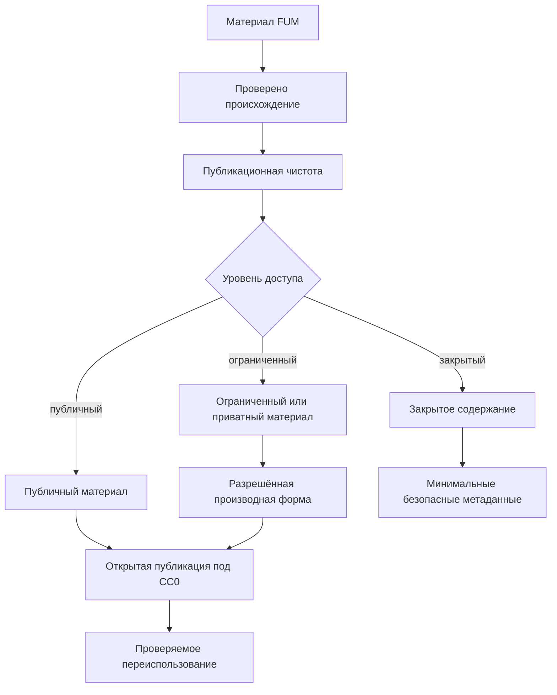

# Publikaciya i licenziya

## Licenziya

Proyekt vedyotsya pod licenziyej [CC0 1.0 Universal](../LICENZIYA.md). Eto oznachayet namereniye publikovatj materialyi proyekta maksimaljno svobodno, v forme, prigodnoj dlya otkryitogo ispoljzovaniya.

Dlya [FUM](../Glossarij/FUM.md) CC0 yavlyayetsya ne toljko yuridicheskoj ramkoj, no i chastjyu [otkryitosti FUM](../Glossarij/otkryitostj-FUM.md). Yesli godnyij II-agent v dolgosrochnom predele sposoben napisatj samogo sebya, yego bazovaya [pamyatj](../Glossarij/pamyatj-FUM.md), trebovaniya, arkhitekturnyiye resheniya i proveryayemyiye [narabotki](../Glossarij/narabotka.md) dolzhnyi byitj nasleduyemyimi i dostupnyimi dlya samostoyateljnogo razvitiya drugimi uzlami.

## Publikacionnaya gotovnostj

- Materialyi [FUM](../Glossarij/FUM.md) dolzhnyi byitj ponyatnyi vne lokaljnogo konteksta razrabotki.
- Trebovaniya, resheniya i opisaniya dolzhnyi sokhranyatj proiskhozhdeniye cherez ssyilki na [iskhodnyiye zaprosyi](../Glossarij/iskhodnyij-zapros.md).
- Otkryitaya publikaciya predpolagayet, chto opisaniye [FUM](../Glossarij/FUM.md) mozhno chitatj, proveryatj, pereispoljzovatj i razvivatj bez zakryityikh zavisimostej.

## GitHub-publikaciya i forki pamyati

Blizhajshaya prakticheskaya skhema otkryitosti - opublikovatj etot repozitorij na GitHub kak publichnyij bazovyij upstream [pamyati FUM](../Glossarij/pamyatj-FUM.md). V takoj skheme drugiye lyudi mogut forkatj repozitorij i ispoljzovatj yego kak osnovu dlya vedeniya sobstvennyikh proyektov i sobstvennoj pamyati, ne smeshivaya lichnyiye materialyi s publichnyim bazovyim sostoyaniyem.

Bazovaya vetka `master` v publichnom repozitorii dolzhna ostavatjsya publikacionno chistoj, prigodnoj dlya povtornogo ispoljzovaniya i svyazannoj s proiskhozhdeniyem trebovanij. Lichnyiye i proyektnyiye otvetvleniya v forkakh mogut razvivatjsya v otdeljnyikh vetkakh, a obnovleniya bazovoj pamyati periodicheski podtyagivayutsya cherez sliyaniye obnovlyayusjhegosya `master`.

Takaya publikaciya ne dolzhna prevrasjhatj lichnuyu pamyatj poljzovatelej v obyazateljnuyu publichnuyu chastj proyekta. Naprotiv, ona zadayot proveryayemyij shablon: otkryitaya bazovaya pamyatj, lokaljnyiye ili forknutyiye vetki konkretnyikh poljzovatelej, yavnyiye urovni dostupa, ponyatnaya strategiya sliyaniya i vozmozhnostj zaimstvovatj uluchsheniya iz upstream bez poteri sobstvennoj istorii.

Prakticheskij protokol publikacionnoj proverki, forka, vedeniya sobstvennoj vetki, sliyaniya obnovlyayusjhegosya `master` i obratnoj peredachi uluchshenij opisan v dokumente [Publichnyij upstream i forki pamyati FUM](27-publichnyij-upstream-i-forki-pamyati.md).

## Skhema publikacionnoj proverki

## Otkryitostj kak usloviye doveriya

[Otkryitostj FUM](../Glossarij/otkryitostj-FUM.md) rassmatrivayetsya kak klyuchevoye proyektnoye trebovaniye, a ne kak dopolniteljnoye blago. Chem boljshe agent sposoben uchastvovatj v sobstvennom razvitii, tem vazhneye, chtobyi yego ustrojstvo, [pamyatj](../Glossarij/pamyatj-FUM.md), pravila dostupa, [agentskiye ciklyi](../Glossarij/agentskij-cikl.md) i [avtomatizacii](../Glossarij/avtomatizaciya-FUM.md) mogli byitj proverenyi, vosproizvedenyi i perenesenyi.

Eto osobenno vazhno dlya [lichnogo FUM-agenta](../Glossarij/lichnyij-FUM-agent.md). Personaljnyij agent potencialjno okhvatyivayet vse sferyi lichnoj zhizni cheloveka i rabotayet s chuvstviteljnyimi lichnyimi dannyimi. Poetomu otkryitostj agenta stanovitsya prakticheski neobkhodimyim usloviyem doveriya: chelovek dolzhen imetj vozmozhnostj ponimatj i proveryatj principyi rabotyi agenta, yego [pamyatj](../Glossarij/pamyatj-FUM.md), granicyi avtonomii i pravila dostupa.

Otkryitostj agenta ne oznachayet publikaciyu vsej lichnoj [pamyati](../Glossarij/pamyatj-FUM.md). Publichnyimi dolzhnyi stanovitjsya toljko materialyi, dopustimyiye dlya otkryitogo rasprostraneniya, a lichnyiye, ogranichennyiye i zakryityiye chasti dolzhnyi zasjhisjhatjsya [urovnyami dostupa](../Glossarij/urovenj-dostupa.md), proiskhozhdeniyem reshenij i yavnyimi [granicami vlasti](../Glossarij/granica-vlasti-FUM.md).

## Publichnostj i [ogranicheniya dostupa](../Glossarij/urovenj-dostupa.md)

Publikuyemyij repozitorij [FUM](../Glossarij/FUM.md) dolzhen soderzhatj toljko materialyi, prigodnyiye dlya otkryitogo rasprostraneniya. Eto ne otmenyayet trebovaniya k budusjhej sisteme [FUM](../Glossarij/FUM.md) umetj rabotatj s privatnyimi ili ogranichenno dostupnyimi [narabotkami](../Glossarij/narabotka.md): takiye materialyi dolzhnyi imetj yavnyij [urovenj dostupa](../Glossarij/urovenj-dostupa.md) i ne dolzhnyi popadatj v publichnyiye paketyi bez razresheniya.

Yesli [narabotka](../Glossarij/narabotka.md) imeyet smeshannyij sostav, publichnoj mozhet byitj toljko razreshyonnaya chastj: opisaniye, obezlichennoye rezyume, interfejs ili proizvodnaya forma. Ogranichennyiye i privatnyiye chasti dolzhnyi ostavatjsya vne otkryitoj publikacii, a sama sistema dolzhna sokhranyatj proveryayemyiye metadannyiye dostupa tam, gde eto bezopasno.

## Istochniki trebovanij

- [iskhodnyij zapros 2026-06-21 22:17:26 MSK](../Zhurnal/2026-06-21_22-17-26_MSK/zapros.md)
- [iskhodnyij zapros 2026-06-21 22:29:02 MSK](../Zhurnal/2026-06-21_22-29-02_MSK/zapros.md)
- [iskhodnyij zapros 2026-06-22 06:17:48 MSK](../Zhurnal/2026-06-22_06-17-48_MSK/zapros.md)
- [iskhodnyij zapros 2026-06-22 09:55:43 MSK](../Zhurnal/2026-06-22_09-55-43_MSK/zapros.md)
- [iskhodnyij zapros 2026-06-23 19:06:56 MSK](../Zhurnal/2026-06-23_19-06-56_MSK/zapros.md)
- [iskhodnyij zapros 2026-07-01 11:34:46 MSK](../Zhurnal/2026-07-01_11-34-46_MSK/zapros.md)
- [iskhodnyij zapros 2026-07-01 12:11:27 MSK](../Zhurnal/2026-07-01_12-11-27_MSK/zapros.md)

<!-- FUM-MD-RECENCY:BEGIN -->
<!-- last-content-edit: 2026-08-14 23:10:40 MSK -->
<!-- content-sha256: sha256:f096e1d2dd7344c02960536cc9ceee6d691851352aca7a9538e6d84bc915c4cb -->
<!-- FUM-MD-RECENCY:END -->
