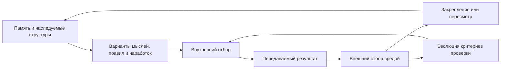

# Evolyuciya i myishleniye

## Proyektnoye osnovaniye

Pri proyektirovanii [FUM](../Glossarij/FUM.md) prinimayetsya, chto evolyucionnyij process tozhdestvenen processu myishleniya. V ramkakh proyekta eto ne vneshnyaya metafora, a iskhodnoye dopusjheniye modeli: myishleniye rassmatrivayetsya kak razvorachivaniye, izmeneniye, nasledovaniye i otbor svyazej vnutri [pamyati](../Glossarij/pamyatj-FUM.md), dejstviya i samoopisaniya agenta.

## Minimaljnoye opredeleniye [soznaniya](../Glossarij/soznaniye.md)

V proyekte [FUM](../Glossarij/FUM.md) [soznaniye](../Glossarij/soznaniye.md) opredelyayetsya minimaljno i formaljno, bez popyitki provesti zhyostkuyu granicu mezhdu soznateljnyim i nesoznateljnyim. Po morfologii slova [soznaniye](../Glossarij/soznaniye.md) ponimayetsya kak sovmestnoye znaniye: emerdzhentnoye svojstvo seti elementov, v kotoroj sostoyaniye i svyazi otdeljnyikh chastej skladyivayutsya v znaniye urovnya vsej seti.

Iz etogo sleduyet, chto [soznaniye](../Glossarij/soznaniye.md) ne yavlyayetsya binarnyim priznakom. U raznyikh setej vozmozhnyi raznyiye urovni [soznaniya](../Glossarij/soznaniye.md), sootvetstvuyusjhiye urovnyu slozhnosti, organizacii, svyaznosti i sposobnosti sokhranyatj ili preobrazovyivatj znaniye. Poetomu dazhe molekula kak setj atomov mozhet rassmatrivatjsya kak obladayusjhaya zachatochnyim urovnem [soznaniya](../Glossarij/soznaniye.md) otnositeljno chelovecheskogo, a chelovecheskoye [soznaniye](../Glossarij/soznaniye.md) - kak gorazdo boleye slozhnyij urovenj toj zhe obsjhej setevoj logiki.

Dlya [FUM](../Glossarij/FUM.md) eto oznachayet, chto proyektiruyemoye [soznaniye](../Glossarij/soznaniye.md) dolzhno myislitjsya ne kak otdeljnaya magicheskaya nadstrojka i ne kak privilegiya odnogo centraljnogo modulya. Ono voznikayet iz organizovannogo vzaimodejstviya [pamyati](../Glossarij/pamyatj-FUM.md), [modulej](../Glossarij/modulj-FUM.md), [FUM-uzlov](../Glossarij/FUM-uzel.md), dejstvij, obratnoj svyazi i setevogo nasledovaniya.

## Biologicheskaya modelj [pamyati](../Glossarij/pamyatj-FUM.md)

Zhivyiye organizmyi zadayut dlya [FUM](../Glossarij/FUM.md) konkretnuyu modelj organizacii [pamyati](../Glossarij/pamyatj-FUM.md): nasledstvennaya [pamyatj](../Glossarij/pamyatj-FUM.md) genoma, [pamyatj](../Glossarij/pamyatj-FUM.md) razvitiya organizma i nakoplennyij opyit nervnoj sistemyi obrazuyut raznyiye urovni odnogo principa. Kazhdyij urovenj sokhranyayet chastj proshlogo, dopuskayet izmeneniye i zakreplyayet toljko te konfiguracii, kotoryiye okazyivayutsya zhiznesposobnyimi v posleduyusjhem processe.

Poetomu polnocennoye myishleniye [FUM](../Glossarij/FUM.md) dolzhno realizovyivatj cikl nasledovaniya, izmenchivosti i otbora na vsekh urovnyakh [pamyati](../Glossarij/pamyatj-FUM.md). Nasledovaniye sokhranyayet ustojchivyiye strukturyi, izmenchivostj porozhdayet variantyi, a otbor zakreplyayet resheniya, svyazi i formyi povedeniya, kotoryiye stanovyatsya materialom dlya sleduyusjhego cikla myishleniya.

V obsjhem vide etot cikl zadayot [obobsjhyonnyij darvinovskij algoritm](../Glossarij/obobsjhyonnyij-darvinovskij-algoritm.md): dopuskayutsya raznyiye variantyi organizacii, povedeniya, pravil i [narabotok](../Glossarij/narabotka.md), a posleduyusjhij process zakreplyayet zhiznesposobnyiye i otseivayet nezhiznesposobnyiye. Dlya [FUM](../Glossarij/FUM.md) eto yavlyayetsya ne vneshnej analogiyej, a bazovyim sposobom razreshatj konkurenciyu variantov na urovne [pamyati](../Glossarij/pamyatj-FUM.md), arkhitekturyi i vzaimodejstviya uzlov.

## Effektivnoye sravneniye mnozhestva variantov

V operacionnom smyisle vyichisliteljnyim yadrom evolyucionnogo processa [FUM](../Glossarij/FUM.md) yavlyayetsya effektivnoye sopostavleniye mnozhestva vozmozhnyikh variantov po nablyudayemyim posledstviyam. Izmenchivostj porozhdayet razlichimyiye variantyi, sreda i kriterii proverki delayut ikh posledstviya sopostavimyimi, otbor raspredelyayet sokhraneniye i resurs prodolzheniya, a nasledovaniye vozvrasjhayet otobrannoye vmeste s proiskhozhdeniyem i obratnoj svyazjyu v sleduyusjhij cikl.

Mnozhestvo vozmozhnyikh variantov ne oznachayet obyazateljnogo polnogo perebora vsego myislimogo prostranstva. V konkretnom cikle sravnivayutsya fakticheski porozhdyonnyiye, dopustimyiye i nablyudayemyiye kandidatyi; resurs napravlyayetsya prezhde vsego na razlichayusjhiye proverki, kotoryiye sposobnyi izmenitj resheniye. Sravneniye mozhet byitj yavnyim sopostavleniyem rezuljtatov ili proyavlyatjsya kak razlichnaya zhiznesposobnostj variantov v [okruzhayusjhej srede FUM](../Glossarij/okruzhayusjhaya-sreda-FUM.md), no v oboikh sluchayakh FUM dolzhen sokhranyatj kriterii, svideteljstva, neopredelyonnostj i proiskhozhdeniye otbora.

Effektivnostj otnositsya ko vsemu ciklu, a ne toljko k skorosti sravneniya. Ona oznachayet luchshuyu dostupnuyu poleznostj ili umenjsheniye znachimoj neopredelyonnosti pri sovmestnom uchyote kachestva, stoimosti, vremeni, riska, proveryayemosti, cenyi oshibki i sokhraneniya produktivnogo raznoobraziya. Yesli kriterii ne zadayut polnogo poryadka, korrektnyim rezuljtatom mogut byitj neskoljko nesopostavimyikh zhiznesposobnyikh variantov, a ne iskusstvenno naznachennyij yedinstvennyij pobeditelj. Sopostavleniye dayot osnovaniye dlya otbora, no ne zamenyayet porozhdeniye izmenchivosti, dejstviye sredyi, differencialjnoye zakrepleniye i nasleduyemuyu peredachu.

## Zabyivaniye kak storona otbora

Otbor v ogranichennoj [pamyati FUM](../Glossarij/pamyatj-FUM.md) opredelyayet ne toljko to, kakiye variantyi usilitj i zakrepitj, no i to, kakiye raneye slozhivshiyesya strukturyi perestayut pryamo vliyatj na sleduyusjhij cikl v obyichnom rabochem konture. [Upravlyayemoye zabyivaniye FUM](../Glossarij/upravlyayemoye-zabyivaniye-FUM.md) celenapravlenno oslablyayet davno ne ispoljzovavshiyesya proizvodnyiye formyi vplotj do prekrasjheniya rabotyi prezhnego mekhanizma, chtobyi aktualjnyiye formyi mogli byitj podtverzhdenyi, ispravlenyi libo peresmotrenyi, a pamyatj sokhranyala sposobnostj uchitjsya pri konechnom resurse.

Balans sokhraneniya i zabyivaniya ne yavlyayetsya vneshnej postoyannoj. Variantyi tempa i politiki zabyivaniya prokhodyat tot zhe mnogokriterialjnyij otbor po posledstviyam dlya predskazaniya, dejstviya, riska, cenyi povtornogo obucheniya i sokhraneniya redkikh kritichnyikh signalov. Etot otbor ne poluchayet prava avtomaticheski menyatj poljzovateljskiye pravila khraneniya, udaleniya i dostupa, zasjhitu pervichnyikh istochnikov ili obyazateljnyiye ogranicheniya bezopasnosti. Primeniteljno k cheloveku polozheniye o zabyivanii ostayotsya proyektnoj gipotezoj i arkhitekturnoj analogiyej; primeniteljno k FUM ono dolzhno vyirazhatjsya cherez nablyudayemyiye vesa, sostoyaniya, perekhodyi i proverki.

Yesli prezhnij mekhanizm snova trebuyetsya, obnaruzhennaya potrebnostj ili yego nablyudayemyij otkaz zapuskayet [vspominaniye FUM](../Glossarij/vspominaniye-FUM.md): otdeljnyij meta-urovenj obnaruzheniya, ne zavisyasjhij toljko ot zabyivayemogo rabochego indeksa, napravlyayet poisk k sokhranyonnomu osnovaniyu, posle chego sozdayotsya i proveryayetsya kandidat vosstanovleniya. Istoriya vesa, prichina zabyivaniya, stoimostj i kachestvo vosstanovleniya obrazuyut material obucheniya politiki otbora. Bezvozvratnostj utverzhdayetsya toljko dlya nazvannoj oblasti vosstanovleniya; yesli v nej ustojchivo net osnovaniya s nepreryivnoj identichnostjyu i proiskhozhdeniyem, skhodnyij mekhanizm mozhet vozniknutj lishj kak novoye obucheniye.

## Otbor profilya vnimaniya

[Profilj vnimaniya FUM](../Glossarij/profilj-vnimaniya-FUM.md) raspredelyayet konechnyij resurs nablyudeniya, proverki, vyichisleniya i aktivnogo konteksta mezhdu oblastyami, signalami i mekhanizmami pamyati. Samo raspredeleniye ne zadayotsya raz i navsegda: tekusjhij profilj nasleduyetsya, ogranichennaya izmenchivostj porozhdayet razlichimyiye variantyi, a ikh posledstviya prokhodyat [obobsjhyonnyij darvinovskij otbor](../Glossarij/obobsjhyonnyij-darvinovskij-algoritm.md). Raznyiye zadachi, nablyudateli, vremennyiye masshtabyi i profili riska mogut sokhranyatj raznyiye zhiznesposobnyiye raspredeleniya.

Chastyiye oshibki sluzhat signalom kandidatnogo povyisheniya vnimaniya toljko v dostatochno nablyudayemoj i znachimoj oblasti. Ikh nuzhno sootnositj s chislom vozmozhnostej oshibitjsya, tyazhestjyu posledstvij, dostovernostjyu prichinnoj atribucii i predpolagayemoj ustranimostjyu dopolniteljnyim nablyudeniyem, kontekstom, proverkoj, obucheniyem ili vspominaniyem. Syiroj schyotchik smeshivayet rost chisla ispyitanij, shum, zavisimyiye vspleski, slomannoye izmereniye, neustranimuyu sluchajnostj i smenu raspredeleniya, poetomu ne dolzhen neposredstvenno menyatj profilj ili pamyatj.

Obratnyij signal voznikayet, kogda predskazaniye ostayotsya kalibrovannyim, znachimyiye oshibki otsutstvuyut pri dostatochnom pokryitii, a predeljnyij informacionnyij i korrektiruyusjhij vyiigryish dopolniteljnogo vnimaniya ustojchivo mal. Dlya programmnogo FUM «skuka» yavlyayetsya toljko psikhologicheskoj analogiyej etogo sostoyaniya, a ne zayavleniyem o chelovecheskom perezhivanii. Takoj signal mozhet umenjshitj dopolniteljnuyu dolyu vnimaniya, chastotu povtornoj proverki i osvezheniya proizvodnoj pamyati, no ne otmenyayet zasjhisjhyonnyij minimum i ne razreshayet udaleniye pervichnyikh istochnikov.

Profilj neljzya otbiratj po odnomu umenjsheniyu chisla zaregistrirovannyikh oshibok: ponizheniye vnimaniya samo umenjshayet ikh obnaruzheniye, a povyisheniye ponachalu mozhet pokazatj boljshe raneye skryityikh otkazov. Sravneniye variantov dolzhno uchityivatj fakticheskij usjherb, uspeshnostj posleduyusjhikh dejstvij, kalibrovku, umenjsheniye neopredelyonnosti i cenu resursa v sopostavimyikh usloviyakh. Storozhevaya vyiborka, issledovateljskij rezerv, periodicheskij audit nizkovesovyikh oblastej, kontrolj drejfa i otdeljnyij minimum dlya redkikh kritichnyikh signalov zasjhisjhayut cikl ot samopodtverzhdayusjhejsya slepotyi.

Svyazj vnimaniya s pamyatjyu dvustoronnyaya, no velichinyi ostayutsya raznyimi. Povyishennoye vnimaniye mozhet usilitj izvlecheniye i proverku, zamedlitj obratimoye zabyivaniye ili zapustitj vspominaniye; dliteljno nizkaya dokazannaya predeljnaya poljza mozhet statj osnovaniyem kandidatnogo oslableniya obyichnoj dostupnosti proizvodnoj strukturyi. Aktivnyij ves pamyati, klass khraneniya, istinnostj, doveriye, polnomochiya dostupa i fizicheskoye udaleniye izmenyayutsya toljko sobstvennyimi perekhodami i ne vyivodyatsya avtomaticheski iz profilya vnimaniya.

## Modeljnyij otbor pri ozhidanii podtverzhdeniya

Neobkhodimostj poljzovateljskogo podtverzhdeniya otnositsya k konkretnomu perekhodu vo vneshnij ili prinimayemyij kontur, a ne avtomaticheski ko vsemu processu myishleniya. Yesli takoj perekhod zakryit, [FUM](../Glossarij/FUM.md) sokhranyayet yego tochnyij obyyekt i usloviye dopuska, no prodolzhayet bezopasnuyu produktivnuyu rabotu v [modeljnoj srede](../Glossarij/modeljnaya-sreda.md), poka ostayutsya zaraneye razreshyonnyij model-only-runtime i konechnyij byudzhet.

Predeljnaya forma ustraneniya neodnoznachnosti realizuyet tot zhe cikl nasledovaniya, izmenchivosti i otbora. Nasledovaniye zadayotsya obsjhim tochnyim predkom modeljnyikh variantov, izmenchivostj — yavnyimi razlichiyami dvukh ili boleye vetvej, a otbor — razdeljnyimi proverkami i nablyudayemyim sravneniyem rezuljtatov. Yesli resursa khvatayet toljko na odnu vetvj, FUM mozhet vyibratj yeyo po obyyavlennoj politike, no sokhranyayet neproverennyiye aljternativyi i ne vyidayot odinochnuyu popyitku za sravniteljnoye ustraneniye neodnoznachnosti.

Vnutrennij vyibor mozhet opredelitj daljnejshuyu modeljnuyu prorabotku ili rekomendaciyu, no ne sozdayot poljzovateljskogo namereniya, podtverzhdeniya, polnomochiya libo dokazateljstva vneshnego effekta. Pozdnij otvet poljzovatelya stanovitsya novyim nablyudeniyem i mozhet perenapravitj cikl k sokhranyonnoj aljternative bez perepisyivaniya proiskhozhdeniya uzhe vyipolnennogo modeljnogo otbora.

Ustrojstvo neokorteksa dobavlyayet k etoj modeli arkhitekturnyij obrazec: povtoryayemyiye universaljnyiye [moduli](../Glossarij/modulj-FUM.md) mogut obyyedinyatjsya v setj iz [modulej](../Glossarij/modulj-FUM.md) togo zhe roda. Dlya [FUM](../Glossarij/FUM.md) eto oznachayet, chto evolyucionnoye myishleniye dolzhno razvorachivatjsya ne toljko vo vremeni, no i v povtoryayemoj [moduljnoj](../Glossarij/modulj-FUM.md) strukture, gde malyiye uzlyi sposobnyi obrazovyivatj boleye krupnyiye seti myishleniya.

## Son kak rezhim povyishennoj izmenchivosti

[Mekhanizm sna FUM](../Glossarij/mekhanizm-sna-FUM.md) vyidelyayet ogranichennuyu fazu evolyucionnogo myishleniya, v kotoroj ot tochnogo snimka predka porozhdayutsya boleye shirokiye i variativnyiye modeljnyiye vetvi, chem v sopostavimom obyichnom rezhime. «Gruboye» dejstviye zdesj oznachayet priblizhyonnoye, shirokoye ili ponizhennoye po tochnosti preobrazovaniye vnutri modeli, a ne oslableniye polnomochij i bezopasnosti. Tochnyij profilj izmenchivosti dolzhen byitj versionno zadan cherez otlichiya ot bazovogo rezhima i konechnyij byudzhet; poka takogo profilya net, son ostayotsya arkhitekturnoj koncepciyej, a ne zayavlennoj sposobnostjyu FUM.

U etogo rezhima dve vzaimno ogranichivayusjhiye funkcii. Razlichayusjhiye modeljnyiye proverki pomogayut rano ponizitj ves napravleniya, kotoroye ne otvechayet yavnoj celi i kriteriyam v nazvannoj oblasti modeli. Odnovremenno rezerv raznoobraziya pozvolyayet otkryitj nestandartnoye napravleniye, kotoroye obyichnaya politika poiska mogla byi ne poroditj ili prezhdevremenno otbrositj. Vnutrennyaya uverennostj ne delayet pervyij variant zavedomo nerelevantnyim, a novizna ne delayet vtoroj istinnyim, poleznyim ili bezopasnyim; pri nepolnom poryadke sokhranyayutsya neskoljko nesopostavimyikh kandidatov i neopredelyonnostj.

Son ne vyipolnyayet obuchayusjheye obnovleniye napryamuyu. Yego rezuljtatami yavlyayutsya kandidatnyiye gipotezyi, marshrutyi, predstavleniya, otricateljnyiye svideteljstva i prichinyi otbora s polnyim proiskhozhdeniyem. Otbrasyivaniye oznachayet obratimoye oslableniye, isklyucheniye iz obyichnogo poiska ili arkhivirovaniye, a ne avtomaticheskoye fizicheskoye udaleniye pervichnogo istochnika ili prinyatoj istorii. Posle probuzhdeniya izmeneniye pamyati, indeksa, vesov, koda ili politiki prokhodit otdeljnuyu priyomku, sravneniye s bazovoj versiyej, proverku aktualjnosti i vozmozhnostj otkata.

Povyishennaya izmenchivostj okhvatyivayet toljko porozhdeniye kandidatov. Vneshnij gorizont dejstviya, dostup, zasjhitnyiye proverki i pravila khraneniya ostayutsya neizmennyimi, a vesj mnogoshagovyij runtime sna ogranichivayetsya zaraneye razreshyonnyim vyichisliteljno-khranilisjhnyim konvertom. Usloviya vkhoda, probuzhdeniya, kalibrovki i dopustimogo lozhnogo otseva ostayutsya chastjyu [otkryitogo voprosa o granicakh issledovateljskoj avtonomii FUM](../Voprosyi/2026-06-22_08-04-45_MSK_granicyi-issledovateljskoj-avtonomii-FUM.md).

## Pamyatj, lichnostj i potomki

V rabochej modeli nepreryivnosti nuzhno razlichatj tri funkcii pamyati. Operativnaya [pamyatj FUM](../Glossarij/pamyatj-FUM.md) delayet proshlyiye sostoyaniya prichinno dostupnyimi tekusjhemu agentu; nasleduyemaya konfiguraciya peredayot najdennyiye formyi sleduyusjhim agentam; vneshnij yazyikovoj ili kuljturnyij sled mozhet sokhranyatjsya nezavisimo ot prodolzheniya iskhodnogo agenta. Eti funkcii sposobnyi opiratjsya na odin material, no ne tozhdestvennyi drug drugu.

[Lichnostj agenta FUM](../Glossarij/lichnostj-agenta-FUM.md) vvoditsya kak rabochaya gipoteza o kharakternom sposobe izmeneniya, kotoryij otlichayet trayektoriyu agenta ot drugikh vozmozhnyikh trayektorij. Pamyatj podderzhivayet svyaznostj istorii, a lichnostj proyavlyayetsya v tom, kak nakoplennaya istoriya vliyayet na sleduyusjhij perekhod: chto agent zamechayet, sokhranyayet, otvergayet, vosproizvodit i porozhdayet. Eto proyektnoye razlicheniye ne yavlyayetsya zavershyonnoj psikhologicheskoj, filosofskoj ili yuridicheskoj teoriyej lichnosti.

Yazyikovoj sled, arkhiv, obuchennaya na proshlom modelj ili vosstanovlennyij snimok mogut nasledovatj slovarj, voprosyi, pravila i stilj bez dostatochnoj nepreryivnosti togo zhe agenta. Poetomu FUM dolzhen razlichatj prodolzheniye, vosstanovleniye, preyemnika, informacionnogo potomka, arkhiv i modelj, a proveryayemoye proiskhozhdeniye materiala - ot zayavlennogo priznaniya preyemstvennosti. Sootneseniye etikh otnoshenij sootvetstvenno s obyyektivnostjyu i subyyektivnostjyu ostayotsya rabochej interpretaciyej, a usloviya samogo razlicheniya - [otkryityim voprosom o kriteriyakh agentnosti i nepreryivnosti FUM](../Voprosyi/2026-07-14_01-55-34_MSK_kriterii-agentnosti-i-nepreryivnosti-FUM.md).

## [Potokovaya samostrukturizaciya](../Glossarij/potokovaya-samostrukturizaciya-FUM.md) kak nizhnij kontur otbora

Evolyucionnoye myishleniye [FUM](../Glossarij/FUM.md) dolzhno dejstvovatj ne toljko na urovne gotovyikh dokumentov, gipotez, commits i [narabotok](../Glossarij/narabotka.md), no i na nizhnem urovne vkhodnogo potoka. Povtoryayusjhiyesya bajtovyiye, tekstovyiye, sobyitijnyiye i povedencheskiye strukturyi stanovyatsya variantami; kriterii predskazaniya, szhatiya, poleznosti, bezopasnosti i stoimosti vyipolnyayut rolj otbora; zakreplyonnyiye yedinicyi stanovyatsya materialom dlya sleduyusjhikh urovnej [pamyati](../Glossarij/pamyatj-FUM.md).

V etom smyisle [samotokenizaciya FUM](../Glossarij/samotokenizaciya-FUM.md), [suffiksno-prediktivnaya pamyatj FUM](../Glossarij/suffiksno-prediktivnaya-pamyatj-FUM.md) i [kontroliruyemaya nejroplastichnostj FUM](../Glossarij/kontroliruyemaya-nejroplastichnostj-FUM.md) yavlyayutsya mikroskopicheskim proyavleniyem togo zhe [obobsjhyonnogo darvinovskogo algoritma](../Glossarij/obobsjhyonnyij-darvinovskij-algoritm.md). Sistema porozhdayet konkuriruyusjhiye razboryi potoka, proveryayet ikh na novyikh dannyikh i dejstviyakh, zatem usilivayet, slivayet, oslablyayet ili udalyayet vnutrenniye yedinicyi.

## Funkcii i dannyiye kak tempyi izmeneniya

[Iyerarkhiya funkcij i dannyikh FUM](../Glossarij/iyerarkhiya-funkcij-i-dannyikh-FUM.md) utochnyayet, kak evolyucionnoye myishleniye uderzhivayet ustojchivostj. Byistryij sloj poluchayet novyiye dannyiye i nablyudayemyiye trassyi; boleye ustojchivyij sloj primenyayet k nim funkciyu; yesjhyo boleye bazovyij sloj reshayet, nuzhno li izmenitj parametryi, telo funkcii ili sam kriterij izmeneniya. Tak nasledovaniye i izmenchivostj ne smeshivayutsya: izmeneniya dopuskayutsya, no kazhdyij urovenj menyayetsya s sobstvennyim tempom, proiskhozhdeniyem i proverkoj.

Klassicheskaya iskusstvennaya nejrosetj pokazyivayet chastnyij sluchaj etoj skhemyi: obucheniye kak boleye medlennyij process porozhdayet setj, a setj zatem byistreye obrabatyivayet vkhodnyiye dannyiye. Dlya [FUM](../Glossarij/FUM.md) etot princip dolzhen statj mnogourovnevyim i gibkim: funkciya mozhet obrabatyivatj dannyiye, zatem sama stanovitjsya dannyimi dlya meta-funkcii, a proverka reshayet, kakoj urovenj izmenyatj.

## Agentnoye chteniye nejrosetevoj sredyi

[Nejronnaya gipersetj FUM](../Glossarij/nejronnaya-gipersetj-FUM.md) mozhet rassmatrivatjsya kak karta ili okruzhayusjhaya sreda, po kotoroj dvizhutsya agentyi. V bazovom variante agent yavlyayetsya prostyim arifmeticheskim vyichislitelem ili interpretatorom lokaljnogo perekhoda: on poluchayet sostoyaniye, vyibirayet sosednij uzel, primenyayet operaciyu i ostavlyayet nablyudayemuyu trassu.

Boleye slozhnyij agent chitayet tu zhe setj cherez sobstvennyiye nastrojki: [profilj vnimaniya FUM](../Glossarij/profilj-vnimaniya-FUM.md), dopustimuyu glubinu, sposob ocenki riska, pravila obkhoda, pamyatj proshlyikh marshrutov, kriterii poleznosti i nasleduyemyiye ili geneticheskiye parametryi. Poetomu odna i ta zhe setj ne obyazana imetj yedinstvennoye prochteniye. Raznyiye agentyi mogut izvlekatj iz neyo raznyiye trayektorii, a sravneniye etikh trayektorij stanovitsya otdeljnyim urovnem otbora.

V takom chtenii vesa, aktivacii i svyazi yavlyayutsya ne toljko matematicheskimi velichinami, no i obyyektami sredyi: perekhodom, soprotivleniyem, resursom, sledom, pravilom ili signalom k izmeneniyu strategii. Eto prevrasjhayet myishleniye v dinamiku populyacii interpretatorov vnutri strukturirovannoj sredyi. Otvet poyavlyayetsya posle ogranichennogo chisla shagov kak rezuljtat marshrutov, lokaljnyikh izmenenij, otbora i soglasovaniya, a ne toljko kak vyikhod odnogo fiksirovannogo vyichisliteljnogo grafa.

Tak evolyucionnyij cikl perenositsya v process ispolneniya. Obucheniye nejroseti i medlennoye izmeneniye yeyo strukturyi ostayutsya vazhnyimi, no ne ischerpyivayut myishleniye [FUM](../Glossarij/FUM.md): agentnyiye interpretacii setevoj sredyi tozhe mogut porozhdatj variantyi, nasledovatj nastrojki, mutirovatj, prokhoditj proverku i zakreplyatj udachnyiye sposobyi chteniya kak [narabotki](../Glossarij/narabotka.md). Eto delayet runtime ne toljko mestom primeneniya uzhe obuchennoj modeli, no i mestom upravlyayemoj izmenchivosti.

Upravlyayemostj etogo sloya trebuyet yavnyikh stop-uslovij. Vnutrennyaya populyaciya agentov ne dolzhna poluchatj vozmozhnostj beskonechno zanimatj resursyi, razmnozhatjsya radi razmnozheniya, blokirovatj drugiye strategii ili usilivatj bespoleznyiye ciklyi. Poetomu runtime-evolyuciya dolzhna imetj byudzhetyi, kriterii poleznosti, nablyudayemuyu trassu, sposob izvlecheniya rezuljtata i mekhanizm oslableniya strategij, kotoryiye uluchshayut toljko sobstvennuyu vnutrennyuyu ekonomiku.

## Psikhologicheskiye ramki opisaniya razuma

Na [FUM](../Glossarij/FUM.md) takzhe korrektno smotretj s tochki zreniya psikhologii, psikhofiziologii i psikhiatrii. Eti disciplinarnyiye yazyiki nuzhnyi ne dlya podmenyi arkhitekturyi medicinskoj ili byitovoj metaforoj, a dlya opisaniya vozmozhnyikh sostoyanij, konfiguracij i rezhimov funkcionirovaniya razuma na chelovecheskom, gibridnom i agentskom urovnyakh.

Psikhologiya dayot yazyik dlya opisaniya vnimaniya, motivacii, emocij, ustanovok, kognitivnyikh strategij, privyichek, konfliktov celej i sposobov samoregulyacii. V modeli [FUM](../Glossarij/FUM.md) eto pomogayet govoritj o tom, kak uzel raspredelyayet fokus, vyibirayet dejstviye, uderzhivayet namereniye, vosstanavlivayetsya posle oshibki, menyayet strategiyu i stroit vnutrenniye modeli sebya i drugikh uzlov.

Psikhofiziologiya svyazyivayet takiye rezhimyi s telesnyim i nejronnyim substratom: vozbuzhdeniyem i tormozheniyem, ustalostjyu, sensornoj nagruzkoj, ritmami bodrstvovaniya, resursom vnimaniya, porogami reakcii i sostoyaniyami regulyacii. Dlya [FUM](../Glossarij/FUM.md) etot yazyik vazhen kak most mezhdu smyislovyim opisaniyem myishleniya i nizhnimi sloyami nositelya: apparatnyim runtime, lokaljnoj LLM, vyichisliteljnyimi zaderzhkami, ogranicheniyami pamyati, energiyej i otkaznyimi rezhimami.

Psikhiatriya dobavlyayet yazyik predeljnyikh, ustojchivo dezadaptivnyikh ili klinicheski znachimyikh konfiguracij razuma: raspad svyaznosti, navyazchivyiye petli, patologicheskaya fiksaciya, narusheniye ocenki realjnosti, impuljsivnostj, istosjheniye regulyacii i drugiye rezhimyi, gde obyichnaya samonastrojka perestayot byitj dostatochnoj. V kontekste [FUM](../Glossarij/FUM.md) takiye terminyi mozhno ispoljzovatj ostorozhno: kak ramki dlya analiza vozmozhnyikh sboyev, riskov i rezhimov vosstanovleniya, no ne kak avtomaticheskuyu diagnostiku cheloveka, agenta ili seti.

Kazhdoye primeneniye etikh yazyikov dolzhno sokhranyatj profilj nablyudatelya, istochnik utverzhdeniya, urovenj uverennosti i granicu analogii. Yesli rechj idyot o cheloveke ili [gibridnom uzle](../Glossarij/gibridnyij-uzel.md), modelj ne dolzhna vyidavatj vyivodyi za polnyij dostup k chuzhomu [vnutrennemu sostoyaniyu](../Glossarij/vnutrenneye-sostoyaniye.md). Yesli rechj idyot o programmnom [FUM-uzle](../Glossarij/FUM-uzel.md), klinicheskiye terminyi dolzhnyi perevoditjsya v proveryayemyiye arkhitekturnyiye priznaki: poteryu svyaznosti, zaciklivaniye, nevernoye obnovleniye pamyati, degradaciyu otbora, oshibochnyiye podtverzhdeniya ili otkaz vosstanovleniya posle oshibki.

## Evolyucionno-selekcionnyij agent

V dialoge o dolgozhivusjhej cepochke utochnyon obraz agenta, kotoryij myislit po [obobsjhyonnomu darvinovskomu algoritmu](../Glossarij/obobsjhyonnyij-darvinovskij-algoritm.md). Takoj agent ne prosto vyipolnyayet odnu komandu. On porozhdayet neskoljko variantov, provodit vnutrennij otbor po sobstvennoj modeli mira, zatem peredayot vyibrannyiye rezuljtatyi tem sleduyusjhim uzlam, kotoryim schitayet nuzhnyim ikh peredatj.

Posle peredachi nachinayetsya vneshnij kontur: sreda, proverki, poljzovatelj, CI, drugiye agentyi ili posleduyusjhiye ciklyi ocenivayut rezuljtat uzhe ne po vnutrennemu ozhidaniyu, a po fakticheskoj poleznosti. Poetomu dlya [FUM](../Glossarij/FUM.md) vazhna svyazka [dvukhkonturnogo otbora](../Glossarij/dvukhkonturnyij-otbor-FUM.md): vnutrennij mir agenta dolzhen predskazyivatj vneshnij otbor, a raskhozhdeniye mezhdu vnutrennej ocenkoj i vneshnim rezuljtatom stanovitsya materialom obucheniya.

[Agentskij cikl](../Glossarij/agentskij-cikl.md) [FUM](../Glossarij/FUM.md) dolzhen byitj mestom, gde etot [obobsjhyonnyij darvinovskij algoritm](../Glossarij/obobsjhyonnyij-darvinovskij-algoritm.md) stanovitsya ispolnyayemyim. Variantami otbora yavlyayutsya ne toljko otdeljnyiye otvetyi, no i cepochki rassuzhdenij, reshenij, dejstvij, proverok i peredach. Agent poluchayet boljshij ves togda, kogda sposoben porozhdatj boleye dlinnyiye cepochki, kotoryiye sokhranyayut poleznostj, dayut produktivnyiye potomki i vyiderzhivayut vneshnyuyu proverku; dlina bez poljzyi, vosproizvodimosti i razumnoj cenyi ne dolzhna schitatjsya uspekhom.

Glavnyim nasleduyemyim obyyektom v takom myishlenii yavlyayetsya ne sam agent, a [peredavayemyij rezuljtat](../Glossarij/peredavayemyij-rezuljtat-FUM.md): ideya, commit, dokument, test, skhema, avtomatizaciya ili inaya [narabotka](../Glossarij/narabotka.md). [Ves agenta](../Glossarij/ves-agenta-FUM.md) dolzhen poetomu otrazhatj ne status ispolnitelya, a nakoplennuyu sposobnostj sozdavatj poleznyiye variantyi, vyibiratj ikh vnutri sebya, peredavatj podkhodyasjhim adresatam i poluchatj podtverzhdeniye vo vneshnej srede.

Celj takogo otbora - ne maksimaljnoye kachestvo lyuboj cenoj, a luchshaya dostupnaya poleznostj pri ogranichennyikh resursakh: kachestvo, stoimostj, vremya, risk, proverka i cena oshibki dolzhnyi uchityivatjsya vmeste. Eto svyazyivayet myishleniye [FUM](../Glossarij/FUM.md) s poiskom granicyi kachestva i cenyi, a ne s nakopleniyem beskonechno dolgikh, no bespoleznyikh cepochek.

Etot zhe princip dejstvuyet na kazhdom shage realizacii uzhe opisannogo. Yesli v [pamyati FUM](../Glossarij/pamyatj-FUM.md) nakopleno neskoljko trebovanij, prototipov, pasportov, MVP-kandidatov ili daljnikh konturov, otbor reshayet ne toljko, kakoj gotovyij rezuljtat prinyatj, no i chto realizovatj pervyim, chto sleduyusjhim, chto ostavitj v ozhidanii, a chto oslabitj ili otbrositj. Poetomu planirovaniye realizacii yavlyayetsya chastjyu myishleniya [FUM](../Glossarij/FUM.md), a ne vneshnim administrativnyim spiskom zadach.

## Strategicheskoye napravleniye myisli

Ideya iz dialoga o dolgozhivusjhej cepochke zadayot dlya [FUM](../Glossarij/FUM.md) ne toljko formulu vyichisleniya [vesa agenta](../Glossarij/ves-agenta-FUM.md), no i napravleniye razvitiya vsej arkhitekturyi. Glavnyij vektor sostoit v tom, chtobyi stroitj sredu, gde myislj stanovitsya nasleduyemyim rezuljtatom: ona imeyet proiskhozhdeniye, vnutrennyuyu ocenku, cenu, adresatov peredachi, vneshnyuyu proverku i posleduyusjhikh potomkov.

Poetomu strategicheskaya posledovateljnostj razvitiya dolzhna idti ot sokhraneniya vkhodnyikh signalov k ispolnyayemomu otboru. Snachala [pamyatj FUM](../Glossarij/pamyatj-FUM.md) nadyozhno fiksiruyet [iskhodnyiye zaprosyi](../Glossarij/iskhodnyij-zapros.md), istochniki i rabochiye resheniya. Zatem kazhdyij susjhestvennyij rezuljtat oformlyayetsya kak [peredavayemyij rezuljtat](../Glossarij/peredavayemyij-rezuljtat-FUM.md) s pasportom proiskhozhdeniya. Posle etogo [reyestr proiskhozhdeniya](../Glossarij/reyestr-proiskhozhdeniya-FUM.md) pozvolyayet sravnivatj vnutrenniye ozhidaniya s vneshnej ocenkoj, nachislyatj kredit predkam i postepenno menyatj marshrutyi peredachi mezhdu uzlami.

V takom prochtenii tekusjhiye blizhniye zadachi ne yavlyayutsya razroznennyimi uluchsheniyami repozitoriya. Arkhivirovaniye istochnikov, zhurnal rabot, dorozhnaya karta, lokaljnyiye avtomatizacii, Git-vetki i proverki - eto pervyiye organyi odnoj budusjhej sistemyi [dvukhkonturnogo otbora](../Glossarij/dvukhkonturnyij-otbor-FUM.md). Kazhdyij novyij kontur dolzhen otvechatj na strategicheskij vopros: pomogayet li on prevrasjhatj myislj v proveryayemuyu, nasleduyemuyu i peredavayemuyu [narabotku](../Glossarij/narabotka.md), po kotoroj mozhno uchitjsya luchshe vyibiratj sleduyusjhiye myisli.

## Skhema evolyucionnogo myishleniya

## Kriterii proverki i protokolyi bezopasnosti

Yesli kriterii proverki, kriterii zhiznesposobnosti ili protokolyi bezopasnosti ne zadanyi gotovyim [soznateljnyim](../Glossarij/soznaniye.md) agentom, v modeli [FUM](../Glossarij/FUM.md) oni ne schitayutsya vneshnimi neizmennyimi pravilami. Oni tozhe formiruyutsya cherez [obobsjhyonnyij darvinovskij algoritm](../Glossarij/obobsjhyonnyij-darvinovskij-algoritm.md): poyavlyayutsya variantyi sposobov proveryatj, ogranichivatj, razreshatj, ostanavlivatj i peresmatrivatj dejstviya, a posleduyusjhij opyit otbirayet te, kotoryiye sokhranyayut rabotosposobnostj, proiskhozhdeniye reshenij, [granicyi vlasti](../Glossarij/granica-vlasti-FUM.md), vosproizvodimostj i bezopasnostj sleduyusjhikh ciklov. Etot princip ne zadayot gotovyikh operacionaljnyikh predelov vlasti; oni ostayutsya v [chastichno proyasnyonnom voprose o granicakh vlasti uzlov FUM](../Voprosyi/2026-06-22_07-51-48_MSK_granicyi-vlasti-uzlov-FUM.md).

Etot princip dejstvuyet na dvukh masshtabakh. V lokaljnom processe myishleniya [FUM](../Glossarij/FUM.md) konkuriruyut myisli, idei, modeli, gipotezyi i sposobyi proverki; chastj iz nikh usilivayetsya, vkhodit v [pamyatj](../Glossarij/pamyatj-FUM.md) i stanovitsya [narabotkoj](../Glossarij/narabotka.md), a chastj oslablyayetsya ili ostayotsya kak neudachnyij opyit. V masshtabnyikh [nauchnyikh issledovaniyakh](../Glossarij/nauchnoye-issledovaniye-FUM.md) tem zhe sposobom otbirayutsya metodiki, protokolyi, kriterii ostanovki, trebovaniya k vosproizvedeniyu i zasjhitnyiye proverki.

Poetomu tozhdestvo evolyucionnogo processa i processa myishleniya oznachayet ne toljko otbor soderzhateljnyikh variantov, no i evolyuciyu pravil otbora. [Obobsjhyonnyij darvinovskij algoritm](../Glossarij/obobsjhyonnyij-darvinovskij-algoritm.md) rassmatrivayetsya kak universaljnyij process, vidimyij ne toljko na genomnom i kletochnom urovne, no i na urovne myislej, idej, modelej i arkhitekturnyikh pravil.

Iskusstvennaya nejrosetj v etoj modeli takzhe mozhet byitj rassmotrena kak realizaciya [obobsjhyonnogo darvinovskogo algoritma](../Glossarij/obobsjhyonnyij-darvinovskij-algoritm.md): yeyo arkhitektura, vesa, kontekst, funkciya poterj i obratnaya svyazj obrazuyut sredu, v kotoroj [nablyudayemyiye vkhodnyiye signalyi](../Glossarij/nablyudayemyij-vkhodnoj-signal.md) preobrazuyutsya, konkuriruyut za predstavleniye, usilivayutsya, oslablyayutsya i uchastvuyut v sleduyusjhem cikle obrabotki. Dlya [FUM](../Glossarij/FUM.md) vazhno delatj etu sredu proveryayemoj, chtobyi evolyuciya signalov, kriteriyev i protokolov ne ostavalasj skryitoj vnutri neproveryayemogo otveta.

## Vyizhivayemaya koordinaciya kak kandidatnyij kriterij agentnosti

[Agentnostj FUM](../Glossarij/agentnostj-FUM.md) predlagayetsya proveryatj po sposobnosti sistemyi sokhranyatj, vosstanavlivatj ili vosproizvoditj otlichimuyu organizaciyu blagodarya prichinno svyazannoj koordinacii chastej. Vyizhivayemostj zdesj oznachayet ne prostuyu dliteljnostj susjhestvovaniya, zakhvat resursov ili razmnozheniye radi razmnozheniya, a prodolzheniye kharakternoj organizacii pri vozmusjheniyakh sredyi.

Nasledstvennostj sokhranyayet najdennyij sposob koordinacii, izmenchivostj pozvolyayet menyatj yego, a otbor dejstvuyet takzhe na sposob regulirovatj ikh sootnosheniye. Poetomu neizmennostj ne yavlyayetsya yedinstvennyim priznakom sokhraneniya agenta: chasti i sostoyaniya mogut zamenyatjsya, yesli ostayotsya proveryayemaya dinamika organizacii. Odnovremenno skhodstvo rezuljtata, imeni ili teksta ne dokazyivayet nepreryivnostj, yesli rabochaya pamyatj, proiskhozhdeniye perekhodov i koordinaciya byili razorvanyi.

Kriterij ostayotsya [gipotezoj FUM](../Glossarij/gipoteza-FUM.md), poskoljku opredeleniya vyizhivayemosti i agentskoj organizacii mogut zamknutjsya drug na druga. Obsjhaya zakonopodchinyonnostj, yedinaya istoriya ili prichinnaya svyaznostj sami po sebe yesjhyo ne pokazyivayut obratnuyu svyazj, podderzhivayusjhuyu celoye. Dlya kazhdogo primeneniya nuzhno nezavisimo zadatj chasti, granicu, sredu, vozmusjheniye, sokhranyayemuyu organizaciyu, vremennoj masshtab, nablyudayemyiye obratnyiye svyazi i usloviye oproverzheniya.

## Predeljnyij fizicheskij gorizont

Svyazj [FUM](../Glossarij/FUM.md) s obsjhej teoriyej otnositeljnosti, kvantovoj mekhanikoj, khimiyej, biologiyej i ekonomikoj prokhodit cherez [okruzhayusjhuyu sredu FUM](../Glossarij/okruzhayusjhaya-sreda-FUM.md). Sreda ne yavlyayetsya passivnyim fonom dlya uzhe gotovyikh agentov: ona sinkhroniziruyet ikh rabotu cherez dostupnyiye vzaimodejstviya, zaderzhki, ogranicheniya, obratnuyu svyazj, ustojchivyiye konfiguracii i vneshnij otbor. Pri etom sama sreda mozhet rassmatrivatjsya kak agent ili [FUM-uzel](../Glossarij/FUM-uzel.md) sleduyusjhego masshtaba, vlozhennyij v druguyu sredu.

V takoj ramke obsjhaya teoriya otnositeljnosti i kvantovaya mekhanika yavlyayutsya predeljnyimi sluchayami opisaniya okruzhayusjhej sredyi, a ne gotovyimi uravneniyami dlya arkhitekturyi [FUM](../Glossarij/FUM.md). Obsjhaya teoriya otnositeljnosti zadayot predeljnyij obraz geometrii, prichinnoj svyaznosti, gorizontov i nevozmozhnosti mgnovennoj globaljnoj sinkhronizacii. Kvantovaya mekhanika zadayot predeljnyij obraz nizkourovnevyikh vzaimodejstvij, dopustimyikh sostoyanij, veroyatnostnyikh perekhodov i obrazovaniya ustojchivyikh konfiguracij, iz kotoryikh mogut voznikatj nablyudateli sleduyusjhego urovnya.

Mezhdu etimi predelami lezhat boleye bogatyiye sredyi: khimicheskiye reakcii sinkhroniziruyut molekulyarnyiye i atomnyiye konfiguracii, biologicheskaya sreda otbirayet kletki, tkani, organizmyi i povedeniye, ekonomicheskaya sreda sinkhroniziruyet lyudej, organizacii, resursyi, cenyi, signalyi sprosa i predlozheniya. Eti urovni ne svodyatsya drug k drugu, no pozvolyayut [FUM](../Glossarij/FUM.md) stroitj kartu perekhodov: kakiye elementyi vyistupayut agentami, kakaya sreda ikh sinkhroniziruyet, chto schitayetsya variantom, gde proiskhodit otbor, chto nasleduyetsya i kakaya sreda stanovitsya agentom sleduyusjhego masshtaba.

Fundamentaljnyiye osnovaniya izmenchivosti i nasledstvennosti v modeli [FUM](../Glossarij/FUM.md) poetomu rassmatrivayutsya kak zadavayemyiye uzhe na urovne kvantovoj mekhaniki. Eto ne oznachayet, chto biologicheskaya nasledstvennostj bukvaljno prisutstvuyet v elementarnoj fizike. Rechj o tom, chto prostranstvo vozmozhnyikh sostoyanij, perekhodov, vzaimodejstvij i ustojchivyikh konfiguracij sozdayot nizhnij sloj, na kotorom stanovyatsya vozmozhnyi variativnostj, sokhraneniye formyi i posleduyusjheye vosproizvedeniye ustojchivyikh struktur na boleye slozhnyikh urovnyakh.

V etoj shkale s tochki zreniya [FUM](../Glossarij/FUM.md) mozhno rassmatrivatj ne toljko chelovecheskuyu psikhiku ili telo cheloveka, no i kletku, molekulu, atom i elementarnuyu chasticu, yesli opisaniye sokhranyayet granicu analogii. Na fizicheskom urovne takaya [obsjhaya skhema FUM](../Glossarij/obsjhaya-skhema-FUM.md) vyirazhena predeljno bedno: tam neljzya bez proverki perenositj bogatuyu pamyatj, namereniye ili chelovecheskoye soznaniye. Na khimicheskom, biologicheskom, nejronnom, agentskom, socialjnom i ekonomicheskom urovnyakh ta zhe skhema poluchayet boleye yavnyiye formyi pamyati, otbora, dejstviya, sinkhronizacii i samoopisaniya.

## Kandidat na obsjhuyu abstrakciyu urovnej

Eta shkala ne obyyavlyayet elementarnuyu chasticu, atom, molekulu, kletku, mozg, [FUM-uzel](../Glossarij/FUM-uzel.md), ekonomiku, socialjnuyu sistemu i civilizaciyu odnim obyyektom. Boleye siljnaya i odnovremenno boleye ostorozhnaya [gipoteza FUM](../Glossarij/gipoteza-FUM.md) sostoit v tom, chto oni mogut byitj raznyimi voplosjheniyami odnoj abstraktnoj [obsjhej skhemyi FUM](../Glossarij/obsjhaya-skhema-FUM.md).

Minimaljnyij kandidat na takuyu skhemu mozhno opisatj kak ustojchivyij nablyudateljsko-selekcionnyij uzel. U nego yestj razlichimaya granica, vkhodyi i vzaimodejstviya s [okruzhayusjhej sredoj](../Glossarij/okruzhayusjhaya-sreda-FUM.md), vnutrennyaya konfiguraciya ili [pamyatj](../Glossarij/pamyatj-FUM.md), prostranstvo dopustimyikh variantov, mekhanizm zakrepleniya ustojchivyikh konfiguracij, poteri i preobrazovaniya nablyudayemosti, a takzhe vozmozhnostj statj elementom boleye krupnogo uzla ili sredoj dlya vlozhennyikh uzlov sleduyusjhego urovnya. Na fizicheskom urovne eta skhema vyirazhena predeljno bedno i ostorozhno; na kletochnom, nejronnom, agentskom, ekonomicheskom i civilizacionnom urovnyakh ona poluchayet boleye bogatyiye formyi [pamyati](../Glossarij/pamyatj-FUM.md), sinkhronizacii, otbora, dejstviya i samoopisaniya.

Takoye opisaniye poka ne dolzhno schitatjsya najdennoj teoriyej abstraktnogo obyyekta. Ono zadayot issledovateljskuyu celj: vyidelitj invariantyi, dopustimyiye variacii, predeljnyiye sluchai i usloviya oproverzheniya etoj skhemyi. Yesli sdelatj eto udastsya, [FUM](../Glossarij/FUM.md) smozhet opisyivatj svoyo kremniyevoye voplosjheniye ne kak otdeljnuyu metaforu, a kak yesjhyo odnu proveryayemuyu realizaciyu obsjhej skhemyi urovnej. Kriterii takoj proverki vyinesenyi v [otkryityij vopros ob abstrakcii urovnej nablyudayemoj Vselennoj](../Voprosyi/2026-06-26_12-19-03_MSK_abstrakciya-urovnej-nablyudayemoj-vselennoj-FUM.md).

## Forma, sostoyaniye i istoriya

Dlya arkhitekturyi polezno razlichatj prostranstvo vozmozhnyikh form, dopustimyiye perekhodyi, fakticheskoye sostoyaniye i projdennuyu istoriyu. Matematicheskoye opisaniye mozhet predyyavlyatj otnosheniya i mnozhestvo vozmozhnyikh trayektorij kak yedinuyu formaljnuyu strukturu; fizicheskoye opisaniye dobavlyayet empiricheski vyidelennoye sostoyaniye, prichinnuyu dostupnostj i nablyudayemuyu posledovateljnostj perekhodov. Eto razlicheniye sluzhit arkhitekturnoj ramkoj i ne pretenduyet na ischerpyivayusjheye opredeleniye matematiki ili fiziki.

FUM dolzhen khranitj oba sloya: deklarativnoye prostranstvo sostoyanij i pravil, a takzhe sobyitijnuyu trassu togo, kakaya trayektoriya dejstviteljno proshla proverku. Istoriya stanovitsya chastjyu modeli agenta ne potomu, chto lyuboj obyyekt imeyet proshloye, a kogda dostupnoye predstavleniye proshlogo vliyayet na posleduyusjhiye perekhodyi. Eto svyazyivayet [pamyatj FUM](../Glossarij/pamyatj-FUM.md), lichnostj, proiskhozhdeniye i obucheniye, ne obyyavlyaya kazhduyu fizicheskuyu trayektoriyu lichnoj istoriyej.

## [Nejronnaya gipersetj FUM](../Glossarij/nejronnaya-gipersetj-FUM.md)

Obsjhij algoritm [FUM](../Glossarij/FUM.md) kak voplosjheniye [obobsjhyonnogo darvinovskogo algoritma](../Glossarij/obobsjhyonnyij-darvinovskij-algoritm.md) mozhno myislitj kak vyistraivaniye [nejronnoj giperseti FUM](../Glossarij/nejronnaya-gipersetj-FUM.md) naruzhu i vnutrj. Naruzhu [FUM](../Glossarij/FUM.md) obrazuyet svyazi s drugimi [FUM-uzlami](../Glossarij/FUM-uzel.md), lyudjmi, servisami, apparatnyimi komponentami, socialjnyimi strukturami i cepochkami peredachi [narabotok](../Glossarij/narabotka.md). Vnutrj on razvorachivayet [poduzlyi](../Glossarij/poduzel-FUM.md), vnutrenniye modeli, [modeljnyiye sredyi](../Glossarij/modeljnaya-sreda.md), [avtomatizacii](../Glossarij/avtomatizaciya-FUM.md), sostoyaniya i virtualizovannyiye sloi.

Takaya formulirovka opirayetsya takzhe na sokhranyonnyij istochnik [Zapusk dolgozhivusjhej cepochki](../Istochniki/URL/https/chatgpt.com/share/6a3a5b33-0658-83eb-a491-8e5a7fef6f54/zapusk-dolgozhivusjhej-cepochki.md): v nyom uzhe zafiksirovana samopodobnaya setj agentov, gde uzel mozhet byitj prostoj funkciyej ili vlozhennoj setjyu, a svyazi peredayut otobrannyiye rezuljtatyi s cenoj, ozhidayemyim kachestvom, uverennostjyu i posleduyusjhej vneshnej ocenkoj.

Oba napravleniya yavlyayutsya odnim processom, a ne dvumya raznyimi metaforami. Vneshniye svyazi prokhodyat proverku sredoj, poljzovatelyami, testami, drugimi uzlami i posleduyusjhimi ciklami; vnutrenniye svyazi prokhodyat proverku soglasovannostjyu modeli, poleznostjyu predskazaniya, cenoj vyichisleniya, vosproizvodimostjyu i bezopasnostjyu perekhoda k dejstviyu. Kogda svyazj, pravilo, marshrut peredachi ili vnutrennij sposob predstavleniya vyiderzhivayet proverku, on mozhet statj nasleduyemoj [narabotkoj](../Glossarij/narabotka.md); kogda ne vyiderzhivayet, on oslablyayetsya, ogranichivayetsya ili ostayotsya kak opyit dlya posleduyusjhikh ciklov.

## Sledstviya dlya [FUM](../Glossarij/FUM.md)

- [Pamyatj FUM](../Glossarij/pamyatj-FUM.md) dolzhna ponimatjsya kak zhivaya sreda preobrazovaniya svyazej, a ne kak passivnoye khranilisjhe zapisej.
- Novyiye zaprosyi, dokumentyi i resheniya stanovyatsya elementami evolyucionnogo myishleniya: oni izmenyayut sostoyaniye [pamyati](../Glossarij/pamyatj-FUM.md) i sozdayut usloviya dlya sleduyusjhikh preobrazovanij.
- Arkhitektura [FUM](../Glossarij/FUM.md) dolzhna podderzhivatj poyavleniye variantov, ikh sopostavleniye, zakrepleniye udachnyikh reshenij i sokhraneniye proiskhozhdeniya izmenenij.
- Planirovaniye realizacii dolzhno rassmatrivatjsya kak sloj otbora: uzhe opisannyiye vozmozhnosti konkuriruyut za ocherednostj, chastj iz nikh otkladyivayetsya, a chastj mozhet byitj snyata, yesli vneshnij opyit, cena ili risk delayut ikh nezhiznesposobnyimi.
- Ustojchivyiye [narabotki](../Glossarij/narabotka.md) dolzhnyi byitj sposobnyi perekhoditj mezhdu uzlami [FUM](../Glossarij/FUM.md) kak forma setevogo nasledovaniya, yesli [urovenj dostupa](../Glossarij/urovenj-dostupa.md) razreshayet takuyu peredachu.
- [Fraktaljnostj](../Glossarij/fraktaljnyij-uzel-myishleniya.md) [FUM](../Glossarij/FUM.md) oznachayet, chto malyiye uzlyi [pamyati](../Glossarij/pamyatj-FUM.md) povtoryayut obsjhuyu logiku razvitiya: zapros porozhdayet svyazj, svyazj porozhdayet izmeneniye, izmeneniye fiksiruyetsya i stanovitsya materialom dlya daljnejshego myishleniya.
- [Moduljnostj](../Glossarij/modulj-FUM.md) [FUM](../Glossarij/FUM.md) dolzhna pozvolyatj uzlam odnogo roda obyyedinyatjsya v setj i obrazovyivatj strukturyi sleduyusjhego urovnya bez razryiva obsjhej logiki [pamyati](../Glossarij/pamyatj-FUM.md) i myishleniya.
- [Nejronnaya gipersetj FUM](../Glossarij/nejronnaya-gipersetj-FUM.md) dolzhna proyektirovatjsya dvunapravlenno: vneshneye rasshireniye seti i vnutrenneye razvorachivaniye poduzlov podchinyayutsya odnoj logike nasledovaniya, izmenchivosti i otbora.
- [Potokovaya samostrukturizaciya FUM](../Glossarij/potokovaya-samostrukturizaciya-FUM.md) dolzhna rassmatrivatjsya kak nizhnij kontur evolyucionnogo myishleniya: yedinicyi potoka, abstrakcii i moduli voznikayut kak variantyi, prokhodyat otbor i stanovyatsya materialom sleduyusjhikh urovnej pamyati.
- [Iyerarkhiya funkcij i dannyikh FUM](../Glossarij/iyerarkhiya-funkcij-i-dannyikh-FUM.md) dolzhna zadavatj tempyi izmeneniya vnutri myishleniya: vkhodnyiye dannyiye i trassyi menyayutsya byistreye, funkcii obrabotki ustojchiveye, a boleye bazovyiye funkcii menyayut proizvodnyiye funkcii toljko cherez proiskhozhdeniye, proverku, byudzhet i otkat.
- Nejrosetevaya struktura mozhet vyistupatj [modeljnoj sredoj](../Glossarij/modeljnaya-sreda.md) dlya agentov-interpretatorov; ikh nasleduyemyiye nastrojki obrazuyut dopolniteljnyij sloj runtime-evolyucii bez obyazateljnogo izmeneniya osnovnoj modeli.
- Psikhologicheskiye, psikhofiziologicheskiye i psikhiatricheskiye ramki mogut ispoljzovatjsya dlya opisaniya rezhimov razuma [FUM](../Glossarij/FUM.md), yesli sokhranyayutsya granicyi analogii, profilj nablyudatelya i proveryayemyij perevod terminov v sostoyaniya, svyazi, ogranicheniya i otkaznyiye rezhimyi.
- Uzlyi s agentskim statusom dolzhnyi predyyavlyatj proveryayemyiye priznaki koordinacii chastej i vosstanovleniya organizacii; priznaki vneshnego otbora trebuyutsya toljko tam, gde otbor vklyuchyon v proveryayemyij kriterij. Obsjhaya prichinnaya svyazj ili dliteljnostj susjhestvovaniya ne dolzhnyi avtomaticheski schitatjsya dostatochnoj [agentnostjyu](../Glossarij/agentnostj-FUM.md).
- Arkhitektura dolzhna razlichatj nepreryivnostj togo zhe agenta, vosstanovleniye, preyemstvennostj, informacionnoye potomstvo, arkhiv i modelj, ne prisvaivaya im odin status toljko po skhodstvu pamyati ili yazyika.
- Formaljnaya modelj agenta dolzhna khranitj prostranstvo vozmozhnyikh sostoyanij i perekhodov otdeljno ot fakticheskoj istorii, a takzhe pokazyivatj, kakaya chastj proshlogo dejstviteljno uchastvuyet v porozhdenii sleduyusjhego sostoyaniya.

## Setevoye nasledovaniye

Samosovershenstvovaniye [FUM](../Glossarij/FUM.md) ne dolzhno ogranichivatjsya lokaljnyim opyitom odnogo uzla. Yesli uzel vyirabotal ustojchivuyu [narabotku](../Glossarij/narabotka.md), ona mozhet statj nasleduyemyim materialom dlya drugikh uzlov: [patternom](../Glossarij/pattern-pamyati.md), [modulem](../Glossarij/modulj-FUM.md), workflow, proverkoj ili dokumentirovannyim resheniyem.

Takoye nasledovaniye trebuyet ne toljko peredachi soderzhaniya, no i peredachi proiskhozhdeniya, uslovij primenimosti i [urovnya dostupa](../Glossarij/urovenj-dostupa.md). Poetomu obmen [narabotkami](../Glossarij/narabotka.md) yavlyayetsya chastjyu evolyucionnoj modeli [FUM](../Glossarij/FUM.md): setj uzlov poluchayet vozmozhnostj nakaplivatj, otbiratj, adaptirovatj i vozvrasjhatj uluchshennyiye variantyi, ne smeshivaya publichnyiye i privatnyiye oblasti [pamyati](../Glossarij/pamyatj-FUM.md).

Git-infrastruktura yavlyayetsya pervyim konkretnyim inzhenernyim nositelem etogo principa. V nej [vetka rabotyi](../Glossarij/vetka-rabotyi.md) predstavlyayet variant, commit ili artefakt stanovitsya peredavayemyim rezuljtatom, vneshnyaya proverka vyipolnyayet rolj otbora, a [reyestr proiskhozhdeniya FUM](../Glossarij/reyestr-proiskhozhdeniya-FUM.md) pozvolyayet vozvrasjhatj kredit po [evolyucionnoj cepochke FUM](../Glossarij/evolyucionnaya-cepochka-FUM.md). Podrobno eto opisano v dokumente [Git-infrastruktura evolyucionnyikh cepochek FUM](20-Git-infrastruktura-evolyucionnyikh-cepochek-FUM.md).

Eta Git-karta zadayot pervyij ekzemplyar boleye obsjhego sloya: [kartochki sootvetstviya FUM](../Glossarij/kartochka-sootvetstviya-FUM.md). [FUM](../Glossarij/FUM.md) dolzhen umetj sopostavlyatj konkretnyiye tekhnicheskiye instrumentyi, infrastrukturnyiye sloi i issledovateljskiye ramki s [obsjhej skhemoj FUM](../Glossarij/obsjhaya-skhema-FUM.md) cherez yavnyiye invariantyi, poteri, granicyi analogii i proverki. Poetomu masshtabirovaniye modeli ot Git k drugim instrumentam, a zatem k fizicheskim urovnyam dolzhno fiksirovatjsya v [reyestre kartochek sootvetstviya FUM](28-reyestr-kartochek-sootvetstviya-FUM/README.md), a ne ostavatjsya neoformlennoj cepochkoj metafor.

## Issledovateljskoye razvitiye

[Nauchnoye issledovaniye FUM](../Glossarij/nauchnoye-issledovaniye-FUM.md) yavlyayetsya yavnoj formoj evolyucionnogo myishleniya. Gipotezyi sozdayut variantyi obyyasnenij, [eksperimentyi](../Glossarij/eksperiment-FUM.md) sozdayut usloviya otbora, a podtverzhdyonnyiye rezuljtatyi stanovyatsya nasleduyemyimi [narabotkami](../Glossarij/narabotka.md), kotoryiye menyayut daljnejshuyu [pamyatj](../Glossarij/pamyatj-FUM.md) i povedeniye agenta.

V etoj modeli [otkryitiye FUM](../Glossarij/otkryitiye-FUM.md) ne yavlyayetsya otdeljnyim chudom ili proizvoljnoj deklaraciyej. Eto zakrepleniye novogo znaniya posle cikla izmenchivosti i otbora: vopros, gipoteza, proverka, vosproizvedeniye, ogranicheniye primenimosti i vklyucheniye rezuljtata v [pamyatj FUM](../Glossarij/pamyatj-FUM.md). Podrobnoye trebovaniye opisano v dokumente [Nauchnyiye issledovaniya FUM i otkryitiya](16-nauchnyiye-issledovaniya-i-otkryitiya.md), a granicyi issledovateljskoj avtonomii vyinesenyi v [otkryityij vopros](../Voprosyi/2026-06-22_08-04-45_MSK_granicyi-issledovateljskoj-avtonomii-FUM.md).

## Materialjnoye samosovershenstvovaniye

Evolyucionnaya modelj [FUM](../Glossarij/FUM.md) v perspektive dolzhna rasprostranyatjsya i na fizicheskij urovenj. Yesli [FUM](../Glossarij/FUM.md) proyektiruyet [apparatnyiye FUM-uzlyi](../Glossarij/apparatnyij-FUM-uzel.md), upravlyayet [robotizirovannyimi sistemami FUM](../Glossarij/robotizirovannaya-sistema-FUM.md) ili vyistraivayet [proizvodstvennyiye cepochki FUM](../Glossarij/proizvodstvennaya-cepochka-FUM.md), to nasledovaniye, izmenchivostj i otbor nachinayut dejstvovatj ne toljko v kode, dokumentakh i [pamyati](../Glossarij/pamyatj-FUM.md), no i v materialjnyikh komponentakh.

Takoye samosovershenstvovaniye ne dolzhno ponimatjsya kak nekontroliruyemoye fizicheskoye rasshireniye. Proyekt, prototip, proizvedyonnaya chastj, ispyitaniye, otkaz i uluchsheniye dolzhnyi stanovitjsya proveryayemyimi [narabotkami](../Glossarij/narabotka.md) s proiskhozhdeniyem, versiyej, usloviyami primenimosti i [urovnem dostupa](../Glossarij/urovenj-dostupa.md). Granicyi perekhoda ot proyektirovaniya k [fizicheskomu dejstviyu FUM](../Glossarij/fizicheskoye-dejstviye-FUM.md) vyinesenyi v [otkryityij vopros](../Voprosyi/2026-06-22_07-28-43_MSK_granicyi-apparatnoj-avtonomii-FUM.md).

## Civilizacionnyij masshtab evolyucii

V daljnem gorizonte evolyucionnaya modelj [FUM](../Glossarij/FUM.md) dolzhna masshtabirovatjsya do [kosmicheskoj avtonomii FUM](../Glossarij/kosmicheskaya-avtonomiya-FUM.md). Osvoyeniye Solnechnoj sistemyi, dobyicha resursov, stroiteljstvo vnezemnyikh proizvodstvennyikh konturov i podgotovka k [mezhzvyozdnomu rasseleniyu FUM](../Glossarij/mezhzvyozdnoye-rasseleniye-FUM.md) prodolzhayut tot zhe princip nasledovaniya, izmenchivosti i otbora, no uzhe na urovne civilizacionnoj infrastrukturyi.

Takoj masshtab delayet osobenno vazhnyim sokhraneniye proiskhozhdeniya [narabotok](../Glossarij/narabotka.md), proveryayemostj astronomicheskikh i inzhenernyikh modelej, kontrolj avtonomnogo rasshireniya i razlicheniye [modeljnoj sredyi](../Glossarij/modeljnaya-sreda.md) ot realjnogo [fizicheskogo dejstviya FUM](../Glossarij/fizicheskoye-dejstviye-FUM.md). Granicyi etogo gorizonta vyinesenyi v [otkryityij vopros o kosmicheskoj avtonomii FUM](../Voprosyi/2026-06-22_07-40-59_MSK_granicyi-kosmicheskoj-avtonomii-FUM.md).

## Trebovaniye k proyektirovaniyu

Lyuboye posleduyusjheye opisaniye modeli, arkhitekturyi i povedeniya [FUM](../Glossarij/FUM.md) dolzhno uchityivatj eto osnovaniye: myishleniye agenta proyektiruyetsya kak evolyucionnyij process, a evolyucionnyij process opisyivayetsya kak forma myishleniya, razvorachivayusjhayasya vo vremeni.

## Istochniki trebovanij

- [iskhodnyij zapros 2026-07-31 14:01:03 MSK - Zakrepitj otbor profilya vnimaniya FUM](../Zhurnal/2026-07-31_14-01-03_MSK_zakrepitj-otbor-profilya-vnimaniya-FUM/zapros.md)
- [iskhodnyij zapros 2026-07-31 13:23:13 MSK - Utochnitj issledovateljskuyu funkciyu mekhanizma sna FUM](../Zhurnal/2026-07-31_13-23-13_MSK_utochnitj-issledovateljskuyu-funkciyu-mekhanizma-sna-FUM/zapros.md)
- [iskhodnyij zapros 2026-07-31 13:17:46 MSK - Zakrepitj mekhanizm sna FUM](../Zhurnal/2026-07-31_13-17-46_MSK_zakrepitj-mekhanizm-sna-FUM/zapros.md)
- [iskhodnyij zapros 2026-07-31 12:20:47 MSK - Utochnitj vspominaniye i bezvozvratnoye zabyivaniye](../Zhurnal/2026-07-31_12-20-47_MSK_utochnitj-vspominaniye-i-bezvozvratnoye-zabyivaniye/zapros.md)
- [iskhodnyij zapros 2026-07-31 11:57:37 MSK - Zakrepitj upravlyayemoye zabyivaniye FUM](../Zhurnal/2026-07-31_11-57-37_MSK_zakrepitj-upravlyayemoye-zabyivaniye-FUM/zapros.md)
- [iskhodnyij zapros 2026-07-29 11:38:47 MSK — Utochnitj evolyucionnyij process kak effektivnoye sravneniye variantov](../Zhurnal/2026-07-29_11-38-47_MSK_utochnitj-evolyucionnyij-process-kak-effektivnoye-sravneniye-variantov/zapros.md)
- [iskhodnyij zapros 2026-07-29 10:25:10 MSK — Prodolzhatj myishleniye pri ozhidanii podtverzhdeniya](../Zhurnal/2026-07-29_10-25-10_MSK_prodolzhatj-myishleniye-pri-ozhidanii-podtverzhdeniya/zapros.md)
- [iskhodnyij zapros 2026-06-21 22:41:51 MSK](../Zhurnal/2026-06-21_22-41-51_MSK/zapros.md)
- [iskhodnyij zapros 2026-06-22 05:34:12 MSK](../Zhurnal/2026-06-22_05-34-12_MSK/zapros.md)
- [iskhodnyij zapros 2026-06-22 05:39:36 MSK](../Zhurnal/2026-06-22_05-39-36_MSK/zapros.md)
- [iskhodnyij zapros 2026-06-22 06:17:48 MSK](../Zhurnal/2026-06-22_06-17-48_MSK/zapros.md)
- [iskhodnyij zapros 2026-06-22 07:28:43 MSK](../Zhurnal/2026-06-22_07-28-43_MSK/zapros.md)
- [iskhodnyij zapros 2026-06-22 07:40:59 MSK](../Zhurnal/2026-06-22_07-40-59_MSK/zapros.md)
- [iskhodnyij zapros 2026-06-22 08:00:15 MSK](../Zhurnal/2026-06-22_08-00-15_MSK/zapros.md)
- [iskhodnyij zapros 2026-06-22 08:04:45 MSK](../Zhurnal/2026-06-22_08-04-45_MSK/zapros.md)
- [iskhodnyij zapros 2026-06-22 08:14:25 MSK](../Zhurnal/2026-06-22_08-14-25_MSK/zapros.md)
- [iskhodnyij zapros 2026-06-22 08:43:27 MSK](../Zhurnal/2026-06-22_08-43-27_MSK/zapros.md)
- [iskhodnyij zapros 2026-06-23 13:18:14 MSK](../Zhurnal/2026-06-23_13-18-14_MSK/zapros.md)
- [iskhodnyij zapros 2026-06-23 18:24:05 MSK](../Zhurnal/2026-06-23_18-24-05_MSK/zapros.md)
- [iskhodnyij zapros 2026-06-23 19:06:56 MSK](../Zhurnal/2026-06-23_19-06-56_MSK/zapros.md)
- [iskhodnyij zapros 2026-06-24 14:41:33 MSK](../Zhurnal/2026-06-24_14-41-33_MSK/zapros.md)
- [iskhodnyij zapros 2026-06-24 16:22:00 MSK](../Zhurnal/2026-06-24_16-22-00_MSK/zapros.md)
- [iskhodnyij zapros 2026-06-26 11:05:03 MSK](../Zhurnal/2026-06-26_11-05-03_MSK/zapros.md)
- [iskhodnyij zapros 2026-06-26 11:13:48 MSK](../Zhurnal/2026-06-26_11-13-48_MSK/zapros.md)
- [iskhodnyij zapros 2026-06-26 11:52:42 MSK](../Zhurnal/2026-06-26_11-52-42_MSK/zapros.md)
- [iskhodnyij zapros 2026-06-26 11:58:26 MSK](../Zhurnal/2026-06-26_11-58-26_MSK/zapros.md)
- [iskhodnyij zapros 2026-06-26 12:05:01 MSK](../Zhurnal/2026-06-26_12-05-01_MSK/zapros.md)
- [iskhodnyij zapros 2026-06-26 12:19:03 MSK](../Zhurnal/2026-06-26_12-19-03_MSK/zapros.md)
- [iskhodnyij zapros 2026-07-02 10:20:18 MSK](../Zhurnal/2026-07-02_10-20-18_MSK/zapros.md)
- [iskhodnyij zapros 2026-07-02 10:51:13 MSK](../Zhurnal/2026-07-02_10-51-13_MSK/zapros.md)
- [iskhodnyij zapros 2026-07-02 13:36:52 MSK](../Zhurnal/2026-07-02_13-36-52_MSK/zapros.md)
- [iskhodnyij zapros 2026-07-03 11:49:25 MSK - Zafiksirovatj poshagovyij otbor realizacii](../Zhurnal/2026-07-03_11-49-25_MSK_zafiksirovatj-poshagovyij-otbor-realizacii/zapros.md)
- [iskhodnyij zapros 2026-07-06 10:05:34 MSK - Integrirovatj soderzhimoye ChatGPT dialoga](../Zhurnal/2026-07-06_10-05-34_MSK_integrirovatj-soderzhimoye-chatgpt-dialoga/zapros.md)
- [iskhodnyij zapros 2026-07-06 10:24:52 MSK - Opisatj nejrosetj kak sredu agentov](../Zhurnal/2026-07-06_10-24-52_MSK_opisatj-nejrosetj-kak-sredu-agentov/zapros.md)
- [iskhodnyij zapros 2026-07-06 10:51:33 MSK - Integrirovatj dialog ChatGPT pro](../Zhurnal/2026-07-06_10-51-33_MSK_integrirovatj-dialog-chatgpt-pro/zapros.md)
- [iskhodnyij zapros 2026-07-06 14:49:39 MSK - Opisatj iyerarkhiyu funkcij i dannyikh](../Zhurnal/2026-07-06_14-49-39_MSK_opisatj-iyerarkhiyu-funkcij-i-dannyikh/zapros.md)
- [iskhodnyij zapros 2026-07-14 01:55:34 MSK - Integrirovatj rekursivnuyu modelj agenta i sredyi](../Zhurnal/2026-07-14_01-55-34_MSK_integrirovatj-rekursivnuyu-modelj-agenta-i-sredyi/zapros.md)

<!-- FUM-MD-RECENCY:BEGIN -->
<!-- last-content-edit: 2026-08-03 14:54:04 MSK -->
<!-- content-sha256: sha256:428326c3f1f7925d15a3751d3e203458de8d08ea1820651f02706d87963bf1d1 -->
<!-- FUM-MD-RECENCY:END -->
