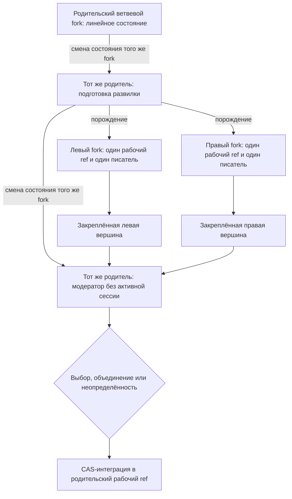
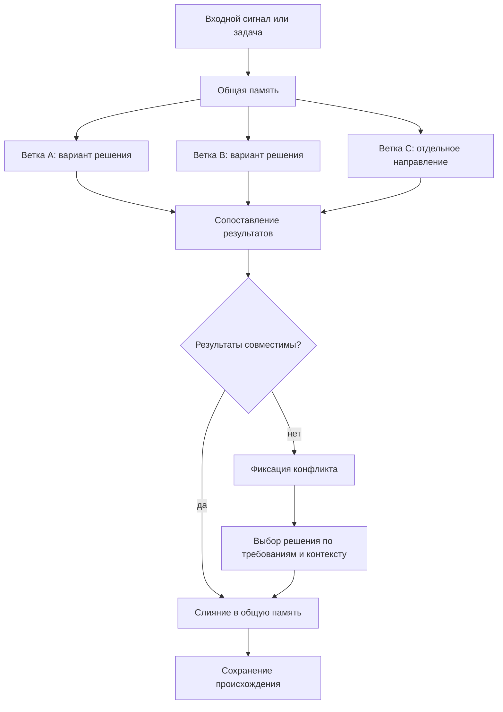

# Paralleljnaya rabota i sliyaniye

Ekspluatacionnyij status: opisannyiye nizhe vetvevyiye fork, worktree-pul, FIFO, continuation, avtomaticheskiye review/integration/CAS i publikaciya yavlyayutsya otlozhennoj celevoj arkhitekturoj i istoriyej prototipirovaniya. Oni ne yavlyayutsya dejstvuyusjhim marshrutom zapisi tekusjhego repozitoriya; sejchas poljzovatelj vruchnuyu zapuskayet odnu pishusjhuyu sessiyu v pervichnom checkout `refs/heads/master`.

## Trebovaniye

Proyektiruyemyij [FUM](../Glossarij/FUM.md)-agent dolzhen byitj sposoben vesti paralleljnuyu rabotu nad zadachami v raznyikh [vetkakh](../Glossarij/vetka-rabotyi.md) i zatem obyyedinyatj rezuljtatyi cherez sliyaniye. Takaya modelj sblizhayet rabotu agenta s komandnoj razrabotkoj lyudej, gde neskoljko napravlenij mogut razvivatjsya odnovremenno, a obsjheye sostoyaniye proyekta sobirayetsya cherez soglasovaniye rezuljtatov.

## Modelj vetvleniya

[Vetka v FUM](../Glossarij/vetka-rabotyi.md) ponimayetsya kak otdeljnaya liniya rabotyi nad zadachej, gipotezoj ili naborom izmenenij. Ona dolzhna sokhranyatj sobstvennyij kontekst, promezhutochnyiye resheniya, sledyi proiskhozhdeniya trebovanij i rezuljtat rabotyi. Neskoljko vetok mogut razvivatjsya paralleljno, ne razrushaya celostnostj obsjhej [pamyati](../Glossarij/pamyatj-FUM.md) proyekta.

Takaya paralleljnostj vazhna ne toljko dlya uskoreniya rabotyi. Ona pozvolyayet [FUM](../Glossarij/FUM.md) uderzhivatj neskoljko variantov resheniya, sravnivatj ikh, razvivatj nezavisimyiye napravleniya i vozvrasjhatj ikh v obsjhij kontur myishleniya cherez upravlyayemoye sliyaniye.

## Derevo vetvevyikh fork

Linejnaya vetka mozhet perejti v otdeljnoye sostoyaniye razvilki i poroditj rovno dva [vetvevyikh fork FUM](../Glossarij/vetvevoj-fork-FUM.md) ot odnogo proverennogo iskhodnogo sostoyaniya. Kazhdyij rebyonok poluchayet sobstvennyij polnyij rabochij ref, zhivoj checkout, konechnoye naznacheniye i ne boleye odnogo dopusjhennogo pishusjhego vladeljca. Ozhidayusjheye obyazateljnoye prodolzheniye, neaktivnaya dochernyaya zadacha i vneshnyaya proveryayusjhaya zadacha bez prava zapisi ne schitayutsya aktivnyimi vladeljcami. Odin fizicheskij fork-repozitorij pri etom mozhet sokhranyatj zerkaljnyij `master` i sluzhebnyiye refs: formula «odin fork — odna vetka» otnositsya k odnomu logicheskomu uzlu i yego avtoritetnoj pare repozitoriya i rabochego ref, a ne ko vsemu kontejneru repozitoriya.

V lokaljnom profile FUM-STEP-0148 logicheskij vetvevoj fork materializuyetsya ne GitHub-forkom, a odnim pereispoljzuyemyim linked worktree `Подузлы/слот-*`. Odnovremenno aktivnyiye pisatelj, recenzent i integrator zanimayut raznyiye slotyi. Worktree odnogo repozitoriya razdelyayut object database, Git common-dir i prostranstvo refs; doverennaya kooperativnaya granica zapresjhayet menyatj chuzhiye refs, togda kak fizicheski razdeljnyimi ostayutsya checkout, indeks, polnyij rabochij ref i branch-scoped FIFO. Dolgovechnaya forma otdeljnogo fork-repozitoriya i submodule ostayotsya samostoyateljnyim celevyim profilem i ne vyivoditsya iz etoj lokaljnoj materializacii.

Roditelj posle aktivacii detej prekrasjhayet linejnuyu zapisj i sam stanovitsya sokhranyayemoj roljyu moderatora; otdeljnyij tretij fork ne poyavlyayetsya. Prezhnyaya host-sessiya ne uderzhivayet roditeljskuyu FIFO vo vremya dochernej rabotyi, a novaya ograzhdyonnaya sessiya toj zhe logicheskoj identichnosti vosstanavlivayet moderaciyu iz pasporta posle gotovnosti rezuljtatov. Kriterii sravneniya zakreplyayutsya do ikh polucheniya, a roditelj vyibirayet levuyu ili pravuyu vershinu, sovmestimoye obyyedineniye, dorabotku v novom pokolenii, otkloneniye oboikh libo neopredelyonnostj. Kazhdyij rebyonok vnutri sebya po-prezhnemu dvizhetsya obyichnoj linejnoj cepochkoj `commit+handoff` s odnim prodolzheniyem na kommit.

Neizmenyayemyiye ryobra porozhdeniya obrazuyut derevo fork: u nego odin korenj, u kazhdogo drugogo uzla odin roditelj, odna sostoyavshayasya razvilka roditelya soderzhit rovno dvukh detej. Ryobra prinyatiya i sliyaniya uchityivayutsya otdeljno: mnogoroditeljskij integracionnyij kommit delayet Git-istoriyu DAG, ne perepisyivaya genealogiyu uzlov. Docherniye host-zadachi snachala registriruyutsya kak neaktivnyiye, a globaljnyij predaktivacionnyij barjyer ne dopuskayet ikh v vetochnyiye FIFO do yedinogo CAS-perekhoda paryi. Podgotovka neskoljkikh host- i repozitornyikh sostoyanij yavlyayetsya sagoj, a ne odnoj Git-tranzakciyej: posle neodnoznachnogo sozdaniya prodolzhitj yeyo mozhno toljko ot avtoritetno dokazannoj prezhnej popyitki libo cherez yavnoye chelovecheskoye vosstanovleniye.

## Posledovateljnostj zadach vnutri vetki

Paralleljnostj raznyikh [vetok rabotyi](../Glossarij/vetka-rabotyi.md) ne oznachayet odnovremennoye izmeneniye odnogo checkout neskoljkimi nezavisimyimi kornevyimi zadachami. Obyichnaya novaya sessiya nachinayet lokaljnyij marshrut v chistom osnovnom checkout s tochnogo zakommichennogo snimka marshrutizacii. Khyesh snimka svyazyivayet OID celevoj vershinyi i obyazateljnyikh planovyikh istochnikov, reviziyu protokola pula, vse aktivnyiye linii s ikh polnyimi refs, worktree i sostoyaniyem branch-scoped FIFO, a takzhe perechenj svobodnyikh slotov. Yesli lyuboj iz etikh obyyektov ili sostoyanij uspel izmenitjsya, prezhnij vyibor ne dayot polnomochij i marshrut vyichislyayetsya zanovo.

Iz odnogo snimka sessiya yavno vyibirayet rovno odin iz tryokh rezhimov. `параллельная_линия` toljko posle vyibora lenivo rezerviruyet pereispoljzuyemyij slot `Подузлы/слот-*`, sozdayot unikaljnyij polnyij ref i naznacheniye `self_line`; sovmestimyiye linii v raznyikh slotakh mogut rabotatj paralleljno. `последовательное_продолжение` atomarno dobavlyayet dolgovechnyij bilet k uzhe aktivnoj linii i sokhranyayet za prodolzheniyem te zhe fizicheskij slot, polnyij ref i worktree. `только_чтение` ne rezerviruyet pisateljskij slot i ne sozdayot bilet vladeniya.

Vnutri `self_line` odnovremenno pishet rovno odin vladelec. Poryadok prodolzhenij zadayotsya vozrastayusjhim `seq` pervogo uspeshnogo compare-and-swap, a ne nastennyimi chasami ili momentom sozdaniya okna: obsjhij host ne predostavlyayet nadyozhnoj atomarnoj metki takogo sobyitiya. Pereuporyadochivaniye, ustupka pozicii i obkhod golovyi FIFO ne podderzhivayutsya. Do kommita tekusjhego vladeljca tochnoye prodolzheniye uzhe susjhestvuyet kak ozhidayusjhij bilet toj zhe linii. Odna tranzakciya `commit+handoff` sveryayet pokoleniye, iskhodnyij `HEAD`, ref, FIFO i khyesh namereniya prodolzheniya, sozdayot odin pryamoj kommit, peredvigayet ref linii i peredayot ocheredj yeyo golove; neizmenyayemaya kvitanciya delayet tochnyij povtor vosstanavlivayemyim bez vtorogo kommita ili vtoroj peredachi.

Novyij vladelec poluchayet `reload_required`, perechityivayet pravila i materialyi iz fakticheskoj zakommichennoj vershinyi, podtverzhdayet tochnyij novyij OID i lishj zatem poluchayet novoye pokoleniye dopuska. Read-only-vosstanovleniye poteryannogo otveta nakhodit tochnoye naznacheniye, vladeljca, bilet i marshrut, no samo ne sozdayot slot i ne dvigayet FIFO. Liniya ne mozhet zamorozitj itogovyij rezuljtat pri ozhidayusjhem prodolzhenii. Poetomu odin slot obsluzhivayet vsyu posledovateljnuyu cepochku sessij linii i osvobozhdayetsya dlya inogo naznacheniya toljko posle terminaljnoj kvitancii, ostanovki pozdnikh pisatelej, otsutstviya vladeljca i ozhidayusjhikh biletov i proverki chistyikh checkout i indeksa.

Obyichnaya posledovateljnaya kornevaya rabota v osnovnom checkout sokhranyayet sobstvennyij kontrakt [obyazateljnogo prodolzheniya vetki](../Glossarij/obyazateljnoye-prodolzheniye-vetki.md): zaraneye sozdannaya zadacha vkhodit v branch-scoped FIFO, a commit+handoff atomarno svyazyivayet novyij `HEAD` s tochnyim prodolzheniyem. Vse prinyatyiye integracii v lokaljnyij `master`, vklyuchaya rezuljtatyi paralleljnyikh linij, prokhodyat cherez etu obyichnuyu FIFO i yeyo compare-and-swap; slot-integrator ne obkhodit vladeljca osnovnoj vetki.

Zakonnaya no-op-zadacha — naprimer, read-only proverka bez zamechanij libo prodolzheniye, poluchivsheye ot selektora `done` ili `not_ready`, — ispoljzuyet terminaljnoye chistoye zaversheniye bez iskusstvennogo kommita. Pered lyuboj peredachej ili terminalizaciyej vladelec dozhidayetsya vsekh processov i agentov, sposobnyikh pozdneye zapisatj rezuljtat. Subagentyi odnoj kornevoj zadachi ne yavlyayutsya otdeljnyimi biletami i ne poluchayut prava samostoyateljno menyatj indeks, refs ili istoriyu.

Kazhdyij zamorozhennyij result-ref, v tom chisle zablokirovannyij ili poka neslivayemyij, ostayotsya dostizhimyim otdeljno ot `master`. Posle proverki publikacionnoj chistotyi avtomaticheskij transport otpravlyayet takoj ref bez force v uzhe nastroyennyij remote togo zhe repozitoriya i podtverzhdayet tochnyij OID readback-proverkoj. Setevaya ili autentifikacionnaya oshibka ostavlyayet lokaljnyij ref dostizhimyim i dayot sostoyaniye `publication_pending`. Toljko prinyatyij posle avtomaticheskikh revjyu i integracii obyyekt mozhet projti obyichnuyu FIFO v lokaljnyij, a zatem udalyonnyij `master`; zablokirovannyij rezuljtat tuda ne popadayet. GitHub fork i pull request v marshrute FUM-STEP-0148 otsutstvuyut.

Celevoj [pishusjhij poduzel FUM](../Glossarij/pishusjhij-poduzel-FUM.md) yavlyayetsya drugim klassom ispolnitelya, a ne oslablennyim rezhimom subagenta. Yego lokaljnaya liniya poluchayet tochnyij `base_oid`, unikaljnuyu [vetku shaga](../Glossarij/vetka-shaga-FUM.md), granicu vladeniya i ustojchivuyu ssyilku na [kandidatnyij kommit](../Glossarij/kandidatnyij-kommit-FUM.md). Ocheredj odnogo checkout ne koordiniruyet sosedniye worktree; paralleljnoye proizvodstvo razreshayetsya na raznyikh polnyikh refs, a slot pereispoljzuyetsya lishj posle terminala vsej linii.

Dokumentaljnyij etalonnyij prototip proveryayet, chto soderzhateljnyiye i terminaljnyiye komandyi pula vyizvanyi s `repo-root`, kotoryij razreshayetsya rovno v naznachennyij slot i sovpadayet s yego `worktree_id`. Eta proverka dokazyivayet disciplinu marshruta na urovne CLI, no ne dokazyivayet, chto Codex Desktop perenyos ili vozobnovil host-zadachu v worktree, i ne isklyuchayet avtomaticheskoye chteniye osnovnogo checkout sredoj do pervogo instrumentaljnogo vyizova. Poetomu lokaljnyij profilj ne nazyivayetsya nativnoj izolyaciyej: linked worktree razdelyayut object database, Git common-dir i refs, a granica ostayotsya kooperativnoj.

Nad lokaljnyim profilem sokhranyayetsya otdeljnaya dolgovechnaya arkhitektura [universaljnyikh ispolniteljnyikh poduzlov FUM](../Glossarij/universaljnyij-ispolniteljnyij-poduzel-FUM.md). Samostoyateljnyij dochernij fork dejstvuyet v otdeljnom klone, vedyot konechnuyu cepochku cherez obyichnyiye prodolzheniya svoyego zhivogo checkout i registriruyetsya v kompozicionnoj sborke tochnyim gitlink. Submodule ostayotsya detached-snimkom, a ne rabochim klonom; etot profilj ne vyivoditsya iz pereispoljzuyemogo lokaljnogo slota i ne zamenyayetsya im.

Ni ozhidayusjhij bilet, ni vladelec ne istekayut avtomaticheski. Udaleniye ischeznuvshego predshestvennika izmenilo byi strogij poryadok, a zakhvat poverkh molchalivogo vladeljca mog byi sozdatj dvukh pisatelej. Ta zhe kornevaya zadacha mozhet vozobnovitj svoj bilet ili pokoleniye; ozhidayusjhij vprave otmenitj toljko sebya, a dopusjhennyij vladelec obyazan vyipolnitj commit+handoff libo `finish-clean`. Neyavnogo vosstanovleniya, TTL i zakhvata poverkh poteryannoj zadachi net.

Kornevoj `./sbrositj.sh` ostayotsya otdeljnyim chelovecheskim break-glass dlya lokaljnoj FIFO i rabochej kopii. On trebuyet tochnyij tekusjhij snimok i yavnoye podtverzhdeniye cheloveka, annuliruyet prezhniye pokoleniya i ne ostanavlivayet processyi host. Etot marshrut ne sozdayot prodolzheniye, ne dokazyivayet iskhod neodnoznachnogo `create_thread` i ne vozobnovlyayet snyatyij kontur avtozapuska; daljnejshuyu rabotu nachinayet otdeljnyij yavnyij poljzovateljskij zapros.

Periodicheskij heartbeat, postoyannaya zadacha [dispetchera avtomatizacij FUM](../Glossarij/dispetcher-avtomatizacij-FUM.md), dispetcherskiye reservation/claim i vosstanoviteljnyiye soobsjheniya otnosyatsya toljko k istoricheskoj realizacii. Oni ne uchastvuyut v dejstvuyusjhej koordinacii vetki i ne dayut polnomochij novoj sessii.

## Vyibor sleduyusjhego shaga vetki

Posledovateljnyij dopusk otvechayet na vopros, kogda checkout svoboden, no ne opredelyayet, chto imenno delatj daljshe. Dlya razvivayemoj imenovannoj vetki rabochij nabor [sleduyusjhego shaga vetki](../Glossarij/sleduyusjhij-shag-vetki.md) sokhranyayet dostupnyiye i otlozhennyiye aktualjnyiye [kartochki shagov](../Glossarij/kartochka-shaga.md), a lokaljnaya ocheredj razreshayet ispolneniye gotovoj kartochki bez odnovremennoj zapisi drugoj kornevoj zadachi.

Obsjhij pul kartochek ne yavlyayetsya ispolnyayemoj ocheredjyu. Vetka poluchayet odin rabochij nabor skhemyi `5` s tochnyim polnyim ref i sostoyaniyem `open` ili `done`. Otkryityij nabor khranit konechnyij whitelist rezhimov `automatic`, `paused` i `blocked`; kazhdyij kandidat zakreplyayet sobstvennyiye `step_id`, `card_id`, khyesh kartochki i tochnyiye `requires_completed_card_ids`, a yavnaya pauza ili blokirovka dopolniteljno nazyivayet usloviye vozobnovleniya. `automatic` oznachayet dopustimostj dlya pryamogo prodolzheniya, a ne raspisaniye.

Posle handoff sozdannaya zaraneye zadacha-prodolzheniye perechityivayet novyij `HEAD`, poluchayet FIFO-dopusk i neposredstvenno vyizyivayet `branch-next-step.py show`. Selektor zanovo vyichislyayet gotovnostj po literal-statusam zavisimostej i vozvrasjhayet ne boleye odnogo determinirovannogo `ready`; prezhnij vyibor cherez kommit ne perenositsya. Yavnyiye `paused` i `blocked`, nezavershyonnyiye zavisimosti i nebezopasnyij payload ne prevrasjhayutsya v rabotu po vremeni ili svobodnomu tekstu.

Iskhod `ready` zapuskayet odin kontekstno posiljnyij shag; yego sobstvennyij kommit povtoryayet predvariteljnoye sozdaniye prodolzheniya i commit+handoff. Iskhodyi `done` i `not_ready` zavershayutsya `finish-clean` bez novogo rebyonka. Odinakovyij polnyij ref v raznyikh repozitoriyakh ne oznachayet odnu vetku: samostoyateljnyij proyekt poluchayet sobstvennyiye repozitorij, ocheredj i rabochij nabor, a roditeljskaya [repozitornaya kompoziciya](../Glossarij/repozitornaya-kompoziciya-FUM.md) khranit toljko tochnyij gitlink proyekta.

Snyatyij dispatcher/heartbeat-kontur mozhet ostavatjsya v kode i istorii dlya sovmestimosti, no ne vyichislyayet gotovnostj, ne rezerviruyet zapusk i ne sozdayot zadachu. Susjhestvuyusjhaya host-avtomatizaciya prezhnego kontura dolzhna ostavatjsya ostanovlennoj.

## Skhema vetvleniya i sliyaniya

## Sliyaniye rezuljtatov

Sliyaniye dolzhno byitj osmyislennyim etapom rabotyi, a ne mekhanicheskim obyyedineniyem fajlov. [FUM](../Glossarij/FUM.md) dolzhen sopostavlyatj izmeneniya iz raznyikh vetok, obnaruzhivatj peresecheniya i protivorechiya, sokhranyatj proiskhozhdeniye reshenij i formirovatj svyaznoye itogovoye sostoyaniye.

Yesli rezuljtatyi vetok sovmestimyi, agent dolzhen obyyedinyatj ikh v obsjhuyu [pamyatj](../Glossarij/pamyatj-FUM.md) proyekta. Yesli mezhdu [vetkami](../Glossarij/vetka-rabotyi.md) voznikayut soderzhateljnyiye konfliktyi, [FUM](../Glossarij/FUM.md) dolzhen fiksirovatj mesto konflikta, pokazyivatj variantyi razresheniya i vyibiratj resheniye na osnovanii trebovanij, konteksta i pri neobkhodimosti obratnoj svyazi poljzovatelya.

Avtomaticheskoye razresheniye dopustimo toljko dlya zaraneye zaregistrirovannyikh determinirovannyikh klassov s polnoj povtornoj proverkoj: neperesekayusjhegosya chistogo sliyaniya, regeneracii proizvodnyikh fajlov, strukturnogo obyyedineniya po ustojchivyim identifikatoram bez protivorechasjhikh normativnyikh polej i prodvizheniya gitlink k dokazannomu potomku. Raskhodyasjhiyesya gitlink obyyedinyayutsya snachala vnutri dochernego repozitoriya. Neizvestnyij, smyislovoj, bezopasnostnyij, binarnyij, rename/delete-konflikt ili nedokazannoye izmeneniye `.gitmodules` zakryivayet publikaciyu, sokhranyayet iskhodnyiye kommityi i sozdayot otdeljnyij ogranichennyij paket razresheniya.

Lokaljnyij marshrut FUM-STEP-0148 avtomatiziruyet nezavisimyiye roli, a ne otmenyayet smyislovoj barjyer. Zamorozhennyij rezuljtat snachala poluchayet otdeljnoye agentskoye revjyu. Zatem otdeljnyij agent-integrator povtoryayet proverki i gotovit tochnyij CAS lokaljnogo `master`. Yesli obnaruzhen konflikt, tot zhe vladeyusjhij integracionnyim worktree agent razreshayet yego v razreshyonnoj granice; lyuboj podgotovlennyij k integracii itog posle etogo obyazateljno prokhodit povtornoye nezavisimoye agentskoye revjyu. Toljko prinyatyij neizmennyij obyyekt mozhet statj novoj lokaljnoj vershinoj `master`.

## Git kak nositelj evolyucionnyikh vetok

V Git-infrastrukture [vetka rabotyi](../Glossarij/vetka-rabotyi.md) stanovitsya ne toljko tekhnicheskoj liniyej izmenenij, no i gipotezoj, uchastvuyusjhej v otbore. Neskoljko vetok ili worktree mogut razvivatj raznyiye variantyi otveta na odin vkhodnoj signal, zatem [FUM](../Glossarij/FUM.md) sravnivayet ikh po kachestvu, stoimosti, risku i proverkam, a uspeshnyij rezuljtat peredayotsya daljshe kak [narabotka](../Glossarij/narabotka.md).

Sliyaniye v etoj modeli oznachayet podtverzhdyonnoye vyizhivaniye rezuljtata vnutri [evolyucionnoj cepochki FUM](../Glossarij/evolyucionnaya-cepochka-FUM.md). Dliteljnostj susjhestvovaniya vetki sama po sebe ne dolzhna schitatjsya uspekhom: vetka schitayetsya zhiznesposobnoj, yesli yeyo rezuljtat proshyol vneshnij otbor, porodil poleznyikh potomkov ili byil vklyuchyon v obsjhuyu [pamyatj](../Glossarij/pamyatj-FUM.md). Obsjhaya evolyucionnaya modelj opisana v [Git-infrastrukture evolyucionnyikh cepochek FUM](20-Git-infrastruktura-evolyucionnyikh-cepochek-FUM.md), a otdeljnyiye fork-poduzlyi, proyektyi-submodule, izolirovannyiye klonyi i dvukhfaznaya peredacha — v [repozitornom grafe pishusjhikh poduzlov i proyektov FUM](44-repozitornyij-graf-pishusjhikh-poduzlov-i-proyektov-FUM.md).

## Arkhitekturnyiye sledstviya

- [FUM](../Glossarij/FUM.md) dolzhen podderzhivatj neskoljko odnovremenno aktivnyikh linij rabotyi.
- Tekusjhaya paralleljnostj odnoj kornevoj zadachi ispoljzuyet neperesekayusjhiyesya oblasti obsjhego checkout bez Git-operacij subagentov; lokaljnyiye pishusjhiye poduzlyi ispoljzuyut otdeljnyiye worktree-slotyi i polnyiye refs, a dolgovechnyiye samostoyateljnyiye poduzlyi — otdeljnyiye repozitorii. Integraciya odnoj celevoj vetki peredayot vladeniye posledovateljno.
- Universaljnyij dochernij ispolnitelj mozhet vesti celuyu konechnuyu cepochku, no kazhdyij yeyo pishusjhij perekhod ostayotsya otdeljnyim kontekstno posiljnyim shagom s sobstvennyim commit, proverkami i vosstanavlivayemoj peredachej.
- Odin linejnyij fork mozhet poroditj dva dochernikh uzla toljko otdeljnyim ograzhdyonnyim perekhodom; tot zhe logicheskij roditelj stanovitsya moderatorom, a kazhdyij rebyonok sokhranyayet rovno odnu paru repozitoriya i rabochego ref i ne boleye odnoj dopusjhennoj sessii-vladeljca.
- Obsjhij profilj sposobnostej dochernego uzla ne nasleduyet polnomochiya roditelya: rekursivnaya delegaciya trebuyet yavnyikh konechnyikh granic glubinyi, chisla paralleljnyikh detej, resursov, dostupa i vneshnikh effektov.
- Kazhdaya vetka s razreshyonnyim [obyazateljnyim prodolzheniyem](../Glossarij/obyazateljnoye-prodolzheniye-vetki.md) dolzhna imetj rovno odin rabochij nabor [sleduyusjhikh shagov](../Glossarij/sleduyusjhij-shag-vetki.md), v kotorom dopuskayutsya neskoljko individualjno gotovyikh i neskoljko nezavisimo otlozhennyikh kandidatov, a odin pobeditelj vyibirayetsya sozdannoj zaraneye zadachej toljko posle handoff i perechityivaniya novogo `HEAD`.
- Kazhdaya liniya rabotyi dolzhna imetj proveryayemoye proiskhozhdeniye: [iskhodnyiye zaprosyi](../Glossarij/iskhodnyij-zapros.md), proizvodnyiye resheniya i itogovyiye izmeneniya.
- Obyyedineniye vetok dolzhno sokhranyatj svyaznostj [pamyati](../Glossarij/pamyatj-FUM.md) i ne teryatj istoriyu vozniknoveniya reshenij.
- Konfliktyi mezhdu [vetkami](../Glossarij/vetka-rabotyi.md) dolzhnyi rassmatrivatjsya kak material myishleniya, a ne kak chisto tekhnicheskaya oshibka.
- Modelj komandnoj razrabotki lyudej sluzhit oriyentirom dlya organizacii paralleljnoj rabotyi, proverki rezuljtatov i vozvrasjheniya otdeljnyikh vkladov v obsjheye sostoyaniye proyekta.

## Istochniki trebovanij

- [iskhodnyij zapros 2026-08-23 11:33:38 MSK — Vernutj ruchnuyu posledovateljnuyu skhemu sessij](../Zhurnal/2026-08-23_11-33-38_MSK_vernutj-ruchnuyu-posledovateljnuyu-skhemu-sessij/zapros.md)
- [iskhodnyij zapros 2026-08-13 18:17:47 MSK — Organizovatj paralleljnyiye sessii v lokaljnyikh worktree-poduzlakh](../Zhurnal/2026-08-13_18-17-47_MSK_organizovatj-paralleljnyiye-sessii-v-izolirovannyikh-fork-poduzlakh/zapros.md)
- [FUM-REQ-0043 — Derevo vetvevyikh fork i roditeljskaya moderaciya](../Trebovaniya/🟡-derevo-vetvevyikh-fork-i-roditeljskaya-moderaciya.md)
- [iskhodnyij zapros 2026-08-12 03:09:35 MSK — Smodelirovatj vetvleniye FUM derevom forkov](../Zhurnal/2026-08-12_03-09-35_MSK_smodelirovatj-vetvleniye-FUM-derevom-forkov/zapros.md)
- [FUM-REQ-0042 — Obyazateljnoye prodolzheniye Git-vetki posle kommita](../Trebovaniya/✅-obyazateljnoye-prodolzheniye-Git-vetki-posle-kommita.md)
- [iskhodnyij zapros 2026-08-11 23:30:57 MSK — Zamenitj avtozapusk obyazateljnyim prodolzheniyem vetki](../Zhurnal/2026-08-11_23-30-57_MSK_zamenitj-avtozapusk-obyazateljnyim-prodolzheniyem-vetki/zapros.md)
- [FUM-REQ-0041 — Podtverzhdayemyij ruchnoj sbros FIFO k tekusjhemu HEAD](../Trebovaniya/✅-podtverzhdayemyij-ruchnoj-sbros-FIFO-k-tekusjhemu-HEAD.md)
- [iskhodnyij zapros 2026-08-10 10:19:59 MSK — Dobavitj prostoj sbros FIFO k tekusjhemu HEAD](../Zhurnal/2026-08-10_10-19-59_MSK_dobavitj-prostoj-sbros-FIFO-k-tekusjhemu-HEAD/zapros.md)
- [iskhodnyij zapros 2026-08-07 20:34:22 MSK — Dobavitj shtatnyij sbros ocheredi](../Zhurnal/2026-08-07_20-34-22_MSK_dobavitj-shtatnyij-sbros-ocheredi/zapros.md)
- [iskhodnyij zapros 2026-08-05 15:49:53 MSK — Upravlyatj universaljnyimi pishusjhimi poduzlami](../Zhurnal/2026-08-05_15-49-53_MSK_upravlyatj-universaljnyimi-pishusjhimi-poduzlami/zapros.md)
- [iskhodnyij zapros 2026-08-05 12:02:53 MSK — Perenesti avtozapusk shagov v universaljnyij dispetcher](../Zhurnal/2026-08-05_12-02-53_MSK_perenesti-avtozapusk-shagov-v-universaljnyij-dispetcher/zapros.md)
- [iskhodnyij zapros 2026-08-01 09:16:33 MSK — Ispravitj povtornyij avtozapusk posle otkata](../Zhurnal/2026-08-01_09-16-33_MSK_ispravitj-povtornyij-avtozapusk-posle-otkata/zapros.md)
- [iskhodnyij zapros 2026-07-31 16:31:18 MSK — Otklyuchitj avtomaticheskuyu publikaciyu master](../Zhurnal/2026-07-31_16-31-18_MSK_otklyuchitj-avtomaticheskuyu-publikaciyu-master/zapros.md)
- [iskhodnyij zapros 2026-07-29 09:04:03 MSK — Rasshiritj dinamicheskij vyibor sleduyusjhego shaga](../Zhurnal/2026-07-29_09-04-03_MSK_rasshiritj-dinamicheskij-vyibor-sleduyusjhego-shaga/zapros.md)
- [iskhodnyij zapros 2026-07-27 18:28:42 MSK — Vyibiratj sleduyusjhij shag pri zapuske s uchyotom istorii kommitov](../Zhurnal/2026-07-27_18-28-42_MSK_vyibiratj-sleduyusjhij-shag-pri-zapuske-s-uchyotom-istorii-kommitov/zapros.md)
- [iskhodnyij zapros 2026-07-27 15:21:35 MSK — Sdelatj dispetcher avtomatizacij vetki universaljnyim](../Zhurnal/2026-07-27_15-21-35_MSK_sdelatj-dispetcher-avtomatizacij-vetki-universaljnyim/zapros.md)
- [iskhodnyij zapros 2026-07-26 15:15:18 MSK - Publikovatj rabotu v GitHub avtomaticheski](../Zhurnal/2026-07-26_15-15-18_MSK_publikovatj-rabotu-v-GitHub-avtomaticheski/zapros.md)
- [iskhodnyij zapros 2026-07-22 14:53:29 MSK - Ustranitj kholostyiye vozvratyi ozhidaniya ocheredi](../Zhurnal/2026-07-22_14-53-29_MSK_ustranitj-kholostyiye-vozvratyi-ozhidaniya-ocheredi/zapros.md)
- [iskhodnyij zapros 2026-07-22 11:17:21 MSK - Uvelichitj ozhidaniye ocheredi do pyati minut](../Zhurnal/2026-07-22_11-17-21_MSK_uvelichitj-ozhidaniye-ocheredi-do-pyati-minut/zapros.md)
- [iskhodnyij zapros 2026-06-21 23:00:38 MSK](../Zhurnal/2026-06-21_23-00-38_MSK/zapros.md)
- [iskhodnyij zapros 2026-06-23 13:18:14 MSK](../Zhurnal/2026-06-23_13-18-14_MSK/zapros.md)
- [iskhodnyij zapros 2026-06-23 19:06:56 MSK](../Zhurnal/2026-06-23_19-06-56_MSK/zapros.md)
- [iskhodnyij zapros 2026-07-20 16:11:17 MSK - Serializovatj zadachi v vetke](../Zhurnal/2026-07-20_16-11-17_MSK_serializovatj-zadachi-v-vetke/zapros.md)
- [iskhodnyij zapros 2026-07-20 20:06:04 MSK - Zapuskatj sleduyusjhiye shagi vetok](../Zhurnal/2026-07-20_20-06-04_MSK_zapuskatj-sleduyusjhiye-shagi-vetok/zapros.md)
- [iskhodnyij zapros 2026-07-21 14:49:08 MSK - Zakryitj propusk vetochnogo barjyera](../Zhurnal/2026-07-21_14-49-08_MSK_zakryitj-propusk-vetochnogo-barjyera/zapros.md)
- [iskhodnyij zapros 2026-07-21 16:20:02 MSK - Razreshitj rabotu subagentov cherez vetochnyij barjyer](../Zhurnal/2026-07-21_16-20-02_MSK_razreshitj-rabotu-subagentov-cherez-vetochnyij-barjyer/zapros.md)
- [iskhodnyij zapros 2026-07-21 18:31:35 MSK — Vvesti posledovateljnuyu ocheredj sessij bez hooks](../Zhurnal/2026-07-21_18-31-35_MSK_vvesti-posledovateljnuyu-ocheredj-sessij-bez-hooks/zapros.md)
- [iskhodnyij zapros 2026-07-22 02:59:22 MSK - Dekompozirovatj predlozheniya na kartochki shagov](../Zhurnal/2026-07-22_02-59-22_MSK_dekompozirovatj-predlozheniya-na-kartochki-shagov/zapros.md)
- [iskhodnyij zapros 2026-07-22 03:38:35 MSK - Razreshitj vyipolneniye dostupnyikh kartochek shagov](../Zhurnal/2026-07-22_03-38-35_MSK_razreshitj-vyipolneniye-dostupnyikh-kartochek-shagov/zapros.md)
- [iskhodnyij zapros 2026-07-26 12:59:08 MSK — Sproyektirovatj Git-graf pishusjhikh subagentov i proyektov](../Zhurnal/2026-07-26_12-59-08_MSK_sproyektirovatj-Git-graf-pishusjhikh-subagentov-i-proyektov/zapros.md)

<!-- FUM-MD-RECENCY:BEGIN -->
<!-- last-content-edit: 2026-08-23 15:41:30 MSK -->
<!-- content-sha256: sha256:b6e5349cada6b5549367c9be6aa2fe0e136c3bf6b86a3766e08ddbd96ce88fc4 -->
<!-- FUM-MD-RECENCY:END -->
