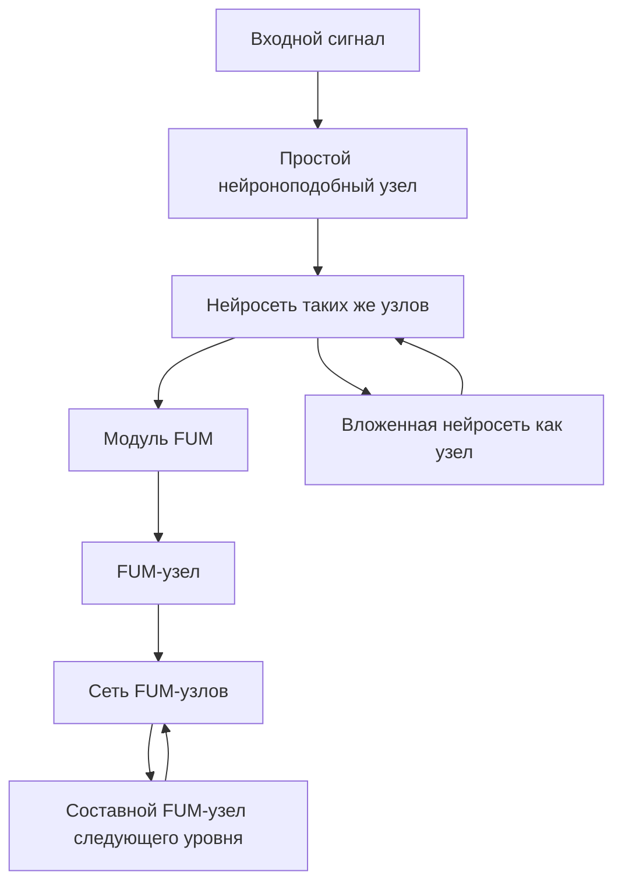
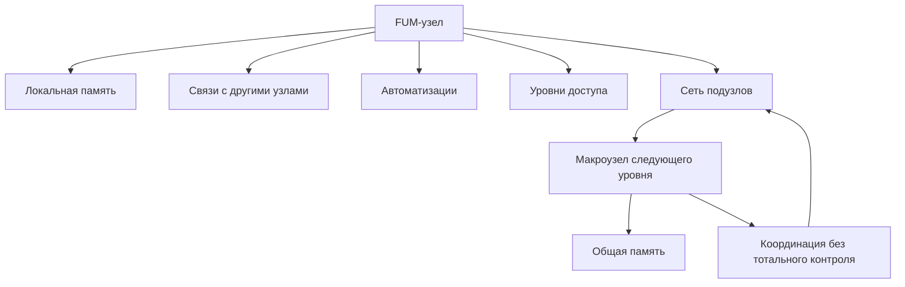

# [Moduljnaya](../Glossarij/modulj-FUM.md) arkhitektura [FUM](../Glossarij/FUM.md)

Etot dokument opisyivayet [moduljnostj](../Glossarij/modulj-FUM.md) kak odin iz centraljnyikh principov [arkhitekturyi FUM](../Glossarij/arkhitektura-FUM.md). Svodnaya karta arkhitekturnyikh sloyov nakhoditsya v dokumente [Arkhitektura FUM](22-arkhitektura-FUM.md).

## Neokorteks kak obrazec

Dopolniteljnyim obrazcom dlya [FUM](../Glossarij/FUM.md) yavlyayetsya ustrojstvo neokorteksa: on rassmatrivayetsya v proyekte kak sistema, postroyennaya iz povtoryayemyikh universaljnyikh [modulej](../Glossarij/modulj-FUM.md), kotoryiye sposobnyi obyyedinyatjsya v setj iz [modulej](../Glossarij/modulj-FUM.md) togo zhe roda.

Dlya [FUM](../Glossarij/FUM.md) eto oznachayet, chto bazovaya yedinica arkhitekturyi ne dolzhna byitj razovoj specializirovannoj detaljyu. Ona dolzhna proyektirovatjsya kak povtoryayemyij [uzel](../Glossarij/FUM-uzel.md), kotoryij mozhet khranitj sostoyaniye, obrazovyivatj svyazi, uchastvovatj v myishlenii i stanovitjsya chastjyu boleye krupnoj seti takikh zhe uzlov.

## Parnaya organizaciya sostavnogo uzla

V uprosjhyonnoj arkhitekturnoj modeli boljshiye polushariya chelovecheskogo mozga mozhno rassmatrivatj kak dve strukturno skhodnyiye, no ne tozhdestvennyiye i chastichno specializirovannyiye obrabatyivayusjhiye podsistemyi. Oni sokhranyayut razlichayusjhiyesya lokaljnyiye sostoyaniya i koordiniruyut rabotu prezhde vsego cherez mozolistoye telo. Eta modelj ne svodit vesj mozg k dvum «mashinam» i ne obyyavlyayet mozolistoye telo yedinstvennyim mezhpolusharnyim putyom.

Dlya [FUM](../Glossarij/FUM.md) perenositsya boleye obsjhij invariant: sostavnoj [FUM-uzel](../Glossarij/FUM-uzel.md) mozhet voznikatj iz odnotipnyikh po obsjhemu planu [poduzlov](../Glossarij/poduzel-FUM.md), kotoryiye paralleljno obrabatyivayut signalyi i dostigayut dostatochnoj dlya zadachi soglasovannosti cherez yavnyij ogranichennyij kanal obmena, ne vyiravnivaya vnutrenniye sostoyaniya. Para yavlyayetsya minimaljnyim chastnyim sluchayem takoj seti, a ne ogranicheniyem arkhitekturyi rovno dvumya uzlami.

## Nejrosetevaya skhema

[FUM](../Glossarij/FUM.md) mozhno izobrazhatj kak rekursivnuyu nejrosetj. V takoj skheme uzel mozhet byitj prostyim nejronopodobnyim elementom, kotoryij prinimayet signal, menyayet sostoyaniye i peredayot vyikhod daljshe, ili setjyu takikh zhe uzlov, rassmatrivayemoj kak odin [FUM-uzel](../Glossarij/FUM-uzel.md) sleduyusjhego masshtaba.

Eta modelj ne trebuyet svoditj [FUM](../Glossarij/FUM.md) k biologicheskoj kopii mozga ili k klassicheskoj iskusstvennoj nejroseti. Ona fiksiruyet arkhitekturnuyu formu: minimaljnyij element, [modulj](../Glossarij/modulj-FUM.md), vlozhennaya setj i sostavnoj [FUM-uzel](../Glossarij/FUM-uzel.md) dolzhnyi byitj sovmestimyi po logike svyazej, [pamyati](../Glossarij/pamyatj-FUM.md), proiskhozhdeniya i peredachi rezuljtatov.

V terminakh [nejronnoj giperseti FUM](../Glossarij/nejronnaya-gipersetj-FUM.md) eta rekursiya dvunapravlenna. Naruzhu [modulj](../Glossarij/modulj-FUM.md) vkhodit v setj drugikh uzlov i uchastvuyet v obmene signalami, [narabotkami](../Glossarij/narabotka.md) i rezuljtatami otbora. Vnutrj on mozhet predyyavlyatj sobstvennyim [poduzlam](../Glossarij/poduzel-FUM.md) pamyatj, [modeljnuyu sredu](../Glossarij/modeljnaya-sreda.md), avtomatizacii, ogranicheniya i interfejs, iz kotoryikh skladyivayetsya sleduyusjhij urovenj seti.

Eta zhe skhema dopuskayet vzglyad na nejrosetj kak na sredu ispolneniya. Uzlyi i svyazi obrazuyut kartu vozmozhnyikh lokaljnyikh perekhodov, a agent prokhodit po etoj karte s sobstvennyimi nastrojkami interpretacii. V minimaljnom sluchaye takim agentom mozhet byitj prostoj arifmeticheskij vyichislitelj; v boleye slozhnom - [FUM-uzel](../Glossarij/FUM-uzel.md), chji nasleduyemyiye parametryi zadayut sposob obkhoda, ocenki i zakrepleniya rezuljtata.

Vnutri etoj skhemyi kazhdyij ustojchivyij modulj dolzhen podderzhivatj [iyerarkhiyu funkcij i dannyikh FUM](../Glossarij/iyerarkhiya-funkcij-i-dannyikh-FUM.md): vkhodyi, lokaljnoye sostoyaniye i trassyi menyayutsya byistreye, chem telo funkcii modulya, a telo funkcii menyayetsya toljko cherez boleye bazovyij mekhanizm proverki, otbora, obucheniya ili zamenyi. Poetomu modulj opisyivayetsya ne toljko kak "chto on delayet", no i kak "kakiye dannyiye on prinimayet", "kakaya funkciya ostayotsya ustojchivoj", "kakoj sloj imeyet pravo menyatj etu funkciyu" i "kak eto izmeneniye otkatyivayetsya".

## [Kontroliruyemaya nejroplastichnostj FUM](../Glossarij/kontroliruyemaya-nejroplastichnostj-FUM.md)

[Moduli FUM](../Glossarij/modulj-FUM.md) dolzhnyi umetj voznikatj ne toljko cherez ruchnoye proyektirovaniye, no i kak rezuljtat [potokovoj samostrukturizacii FUM](../Glossarij/potokovaya-samostrukturizaciya-FUM.md). Povtoryayusjhijsya i poleznyij kontekst snachala mozhet byitj statisticheskim uzlom [suffiksno-prediktivnoj pamyati](../Glossarij/suffiksno-prediktivnaya-pamyatj-FUM.md), zatem latentnyim simvolom ili embedding, zatem adapterom, ekspertom, marshrutizatorom, detektorom anomalii ili drugim specializirovannyim modulem.

Takoj rost ne dolzhen byitj khaoticheskim. Kazhdyij novyij modulj trebuyet proiskhozhdeniya, kriteriya poljzyi, byudzheta pamyati i vyichislenij, proverki na uderzhannyikh dannyikh ili v sandbox, ocenki riska i sposoba otkata. Yesli modulj ustarevayet, dubliruyet sosedniye funkcii, ukhudshayet rezuljtat ili narushayet ogranicheniya dostupa, on dolzhen szhimatjsya, slivatjsya, zamorazhivatjsya, udalyatjsya ili perenositjsya v arkhivnyij sloj [pamyati FUM](../Glossarij/pamyatj-FUM.md).

## Arkhitekturnoye trebovaniye

- Bazovyij [modulj](../Glossarij/modulj-FUM.md) [FUM](../Glossarij/FUM.md) dolzhen byitj dostatochno universaljnyim, chtobyi primenyatjsya v raznyikh mestakh sistemyi bez poteri obsjhej logiki.
- [Moduli](../Glossarij/modulj-FUM.md) dolzhnyi umetj soyedinyatjsya drug s drugom i obrazovyivatj setj, v kotoroj svyazi mezhdu [modulyami](../Glossarij/modulj-FUM.md) stanovyatsya chastjyu [pamyati](../Glossarij/pamyatj-FUM.md) i myishleniya.
- Boleye krupnyiye strukturyi [FUM](../Glossarij/FUM.md) dolzhnyi sobiratjsya iz tekh zhe principov, chto i malyiye uzlyi: povtoreniye, svyazj, specializaciya cherez kontekst i vklyucheniye v obsjhuyu setj.
- Arkhitekturnaya plastichnostj dolzhna byitj kontroliruyemoj: novyiye [moduli](../Glossarij/modulj-FUM.md) sozdayutsya, usilivayutsya, slivayutsya i udalyayutsya cherez proveryayemyiye kriterii predskazateljnoj poljzyi, szhatiya, dejstviya, bezopasnosti, stoimosti i proiskhozhdeniya.
- [Fraktaljnostj](../Glossarij/fraktaljnyij-uzel-myishleniya.md) [FUM](../Glossarij/FUM.md) dolzhna vyirazhatjsya ne toljko v obraze proyekta, no i v arkhitekture: uzel mozhet byitj prostyim nejronopodobnyim elementom, prostoj funkciyej, agentom, workflow ili vlozhennoj setjyu, a setj mozhet stanovitjsya uzlom sleduyusjhego urovnya.
- Modulj dolzhen yavno razlichatj dannyiye, parametryi, telo funkcii i meta-funkciyu izmeneniya etogo tela; bez takogo razlicheniya plastichnostj prevrasjhayetsya libo v skryitoye samoizmeneniye, libo v nepodvizhnyij mekhanizm bez obucheniya.
- [Nejronnaya gipersetj FUM](../Glossarij/nejronnaya-gipersetj-FUM.md) dolzhna podderzhivatj obe storonyi rekursii: vklyucheniye uzla vo vneshnyuyu setj i razvorachivaniye vnutrennej seti poduzlov.
- Moduljnaya setj dolzhna pozvolyatj agentam-interpretatoram peremesjhatjsya po nej kak po karte sredyi, sokhranyaya trassyi, nastrojki interpretacii, proiskhozhdeniye rezuljtata i granicu mezhdu izmeneniyem agenta i izmeneniyem samoj seti.
- [Decentralizaciya FUM](../Glossarij/decentralizaciya-FUM.md) dolzhna byitj vstroyena v samu [moduljnuyu](../Glossarij/modulj-FUM.md) arkhitekturu: setj uzlov ne dolzhna prevrasjhatjsya v iyerarkhiyu, gde odin urovenj obladayet totaljnoj vlastjyu nad vsemi [poduzlami](../Glossarij/poduzel-FUM.md).

## Interfejsnyij fokus uzla

Moduljnostj dolzhna opisyivatj ne toljko, iz kakikh chastej sostoit [FUM-uzel](../Glossarij/FUM-uzel.md), no i kakoj [interfejs FUM-uzla](../Glossarij/interfejs-FUM-uzla.md) delayet eti chasti nablyudayemyimi i sovmestimyimi. Odin i tot zhe uzel mozhet byitj malyim nejronopodobnyim elementom, lokaljnyim agentom, servisnyim adapterom ili sostavnoj setjyu, no v kazhdom sluchaye nuzhno razlichatj vnutrennij i vneshnij interfejs.

Vnutrennij interfejs pokazyivayet uzlu yego lokaljnuyu [pamyatj](../Glossarij/pamyatj-FUM.md), sostoyaniya, poduzlyi, svyazi, avtomatizacii i ogranicheniya. Vneshnij interfejs pokazyivayet drugim uzlam, cheloveku i servisam, kakiye signalyi uzel prinimayet, kakiye rezuljtatyi vozvrasjhayet, kakiye [narabotki](../Glossarij/narabotka.md) mozhet eksportirovatj i kakiye dejstviya trebuyut podtverzhdeniya. Bez etoj paryi fraktaljnostj ostayotsya metaforoj: setj mozhet vyiglyadetj kak uzel, no ne imetj proveryayemogo sposoba vzaimodejstviya s vnutrennimi i vneshnimi sloyami.

## Skhema [moduljnoj arkhitekturyi](../Glossarij/modulj-FUM.md)

## [Avtomatizacii](../Glossarij/avtomatizaciya-FUM.md) kak moduljnyiye strukturyi

Ustojchivyiye [avtomatizacii FUM](../Glossarij/avtomatizaciya-FUM.md) dolzhnyi proyektirovatjsya kak proveryayemyiye elementyi [moduljnoj](../Glossarij/modulj-FUM.md) arkhitekturyi. Yesli avtomatizaciya vyipolnyayet vospriyatiye, dejstviye, vizualizaciyu, proverku, vyibor perekhoda ili preobrazovaniye [pamyati](../Glossarij/pamyatj-FUM.md), ona dolzhna imetj yavnoye mesto v seti uzlov i vosstanovimoye opisaniye svoyego povedeniya.

[Avtomaticheskij organ vospriyatiya FUM](../Glossarij/avtomaticheskij-organ-vospriyatiya-FUM.md) yavlyayetsya takoj moduljnoj strukturoj na granice sredyi i [pamyati](../Glossarij/pamyatj-FUM.md). Yego arkhitekturnaya zadacha - byistro prevrasjhatj shirokij vneshnij potok v kompaktnoye opisaniye, kotoroye mozhno polnostjyu sokhranitj i peredatj na obrabotku LLM vnutri [FUM](../Glossarij/FUM.md), ne smeshivaya eto opisaniye s samim neszhatyim potokom.

[Avtomaticheskij organ dejstviya FUM](../Glossarij/avtomaticheskij-organ-dejstviya-FUM.md) yavlyayetsya simmetrichnoj moduljnoj strukturoj na granice namereniya i ispolneniya. Yego arkhitekturnaya zadacha - razvorachivatj vyisokourovnevoye opisaniye dejstviya, sozdannoye LLM ili drugim mekhanizmom, v nizkourovnevyiye komandyi ispolniteljnyikh mekhanizmov v fizicheskoj libo programmnoj srede.

Dlya takikh struktur predpochtitelen pattern [chistoj funkcii](../Glossarij/chistaya-funkciya.md): chistoye vyichisliteljnoye yadro otdelyayetsya ot obolochek vvoda-vyivoda, instrumentov, interfejsa i fizicheskogo vozdejstviya. Eto pomogayet zamenyatj i perenositj [moduli](../Glossarij/modulj-FUM.md), proveryatj ikh na kontroljnyikh vkhodakh i prevrasjhatj udachnyiye avtomatizacii v [narabotki](../Glossarij/narabotka.md).

[Yazyik avtomatizacij FUM](../Glossarij/yazyik-avtomatizacij-FUM.md) dolzhen statj odnim iz sposobov delatj takiye moduli perenosimyimi. Yesli avtomatizaciya opisana na yazyike s yavnyimi vkhodami, vyikhodami, effektami, proverkami i trassami, LLM mozhet menyatj yeyo kak ogranichennyij modulj, a drugoj [FUM-uzel](../Glossarij/FUM-uzel.md) mozhet prinyatj yeyo kak [narabotku](../Glossarij/narabotka.md) bez neobkhodimosti doveryatj skryitomu sostoyaniyu iskhodnogo agenta.

Yesli avtomatizaciya menyayet druguyu avtomatizaciyu, ona dolzhna rassmatrivatjsya kak funkciya boleye bazovogo urovnya. Yeyo vkhodami stanovyatsya iskhodnoye telo funkcii, testyi, trassyi zapuskov, ogranicheniya dostupa i kriterii poljzyi; vyikhodom - novyij kandidat tela funkcii s obyyasnimyim diff, proverkami i vozmozhnostjyu otkata. Eto svyazyivayet moduljnostj s mnogourovnevoj plastichnostjyu, ne prevrasjhaya lyubuyu LLM-pravku v beskontroljnoye izmeneniye arkhitekturyi.

## [Decentralizaciya](../Glossarij/decentralizaciya-FUM.md) uzlov

[Moduljnaya](../Glossarij/modulj-FUM.md) arkhitektura dolzhna podderzhivatj koordinaciyu bez yedinstvennogo centra polnoj vlasti. Yesli setj stanovitsya [FUM-uzlom](../Glossarij/FUM-uzel.md) sleduyusjhego urovnya, eto ne oznachayet, chto novyij urovenj poluchayet pravo polnostjyu chitatj, menyatj ili prisvaivatj vnutrennyuyu oblastj kazhdogo [poduzla](../Glossarij/poduzel-FUM.md).

Arkhitekturno eto oznachayet, chto u uzlov dolzhnyi sokhranyatjsya lokaljnyiye oblasti [pamyati](../Glossarij/pamyatj-FUM.md), proiskhozhdeniye reshenij, otdeljnyiye [urovni dostupa](../Glossarij/urovenj-dostupa.md) i [granicyi vlasti](../Glossarij/granica-vlasti-FUM.md). Sostavnoj uzel mozhet imetj protokolyi soglasovaniya, avarijnyiye ogranicheniya i obsjhiye pravila, no eti mekhanizmyi dolzhnyi byitj proveryayemyimi i ne prevrasjhatjsya v skryituyu totaljnuyu vlastj.

Podrobnoye trebovaniye opisano v dokumente [Decentralizaciya FUM i granicyi vlasti](15-decentralizaciya-i-granicyi-vlasti.md). Prakticheskaya granica mezhdu dopustimoj koordinaciyej i nedopustimyim totaljnyim kontrolem zafiksirovana kak [otkryityij vopros](../Voprosyi/2026-06-22_07-51-48_MSK_granicyi-vlasti-uzlov-FUM.md).

## Svyazj s [pamyatjyu](../Glossarij/pamyatj-FUM.md) i myishleniyem

[Moduljnaya](../Glossarij/modulj-FUM.md) arkhitektura utochnyayet biologicheskuyu modelj [pamyati FUM](../Glossarij/pamyatj-FUM.md). Yesli [pamyatj](../Glossarij/pamyatj-FUM.md) razvivayetsya cherez nasledovaniye, izmenchivostj i otbor, to povtoryayemyiye [moduli](../Glossarij/modulj-FUM.md) dayut materialjnuyu formu etomu processu: kazhdyij [modulj](../Glossarij/modulj-FUM.md) sokhranyayet chastj sostoyaniya, dopuskayet perestrojku svyazej i uchastvuyet v zakreplenii udachnyikh konfiguracij.

Takoj podkhod svyazyivayet [pamyatj](../Glossarij/pamyatj-FUM.md), arkhitekturu i myishleniye v odnu modelj. [FUM](../Glossarij/FUM.md) dolzhen razvivatjsya kak setj povtoryayemyikh uzlov, gde myishleniye voznikayet ne iz odnogo centraljnogo khranilisjha, a iz organizovannogo vzaimodejstviya [modulej](../Glossarij/modulj-FUM.md).

## Apparatnaya realizaciya uzlov

[Moduljnaya](../Glossarij/modulj-FUM.md) arkhitektura [FUM](../Glossarij/FUM.md) dolzhna byitj sovmestima ne toljko s programmnyimi, no i s apparatnyimi realizaciyami. [Apparatnyij FUM-uzel](../Glossarij/apparatnyij-FUM-uzel.md) rassmatrivayetsya kak fizicheskoye voplosjheniye vyichisliteljnoj, sensornoj, upravlyayusjhej ili ispolniteljnoj chasti [FUM](../Glossarij/FUM.md), sokhranyayusjheye obsjhuyu logiku uzla, svyazi, [pamyati](../Glossarij/pamyatj-FUM.md) i proveryayemyikh [narabotok](../Glossarij/narabotka.md).

Eto oznachayet, chto [modulj](../Glossarij/modulj-FUM.md) [FUM](../Glossarij/FUM.md) dolzhen imetj proyektnoye opisaniye, prigodnoye dlya raznyikh nositelej: programmnogo processa, dokumentacionnogo workflow, vyichisliteljnogo ustrojstva, robotizirovannogo ispolnitelya ili proizvodstvennoj linii. Perekhod k [fizicheskomu dejstviyu FUM](../Glossarij/fizicheskoye-dejstviye-FUM.md) trebuyet yavnogo razlicheniya cifrovoj modeli, apparatnogo proyekta, prototipa, izgotovlennogo ustrojstva, ispyitaniya i ekspluatacii.

[Robotizirovannyiye sistemyi FUM](../Glossarij/robotizirovannaya-sistema-FUM.md) i [proizvodstvennyiye cepochki FUM](../Glossarij/proizvodstvennaya-cepochka-FUM.md) dolzhnyi poetomu proyektirovatjsya kak sostavnyiye seti uzlov, a ne kak vneshniye prilozheniya k agentu. Podrobnoye trebovaniye opisano v dokumente [Fizicheskoye dejstviye FUM i apparatnyiye uzlyi](13-fizicheskoye-dejstviye-i-apparatnyiye-uzlyi.md); granicyi apparatnoj avtonomii trebuyut utochneniya i zafiksirovanyi kak [otkryityij vopros](../Voprosyi/2026-06-22_07-28-43_MSK_granicyi-apparatnoj-avtonomii-FUM.md).

## Sredyi vnutrennikh uzlov

[Fraktaljnostj FUM](../Glossarij/fraktaljnyij-uzel-myishleniya.md) oznachayet, chto uzel mozhet ne toljko vkhoditj v setj, no i sozdavatj vnutrennyuyu sredu dlya vlozhennyikh uzlov togo zhe roda. Takaya sreda stanovitsya arkhitekturnoj formoj modeli mira: [vnutrenniye FUM](../Glossarij/vnutrennij-FUM.md) mogut predstavlyatj uchastnikov, roli, gipotezyi, podsistemyi ili variantyi budusjhikh dejstvij.

Arkhitektura dolzhna podderzhivatj razlichiye mezhdu vneshnim uzlom, yego vnutrennej modeljyu i [vnutrennim FUM](../Glossarij/vnutrennij-FUM.md), dejstvuyusjhim v [modeljnoj srede](../Glossarij/modeljnaya-sreda.md). Eto razlichiye osobenno vazhno dlya opisaniya aktualjnogo mira, rekonstrukcii proshlogo i planirovaniya budusjhego: odna i ta zhe [moduljnaya](../Glossarij/modulj-FUM.md) forma mozhet ispoljzovatjsya v raznyikh vremennyikh rezhimakh, no s raznyimi pravilami uverennosti i proverki.

Podrobnoye trebovaniye opisano v dokumente [Sreda dlya vnutrennikh FUM](11-sreda-dlya-vnutrennikh-FUM.md). Status [vnutrennikh FUM](../Glossarij/vnutrennij-FUM.md) trebuyet utochneniya i zafiksirovan kak [otkryityij vopros](../Voprosyi/2026-06-22_06-35-26_MSK_status-vnutrennikh-FUM.md).

## [Virtualizovannyiye sredyi](../Glossarij/virtualizovannaya-sreda-FUM.md) uzlov

[Moduljnaya](../Glossarij/modulj-FUM.md) arkhitektura dolzhna pozvolyatj uzlu ne toljko vkhoditj v setj ili sozdavatj [modeljnuyu sredu](../Glossarij/modeljnaya-sreda.md), no i predyyavlyatj svoim [poduzlam](../Glossarij/poduzel-FUM.md) organizovannyij interfejs poverkh boleye syirogo nizhnego sloya. V takom rezhime uzel stanovitsya sredovyim sloyem: on mozhet prevrasjhatj bajtovyij potok, syiroj nakopitelj, fajlovuyu sistemu, servisnyij API ili modeljnoye sostoyaniye v boleye udobnuyu formu dolgovremennoj [pamyati](../Glossarij/pamyatj-FUM.md).

Eto sokhranyayet fraktaljnostj arkhitekturyi v sistemnom sloye. Malyij uzel mozhet poluchitj uzhe organizovannuyu fajlovuyu sistemu ili graf [pamyati](../Glossarij/pamyatj-FUM.md), a zatem postroitj poverkh nikh sleduyusjhuyu [virtualizovannuyu sredu FUM](../Glossarij/virtualizovannaya-sreda-FUM.md) dlya svoikh vlozhennyikh uzlov. Pri etom kazhdyij sloj dolzhen sokhranyatj proiskhozhdeniye, [urovni dostupa](../Glossarij/urovenj-dostupa.md), ogranicheniya i proveryayemuyu kartu svyazi s nizhnim sloyem. Podrobnoye trebovaniye opisano v dokumente [Virtualizovannyiye sredyi FUM i dolgovremennaya pamyatj](23-virtualizovannyiye-sredyi-i-dolgovremennaya-pamyatj.md).

## Modeli sosednikh uzlov

Yesli [FUM](../Glossarij/FUM.md) razvivayetsya kak setj uzlov, kazhdyij uzel dolzhen umetj stroitj [vnutrenniye modeli drugikh uzlov](../Glossarij/vnutrennyaya-modelj-drugogo-uzla.md), s kotoryimi on vzaimodejstvuyet. V arkhitekture eto oznachayet nalichiye predstavlenij ne toljko o sobstvennom sostoyanii, no i o sosednikh uchastnikakh seti: ikh dostupnyikh interfejsakh, istorii vzaimodejstviya, izvestnyikh ogranicheniyakh, sovmestimosti [narabotok](../Glossarij/narabotka.md) i urovne doveriya.

Chelovek v takoj arkhitekture takzhe rassmatrivayetsya kak [FUM-uzel](../Glossarij/FUM-uzel.md). Modelj cheloveka dolzhna byitj chastjyu vzaimodejstviya, no ne dolzhna prevrasjhatjsya v utverzhdeniye o polnom znanii yego [vnutrennego sostoyaniya](../Glossarij/vnutrenneye-sostoyaniye.md): [FUM](../Glossarij/FUM.md) dolzhen khranitj razlichiye mezhdu pryamyim soobsjheniyem, nablyudeniyem, vyivodom i neizvestnostjyu.

## Gibridnyiye i socialjnyiye uzlyi

[Moduljnaya](../Glossarij/modulj-FUM.md) arkhitektura dolzhna podderzhivatj ne toljko otdeljnyiye [FUM](../Glossarij/FUM.md)-agentyi i ikh vnutrenniye modeli, no i [gibridnyiye uzlyi](../Glossarij/gibridnyij-uzel.md) chelovek-[FUM](../Glossarij/FUM.md). [Lichnyij agent cheloveka](../Glossarij/lichnyij-FUM-agent.md) dolzhen umetj obrazovyivatj s nim ustojchivuyu svyazku, kotoraya mozhet vyistupatj kak yedinaya rabochaya yedinica myishleniya i dejstviya, sokhranyaya vnutrenniye granicyi mezhdu chelovekom, agentom i obsjhej oblastjyu [pamyati](../Glossarij/pamyatj-FUM.md).

Ta zhe [fraktaljnaya](../Glossarij/fraktaljnyij-uzel-myishleniya.md) logika dolzhna primenyatjsya k setyam takikh svyazok. Neskoljko [gibridnyikh uzlov](../Glossarij/gibridnyij-uzel.md) mogut obrazovyivatj uzel sleduyusjhego urovnya: semjyu, komandu, kompaniyu, soobsjhestvo ili inoj civilizacionnyij element. Arkhitektura dolzhna poetomu podderzhivatj sostavnyiye uzlyi s uchastnikami, rolyami, protokolami soglasovaniya, obsjhej [pamyatjyu](../Glossarij/pamyatj-FUM.md), [urovnyami dostupa](../Glossarij/urovenj-dostupa.md) i vneshnimi interfejsami.

Podrobnoye trebovaniye opisano v dokumente [Gibridnyiye uzlyi i socialjnaya fraktaljnostj](12-gibridnyiye-uzlyi-i-socialjnaya-fraktaljnostj.md).

## Peredacha mezhdu uzlami

Yesli uzlyi [FUM](../Glossarij/FUM.md) obrazuyut setj, oni dolzhnyi imetj vozmozhnostj obmenivatjsya ustojchivyimi [narabotkami](../Glossarij/narabotka.md). [Modulj](../Glossarij/modulj-FUM.md), [pattern](../Glossarij/pattern-pamyati.md), workflow ili proverka mogut peredavatjsya drugomu uzlu toljko vmeste s metadannyimi proiskhozhdeniya, sovmestimosti i dostupa. Inache setj poluchayet fragmentyi bez konteksta i teryayet sposobnostj osmyislenno nasledovatj rezuljtat.

[Moduljnaya](../Glossarij/modulj-FUM.md) arkhitektura dolzhna poetomu predusmatrivatj interfejsyi eksporta i importa [narabotok](../Glossarij/narabotka.md). Eti interfejsyi dolzhnyi razlichatj tekhnicheskuyu sovmestimostj i pravo peredachi: [modulj](../Glossarij/modulj-FUM.md) mozhet byitj prigoden dlya vklyucheniya v setj po forme, no nedostupen dlya publikacii ili daljnejshego rasprostraneniya po [urovnyu dostupa](../Glossarij/urovenj-dostupa.md).

## Evolyucionnyiye cepochki kak moduli

[Evolyucionnaya cepochka FUM](../Glossarij/evolyucionnaya-cepochka-FUM.md) takzhe mozhet rassmatrivatjsya kak moduljnaya struktura: ona prinimayet vkhodnoj signal, porozhdayet variantyi, provodit [dvukhkonturnyij otbor](../Glossarij/dvukhkonturnyij-otbor-FUM.md), oformlyayet [peredavayemyiye rezuljtatyi](../Glossarij/peredavayemyij-rezuljtat-FUM.md), napravlyayet ikh sleduyusjhim uzlam i sokhranyayet proiskhozhdeniye. Yesli takaya cepochka stanovitsya vosproizvodimoj, proveryayemoj i perenosimoj, ona prevrasjhayetsya v [narabotku](../Glossarij/narabotka.md) i mozhet ispoljzovatjsya kak [modulj FUM](../Glossarij/modulj-FUM.md) sleduyusjhego urovnya.

V Git-infrastrukture etu rolj vyipolnyayet svyazka vetok, commits, pull requests, proverok, [reyestra proiskhozhdeniya FUM](../Glossarij/reyestr-proiskhozhdeniya-FUM.md), [vesov agentov](../Glossarij/ves-agenta-FUM.md), [vesov svyazej](../Glossarij/ves-svyazi-FUM.md) i marshrutov peredachi mezhdu uzlami. Podrobnoye trebovaniye opisano v dokumente [Git-infrastruktura evolyucionnyikh cepochek FUM](20-Git-infrastruktura-evolyucionnyikh-cepochek-FUM.md).

## Istochniki trebovanij

- [iskhodnyij zapros 2026-06-22 05:39:36 MSK](../Zhurnal/2026-06-22_05-39-36_MSK/zapros.md)
- [iskhodnyij zapros 2026-06-22 06:17:48 MSK](../Zhurnal/2026-06-22_06-17-48_MSK/zapros.md)
- [iskhodnyij zapros 2026-06-22 06:22:15 MSK](../Zhurnal/2026-06-22_06-22-15_MSK/zapros.md)
- [iskhodnyij zapros 2026-06-22 06:35:26 MSK](../Zhurnal/2026-06-22_06-35-26_MSK/zapros.md)
- [iskhodnyij zapros 2026-06-22 06:40:09 MSK](../Zhurnal/2026-06-22_06-40-09_MSK/zapros.md)
- [iskhodnyij zapros 2026-06-22 07:28:43 MSK](../Zhurnal/2026-06-22_07-28-43_MSK/zapros.md)
- [iskhodnyij zapros 2026-06-22 07:51:48 MSK](../Zhurnal/2026-06-22_07-51-48_MSK/zapros.md)
- [iskhodnyij zapros 2026-06-22 08:58:31 MSK](../Zhurnal/2026-06-22_08-58-31_MSK/zapros.md)
- [iskhodnyij zapros 2026-06-22 09:05:49 MSK](../Zhurnal/2026-06-22_09-05-49_MSK/zapros.md)
- [iskhodnyij zapros 2026-06-22 09:11:47 MSK](../Zhurnal/2026-06-22_09-11-47_MSK/zapros.md)
- [iskhodnyij zapros 2026-06-23 13:18:14 MSK](../Zhurnal/2026-06-23_13-18-14_MSK/zapros.md)
- [iskhodnyij zapros 2026-06-23 18:24:05 MSK](../Zhurnal/2026-06-23_18-24-05_MSK/zapros.md)
- [iskhodnyij zapros 2026-06-23 19:06:56 MSK](../Zhurnal/2026-06-23_19-06-56_MSK/zapros.md)
- [iskhodnyij zapros 2026-06-24 15:08:46 MSK](../Zhurnal/2026-06-24_15-08-46_MSK/zapros.md)
- [iskhodnyij zapros 2026-06-24 15:35:16 MSK](../Zhurnal/2026-06-24_15-35-16_MSK/zapros.md)
- [iskhodnyij zapros 2026-06-24 16:09:34 MSK](../Zhurnal/2026-06-24_16-09-34_MSK/zapros.md)
- [iskhodnyij zapros 2026-06-25 18:50:18 MSK](../Zhurnal/2026-06-25_18-50-18_MSK/zapros.md)
- [iskhodnyij zapros 2026-06-26 09:55:41 MSK](../Zhurnal/2026-06-26_09-55-41_MSK/zapros.md)
- [iskhodnyij zapros 2026-06-26 11:05:03 MSK](../Zhurnal/2026-06-26_11-05-03_MSK/zapros.md)
- [iskhodnyij zapros 2026-07-06 10:05:34 MSK - Integrirovatj soderzhimoye ChatGPT dialoga](../Zhurnal/2026-07-06_10-05-34_MSK_integrirovatj-soderzhimoye-chatgpt-dialoga/zapros.md)
- [iskhodnyij zapros 2026-07-06 10:24:52 MSK - Opisatj nejrosetj kak sredu agentov](../Zhurnal/2026-07-06_10-24-52_MSK_opisatj-nejrosetj-kak-sredu-agentov/zapros.md)
- [iskhodnyij zapros 2026-07-06 14:49:39 MSK - Opisatj iyerarkhiyu funkcij i dannyikh](../Zhurnal/2026-07-06_14-49-39_MSK_opisatj-iyerarkhiyu-funkcij-i-dannyikh/zapros.md)
- [iskhodnyij zapros 2026-07-13 23:39:13 MSK - Zakrepitj parnuyu arkhitekturu chelovecheskogo mozga](../Zhurnal/2026-07-13_23-39-13_MSK_zakrepitj-parnuyu-arkhitekturu-chelovecheskogo-mozga/zapros.md)

<!-- FUM-MD-RECENCY:BEGIN -->
<!-- last-content-edit: 2026-08-03 14:54:04 MSK -->
<!-- content-sha256: sha256:ff49591653d16eaf4bfb3440469ac54f03364f8064b12bea463aded433af8786 -->
<!-- FUM-MD-RECENCY:END -->
