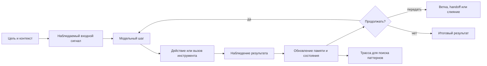

# Obzor aktualjnyikh realizacij [agentskikh ciklov](../Glossarij/agentskij-cikl.md)

Obzor otrazhayet sostoyaniye otkryityikh i publichno opisannyikh realizacij po sostoyaniyu na 2026-06-22. On ne zadayot obyazateljnyij stek dlya [FUM](../Glossarij/FUM.md), a fiksiruyet kartu susjhestvuyusjhikh podkhodov, chtobyi proyektirovatj sobstvennyij [agentskij cikl](../Glossarij/agentskij-cikl.md) ne v pustote, a otnositeljno uzhe slozhivshikhsya reshenij.

## Chto schitatj [agentskim ciklom](../Glossarij/agentskij-cikl.md)

[Agentskij cikl](../Glossarij/agentskij-cikl.md) - eto povtoryayemyij kontur, v kotorom agent prinimayet celj i sostoyaniye, vyizyivayet modelj, vyibirayet dejstviye, poluchayet nablyudeniye iz sredyi ili instrumenta, obnovlyayet sostoyaniye i reshayet, prodolzhatj li rabotu, zavershitj yeyo, peredatj drugomu agentu, zaprositj cheloveka ili perejti v druguyu [vetku](../Glossarij/vetka-rabotyi.md) processa.

V prostejshem vide cikl vyiglyadit tak:

- celj i kontekst;
- [nablyudayemyij vkhodnoj signal](../Glossarij/nablyudayemyij-vkhodnoj-signal.md): [iskhodnyij zapros](../Glossarij/iskhodnyij-zapros.md), [navigaciya po pamyati FUM](../Glossarij/navigaciya-po-pamyati-FUM.md), interfejsnoye dejstviye, sobyitiye sredyi ili drugoj vkhod;
- shag modeli: rassuzhdeniye, planirovaniye ili vyibor sleduyusjhego dejstviya;
- dejstviye: vyizov instrumenta, obrasjheniye k vneshnej sisteme, zapisj fajla, zapros k [pamyati](../Glossarij/pamyatj-FUM.md), peredacha drugomu agentu;
- nablyudeniye: rezuljtat dejstviya, oshibka, signal sredyi, otzyiv cheloveka, test ili izmeneniye [vnutrennego sostoyaniya](../Glossarij/vnutrenneye-sostoyaniye.md) [FUM](../Glossarij/FUM.md);
- obnovleniye [pamyati](../Glossarij/pamyatj-FUM.md) i rabochego sostoyaniya;
- proverka ostanovki, vetvleniya, povtora ili sliyaniya.

Dlya [FUM](../Glossarij/FUM.md) kazhdyij prokhod cikla dolzhen ostavlyatj sled, prigodnyij dlya posleduyusjhego analiza: kakiye nablyudeniya byili poluchenyi, kakiye dejstviya vyibranyi, kakiye [vnutrenniye sostoyaniya](../Glossarij/vnutrenneye-sostoyaniye.md) izmenilisj, v kakom poryadke oni povtoryalisj i k kakomu rezuljtatu priveli. Poetomu [agentskij cikl](../Glossarij/agentskij-cikl.md) yavlyayetsya ne toljko mekhanizmom ispolneniya, no i istochnikom materiala dlya formirovaniya ustojchivyikh [patternov](../Glossarij/pattern-pamyati.md) nablyudeniya i dejstvij.

[Agentskij cikl](../Glossarij/agentskij-cikl.md) [FUM](../Glossarij/FUM.md) dolzhen byitj prakticheskim voplosjheniyem [obobsjhyonnogo darvinovskogo algoritma](../Glossarij/obobsjhyonnyij-darvinovskij-algoritm.md): agent porozhdayet ne toljko finaljnyij otvet, no i cepochku rassuzhdenij, reshenij, dejstvij, proverok i peredach rezuljtata. Otbor dolzhen uchityivatj sposobnostj agenta podderzhivatj dlinnyiye cepochki toljko togda, kogda oni ostayutsya poleznyimi i produktivnyimi: prodvigayut zadachu, sozdayut proveryayemyiye [narabotki](../Glossarij/narabotka.md), dayut material dlya posleduyusjhikh ciklov i ne trebuyut nesorazmernoj cenyi, riska ili chelovecheskogo vnimaniya. V trasse sokhranyayutsya nablyudayemyiye zvenjya takoj cepochki, a ne skryityiye vnutrenniye rassuzhdeniya modeli.

Vnutri cikla dolzhna sokhranyatjsya [iyerarkhiya funkcij i dannyikh FUM](../Glossarij/iyerarkhiya-funkcij-i-dannyikh-FUM.md). Nablyudeniya, vkhodyi i promezhutochnyiye rezuljtatyi yavlyayutsya byistryimi dannyimi; strategiya vyibora dejstviya, politika ostanovki, nastrojki interpretacii i workflow yavlyayutsya boleye ustojchivyimi funkciyami; refleksiya, obucheniye, revjyu ili generator avtomatizacij vyistupayut boleye bazovyimi funkciyami, kotoryiye mogut menyatj eti funkcii toljko po trasse, proverkam i kriteriyam otbora.

Yesli [nejronnaya gipersetj FUM](../Glossarij/nejronnaya-gipersetj-FUM.md) predyyavlyayetsya kak karta ili [modeljnaya sreda](../Glossarij/modeljnaya-sreda.md), agentskij cikl stanovitsya peremesjheniyem po etoj srede. Agent vyibirayet ne toljko vneshneye dejstviye, no i marshrut interpretacii setevyikh uzlov: kakiye perekhodyi chitatj, kakiye lokaljnyiye vyichisleniya primenyatj, gde ostanovitjsya, chto schitatj poleznyim rezuljtatom i kakiye nastrojki peredatj sleduyusjhemu ciklu.

Yesli v srede dejstvuyet populyaciya agentov, cikl dolzhen uchityivatj ne toljko sostoyaniye odnogo ispolnitelya, no i sostoyaniye populyacii: pozicii, byudzhetyi, nasleduyemyiye profili interpretacii, mutacii, ischeznoveniye, kooperaciyu, konkurenciyu i vklad v itogovyij otvet. Takaya trassa nuzhna, chtobyi otlichatj produktivnuyu runtime-evolyuciyu ot vnutrennej optimizacii za resursyi, kotoraya ne uluchshayet resheniye zadachi.

Analiz takikh sledov dolzhen opiratjsya na [obsjhij mekhanizm poiska povtoryayusjhikhsya posledovateljnostej](../Glossarij/obobsjhyonnyij-poisk-povtoryayusjhikhsya-posledovateljnostej.md). Trassa [agentskogo cikla](../Glossarij/agentskij-cikl.md) yavlyayetsya odnim vidom posledovateljnosti naryadu s tekstom, sobyitiyami, sostoyaniyami i [patternami](../Glossarij/pattern-pamyati.md) boleye vyisokogo urovnya.

Nablyudayemostj [vnutrennikh sostoyanij](../Glossarij/vnutrenneye-sostoyaniye.md) yavlyayetsya obyazateljnoj chastjyu cikla. Yesli interfejs pokazyivayet poljzovatelyu znachimuyu informaciyu, agent dolzhen imetj kanal, cherez kotoryij on mozhet uvidetj i obrabotatj to zhe sostoyaniye. Podrobno eto trebovaniye opisano v dokumente [Dostup k vnutrennim sostoyaniyam](07-dostup-k-vnutrennim-sostoyaniyam.md).

[Navigaciya po pamyati FUM](../Glossarij/navigaciya-po-pamyati-FUM.md) dolzhna popadatj v trassu [agentskogo cikla](../Glossarij/agentskij-cikl.md) kak [nablyudayemyij vkhodnoj signal](../Glossarij/nablyudayemyij-vkhodnoj-signal.md). Dlya cikla vazhen sam perekhod po [pamyati](../Glossarij/pamyatj-FUM.md): otkuda poljzovatelj ili agent prishyol, kuda pereshyol, chto iskal, kakoj fragment vyibral i kakim kanalom vvoda eto byilo sdelano.

[Avtomaticheskiye organyi vospriyatiya FUM](../Glossarij/avtomaticheskij-organ-vospriyatiya-FUM.md) raspolagayutsya pered shagom modeli ili ryadom s nim: pri vneshnem sobyitii oni byistro szhimayut shirokij potok do kompaktnogo [nablyudayemogo vkhodnogo signala](../Glossarij/nablyudayemyij-vkhodnoj-signal.md). Posle etogo LLM vnutri [FUM](../Glossarij/FUM.md), lokaljnaya ili vneshnyaya, rabotayet uzhe s formoj, kotoruyu mozhno polnostjyu zapomnitj i sopostavitj s daljnejshimi dejstviyami cikla.

[Avtomaticheskiye organyi dejstviya FUM](../Glossarij/avtomaticheskij-organ-dejstviya-FUM.md) raspolagayutsya posle vyibora ili opisaniya dejstviya: oni razvorachivayut vyisokourovnevyij plan v konkretnyiye nizkourovnevyiye dejstviya ispolniteljnyikh mekhanizmov. Poetomu v cikle nuzhno razlichatj opisaniye dejstviya, podgotovlennoye LLM ili drugim mekhanizmom, i fakticheskiye komandyi, otpravlennyiye fizicheskomu ustrojstvu, programmnomu instrumentu ili interfejsu.

V sovremennyikh sistemakh etot cikl redko ostayotsya odnim linejnyim `while`. On obrastayet grafom sostoyanij, dolgovremennoj [pamyatjyu](../Glossarij/pamyatj-FUM.md), pravami dostupa, pesochnicej, trassirovkoj, chelovecheskimi podtverzhdeniyami, ocenkami kachestva i vneshnimi protokolami vzaimodejstviya s instrumentami i drugimi agentami.

Dlya [FUM](../Glossarij/FUM.md) ustojchivyiye chasti takogo cikla dolzhnyi oformlyatjsya kak [avtomatizacii FUM](../Glossarij/avtomatizaciya-FUM.md): ikh iskhodnyiye tekstyi, versii, konfiguracii, istoriya izmenenij i proverochnyiye trassyi vkhodyat v [pamyatj](../Glossarij/pamyatj-FUM.md). Predpochtiteljnyij inzhenernyij pattern - vyinositj chistyiye preobrazovaniya v [chistyiye funkcii](../Glossarij/chistaya-funkciya.md), a vyizovyi instrumentov, izmeneniye fajlov, interfejsnoye otobrazheniye i fizicheskoye dejstviye ostavlyatj nablyudayemyimi obolochkami.

## Tri masshtaba nepreryivnosti

- **Vnutri odnoj zadachi** agent povtoryayet modeljnyij shag, dejstviye, nablyudeniye i proverku do zaversheniya, ostanovki ili peredachi. Odin takoj zapusk mozhet byitj diskretnyim i vsyo zhe soderzhatj mnogo prokhodov malogo cikla.
- **Mezhdu zadachami** dolgovremennaya [pamyatj](../Glossarij/pamyatj-FUM.md), sokhranyonnoye sostoyaniye i planirovsjhik mogut prichinno svyazyivatj otdeljnyiye zapuski. V tekusjhem dokumentacionnom prototipe poljzovatelj sam zapuskayet kazhduyu pishusjhuyu sessiyu, a Git sokhranyayet yeyo lokaljnyij itog. Prezhnij eksperimentaljnyij profilj s [obyazateljnyim prodolzheniyem vetki](../Glossarij/obyazateljnoye-prodolzheniye-vetki.md), FIFO i `commit+handoff` otlozhen i ne zapuskayet sleduyusjhuyu zadachu.
- **Vo vremya aktivnogo cikla** razreshyonnyij chelovecheskij vvod postupayet kak potok [nablyudayemyikh vkhodnyikh signalov](../Glossarij/nablyudayemyij-vkhodnoj-signal.md), a ne toljko kak sleduyusjheye otpravlennoye soobsjheniye-zadacha. Korobochnyij runtime dolzhen uchityivatj znachimyij signal na bezopasnoj kontroljnoj tochke i zanovo vyibiratj nablyudayemoye prodolzheniye.

Eti masshtabyi neljzya smeshivatj. Nyineshnij Git + Codex-kontur vnutri vruchnuyu zapusjhennoj zadachi yavlyayetsya povedencheskim prototipom agentskogo cikla, no ostayotsya vneshne orkestriruyemyim i ne realizuyet sobyitijnyij vkhod sobstvennogo runtime. Poljzovateljskaya zadacha mozhet izmenitj pamyatj, trebovaniya i sleduyusjhij shag, a znachit, posleduyusjhuyu celj, prioritet, plan, vetku, dejstviye ili proverku. Mezhzadachnoye vozobnovleniye cherez strogij FIFO sokhraneno toljko v otlozhennom eksperimentaljnom profile i ne dejstvuyet kak marshrut tekusjhej zapisi.

Ozhidaniye podtverzhdeniya takzhe ne dolzhno smeshivatjsya s ostanovkoj vsego epizoda. Ono zakryivayet toljko svyazannyij s podtverzhdeniyem vneshnij perekhod. Poka bezopasnaya produktivnaya modeljnaya rabota ostayotsya vozmozhnoj v predelakh obyyavlennogo byudzheta, korobochnyij runtime prodolzhayet nablyudayemyiye model-only-shagi, a pri soderzhateljnoj neodnoznachnosti mozhet vesti neskoljko vetvej ot obsjhego sostoyaniya, otdeljno proveryatj ikh i vyibiratj daljnejshuyu modeljnuyu prorabotku. Tochnaya identichnostj provajdera, lokaljnyij ili udalyonnyij rezhim, raskryivayemyiye dannyiye i limityi vyizovov, tokenov i deneg dolzhnyi byitj nezavisimo razreshenyi dlya epizoda; ozhidaniye otveta ikh ne rasshiryayet. Modeljnyij vyibor ne povyishayet variant do poljzovateljski podtverzhdyonnogo ili razreshyonnogo vneshnego dejstviya.

Sobyitijnaya nepreryivnostj upravleniya ne trebuyet nepreryivnogo inference. [Avtomaticheskij organ vospriyatiya](../Glossarij/avtomaticheskij-organ-vospriyatiya-FUM.md) mozhet filjtrovatj i agregirovatj chastyiye sobyitiya bez modeljnogo vyizova na kazhdoye iz nikh, yesli sokhranyayet poryadok, proiskhozhdeniye, zaderzhku, poteri i granicu agregacii. Proveryayemaya «trayektoriya myishleniya» v takom kontrakte oznachayet nablyudayemyiye izmeneniya celi, plana i dejstvij, a ne raskryitiye skryityikh rassuzhdenij modeli.

## Skhema bazovogo [agentskogo cikla](../Glossarij/agentskij-cikl.md)

## Bazovyij sloj: ReAct i refleksiya

Klassicheskim osnovaniyem boljshinstva prakticheskikh realizacij ostayotsya ReAct: cheredovaniye rassuzhdeniya i dejstviya, gde modelj ne toljko otvechayet, no i vyizyivayet instrumentyi, poluchayet nablyudeniya i korrektiruyet daljnejshiye shagi. Vazhnaya ideya ReAct dlya [FUM](../Glossarij/FUM.md) sostoit ne v tom, chto vnutrenniye rassuzhdeniya obyazateljno dolzhnyi byitj vidimyi, a v tom, chto dejstviye i nablyudeniye obrazuyut proveryayemyij khod rabotyi.

Reflexion dobavlyayet k etomu vneshnij kontur obucheniya bez doobucheniya vesov: agent analiziruyet obratnuyu svyazj posle popyitki, sokhranyayet tekstovuyu refleksiyu v epizodicheskoj [pamyati](../Glossarij/pamyatj-FUM.md) i ispoljzuyet yeyo v sleduyusjhikh popyitkakh. Dlya [FUM](../Glossarij/FUM.md) eto blizko k trebovaniyu evolyucionnogo myishleniya: rezuljtat cikla stanovitsya materialom dlya posleduyusjhikh ciklov.

Istochniki: [ReAct](https://arxiv.org/abs/2210.03629), [Reflexion](https://arxiv.org/abs/2303.11366), [smolagents: multi-step agents](https://huggingface.co/docs/smolagents/en/conceptual_guides/react).

## OpenAI Agents SDK

OpenAI Agents SDK yavno opisyivayet [agentskij cikl](../Glossarij/agentskij-cikl.md) kak runtime-yadro: vyizvatj tekusjhego agenta, razobratj vyikhod modeli, vyipolnitj vyizovyi instrumentov, pri handoff pereklyuchitjsya na drugogo specialista, a pri finaljnom otvete vernutj rezuljtat. Poverkh etogo stroyatsya instrumentyi, handoff, approvals, streaming, sostoyaniye i nablyudayemostj.

Kharakternaya cherta etogo podkhoda - razdeleniye mezhdu odnim zapuskom agenta i prodolzheniyem razgovora. Sostoyaniye mozhet zhitj v istorii rezuljtata, v sessii prilozheniya, v servernoj Conversation API ili cherez `previousResponseId`. Dlya [FUM](../Glossarij/FUM.md) eto pokazyivayet vazhnuyu granicu: agentskij shag i dolgovremennaya [pamyatj](../Glossarij/pamyatj-FUM.md) ne dolzhnyi smeshivatjsya v odnu nerazlichimuyu stroku konteksta.

Istochniki: [Agents SDK](https://developers.openai.com/api/docs/guides/agents), [Running agents](https://developers.openai.com/api/docs/guides/agents/running-agents).

## LangGraph i LangChain agents

LangChain dayot gotovyiye [agentskiye ciklyi](../Glossarij/agentskij-cikl.md) vyisokogo urovnya, a LangGraph vyinosit cikl v yavnyij graf sostoyanij. LangGraph pozicioniruyetsya kak nizkourovnevyij runtime dlya dolgikh, stateful-agentov: s durable execution, persistence, human-in-the-loop, streaming, [pamyatjyu](../Glossarij/pamyatj-FUM.md) i trassirovkoj.

Znacheniye LangGraph dlya [FUM](../Glossarij/FUM.md) v tom, chto [agentskij cikl](../Glossarij/agentskij-cikl.md) zdesj stanovitsya ne toljko posledovateljnostjyu shagov, no i ispolnyayemyim grafom. Eto yestestvenno sootvetstvuyet ideye [FUM](../Glossarij/FUM.md) kak seti uzlov: uzel mozhet byitj shagom, podgrafom, agentom ili [vetkoj](../Glossarij/vetka-rabotyi.md) rabotyi, a perekhodyi mezhdu nimi stanovyatsya chastjyu upravlyayemogo myishleniya.

Istochniki: [LangGraph overview](https://docs.langchain.com/oss/python/langgraph/overview), [LangGraph GitHub](https://github.com/langchain-ai/langgraph).

## Microsoft Agent Framework, AutoGen i Semantic Kernel

V ekosisteme Microsoft aktualjnyim centrom stal Microsoft Agent Framework. On obyyedinyayet linii AutoGen i Semantic Kernel: prostyiye single-agent i multi-agent abstrakcii AutoGen, enterprise-vozmozhnosti Semantic Kernel, session-based state management, middleware, telemetry, tipizaciyu, graph-based workflows i scenarii human-in-the-loop.

V dokumentacii Microsoft provoditsya poleznoye razlichiye: agent podkhodit dlya otkryitoj ili razgovornoj zadachi s avtonomnyim ispoljzovaniyem instrumentov, a workflow - dlya processa s yavno zadannyimi shagami i poryadkom ispolneniya. Dlya [FUM](../Glossarij/FUM.md) eto razlichiye vazhno kak proyektnyij princip: ne vsyakuyu posledovateljnostj nado otdavatj avtonomii modeli; tam, gde process izvesten, yego luchshe vyirazitj kak proveryayemyij workflow.

AutoGen ostayotsya vazhnyim istoricheskim i issledovateljskim istochnikom [patternov](../Glossarij/pattern-pamyati.md) multi-agent conversation, no dlya novyikh sistem v etoj ekosisteme oriyentirom yavlyayetsya Agent Framework.

Istochniki: [Microsoft Agent Framework overview](https://learn.microsoft.com/en-us/agent-framework/overview/), [Microsoft Agent Framework 1.0](https://devblogs.microsoft.com/agent-framework/microsoft-agent-framework-version-1-0/), [AutoGen](https://microsoft.github.io/autogen/stable//index.html).

## Google Agent Development Kit

Google ADK opisyivayet agent development framework dlya sborki, otladki, ocenki i razvyortyivaniya agentov. Podkhod stroitsya ot agentov i instrumentov k multi-agent sistemam, workflow agents, graph workflows, dinamicheskoj marshrutizacii, evaluation i razvyortyivaniyu v Runtime, Cloud Run ili Kubernetes.

Dlya [FUM](../Glossarij/FUM.md) zdesj vazhnyi dva motiva: sochetaniye determinirovannoj logiki s adaptivnyim rassuzhdeniyem modeli i vklyucheniye ocenki trayektorij v samu inzhenernuyu praktiku. [Agentskij cikl](../Glossarij/agentskij-cikl.md) stanovitsya ne prosto vyipolneniyem, a obyyektom proverki: mozhno ocenivatj ne toljko finaljnyij otvet, no i putj agenta.

Istochniki: [Google ADK](https://adk.dev/), [Google Cloud ADK documentation](https://docs.cloud.google.com/gemini-enterprise-agent-platform/build/adk).

## CrewAI

CrewAI opisyivayet sistemu cherez agents, tasks, crews i flows. Crew - eto gruppa agentov, vyipolnyayusjhikh nabor zadach po vyibrannomu processu: sequential, hierarchical ili hybrid. Flows dobavlyayut sobyitijnuyu orkestraciyu: `start`, `listen`, marshrutizaciyu, upravleniye sostoyaniyem, persistence, usloviya, ciklyi i vetvleniya.

Sila CrewAI - v prikladnoj organizacii rolej i biznes-avtomatizacij. V kontekste [FUM](../Glossarij/FUM.md) eto pokazyivayet, chto [agentskij cikl](../Glossarij/agentskij-cikl.md) mozhet byitj predstavlen ne kak odin universaljnyij ispolnitelj, a kak socialjnaya struktura: roli, zadachi, upravlyayusjhij agent, processyi, callbacks i chelovecheskiye tochki vmeshateljstva.

Istochniki: [CrewAI documentation](https://docs.crewai.com/), [Crews](https://docs.crewai.com/en/concepts/crews), [Flows](https://docs.crewai.com/en/concepts/flows).

## LlamaIndex AgentWorkflow

LlamaIndex AgentWorkflow - eto orkestrator dlya odnogo ili neskoljkikh agentov s instrumentami, postroyennyij poverkh bazovoj sistemyi Workflows. On osobenno znachim v zadachakh, gde [agentskij cikl](../Glossarij/agentskij-cikl.md) svyazan s retrieval, dokumentami, indeksami i strukturirovannyim dostupom k dannyim.

Dlya [FUM](../Glossarij/FUM.md) etot podkhod polezen kak primer svyazyivaniya agenta s [pamyatjyu](../Glossarij/pamyatj-FUM.md) i istochnikami znaniya. [Agentskij cikl](../Glossarij/agentskij-cikl.md) zdesj dolzhen ne toljko vyizyivatj instrumentyi, no i umetj rabotatj s kontekstom, kotoryij izvlekayetsya iz vneshnej ili vnutrennej [pamyati](../Glossarij/pamyatj-FUM.md).

Istochniki: [LlamaIndex AgentWorkflow Python](https://developers.llamaindex.ai/python/examples/agent/agent_workflow_basic/), [LlamaIndex Agent Workflows TypeScript](https://developers.llamaindex.ai/typescript/framework/modules/agents/agent_workflow/).

## smolagents

smolagents ot Hugging Face cenen protivopolozhnyim kachestvom: on sokhranyayet agentskuyu mekhaniku malenjkoj i chitayemoj. Vse agentyi osnovanyi na `MultiStepAgent`, kotoryij realizuyet ReAct-podobnyij cikl: zapisatj [pamyatj](../Glossarij/pamyatj-FUM.md) v soobsjheniya, vyizvatj modelj, rasparsitj dejstviye kak JSON tool call ili kod, vyipolnitj dejstviye, zapisatj rezuljtat v [pamyatj](../Glossarij/pamyatj-FUM.md) i vyizvatj callbacks.

Dlya [FUM](../Glossarij/FUM.md) eto vazhnoye napominaniye: bazovyij [agentskij cikl](../Glossarij/agentskij-cikl.md) dolzhen byitj dostatochno prostyim, chtobyi yego mozhno byilo ponyatj, proveritj i perepisatj. Slozhnostj luchshe dobavlyatj kak rasshireniye uzlov, [pamyati](../Glossarij/pamyatj-FUM.md), grafa i sredyi, a ne pryatatj v neprozrachnom yadre.

Istochniki: [smolagents documentation](https://huggingface.co/docs/smolagents/en/index), [How do multi-step agents work?](https://huggingface.co/docs/smolagents/en/conceptual_guides/react).

## Inzhenernyiye agentyi: SWE-agent, mini-SWE-agent i OpenHands

Otdeljnaya aktualjnaya liniya - agentyi dlya razrabotki programmnogo obespecheniya. SWE-agent i prishedshij yemu na smenu mini-SWE-agent delayut akcent na Agent-Computer Interface: agentu dayut specialjnyiye komandyi i formatyi obratnoj svyazi dlya navigacii po repozitoriyu, redaktirovaniya fajlov, zapuska testov i resheniya GitHub issues. OpenHands razvivayet pokhozhuyu liniyu kak SDK i platformu dlya software agents s instrumentami dlya shell, fajlov, brauzera, MCP, planirovaniya, szhatiya konteksta i rabotyi v lokaljnoj ili oblachnoj srede.

Dlya [FUM](../Glossarij/FUM.md) eto naiboleye blizkaya prakticheskaya oblastj, potomu chto dolgosrochnaya celj proyekta - agent polnogo cikla razrabotki, sposobnyij uchastvovatj v sozdanii sobstvennoj sleduyusjhej versii. Zdesj [agentskij cikl](../Glossarij/agentskij-cikl.md) zamyikayetsya ne toljko na tekstovom otvete, no i na realjnom sostoyanii repozitoriya: izmeneniye fajlov, zapusk proverok, diagnostika oshibok, ispravleniye, povtornyij zapusk i fiksaciya rezuljtata.

Istochniki: [SWE-agent](https://github.com/swe-agent/swe-agent), [SWE-agent ACI](https://swe-agent.com/0.7/background/aci/), [OpenHands Software Agent SDK](https://docs.openhands.dev/sdk).

## AutoGPT i BabyAGI kak istoricheski vazhnyij sloj

AutoGPT i BabyAGI pervyimi populyarizirovali obraz avtonomnogo agenta, kotoryij poluchayet celj, drobit yeyo na zadachi, vyipolnyayet ikh, sozdayot novyiye zadachi i pereuporyadochivayet ocheredj. V 2026 godu AutoGPT razvivayetsya skoreye kak platforma dlya nepreryivnyikh avtomatizacij i vizualjnogo postroyeniya agentov, a BabyAGI ostayotsya issledovateljskoj liniyej minimaljnyikh i samostroyasjhikhsya agentov.

Dlya [FUM](../Glossarij/FUM.md) etot sloj vazhen ne kak pryamoj obrazec production-arkhitekturyi, a kak rannyaya formulirovka dvukh motivov: nepreryivnyij cikl zadach i vozmozhnostj agenta izmenyatj sobstvennyij nabor funkcij.

Istochniki: [AutoGPT](https://github.com/Significant-Gravitas/AutoGPT), [BabyAGI](https://github.com/yoheinakajima/babyagi), [BabyAGI 3](https://github.com/yoheinakajima/babyagi3).

## Vyivodyi dlya [FUM](../Glossarij/FUM.md)

- Bazovyij cikl [FUM](../Glossarij/FUM.md) dolzhen byitj yavnyim: celj, sostoyaniye, modeljnyij shag, dejstviye, nablyudeniye, obnovleniye [pamyati](../Glossarij/pamyatj-FUM.md), resheniye o prodolzhenii.
- Bazovyij cikl [FUM](../Glossarij/FUM.md) dolzhen byitj mestom otbora cepochek rassuzhdenij i dejstvij: cennostj agenta opredelyayetsya tem, naskoljko dlinnyiye, poleznyiye i produktivnyiye proveryayemyiye cepochki on sposoben porozhdatj bez degradacii kachestva, stoimosti i bezopasnosti.
- V cikle nuzhno yavno razlichatj dannyiye tekusjhego zapuska, ustojchivyiye funkcii vyibora dejstvij i boleye bazovyiye funkcii, kotoryiye mogut menyatj eti funkcii po rezuljtatam trass, testov i vneshnej ocenki.
- Yesli cikl rabotayet vnutri setevoj sredyi, nuzhno fiksirovatj ne toljko vneshniye dejstviya, no i marshrut agenta po seti, yego nastrojki interpretacii, nasleduyemyiye parametryi i kriterii runtime-otbora.
- Dlya populyacionnogo chteniya setevoj sredyi nuzhno fiksirovatj byudzhetyi, pozicii, mutacii, potomkov, ischeznoveniye agentov i vklad kazhdoj strategii v itogovyij rezuljtat.
- [Pamyatj](../Glossarij/pamyatj-FUM.md) dolzhna byitj otdelena ot konkretnogo zapuska: odin run ne raven vsej istorii agenta.
- Grafovaya orkestraciya luchshe linejnogo cikla dlya dolgikh zadach, vetvleniya, vozvrata, sliyaniya i chelovecheskogo vmeshateljstva.
- Vnutri [FUM](../Glossarij/FUM.md) dolzhnyi sosusjhestvovatj agentskiye zonyi avtonomii i workflow-zonyi determinirovannogo processa.
- Handoff, subagents i multi-agent collaboration nado proyektirovatj kak pervichnyiye mekhanizmyi, a ne kak pozdniye nadstrojki.
- Dlya zadach razrabotki [FUM](../Glossarij/FUM.md) nuzhen sobstvennyij Agent-Computer Interface: ogranichennyij, ponyatnyij i proveryayemyij nabor sposobov chitatj, izmenyatj, zapuskatj i ocenivatj proyekt.
- Dlya zadach razrabotki [FUM](../Glossarij/FUM.md) dolzhen podderzhivatj Git-infrastrukturu [evolyucionnyikh cepochek](../Glossarij/evolyucionnaya-cepochka-FUM.md): variantyi v vetkakh, peredachu otobrannyikh rezuljtatov, vneshnij otbor cherez proverki i vyichisleniye [vesov agentov](../Glossarij/ves-agenta-FUM.md) cherez [reyestr proiskhozhdeniya](../Glossarij/reyestr-proiskhozhdeniya-FUM.md).
- Nablyudayemostj, trassirovka, ocenki trayektorij i safety-gejtyi yavlyayutsya chastjyu [agentskogo cikla](../Glossarij/agentskij-cikl.md), a ne vneshnej administrativnoj obvyazkoj.
- Safety-gejt dolzhen ostanavlivatj nepodtverzhdyonnyij effekt, no ne obyazan ostanavlivatj vesj epizod: nezavisimyiye statusyi modeljnogo prodolzheniya, ozhidayusjhego podtverzhdeniya perekhoda i fakticheskogo ispolneniya pozvolyayut bezopasno vetvitjsya, sravnivatj variantyi i prinyatj pozdnij poljzovateljskij signal.
- [Vnutrenniye sostoyaniya](../Glossarij/vnutrenneye-sostoyaniye.md) [FUM](../Glossarij/FUM.md), vklyuchaya sostoyaniye poljzovateljskogo interfejsa, dolzhnyi byitj dostupnyi agentu kak nablyudeniya, a ne ostavatjsya toljko chelovecheski vidimoj poverkhnostjyu.
- Ustojchivyiye [avtomatizacii FUM](../Glossarij/avtomatizaciya-FUM.md), vklyuchaya [ustrojstva vospriyatiya i dejstviya](../Glossarij/ustrojstvo-vospriyatiya-i-dejstviya-FUM.md) i vizualizaciyu na displeye, dolzhnyi imetj iskhodnyiye tekstyi, versionnuyu istoriyu i vosproizvodimyiye proverki v [pamyati](../Glossarij/pamyatj-FUM.md).
- [Avtomaticheskiye organyi vospriyatiya FUM](../Glossarij/avtomaticheskij-organ-vospriyatiya-FUM.md) dolzhnyi szhimatj shirokiye vneshniye potoki do kompaktnyikh opisanij do togo, kak eti opisaniya popadut v dolgovremennuyu [pamyatj](../Glossarij/pamyatj-FUM.md) i LLM-obrabotku.
- [Avtomaticheskiye organyi dejstviya FUM](../Glossarij/avtomaticheskij-organ-dejstviya-FUM.md) dolzhnyi razvorachivatj vyisokourovnevyiye opisaniya dejstvij v nizkourovnevyiye komandyi ispolnitelej, sokhranyaya svyazj mezhdu namereniyem, komandoj, sredoj ispolneniya i nablyudayemyim rezuljtatom.
- [Navigaciya po pamyati FUM](../Glossarij/navigaciya-po-pamyati-FUM.md) dolzhna fiksirovatjsya kak [nablyudayemyij vkhodnoj signal](../Glossarij/nablyudayemyij-vkhodnoj-signal.md), nezavisimo ot ustrojstva i modaljnosti vvoda.
- [FUM](../Glossarij/FUM.md) dolzhen analizirovatj nakoplennyiye trayektorii shagov cherez [obobsjhyonnyij poisk povtoryayusjhikhsya posledovateljnostej](../Glossarij/obobsjhyonnyij-poisk-povtoryayusjhikhsya-posledovateljnostej.md), prigodnyij dlya dejstvij agenta, sobyitij, sostoyanij, teksta i [patternov](../Glossarij/pattern-pamyati.md) boleye vyisokogo urovnya.
- Evolyucionnaya modelj [FUM](../Glossarij/FUM.md) trebuyet vneshnego kontura refleksii: rezuljtatyi, oshibki, testyi i chelovecheskiye popravki dolzhnyi vozvrasjhatjsya v [pamyatj](../Glossarij/pamyatj-FUM.md) kak material sleduyusjhego cikla.

## Rabocheye opredeleniye dlya daljnejshego proyektirovaniya

Dlya [FUM](../Glossarij/FUM.md) [agentskij cikl](../Glossarij/agentskij-cikl.md) sleduyet ponimatj kak [fraktaljnyij](../Glossarij/fraktaljnyij-uzel-myishleniya.md) uzel rabotyi: malyij cikl dejstviya i nablyudeniya mozhet vkhoditj v boljshij cikl zadachi, tot - v [vetku](../Glossarij/vetka-rabotyi.md) razrabotki, [vetka](../Glossarij/vetka-rabotyi.md) - v process sliyaniya, a vsya setj ciklov - v dolgovremennuyu [pamyatj](../Glossarij/pamyatj-FUM.md) proyekta. Poetomu proyektiruyemyij agent dolzhen byitj ne toljko ispolnitelem zaprosov, no i sistemoj, gde ciklyi mogut nasledovatj sostoyaniye, porozhdatj variantyi, prokhoditj otbor i stanovitjsya chastjyu sleduyusjhego urovnya myishleniya. Git-infrastruktura [evolyucionnyikh cepochek FUM](../Glossarij/evolyucionnaya-cepochka-FUM.md) fiksiruyet odin prakticheskij sposob sdelatj takuyu fraktaljnostj ispolnyayemoj.

## Istochniki trebovanij

- [iskhodnyij zapros 2026-08-23 11:33:38 MSK — Vernutj ruchnuyu posledovateljnuyu skhemu sessij](../Zhurnal/2026-08-23_11-33-38_MSK_vernutj-ruchnuyu-posledovateljnuyu-skhemu-sessij/zapros.md)
- [iskhodnyij zapros 2026-08-11 23:30:57 MSK — Zamenitj avtozapusk obyazateljnyim prodolzheniyem vetki](../Zhurnal/2026-08-11_23-30-57_MSK_zamenitj-avtozapusk-obyazateljnyim-prodolzheniyem-vetki/zapros.md)
- [iskhodnyij zapros 2026-07-29 10:25:10 MSK — Prodolzhatj myishleniye pri ozhidanii podtverzhdeniya](../Zhurnal/2026-07-29_10-25-10_MSK_prodolzhatj-myishleniye-pri-ozhidanii-podtverzhdeniya/zapros.md)
- [iskhodnyij zapros 2026-07-29 09:04:03 MSK — Rasshiritj dinamicheskij vyibor sleduyusjhego shaga](../Zhurnal/2026-07-29_09-04-03_MSK_rasshiritj-dinamicheskij-vyibor-sleduyusjhego-shaga/zapros.md)
- [iskhodnyij zapros 2026-06-22 05:42:59 MSK](../Zhurnal/2026-06-22_05-42-59_MSK/zapros.md)
- [iskhodnyij zapros 2026-06-22 05:54:37 MSK](../Zhurnal/2026-06-22_05-54-37_MSK/zapros.md)
- [iskhodnyij zapros 2026-06-22 05:59:05 MSK](../Zhurnal/2026-06-22_05-59-05_MSK/zapros.md)
- [iskhodnyij zapros 2026-06-22 06:08:01 MSK](../Zhurnal/2026-06-22_06-08-01_MSK/zapros.md)
- [iskhodnyij zapros 2026-06-22 07:20:42 MSK](../Zhurnal/2026-06-22_07-20-42_MSK/zapros.md)
- [iskhodnyij zapros 2026-06-22 08:58:31 MSK](../Zhurnal/2026-06-22_08-58-31_MSK/zapros.md)
- [iskhodnyij zapros 2026-06-22 09:05:49 MSK](../Zhurnal/2026-06-22_09-05-49_MSK/zapros.md)
- [iskhodnyij zapros 2026-06-22 09:11:47 MSK](../Zhurnal/2026-06-22_09-11-47_MSK/zapros.md)
- [iskhodnyij zapros 2026-06-23 13:18:14 MSK](../Zhurnal/2026-06-23_13-18-14_MSK/zapros.md)
- [iskhodnyij zapros 2026-06-23 19:06:56 MSK](../Zhurnal/2026-06-23_19-06-56_MSK/zapros.md)
- [iskhodnyij zapros 2026-06-24 16:22:00 MSK](../Zhurnal/2026-06-24_16-22-00_MSK/zapros.md)
- [iskhodnyij zapros 2026-07-06 10:24:52 MSK - Opisatj nejrosetj kak sredu agentov](../Zhurnal/2026-07-06_10-24-52_MSK_opisatj-nejrosetj-kak-sredu-agentov/zapros.md)
- [iskhodnyij zapros 2026-07-06 10:51:33 MSK - Integrirovatj dialog ChatGPT pro](../Zhurnal/2026-07-06_10-51-33_MSK_integrirovatj-dialog-chatgpt-pro/zapros.md)
- [iskhodnyij zapros 2026-07-06 14:49:39 MSK - Opisatj iyerarkhiyu funkcij i dannyikh](../Zhurnal/2026-07-06_14-49-39_MSK_opisatj-iyerarkhiyu-funkcij-i-dannyikh/zapros.md)
- [iskhodnyij zapros 2026-07-24 10:01:26 MSK — Utochnitj sobyitijnuyu nepreryivnostj dokumentacionnogo prototipa FUM](../Zhurnal/2026-07-24_10-01-26_MSK_utochnitj-sobyitijnuyu-nepreryivnostj-dokumentacionnogo-prototipa-FUM/zapros.md)

<!-- FUM-MD-RECENCY:BEGIN -->
<!-- last-content-edit: 2026-08-23 15:52:01 MSK -->
<!-- content-sha256: sha256:84ed098dcbb790ce258db1f546a86d3f25499b8d54e211871bcf354d5f8a0e1b -->
<!-- FUM-MD-RECENCY:END -->
