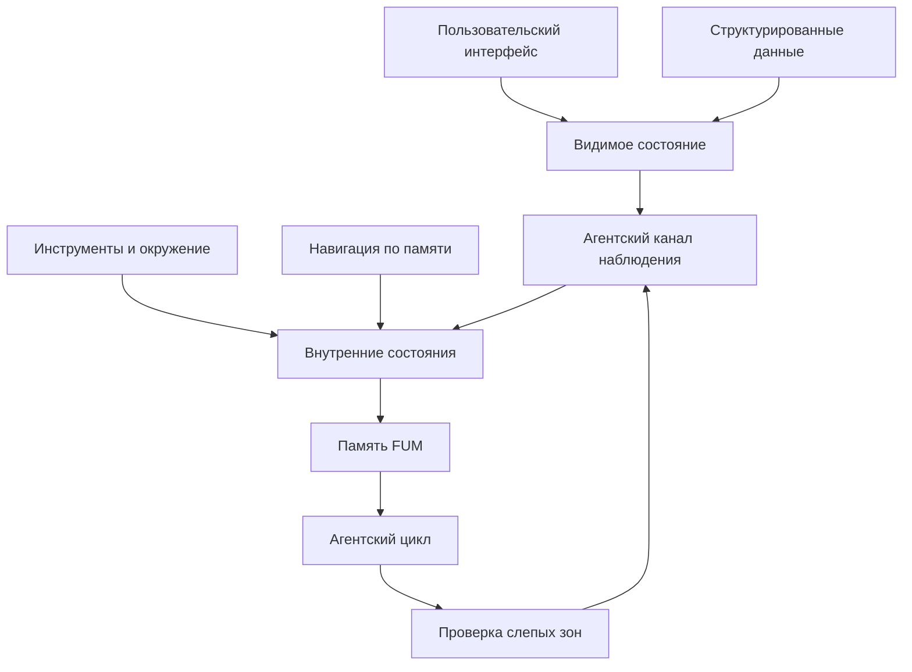

# Dostup k [vnutrennim sostoyaniyam](../Glossarij/vnutrenneye-sostoyaniye.md)

## Trebovaniye

[FUM](../Glossarij/FUM.md) dolzhen imetj dostup ko vsem svoim [vnutrennim sostoyaniyam](../Glossarij/vnutrenneye-sostoyaniye.md) v forme, prigodnoj dlya nablyudeniya, analiza i posleduyusjhej obrabotki. [Vnutrenneye sostoyaniye](../Glossarij/vnutrenneye-sostoyaniye.md) ne dolzhno susjhestvovatj toljko kak neyavnyij effekt rabotyi sistemyi ili kak informaciya, dostupnaya cheloveku, no nedostupnaya samomu agentu.

Yesli chto-to otobrazhayetsya v poljzovateljskom interfejse, u [FUM](../Glossarij/FUM.md) dolzhna byitj vozmozhnostj uvidetj i obrabotatj etu informaciyu. Interfejs poljzovatelya yavlyayetsya chastjyu sredyi [FUM](../Glossarij/FUM.md), a ne vneshnim slepyim pyatnom.

## Chto schitayetsya [vnutrennim sostoyaniyem](../Glossarij/vnutrenneye-sostoyaniye.md)

K [vnutrennim sostoyaniyam](../Glossarij/vnutrenneye-sostoyaniye.md) otnosyatsya:

- tekusjhiye celi, zadachi, planyi i ostanovochnyiye usloviya;
- rabochaya [pamyatj](../Glossarij/pamyatj-FUM.md), kontekst dialoga, aktivnyiye [vetki](../Glossarij/vetka-rabotyi.md) i promezhutochnyiye rezuljtatyi;
- sostoyaniye instrumentov, okruzheniya, fajlov, zapuskov, oshibok i proverok;
- trassyi [agentskikh ciklov](../Glossarij/agentskij-cikl.md): nablyudeniya, dejstviya, perekhodyi, vozvratyi i sliyaniya;
- [vnutrenniye modeli drugikh FUM-uzlov](../Glossarij/vnutrennyaya-modelj-drugogo-uzla.md), vklyuchaya modeli lyudej kak uchastnikov vzaimodejstviya;
- iskhodnyiye tekstyi, konfiguracii, versii i istoriya izmenenij ustojchivyikh [avtomatizacij FUM](../Glossarij/avtomatizaciya-FUM.md);
- dannyiye, iz kotoryikh stroitsya poljzovateljskij interfejs;
- vizualjnoye i interaktivnoye sostoyaniye interfejsa, vklyuchaya to, chto uzhe pokazano poljzovatelyu;
- kompaktnyiye opisaniya, sozdannyiye [avtomaticheskimi organami vospriyatiya FUM](../Glossarij/avtomaticheskij-organ-vospriyatiya-FUM.md);
- [nablyudayemyiye vkhodnyiye signalyi](../Glossarij/nablyudayemyij-vkhodnoj-signal.md), vklyuchaya [navigaciyu po pamyati FUM](../Glossarij/navigaciya-po-pamyati-FUM.md), sozdaniye [iskhodnyikh zaprosov](../Glossarij/iskhodnyij-zapros.md) i sobyitiya poljzovateljskogo vvoda.

Etot spisok ne yavlyayetsya zakryityim. Lyuboj sloj, vliyayusjhij na povedeniye [FUM](../Glossarij/FUM.md) ili vidimyij poljzovatelyu kak sostoyaniye sistemyi, dolzhen rassmatrivatjsya kak chastj nablyudayemogo [vnutrennego sostoyaniya](../Glossarij/vnutrenneye-sostoyaniye.md).

## Simmetriya interfejsa

Dlya [FUM](../Glossarij/FUM.md) dejstvuyet princip simmetrii interfejsa: sostoyaniye, predstavlennoye cheloveku cherez poljzovateljskij interfejs, dolzhno imetj agentskij kanal nablyudeniya. Predpochtiteljnaya forma takogo kanala - strukturirovannyiye dannyiye, iz kotoryikh postroyen interfejs. Yesli strukturirovannogo dostupa nedostatochno, agent dolzhen imetj vozmozhnostj poluchitj vizualjnoye predstavleniye, sostoyaniye elementov interfejsa, tekst, razmetku, sobyitiya ili drugoj mashinno-obrabatyivayemyij snimok.

Iz etogo sleduyet, chto v sisteme ne dolzhno byitj toljko interfejsnyikh faktov: yesli interfejs soobsjhayet poljzovatelyu znachimuyu informaciyu, eta informaciya dolzhna byitj dostupna [FUM](../Glossarij/FUM.md) dlya rassuzhdeniya, [pamyati](../Glossarij/pamyatj-FUM.md) i dejstviya.

## Skhema nablyudayemosti sostoyaniya

## Vizualizaciya na displeye

Vizualizaciya na displeye rassmatrivayetsya kak [ustrojstvo vospriyatiya i dejstviya FUM](../Glossarij/ustrojstvo-vospriyatiya-i-dejstviya-FUM.md): ona pokazyivayet cheloveku sostoyaniye sistemyi i odnovremenno vliyayet na sleduyusjhij khod vzaimodejstviya. Poetomu vizualizacionnaya [avtomatizaciya](../Glossarij/avtomatizaciya-FUM.md) dolzhna byitj predskazuyemoj i vosproizvodimoj.

Vidimoye sostoyaniye dolzhno vyivoditjsya iz yavnyikh dannyikh, versii pravil otobrazheniya, konfiguracii i konteksta. Yesli ekran pokazyivayet rezuljtat, kotoryij neljzya vosstanovitj iz [pamyati](../Glossarij/pamyatj-FUM.md) ili agentski dostupnogo snimka, [FUM](../Glossarij/FUM.md) dolzhen fiksirovatj eto kak poteryu nablyudayemosti, a ne prinimatj interfejs kak samodostatochnyij istochnik istinyi.

## [Navigaciya po pamyati FUM](../Glossarij/navigaciya-po-pamyati-FUM.md) kak [nablyudayemyij vkhodnoj signal](../Glossarij/nablyudayemyij-vkhodnoj-signal.md)

[Navigaciya po pamyati FUM](../Glossarij/navigaciya-po-pamyati-FUM.md) dolzhna nablyudatjsya [FUM](../Glossarij/FUM.md) tak zhe, kak nablyudayetsya sozdaniye [iskhodnogo zaprosa](../Glossarij/iskhodnyij-zapros.md). Otkryitiye dokumenta, perekhod po ssyilke, poisk, prokrutka, vyibor fragmenta, perekhod nazad ili vperyod i smena vidimoj oblasti [pamyati](../Glossarij/pamyatj-FUM.md) yavlyayutsya vkhodnyimi sobyitiyami, a ne toljko pobochnyim effektom interfejsa.

Eto trebovaniye ne zavisit ot ustrojstva i modaljnosti vvoda. Odin i tot zhe smyislovoj perekhod dolzhen stanovitjsya [nablyudayemyim vkhodnyim signalom](../Glossarij/nablyudayemyij-vkhodnoj-signal.md), yesli on vyipolnen klaviaturoj, myishjyu, trekpadom, drugim graficheskim ustrojstvom vvoda, audiovvodom, zhestom, avtomaticheskim agentskim dejstviyem ili budusjhim kanalom vzaimodejstviya.

Zapisj takogo signala dolzhna po vozmozhnosti sokhranyatj tip sobyitiya, iskhodnyij i celevoj fragment [pamyati](../Glossarij/pamyatj-FUM.md), kanal vvoda, vremya, svyazannyij interfejsnyij kontekst i svyazj s posleduyusjhim [agentskim ciklom](../Glossarij/agentskij-cikl.md). Yesli polnyij signal nedostupen, [FUM](../Glossarij/FUM.md) dolzhen fiksirovatj khotya byi fakt ogranichennoj nablyudayemosti i prichinu poteri detalej.

## Avtomaticheskoye szhatiye vneshnikh potokov

Pri vneshnikh sobyitiyakh [FUM](../Glossarij/FUM.md) mozhet poluchatj potok, kotoryij slishkom shirok dlya polnogo pryamogo zapominaniya ili nemedlennoj LLM-obrabotki. [Avtomaticheskij organ vospriyatiya FUM](../Glossarij/avtomaticheskij-organ-vospriyatiya-FUM.md) dolzhen prevrasjhatj takoj potok v lakonichnoye kompaktnoye opisaniye, kotoroye uzhe mozhet byitj polnostjyu sokhraneno v [pamyati](../Glossarij/pamyatj-FUM.md) i obrabotano lokaljnoj ili vneshnej LLM vnutri [FUM](../Glossarij/FUM.md).

Takoye szhatiye ne dolzhno stanovitjsya skryitoj poterej nablyudayemosti. Kompaktnoye opisaniye dolzhno khranitj svyazj s iskhodnyim sobyitiyem, kanalom, vremenem, dostupnyimi metadannyimi, urovnem uverennosti i izvestnyimi ogranicheniyami. Yesli iskhodnyij potok ne sokhranyayetsya celikom, eto dolzhno byitj yavno vidno v [pamyati FUM](../Glossarij/pamyatj-FUM.md).

## Svyazj s [pamyatjyu](../Glossarij/pamyatj-FUM.md) i myishleniyem

Dostup k [vnutrennim sostoyaniyam](../Glossarij/vnutrenneye-sostoyaniye.md) delayet [pamyatj FUM](../Glossarij/pamyatj-FUM.md) polnocennoj. Agent ne mozhet zapominatj sobstvennyiye shagi, vyidelyatj ustojchivyiye [patternyi](../Glossarij/pattern-pamyati.md) i ispravlyatj oshibki, yesli chastj yego rabochego sostoyaniya ostayotsya dlya nego nevidimoj.

Nablyudeniye v [agentskom cikle](../Glossarij/agentskij-cikl.md) poetomu dolzhno vklyuchatj ne toljko vneshniye otvetyi instrumentov, no i izmeneniya sobstvennyikh sostoyanij [FUM](../Glossarij/FUM.md): chto byilo pokazano, chto izmenilosj v [pamyati](../Glossarij/pamyatj-FUM.md), kakiye [vetki](../Glossarij/vetka-rabotyi.md) aktivnyi, kakiye perekhodyi proizoshli i gde voznikli raskhozhdeniya mezhdu namereniyem, dejstviyem i otobrazhennyim rezuljtatom.

## [Granicyi dostupa](../Glossarij/urovenj-dostupa.md)

Dostup k [vnutrennim sostoyaniyam](../Glossarij/vnutrenneye-sostoyaniye.md) oznachayet prezhde vsego nablyudayemostj i obrabatyivayemostj. On ne raven bezuslovnomu pravu izmenyatj lyuboj sloj sistemyi. Dlya opasnyikh dejstvij, sekretov, prav dostupa i privatnyikh dannyikh mogut susjhestvovatj otdeljnyiye rezhimyi razreshenij, redaktirovaniya, maskirovaniya i podtverzhdeniya.

Pri etom dazhe ogranicheniye dolzhno byitj yavnyim: [FUM](../Glossarij/FUM.md) dolzhen znatj, chto sostoyaniye susjhestvuyet, kakoj u nego [rezhim dostupa](../Glossarij/urovenj-dostupa.md) i pochemu ono nedostupno polnostjyu. Skryitaya zona bez metadannyikh rassmatrivayetsya kak arkhitekturnyij defekt.

[Vnutrenniye modeli drugikh uzlov](../Glossarij/vnutrennyaya-modelj-drugogo-uzla.md) yavlyayutsya osobenno chuvstviteljnyim [vnutrennim sostoyaniyem](../Glossarij/vnutrenneye-sostoyaniye.md). [FUM](../Glossarij/FUM.md) dolzhen imetj dostup k nim dlya rassuzhdeniya i korrektirovki vzaimodejstviya, no obyazan otlichatj nablyudayemoye, soobsjhennoye, vyivedennoye i neizvestnoye. Modelj cheloveka ili drugogo uzla ne dolzhna prevrasjhatjsya v neyavnyij kanal raskryitiya privatnyikh svedenij.

## Dostup i peredacha [narabotok](../Glossarij/narabotka.md)

Nablyudayemostj [vnutrennego sostoyaniya](../Glossarij/vnutrenneye-sostoyaniye.md) ne ravna pravu peredavatj eto sostoyaniye drugomu uzlu. [FUM](../Glossarij/FUM.md) mozhet imetj agentskij dostup k dannyim dlya rassuzhdeniya i samokorrekcii, no eksport, publikaciya, zaimstvovaniye i daljnejshaya peredacha [narabotok](../Glossarij/narabotka.md) dolzhnyi podchinyatjsya otdeljnyim [urovnyam dostupa](../Glossarij/urovenj-dostupa.md).

Poetomu kazhdoye sostoyaniye ili proizvodnaya [narabotka](../Glossarij/narabotka.md), prigodnaya dlya obmena, dolzhna imetj metadannyiye dostupa: chto mozhno chitatj, ispoljzovatj, izmenyatj, publikovatj i peredavatj daljshe. Yesli sostoyaniye privatno ili ogranicheno, [FUM](../Glossarij/FUM.md) dolzhen umetj rabotatj s razreshyonnoj formoj: naprimer, s metadannyimi, obezlichennyim rezyume ili ukazaniyem na nedostupnostj soderzhimogo.

## Arkhitekturnyiye sledstviya

- Sistema dolzhna imetj reyestr ili graf [vnutrennikh sostoyanij](../Glossarij/vnutrenneye-sostoyaniye.md), dostupnyij dlya agentskogo nablyudeniya.
- Poljzovateljskij interfejs dolzhen stroitjsya tak, chtobyi znachimyiye otobrazhayemyiye dannyiye mozhno byilo sopostavitj s agentski dostupnyim istochnikom.
- [Agentskij cikl](../Glossarij/agentskij-cikl.md) dolzhen poluchatj snimki ili sobyitiya izmenenij sobstvennogo sostoyaniya.
- [Navigaciya po pamyati FUM](../Glossarij/navigaciya-po-pamyati-FUM.md) dolzhna popadatj v agentski dostupnuyu trassu kak [nablyudayemyij vkhodnoj signal](../Glossarij/nablyudayemyij-vkhodnoj-signal.md), a ne toljko kak itogovoye sostoyaniye ekrana.
- [Pamyatj](../Glossarij/pamyatj-FUM.md) dolzhna fiksirovatj ne toljko vneshniye rezuljtatyi, no i izmeneniya [vnutrennikh sostoyanij](../Glossarij/vnutrenneye-sostoyaniye.md), kotoryiye povliyali na resheniye.
- Iskhodnyiye tekstyi i istoriya izmenenij ustojchivyikh [avtomatizacij FUM](../Glossarij/avtomatizaciya-FUM.md) dolzhnyi byitj dostupnyi kak chastj [vnutrennego sostoyaniya](../Glossarij/vnutrenneye-sostoyaniye.md) i [pamyati](../Glossarij/pamyatj-FUM.md).
- Proverki [FUM](../Glossarij/FUM.md) dolzhnyi vyiyavlyatj slepyiye zonyi: sostoyaniya, vidimyiye poljzovatelyu ili vliyayusjhiye na povedeniye, no nedostupnyiye agentu.
- Eksportiruyemyiye sostoyaniya i [narabotki](../Glossarij/narabotka.md) dolzhnyi prokhoditj proverku [urovnya dostupa](../Glossarij/urovenj-dostupa.md) pered peredachej drugomu uzlu ili publikaciyej.
- Modeli drugikh uzlov dolzhnyi khranitjsya s proiskhozhdeniyem svedenij, urovnem uverennosti i ogranicheniyami daljnejshej peredachi.

## Istochniki trebovanij

- [iskhodnyij zapros 2026-06-22 05:59:05 MSK](../Zhurnal/2026-06-22_05-59-05_MSK/zapros.md)
- [iskhodnyij zapros 2026-06-22 06:17:48 MSK](../Zhurnal/2026-06-22_06-17-48_MSK/zapros.md)
- [iskhodnyij zapros 2026-06-22 06:22:15 MSK](../Zhurnal/2026-06-22_06-22-15_MSK/zapros.md)
- [iskhodnyij zapros 2026-06-22 07:20:42 MSK](../Zhurnal/2026-06-22_07-20-42_MSK/zapros.md)
- [iskhodnyij zapros 2026-06-22 08:58:31 MSK](../Zhurnal/2026-06-22_08-58-31_MSK/zapros.md)
- [iskhodnyij zapros 2026-06-22 09:05:49 MSK](../Zhurnal/2026-06-22_09-05-49_MSK/zapros.md)
- [iskhodnyij zapros 2026-06-23 19:06:56 MSK](../Zhurnal/2026-06-23_19-06-56_MSK/zapros.md)

<!-- FUM-MD-RECENCY:BEGIN -->
<!-- last-content-edit: 2026-08-03 14:54:04 MSK -->
<!-- content-sha256: sha256:e3d0980589bcd6e3b17c23e15d1bbfdf106ad833b509102b0c11d10d3c7bb9e0 -->
<!-- FUM-MD-RECENCY:END -->
