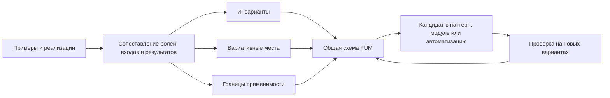
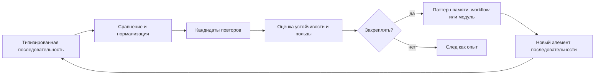

# [Obobsjhyonnyij poisk povtoryayusjhikhsya posledovateljnostej](../Glossarij/obobsjhyonnyij-poisk-povtoryayusjhikhsya-posledovateljnostej.md)

## Naznacheniye

V [FUM](../Glossarij/FUM.md) dolzhen byitj predusmotren [obobsjhyonnyij algoritm poiska povtoryayusjhikhsya posledovateljnostej](../Glossarij/obobsjhyonnyij-poisk-povtoryayusjhikhsya-posledovateljnostej.md). Yego zadacha - nakhoditj povtoryayemostj ne v odnom chastnom formate dannyikh, a v lyubyikh ryadakh elementov, kotoryiye mozhno predstavitj kak posledovateljnostj: bajtakh, yedinicakh teksta, strukturirovannyikh sobyitiyakh, nablyudeniyakh, dejstviyakh agenta i uzhe vyiyavlennyikh [patternakh](../Glossarij/pattern-pamyati.md) boleye vyisokogo urovnya.

Takoj algoritm svyazyivayet nizkourovnevuyu obrabotku dannyikh s [pamyatjyu](../Glossarij/pamyatj-FUM.md) shagov [FUM](../Glossarij/FUM.md). Posledovateljnostj dejstvij agenta rassmatrivayetsya kak odin iz chastnyikh sluchayev obsjhej zadachi, a ne kak otdeljnyij specialjnyij mekhanizm.

## Yedinicyi posledovateljnosti

Algoritm dolzhen rabotatj s parametrizuyemoj yedinicej posledovateljnosti. Takoj yedinicej mogut byitj:

- bajt ili fragment binarnogo potoka;
- simvol, kodovaya tochka, grafemnyij klaster, token ili drugoj element teksta;
- strukturirovannoye nablyudeniye, sobyitiye, sostoyaniye interfejsa ili zapisj trassyi;
- [nablyudayemyij vkhodnoj signal](../Glossarij/nablyudayemyij-vkhodnoj-signal.md), vklyuchaya [navigaciyu po pamyati FUM](../Glossarij/navigaciya-po-pamyati-FUM.md), sozdaniye [iskhodnogo zaprosa](../Glossarij/iskhodnyij-zapros.md) i sobyitiya poljzovateljskogo vvoda;
- dejstviye agenta, vyizov instrumenta, perekhod workflow ili rezuljtat proverki;
- primer, proyektnyij variant ili potencialjnaya realizaciya odnogo resheniya na drugoj programmno-apparatnoj baze;
- raneye najdennaya povtoryayusjhayasya posledovateljnostj, podnyataya na urovenj novogo simvola [pamyati](../Glossarij/pamyatj-FUM.md).

Iz etogo sleduyet [fraktaljnoye](../Glossarij/fraktaljnyij-uzel-myishleniya.md) svojstvo: najdennyij [pattern](../Glossarij/pattern-pamyati.md) mozhet statj elementom novoj posledovateljnosti, gde snova primenyayetsya tot zhe obsjhij princip poiska povtoryayemosti.

## Arkhitekturnoye trebovaniye

Yadro poiska dolzhno byitj otdeleno ot konkretnogo sposoba predstavleniya dannyikh. Vkhodom dlya nego yavlyayetsya uporyadochennaya posledovateljnostj tipizirovannyikh elementov, pravila sravneniya ili normalizacii etikh elementov i ssyilki na iskhodnyiye fragmentyi [pamyati](../Glossarij/pamyatj-FUM.md). Vyikhodom yavlyayetsya nabor kandidatov v povtoryayusjhiyesya posledovateljnosti s proiskhozhdeniyem, poziciyami poyavleniya, meroj podderzhki, kontekstom i svyazjyu s rezuljtatami rabotyi.

Poisk povtoryayemosti ne dolzhen avtomaticheski prevrasjhatj najdennuyu posledovateljnostj v pravilo povedeniya. [FUM](../Glossarij/FUM.md) dolzhen razdelyatj tri etapa:

- obnaruzheniye povtoryayusjhikhsya posledovateljnostej;
- ocenku ikh ustojchivosti, primenimosti i svyazi s rezuljtatami;
- zakrepleniye vyibrannyikh posledovateljnostej kak [patternov pamyati](../Glossarij/pattern-pamyati.md), workflow ili [modulej](../Glossarij/modulj-FUM.md) boleye vyisokogo urovnya.

## [Suffiksno-prediktivnaya pamyatj FUM](../Glossarij/suffiksno-prediktivnaya-pamyatj-FUM.md)

Dlya [potokovoj samostrukturizacii FUM](../Glossarij/potokovaya-samostrukturizaciya-FUM.md) poisk povtoryayemosti dolzhen imetj formu ne polnogo suffiksnogo dereva, a ogranichennogo veroyatnostnogo lesa kontekstov. Takoj les khranit toljko predskazateljno poleznyiye kontekstyi peremennoj dlinyi: chastotyi, davnostj, raspredeleniye prodolzhenij, entropiyu, vyiigryish predskazaniya, vyiigryish szhatiya, oshibku tekusjhej modeli, svyazj s nagradoj ili usjherbom, proiskhozhdeniye i status proverki.

Uzel takogo lesa ne yavlyayetsya gotovyim pravilom. On yavlyayetsya kandidatom: snachala statisticheskim nablyudeniyem, zatem vozmozhnoj yedinicej [samotokenizacii FUM](../Glossarij/samotokenizaciya-FUM.md), potom [patternom pamyati](../Glossarij/pattern-pamyati.md), marshrutizatorom vyichisleniya ili osnovaniyem dlya [kontroliruyemoj nejroplastichnosti FUM](../Glossarij/kontroliruyemaya-nejroplastichnostj-FUM.md). Kontekst sokhranyayetsya, yesli on obyyasnyayet potok luchshe roditeljskogo konteksta, snizhayet oshibku, dayot szhatiye, pomogayet dejstviyu ili fiksiruyet redkuyu kritichnuyu anomaliyu pri dopustimoj stoimosti.

Pervyij ispolnyayemyij baseline dopuskayet boleye uzkuyu tochnuyu strukturu, yesli yeyo ogranicheniya vidimyi i ne vyidayutsya za celevuyu pamyatj. V [tenevom redaktore prodolzhenij](../Prototipyi/tenevoj-redaktor-prodolzhenij/README.md) novyij UTF-8-bajt obnovlyayet ogranichennoye derevo suffiksnyikh kontekstov s zadannyimi glubinoj i byudzhetom uzlov. Ot odnogo zamorozhennogo prefiksa otdeljno stroyatsya dve odinakovyiye proizvodnyiye strukturyi: po uspevshemu poyavitjsya prodolzheniyu lokaljnoj LLM i po fakticheskomu prodolzheniyu cheloveka. Sravneniye provoditsya na zaraneye zadannom bajtovom gorizonte, pokazyivayet nekhvatku modeljnogo vyivoda i ne smeshivayet strukturnoye raskhozhdeniye so skryityim izmeneniyem konfiguracii indeksa.

Decay i pruning takogo lesa yavlyayutsya operaciyami [upravlyayemogo zabyivaniya FUM](../Glossarij/upravlyayemoye-zabyivaniye-FUM.md), a ne prostyim udaleniyem starejshikh ili samyikh redkikh uzlov. Kriterij uchityivayet predskazateljnuyu i prikladnuyu poljzu, stoimostj, risk i kritichnostj; vyibrannyij uzel mozhet oslabnutj nizhe poroga aktivacii i perestatj rabotatj v obyichnom poiske. Yesli skhodnyij kontekst snova nuzhen, identichnostj, zapisj kholodnogo arkhiva i proiskhozhdeniye stanovyatsya osnovaniyem [vspominaniya FUM](../Glossarij/vspominaniye-FUM.md). Bezvozvratnyij perekhod trebuyet otdeljnogo polnomochnogo resheniya s ukazannoj oblastjyu vosstanovleniya: osnovaniyem mogut byitj dokazannaya necennostj, privatnostj, bezopasnostj ili primenimoye pravilo khraneniya, no ne odna lishj davnostj ili avtomaticheskoye byudzhetnoye davleniye.

## Samotokenizaciya i abstrakcii

Yedinicyi posledovateljnosti ne dolzhnyi byitj toljko zaraneye zadannyimi tokenami. [FUM](../Glossarij/FUM.md) dolzhen umetj vyivoditj poleznyiye yedinicyi iz syirogo potoka: bajtovyiye klasteryi, skryityiye kodovyiye sloi, grafemopodobnyiye yedinicyi, morfemopodobnyiye fragmentyi, slovopodobnyiye bloki, klassyi vzaimozamenyayemosti, konstrukcii i sobyitijnyiye skhemyi. Eti urovni khranyatsya kak konkuriruyusjhiye gipotezyi, a ne kak odna okonchateljnaya razmetka.

Abstragirovaniye stroitsya iz dvukh signalov. Sintagmaticheskij signal pokazyivayet ustojchivoye sosedstvo elementov, a paradigmaticheskij signal - ikh zamenyayemostj v pokhozhikh kontekstakh. Antiunifikaciya prevrasjhayet nabor pokhozhikh putej v shablon s peremennyimi slotami; kriterij prinyatiya shablona - vyiigryish predskazaniya, szhatiya, perenosimosti ili dejstviya za vyichetom stoimosti khraneniya, vyichisleniya i riska pereobobsjheniya.

## Agregaciya i abstragirovaniye

Agregirovaniye i abstragirovaniye yavlyayutsya samostoyateljnoj cennostjyu dlya [FUM](../Glossarij/FUM.md). Yesli v [pamyati](../Glossarij/pamyatj-FUM.md) yestj neskoljko primerov, prototipov ili potencialjnyikh realizacij odnogo zamyisla na raznoj programmno-apparatnoj baze, [FUM](../Glossarij/FUM.md) dolzhen ne toljko khranitj ikh kak otdeljnyiye variantyi, no i vyiyavlyatj iz nikh [obsjhuyu skhemu FUM](../Glossarij/obsjhaya-skhema-FUM.md).

Takaya rabota sostoit iz neskoljkikh shagov:

- sobratj sopostavimyiye primeryi ili variantyi i sokhranitj ikh proiskhozhdeniye;
- razmetitj roli, vkhodyi, vyikhodyi, sostoyaniya, ogranicheniya, proverki i effektyi kazhdogo varianta;
- vyidelitj invariantyi, kotoryiye povtoryayutsya mezhdu variantami nesmotrya na razlichiye realizacii;
- otmetitj variativnyiye mesta: zavisimostj ot operacionnoj sistemyi, ustrojstva, modeli, interfejsa, prav dostupa, stoimosti, zaderzhek ili nadyozhnosti;
- opisatj [obsjhuyu skhemu](../Glossarij/obsjhaya-skhema-FUM.md) kak perenosimoye znaniye, a ne kak vyibor yedinstvennoj realizacii.

[Obsjhaya skhema FUM](../Glossarij/obsjhaya-skhema-FUM.md) ne utverzhdayet, chto vse chastnyiye realizacii ravnyi. Ona pokazyivayet, kakiye otnosheniya mozhno perenositj mezhdu nimi, kakiye parametryi dolzhnyi ostavatjsya nastraivayemyimi i gde nuzhna otdeljnaya proverka primenimosti. Poetomu skhema dolzhna khranitj ne toljko invariantyi, no i granicyi abstrakcii.

## Skhema vyideleniya obsjhej skhemyi



## Skhema poiska povtoryayemosti



## Vizualizaciya indeksa povtoryayemosti

Dlya budusjhej [korobochnoj realizacii FUM](../Glossarij/korobochnaya-realizaciya-FUM.md) rezuljtat poiska povtoryayusjhikhsya posledovateljnostej dolzhen byitj ne toljko spiskom kandidatov ili vnutrennej tablicej, no i vizualiziruyemyim indeksom [pamyati FUM](../Glossarij/pamyatj-FUM.md). Graf Obsidian v tekusjhem dokumentacionnom prototipe pokazyivayet poljzu vidimoj svyaznosti, no korobochnaya FUM dolzhna idti daljshe: otobrazhatj ne toljko vruchnuyu dobavlennyiye ssyilki, a svyazi, najdennyiye algoritmom v posledovateljnostyakh.

Uzlami takogo grafa mogut byitj iskhodnyiye fragmentyi pamyati, tipizirovannyiye elementyi posledovateljnosti, najdennyiye povtoryi, pozicii poyavlenij, normalizovannyiye formyi, kandidatyi v [patternyi pamyati](../Glossarij/pattern-pamyati.md), [obsjhiye skhemyi FUM](../Glossarij/obsjhaya-skhema-FUM.md) i zakreplyonnyiye pravila. Ryobra dolzhnyi khranitj proiskhozhdeniye, kontekst, meru podderzhki, sposob sravneniya, status proverki i svyazj s rezuljtatami rabotyi.

Eta vizualizaciya ne dolzhna podmenyatj ocenku. Poljzovatelj i agent dolzhnyi videtj razlichiye mezhdu nablyudayemoj povtoryayemostjyu, gipotezoj o normalizacii, kandidatom v pravilo i zakreplyonnyim patternom pamyati. Masshtabirovaniye grafa dolzhno pozvolyatj perekhoditj ot konkretnogo mesta v tekste ili trasse k povtoryayusjhejsya posledovateljnosti, zatem k boleye obsjhej skheme, ne teryaya ssyilok na istochniki.

```mermaid
flowchart LR
    raw["Фрагменты памяти"] --> sequence["Типизированные элементы"]
    sequence --> repeats["Повторы и позиции"]
    repeats --> normalizers["Нормализации и гипотезы"]
    normalizers --> grammar["Кандидаты грамматических правил"]
    repeats --> patterns["Кандидаты паттернов памяти"]
    grammar --> graph["Граф индекса повторяемости"]
    patterns --> graph
    graph --> check["Проверка человеком и автоматизациями"]
    check --> fixed["Закреплённые правила и паттерны"]
```

## Russkaya morfologiya kak sloj indeksa

Dlya russkogo teksta [obobsjhyonnyij poisk povtoryayusjhikhsya posledovateljnostej](../Glossarij/obobsjhyonnyij-poisk-povtoryayusjhikhsya-posledovateljnostej.md) dolzhen ostavlyatj mesto ne toljko dlya tochnogo sovpadeniya slovoform. Ozhidayemyij issledovateljskij effekt sostoit v tom, chto skloneniye, spryazheniye, okonchaniya, soglasovaniya, cheredovaniya i ustojchivyiye otnosheniya mezhdu formami mogut proyavlyatjsya v indekse kak povtoryayusjhiyesya strukturyi i kandidatyi na normalizaciyu.

Eto ne oznachayet, chto FUM dolzhen zaraneye schitatj lyubuyu najdennuyu regulyarnostj pravilom grammatiki. Morfologicheskaya struktura dolzhna prokhoditj tot zhe putj, chto i drugiye patternyi: nablyudayemaya povtoryayemostj, gruppa primerov, gipoteza o normalizacii, proverka na novyikh fragmentakh, fiksaciya isklyuchenij i toljko zatem vozmozhnoye zakrepleniye v kachestve pravila pamyati ili elementa yazyikovoj modeli. Vneshniye slovari i morfologicheskiye analizatoryi mogut byitj vspomogateljnyimi istochnikami, no korobochnaya FUM dolzhna sokhranyatj sobstvennuyu proveryayemuyu cepochku ot nablyudenij k strukture grammatiki.

Novyij nizhnij predel etogo trebovaniya - vyivodimostj samoj granicyi slova i morfemyi. Probel, kodovaya tochka Unicode, slovo, morfema i chastj rechi ne dolzhnyi byitj obyazateljnyimi aksiomami indeksa. Oni mogut ispoljzovatjsya kak udobnyiye vneshniye predstavleniya, no vnutrennyaya [samotokenizaciya FUM](../Glossarij/samotokenizaciya-FUM.md) dolzhna umetj proveryatj, kakaya segmentaciya dejstviteljno uluchshayet predskazaniye, szhatiye i posleduyusjhij rost [modulej](../Glossarij/modulj-FUM.md).

## Urovni primeneniya

Na nizkom urovne takoj mekhanizm mozhet pomogatj obnaruzhivatj povtoryayusjhiyesya bajtovyiye i tekstovyiye strukturyi. Na srednem urovne on primenim k logam, dokumentam, interfejsnyim sobyitiyam, [navigacii po pamyati FUM](../Glossarij/navigaciya-po-pamyati-FUM.md), izmeneniyam sostoyaniya i trassam instrumentov. Na vyisokom urovne on dolzhen rabotatj s posledovateljnostyami nablyudenij i dejstvij agenta: kakiye shagi povtoryayutsya, v kakom kontekste, k kakim oshibkam ili udachnyim iskhodam oni vedut.

Dlya [FUM](../Glossarij/FUM.md) osobenno vazhno, chto odin i tot zhe princip mozhet svyazyivatj eti urovni. Bajtovaya povtoryayemostj, tekstovaya povtoryayemostj i povtoryayemostj agentskikh dejstvij razlichayutsya tipami elementov, no ne obsjhej formoj zadachi.

## Inzhenernyiye sledstviya

- Realizaciya dolzhna podderzhivatj tochnoye sovpadeniye i ostavlyatj mesto dlya normalizovannogo ili pribliziteljnogo sravneniya tam, gde elementyi imeyut semanticheskuyu blizostj.
- Realizaciya dolzhna podderzhivatj ogranichennyiye suffiksno-kontekstnyiye lesa, approximate matching, peremennyiye slotyi, sliyaniye pokhozhikh uzlov, decay, pruning i memory budget, chtobyi poisk povtoryayemosti ne prevrasjhalsya v beskontroljnyij rost strukturyi; politika zabyivaniya dolzhna byitj versionnoj, nablyudayemoj i zasjhisjhatj redkiye kritichnyiye signalyi.
- Rezuljtat poiska dolzhen sokhranyatj proiskhozhdeniye: [FUM](../Glossarij/FUM.md) dolzhen ponimatj, iz kakikh iskhodnyikh fragmentov [pamyati](../Glossarij/pamyatj-FUM.md) poluchen kandidat v [pattern](../Glossarij/pattern-pamyati.md).
- Algoritm dolzhen byitj prigoden dlya inkrementaljnogo primeneniya, chtobyi [pamyatj](../Glossarij/pamyatj-FUM.md) mogla popolnyatjsya bez polnogo pereschyota vsekh proshlyikh posledovateljnostej.
- Najdennyiye [patternyi](../Glossarij/pattern-pamyati.md) dolzhnyi byitj sopostavimyi s rezuljtatami rabotyi: uspeshnostjyu, oshibkami, vozvratami, sliyaniyami, chelovecheskimi pravkami i proverkami.
- Konkretnaya tekhnika realizacii mozhet menyatjsya: suffiksnyiye strukturyi, skoljzyasjhiye kheshi, slovarnoye szhatiye, grammaticheskaya indukciya i sequence mining rassmatrivayutsya kak vozmozhnyiye inzhenernyiye variantyi, a ne kak zaraneye zakreplyonnyij yedinstvennyij vyibor.

## Svyazj s [pamyatjyu FUM](../Glossarij/pamyatj-FUM.md)

[Obobsjhyonnyij poisk povtoryayusjhikhsya posledovateljnostej](../Glossarij/obobsjhyonnyij-poisk-povtoryayusjhikhsya-posledovateljnostej.md) yavlyayetsya mekhanizmom, kotoryij delayet [pamyatj FUM](../Glossarij/pamyatj-FUM.md) ne toljko arkhivom, no i sredoj vyideleniya strukturyi. On pomogayet perekhoditj ot otdeljnyikh sledov rabotyi k povtoryayemyim formam povedeniya, ot povtoryayemyikh form - k proveryayemyim [patternam](../Glossarij/pattern-pamyati.md), a ot [patternov](../Glossarij/pattern-pamyati.md) - k novyim elementam myishleniya sleduyusjhego urovnya.

## Istochniki trebovanij

- [iskhodnyij zapros 2026-07-31 12:20:47 MSK - Utochnitj vspominaniye i bezvozvratnoye zabyivaniye](../Zhurnal/2026-07-31_12-20-47_MSK_utochnitj-vspominaniye-i-bezvozvratnoye-zabyivaniye/zapros.md)
- [iskhodnyij zapros 2026-07-31 11:57:37 MSK - Zakrepitj upravlyayemoye zabyivaniye FUM](../Zhurnal/2026-07-31_11-57-37_MSK_zakrepitj-upravlyayemoye-zabyivaniye-FUM/zapros.md)
- [iskhodnyij zapros 2026-06-22 06:08:01 MSK](../Zhurnal/2026-06-22_06-08-01_MSK/zapros.md)
- [iskhodnyij zapros 2026-06-22 07:20:42 MSK](../Zhurnal/2026-06-22_07-20-42_MSK/zapros.md)
- [iskhodnyij zapros 2026-06-23 19:06:56 MSK](../Zhurnal/2026-06-23_19-06-56_MSK/zapros.md)
- [iskhodnyij zapros 2026-06-25 18:36:50 MSK](../Zhurnal/2026-06-25_18-36-50_MSK/zapros.md)
- [iskhodnyij zapros 2026-07-01 15:19:31 MSK](../Zhurnal/2026-07-01_15-19-31_MSK/zapros.md)
- [iskhodnyij zapros 2026-07-06 10:05:34 MSK - Integrirovatj soderzhimoye ChatGPT dialoga](../Zhurnal/2026-07-06_10-05-34_MSK_integrirovatj-soderzhimoye-chatgpt-dialoga/zapros.md)
- [iskhodnyij zapros 2026-07-14 08:54:56 MSK - Sozdatj prototip raskhozhdeniya prodolzhenij](../Zhurnal/2026-07-14_08-54-56_MSK_sozdatj-prototip-raskhozhdeniya-prodolzhenij/zapros.md)

<!-- FUM-MD-RECENCY:BEGIN -->
<!-- last-content-edit: 2026-08-03 14:54:04 MSK -->
<!-- content-sha256: sha256:1c27e489800ccb6c495763cfe2127593cce96a45608da2285c6b68768d17eabb -->
<!-- FUM-MD-RECENCY:END -->
