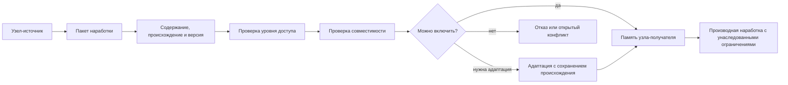

# Obmen [narabotkami](../Glossarij/narabotka.md) i [urovni dostupa](../Glossarij/urovenj-dostupa.md)

## Trebovaniye

[FUM](../Glossarij/FUM.md) dolzhen umetj peredavatj sobstvennyiye [narabotki](../Glossarij/narabotka.md) drugim uzlam v ustojchivoj forme i zaimstvovatj [narabotki](../Glossarij/narabotka.md) ot drugikh uzlov, k kotoryim predostavlen dostup. Eto trebovaniye sleduyet iz samosovershenstvovaniya [FUM](../Glossarij/FUM.md): yesli agent nakaplivayet udachnyiye sposobyi dejstviya, [patternyi](../Glossarij/pattern-pamyati.md), [moduli](../Glossarij/modulj-FUM.md), dokumentyi, proverki i arkhitekturnyiye resheniya, eti rezuljtatyi ne dolzhnyi ostavatjsya toljko lokaljnyim sledom odnoj [rabochej sessii](../Glossarij/rabochaya-sessiya.md).

Obmen [narabotkami](../Glossarij/narabotka.md) rassmatrivayetsya kak forma nasledovaniya mezhdu [uzlami](../Glossarij/FUM-uzel.md). Odin uzel mozhet zakrepitj rezuljtat svoyej rabotyi tak, chtobyi drugoj uzel smog ponyatj yego proiskhozhdeniye, usloviya primeneniya, [granicyi dostupa](../Glossarij/urovenj-dostupa.md) i sposob vklyucheniya v sobstvennuyu [pamyatj](../Glossarij/pamyatj-FUM.md).

## [Narabotka](../Glossarij/narabotka.md) kak perenosimaya yedinica [pamyati](../Glossarij/pamyatj-FUM.md)

[Narabotka v FUM](../Glossarij/narabotka.md) - eto ne proizvoljnyij fragment dannyikh, a oformlennaya yedinica [pamyati](../Glossarij/pamyatj-FUM.md), prigodnaya dlya peredachi, proverki i povtornogo primeneniya. Takoj yedinicej mozhet byitj:

- vyiyavlennyij [pattern](../Glossarij/pattern-pamyati.md) dejstvij ili nablyudenij;
- workflow, [agentskij cikl](../Glossarij/agentskij-cikl.md) ili podcikl;
- [modulj](../Glossarij/modulj-FUM.md) [pamyati](../Glossarij/pamyatj-FUM.md), interfejsa, instrumenta ili arkhitekturyi;
- nabor trebovanij, reshenij, testov ili kriteriyev otbora;
- dokumentirovannaya gipoteza, oshibka, uspeshnoye resheniye ili opyit sliyaniya;
- proizvodnyij paket znanij, kotoryij mozhet statj materialom dlya sleduyusjhego uzla.

Dlya ustojchivoj peredachi [narabotka](../Glossarij/narabotka.md) dolzhna imetj formu, v kotoroj sokhranenyi soderzhaniye, proiskhozhdeniye, versiya, zavisimosti, usloviya primenimosti, proverochnyij status i [urovenj dostupa](../Glossarij/urovenj-dostupa.md). Yesli eti svojstva ne zakreplenyi, drugoj uzel mozhet poluchitj dannyiye, no ne smozhet nadyozhno vklyuchitj ikh v sobstvennoye myishleniye.

## Ustojchivaya forma peredachi

Ustojchivaya forma peredachi dolzhna pozvolyatj uzlu-poluchatelyu vosstanovitj ne toljko itog, no i kontekst, v kotorom etot itog poyavilsya. V minimaljnom vide paket [narabotki](../Glossarij/narabotka.md) dolzhen vklyuchatj:

- identifikator i versiyu [narabotki](../Glossarij/narabotka.md);
- opisaniye naznacheniya i granic primenimosti;
- ssyilki na iskhodnyiye trebovaniya, istochniki, trassyi ili resheniya;
- svedeniya o zavisimostyakh i sovmestimosti;
- rezuljtatyi proverok, otbora ili chelovecheskogo podtverzhdeniya;
- pravila obnovleniya, sliyaniya i otzyiva;
- urovenj dostupa i usloviya daljnejshej peredachi.

Takoj paket ne obyazan byitj odnim konkretnyim fajlovyim formatom. Vazhno, chtobyi [FUM](../Glossarij/FUM.md) podderzhival mashinno-obrabatyivayemoye predstavleniye, dostatochnoye dlya importa, sravneniya, proverki, sliyaniya i posleduyusjhego audita proiskhozhdeniya.

## Skhema obmena [narabotkoj](../Glossarij/narabotka.md)

## Zaimstvovaniye ot drugikh uzlov

Zaimstvovaniye [narabotki](../Glossarij/narabotka.md) ne dolzhno byitj slepyim kopirovaniyem. Uzel-poluchatelj dolzhen proveritj:

- byil li yemu dejstviteljno predostavlen dostup;
- sootvetstvuyet li urovenj dostupa predpolagayemomu ispoljzovaniyu;
- sovmestima li [narabotka](../Glossarij/narabotka.md) s tekusjhej modeljyu [pamyati](../Glossarij/pamyatj-FUM.md), arkhitekturoj i zadachej;
- kakiye ogranicheniya, zavisimosti i riski nasleduyutsya vmeste s [narabotkoj](../Glossarij/narabotka.md);
- ne protivorechit li zaimstvovaniye uzhe zakreplyonnyim trebovaniyam;
- kak sokhranitj proiskhozhdeniye [narabotki](../Glossarij/narabotka.md) posle vklyucheniya v lokaljnuyu [pamyatj](../Glossarij/pamyatj-FUM.md).

Yesli [narabotka](../Glossarij/narabotka.md) prokhodit proverku, ona mozhet byitj vklyuchena v [pamyatj FUM](../Glossarij/pamyatj-FUM.md) kak vneshnij vklad s sokhraneniyem proiskhozhdeniya. Yesli obnaruzhenyi konfliktyi, [FUM](../Glossarij/FUM.md) dolzhen fiksirovatj ikh kak material myishleniya: pokazatj mesto raskhozhdeniya, vozmozhnyiye variantyi adaptacii i osnovaniya vyibrannogo resheniya.

## Modelj uzla-partnyora

Obmen [narabotkami](../Glossarij/narabotka.md) trebuyet, chtobyi [FUM](../Glossarij/FUM.md) stroil [vnutrennyuyu modelj uzla](../Glossarij/vnutrennyaya-modelj-drugogo-uzla.md), s kotoryim vzaimodejstvuyet. Dlya uzla-partnyora dolzhnyi byitj predstavlenyi dostupnyiye kanalyi svyazi, istoriya obmenov, izvestnyiye ogranicheniya, urovenj doveriya, sovmestimostj [narabotok](../Glossarij/narabotka.md) i dejstvuyusjhiye razresheniya.

Yesli uzlom-partnyorom yavlyayetsya chelovek, modelj dolzhna uchityivatj yego kak samostoyateljnyij [FUM-uzel](../Glossarij/FUM-uzel.md) s sobstvennyimi celyami, [pamyatjyu](../Glossarij/pamyatj-FUM.md) i privatnoj oblastjyu. Pri etom [FUM](../Glossarij/FUM.md) dolzhen razlichatj pryamyiye slova cheloveka, nablyudayemoye povedeniye, sobstvennyiye vyivodyi i neizvestnyiye chasti modeli. Eto razlicheniye vazhno dlya togo, chtobyi obmen [narabotkami](../Glossarij/narabotka.md) ne podmenyal soglasovaniye dogadkami o cheloveke.

## Obmen v gibridnyikh i kollektivnyikh uzlakh

Yesli [FUM](../Glossarij/FUM.md) dejstvuyet kak [lichnyij agent cheloveka](../Glossarij/lichnyij-FUM-agent.md), obmen [narabotkami](../Glossarij/narabotka.md) mozhet proiskhoditj ne toljko mezhdu otdeljnyimi agentami, no i vnutri [gibridnogo uzla](../Glossarij/gibridnyij-uzel.md) chelovek-[FUM](../Glossarij/FUM.md). V takom sluchaye nuzhno razlichatj, kakaya chastj [narabotki](../Glossarij/narabotka.md) otnositsya k lichnoj [pamyati](../Glossarij/pamyatj-FUM.md) cheloveka, kakaya sozdana agentom, kakaya stala obsjhej rabochej [pamyatjyu](../Glossarij/pamyatj-FUM.md) svyazki i kakiye prava peredachi byili podtverzhdenyi.

Setj [gibridnyikh uzlov](../Glossarij/gibridnyij-uzel.md) mozhet obrazovyivatj kollektivnyij [FUM-uzel](../Glossarij/FUM-uzel.md): semjyu, komandu, kompaniyu, soobsjhestvo ili drugoj socialjnyij element. Obmen vnutri takogo uzla trebuyet dopolniteljnyikh metadannyikh: roli uchastnika, urovnya doveriya, prava predstavlyatj kollektivnyij uzel vovne, prava perenositj [narabotku](../Glossarij/narabotka.md) mezhdu lichnoj i obsjhej [pamyatjyu](../Glossarij/pamyatj-FUM.md), a takzhe uslovij publikacii ili daljnejshej peredachi.

Dlya sostavnyikh uzlov osobenno vazhno sokhranyatj proiskhozhdeniye resheniya na neskoljkikh urovnyakh. [Narabotka](../Glossarij/narabotka.md) mozhet byitj predlozhena agentom, podtverzhdena chelovekom, prinyata [gibridnyim uzlom](../Glossarij/gibridnyij-uzel.md) i zatem vklyuchena v [pamyatj](../Glossarij/pamyatj-FUM.md) komandyi ili kompanii. Kazhdyij takoj perekhod dolzhen byitj vidimyim dlya posleduyusjhej proverki dostupa i otvetstvennosti.

## Yazyikovaya sinkhronizaciya i peredacha narabotok

[Yestestvenno-yazyikovaya sinkhronizaciya znanij FUM](../Glossarij/yestestvenno-yazyikovaya-sinkhronizaciya-znanij-FUM.md) shire peredachi uzhe zakreplyonnoj narabotki. V dialoge uzlyi postepenno predyyavlyayut chasti lokaljnogo znaniya, zadayut voprosyi, utochnyayut ponyatiya, proveryayut osnovaniya, ispravlyayut interpretacii i mogut prijti kak k sovmestnoj formulirovke, tak i k yavno ponyatomu raskhozhdeniyu. Takaya posledovateljnostj sama yavlyayetsya materialom pamyati s proiskhozhdeniyem i versiyami.

[Narabotka](../Glossarij/narabotka.md) poyavlyayetsya, kogda rezuljtat etogo processa vyidelen v ustojchivuyu perenosimuyu yedinicu s soderzhaniyem, usloviyami primenimosti, proverochnyim statusom i dostupom. Poetomu FUM dolzhen razlichatj iskhodnyij yazyikovoj obmen, lokaljnyiye interpretacii yego uchastnikov, podtverzhdyonnuyu obsjhuyu chastj i proizvodnyij paket dlya peredachi. Kopirovaniye paketa ne zamenyayet dialogicheskuyu sinkhronizaciyu, a soglasiye v dialoge ne dayot avtomaticheski prava eksportirovatj privatnoye soderzhaniye.

## [Urovni dostupa](../Glossarij/urovenj-dostupa.md)

Obmen [narabotkami](../Glossarij/narabotka.md) trebuyet yavnoj sistemyi [urovnej dostupa](../Glossarij/urovenj-dostupa.md). Urovenj dostupa yavlyayetsya chastjyu samoj [narabotki](../Glossarij/narabotka.md) i dolzhen soprovozhdatj yeyo pri peredache, kopirovanii, sliyanii i proizvodnyikh izmeneniyakh.

Bazovyiye urovni:

- polnostjyu publichnyij urovenj: [narabotka](../Glossarij/narabotka.md) mozhet byitj peredana komu ugodno, opublikovana i ispoljzovana bez ogranicheniya v ramkakh zayavlennoj licenzii;
- ogranichennyij urovenj: [narabotka](../Glossarij/narabotka.md) dostupna toljko opredelyonnyim uzlam, poljzovatelyam, gruppam ili kontekstam i ne mozhet peredavatjsya daljshe bez otdeljnogo razresheniya;
- privatnyij urovenj: [narabotka](../Glossarij/narabotka.md) ostayotsya vnutri uzla ili doverennoj oblasti i mozhet peredavatjsya naruzhu toljko v vide specialjno razreshyonnogo rezyume, obezlichennogo fragmenta ili proizvodnoj formyi;
- zakryityij urovenj: samo soderzhaniye nedostupno dlya obmena, no sistema mozhet sokhranyatj minimaljnyiye metadannyiye o susjhestvovanii ogranicheniya, yesli eto bezopasno i ne raskryivayet zasjhisjhayemuyu informaciyu.

[FUM](../Glossarij/FUM.md) dolzhen razlichatj dostup na chteniye, ispoljzovaniye, izmeneniye, publikaciyu i daljnejshuyu peredachu. Vozmozhnostj uvidetj [narabotku](../Glossarij/narabotka.md) ne vsegda oznachayet pravo vklyuchitj yeyo v sobstvennuyu [pamyatj](../Glossarij/pamyatj-FUM.md), izmenitj, opublikovatj ili peredatj sleduyusjhemu uzlu.

## [Granicyi vlasti](../Glossarij/granica-vlasti-FUM.md) shire dostupa

[Urovni dostupa](../Glossarij/urovenj-dostupa.md) yavlyayutsya chastjyu boleye obsjhego trebovaniya k [granicam vlasti](../Glossarij/granica-vlasti-FUM.md). Uzel mozhet imetj pravo poluchitj konkretnuyu [narabotku](../Glossarij/narabotka.md), no eto ne dayot yemu polnoj vlasti nad uzlom-istochnikom, yego [pamyatjyu](../Glossarij/pamyatj-FUM.md), budusjhimi resheniyami, identichnostjyu ili pravom uchastvovatj v drugikh svyazyakh.

Pri obmene mezhdu sostavnyim uzlom i yego [poduzlami](../Glossarij/poduzel-FUM.md) [FUM](../Glossarij/FUM.md) dolzhen razlichatj peredachu materialov, vremennoye delegirovaniye polnomochij i poglosjheniye kontrolya. Dazhe yesli [poduzel](../Glossarij/poduzel-FUM.md) vkhodit v obsjhuyu rabochuyu sistemu, yego lokaljnyiye ogranicheniya dostupa i ostatochnaya avtonomiya ne dolzhnyi ischezatj avtomaticheski.

Eta svyazj raskryita v dokumente [Decentralizaciya FUM i granicyi vlasti](15-decentralizaciya-i-granicyi-vlasti.md), a prakticheskiye kriterii dopustimoj vlasti vyinesenyi v [otkryityij vopros](../Voprosyi/2026-06-22_07-51-48_MSK_granicyi-vlasti-uzlov-FUM.md).

## Metadannyiye dostupa i proiskhozhdeniya

[Urovni dostupa](../Glossarij/urovenj-dostupa.md) dolzhnyi byitj proveryayemyimi. Dlya etogo [FUM](../Glossarij/FUM.md) dolzhen khranitj ryadom s [narabotkoj](../Glossarij/narabotka.md) metadannyiye:

- kto ili kakoj uzel yavlyayetsya istochnikom;
- komu predostavlen dostup;
- kakiye operacii razreshenyi;
- kakiye ogranicheniya dolzhnyi nasledovatjsya proizvodnyimi [narabotkami](../Glossarij/narabotka.md);
- kogda i pochemu dostup byil predostavlen, izmenyon ili otozvan;
- kakiye chasti [narabotki](../Glossarij/narabotka.md) publichnyi, ogranichenyi ili privatnyi.

Yesli [narabotka](../Glossarij/narabotka.md) sostoit iz neskoljkikh chastej s raznyimi [urovnyami dostupa](../Glossarij/urovenj-dostupa.md), [FUM](../Glossarij/FUM.md) dolzhen umetj peredavatj toljko razreshyonnuyu chastj i yavno otmechatj, chto ostaljnoye nedostupno. Skryitaya privatnaya chastj ne dolzhna sluchajno popastj v publichnyij paket.

## Otkryitaya sistema i privatnaya pamyatj

[Otkryitostj FUM](../Glossarij/otkryitostj-FUM.md) ne otmenyayet [urovni dostupa](../Glossarij/urovenj-dostupa.md), a delayet ikh boleye vazhnyimi. Bazovyiye materialyi, kod, arkhitekturnyiye resheniya, formatyi [pamyati](../Glossarij/pamyatj-FUM.md), pravila avtonomii i vosproizvodimyiye [avtomatizacii](../Glossarij/avtomatizaciya-FUM.md) dolzhnyi byitj po vozmozhnosti otkryityimi i proveryayemyimi. Soderzhateljnaya lichnaya [pamyatj](../Glossarij/pamyatj-FUM.md), privatnyiye [narabotki](../Glossarij/narabotka.md) i chuvstviteljnyiye dannyiye cheloveka pri etom ostayutsya pod yavnyimi ogranicheniyami dostupa.

Dlya [lichnogo FUM-agenta](../Glossarij/lichnyij-FUM-agent.md) eto razlicheniye kritichno: doveriye dolzhno opiratjsya na proveryayemostj ustrojstva agenta, a ne na zakryitostj mekhanizma, kotoromu chelovek vyinuzhden raskryivatj vsyu lichnuyu zhiznj. Poetomu otkryityij agent dolzhen byitj sovmestim s privatnoj pamyatjyu, vyiborochnoj publikaciyej, obezlichennyimi proizvodnyimi formami i otzyivom razreshenij.

## Svyazj s samosovershenstvovaniyem

Samosovershenstvovaniye [FUM](../Glossarij/FUM.md) trebuyet, chtobyi udachnyiye rezuljtatyi rabotyi mogli perezhivatj otdeljnuyu sessiyu i otdeljnyij uzel. Peredacha [narabotok](../Glossarij/narabotka.md) delayet evolyuciyu [FUM](../Glossarij/FUM.md) ne toljko individualjnoj, no i setevoj: raznyiye uzlyi mogut nasledovatj drug u druga ustojchivyiye resheniya, adaptirovatj ikh, proveryatj v novyikh usloviyakh i vozvrasjhatj uluchshennyiye variantyi.

Pri etom [urovni dostupa](../Glossarij/urovenj-dostupa.md) zasjhisjhayut granicyi doveriya. [FUM](../Glossarij/FUM.md) dolzhen razvivatjsya kak otkryitaya sistema tam, gde eto vozmozhno, i kak akkuratnaya sistema razgranicheniya dostupa tam, gde [pamyatj](../Glossarij/pamyatj-FUM.md) soderzhit privatnyiye, ogranichennyiye ili kontekstno chuvstviteljnyiye materialyi.

## Arkhitekturnyiye sledstviya

- [Pamyatj FUM](../Glossarij/pamyatj-FUM.md) dolzhna podderzhivatj eksport i import [narabotok](../Glossarij/narabotka.md) kak samostoyateljnyikh yedinic s proiskhozhdeniyem.
- U kazhdoj perenosimoj [narabotki](../Glossarij/narabotka.md) dolzhnyi byitj versiya, kontekst primenimosti, proverochnyij status i urovenj dostupa.
- Importirovannyiye [narabotki](../Glossarij/narabotka.md) dolzhnyi sokhranyatj ssyilku na istochnik i ogranicheniya daljnejshego ispoljzovaniya.
- Pered obmenom [FUM](../Glossarij/FUM.md) dolzhen sveryatj [narabotku](../Glossarij/narabotka.md) s vnutrennej modeljyu uzla-poluchatelya: dostupom, sovmestimostjyu, istoriyej vzaimodejstviya i urovnem doveriya.
- Sliyaniye zaimstvovannyikh [narabotok](../Glossarij/narabotka.md) dolzhno uchityivatj ne toljko tekhnicheskuyu sovmestimostj, no i prava peredachi, publikacii i proizvodnogo ispoljzovaniya.
- Publichnyiye paketyi dolzhnyi prokhoditj proverku na otsutstviye privatnyikh ili ogranichennyikh fragmentov.
- [Ogranicheniya dostupa](../Glossarij/urovenj-dostupa.md) dolzhnyi byitj predstavlenyi tak, chtobyi [FUM](../Glossarij/FUM.md) mog rassuzhdatj o nikh i ne prevrasjhal privatnostj v nevidimuyu zonu bez metadannyikh.

## Istochniki trebovanij

- [iskhodnyij zapros 2026-06-22 06:17:48 MSK](../Zhurnal/2026-06-22_06-17-48_MSK/zapros.md)
- [iskhodnyij zapros 2026-06-22 06:22:15 MSK](../Zhurnal/2026-06-22_06-22-15_MSK/zapros.md)
- [iskhodnyij zapros 2026-06-22 06:40:09 MSK](../Zhurnal/2026-06-22_06-40-09_MSK/zapros.md)
- [iskhodnyij zapros 2026-06-22 07:51:48 MSK](../Zhurnal/2026-06-22_07-51-48_MSK/zapros.md)
- [iskhodnyij zapros 2026-06-22 09:55:43 MSK](../Zhurnal/2026-06-22_09-55-43_MSK/zapros.md)
- [iskhodnyij zapros 2026-06-23 19:06:56 MSK](../Zhurnal/2026-06-23_19-06-56_MSK/zapros.md)
- [iskhodnyij zapros 2026-07-13 22:00:22 MSK - Zakrepitj yestestvennyij yazyik kak yazyik sinkhronizacii znanij](../Zhurnal/2026-07-13_22-00-22_MSK_zakrepitj-yestestvennyij-yazyik-kak-yazyik-sinkhronizacii-znanij/zapros.md)

<!-- FUM-MD-RECENCY:BEGIN -->
<!-- last-content-edit: 2026-08-03 14:54:04 MSK -->
<!-- content-sha256: sha256:349f5f329e7f9a8fc2cc115f1389b1b0f88cabc04b37de4c01d5a169b7bf7de8 -->
<!-- FUM-MD-RECENCY:END -->
