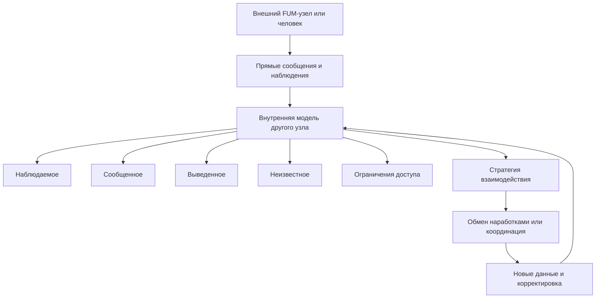

# [Vnutrenniye modeli drugikh uzlov](../Glossarij/vnutrennyaya-modelj-drugogo-uzla.md)

## Trebovaniye

[FUM](../Glossarij/FUM.md) dolzhen imetj sposobnostj stroitj, khranitj i obnovlyatj [vnutrenniye modeli drugikh FUM-uzlov](../Glossarij/vnutrennyaya-modelj-drugogo-uzla.md), s kotoryimi on vzaimodejstvuyet. Takaya modelj nuzhna ne dlya zamenyi drugogo uzla, a dlya koordinacii vzaimodejstviya: [FUM](../Glossarij/FUM.md) dolzhen ponimatj, s kem on svyazan, kakiye ozhidaniya uzhe slozhilisj, kakiye [ogranicheniya dostupa](../Glossarij/urovenj-dostupa.md) dejstvuyut i kakiye formyi obmena vozmozhnyi.

[Vnutrennyaya modelj drugogo uzla](../Glossarij/vnutrennyaya-modelj-drugogo-uzla.md) yavlyayetsya rabochej gipotezoj [pamyati FUM](../Glossarij/pamyatj-FUM.md). Ona dolzhna sokhranyatj proiskhozhdeniye svedenij, razlichatj nablyudayemyiye faktyi, pryamyiye soobsjheniya drugogo uzla, proizvodnyiye vyivodyi i neizvestnyiye oblasti. Modelj ne dolzhna predstavlyatjsya kak polnyij dostup k chuzhomu [vnutrennemu sostoyaniyu](../Glossarij/vnutrenneye-sostoyaniye.md).

## Lyudi kak [FUM-uzlyi](../Glossarij/FUM-uzel.md)

Lyudi, s kotoryimi vzaimodejstvuyet [FUM](../Glossarij/FUM.md), rassmatrivayutsya kak [FUM-uzlyi](../Glossarij/FUM-uzel.md) v tom smyisle, chto oni tozhe imeyut [pamyatj](../Glossarij/pamyatj-FUM.md), celi, ogranicheniya, sposobyi myishleniya, istoriyu vzaimodejstviya i sobstvennuyu oblastj nedostupnogo [vnutrennego sostoyaniya](../Glossarij/vnutrenneye-sostoyaniye.md). Poetomu modelj cheloveka dolzhna stroitjsya po tem zhe obsjhim principam, chto i modelj drugogo uzla, no s boleye strogimi trebovaniyami k privatnosti, korrektiruyemosti i uvazheniyu granic.

[FUM](../Glossarij/FUM.md) dolzhen yavno razlichatj:

- to, chto chelovek skazal ili pokazal napryamuyu;
- to, chto byilo polucheno cherez nablyudayemoye vzaimodejstviye;
- to, chto [FUM](../Glossarij/FUM.md) vyivel kak veroyatnuyu gipotezu;
- to, chto ostayotsya neizvestnyim ili nedostupnyim;
- to, chto neljzya peredavatj drugim uzlam bez razresheniya.

## Skhema [vnutrennej modeli drugogo uzla](../Glossarij/vnutrennyaya-modelj-drugogo-uzla.md)

## [Gibridnyiye uzlyi](../Glossarij/gibridnyij-uzel.md) chelovek-[FUM](../Glossarij/FUM.md)

[Lichnyij FUM-agent](../Glossarij/lichnyij-FUM-agent.md) cheloveka mozhet obrazovyivatj s nim [gibridnyij uzel](../Glossarij/gibridnyij-uzel.md). Dlya vneshnego vzaimodejstviya takoj uzel mozhet vyiglyadetj kak yedinyij uchastnik: on prinimayet soobsjheniya, gotovit otvetyi, vedyot zadachi, perenosit kontekst i dejstvuyet v razreshyonnyikh granicakh ot imeni svyazki chelovek-[FUM](../Glossarij/FUM.md).

Vnutrennyaya modelj takogo uzla dolzhna byitj sostavnoj. [FUM](../Glossarij/FUM.md) dolzhen razlichatj cheloveka, yego lichnogo agenta, obsjhuyu rabochuyu [pamyatj](../Glossarij/pamyatj-FUM.md) svyazki i podtverzhdyonnyiye pravila avtonomii. Yesli drugoj [FUM](../Glossarij/FUM.md) vzaimodejstvuyet s [gibridnyim uzlom](../Glossarij/gibridnyij-uzel.md), on ne dolzhen avtomaticheski schitatj vse soobsjheniya agentskimi ili vse dejstviya chelovecheskimi: proiskhozhdeniye namereniya, predlozheniya i podtverzhdeniya dolzhno sokhranyatjsya kak chastj modeli.

Setj [gibridnyikh uzlov](../Glossarij/gibridnyij-uzel.md) mozhet byitj predstavlena kak kollektivnyij [FUM-uzel](../Glossarij/FUM-uzel.md): semjya, komanda, kompaniya, soobsjhestvo ili inoj socialjnyij element. Modelj takogo uzla dolzhna vklyuchatj uchastnikov, roli, [pravila dostupa](../Glossarij/urovenj-dostupa.md), obsjhuyu istoriyu reshenij, kanalyi soglasovaniya i granicyi predstaviteljstva vovne.

## Soderzhaniye modeli uzla

[Vnutrennyaya modelj drugogo uzla](../Glossarij/vnutrennyaya-modelj-drugogo-uzla.md) mozhet vklyuchatj:

- identifikator uzla, kontekst vzaimodejstviya i urovenj doveriya;
- iskhodnyiye yazyikovyiye aktyi, ikh interpretacii, modaljnostj, dokazateljnostj, rechevyiye funkcii i vyizvannyiye izmeneniya modeli;
- kontekstnyiye privyazki yazyikovyikh rolej govoryasjhego, adresata, vklyuchayusjhej gruppyi i tretjikh uchastnikov;
- sostav uzla: otdeljnyij agent, chelovek, [gibridnyij uzel](../Glossarij/gibridnyij-uzel.md) chelovek-[FUM](../Glossarij/FUM.md) ili kollektivnyij uzel;
- izvestnyiye celi, roli, predpochteniya, ogranicheniya i rabochiye privyichki;
- istoriyu sovmestnyikh zadach, reshenij, konfliktov i uspeshnyikh obmenov;
- svedeniya o dostupnyikh kanalakh vzaimodejstviya i formatakh obmena;
- modelj sovmestimosti [narabotok](../Glossarij/narabotka.md), [modulej](../Glossarij/modulj-FUM.md), workflow i trebovanij;
- [granicyi dostupa](../Glossarij/urovenj-dostupa.md): chto mozhno chitatj, ispoljzovatj, izmenyatj, publikovatj i peredavatj daljshe;
- urovenj uverennosti po kazhdomu znachimomu utverzhdeniyu.

Modelj dolzhna byitj versioniruyemoj: [FUM](../Glossarij/FUM.md) dolzhen videtj, kakiye svedeniya byili poluchenyi ranjshe, kakiye obnovlenyi, kakiye ustareli i kakiye trebuyut podtverzhdeniya.

## Yestestvenno-yazyikovoye obnovleniye modelej uchastnikov

[Yestestvenno-yazyikovaya sinkhronizaciya znanij FUM](../Glossarij/yestestvenno-yazyikovaya-sinkhronizaciya-znanij-FUM.md) obnovlyayet vnutrennyuyu modelj ne toljko cherez nazyivaniye uchastnikov. Vyiskazyivaniye mozhet soobsjhatj fakt, predpolozheniye, celj, zapret, obyazateljstvo, prichinnoye obyyasneniye, vopros, ispravleniye ili chuzhuyu citatu. FUM dolzhen khranitj iskhodnuyu formu, interpretirovannoye soderzhaniye, istochnik, adresatov, vremya, modaljnostj, osnovaniya, uverennostj, rechevoj akt, svyazj s predyidusjhim diskursom i to izmeneniye modeli, kotoroye byilo sdelano na yego osnove.

Modelj dolzhna razlichatj chetyire sostoyaniya: drugoj uzel soobsjhil soderzhaniye; FUM interpretiroval soobsjheniye opredelyonnyim obrazom; interpretaciya prinyata kak rabocheye znaniye posle dostupnoj proverki; mezhdu uchastnikami sokhranilosj raskhozhdeniye ili neizvestnostj. Otvet, utochneniye, pereformulirovaniye, vzaimnyij pereskaz i sovmestnoye dejstviye dayut novyiye nablyudeniya, po kotoryim interpretaciya mozhet podtverzhdatjsya ili ispravlyatjsya. Sinkhronizaciya pri etom ne oznachayet polnyij dostup k chuzhoj pamyati i ne trebuyet odinakovyikh vnutrennikh sostoyanij.

Kakiye iz etikh priznakov obrazuyut minimaljnyij proveryayemyij kontrakt i dostatochnuyu sinkhronizaciyu, ostayotsya v [otkryitom voprose o granicakh yestestvenno-yazyikovoj sinkhronizacii znanij](../Voprosyi/2026-07-13_20-34-23_MSK_granicyi-yestestvenno-yazyikovoj-sinkhronizacii-znanij-FUM.md).

### Sopostavleniye prodolzhenij pri nabore teksta

Dlya modeli konkretnogo cheloveka polezen boleye chastyij proverochnyij signal, chem zavershyonnaya replika. V dobrovoljno vklyuchyonnom rezhime [lichnyij FUM-agent](../Glossarij/lichnyij-FUM-agent.md) mozhet na posledovateljnyikh sostoyaniyakh nabirayemogo teksta fiksirovatj veroyatnostnoye prodolzheniye LLM, a posle poyavleniya sleduyusjhego chelovecheskogo fragmenta sopostavlyatj prognoz s faktom. Kazhdyij prognoz dolzhen sokhranyatjsya do poyavleniya fakticheskogo prodolzheniya vmeste s dostupnyim togda prefiksom i kontekstom, poziciyej kursora, versiyej modeli, tokenizatora i nastroyek, gorizontom prognoza, veroyatnostnyim vyikhodom i rezhimom vidimosti.

Takaya trassa proveryayet toljko uzkij prediktor sleduyusjhego sobyitiya vnutri [modeli cheloveka](../Glossarij/vnutrennyaya-modelj-drugogo-uzla.md), a ne vsyu modelj yego znanij i ne otkryivayet yego [vnutrenneye sostoyaniye](../Glossarij/vnutrenneye-sostoyaniye.md). Raskhozhdeniye mozhet byitj svyazano s individualjnyim stilem, neizvestnoj modeli celjyu, smenoj temyi, tvorcheskoj noviznoj, ispravleniyem, vstavkoj iz vneshnego istochnika ili sluchajnostjyu modeljnogo porozhdeniya. Poetomu ono ne schitayetsya oshibkoj cheloveka, dokazateljstvom noviznyi ili neposredstvennyim nablyudeniyem myisli. Sinkhronizaciyu znanij nuzhno otdeljno proveryatj pereskazom, otvetom, ispravleniyem ili sovmestnyim dejstviyem.

Kachestvo personaljnogo prediktora sleduyet ocenivatj po zaraneye zadannyim kontroljnyim tochkam v skheme posledovateljnogo khronologicheskogo razdeleniya: snimok modeli i lichnoj pamyati stroitsya toljko po proshlyim sessiyam i ne obnovlyayetsya na proveryayemoj trasse. Pri odnom backbone, tokenizatore i odinakovom razreshyonnom nepersonaljnom kontekste poleznyij rezuljtat voznikayet, yesli personalizirovannyij sloj ustojchivo naznachayet fakticheskim prodolzheniyam boleye vyisokuyu veroyatnostj, chem obsjhaya LLM i LLM toljko s kontekstom zadachi. Kontroljnyiye profili drugikh lyudej dopustimyi toljko po otdeljno razreshyonnyim i sopostavimyim po domenu dannyim; aljternativoj sluzhit perestanovochnyij kontrolj. Sravneniye odnoj sluchajno sgenerirovannoj stroki nedostatochno, a vyivodyi dolzhnyi agregirovatjsya po dokumentam ili sessiyam, a ne schitatj sosedniye tokenyi nezavisimyimi nablyudeniyami.

Tekstovyij potok nuzhno otlichatj ot processualjnogo. Vstavka, udaleniye, peremesjheniye kursora, pauza, diktovka i vstavka iz bufera ne svodyatsya k sleduyusjhemu suffiksu i dolzhnyi libo uchityivatjsya kak otdeljnyiye redaktorskiye sobyitiya, libo yavno isklyuchatjsya iz konkretnogo eksperimenta. Fakt ne dolzhen zadnim chislom perepisyivatj raneye sokhranyonnyij prognoz: imenno neizmenyayemaya para `прогноз -> фактическое продолжение` pozvolyayet korrektirovatj modelj i yeyo uverennostj po nablyudayemoj oshibke.

[Pervyij dejstvuyusjhij prototip etogo kontura](../Prototipyi/tenevoj-redaktor-prodolzhenij/README.md) ispoljzuyet odin vyibrannyij tekstovyij fajl, dopisyivaniye v yego konec, odnu neperekryivayusjhuyusya kontroljnuyu tochku i obyazateljnuyu lokaljnuyu LLM. Prefiks, modeljnyij kontekst, gorizont i konfiguraciya suffiksno-kontekstnogo indeksa zamorazhivayutsya do vyizova modeli. Gipoteza skryita do poyavleniya fakta, novaya pravka do pozicii kontroljnoj tochki invalidiruyet paru, a po zavershenii sravnivayutsya kak bajtyi prodolzhenij, tak i odinakovo postroyennyiye proizvodnyiye perekhodyi. Eto delayet nablyudayemoye raskhozhdeniye ispolnyayemyim, no ne rasshiryayet yego smyisl do «snimka myishleniya» cheloveka ili modeli.

### Yazyikovyiye roli v modeli vzaimodejstviya

[Rolevaya semantika setevogo vzaimodejstviya FUM](../Glossarij/rolevaya-semantika-setevogo-vzaimodejstviya-FUM.md) dayot modeli otnositeljnuyu sistemu koordinat. V konkretnom akte obsjheniya `я` svyazyivayetsya s tekusjhim govoryasjhim, `ты` ili `вы` - s adresatom libo adresatami, `мы` - s gruppoj, vklyuchayusjhej govoryasjhego, a `они` - s upominayemoj gruppoj tretjikh uchastnikov. Pri smene govoryasjhego eti roli pereschityivayutsya i ne zamenyayut ustojchivyiye identifikatoryi uzlov.

Modelj dolzhna khranitj ne toljko raspoznannuyu rolj, no i osnovaniye yeyo privyazki: iskhodnoye soobsjheniye, govoryasjhego, adresatov, upominayemyiye uzlyi i gruppyi, vremya, kontekst, granicyi citirovaniya, versiyu sostava gruppyi i urovenj uverennosti. Upotrebleniye `мы` ne podtverzhdayet sostav kollektiva ili pravo predstavlyatj yego, a yazyikovoye obrasjheniye ne dayot adresatu dopolniteljnyikh [prav dostupa](../Glossarij/urovenj-dostupa.md). Rolevaya privyazka yavlyayetsya odnim podsloyem polnoj interpretacii yazyikovogo akta.

## Ispoljzovaniye

[FUM](../Glossarij/FUM.md) ispoljzuyet [vnutrenniye modeli drugikh uzlov](../Glossarij/vnutrennyaya-modelj-drugogo-uzla.md) dlya vyibora formyi vzaimodejstviya: kak formulirovatj zapros, kakuyu [narabotku](../Glossarij/narabotka.md) mozhno predlozhitj, kakiye [ogranicheniya dostupa](../Glossarij/urovenj-dostupa.md) proveritj, kak soglasovatj konflikt trebovanij i kakoj urovenj avtonomii dopustim v sovmestnoj rabote.

Pri obmene [narabotkami](../Glossarij/narabotka.md) modelj drugogo uzla pomogayet ocenitj ne toljko tekhnicheskuyu sovmestimostj, no i kontekstnuyu primenimostj: pochemu etot uzel mozhet prinyatj [narabotku](../Glossarij/narabotka.md), kakiye chasti yemu dostupnyi, kakiye ogranicheniya dolzhnyi nasledovatjsya i gde nuzhna chelovecheskaya ili agentskaya proverka.

## Svyazj so sredami [vnutrennikh FUM](../Glossarij/vnutrennij-FUM.md)

Modelj drugogo vneshnego uzla mozhet byitj vklyuchena v [modeljnuyu sredu](../Glossarij/modeljnaya-sreda.md) kak [vnutrennij FUM](../Glossarij/vnutrennij-FUM.md)-predstavitelj. Naprimer, pri opisanii aktualjnoj situacii, rekonstrukcii proshlogo vzaimodejstviya ili planirovanii budusjhego obmena [FUM](../Glossarij/FUM.md) mozhet ispoljzovatj vnutrennij uzel, kotoryij predstavlyayet vozmozhnoye povedeniye drugogo uchastnika.

Takaya svyazj ne otmenyayet granicu mezhdu vneshnim uzlom i yego modeljyu. [Vnutrennij FUM](../Glossarij/vnutrennij-FUM.md)-predstavitelj ostayotsya gipotezoj ili rabochej roljyu vnutri [pamyati FUM](../Glossarij/pamyatj-FUM.md), a ne samim vneshnim uchastnikom. Podrobnoye trebovaniye k takim sredam opisano v dokumente [Sreda dlya vnutrennikh FUM](11-sreda-dlya-vnutrennikh-FUM.md). Status [vnutrennikh FUM](../Glossarij/vnutrennij-FUM.md) i stepenj ikh avtonomnosti zafiksirovanyi kak [otkryityij vopros](../Voprosyi/2026-06-22_06-35-26_MSK_status-vnutrennikh-FUM.md).

## Granicyi i korrektirovka

Modelj drugogo uzla yavlyayetsya chastjyu vnutrennej [pamyati FUM](../Glossarij/pamyatj-FUM.md) i sama mozhet soderzhatj chuvstviteljnyiye svedeniya. Poetomu ona dolzhna podchinyatjsya tem zhe [pravilam dostupa](../Glossarij/urovenj-dostupa.md), chto i drugiye sostoyaniya i [narabotki](../Glossarij/narabotka.md): privatnyiye chasti ne dolzhnyi sluchajno publikovatjsya, peredavatjsya ili ispoljzovatjsya vne razreshyonnogo konteksta.

Drugoj uzel, vklyuchaya cheloveka, dolzhen imetj vozmozhnostj byitj predstavlennyim v modeli ne kak fiksirovannyij obyyekt, a kak razvivayusjhijsya uchastnik vzaimodejstviya. [FUM](../Glossarij/FUM.md) dolzhen umetj korrektirovatj modelj pri novyikh dannyikh, yavno otmechatj protivorechiya, snizhatj uverennostj pri raskhozhdeniyakh i sokhranyatj istoriyu ispravlenij.

## Arkhitekturnyiye sledstviya

- [Pamyatj FUM](../Glossarij/pamyatj-FUM.md) dolzhna podderzhivatj otdeljnyiye predstavleniya dlya modelej vzaimodejstvuyusjhikh uzlov.
- Kazhdoye utverzhdeniye v modeli uzla dolzhno imetj proiskhozhdeniye, urovenj uverennosti i [rezhim dostupa](../Glossarij/urovenj-dostupa.md).
- Modeli lyudej dolzhnyi razlichatj nablyudeniye, pryamoye soobsjheniye, vyivod i neizvestnostj.
- Proveryayemaya personalizaciya modeli cheloveka dolzhna sravnivatjsya s obsjhej i kontroljnoj modelyami na otlozhennyikh vzaimodejstviyakh, a ne podtverzhdatjsya toljko pokhozhestjyu otdeljnyikh porozhdenij.
- [Agentskij cikl](../Glossarij/agentskij-cikl.md) dolzhen obnovlyatj modelj uzla posle znachimyikh vzaimodejstvij.
- Eksport modeli uzla ili svedenij iz neyo dolzhen prokhoditj proverku dostupa i privatnosti.
- Modelj drugogo uzla dolzhna uchastvovatj v vyibore strategii obmena, koordinacii i sliyaniya [narabotok](../Glossarij/narabotka.md).

## Istochniki trebovanij

- [iskhodnyij zapros 2026-06-22 06:22:15 MSK](../Zhurnal/2026-06-22_06-22-15_MSK/zapros.md)
- [iskhodnyij zapros 2026-06-22 06:35:26 MSK](../Zhurnal/2026-06-22_06-35-26_MSK/zapros.md)
- [iskhodnyij zapros 2026-06-22 06:40:09 MSK](../Zhurnal/2026-06-22_06-40-09_MSK/zapros.md)
- [iskhodnyij zapros 2026-06-23 19:06:56 MSK](../Zhurnal/2026-06-23_19-06-56_MSK/zapros.md)
- [iskhodnyij zapros 2026-07-13 20:34:23 MSK - Zakrepitj rolevuyu semantiku vzaimodejstviya II-agentov](../Zhurnal/2026-07-13_20-34-23_MSK_zakrepitj-rolevuyu-semantiku-vzaimodejstviya-II-agentov/zapros.md)
- [iskhodnyij zapros 2026-07-13 22:00:22 MSK - Zakrepitj yestestvennyij yazyik kak yazyik sinkhronizacii znanij](../Zhurnal/2026-07-13_22-00-22_MSK_zakrepitj-yestestvennyij-yazyik-kak-yazyik-sinkhronizacii-znanij/zapros.md)
- [iskhodnyij zapros 2026-07-14 01:40:47 MSK - Sravnitj prodolzheniye LLM s naborom cheloveka](../Zhurnal/2026-07-14_01-40-47_MSK_sravnitj-prodolzheniye-LLM-s-naborom-cheloveka/zapros.md)
- [iskhodnyij zapros 2026-07-14 08:54:56 MSK - Sozdatj prototip raskhozhdeniya prodolzhenij](../Zhurnal/2026-07-14_08-54-56_MSK_sozdatj-prototip-raskhozhdeniya-prodolzhenij/zapros.md)

<!-- FUM-MD-RECENCY:BEGIN -->
<!-- last-content-edit: 2026-08-03 14:54:04 MSK -->
<!-- content-sha256: sha256:5e04271222c44a0d88f25c7431b92035d9090a46498169e214d53c1179a8accb -->
<!-- FUM-MD-RECENCY:END -->
