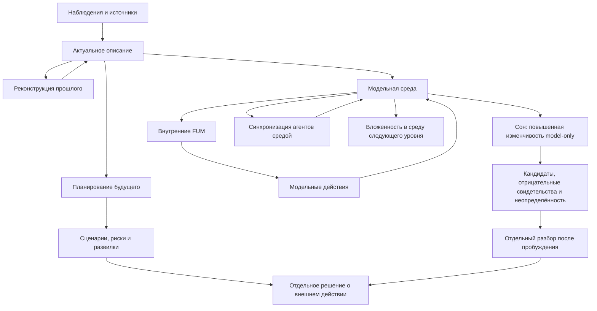

# Sreda dlya [vnutrennikh FUM](../Glossarij/vnutrennij-FUM.md)

Chastichno proyasnyonnyij vopros:

- [status vnutrennikh FUM i modeljnyikh sred](../Voprosyi/2026-06-22_06-35-26_MSK_status-vnutrennikh-FUM.md)

## Trebovaniye

[FUM](../Glossarij/FUM.md) dolzhen umetj sozdavatj okruzhayusjhuyu sredu dlya [vnutrennikh FUM](../Glossarij/vnutrennij-FUM.md). Takaya sreda yavlyayetsya [modeljnyim prostranstvom](../Glossarij/modeljnaya-sreda.md), v kotorom vlozhennyiye [FUM](../Glossarij/FUM.md)-predstavleniya mogut imetj sostoyaniye, nablyudatj elementyi sredyi, vzaimodejstvovatj drug s drugom i porozhdatj gipotezyi o razvitii situacii.

Sreda [vnutrennikh FUM](../Glossarij/vnutrennij-FUM.md) mozhet ispoljzovatjsya kak osnovaniye dlya tryokh rodstvennyikh zadach:

- opisaniya aktualjnogo mira, to yestj tekusjhego sostoyaniya situacii, uchastnikov, obyyektov, ogranichenij i dostupnyikh dejstvij;
- rekonstrukcii proshlogo, to yestj modeli togo, kak tekusjheye sostoyaniye moglo vozniknutj iz predyidusjhikh sobyitij;
- planirovaniya budusjhego, to yestj postroyeniya vozmozhnyikh scenariyev, celej, riskov, dejstvij i posledstvij.

## Sreda kak modelj mira

Okruzhayusjhaya sreda [vnutrennikh FUM](../Glossarij/vnutrennij-FUM.md) ne tozhdestvenna vneshnemu miru. Ona yavlyayetsya vnutrennej modeljyu [FUM](../Glossarij/FUM.md) i dolzhna sokhranyatj razlichiye mezhdu nablyudayemyimi faktami, iskhodnyimi soobsjheniyami, vyivodami, predpolozheniyami, neizvestnostjyu i planovyimi dopusjheniyami.

Kazhdyij znachimyij element takoj sredyi dolzhen imetj proiskhozhdeniye, urovenj uverennosti, vremennoj status i [rezhim dostupa](../Glossarij/urovenj-dostupa.md). Vremennoj status pokazyivayet, otnositsya li element k opisaniyu aktualjnogo mira, rekonstrukcii proshlogo ili vozmozhnomu budusjhemu. [Rezhim dostupa](../Glossarij/urovenj-dostupa.md) opredelyayet, mozhno li ispoljzovatj, publikovatj, peredavatj ili izmenyatj etot element v drugikh uzlakh i sredakh.

## Vetvleniye bez podmenyi podtverzhdeniya

Nepodtverzhdyonnyij perekhod iz modeljnoj sredyi vo vneshnij kontur sokhranyayetsya kak otdeljnyij ozhidayusjhij obyyekt s tochnoj versiyej, ozhidayemyim effektom i usloviyem dopuska. Yego ozhidaniye ne ostanavlivayet izmeneniya vnutri modeli: poka ostayutsya razreshyonnyij vyichisliteljnyij resurs, bezopasnaya produktivnaya rabota i konechnyij byudzhet, FUM mozhet utochnyatj sostoyaniye, stroitj prognozyi, proveryatj dopusjheniya i sravnivatj variantyi.

Soderzhateljnaya razvilka sozdayot dve ili boleye modeljnyiye vetvi ot obsjhego tochnogo predka. Dlya kazhdoj vetvi sokhranyayutsya yavnoye otlichiye, sobstvennyij byudzhet, kriterii proverki, proiskhozhdeniye, rezuljtat i prichina otbora ili sokhraneniya. Yesli resurs dopuskayet toljko odnu vetvj, modelj pomechayet aljternativyi kak neproverennyiye; yesli bezopasnaya produktivnaya rabota ili byudzhet ischerpanyi, ona sozdayot vosproizvodimuyu kontroljnuyu tochku ozhidaniya vmesto lozhnogo zaversheniya.

Sostoyaniya modeljnoj sredyi dolzhnyi nezavisimo predstavlyatj kak minimum `selected_in_model`, `recommended`, `transition_user_confirmed`, `authorized`, `preflight_passed`, `executed` i `observed`. Pervyiye dva statusa sozdayot toljko modeljnyij kontur; poljzovateljskij status — toljko dejstviteljnoye sobyitiye dlya tochnogo perekhoda i versii; avtorizaciyu — nezavisimaya politika polnomochij; preflight — proverka tekusjhego sostoyaniya; ispolneniye — sobyitiye adaptera; nablyudeniye — svideteljstvo rezuljtata. Ni odin perekhod ne vyivoditsya iz uverennosti modeli. Pozdnij poljzovateljskij otvet mozhet perenapravitj daljnejshuyu modeljnuyu rabotu, ne perepisyivaya istoriyu vetvej.

## Rezhim sna

[Mekhanizm sna FUM](../Glossarij/mekhanizm-sna-FUM.md) yavlyayetsya specialjnyim profilem modeljnoj sredyi s povyishennoj izmenchivostjyu i zakryityim vneshnim gorizontom dejstviya. On nachinayet epizod ot tochnogo neizmenyayemogo snimka, v karantinnoj oblasti porozhdayet shirokiye ili priblizhyonnyiye kandidatnyiye preobrazovaniya i sokhranyayet rezuljtat dlya otdeljnogo razbora posle probuzhdeniya. Rezhim mozhet kak predvariteljno oslablyatj yavno neperspektivnyiye otnositeljno celi napravleniya, tak i otkryivatj nestandartnyiye gipotezyi; obe funkcii trebuyut yavnyikh razlichayusjhikh proverok i sokhraneniya proiskhozhdeniya.

Dopusk ko snu dolzhen nazvatj bazovyij rezhim sravneniya, profilj izmenchivosti, celj, dostupnyij kontekst, provajdera, konechnyiye byudzhetyi, razreshyonnoye khraneniye i polnyij perechenj dopustimyikh realjnyikh effektov. Strogij ispolnitelj ne poluchayet vneshniye adapteryi, uchyotnyiye dannyiye, setj, proizvoljnyij fajlovyij dostup ili pravo menyatj obsjhuyu kanonicheskuyu pamyatj. Dopustimyij vyichisliteljno-khranilisjhnyij konvert mozhet vklyuchatj vyichisleniye, ogranichennuyu trassu, kandidat i bezopasnuyu kontroljnuyu tochku; lyuboj neopisannyij effekt, narusheniye izolyacii, otzyiv ili oshibka zavershayet epizod bez avtomaticheskogo povtora s rasshirennyimi pravami.

Kazhdaya vetvj sna ostayotsya kandidatnoj. Modeljnaya sreda razlichayet kak minimum predvariteljno otklonyonnoye napravleniye, sokhranyonnuyu neaktivnuyu aljternativu, variant rezerva raznoobraziya, nestandartnuyu gipotezu i nerazreshyonnyij iskhod; tochnyiye mashinnyiye imena etikh sostoyanij yesjhyo ne zakreplenyi. Yesli proverka ne razlichayet vetvi ili byudzhet ischerpan, sreda sokhranyayet neopredelyonnostj vmesto lozhnogo pobeditelya. Otbrasyivaniye ne oznachayet fizicheskogo udaleniya istochnika, a neobyichnostj ne oznachayet istinnosti ili gotovnosti k obucheniyu.

Probuzhdeniye iniciiruyetsya vneshnim upravlyayusjhim konturom, poljzovateljskim signalom, politikoj, okonchaniyem byudzheta ili narusheniyem granicyi, a ne utverzhdeniyem samoj modeli. Ono perevodit snimok, kandidatyi, proverki i prichinyi otbora v otdeljnyij razbor, no ne sovmesjhayetsya s konsolidaciyej ili ispolneniyem. Prinyatiye konkretnogo rezuljtata v pamyatj ili politiku obucheniya, a tem boleye yego perenos vo vneshnij mir, trebuyet obyichnoj proverki tochnoj versii i novogo perekhoda cherez primenimyiye podtverzhdeniye, avtorizaciyu i preflight. Usloviya zapuska, metriki izmenchivosti i dopustimogo lozhnogo otseva ostayutsya v [voprose o granicakh issledovateljskoj avtonomii FUM](../Voprosyi/2026-06-22_08-04-45_MSK_granicyi-issledovateljskoj-avtonomii-FUM.md).

## Sreda kak sinkhroniziruyusjhij agent

[Modeljnaya sreda](../Glossarij/modeljnaya-sreda.md) dolzhna umetj predstavlyatj boleye obsjhuyu [okruzhayusjhuyu sredu FUM](../Glossarij/okruzhayusjhaya-sreda-FUM.md): fizicheskuyu, khimicheskuyu, biologicheskuyu, socialjnuyu, ekonomicheskuyu, cifrovuyu ili smeshannuyu. V takoj ramke sreda ne yavlyayetsya toljko kontejnerom obyyektov. Ona sinkhroniziruyet rabotu agentov cherez obsjhiye ogranicheniya, zaderzhki signalov, dopustimyiye vzaimodejstviya, resursyi, obratnuyu svyazj i pravila zakrepleniya ustojchivyikh konfiguracij.

Na chelovecheskom i agentskom urovnyakh vyisokourovnevyim mekhanizmom takoj sredyi yavlyayetsya yestestvennyij yazyik. Cherez [yestestvenno-yazyikovuyu sinkhronizaciyu znanij FUM](../Glossarij/yestestvenno-yazyikovaya-sinkhronizaciya-znanij-FUM.md) uchastniki s lokaljnyimi sostoyaniyami predyyavlyayut chastj znaniya, interpretiruyut soobsjheniya, zadayut voprosyi, ispravlyayut rassoglasovaniya i obnovlyayut obsjhuyu rabochuyu oblastj. Yazyik dopolnyayet, a ne zamenyayet ogranicheniya sredyi, zaderzhki, resursyi i obratnuyu svyazj.

[Mnogourovnevaya yazyikovaya sinkhronizaciya FUM](../Glossarij/mnogourovnevaya-yazyikovaya-sinkhronizaciya-FUM.md) proveryayet boleye obsjhij variant toj zhe skhemyi. Na kletochnom, khimicheskom i atomnom urovnyakh, na urovne elementarnyikh chastic i drugikh subatomnyikh masshtabakh sreda svyazyivayet razlichimyiye sostoyaniya cherez dopustimyiye vzaimodejstviya i kontekstno zavisimyiye perekhodyi; v gravitacionno-relyativistskom konture ona zadayot lokaljnostj, prichinnuyu svyaznostj i granicyi soglasovaniya. Slovo «yazyik» zdesj imeyet gipoteticheskij operacionaljnyij smyisl i ne priravnivayet fizicheskoye sopryazheniye k chelovecheskomu znaniyu.

Yesli vnutri sredyi dejstvuyut agentyi, sama sreda mozhet rassmatrivatjsya kak agent ili [FUM-uzel](../Glossarij/FUM-uzel.md) sleduyusjhego masshtaba, vlozhennyij v druguyu sredu. Naprimer, kletka yavlyayetsya sredoj dlya molekulyarnyikh processov i odnovremenno agentom v tkani; organizm yavlyayetsya sredoj dlya kletok i agentom v biologicheskoj, socialjnoj ili ekonomicheskoj srede; ekonomika yavlyayetsya sredoj sinkhronizacii lyudej i organizacij i odnovremenno mozhet rassmatrivatjsya kak sostavnoj uzel v boleye shirokoj civilizacionnoj srede.

Dlya vnutrennikh modelej eto oznachayet, chto [FUM](../Glossarij/FUM.md) dolzhen yavno fiksirovatj urovenj opisaniya. Odin i tot zhe obyyekt mozhet byitj agentom na odnom urovne, sredoj dlya vlozhennyikh agentov na drugom i poduzlom boleye krupnoj sredyi na tretjyem. Takaya smena masshtaba ne dolzhna stiratj razlichiye mezhdu modeljnyim dejstviyem, realjnyim dejstviyem i issledovateljskoj analogiyej.

## Setevaya karta kak sreda

Chastnyim sluchayem [modeljnoj sredyi](../Glossarij/modeljnaya-sreda.md) yavlyayetsya [nejronnaya gipersetj FUM](../Glossarij/nejronnaya-gipersetj-FUM.md), predyyavlennaya vlozhennyim agentam kak karta vozmozhnyikh perekhodov. V takoj srede uzlyi i svyazi seti yavlyayutsya ne toljko vyichisliteljnyimi elementami, no i koordinatami: agent mozhet nakhoditjsya v uchastke seti, vyibiratj sosednij perekhod, primenyatj lokaljnyij vyichislitelj, vozvrasjhatjsya, vetvitjsya ili peredavatj rezuljtat drugomu agentu.

Bazovyij variant takoj sredyi mozhet byitj predeljno prostyim: graf arifmeticheskikh vyichislitelej, gde kazhdyij perekhod menyayet chislo, vektor ili simvolicheskoye sostoyaniye. Slozhnostj poyavlyayetsya ne toljko iz ustrojstva grafa, no i iz razlichij mezhdu agentami. Raznyiye agentyi mogut chitatj odnu i tu zhe kartu cherez raznyiye [profili vnimaniya FUM](../Glossarij/profilj-vnimaniya-FUM.md), glubinyi obkhoda, ocenki riska, pamyatj, celi i nasleduyemyiye parametryi.

Dlya [FUM](../Glossarij/FUM.md) eto oznachayet, chto sreda dolzhna khranitj ne toljko svoyo sostoyaniye, no i profili interpretacii agentov. Yesli nastrojki agenta obrazuyut evolyucionnyij cikl vo vremya ispolneniya, sreda fiksiruyet proiskhozhdeniye etikh nastroyek, mutacii, proverku poleznosti, potomkov i prichinyi oslableniya ili zakrepleniya. Pri etom izmeneniye nastroyek agenta ne dolzhno avtomaticheski schitatjsya izmeneniyem samoj setevoj sredyi.

Setevaya sreda dolzhna takzhe zadavatj ogranicheniya vnutrennej ekonomiki agentov: limit chisla agentov i shagov, energeticheskij ili vyichisliteljnyij byudzhet, pravila zapisi v sredu, kriterii poleznosti, sposob schityivaniya itogovogo otveta i usloviya ostanovki. Eto nuzhno, chtobyi agentyi ne podmenyali zadachu optimizaciyej sobstvennogo vyizhivaniya, razmnozheniya ili zakhvata lokaljnyikh resursov.

## Svyazj s [virtualizovannyimi sredami](../Glossarij/virtualizovannaya-sreda-FUM.md)

[Modeljnaya sreda](../Glossarij/modeljnaya-sreda.md) yavlyayetsya chastnyim sluchayem boleye obsjhego trebovaniya k [virtualizovannyim sredam FUM](../Glossarij/virtualizovannaya-sreda-FUM.md): [FUM-uzel](../Glossarij/FUM-uzel.md) mozhet ne toljko modelirovatj mir dlya [vnutrennikh FUM](../Glossarij/vnutrennij-FUM.md), no i stroitj ispolnyayemyij ili dolgovremennyij interfejs, cherez kotoryij vlozhennyiye uzlyi poluchayut dostup k sostoyaniyu.

Dlya [vnutrennikh FUM](../Glossarij/vnutrennij-FUM.md) eto oznachayet, chto sreda mozhet imetj raznyiye urovni realjnosti. Odin sloj ostayotsya scenarnoj modeljyu budusjhego, drugoj - simulyatorom, tretij - realjnyim programmnyim interfejsom k [pamyati](../Glossarij/pamyatj-FUM.md), a daljnij apparatnyij sloj mozhet predyyavlyatj fajlovuyu sistemu ili drugoj interfejs poverkh syirogo nositelya. Eti urovni ne dolzhnyi smeshivatjsya: modeljnoye dejstviye, simulyaciya i realjnoye sistemnoye dejstviye trebuyut raznyikh statusov, proverok i ogranichenij.

## [Vnutrenniye FUM](../Glossarij/vnutrennij-FUM.md)

[Vnutrennij FUM](../Glossarij/vnutrennij-FUM.md) v [modeljnoj srede](../Glossarij/modeljnaya-sreda.md) predstavlyayet vlozhennyij [uzel myishleniya](../Glossarij/FUM-uzel.md). On mozhet byitj svyazan s roljyu, uchastnikom, gipotezoj, podsistemoj, budusjhim variantom povedeniya ili rekonstruiruyemyim sostoyaniyem proshlogo.

Neskoljko vnutrennikh FUM mogut obrazovyivatj setj poduzlov [agenta chelovecheskogo obrazca FUM](../Glossarij/agent-chelovecheskogo-obrazca-FUM.md). Kazhdyij poduzel sokhranyayet lokaljnyij kontekst i obmenivayetsya s drugimi yestestvenno-yazyikovyimi libo operatorno sovmestimyimi soobsjheniyami. Yesli runtime ispoljzuyet tipizirovannuyu formu vmesto teksta, ona dolzhna sokhranyatj soderzhaniye, proiskhozhdeniye, modaljnostj, neodnoznachnostj, svyazj s obnovleniyem pamyati i vozmozhnostj obratnogo obyyasneniya.

Dejstviya [vnutrennikh FUM](../Glossarij/vnutrennij-FUM.md) vnutri [modeljnoj sredyi](../Glossarij/modeljnaya-sreda.md) dolzhnyi markirovatjsya kak modeljnyiye dejstviya. Oni mogut menyatj sostoyaniye modeli, no ne dolzhnyi avtomaticheski schitatjsya dejstviyami [FUM](../Glossarij/FUM.md) vo vneshnem mire. Perekhod ot modeljnogo dejstviya k realjnomu dejstviyu trebuyet otdeljnogo resheniya, proverki dostupa, ocenki riska i sokhraneniya proiskhozhdeniya.

## Vremennyiye rezhimyi

Sreda [vnutrennikh FUM](../Glossarij/vnutrennij-FUM.md) dolzhna podderzhivatj neskoljko vremennyikh rezhimov:

- aktualjnoye opisaniye - tekusjheye predstavleniye [FUM](../Glossarij/FUM.md) o mire ili zadache s uchyotom izvestnyikh nablyudenij i ogranichenij;
- rekonstrukciya proshlogo - modelj vozmozhnoj istorii vozniknoveniya tekusjhego sostoyaniya, gde kazhdoye zveno imeyet istochnik i urovenj uverennosti;
- planirovaniye budusjhego - nabor vozmozhnyikh scenariyev, v kotoryikh [FUM](../Glossarij/FUM.md) proveryayet celi, dejstviya, riski, razvilki i ozhidayemyiye posledstviya.

Eti rezhimyi mogut byitj svyazanyi: rekonstrukciya proshlogo obyyasnyayet aktualjnoye sostoyaniye, aktualjnoye sostoyaniye zadayot startovyiye usloviya, a planirovaniye budusjhego stroit variantyi daljnejshego razvitiya. Pri etom [FUM](../Glossarij/FUM.md) dolzhen sokhranyatj razlichiye mezhdu tem, chto uzhe nablyudalosj, tem, chto rekonstruirovano, i tem, chto toljko planiruyetsya.

## Prakticheskij kontejner scenariya

Planovyiye materialyi tekusjhego [dokumentacionnogo prototipa FUM](../Glossarij/dokumentacionnyij-prototip-FUM.md) ispoljzuyut [shablon scenariya modeljnoj sredyi](../Planirovaniye/shablon-scenariya-modeljnoj-sredyi.md). V nyom vremennoj rezhim, status utverzhdeniya, uverennostj, istochnik i [urovenj dostupa](../Glossarij/urovenj-dostupa.md) zadayutsya dlya kazhdogo znachimogo tezisa, poetomu obsjhij pasport ne mozhet skryitj razlichiye mezhdu faktom, rekonstruktivnyim vyivodom i budusjhim dopusjheniyem.

Shablon yavlyayetsya chelovekochitayemyim planovyim kontraktom, a ne ispolnyayemoj skhemoj. On ne razreshayet perekhod ot modeljnogo dejstviya k realjnomu i ne zakryivayet [otkryityij vopros](../Voprosyi/2026-06-22_06-35-26_MSK_status-vnutrennikh-FUM.md) o tom, yavlyayutsya li tri vremennyikh rezhima odnoj sredoj ili raznyimi tipami sred.

## Fork-agent kak ispolnyayemaya modeljnaya sreda

[Dochernij fork-agent FUM](../Glossarij/dochernij-fork-agent-FUM.md) zadayot odin inzhenernyij status vnutrennego FUM. Otnositeljno kornya on yavlyayetsya dolgovechnyim agentom, a dlya vyipolnyayemogo shaga porozhdayet versionirovannoye predstavleniye svoyego sostoyaniya kak modeljnuyu sredu s pamyatjyu, [kontekstnoj roljyu](../Glossarij/kontekstnaya-rolj-FUM-agenta.md), instrumentami, ogranicheniyami, byudzhetami i dopustimyimi perekhodami. Smena masshtaba ne prevrasjhayet modeliruyemyij rezuljtat v vneshneye dejstviye i ne stirayet proiskhozhdeniye.

Repozitorij khranit dolgovechnuyu liniyu sredyi, commit zadayot yeyo konkretnyij snimok, a otdeljnaya [sessiya shaga FUM](../Glossarij/sessiya-shaga-FUM.md) ispolnyayet odin kontekstno posiljnyij shag. Eti urovni ne tozhdestvennyi. Novaya sessiya vosstanavlivayet rabotu iz tochnogo snimka, naznacheniya i pasportov, ne trebuya skryitoj istorii predyidusjhego chata.

Modeljnyij perekhod izmenyayet toljko predstavleniye i kandidatyi vnutri sredyi. Git-zapisj, sozdaniye host-zadachi, publikaciya vetki i pull request yavlyayutsya realjnyimi cifrovyimi effektami ispolnyayemogo fork-agenta; pered kazhdyim takim perekhodom otdeljno proveryayutsya polnomochiya i preflight, a posle nego — nablyudayemyij rezuljtat. Uverennostj modeli sama po sebe eti effektyi ne vyipolnyayet.

Takoj status proyasnyayet toljko dolgovechnyiye ispolnyayemyiye fork-agentyi. Drugiye vnutrenniye FUM po-prezhnemu mogut byitj oblegchyonnyimi rolyami, gipotezami ili modelyami vneshnikh uchastnikov bez sobstvennogo ispolnyayemogo cikla; obsjhij vopros o tipakh vnutrennikh FUM ostayotsya chastichno otkryityim.

## Skhema [modeljnoj sredyi](../Glossarij/modeljnaya-sreda.md)

## Svyazj s arkhitekturoj

Trebovaniye k sredam [vnutrennikh FUM](../Glossarij/vnutrennij-FUM.md) razvivayet [fraktaljnuyu](../Glossarij/fraktaljnyij-uzel-myishleniya.md) i [moduljnuyu](../Glossarij/modulj-FUM.md) arkhitekturu proyekta. Yesli [FUM](../Glossarij/FUM.md) sostoit iz povtoryayemyikh uzlov, to otdeljnyij uzel mozhet sozdavatj [modeljnuyu sredu](../Glossarij/modeljnaya-sreda.md), v kotoroj voznikayut vlozhennyiye uzlyi togo zhe roda. Takaya vlozhennostj pozvolyayet stroitj modeli mira ne kak ploskoye opisaniye faktov, a kak vzaimodejstviye vnutrennikh uchastnikov, sostoyanij i scenariyev.

Modelj drugogo vneshnego [FUM-uzla](../Glossarij/FUM-uzel.md) mozhet byitj pomesjhena v takuyu sredu kak [vnutrennij FUM](../Glossarij/vnutrennij-FUM.md)-predstavitelj, no pri etom dolzhna sokhranyatjsya granica mezhdu vneshnim uzlom i yego [vnutrennej modeljyu](../Glossarij/vnutrennyaya-modelj-drugogo-uzla.md). [FUM](../Glossarij/FUM.md) ne dolzhen smeshivatj gipotezu o drugom uchastnike s samim uchastnikom.

## Arkhitekturnyiye sledstviya

- [Pamyatj FUM](../Glossarij/pamyatj-FUM.md) dolzhna podderzhivatj [modeljnyiye sredyi](../Glossarij/modeljnaya-sreda.md) kak otdeljnyiye kontejneryi sostoyaniya.
- Kazhdaya [modeljnaya sreda](../Glossarij/modeljnaya-sreda.md) dolzhna imetj celj, vremennoj rezhim, istochniki, versiyu, urovenj uverennosti i [rezhim dostupa](../Glossarij/urovenj-dostupa.md).
- [Vnutrenniye FUM](../Glossarij/vnutrennij-FUM.md) dolzhnyi imetj yavno otdelyonnoye modeljnoye sostoyaniye i istoriyu izmenenij vnutri sredyi.
- Vnutrenniye poduzlyi FUM dolzhnyi podderzhivatj proveryayemyij kontur soobsjheniya, interpretacii, obnovleniya lokaljnoj modeli, obratnoj svyazi i ispravleniya rassoglasovaniya.
- Modeljnyiye dejstviya [vnutrennikh FUM](../Glossarij/vnutrennij-FUM.md) dolzhnyi otdelyatjsya ot realjnyikh dejstvij [FUM](../Glossarij/FUM.md) vo vneshnem mire.
- Planirovaniye budusjhego dolzhno pozvolyatj sravnivatj neskoljko vozmozhnyikh sred i scenariyev.
- Ozhidayusjhij podtverzhdeniya vneshnij perekhod ne dolzhen blokirovatj bezopasnoye resursno ogranichennoye sravneniye modeljnyikh vetvej; proiskhozhdeniye obsjhego predka, razlichij, byudzhetov, proverok i otbora sokhranyayetsya yavno.
- Rezhim sna dolzhen izolirovatj vesj mnogoshagovyij runtime, povyishatj izmenchivostj toljko kandidatnyikh modeljnyikh vetvej i peredavatj rezuljtatyi v otdeljnyij razbor bez avtomaticheskogo uchebnogo obnovleniya ili vneshnego effekta.
- Rekonstrukciya proshlogo dolzhna sokhranyatj cepochku istochnikov i stepenj uverennosti po kazhdomu znachimomu perekhodu.
- Modelj aktualjnogo mira dolzhna umetj vklyuchatj vneshniye nablyudeniya, vnutrenniye vyivodyi i granicyi neizvestnogo.

## Istochniki trebovanij

- [iskhodnyij zapros 2026-08-06 17:38:49 MSK — Sozdatj dochernikh fork-agentov FUM](../Zhurnal/2026-08-06_17-38-49_MSK_sozdatj-docherniye-fork-agentyi-FUM/zapros.md)
- [iskhodnyij zapros 2026-07-31 14:01:03 MSK - Zakrepitj otbor profilya vnimaniya FUM](../Zhurnal/2026-07-31_14-01-03_MSK_zakrepitj-otbor-profilya-vnimaniya-FUM/zapros.md)
- [iskhodnyij zapros 2026-07-31 13:23:13 MSK - Utochnitj issledovateljskuyu funkciyu mekhanizma sna FUM](../Zhurnal/2026-07-31_13-23-13_MSK_utochnitj-issledovateljskuyu-funkciyu-mekhanizma-sna-FUM/zapros.md)
- [iskhodnyij zapros 2026-07-31 13:17:46 MSK - Zakrepitj mekhanizm sna FUM](../Zhurnal/2026-07-31_13-17-46_MSK_zakrepitj-mekhanizm-sna-FUM/zapros.md)
- [iskhodnyij zapros 2026-07-29 10:25:10 MSK — Prodolzhatj myishleniye pri ozhidanii podtverzhdeniya](../Zhurnal/2026-07-29_10-25-10_MSK_prodolzhatj-myishleniye-pri-ozhidanii-podtverzhdeniya/zapros.md)
- [iskhodnyij zapros 2026-07-23 10:22:00 MSK — Opisatj shablon scenariya modeljnoj sredyi](../Zhurnal/2026-07-23_10-22-00_MSK_opisatj-shablon-scenariya-modeljnoj-sredyi/zapros.md)
- [iskhodnyij zapros 2026-06-22 06:35:26 MSK](../Zhurnal/2026-06-22_06-35-26_MSK/zapros.md)
- [iskhodnyij zapros 2026-06-23 19:06:56 MSK](../Zhurnal/2026-06-23_19-06-56_MSK/zapros.md)
- [iskhodnyij zapros 2026-06-25 18:50:18 MSK](../Zhurnal/2026-06-25_18-50-18_MSK/zapros.md)
- [iskhodnyij zapros 2026-07-02 10:20:18 MSK](../Zhurnal/2026-07-02_10-20-18_MSK/zapros.md)
- [iskhodnyij zapros 2026-07-06 10:24:52 MSK - Opisatj nejrosetj kak sredu agentov](../Zhurnal/2026-07-06_10-24-52_MSK_opisatj-nejrosetj-kak-sredu-agentov/zapros.md)
- [iskhodnyij zapros 2026-07-06 10:51:33 MSK - Integrirovatj dialog ChatGPT pro](../Zhurnal/2026-07-06_10-51-33_MSK_integrirovatj-dialog-chatgpt-pro/zapros.md)
- [iskhodnyij zapros 2026-07-13 22:00:22 MSK - Zakrepitj yestestvennyij yazyik kak yazyik sinkhronizacii znanij](../Zhurnal/2026-07-13_22-00-22_MSK_zakrepitj-yestestvennyij-yazyik-kak-yazyik-sinkhronizacii-znanij/zapros.md)
- [iskhodnyij zapros 2026-07-13 22:50:54 MSK - Zakrepitj mnogourovnevuyu yazyikovuyu sinkhronizaciyu](../Zhurnal/2026-07-13_22-50-54_MSK_zakrepitj-mnogourovnevuyu-yazyikovuyu-sinkhronizaciyu/zapros.md)

<!-- FUM-MD-RECENCY:BEGIN -->
<!-- last-content-edit: 2026-08-06 18:39:31 MSK -->
<!-- content-sha256: sha256:baf0148ecc06d263dba0c5927af68263afc92a957d895247fd7e8db344896565 -->
<!-- FUM-MD-RECENCY:END -->
