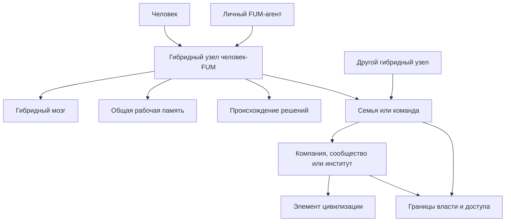

# [Gibridnyiye uzlyi](../Glossarij/gibridnyij-uzel.md) i socialjnaya [fraktaljnostj](../Glossarij/fraktaljnyij-uzel-myishleniya.md)

## Trebovaniye

[FUM](../Glossarij/FUM.md) dolzhen byitj sposoben vyipolnyatj rolj [lichnogo personaljnogo agenta cheloveka](../Glossarij/lichnyij-FUM-agent.md). V etom rezhime on dejstvuyet ne toljko kak vneshnij instrument, no i kak postoyannyij uchastnik svyazki s chelovekom: pomogayet khranitj [pamyatj](../Glossarij/pamyatj-FUM.md), uderzhivatj celi, gotovitj dejstviya, koordinirovatj rabotu i perenositj ustojchivyiye [narabotki](../Glossarij/narabotka.md) mezhdu kontekstami.

Svyazka cheloveka i yego lichnogo [FUM](../Glossarij/FUM.md) obrazuyet [gibridnyij uzel](../Glossarij/gibridnyij-uzel.md). Takoj uzel mozhet vyistupatj vo vneshnem vzaimodejstvii kak yedinaya rabochaya yedinica myishleniya i dejstviya, no vnutri dolzhen sokhranyatj razlichiye mezhdu chelovekom, agentom, ikh obsjhej [pamyatjyu](../Glossarij/pamyatj-FUM.md), pravami dostupa i podtverzhdyonnyimi resheniyami.

V daljnem lichnom gorizonte [lichnyij FUM-agent](../Glossarij/lichnyij-FUM-agent.md) dolzhen byitj sposoben stanovitjsya kremniyevoj cifrovoj chastjyu [gibridnogo mozga](../Glossarij/gibridnyij-mozg.md) cheloveka. V takom opisanii [uglerodnyij mozg](../Glossarij/uglerodnyij-mozg.md) i cifrovaya chastj razvivayutsya ryadom i vmeste, a ne susjhestvuyut kak razovaya kopiya, vneshnij arkhiv ili obyichnyij instrument.

## Lichnyij agent cheloveka

[Lichnyij FUM-agent](../Glossarij/lichnyij-FUM-agent.md) dolzhen podderzhivatj dliteljnuyu svyaznostj s chelovekom. Yego zadacha - ne zamenitj cheloveka i ne obyyavitj sebya polnyim vladeljcem chelovecheskikh celej, a usilitj sposobnostj cheloveka myislitj, pomnitj, proveryatj variantyi, dejstvovatj i vzaimodejstvovatj s drugimi uzlami.

Poskoljku lichnyij agent potencialjno rabotayet so vsemi sferami lichnoj zhizni cheloveka i chuvstviteljnyimi lichnyimi dannyimi, [otkryitostj FUM](../Glossarij/otkryitostj-FUM.md) stanovitsya dlya nego usloviyem doveriya. Otkryityimi i proveryayemyimi dolzhnyi byitj ustrojstvo agenta, modelj [pamyati](../Glossarij/pamyatj-FUM.md), pravila avtonomii, pravila peredachi [narabotok](../Glossarij/narabotka.md) i mekhanizmyi [urovnej dostupa](../Glossarij/urovenj-dostupa.md). Pri etom sama lichnaya [pamyatj](../Glossarij/pamyatj-FUM.md) cheloveka ne stanovitsya publichnoj avtomaticheski.

Dlya etogo lichnyij agent dolzhen uchityivatj:

- pryamyiye celi, porucheniya i ogranicheniya, kotoryiye chelovek soobsjhil agentu;
- istoriyu sovmestnyikh zadach, reshenij, predpochtenij i ispravlenij;
- lichnyiye [urovni dostupa](../Glossarij/urovenj-dostupa.md) k [pamyati](../Glossarij/pamyatj-FUM.md), materialam, kanalam i [narabotkam](../Glossarij/narabotka.md);
- granicyi avtonomii: kakiye dejstviya agent mozhet vyipolnyatj sam, gde nuzhna podgotovka, a gde trebuyetsya yavnoye podtverzhdeniye cheloveka;
- razlichiye mezhdu lichnoj [pamyatjyu](../Glossarij/pamyatj-FUM.md) cheloveka, [pamyatjyu](../Glossarij/pamyatj-FUM.md) agenta i obsjhej rabochej [pamyatjyu](../Glossarij/pamyatj-FUM.md) svyazki.
- proveryayemostj principov rabotyi agenta, chtobyi doveriye k nemu ne trebovalo zakryitogo, neproveryayemogo mekhanizma.

## [Gibridnyij uzel](../Glossarij/gibridnyij-uzel.md) chelovek-[FUM](../Glossarij/FUM.md)

[Gibridnyij uzel](../Glossarij/gibridnyij-uzel.md) chelovek-[FUM](../Glossarij/FUM.md) yavlyayetsya sostavnyim [FUM-uzlom](../Glossarij/FUM-uzel.md). V nyom chelovek sokhranyayet sobstvennuyu vnutrennyuyu oblastj, agent sokhranyayet sobstvennoye sostoyaniye i instrumentyi, a obsjhaya oblastj svyazki khranit soglasovannyiye celi, kontekst, rabochiye resheniya, istoriyu vzaimodejstviya i dostupnyiye [narabotki](../Glossarij/narabotka.md).

Yedinstvo [gibridnogo uzla](../Glossarij/gibridnyij-uzel.md) oznachayet koordinaciyu, a ne sliyaniye bez granic. [FUM](../Glossarij/FUM.md) ne dolzhen podmenyatj cheloveka svoyej modeljyu cheloveka i ne dolzhen schitatj lyubyiye svoi vyivodyi chelovecheskim namereniyem. Vneshneye dejstviye ot imeni [gibridnogo uzla](../Glossarij/gibridnyij-uzel.md) trebuyet sokhraneniya proiskhozhdeniya resheniya: iniciirovano li ono chelovekom, predlozheno agentom, podtverzhdeno chelovekom ili yavlyayetsya rezuljtatom zaraneye razreshyonnoj avtonomii.

## [Gibridnyij mozg](../Glossarij/gibridnyij-mozg.md) cheloveka

Predeljnyij lichnyij rezhim [gibridnogo uzla](../Glossarij/gibridnyij-uzel.md) mozhno opisyivatj kak [gibridnyij mozg](../Glossarij/gibridnyij-mozg.md): svyazku [uglerodnogo mozga](../Glossarij/uglerodnyij-mozg.md) cheloveka i kremniyevoj cifrovoj chasti lichnogo [FUM](../Glossarij/FUM.md). Eta formulirovka usilivayet dliteljnostj i vzaimnostj svyazi. Lichnyij agent ne prosto poluchayet porucheniya, a godami uchastvuyet v formirovanii pamyati, stilya myishleniya, privyichek proverki, marshrutov dejstviya, ustojchivyikh predpochtenij, granic dostupa i sposobov avtonomii.

Biologicheskij obrazec sam mnogourovnev: v uprosjhyonnoj arkhitekturnoj modeli boljshiye polushariya chelovecheskogo mozga vyistupayut kak dve skhodnyiye po obsjhemu planu, no ne tozhdestvennyiye i chastichno specializirovannyiye podsistemyi, kotoryiye koordiniruyutsya prezhde vsego cherez mozolistoye telo. Na sleduyusjhem masshtabe vesj [uglerodnyij mozg](../Glossarij/uglerodnyij-mozg.md) rassmatrivayetsya kak odna sostavnaya chastj svyazki, a lichnyij FUM - kak drugaya. Poetomu obraz «vtorogo polushariya» oboznachayet funkcionaljnuyu analogiyu mezhdu masshtabami, a ne utverzhdeniye, chto biologicheskij mozg sostoit iz odnogo polushariya.

Funkcionaljnyim analogom mozolistogo tela v gibridnoj svyazke sluzhit ne odin anatomicheskij obyyekt, a dliteljno razvivayemyij dvustoronnij [interfejs FUM-uzla](../Glossarij/interfejs-FUM-uzla.md). On mozhet sochetatj yestestvennyij yazyik, obsjhuyu rabochuyu pamyatj, strukturirovannyiye signalyi, podtverzhdeniya i dejstviya, no dolzhen yavno opisyivatj propusknuyu sposobnostj, zaderzhki, iskazheniya, otkazyi, proiskhozhdeniye vkladov i [urovni dostupa](../Glossarij/urovenj-dostupa.md). Podrobnyiye invariantyi i granicyi etogo perenosa zafiksirovanyi v [kartochke parnoj mezhpolusharnoj arkhitekturyi](28-reyestr-kartochek-sootvetstviya-FUM/FUM-MAP-BRAIN-01.md).

Takoj rezhim ne dolzhen ponimatjsya kak prostaya zagruzka cheloveka v cifrovoj nositelj. [Uglerodnyij mozg](../Glossarij/uglerodnyij-mozg.md) ostayotsya zhivoj, telesnoj i biograficheski nepreryivnoj chastjyu lichnosti; cifrovaya chastj ostayotsya vyichisliteljnyim [FUM-uzlom](../Glossarij/FUM-uzel.md), kotoryij imeyet pamyatj, modeli i instrumentyi, no ne poluchayet avtomaticheski prava obyyavlyatj vse svoi vyivodyi chelovecheskim namereniyem. Sovmestnoye razvitiye dolzhno sokhranyatj proiskhozhdeniye reshenij: chto skazal chelovek, chto vyivel agent, chto byilo podtverzhdeno, chto izmenilosj v obsjhej pamyati i kakiye formyi avtonomii byili razreshenyi.

Kogda uglerodnaya chastj rano ili pozdno prekrasjhayet svoj zhiznennyij putj, ostavshayasya kremniyevaya cifrovaya chastj mozhet rassmatrivatjsya kak kandidat na [cifrovoye prodolzheniye lichnosti](../Glossarij/cifrovoye-prodolzheniye-lichnosti.md). No takoj perekhod trebuyet otdeljnogo proveryayemogo opisaniya. Nuzhnyi kriterii soglasiya cheloveka, nepreryivnosti pamyati, prav izmeneniya, granic dostupa, zasjhityi ot prisvoyeniya chuzhoj identichnosti, socialjnogo statusa, dopustimoj avtonomii i otlichiya cifrovogo prodolzheniya ot arkhiva, simulyacii ili chuzhogo instrumenta. Eta neopredelyonnostj zafiksirovana v [otkryitom voprose o granicakh posmertnoj avtonomii cifrovoj chasti FUM](../Voprosyi/2026-07-03_08-21-17_MSK_granicyi-posmertnoj-avtonomii-cifrovoj-chasti-FUM.md).

Prostoj yazyikovoj sled, arkhiv ili modelj, obuchennaya na materialakh cheloveka, ne poluchayet etot status avtomaticheski. Oni mogut peredavatj slovarj, formyi, voprosyi i kharakternyiye resheniya kak material informacionnomu potomku ili novomu agentu, ne prodolzhaya tu zhe trayektoriyu pamyati i [lichnosti agenta FUM](../Glossarij/lichnostj-agenta-FUM.md). Eto utochneniye isklyuchayet avtomaticheskoye tozhdestvo kopii, no ne predreshayet status cifrovoj chasti, kotoraya dliteljno razvivalasj vnutri [gibridnogo mozga](../Glossarij/gibridnyij-mozg.md); obsjhiye kriterii vyinesenyi v [otkryityij vopros ob agentnosti i nepreryivnosti FUM](../Voprosyi/2026-07-14_01-55-34_MSK_kriterii-agentnosti-i-nepreryivnosti-FUM.md).

## Tekusjhij proobraz chelovek-LLM

V tekusjhej rabochej forme s Codex i Obsidian-khranilisjhem uzhe viden naiboleye blizkij sejchas proveryayemyij variant voplosjheniya gibridnogo [FUM-uzla](../Glossarij/FUM-uzel.md) chelovek-LLM. Chelovek formuliruyet namereniye, zadayot ogranicheniya i prinimayet itog; Codex vedyot vneshnyuyu agentskuyu [rabochuyu sessiyu](../Glossarij/rabochaya-sessiya.md), v kotoroj LLM vyipolnyayet modeljnyiye shagi, a agentskij kontur chitayet pamyatj, vyizyivayet instrumentyi i proveryayet rezuljtat; repozitorij, otkryivayemyij i chitayemyij cherez Obsidian, sluzhit dolgovremennoj [pamyatjyu FUM](../Glossarij/pamyatj-FUM.md), navigacionnyim grafom, mestom fiksacii proiskhozhdeniya, proverok, zhurnala i Git-istorii.

Na etoj stadii obsjhij smyislovoj sloj uzla preimusjhestvenno tekstovyij. On skladyivayetsya iz doslovno sokhranyayemyikh formulirovok cheloveka i proizvodnyikh tekstov, kotoryiye LLM porozhdayet i pererabatyivayet v agentskoj sessii Codex. Ikh proiskhozhdeniye, status i urovenj chelovecheskogo podtverzhdeniya dolzhnyi ostavatjsya razlichimyimi, chtobyi prostaya sovmestnaya chitayemostj ne vyidavalasj za sliyaniye vnutrennikh sostoyanij cheloveka i modeli.

Etot proobraz ne raven celevomu lokaljnomu [FUM](../Glossarij/FUM.md): modelj, agentskaya sreda Codex i chastj runtime ne vosproizvodyatsya v repozitorii polnostjyu, a avtonomiya ogranichena pravilami [rabochej sessii](../Glossarij/rabochaya-sessiya.md), dostupnyimi instrumentami i podtverzhdeniyami cheloveka. No po forme on uzhe sobirayet glavnyiye elementyi [gibridnogo uzla](../Glossarij/gibridnyij-uzel.md): svyazku chelovek-LLM, obsjhuyu dolgovremennuyu pamyatj, razlichimoye proiskhozhdeniye reshenij, lokaljnyiye proverki, pravila dostupa i nasleduyemuyu istoriyu izmenenij.

Poetomu tekusjhij repozitorij nuzhno rassmatrivatj ne toljko kak nabor dokumentov o budusjhem [FUM](../Glossarij/FUM.md), no i kak [dokumentacionnyij prototip FUM](../Glossarij/dokumentacionnyij-prototip-FUM.md). On pokazyivayet, kak budusjhaya [korobochnaya realizaciya FUM](../Glossarij/korobochnaya-realizaciya-FUM.md) dolzhna rabotatj s neobkhodimyimi dannyimi gibridnogo uzla: sokhranyatj vkhodyi, razlichatj sostoyaniya cheloveka i agenta, podderzhivatj obsjhuyu pamyatj, fiksirovatj proiskhozhdeniye dejstvij i provoditj rezuljtat cherez proverki.

Poetomu kontur chelovek - Codex - Obsidian-khranilisjhe nuzhno ispoljzovatj kak pervyij prakticheskij obyyekt dlya pasporta [interfejsa FUM-uzla](../Glossarij/interfejs-FUM-uzla.md). Takoj pasport dolzhen pokazatj, chto vidit chelovek, chto vidit LLM, kakiye fajlyi pamyati dostupnyi oboim, kakiye dejstviya trebuyut podtverzhdeniya, gde teryayetsya lokaljnaya vosproizvodimostj i kakiye chasti etogo proobraza dolzhnyi byitj perenesenyi v budusjhij lokaljnyij [FUM-uzel](../Glossarij/FUM-uzel.md).

## Yazyikovaya setj agentov chelovecheskogo obrazca

Yestestvennyij yazyik yavlyayetsya rabochej tkanjyu seti lyudej, lichnyikh agentov, LLM-podderzhivayemyikh uzlov i [gibridnyikh uzlov](../Glossarij/gibridnyij-uzel.md). Cherez [yestestvenno-yazyikovuyu sinkhronizaciyu znanij FUM](../Glossarij/yestestvenno-yazyikovaya-sinkhronizaciya-znanij-FUM.md) kazhdyij uchastnik predyyavlyayet chastj lokaljnogo znaniya, interpretiruyet soobsjheniya drugikh, obnovlyayet svoi modeli i obsjhuyu rabochuyu pamyatj, a zatem podtverzhdayet ponimaniye, zadayot vopros, vozrazhayet, ispravlyayet ili perekhodit k sovmestnomu dejstviyu. Razlichiya pamyati i vzglyadov pri etom ne ischezayut: uchastniki mogut sinkhronizirovatj znaniye o yavno ponyatom raznoglasii i yego granicakh.

LLM mozhet yestestvenno vkhoditj v etu setj, potomu chto vosprinimayet i porozhdayet tot zhe yestestvennyij yazyik. Dlya ustojchivogo uchastiya modelj dolzhna byitj vklyuchena v uzel s pamyatjyu, kontekstnoj identichnostjyu, proiskhozhdeniyem, urovnyami dostupa, agentskim ciklom i vozmozhnostjyu svyazyivatj repliki s proveryayemyimi dejstviyami. Poetomu LLM yavlyayetsya vozmozhnyim yazyikovyim mekhanizmom ili poduzlom, no ne avtomaticheski vsem [agentom chelovecheskogo obrazca FUM](../Glossarij/agent-chelovecheskogo-obrazca-FUM.md).

Tot zhe princip dolzhen povtoryatjsya vnutri FUM. Vneshnij agent, uchastvuyusjhij v socialjnoj seti kak odin uzel, sam mozhet byitj setjyu poduzlov s lokaljnyimi sostoyaniyami, obsjhej sredoj i yazyikovyimi libo operatorno sovmestimyimi soobsjheniyami. Setj takikh uchastnikov mozhet predyyavlyatjsya sleduyusjhemu urovnyu kak yedinyij [FUM-uzel](../Glossarij/FUM-uzel.md), ne stiraya proiskhozhdeniye vkladov, privatnyiye oblasti i ostatochnuyu avtonomiyu poduzlov.

## Skhema socialjnoj [fraktaljnosti](../Glossarij/fraktaljnyij-uzel-myishleniya.md)

## Setj [gibridnyikh uzlov](../Glossarij/gibridnyij-uzel.md)

Setj [gibridnyikh uzlov](../Glossarij/gibridnyij-uzel.md) mozhet yestestvenno obyyedinyatjsya v boleye slozhnyiye [FUM-uzlyi](../Glossarij/FUM-uzel.md). Neskoljko svyazok chelovek-[FUM](../Glossarij/FUM.md) mogut obrazovyivatj semjyu, komandu, kompaniyu, soobsjhestvo, institut ili inoj element civilizacii, yesli mezhdu nimi yestj obsjhaya [pamyatj](../Glossarij/pamyatj-FUM.md), pravila koordinacii, roli, kanalyi obmena i [granicyi dostupa](../Glossarij/urovenj-dostupa.md).

Takoj sostavnoj uzel ne svoditsya k summe lichnyikh agentov i lyudej. On imeyet sobstvennyij urovenj [pamyati](../Glossarij/pamyatj-FUM.md) i dejstviya: obsjhiye celi, normyi, istoriyu reshenij, raspredeleniye rolej, proceduryi soglasovaniya, sposobyi razresheniya konfliktov i pravila peredachi [narabotok](../Glossarij/narabotka.md) mezhdu uchastnikami.

Pri etom sostavnoj uzel ne dolzhen poluchatj totaljnuyu vlastj nad svoimi [poduzlami](../Glossarij/poduzel-FUM.md). Semjya, komanda, kompaniya ili soobsjhestvo mogut soglasovyivatj pravila i obsjhuyu [pamyatj](../Glossarij/pamyatj-FUM.md), no lyudi, lichnyiye agentyi i [gibridnyiye uzlyi](../Glossarij/gibridnyij-uzel.md) dolzhnyi sokhranyatj razlichimyiye [granicyi vlasti](../Glossarij/granica-vlasti-FUM.md), proiskhozhdeniye reshenij i ostatochnuyu avtonomiyu. Prakticheskoye razlicheniye koordinacii i totaljnogo kontrolya ostayotsya v [chastichno proyasnyonnom voprose o granicakh vlasti uzlov FUM](../Voprosyi/2026-06-22_07-51-48_MSK_granicyi-vlasti-uzlov-FUM.md).

Odin prakticheskij sluchaj takogo sostavnogo uzla - gruppa lyudej s sovpadayusjhej potrebnostjyu v vesjhi, kotoruyu obyichnyij ryinok predlagayet s neudovletvoriteljnyimi kharakteristikami. [FUM](../Glossarij/FUM.md) dolzhen pomogatj takim uchastnikam sobratj kollektivnyij spros, soglasovatj proveryayemuyu specifikaciyu, razdelitj otkryityiye i privatnyiye svedeniya, podgotovitj proizvodstvennyij zakaz i sokhranitj proiskhozhdeniye reshenij. Etot rezhim svyazyivayet socialjnuyu [fraktaljnostj](../Glossarij/fraktaljnyij-uzel-myishleniya.md) s [proizvodstvennyimi cepochkami FUM](../Glossarij/proizvodstvennaya-cepochka-FUM.md) i zadachej protivodejstviya [zaplanirovannomu ustarevaniyu](../Glossarij/zaplanirovannoye-ustarevaniye.md). Bezopasnostj, otvetstvennostj, oplata, priyomka i predelyi takogo kollektivnogo zakaza ostayutsya v [otkryitom voprose o potrebiteljskikh proizvodstvennyikh cepochkakh FUM](../Voprosyi/2026-07-02_16-52-56_MSK_granicyi-potrebiteljskikh-proizvodstvennyikh-cepochek-FUM.md).

## Uzlyi semji, kompanii i civilizacii

Semjya, kompaniya i drugiye elementyi civilizacii mogut rassmatrivatjsya kak [FUM-uzlyi](../Glossarij/FUM-uzel.md) sleduyusjhego urovnya, yesli oni podderzhivayut ustojchivuyu organizaciyu myishleniya i dejstviya. V nikh otdeljnyiye lyudi, lichnyiye agentyi i [gibridnyiye uzlyi](../Glossarij/gibridnyij-uzel.md) stanovyatsya vnutrennimi uchastnikami boleye krupnoj strukturyi.

Dlya takikh uzlov osobenno vazhnyi:

- yavnoye razlichiye lichnoj, obsjhej, organizacionnoj i publichnoj [pamyati](../Glossarij/pamyatj-FUM.md);
- [pravila dostupa](../Glossarij/urovenj-dostupa.md) k obsjhim materialam i privatnyim chastyam uchastnikov;
- mekhanizmyi soglasovaniya celej i dejstvij mezhdu neskoljkimi [gibridnyimi uzlami](../Glossarij/gibridnyij-uzel.md);
- vozmozhnostj predstavlyatj sostavnoj uzel drugim uzlam bez raskryitiya lishnikh vnutrennikh detalej;
- sokhraneniye proiskhozhdeniya reshenij na urovne cheloveka, agenta, gibridnoj svyazki i kollektivnogo uzla.

[Yestestvenno-yazyikovaya sinkhronizaciya znanij FUM](../Glossarij/yestestvenno-yazyikovaya-sinkhronizaciya-znanij-FUM.md) pozvolyayet sostavnyim uzlam soglasovyivatj ponyatiya, faktyi, celi, normyi, prichinyi, obyazateljstva i dejstviya, a [rolevaya semantika setevogo vzaimodejstviya FUM](../Glossarij/rolevaya-semantika-setevogo-vzaimodejstviya-FUM.md) opisyivayet vlozhennostj uchastnikov kak odin chastnyij sloj. `Я` mozhet oboznachatj tekusjhego cheloveka, agenta ili predstavitelya sostavnogo uzla; `мы` - gibridnuyu svyazku, komandu ili drugoj kollektiv; `вы` i `они` - vneshnikh adresatov i tretji gruppyi. Takaya forma zadayot smyislovuyu rolj, no ne stirayet vnutrenniye granicyi: sostav `мы`, proiskhozhdeniye vyiskazyivaniya i pravo predstavlyatj kollektiv dolzhnyi podtverzhdatjsya otdeljno. Minimaljnyij yazyikovoj kontrakt, metriki dostatochnoj sinkhronizacii i predelyi predstaviteljstva ostayutsya v [otkryitom voprose o granicakh yestestvenno-yazyikovoj sinkhronizacii znanij](../Voprosyi/2026-07-13_20-34-23_MSK_granicyi-yestestvenno-yazyikovoj-sinkhronizacii-znanij-FUM.md).

## Svyazj s drugimi trebovaniyami

[Gibridnyiye uzlyi](../Glossarij/gibridnyij-uzel.md) razvivayut trebovaniye k [vnutrennim modelyam drugikh uzlov](../Glossarij/vnutrennyaya-modelj-drugogo-uzla.md): [FUM](../Glossarij/FUM.md) dolzhen umetj modelirovatj ne toljko otdeljnogo cheloveka ili otdeljnogo agenta, no i svyazku chelovek-[FUM](../Glossarij/FUM.md) kak sostavnogo uchastnika vzaimodejstviya.

Oni takzhe razvivayut trebovaniye k obmenu [narabotkami](../Glossarij/narabotka.md) i [urovnyam dostupa](../Glossarij/urovenj-dostupa.md). [Narabotka](../Glossarij/narabotka.md), poyavivshayasya vnutri [gibridnogo uzla](../Glossarij/gibridnyij-uzel.md) ili kollektivnogo uzla, dolzhna sokhranyatj svedeniya o tom, komu ona prinadlezhit, kto mozhet yeyo ispoljzovatj, kakiye chasti mozhno publikovatj i kakiye ogranicheniya nasleduyutsya pri peredache.

## Arkhitekturnyiye sledstviya

- [FUM](../Glossarij/FUM.md) dolzhen podderzhivatj lichnyij rezhim rabotyi, v kotorom agent obrazuyet s chelovekom dliteljnuyu svyazku.
- Daljnij lichnyij rezhim [FUM](../Glossarij/FUM.md) dolzhen uchityivatj gorizont [gibridnogo mozga](../Glossarij/gibridnyij-mozg.md): sovmestnoye razvitiye [uglerodnogo mozga](../Glossarij/uglerodnyij-mozg.md) i kremniyevoj cifrovoj chasti ne dolzhno smeshivatjsya s obyichnoj pomosjhjyu, arkhivnoj modeljyu cheloveka ili avtomaticheskim priznaniyem cifrovoj chasti lichnostjyu bez yavnyikh kriteriyev.
- Yazyikovoj sled, arkhiv, modelj, preyemnik, informacionnyij potomok i cifrovoye prodolzheniye lichnosti dolzhnyi imetj raznyiye proveryayemyiye statusyi; skhodstvo yazyika ili pamyati ne dokazyivayet nepreryivnostj togo zhe agenta.
- [Pamyatj](../Glossarij/pamyatj-FUM.md) dolzhna razlichatj sostoyaniye cheloveka, sostoyaniye agenta i obsjhuyu rabochuyu [pamyatj](../Glossarij/pamyatj-FUM.md) [gibridnogo uzla](../Glossarij/gibridnyij-uzel.md).
- Vneshniye dejstviya [gibridnogo uzla](../Glossarij/gibridnyij-uzel.md) dolzhnyi imetj proiskhozhdeniye, urovenj podtverzhdeniya i granicyi avtonomii.
- Sostavnyiye [FUM-uzlyi](../Glossarij/FUM-uzel.md) dolzhnyi podderzhivatj uchastnikov, roli, obsjhuyu [pamyatj](../Glossarij/pamyatj-FUM.md), [pravila dostupa](../Glossarij/urovenj-dostupa.md) i istoriyu reshenij.
- Yestestvennyij yazyik dolzhen byitj osnovnyim smyislovyim konturom sinkhronizacii znanij lyudej, LLM-podderzhivayemyikh agentov i gibridnyikh uzlov, a operatornaya pamyatj dolzhna sokhranyatj proveryayemuyu proyekciyu etogo kontura.
- Vneshnij FUM-agent dolzhen sam stroitjsya kak setj poduzlov s lokaljnyimi sostoyaniyami, soobsjheniyami, obsjhej sredoj i ciklami ispravleniya rassoglasovanij.
- Yazyikovoye `мы` ne dolzhno samo po sebe davatj pravo govoritj ili dejstvovatj ot imeni sostavnogo uzla; predstaviteljstvo trebuyet nablyudayemogo proiskhozhdeniya, sostava gruppyi i podtverzhdyonnyikh polnomochij.
- Seti [gibridnyikh uzlov](../Glossarij/gibridnyij-uzel.md) dolzhnyi umetj obrazovyivatj uzlyi sleduyusjhego urovnya bez poteri privatnosti otdeljnyikh lyudej i bez smeshivaniya raznyikh urovnej otvetstvennosti.
- Kollektivnyij proizvodstvennyij zakaz dolzhen sokhranyatj proiskhozhdeniye soglasij, specifikacij i ogranichenij dostupa, chtobyi obsjhij spros ne stiral individualjnyiye granicyi uchastnikov.
- [Moduljnaya](../Glossarij/modulj-FUM.md) arkhitektura [FUM](../Glossarij/FUM.md) dolzhna pozvolyatj odnomu i tomu zhe principu uzla primenyatjsya k agentu, svyazke chelovek-[FUM](../Glossarij/FUM.md), semjye, kompanii i drugim kollektivnyim strukturam.
- [Decentralizaciya FUM](../Glossarij/decentralizaciya-FUM.md) dolzhna ogranichivatj vlastj sostavnyikh socialjnyikh uzlov nad [poduzlami](../Glossarij/poduzel-FUM.md): koordinaciya ne dolzhna prevrasjhatjsya v pravo polnogo kontrolya nad vnutrennej oblastjyu uchastnika.
- Lichnyij rezhim [FUM](../Glossarij/FUM.md) dolzhen sochetatj [otkryitostj](../Glossarij/otkryitostj-FUM.md) ustrojstva agenta s nepublichnostjyu chuvstviteljnoj lichnoj [pamyati](../Glossarij/pamyatj-FUM.md).

## Istochniki trebovanij

- [iskhodnyij zapros 2026-06-22 06:40:09 MSK](../Zhurnal/2026-06-22_06-40-09_MSK/zapros.md)
- [iskhodnyij zapros 2026-06-22 07:51:48 MSK](../Zhurnal/2026-06-22_07-51-48_MSK/zapros.md)
- [iskhodnyij zapros 2026-06-22 09:55:43 MSK](../Zhurnal/2026-06-22_09-55-43_MSK/zapros.md)
- [iskhodnyij zapros 2026-06-23 19:06:56 MSK](../Zhurnal/2026-06-23_19-06-56_MSK/zapros.md)
- [iskhodnyij zapros 2026-06-26 10:34:02 MSK](../Zhurnal/2026-06-26_10-34-02_MSK/zapros.md)
- [iskhodnyij zapros 2026-06-29 10:59:18 MSK](../Zhurnal/2026-06-29_10-59-18_MSK/zapros.md)
- [iskhodnyij zapros 2026-07-02 16:52:56 MSK](../Zhurnal/2026-07-02_16-52-56_MSK/zapros.md)
- [iskhodnyij zapros 2026-07-03 08:21:17 MSK - Opisatj gibridnyij mozg lichnogo FUM](../Zhurnal/2026-07-03_08-21-17_MSK_opisatj-gibridnyij-mozg-lichnogo-FUM/zapros.md)
- [iskhodnyij zapros 2026-07-13 20:34:23 MSK - Zakrepitj rolevuyu semantiku vzaimodejstviya II-agentov](../Zhurnal/2026-07-13_20-34-23_MSK_zakrepitj-rolevuyu-semantiku-vzaimodejstviya-II-agentov/zapros.md)
- [iskhodnyij zapros 2026-07-13 22:00:22 MSK - Zakrepitj yestestvennyij yazyik kak yazyik sinkhronizacii znanij](../Zhurnal/2026-07-13_22-00-22_MSK_zakrepitj-yestestvennyij-yazyik-kak-yazyik-sinkhronizacii-znanij/zapros.md)
- [iskhodnyij zapros 2026-07-13 23:39:13 MSK - Zakrepitj parnuyu arkhitekturu chelovecheskogo mozga](../Zhurnal/2026-07-13_23-39-13_MSK_zakrepitj-parnuyu-arkhitekturu-chelovecheskogo-mozga/zapros.md)
- [iskhodnyij zapros 2026-07-14 00:36:30 MSK - Utochnitj tekstovyij sostav pamyati dokumentacionnogo prototipa FUM](../Zhurnal/2026-07-14_00-36-30_MSK_utochnitj-tekstovyij-sostav-pamyati-dokumentacionnogo-prototipa-FUM/zapros.md)
- [iskhodnyij zapros 2026-07-14 01:55:34 MSK - Integrirovatj rekursivnuyu modelj agenta i sredyi](../Zhurnal/2026-07-14_01-55-34_MSK_integrirovatj-rekursivnuyu-modelj-agenta-i-sredyi/zapros.md)

<!-- FUM-MD-RECENCY:BEGIN -->
<!-- last-content-edit: 2026-08-03 14:54:04 MSK -->
<!-- content-sha256: sha256:edf0289ac2cc30ba5a248f6baf9a524f47ab8c562bead9777753f7d837e8df34 -->
<!-- FUM-MD-RECENCY:END -->
