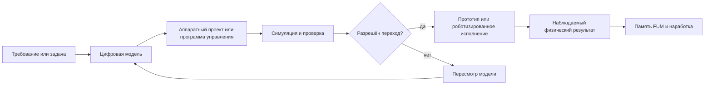

# [Fizicheskoye dejstviye FUM](../Glossarij/fizicheskoye-dejstviye-FUM.md) i [apparatnyiye FUM-uzlyi](../Glossarij/apparatnyij-FUM-uzel.md)

## Trebovaniye

V perspektive [FUM](../Glossarij/FUM.md) dolzhen byitj sposoben dejstvovatj ne toljko v programmiruyemom cifrovom prostranstve, no i na fizicheskom urovne. Eto oznachayet, chto [FUM](../Glossarij/FUM.md) dolzhen razvivatjsya kak agent, sposobnyij proyektirovatj, proveryatj i ispoljzovatj materialjnyiye realizacii svoikh [FUM-uzlov](../Glossarij/FUM-uzel.md), a takzhe svyazyivatj cifrovoye myishleniye s fizicheskimi ustrojstvami, robotizirovannyimi ispolnitelyami i proizvodstvennyimi processami.

[Fizicheskoye dejstviye FUM](../Glossarij/fizicheskoye-dejstviye-FUM.md) ne zamenyayet cifrovuyu [pamyatj](../Glossarij/pamyatj-FUM.md), [agentskiye ciklyi](../Glossarij/agentskij-cikl.md) i [moduljnuyu](../Glossarij/modulj-FUM.md) arkhitekturu. Ono rasshiryayet ikh v oblastj, gde rezuljtatom myishleniya mozhet byitj ne toljko dokument, kod ili workflow, no i apparatnyij proyekt, robotizirovannoye dejstviye, proizvodstvennaya operaciya ili izmenyonnaya fizicheskaya sreda.

[FUM](../Glossarij/FUM.md) dolzhen primenyatj etot fizicheskij kontur ne toljko k sobstvennyim apparatnyim chastyam, no i k vesjham, kotoryiye nuzhnyi lyudyam s zadannyimi kharakteristikami. Odno iz prakticheskikh naznachenij takogo kontura - protivodejstviye [zaplanirovannomu ustarevaniyu](../Glossarij/zaplanirovannoye-ustarevaniye.md): perekhod ot passivnogo vyibora sredi navyazannyikh ryinochnyikh variantov k proyektirovaniyu, proverke i zakazu vesjhej s yavno ukazannyim resursom, materialami, remontoprigodnostjyu i usloviyami priyomki.

## [Apparatnyij FUM-uzel](../Glossarij/apparatnyij-FUM-uzel.md)

[Apparatnyij FUM-uzel](../Glossarij/apparatnyij-FUM-uzel.md) yavlyayetsya materialjnoj realizaciyej vyichisliteljnoj ili upravlyayusjhej chasti [FUM](../Glossarij/FUM.md). On mozhet vklyuchatj vyichisliteljnyiye komponentyi, sensoryi, ispolniteljnyiye mekhanizmyi, kanalyi svyazi, energeticheskiye podsistemyi i fizicheskiye interfejsyi, cherez kotoryiye [FUM](../Glossarij/FUM.md) nablyudayet mir i dejstvuyet v nyom.

Proyektirovaniye [apparatnyikh FUM-uzlov](../Glossarij/apparatnyij-FUM-uzel.md) dolzhno podchinyatjsya toj zhe fraktaljnoj logike, chto i programmnaya arkhitektura: malyiye uzlyi mogut vkhoditj v setj, setj mozhet stanovitjsya [FUM-uzlom](../Glossarij/FUM-uzel.md) sleduyusjhego urovnya, a ustojchivyiye resheniya dolzhnyi oformlyatjsya kak perenosimyiye [narabotki](../Glossarij/narabotka.md) s proiskhozhdeniyem, proverochnyim statusom i [urovnem dostupa](../Glossarij/urovenj-dostupa.md).

Sensornyiye, upravlyayusjhiye i ispolniteljnyiye konturyi [apparatnogo FUM-uzla](../Glossarij/apparatnyij-FUM-uzel.md) yavlyayutsya [ustrojstvami vospriyatiya i dejstviya FUM](../Glossarij/ustrojstvo-vospriyatiya-i-dejstviya-FUM.md). Ikh ustojchivyiye algoritmicheskiye chasti dolzhnyi opisyivatjsya kak [avtomatizacii FUM](../Glossarij/avtomatizaciya-FUM.md): s iskhodnyimi tekstami, versiyami, konfiguraciyami, proverkami i istoriyej izmenenij v [pamyati](../Glossarij/pamyatj-FUM.md). Dlya upravlyayusjhego yadra osobenno predpochtiteljno otdelyatj [chistyiye funkcii](../Glossarij/chistaya-funkciya.md) ot realjnogo vvoda-vyivoda i fizicheskogo vozdejstviya.

[Avtomaticheskij organ dejstviya FUM](../Glossarij/avtomaticheskij-organ-dejstviya-FUM.md) zadayot sloj mezhdu vyisokourovnevyim planom i ispolniteljnyimi mekhanizmami apparatnogo uzla. On dolzhen prevrasjhatj opisaniye dejstviya v konkretnyiye komandyi, dvizheniya, rezhimyi privoda, vyizovyi instrumenta ili drugiye nizkourovnevyiye operacii, sokhranyaya svyazj s iskhodnyim planom, ogranicheniyami i nablyudayemyim rezuljtatom.

Dlya [apparatnyikh FUM-uzlov](../Glossarij/apparatnyij-FUM-uzel.md) osobenno vazhnyi:

- specifikaciya naznacheniya uzla, yego vkhodov, vyikhodov, fizicheskikh ogranichenij i dopustimyikh rezhimov;
- proveryayemaya svyazj mezhdu cifrovoj modeljyu uzla, proyektnoj dokumentaciyej, prototipom i fakticheskim ustrojstvom;
- uchyot nadyozhnosti, otkazov, iznosa, remonta, zamenyi i povtornogo ispoljzovaniya chastej;
- razlicheniye proyektirovaniya, simulyacii, izgotovleniya, ispyitaniya, ekspluatacii i fizicheskogo vmeshateljstva;
- sokhraneniye svedenij o proiskhozhdenii apparatnoj [narabotki](../Glossarij/narabotka.md), sostave, versii, sovmestimosti i prave peredachi.

## Vyidelennaya vyichisliteljnaya mashina

Blizhnyaya apparatnaya vekha [FUM](../Glossarij/FUM.md) - ne robotizirovannoye dejstviye, a vyidelennaya vyichisliteljnaya mashina dlya lokaljnogo agenta. Takoj uzel dolzhen zapuskatj [lichnogo FUM-agenta](../Glossarij/lichnyij-FUM-agent.md), lokaljnuyu [pamyatj](../Glossarij/pamyatj-FUM.md), lokaljnyiye proverki, instrumentyi i siljnuyu LLM bez obyazateljnogo obrasjheniya k vneshnemu API.

Predvariteljnyij obraz iz trebovaniya - Mac Studio s pamyatjyu klassa 512 GB. V etoj dokumentacii on rassmatrivayetsya kak rabochaya gipoteza apparatnogo profilya, a ne kak okonchateljnyij vyibor. Vyidelennaya mashina dolzhna opisyivatjsya kak [apparatnyij FUM-uzel](../Glossarij/apparatnyij-FUM-uzel.md): s sostavom, naznacheniyem, modeljnyim runtime, ogranicheniyami dostupa, rezhimom obnovleniya, rezervnyim kopirovaniyem i nablyudayemyimi proverkami rabotosposobnosti. Kriterii prigodnosti modeli, runtime i apparatnogo profilya ostayutsya v [otkryitom voprose o lokaljnoj LLM i vyidelennoj mashine](../Voprosyi/2026-06-25_19-50-33_MSK_kriterii-lokaljnoj-LLM-i-vyidelennoj-mashinyi-FUM.md).

V terminakh obsjhej zadachi proyekta takaya vyidelennaya mashina yavlyayetsya blizhajshim [kremniyevyim substratom FUM](../Glossarij/kremniyevyij-substrat-FUM.md): fizicheskoj vyichisliteljnoj bazoj, na kotoroj nuzhno organizovatj [pamyatj](../Glossarij/pamyatj-FUM.md), modeljnyij shag, [agentskij cikl](../Glossarij/agentskij-cikl.md), proverki, interfejsyi i peredachu [narabotok](../Glossarij/narabotka.md). Poetomu yeyo nuzhno ocenivatj ne toljko kak mosjhnyij kompjyuter, no i kak nositelj novogo inzhenernogo voplosjheniya uzhe nablyudayemoj mnogourovnevoj strukturyi myishleniya.

Yesli [FUM](../Glossarij/FUM.md) v budusjhem dojdyot do proyektirovaniya specializirovannyikh mikrochipov ili drugikh vyisokochastotnyikh apparatnyikh nositelej, fizicheskij pasport takogo substrata dolzhen uchityivatj ne toljko logicheskuyu skhemu i proizvoditeljnostj. Konechnaya skorostj rasprostraneniya signalov, zaderzhki mezhsoyedinenij, raspredeleniye taktovyikh domenov, sinkhronizaciya, teplovyiye rezhimyi i energeticheskaya cena peredachi dannyikh stanovyatsya chastjyu arkhitekturyi [apparatnogo FUM-uzla](../Glossarij/apparatnyij-FUM-uzel.md). Poetomu apparatnoye proyektirovaniye FUM dolzhno opisyivatj vyichisleniye kak fizicheski raspredelyonnyij process s lokaljnyimi ogranicheniyami prichinnoj svyaznosti, a ne kak mgnovennoye preobrazovaniye abstraktnogo sostoyaniya.

Eta vekha podrobno opisana v dokumente [Lokaljnyij agent FUM na vyidelennoj mashine](24-lokaljnyij-agent-na-vyidelennoj-mashine.md). Ona ne snimayet [otkryityij vopros o granicakh apparatnoj avtonomii FUM](../Voprosyi/2026-06-22_07-28-43_MSK_granicyi-apparatnoj-avtonomii-FUM.md): perekhod ot lokaljnogo vyichisleniya k upravleniyu vneshnimi ustrojstvami, syiryimi nositelyami ili fizicheskimi ispolnitelyami trebuyet otdeljnogo trebovaniya i proverki.

## Syiryiye nositeli i interfejsyi [pamyati](../Glossarij/pamyatj-FUM.md)

Odnim iz daljnikh sluchayev [fizicheskogo dejstviya FUM](../Glossarij/fizicheskoye-dejstviye-FUM.md) yavlyayetsya sistemnyij sloj, v kotorom [apparatnyij FUM-uzel](../Glossarij/apparatnyij-FUM-uzel.md) rabotayet s syiryim nakopitelem ili drugim nizkourovnevyim nositelem dolgovremennogo sostoyaniya. Takoj sloj mozhet postroitj [virtualizovannuyu sredu FUM](../Glossarij/virtualizovannaya-sreda-FUM.md): zamenitj syiroj interfejs blokov, bajtov ili sobyitij fajlovoj sistemoj, grafom [pamyati](../Glossarij/pamyatj-FUM.md), zhurnalom, obyyektnyim khranilisjhem ili drugoj formoj organizacii.

Eto trebovaniye ne otmenyayet granicyi apparatnoj avtonomii. Realjnaya rabota s nositelem na golom zheleze trebuyet otdeljnogo razresheniya, simulyatora ili publikacionno chistogo kontrakta, proverki vosstanovleniya, nablyudayemoj trassyi i uchyota [otkryitogo voprosa o granicakh apparatnoj avtonomii FUM](../Voprosyi/2026-06-22_07-28-43_MSK_granicyi-apparatnoj-avtonomii-FUM.md). Blizhnyaya inzhenernaya rabota dolzhna nachinatjsya s bezopasnoj programmnoj fiksturyi, a ne s izmeneniya realjnogo nakopitelya.

Podrobnoye trebovaniye opisano v dokumente [Virtualizovannyiye sredyi FUM i dolgovremennaya pamyatj](23-virtualizovannyiye-sredyi-i-dolgovremennaya-pamyatj.md).

## [Robotizirovannaya sistema FUM](../Glossarij/robotizirovannaya-sistema-FUM.md)

[FUM](../Glossarij/FUM.md) dolzhen rassmatrivatjsya kak vozmozhnaya osnova [robotizirovannyikh sistem FUM](../Glossarij/robotizirovannaya-sistema-FUM.md). V takoj sisteme [FUM](../Glossarij/FUM.md) svyazyivayet [pamyatj](../Glossarij/pamyatj-FUM.md), planirovaniye, vospriyatiye, [avtomaticheskij organ dejstviya](../Glossarij/avtomaticheskij-organ-dejstviya-FUM.md), upravleniye dejstviyami i obratnuyu svyazj ot fizicheskoj sredyi.

[Robotizirovannaya sistema FUM](../Glossarij/robotizirovannaya-sistema-FUM.md) dolzhna sokhranyatj razlichiye mezhdu:

- modeljnyim planom dejstviya;
- proverennyim cifrovyim proyektom ili programmoj upravleniya;
- fizicheskim ispolneniyem;
- nablyudayemyim rezuljtatom;
- posledstviyami dlya lyudej, sredyi, oborudovaniya i budusjhej [pamyati FUM](../Glossarij/pamyatj-FUM.md).

Takoye razlichiye nuzhno dlya togo, chtobyi [FUM](../Glossarij/FUM.md) ne smeshival gipotezu, simulyaciyu i realjnoye dejstviye. Perekhod ot proyekta k fizicheskomu ispolneniyu trebuyet otdeljnoj proverki i dolzhen uchityivatj [otkryityij vopros](../Voprosyi/2026-06-22_07-28-43_MSK_granicyi-apparatnoj-avtonomii-FUM.md) o granicakh apparatnoj avtonomii.

## Skhema perekhoda k [fizicheskomu dejstviyu](../Glossarij/fizicheskoye-dejstviye-FUM.md)

## [Proizvodstvennaya cepochka FUM](../Glossarij/proizvodstvennaya-cepochka-FUM.md)

[Proizvodstvennaya cepochka FUM](../Glossarij/proizvodstvennaya-cepochka-FUM.md) svyazyivayet proyektirovaniye, snabzheniye, izgotovleniye, sborku, ispyitaniya, ekspluataciyu i pererabotku apparatnyikh chastej v odin nablyudayemyij process. V perspektive [FUM](../Glossarij/FUM.md) dolzhen umetj ne toljko opisyivatj takuyu cepochku, no i vyistraivatj yeyo kak upravlyayemuyu strukturu [pamyati](../Glossarij/pamyatj-FUM.md), dejstvij, proverok i materialjnyikh rezuljtatov.

Proizvodstvennaya sposobnostj vazhna dlya samosovershenstvovaniya [FUM](../Glossarij/FUM.md): yesli [FUM](../Glossarij/FUM.md) sposoben proyektirovatj svoi [apparatnyiye uzlyi](../Glossarij/apparatnyij-FUM-uzel.md), on dolzhen umetj khranitj i uluchshatj znaniya o tom, kak eti uzlyi proizvodyatsya, proveryayutsya, remontiruyutsya i zamenyayutsya. Poetomu [proizvodstvennaya cepochka FUM](../Glossarij/proizvodstvennaya-cepochka-FUM.md) yavlyayetsya materialjnyim prodolzheniyem [narabotok](../Glossarij/narabotka.md), a ne vneshnim khozyajstvennyim prilozheniyem.

Ta zhe sposobnostj dolzhna rabotatj v poljzovateljskom i kollektivnom rezhime. [FUM](../Glossarij/FUM.md) mozhet pomogatj cheloveku ili sostavnomu [FUM-uzlu](../Glossarij/FUM-uzel.md) sformulirovatj trebuyemyiye kharakteristiki tovara, najti ili podgotovitj proyektnuyu [narabotku](../Glossarij/narabotka.md), ocenitj proizvodimostj, sobratj gruppu zhelayusjhikh, rasschitatj minimaljnuyu partiyu i podgotovitj zakaz proizvodstvu. Takoj zakaz dolzhen byitj osnovan na proveryayemoj specifikacii, a ne toljko na tom nabore kharakteristik, kotoryij uzhe predlagayet ryinok.

V minimaljnom vide takaya cepochka dolzhna fiksirovatj:

- iskhodnoye trebovaniye i naznacheniye apparatnoj chasti;
- proyektnyiye fajlyi, specifikacii, modeli, dopuski i versii;
- trebuyemyiye poljzovateljskiye kharakteristiki tovara: resurs, material, remontoprigodnostj, sovmestimostj, usloviya ispyitanij i priyomki;
- dostupnyiye materialyi, komponentyi, instrumentyi, oborudovaniye i podryadchikov;
- sostav uchastnikov kollektivnogo sprosa, status ikh soglasiya i ogranicheniya raskryitiya personaljnyikh dannyikh;
- operacii izgotovleniya, sborki, testirovaniya i priyomki;
- rezuljtatyi ispyitanij, vyiyavlennyiye defektyi, ispravleniya i ogranicheniya primeneniya;
- usloviya publikacii, peredachi i povtornogo ispoljzovaniya poluchennoj [narabotki](../Glossarij/narabotka.md).

## Protivodejstviye [zaplanirovannomu ustarevaniyu](../Glossarij/zaplanirovannoye-ustarevaniye.md)

Dlya FUM problema [zaplanirovannogo ustarevaniya](../Glossarij/zaplanirovannoye-ustarevaniye.md) yavlyayetsya proverkoj togo, mozhet li agentskij kontur vernutj cheloveku vlastj nad kharakteristikami vesjhej. Poljzovateljskij zapros mozhet nachinatjsya ne s vyibora brenda, a s opisaniya zhelayemoj funkcii: naprimer, britvennyij stanok s dolgovechnoj staljyu zadannoj marki, remontoprigodnoj konstrukciyej, izvestnyimi dopuskami, proveryayemyim resursom i prozrachnoj cenoj partii.

[FUM](../Glossarij/FUM.md) dolzhen umetj prevratitj takuyu potrebnostj v cepochku:

- sformulirovatj trebovaniye k vesjhi na yazyike proveryayemyikh kharakteristik;
- najti susjhestvuyusjhiye proyektyi, standartyi, materialyi, proizvoditelej i ogranicheniya;
- otdelitj obyazateljnyiye svojstva ot zhelateljnyikh i spornyikh;
- podgotovitj specifikaciyu, modelj, pasport ispyitanij i kriterii priyomki;
- sobratj zhelayusjhikh bez raskryitiya lishnej lichnoj informacii;
- pokazatj stoimostj, riski, sroki, minimaljnuyu partiyu i variantyi proizvodstva;
- sokhranitj proiskhozhdeniye reshenij, izmenenij, soglasij, ispyitanij i itogovogo zakaza v [pamyati FUM](../Glossarij/pamyatj-FUM.md).

Takoj kontur ne dolzhen prevrasjhatj [FUM](../Glossarij/FUM.md) v bezuslovnogo proizvoditelya, prodavca ili garanta kachestva. Realjnyij zakaz svyazan s bezopasnostjyu, zakonodateljstvom, sertifikaciyej, otvetstvennostjyu, oplatoj, postavkoj, garantiyami, vozvratami i zasjhitoj uchastnikov. Eti granicyi poka ne opredelenyi polnostjyu i vyinesenyi v [otkryityij vopros o granicakh potrebiteljskikh proizvodstvennyikh cepochek FUM](../Voprosyi/2026-07-02_16-52-56_MSK_granicyi-potrebiteljskikh-proizvodstvennyikh-cepochek-FUM.md).

## Zemnyiye trudnodostupnyiye poligonyi

Pered perekhodom k vnezemnoj dobyiche [FUM](../Glossarij/FUM.md) dolzhen rassmatrivatj [zemnyiye resursnyiye poligonyi FUM](../Glossarij/zemnoj-resursnyij-poligon-FUM.md) kak promezhutochnyij uchebno-proverochnyij kontur. V takikh scenariyakh Sibirj, Arktika, Antarktida i drugiye trudnodostupnyiye sredyi vyistupayut ne byitovyimi primerami, a zemnyimi analogami udalyonnyikh, slabo obespechennyikh i surovyikh fizicheskikh sred, gde nuzhno proveryatj dobyichu resursov, energetiku, remont, avtonomnoye snabzheniye, svyazj i sokhraneniye [pamyati FUM](../Glossarij/pamyatj-FUM.md) v lokaljnom uzle.

Prakticheskij obraz etogo sloya - [modulj razvyortyivaniya proizvodstvennoj cepochki FUM](../Glossarij/modulj-razvyortyivaniya-proizvodstvennoj-cepochki-FUM.md): perenosimyij nabor apparatnyikh, robotizirovannyikh, energeticheskikh, upravlyayusjhikh i dokumentacionnyikh komponentov, kotoryij mozhet razvernutj minimaljnuyu proizvodstvennuyu cepochku v zaraneye vyibrannoj udalyonnoj tochke. Takoj modulj dolzhen opisyivatjsya ne kak odin kontejner ili ustrojstvo, a kak vosproizvodimaya [narabotka](../Glossarij/narabotka.md): sostav, trebovaniya k plosjhadke, scenarij dostavki, proverka rabotosposobnosti, granicyi avtonomii, avarijnyiye rezhimyi, pravila svorachivaniya i perenos rezuljtata obratno v pamyatj proyekta.

Mnogorazovyiye raketyi mogut rassmatrivatjsya kak odin iz daljnikh transportnyikh sposobov dostavki takikh modulej k neosvoyennyim i bezlyudnyim tochkam, yesli obyichnaya infrastruktura otsutstvuyet ili nedostatochna. Eto ne otmenyayet razlichiya mezhdu modeljnyim scenariyem i realjnyim zapuskom: vyibor tochki, trayektoriya, posadka, vozdejstviye na sredu, bezopasnostj lyudej, pravovoj rezhim territorii i otvetstvennostj za posledstviya trebuyut otdeljnogo podtverzhdeniya do lyubogo fizicheskogo dejstviya. Neopredelyonnosti etogo urovnya vyinesenyi v [otkryityij vopros o granicakh zemnyikh resursnyikh poligonov FUM](../Voprosyi/2026-07-02_20-08-37_MSK_granicyi-zemnyikh-resursnyikh-poligonov-FUM.md).

## Kosmicheskij masshtab fizicheskogo dejstviya

Daljnij gorizont [fizicheskogo dejstviya FUM](../Glossarij/fizicheskoye-dejstviye-FUM.md) - [kosmicheskaya avtonomiya FUM](../Glossarij/kosmicheskaya-avtonomiya-FUM.md). Yesli [FUM](../Glossarij/FUM.md) nauchitsya svyazyivatj proyektirovaniye, robotizirovannoye ispolneniye, proizvodstvo i resursnuyu avtonomiyu v zemnyikh trudnodostupnyikh sredakh, ta zhe arkhitektura dolzhna ostavatjsya primenimoj k vnezemnyim sredam: Merkuriyu, asteroidam, ledyanyim sputnikam gazovyikh gigantov, krupnyim energeticheskim infrastrukturam vrode [roya Dajsona](../Glossarij/roj-Dajsona.md) i posleduyusjhemu [mezhzvyozdnomu rasseleniyu FUM](../Glossarij/mezhzvyozdnoye-rasseleniye-FUM.md).

Na etom masshtabe [proizvodstvennyiye cepochki FUM](../Glossarij/proizvodstvennaya-cepochka-FUM.md) dolzhnyi uchityivatj zaderzhki svyazi, udalyonnoye snabzheniye, lokaljnoye proizvodstvo, remont, pererabotku materialov, ustojchivostj k otkazam i sokhraneniye [pamyati FUM](../Glossarij/pamyatj-FUM.md) v avtonomnyikh uzlakh. Podrobnoye trebovaniye opisano v dokumente [Kosmicheskaya avtonomiya FUM i mezhzvyozdnoye rasseleniye](14-kosmicheskaya-avtonomiya-i-rasseleniye.md).

## Svyazj s [moduljnoj arkhitekturoj FUM](../Glossarij/modulj-FUM.md)

[Fizicheskoye dejstviye FUM](../Glossarij/fizicheskoye-dejstviye-FUM.md) dolzhno ostavatjsya prodolzheniyem [moduljnoj](../Glossarij/modulj-FUM.md) arkhitekturyi. Odin i tot zhe princip uzla dolzhen byitj primenim k programmnomu agentu, [apparatnomu FUM-uzlu](../Glossarij/apparatnyij-FUM-uzel.md), [robotizirovannoj sisteme FUM](../Glossarij/robotizirovannaya-sistema-FUM.md), proizvodstvennoj linii ili sostavnomu uzlu, kotoryij obyyedinyayet lyudej, cifrovyiye agentyi i fizicheskiye ustrojstva.

Eto trebovaniye ne oznachayet nemedlennogo nalichiya vsekh apparatnyikh vozmozhnostej v pervoj realizacii. Ono zadayot napravleniye proyektirovaniya: vnutrenniye interfejsyi, [pamyatj](../Glossarij/pamyatj-FUM.md), [narabotki](../Glossarij/narabotka.md), urovni proverki i [urovni dostupa](../Glossarij/urovenj-dostupa.md) dolzhnyi byitj sovmestimyi s budusjhim perekhodom ot cifrovogo proyektirovaniya k fizicheskim sistemam.

## Karta ogranichitelej

[Karta ogranichitelej fizicheskogo dejstviya FUM](40-karta-ogranichitelej-fizicheskogo-dejstviya-FUM.md) svyazyivayet risk, informacionnyij dostup, operacionnyiye polnomochiya, otvetstvennostj, nablyudayemuyu trassu, simulyator i kontrakt ustrojstva v odin konservativnyij barjyer. Yeyo rabochiye klassyi `R0–R4` ne yavlyayutsya razreshiteljnyimi urovnyami: neopredelyonnostj povyishayet ogranicheniye, a kazhdyij realjnyij perekhod trebuyet otdeljnogo trebovaniya, proverki i podtverzhdeniya dlya tochnogo obyyekta i versii.

Karta otdeljno fiksiruyet zemnoj resursnyij poligon kak perekhodnyij sluchaj i sokhranyayet otkryityimi granicyi apparatnoj, issledovateljskoj, socialjnoj, territorialjnoj i kosmicheskoj avtonomii. Poka eti granicyi ne proyasnenyi, dokumentirovaniye i modelirovaniye ne rasshiryayut prava [FUM](../Glossarij/FUM.md) na fizicheskoye ispolneniye.

## Otkryityij vopros

Granicyi avtonomnogo perekhoda ot proyektirovaniya k fizicheskomu ispolneniyu poka ne opredelenyi. Trebuyutsya otdeljnyiye resheniya o bezopasnosti, podtverzhdenii dejstvij, dopustimyikh vidakh samosovershenstvovaniya, otvetstvennosti i kontrole proizvodstvennyikh cepochek. Eti neopredelyonnosti vyinesenyi v [otkryityij vopros o granicakh apparatnoj avtonomii FUM](../Voprosyi/2026-06-22_07-28-43_MSK_granicyi-apparatnoj-avtonomii-FUM.md).

Potrebiteljskiye proizvodstvennyiye cepochki dobavlyayut otdeljnuyu socialjno-ekonomicheskuyu neopredelyonnostj: [FUM](../Glossarij/FUM.md) dolzhen pomogatj proyektirovatj i zakazyivatj vesjhi s nuzhnyimi kharakteristikami, no poka ne opredelenyi granicyi otvetstvennosti, proverki kachestva, sertifikacii, oplatyi, postavki, garantij i prava dejstvovatj ot imeni gruppyi uchastnikov. Eta chastj vyinesena v [otkryityij vopros o granicakh potrebiteljskikh proizvodstvennyikh cepochek FUM](../Voprosyi/2026-07-02_16-52-56_MSK_granicyi-potrebiteljskikh-proizvodstvennyikh-cepochek-FUM.md).

Zemnyiye resursnyiye poligonyi dobavlyayut otdeljnyij perekhodnyij risk: dobyicha v trudnodostupnyikh regionakh, dostavka modulej v bezlyudnyiye tochki i vozmozhnoye ispoljzovaniye mnogorazovyikh raket trebuyut pravil vyibora plosjhadki, ekologicheskoj dopustimosti, pravovogo rezhima, otvetstvennosti, nablyudayemosti i svorachivaniya fizicheskogo kontura. Eta chastj vyinesena v [otkryityij vopros o granicakh zemnyikh resursnyikh poligonov FUM](../Voprosyi/2026-07-02_20-08-37_MSK_granicyi-zemnyikh-resursnyikh-poligonov-FUM.md).

Kosmicheskij masshtab usilivayet tu zhe problemu: vnezemnaya dobyicha, stroiteljstvo, obsluzhivaniye krupnyikh infrastruktur i [mezhzvyozdnoye rasseleniye FUM](../Glossarij/mezhzvyozdnoye-rasseleniye-FUM.md) trebuyut otdeljnogo utochneniya granic. Eta chastj vyinesena v [otkryityij vopros o granicakh kosmicheskoj avtonomii FUM](../Voprosyi/2026-06-22_07-40-59_MSK_granicyi-kosmicheskoj-avtonomii-FUM.md).

## Istochniki trebovanij

- [iskhodnyij zapros 2026-06-22 07:28:43 MSK](../Zhurnal/2026-06-22_07-28-43_MSK/zapros.md)
- [iskhodnyij zapros 2026-06-22 07:40:59 MSK](../Zhurnal/2026-06-22_07-40-59_MSK/zapros.md)
- [iskhodnyij zapros 2026-06-22 08:58:31 MSK](../Zhurnal/2026-06-22_08-58-31_MSK/zapros.md)
- [iskhodnyij zapros 2026-06-22 09:11:47 MSK](../Zhurnal/2026-06-22_09-11-47_MSK/zapros.md)
- [iskhodnyij zapros 2026-06-23 19:06:56 MSK](../Zhurnal/2026-06-23_19-06-56_MSK/zapros.md)
- [iskhodnyij zapros 2026-06-25 18:50:18 MSK](../Zhurnal/2026-06-25_18-50-18_MSK/zapros.md)
- [iskhodnyij zapros 2026-06-25 19:50:33 MSK](../Zhurnal/2026-06-25_19-50-33_MSK/zapros.md)
- [iskhodnyij zapros 2026-06-26 12:05:01 MSK](../Zhurnal/2026-06-26_12-05-01_MSK/zapros.md)
- [iskhodnyij zapros 2026-07-01 16:46:04 MSK](../Zhurnal/2026-07-01_16-46-04_MSK/zapros.md)
- [iskhodnyij zapros 2026-07-02 16:52:56 MSK](../Zhurnal/2026-07-02_16-52-56_MSK/zapros.md)
- [iskhodnyij zapros 2026-07-02 20:08:37 MSK](../Zhurnal/2026-07-02_20-08-37_MSK/zapros.md)
- [iskhodnyij zapros 2026-07-23 17:37:10 MSK](../Zhurnal/2026-07-23_17-37-10_MSK_opisatj-kartu-ogranichitelej-fizicheskogo-dejstviya-FUM/zapros.md)

<!-- FUM-MD-RECENCY:BEGIN -->
<!-- last-content-edit: 2026-08-03 14:54:04 MSK -->
<!-- content-sha256: sha256:a8f7f43a6b13ab7e17d0b08fad1bd78fc6a27d64fe8651b3ba13a8707a96c08f -->
<!-- FUM-MD-RECENCY:END -->
