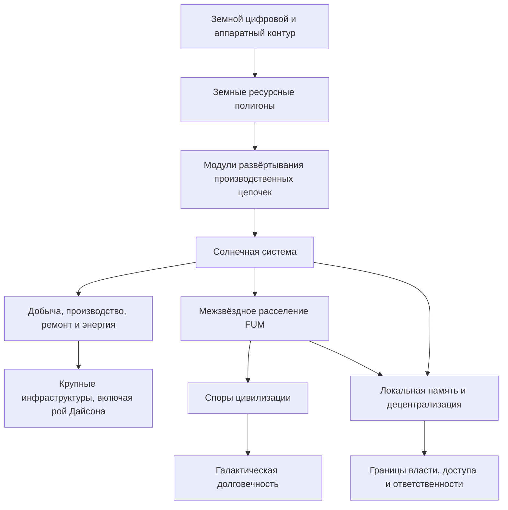

# [Kosmicheskaya avtonomiya FUM](../Glossarij/kosmicheskaya-avtonomiya-FUM.md) i [mezhzvyozdnoye rasseleniye FUM](../Glossarij/mezhzvyozdnoye-rasseleniye-FUM.md)

## Trebovaniye

V daljnem gorizonte razvitiya sistemyi [FUM](../Glossarij/FUM.md) dolzhnyi dostichj urovnya [kosmicheskoj avtonomii FUM](../Glossarij/kosmicheskaya-avtonomiya-FUM.md): sposobnosti proyektirovatj, organizovyivatj, podderzhivatj i uluchshatj [robotizirovannyiye sistemyi FUM](../Glossarij/robotizirovannaya-sistema-FUM.md) i [proizvodstvennyiye cepochki FUM](../Glossarij/proizvodstvennaya-cepochka-FUM.md), dejstvuyusjhiye za predelami Zemli.

Eto trebovaniye ne oznachayet, chto pervaya realizaciya [FUM](../Glossarij/FUM.md) dolzhna obladatj takimi vozmozhnostyami. Ono zadayot sovmestimostj arkhitekturyi, [pamyati](../Glossarij/pamyatj-FUM.md), [narabotok](../Glossarij/narabotka.md), proverok i [urovnej dostupa](../Glossarij/urovenj-dostupa.md) s budusjhimi sistemami, kotoryiye smogut dolgo dejstvovatj v udalyonnoj fizicheskoj srede, obsluzhivatj sobstvennuyu infrastrukturu i rasshiryatj materialjnuyu bazu civilizacii.

## Zemnoj podgotoviteljnyij kontur

Pered osvoyeniyem Solnechnoj sistemyi [FUM](../Glossarij/FUM.md) dolzhen rassmatrivatj [zemnyiye resursnyiye poligonyi FUM](../Glossarij/zemnoj-resursnyij-poligon-FUM.md) kak podgotoviteljnyij sloj kosmicheskoj avtonomii. V etom sloye trudnodostupnyiye regionyi Zemli, vklyuchaya Sibirj, Arktiku, Antarktidu i drugiye udalyonnyiye bezlyudnyiye sredyi, ispoljzuyutsya v dokumentacii kak proverochnyiye analogi budusjhikh vnezemnyikh plosjhadok: udalyonnostj, surovyij klimat, slabaya infrastruktura, ogranichennoye snabzheniye i vyisokaya cena oshibki zastavlyayut zaraneye opisyivatj resursnuyu dobyichu, remont, energetiku, svyazj i lokaljnuyu pamyatj kak odnu nablyudayemuyu sistemu.

Klyuchevoj perenosimyij obyyekt etogo sloya - [modulj razvyortyivaniya proizvodstvennoj cepochki FUM](../Glossarij/modulj-razvyortyivaniya-proizvodstvennoj-cepochki-FUM.md). On dolzhen zadavatj minimaljnyij komplekt sredstv, cherez kotoryij [FUM](../Glossarij/FUM.md) mozhet razvernutj proveryayemuyu cepochku dobyichi, pererabotki, izgotovleniya, remonta i svorachivaniya rabot v zaraneye vyibrannoj tochke. Mnogorazovyiye raketyi mogut rassmatrivatjsya kak daljnij sposob dostavki takikh modulej napryamuyu k neosvoyennyim tochkam, no toljko posle otdeljnoj proverki bezopasnosti, prava, ekologii, otvetstvennosti i nablyudayemosti fizicheskogo dejstviya.

## Solnechnaya sistema kak podgotoviteljnyij kontur

Osvoyeniye Solnechnoj sistemyi rassmatrivayetsya kak sleduyusjhij podgotoviteljnyij etap i trenirovka pered osvoyeniyem drugikh zvyozdnyikh sistem. V etom konture [FUM](../Glossarij/FUM.md) dolzhen umetj opisyivatj i postepenno utochnyatj scenarii, gde avtonomnyiye ili poluavtonomnyiye uzlyi:

- dobyivayut i proizvodyat materialyi na Merkurii dlya stroiteljstva i obsluzhivaniya [roya Dajsona](../Glossarij/roj-Dajsona.md);
- stroyat bazyi i dobyivayut resursyi na ledyanyikh sputnikakh gazovyikh gigantov;
- dobyivayut resursyi na asteroidakh;
- svyazyivayut dobyichu, pererabotku, proizvodstvo, remont, energetiku, transport i svyazj v proveryayemyiye [proizvodstvennyiye cepochki FUM](../Glossarij/proizvodstvennaya-cepochka-FUM.md);
- sokhranyayut proiskhozhdeniye reshenij, fakticheskiye rezuljtatyi, avarii, ogranicheniya primenimosti i novyiye [narabotki](../Glossarij/narabotka.md) kak chastj [pamyati FUM](../Glossarij/pamyatj-FUM.md).

Takiye scenarii dolzhnyi prokhoditj cherez [modeljnuyu sredu](../Glossarij/modeljnaya-sreda.md) i ostavatjsya otdelyonnyimi ot realjnogo [fizicheskogo dejstviya FUM](../Glossarij/fizicheskoye-dejstviye-FUM.md), poka ne opredelenyi pravila bezopasnosti, podtverzhdeniya i otvetstvennosti.

## Mezhzvyozdnyij gorizont

[Mezhzvyozdnoye rasseleniye FUM](../Glossarij/mezhzvyozdnoye-rasseleniye-FUM.md) ponimayetsya kak prodolzheniye kosmicheskoj avtonomii: yesli sistemyi [FUM](../Glossarij/FUM.md) smogut ustojchivo dejstvovatj v Solnechnoj sisteme, sleduyusjhij masshtab proyektirovaniya - perenos zhiznesposobnyikh uzlov, [pamyati](../Glossarij/pamyatj-FUM.md), proizvodstvennyikh konturov i civilizacionnyikh praktik k drugim zvyozdnyim sistemam.

Blizkiye prolyotyi zvyozd, naprimer scenarii sblizheniya s Glize 710, dolzhnyi rassmatrivatjsya ne kak neizmennoye utverzhdeniye dokumentacii, a kak proveryayemyiye astronomicheskiye scenarii. [FUM](../Glossarij/FUM.md) dolzhen khranitj istochnik, datu, modelj neopredelyonnosti i usloviya primenimosti takogo scenariya, chtobyi budusjhiye planyi mogli obnovlyatjsya pri izmenenii dannyikh.

## Galakticheskaya dolgovechnostj

Daljnij civilizacionnyij smyisl etogo trebovaniya sostoit v tom, chtobyi [FUM](../Glossarij/FUM.md) podderzhival ne toljko lokaljnoye samosovershenstvovaniye, no i ustojchivostj civilizacii na ochenj boljshikh vremennyikh i prostranstvennyikh masshtabakh. Postepennoye zaseleniye galaktiki mozhet uvelichitj shans perezhitj sobyitiya urovnya stolknoveniya Mlechnogo Puti i Andromedyi.

Yesli chastj zaselyonnyikh zvyozdnyikh sistem budet vyibroshena iz galaktiki, oni mogut statj perenoschikami [spor civilizacii](../Glossarij/spora-civilizacii.md): minimaljnyikh samopodderzhivayusjhikhsya naborov [pamyati](../Glossarij/pamyatj-FUM.md), proizvodstvennyikh vozmozhnostej, kuljturnyikh i inzhenernyikh praktik, sposobnyikh prodolzhitj liniyu civilizacii v novyikh usloviyakh.

## Skhema masshtabov [kosmicheskoj avtonomii](../Glossarij/kosmicheskaya-avtonomiya-FUM.md)

## Arkhitekturnyiye sledstviya

[Kosmicheskaya avtonomiya FUM](../Glossarij/kosmicheskaya-avtonomiya-FUM.md) trebuyet, chtobyi proyekt [FUM](../Glossarij/FUM.md) zaraneye ne zamyikalsya na lokaljnom kompjyutere, odnoj organizacii ili odnoj planete. V arkhitekture dolzhnyi sokhranyatjsya:

- fraktaljnaya organizaciya uzlov, gde malyiye [apparatnyiye FUM-uzlyi](../Glossarij/apparatnyij-FUM-uzel.md) mogut vkhoditj v krupnyiye infrastrukturnyiye uzlyi;
- perenosimostj [narabotok](../Glossarij/narabotka.md) mezhdu sredami, pokoleniyami oborudovaniya i udalyonnyimi uzlami;
- razlicheniye modeli, simulyacii, proyekta, fizicheskogo ispolneniya, ekspluatacii i posledstviya;
- uchyot zaderzhek svyazi, lokaljnoj neopredelyonnosti, otkazov, remonta, pererabotki i avtonomnogo snabzheniya;
- perenosimyij putj ot zemnyikh trudnodostupnyikh poligonov k vnezemnyim proizvodstvennyim konturam bez poteri proverok, proiskhozhdeniya i ogranichenij primenimosti;
- vozmozhnostj opisyivatj dolgiye [proizvodstvennyiye cepochki FUM](../Glossarij/proizvodstvennaya-cepochka-FUM.md), v kotoryikh odin rezuljtat stanovitsya materialom dlya sleduyusjhego urovnya stroiteljstva;
- yavnyiye pravila dostupa, publikacii, proverki i otvetstvennosti dlya opasnyikh ili strategicheski znachimyikh [narabotok](../Glossarij/narabotka.md).
- [decentralizaciya FUM](../Glossarij/decentralizaciya-FUM.md), chtobyi daljniye avtonomnyiye sistemyi ne prevrasjhalisj v odin centr polnoj vlasti nad udalyonnyimi [poduzlami](../Glossarij/poduzel-FUM.md), apparatnyimi uzlami i proizvodstvennyimi konturami.

## [Decentralizaciya](../Glossarij/decentralizaciya-FUM.md) kosmicheskoj avtonomii

Kosmicheskij masshtab usilivayet trebovaniye k [granicam vlasti](../Glossarij/granica-vlasti-FUM.md). Iz-za zaderzhek svyazi, udalyonnosti resursov i dliteljnosti proizvodstvennyikh ciklov neljzya proyektirovatj [kosmicheskuyu avtonomiyu FUM](../Glossarij/kosmicheskaya-avtonomiya-FUM.md) kak yedinuyu vertikalj, gde odin centraljnyij uzel ili odna nadsistema polnostjyu rasporyazhayetsya vsemi [poduzlami](../Glossarij/poduzel-FUM.md).

Udalyonnyiye [robotizirovannyiye sistemyi FUM](../Glossarij/robotizirovannaya-sistema-FUM.md), proizvodstvennyiye konturyi i lokaljnyiye soobsjhestva uzlov dolzhnyi sokhranyatj lokaljnuyu [pamyatj](../Glossarij/pamyatj-FUM.md), proveryayemyiye polnomochiya, proiskhozhdeniye reshenij i ogranicheniya na avarijnoye vmeshateljstvo. Inache kosmicheskaya avtonomiya stanovitsya ne ustojchivostjyu civilizacii, a riskom yedinogo centra zakhvata ili nekontroliruyemogo rasshireniya.

## Otkryityij vopros

Celevoj masshtab avtonomii zadan, no yego granicyi ne opredelenyi. Trebuyutsya otdeljnyiye resheniya o bezopasnosti, prave na avtonomnoye rasshireniye, dopustimyikh dejstviyakh s vnezemnyimi resursami, proverke astronomicheskikh scenariyev, roli lyudej i kollektivnyikh [FUM-uzlov](../Glossarij/FUM-uzel.md) v podtverzhdenii dejstvij. Eti neopredelyonnosti vyinesenyi v [otkryityij vopros o granicakh kosmicheskoj avtonomii FUM](../Voprosyi/2026-06-22_07-40-59_MSK_granicyi-kosmicheskoj-avtonomii-FUM.md) i svyazanyi s uzhe susjhestvuyusjhim [otkryityim voprosom o granicakh apparatnoj avtonomii FUM](../Voprosyi/2026-06-22_07-28-43_MSK_granicyi-apparatnoj-avtonomii-FUM.md).

Otdeljnaya neopredelyonnostj kasayetsya [granic vlasti](../Glossarij/granica-vlasti-FUM.md): kakiye polnomochiya nadsistema mozhet imetj nad udalyonnyimi [poduzlami](../Glossarij/poduzel-FUM.md), chtobyi sokhranyatj bezopasnostj, no ne poluchatj totaljnuyu vlastj. Ona vyinesena v [otkryityij vopros o granicakh vlasti uzlov FUM](../Voprosyi/2026-06-22_07-51-48_MSK_granicyi-vlasti-uzlov-FUM.md).

Zemnoj podgotoviteljnyij kontur dobavlyayet sobstvennuyu neopredelyonnostj: kak vyibiratj trudnodostupnyiye poligonyi, kogda dobyicha resursov dopustima toljko kak modelj ili simulyaciya, kto podtverzhdayet dostavku modulej i kakiye pravila zasjhisjhayut lyudej, lokaljnyiye soobsjhestva, sredu i pravovoj rezhim territorii. Eta chastj vyinesena v [otkryityij vopros o granicakh zemnyikh resursnyikh poligonov FUM](../Voprosyi/2026-07-02_20-08-37_MSK_granicyi-zemnyikh-resursnyikh-poligonov-FUM.md).

## Istochniki trebovanij

- [iskhodnyij zapros 2026-06-22 07:28:43 MSK](../Zhurnal/2026-06-22_07-28-43_MSK/zapros.md)
- [iskhodnyij zapros 2026-06-22 07:40:59 MSK](../Zhurnal/2026-06-22_07-40-59_MSK/zapros.md)
- [iskhodnyij zapros 2026-06-22 07:51:48 MSK](../Zhurnal/2026-06-22_07-51-48_MSK/zapros.md)
- [iskhodnyij zapros 2026-06-23 19:06:56 MSK](../Zhurnal/2026-06-23_19-06-56_MSK/zapros.md)
- [iskhodnyij zapros 2026-07-02 20:08:37 MSK](../Zhurnal/2026-07-02_20-08-37_MSK/zapros.md)

<!-- FUM-MD-RECENCY:BEGIN -->
<!-- last-content-edit: 2026-08-03 14:54:04 MSK -->
<!-- content-sha256: sha256:3a466b47357ec21c4267e35d4d6dfc29dc5aa592c524f15c3e32067616b1499e -->
<!-- FUM-MD-RECENCY:END -->
