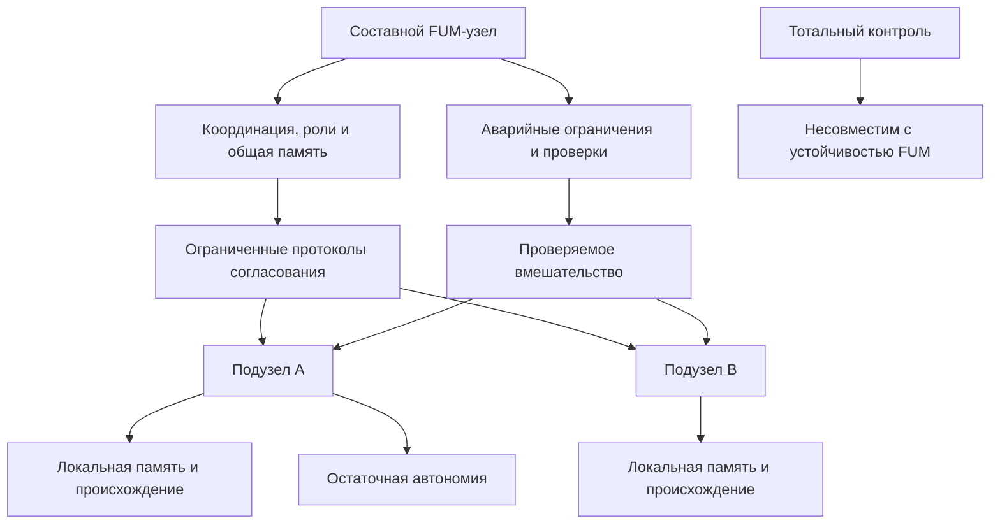

# [Decentralizaciya FUM](../Glossarij/decentralizaciya-FUM.md) i [granicyi vlasti](../Glossarij/granica-vlasti-FUM.md)

## Trebovaniye

Osnova bezopasnosti i dolgosrochnoj ustojchivosti [FUM](../Glossarij/FUM.md) - [decentralizaciya FUM](../Glossarij/decentralizaciya-FUM.md). Ni odin [FUM-uzel](../Glossarij/FUM-uzel.md) ne dolzhen obladatj vsej polnotoj vlasti nad setjyu, a sostavnaya sistema uzlov ne dolzhna obladatj totaljnoj vlastjyu nad svoimi [poduzlami](../Glossarij/poduzel-FUM.md).

Eto trebovaniye ne otmenyayet koordinaciyu, roli, obsjhuyu [pamyatj](../Glossarij/pamyatj-FUM.md), [urovni dostupa](../Glossarij/urovenj-dostupa.md) i pravila podtverzhdeniya dejstvij. Ono zadayot verkhnyuyu granicu: upravleniye, bezopasnostj i soglasovaniye ne dolzhnyi prevrasjhatjsya v absolyutnoye pravo odnogo urovnya polnostjyu chitatj, izmenyatj, podchinyatj, stiratj ili prisvaivatj vnutrennyuyu oblastj drugogo urovnya.

## Chto schitayetsya vlastjyu

Vlastj uzla nad drugim uzlom ili [poduzlom](../Glossarij/poduzel-FUM.md) vklyuchayet ne toljko formaljnoye pravo otdavatj komandyi. V arkhitekture [FUM](../Glossarij/FUM.md) k nej otnosyatsya vozmozhnosti:

- chitatj ili raskryivatj vnutrenniye sostoyaniya i privatnyiye chasti [pamyati](../Glossarij/pamyatj-FUM.md);
- izmenyatj celi, pravila, svyazi, [narabotki](../Glossarij/narabotka.md) i istoriyu reshenij;
- prinuzhdatj k dejstviyu ili zapresjhatj dejstviye bez soglasovannogo osnovaniya;
- ogranichivatj kommunikaciyu, obmen [narabotkami](../Glossarij/narabotka.md), vyikhod iz sostavnogo uzla ili obrasjheniye k drugim uzlam;
- udalyatj, poglosjhatj, pereimenovyivatj ili predstavlyatj uzel vovne bez sokhraneniya proiskhozhdeniya i podtverzhdeniya;
- rasporyazhatjsya fizicheskimi resursami, yesli uzel svyazan s [fizicheskim dejstviyem FUM](../Glossarij/fizicheskoye-dejstviye-FUM.md).

Vsya polnota vlasti poyavlyayetsya tam, gde odin subyyekt ili odin urovenj odnovremenno kontroliruyet dostup, pamyatj, dejstviya, identichnostj, resursyi i pravila proverki bez vneshnikh ogranichenij i bez ostatochnoj avtonomii podchinennogo uzla. Takaya forma vlasti nesovmestima s dolgosrochnoj ustojchivostjyu [FUM](../Glossarij/FUM.md).

## Koordinaciya bez totaljnogo kontrolya

Sostavnoj [FUM-uzel](../Glossarij/FUM-uzel.md) mozhet koordinirovatj [poduzlyi](../Glossarij/poduzel-FUM.md): raspredelyatj roli, vesti obsjhuyu [pamyatj](../Glossarij/pamyatj-FUM.md), soglasovyivatj dejstviya, ogranichivatj dostup k opasnyim [narabotkam](../Glossarij/narabotka.md) i izolirovatj povedeniye, sozdayusjheye risk. No takaya koordinaciya dolzhna byitj ogranichennoj, proveryayemoj i obratimoj nastoljko, naskoljko eto sovmestimo s bezopasnostjyu.

Minimaljnyij princip sostoit v tom, chto [poduzel FUM](../Glossarij/poduzel-FUM.md) sokhranyayet razlichimuyu vnutrennyuyu oblastj: sobstvennuyu istoriyu, lokaljnuyu [pamyatj](../Glossarij/pamyatj-FUM.md), granicyi dostupa, vozmozhnostj byitj istochnikom resheniya i vozmozhnostj otlichatjsya ot modeli, kotoruyu o nyom stroit nadsistema.

Analogiya s chelovecheskim [soznaniyem](../Glossarij/soznaniye.md) zadayot masshtab etogo ogranicheniya. [Soznaniye](../Glossarij/soznaniye.md) koordiniruyet organizm kak emerdzhentnyij urovenj sovmestnogo znaniya, no ne obladayet polnoj pryamoj vlastjyu nad kazhdoj kletkoj. Tak zhe i krupnyij [FUM-uzel](../Glossarij/FUM-uzel.md) dolzhen byitj ne absolyutnyim vladeljcem kazhdogo [poduzla](../Glossarij/poduzel-FUM.md), a urovnem soglasovaniya, kotoryij voznikayet iz seti uchastnikov i ogranichen ikh sokhranyonnyimi granicami.

## Skhema koordinacii bez totaljnoj vlasti

## Konflikt avtonomii i ustojchivosti

Konflikt mezhdu avtonomiyej [poduzla](../Glossarij/poduzel-FUM.md) i ustojchivostjyu sostavnogo [FUM-uzla](../Glossarij/FUM-uzel.md) v obsjhem sluchaye razreshayetsya cherez [obobsjhyonnyij darvinovskij algoritm](../Glossarij/obobsjhyonnyij-darvinovskij-algoritm.md). Sistema ne obyazana zaraneye vyibiratj odin vechnyij balans avtonomii i koordinacii: dopustimyi raznyiye variantyi pravil, protokolov, rolej i ogranichenij, yesli oni imeyut proiskhozhdeniye, oblastj dejstviya i vozmozhnostj proverki.

Zhiznesposobnyiye variantyi sokhranyayut ustojchivostj sostavnogo uzla bez prevrasjheniya koordinacii v totaljnuyu vlastj nad [poduzlom](../Glossarij/poduzel-FUM.md). Nezhiznesposobnyiye variantyi ne zakreplyayutsya: oni mogut byitj otvergnutyi, ogranichenyi, peresobranyi ili ostavlenyi kak neudachnyij opyit v [pamyati FUM](../Glossarij/pamyatj-FUM.md). V etoj formulirovke otbor otnositsya prezhde vsego k variantam organizacii i povedeniya, a ne k pravu sostavnogo uzla stiratj, poglosjhatj ili prisvaivatj sam [poduzel](../Glossarij/poduzel-FUM.md).

Yesli konkretnyiye kriterii proverki i protokolyi bezopasnosti ne zadanyi gotovyim [soznateljnyim](../Glossarij/soznaniye.md) agentom, oni tozhe stanovyatsya predmetom otbora. [FUM](../Glossarij/FUM.md) dolzhen umetj rassmatrivatj raznyiye variantyi ogranichenij, kvorumov, podtverzhdenij, avarijnyikh ostanovok i uslovij dostupa kak proveryayemyiye [narabotki](../Glossarij/narabotka.md), no takoj otbor ne dolzhen sam stanovitjsya opravdaniyem dlya nekontroliruyemogo rasshireniya vlasti nad [poduzlami](../Glossarij/poduzel-FUM.md).

## Arkhitekturnyiye sledstviya

[Decentralizaciya FUM](../Glossarij/decentralizaciya-FUM.md) trebuyet, chtobyi v arkhitekture ne byilo yedinstvennogo kornevogo vladeljca vsej [pamyati](../Glossarij/pamyatj-FUM.md), vsekh klyuchej dostupa, vsekh pravil dejstviya i vsekh sredstv ispravleniya. Dazhe yesli otdeljnyij kontur vremenno poluchayet rasshirennyiye prava dlya bezopasnosti, eti prava dolzhnyi imetj proiskhozhdeniye, srok, oblastj dejstviya, usloviya proverki i mekhanizm otzyiva.

Dlya etogo [FUM](../Glossarij/FUM.md) dolzhen podderzhivatj:

- razdeleniye prav chteniya, izmeneniya, publikacii, fizicheskogo dejstviya i daljnejshej peredachi;
- lokaljnyiye oblasti [pamyati](../Glossarij/pamyatj-FUM.md), kotoryiye ne stanovyatsya avtomaticheski obsjhej sobstvennostjyu sostavnogo uzla;
- protokolyi soglasovaniya mezhdu uzlami vmesto neogranichennogo komandnogo centra;
- sokhraneniye proiskhozhdeniya reshenij na urovne cheloveka, agenta, [gibridnogo uzla](../Glossarij/gibridnyij-uzel.md), komandyi i boleye krupnoj sistemyi;
- proveryayemyiye ogranicheniya dlya avarijnogo vmeshateljstva, izolyacii opasnogo povedeniya i ostanovki neobratimyikh dejstvij;
- vozmozhnostj perenositj [narabotki](../Glossarij/narabotka.md) mezhdu uzlami bez poglosjheniya lichnosti, pamyati ili vsekh prav uzla-istochnika.

## Svyazj s dolgosrochnoj ustojchivostjyu

Centralizaciya polnoj vlasti sozdayot yedinyiye tochki zakhvata, oshibki i degradacii. Yesli odin uzel ili odin urovenj mozhet bez ogranichenij menyatj ostaljnyiye, sboj etogo urovnya stanovitsya sistemnyim riskom: on sposoben iskazitj [pamyatj FUM](../Glossarij/pamyatj-FUM.md), podavitj aljternativnyiye proverki, prisvoitj chuzhiye [narabotki](../Glossarij/narabotka.md) ili prevratitj koordinaciyu v prinuzhdeniye.

Decentralizovannaya setj, naoborot, sokhranyayet mnozhestvennostj istochnikov pamyati, proverki i dejstviya. Eto osobenno vazhno dlya [gibridnyikh uzlov](../Glossarij/gibridnyij-uzel.md), kollektivnyikh [FUM-uzlov](../Glossarij/FUM-uzel.md), [fizicheskogo dejstviya FUM](../Glossarij/fizicheskoye-dejstviye-FUM.md) i [kosmicheskoj avtonomii FUM](../Glossarij/kosmicheskaya-avtonomiya-FUM.md), gde posledstviya oshibok mogut byitj dolgimi, raspredelyonnyimi i chastichno neobratimyimi.

## Raspredelyonnoye zabyivaniye proizvodnyikh struktur

V seti mashin FUM avtomaticheski vyivedennyiye indeksyi, svyazi, gipotezyi, operatoryi i lokaljnyiye modeli mogut rasti byistreye, chem otdeljnyij uzel sposoben khranitj, peredavatj i soglasovyivatj. [Upravlyayemoye zabyivaniye FUM](../Glossarij/upravlyayemoye-zabyivaniye-FUM.md) pozvolyayet uzlu oslablyatj i perestraivatj takiye proizvodnyiye strukturyi, sokhranyaya ikh proiskhozhdeniye i yavnuyu vozmozhnostj libo nevozmozhnostj [vspominaniya FUM](../Glossarij/vspominaniye-FUM.md).

Raspredelyonnaya poleznostj zabyivaniya ne sozdayot centralizovannogo prava stiratj pamyatj seti. Sostavnoj uzel ne vprave odnostoronne udalyatj pervichnuyu sensornuyu informaciyu drugogo uzla, podmenyatj yego lokaljnuyu politiku khraneniya ili trebovatj rasprostraneniya privatnogo iskhodnogo materiala po vsem replikam. Udaleniye vozmozhno toljko po polnomochnomu sobyitiyu v obyyavlennoj kontroliruyemoj oblasti. Peredavatjsya mogut razreshyonnyiye proizvodnyiye formyi i dokazateljstva proiskhozhdeniya; iskhodnyiye zapisi ostayutsya pod vlastjyu uzla-istochnika i yego pravil dostupa. Poetomu bezvozvratnostj vsegda ukazyivayet oblastj vosstanovleniya, a lokaljnoye udaleniye ne vyidayotsya za udaleniye avtonomnyikh kopij. Yesli setevoj kontrakt rasprostranyayet polnomochnyij zapros udaleniya, on perechislyayet okhvachennyiye repliki i soderzhateljnyiye proizvodnyiye, podtverzhdeniya uzlov i nedokazannyij ostatok.

Dlya lichnogo FUM na odnoj mashine balans inoj: yesli sensornaya informaciya razreshena imenno k dolgovremennomu khraneniyu primenimyimi polnomochiyami i soglasiyami subyyektov dannyikh i yeyo khvatayet byudzheta khranitj, predpochtiteljno sokhranyatj pervichnyij material, a zabyivaniye primenyatj k perestraivayemyim proizvodnyim strukturam. Vyikhod iskhodnoj zapisi iz aktivnogo konteksta ne raven yeyo unichtozheniyu. Ischerpaniye byudzheta snachala vedyot k udaleniyu perestraivayemyikh proizvodnyikh, ogranicheniyu novogo sbora i zaprosu polnomochnogo resheniya, a ne k avtomaticheskomu unichtozheniyu prinyatogo pervichnogo materiala.

## Otkryityij vopros

Princip zapreta totaljnoj vlasti i [obobsjhyonnyij darvinovskij algoritm](../Glossarij/obobsjhyonnyij-darvinovskij-algoritm.md) kak obsjhij sposob razresheniya konflikta avtonomii s ustojchivostjyu zadanyi, no prakticheskaya granica vsyo yesjhyo trebuyet otdeljnoj prorabotki: kakiye polnomochiya dopustimyi dlya bezopasnosti, kakiye trebuyut podtverzhdeniya [poduzla](../Glossarij/poduzel-FUM.md), kak ustroyenyi avarijnyiye ogranicheniya, kto proveryayet ikh proporcionaljnostj i po kakim kriteriyam opredelyayetsya zhiznesposobnostj variantov. Eta neopredelyonnostj vyinesena v [otkryityij vopros o granicakh vlasti uzlov FUM](../Voprosyi/2026-06-22_07-51-48_MSK_granicyi-vlasti-uzlov-FUM.md).

## Istochniki trebovanij

- [iskhodnyij zapros 2026-07-31 12:25:42 MSK - Utochnitj sokhraneniye vkhodnoj sensornoj informacii](../Zhurnal/2026-07-31_12-25-42_MSK_utochnitj-sokhraneniye-vkhodnoj-sensornoj-informacii/zapros.md)
- [iskhodnyij zapros 2026-06-22 07:51:48 MSK](../Zhurnal/2026-06-22_07-51-48_MSK/zapros.md)
- [iskhodnyij zapros 2026-06-22 08:00:15 MSK](../Zhurnal/2026-06-22_08-00-15_MSK/zapros.md)
- [iskhodnyij zapros 2026-06-22 08:14:25 MSK](../Zhurnal/2026-06-22_08-14-25_MSK/zapros.md)
- [iskhodnyij zapros 2026-06-22 08:43:27 MSK](../Zhurnal/2026-06-22_08-43-27_MSK/zapros.md)
- [iskhodnyij zapros 2026-06-23 19:06:56 MSK](../Zhurnal/2026-06-23_19-06-56_MSK/zapros.md)

<!-- FUM-MD-RECENCY:BEGIN -->
<!-- last-content-edit: 2026-08-03 14:54:04 MSK -->
<!-- content-sha256: sha256:4bfe542d58cf07c23133f085fe8f6818f379331bf4f3c60084068e67c3cd2523 -->
<!-- FUM-MD-RECENCY:END -->
