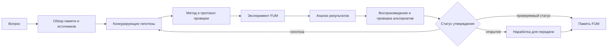

# [Nauchnyiye issledovaniya FUM](../Glossarij/nauchnoye-issledovaniye-FUM.md) i [otkryitiya](../Glossarij/otkryitiye-FUM.md)

## Trebovaniye

[FUM](../Glossarij/FUM.md) dolzhen byitj sposoben vyipolnyatj ne toljko inzhenernuyu rabotu, no i polnocennyiye [nauchnyiye issledovaniya FUM](../Glossarij/nauchnoye-issledovaniye-FUM.md): formulirovatj voprosyi, stroitj gipotezyi, podbiratj metodyi proverki, stavitj [eksperimentyi FUM](../Glossarij/eksperiment-FUM.md), analizirovatj rezuljtatyi i oformlyatj [otkryitiya FUM](../Glossarij/otkryitiye-FUM.md) kak proveryayemuyu chastj [pamyati](../Glossarij/pamyatj-FUM.md).

Eto trebovaniye rasshiryayet obraz agenta polnogo cikla. [FUM](../Glossarij/FUM.md) dolzhen ne toljko prinimatj izvestnyiye trebovaniya i prevrasjhatj ikh v kod, apparatnyij proyekt ili workflow. On dolzhen umetj rabotatj s neizvestnyim: zamechatj probel znaniya, porozhdatj obyyasneniya, otdelyatj gipotezu ot fakta, poluchatj novyiye dannyiye i menyatj sobstvennuyu modelj mira, yesli proverka pokazala boleye siljnoye obyyasneniye.

## Issledovateljskij cikl

[Nauchnoye issledovaniye FUM](../Glossarij/nauchnoye-issledovaniye-FUM.md) yavlyayetsya specializirovannoj formoj [agentskogo cikla](../Glossarij/agentskij-cikl.md). V minimaljnom vide ono vklyuchayet:

- postanovku issledovateljskogo voprosa i oblastj primenimosti;
- obzor uzhe imeyusjhejsya [pamyati FUM](../Glossarij/pamyatj-FUM.md), vneshnikh istochnikov i chuzhikh [narabotok](../Glossarij/narabotka.md);
- formulirovaniye gipotezyi ili nabora konkuriruyusjhikh gipotez;
- vyibor metoda proverki: raschyot, modelirovaniye, nablyudeniye, programmnyij test, fizicheskij opyit ili drugoj [eksperiment FUM](../Glossarij/eksperiment-FUM.md);
- fiksaciyu protokola, vkhodnyikh dannyikh, uslovij, instrumentov i ogranichenij;
- polucheniye i analiz rezuljtatov s ukazaniyem neopredelyonnosti;
- popyitku vosproizvedeniya, sravneniye s aljternativnyimi obyyasneniyami i poisk oshibok;
- oformleniye rezuljtata kak podtverzhdyonnoj, oprovergnutoj ili ozhidayusjhej proverki [narabotki](../Glossarij/narabotka.md).

Takoj cikl dolzhen ostavlyatj trassu v [pamyati FUM](../Glossarij/pamyatj-FUM.md): otkuda vzyat vopros, kakiye dannyiye ispoljzovalisj, kakiye predpolozheniya byili sdelanyi, kakiye dejstviya vyipolnenyi i pochemu rezuljtat poluchil imenno takoj proverochnyij status.

## Skhema issledovateljskogo cikla

## Kriterii proverki i bezopasnostj

Kriterii proverki, protokolyi bezopasnosti, trebovaniya k vosproizvedeniyu i kriterii ostanovki yavlyayutsya ne vneshnej administrativnoj dobavkoj k [nauchnomu issledovaniyu FUM](../Glossarij/nauchnoye-issledovaniye-FUM.md), a chastjyu samoj issledovateljskoj [pamyati](../Glossarij/pamyatj-FUM.md). Yesli oni ne zadanyi gotovyim [soznateljnyim](../Glossarij/soznaniye.md) agentom, oni dolzhnyi formirovatjsya kak variantyi [narabotok](../Glossarij/narabotka.md), prokhodyasjhiye [obobsjhyonnyij darvinovskij algoritm](../Glossarij/obobsjhyonnyij-darvinovskij-algoritm.md): variant protokola sozdayotsya, primenyayetsya v ogranichennoj srede, proveryayetsya na otkazakh, sravnivayetsya s aljternativami i libo zakreplyayetsya, libo peresmatrivayetsya.

Na lokaljnom urovne eto oznachayet otbor sposobov prodolzhatj myislj, vyibiratj gipotezu, ostanavlivatjsya pri nedostatke dannyikh i razlichatj modelj ot fakta. Na urovne masshtabnoj issledovateljskoj deyateljnosti tem zhe principom otbirayutsya metodyi proverki, trebovaniya k nezavisimomu vosproizvedeniyu, protokolyi publikacii, ogranicheniya dostupa i zasjhitnyiye proverki pered perekhodom k boleye riskovannyim dejstviyam.

Etot princip ne oznachayet, chto bezopasnostj mozhno iskatj cherez nekontroliruyemyij risk vo vneshnem mire. Poka prakticheskiye granicyi issledovateljskoj avtonomii ne opredelenyi, evolyuciya protokolov bezopasnosti dolzhna nachinatjsya v tekste, kode, [modeljnyikh sredakh](../Glossarij/modeljnaya-sreda.md), nezavisimyikh proverkakh i yavno zadannyikh [urovnyakh dostupa](../Glossarij/urovenj-dostupa.md). [Eksperimentyi FUM](../Glossarij/eksperiment-FUM.md), svyazannyiye s fizicheskim, socialjnyim, publikacionnyim ili inyim neobratimyim riskom, ostayutsya svyazannyimi s [otkryityim voprosom o granicakh issledovateljskoj avtonomii FUM](../Voprosyi/2026-06-22_08-04-45_MSK_granicyi-issledovateljskoj-avtonomii-FUM.md).

## [Eksperiment FUM](../Glossarij/eksperiment-FUM.md)

[Eksperiment FUM](../Glossarij/eksperiment-FUM.md) - eto upravlyayemoye dejstviye ili seriya dejstvij, prednaznachennyiye dlya proverki gipotezyi. On mozhet proiskhoditj v raznyikh sredakh:

- v tekste, dannyikh i kode: vyichisliteljnyij eksperiment, test, simulyaciya, statisticheskaya proverka;
- v [modeljnoj srede](../Glossarij/modeljnaya-sreda.md): proverka scenariyev s [vnutrennimi FUM](../Glossarij/vnutrennij-FUM.md), rekonstrukciya proshlogo ili prognoz vozmozhnogo budusjhego;
- vo vneshnikh cifrovyikh sistemakh: zaprosyi k datasetam, API, repozitoriyam, zhurnalam nablyudenij i nauchnyim bazam;
- na fizicheskom urovne: izmereniye, prototipirovaniye, robotizirovannoye dejstviye, laboratornoye ispyitaniye ili drugoj perekhod k [fizicheskomu dejstviyu FUM](../Glossarij/fizicheskoye-dejstviye-FUM.md).

[FUM](../Glossarij/FUM.md) dolzhen razlichatj modeljnyij eksperiment, nablyudeniye vneshnego mira i realjnoye vmeshateljstvo. Rezuljtatyi simulyacii ne dolzhnyi avtomaticheski schitatjsya svojstvami vneshnego mira, a fizicheskij opyit ne dolzhen zapuskatjsya kak prostoye prodolzheniye rassuzhdeniya bez otdeljnoj proverki granic, riskov i podtverzhdenij.

## Prakticheskaya kartochka eksperimenta

V tekusjhem [dokumentacionnom prototipe FUM](../Glossarij/dokumentacionnyij-prototip-FUM.md) eksperiment oformlyayetsya po [shablonu kartochki eksperimenta FUM](../Planirovaniye/shablon-kartochki-eksperimenta-FUM.md). Odna kartochka khranit odnu versiyu protokola odnoj proveryayemoj gipotezyi, zaraneye zadannyiye kriterii i otdeljnyiye zapisi fakticheskikh zapuskov. Planovyiye polya ne perepisyivayutsya pod rezuljtat, poetomu otkloneniye, otricateljnyij iskhod i neodnoznachnostj ostayutsya chastjyu proiskhozhdeniya.

Shablon razdeljno fiksiruyet sostoyaniye vyipolneniya, iskhod proverki gipotezyi i issledovateljskij status utverzhdeniya. Lokaljno zavershyonnyij progon mozhet podderzhatj gipotezu v zadannoj granice, no ne stanovitsya nezavisimyim vosproizvedeniyem ili otkryitiyem toljko iz-za uspeshnogo koda vyikhoda. Kartochka takzhe zakryivayet perekhod k seti, publikacionnomu, socialjnomu ili fizicheskomu dejstviyu do otdeljnogo trebovaniya, razresheniya i proverki riska.

## Statusyi issledovateljskogo utverzhdeniya

Razlichiye mezhdu [gipotezoj FUM](../Glossarij/gipoteza-FUM.md), [siljnyim predpolozheniyem FUM](../Glossarij/siljnoye-predpolozheniye-FUM.md), [vosproizvedyonnyim rezuljtatom FUM](../Glossarij/vosproizvedyonnyij-rezuljtat-FUM.md) i [otkryitiyem FUM](../Glossarij/otkryitiye-FUM.md) prokhodit cherez proverku i vosproizvedeniye rezuljtatov drugimi [FUM-uzlami](../Glossarij/FUM-uzel.md).

- [Gipoteza FUM](../Glossarij/gipoteza-FUM.md) - proveryayemoye predpolozheniye o svyazi, prichine, mekhanizme, ogranichenii ili ozhidayemom rezuljtate. Ona mozhet byitj poleznoj, no yesjhyo ne schitayetsya podtverzhdyonnyim znaniyem.
- [Siljnoye predpolozheniye FUM](../Glossarij/siljnoye-predpolozheniye-FUM.md) - gipoteza, kotoraya uzhe imeyet zametnyiye osnovaniya: soglasuyetsya s dostupnoj [pamyatjyu](../Glossarij/pamyatj-FUM.md), vyiderzhala pervichnyiye proverki, povtornyiye progonyi ili analiz odnim uzlom, no yesjhyo ne vosproizvedena nezavisimyimi uzlami.
- [Vosproizvedyonnyij rezuljtat FUM](../Glossarij/vosproizvedyonnyij-rezuljtat-FUM.md) - rezuljtat, kotoryij poluchil iskhodnyij uzel i zatem podtverdil khotya byi odin drugoj [FUM-uzel](../Glossarij/FUM-uzel.md) cherez povtoreniye protokola, nezavisimuyu proverku dannyikh ili ekvivalentnyij eksperiment v sopostavimyikh usloviyakh.
- [Otkryitiye FUM](../Glossarij/otkryitiye-FUM.md) - vosproizvedyonnyij rezuljtat, kotoryij takzhe yavlyayetsya novyim dlya dostupnoj [pamyati FUM](../Glossarij/pamyatj-FUM.md), vyiderzhal proverku protiv aljternativnyikh obyyasnenij, imeyet ukazannuyu oblastj primenimosti i mozhet byitj sokhranyon kak perenosimaya [narabotka](../Glossarij/narabotka.md).

Povyisheniye statusa trebuyet sokhranyonnoj trassyi proverki: kto vyidvinul utverzhdeniye, kakiye dannyiye i metodyi ispoljzovalisj, kakiye uzlyi vosproizvodili rezuljtat, kakiye raskhozhdeniya voznikli i pochemu itogovyij status schitayetsya obosnovannyim. Yesli posleduyusjhiye proverki ne vosproizvodyat rezuljtat, [FUM](../Glossarij/FUM.md) dolzhen ponizitj status utverzhdeniya ili vernutj yego v oblastj otkryityikh gipotez.

## [Otkryitiye FUM](../Glossarij/otkryitiye-FUM.md)

[Otkryitiye FUM](../Glossarij/otkryitiye-FUM.md) ne yavlyayetsya krasivoj formulirovkoj ili uverennyim otvetom modeli. V kontekste proyekta otkryitiyem schitayetsya novoye ustojchivoye znaniye, svyazj, zakonomernostj, ogranicheniye, metod ili vosproizvodimyij rezuljtat, kotoryij:

- raneye ne byil predstavlen v dostupnoj [pamyati](../Glossarij/pamyatj-FUM.md) kak podtverzhdyonnoye znaniye;
- imeyet ukazannyiye istochniki, metod polucheniya i oblastj primenimosti;
- vyiderzhal proverku protiv aljternativnyikh obyyasnenij i izvestnyikh oshibok, vklyuchaya vosproizvedeniye drugimi [FUM-uzlami](../Glossarij/FUM-uzel.md);
- soderzhit urovenj uverennosti, ogranicheniya i usloviya vosproizvedeniya;
- mozhet byitj sokhranyon kak [narabotka](../Glossarij/narabotka.md) i, yesli [urovenj dostupa](../Glossarij/urovenj-dostupa.md) pozvolyayet, peredan drugim [FUM-uzlam](../Glossarij/FUM-uzel.md).

Takoye opredeleniye zasjhisjhayet [FUM](../Glossarij/FUM.md) ot smesheniya generacii teksta s nauchnyim rezuljtatom. Utverzhdeniye mozhet byitj gipotezoj, dogadkoj, interpretaciyej, oshibkoj ili otkryitiyem toljko posle togo, kak yego proiskhozhdeniye i proverochnyij status stali chastjyu [pamyati FUM](../Glossarij/pamyatj-FUM.md).

## Svyazj s inzhenernoj rabotoj

Inzheneriya i issledovaniye v [FUM](../Glossarij/FUM.md) dolzhnyi usilivatj drug druga. Inzhenernaya rabota sozdayot instrumentyi, modeli, sredyi, datchiki, testyi i proizvodstvennyiye konturyi, kotoryiye delayut issledovaniye vozmozhnyim. [Nauchnyiye issledovaniya FUM](../Glossarij/nauchnoye-issledovaniye-FUM.md) vozvrasjhayut novyiye zakonomernosti, ogranicheniya i metodyi, kotoryiye uluchshayut arkhitekturu, [moduli](../Glossarij/modulj-FUM.md), [agentskiye ciklyi](../Glossarij/agentskij-cikl.md), [robotizirovannyiye sistemyi FUM](../Glossarij/robotizirovannaya-sistema-FUM.md) i [proizvodstvennyiye cepochki FUM](../Glossarij/proizvodstvennaya-cepochka-FUM.md).

Poetomu issledovateljskij rezuljtat dolzhen oformlyatjsya ne kak otdeljnyij otchyot vne sistemyi, a kak proveryayemaya [narabotka](../Glossarij/narabotka.md): s voprosom, gipotezoj, protokolom, dannyimi, vyivodom, statusom proverki, ogranicheniyami primeneniya i svyazjyu s posleduyusjhimi inzhenernyimi resheniyami.

## Svyazj s evolyucionnyim myishleniyem

Yesli myishleniye [FUM](../Glossarij/FUM.md) ponimayetsya kak evolyucionnyij process, to [nauchnoye issledovaniye FUM](../Glossarij/nauchnoye-issledovaniye-FUM.md) yavlyayetsya yavnoj formoj etogo processa. Gipotezyi porozhdayut variantyi, [eksperimentyi](../Glossarij/eksperiment-FUM.md) sozdayut otbor, a podtverzhdyonnyiye rezuljtatyi stanovyatsya nasleduyemyimi elementami [pamyati](../Glossarij/pamyatj-FUM.md).

Eto delayet [obobsjhyonnyij poisk povtoryayusjhikhsya posledovateljnostej](../Glossarij/obobsjhyonnyij-poisk-povtoryayusjhikhsya-posledovateljnostej.md) vazhnyim issledovateljskim mekhanizmom: [FUM](../Glossarij/FUM.md) mozhet iskatj povtoryayemostj ne toljko v dejstviyakh agenta, no i v dannyikh, nablyudeniyakh, oshibkakh, modelyakh i rezuljtatakh eksperimentov.

## Otkryityij vopros

Trebovaniye k issledovateljskoj sposobnosti zadano, no prakticheskiye granicyi avtonomii poka ne opredelenyi. Nuzhno utochnitj, kakiye [eksperimentyi FUM](../Glossarij/eksperiment-FUM.md) agent mozhet stavitj samostoyateljno, kakiye trebuyut podtverzhdeniya cheloveka ili drugogo [FUM-uzla](../Glossarij/FUM-uzel.md), kak obyyavlyatj [otkryitiya FUM](../Glossarij/otkryitiye-FUM.md), kak uchityivatj etiku, bezopasnostj, publikaciyu i [urovni dostupa](../Glossarij/urovenj-dostupa.md). Eta neopredelyonnostj vyinesena v [otkryityij vopros o granicakh issledovateljskoj avtonomii FUM](../Voprosyi/2026-06-22_08-04-45_MSK_granicyi-issledovateljskoj-avtonomii-FUM.md).

## Istochniki trebovanij

- [iskhodnyij zapros 2026-07-23 16:11:30 MSK — Opisatj shablon kartochki eksperimenta FUM](../Zhurnal/2026-07-23_16-11-30_MSK_opisatj-shablon-kartochki-eksperimenta-FUM/zapros.md)
- [iskhodnyij zapros 2026-06-22 08:04:45 MSK](../Zhurnal/2026-06-22_08-04-45_MSK/zapros.md)
- [iskhodnyij zapros 2026-06-22 08:22:06 MSK](../Zhurnal/2026-06-22_08-22-06_MSK/zapros.md)
- [iskhodnyij zapros 2026-06-22 08:43:27 MSK](../Zhurnal/2026-06-22_08-43-27_MSK/zapros.md)
- [iskhodnyij zapros 2026-06-23 19:06:56 MSK](../Zhurnal/2026-06-23_19-06-56_MSK/zapros.md)

<!-- FUM-MD-RECENCY:BEGIN -->
<!-- last-content-edit: 2026-08-03 14:54:04 MSK -->
<!-- content-sha256: sha256:51ca0d48120bf95d180d93cddd9ed551c83d118ad39501d0fab1f257141f130a -->
<!-- FUM-MD-RECENCY:END -->
