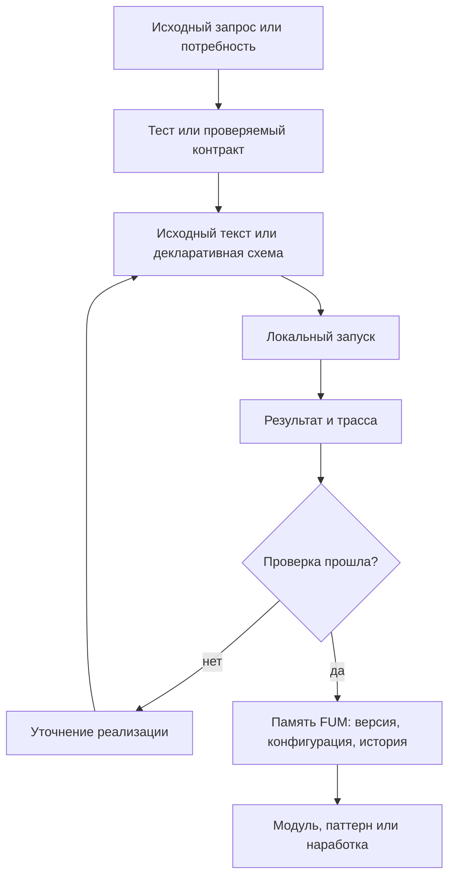

# Vosproizvodimyiye [avtomatizacii FUM](../Glossarij/avtomatizaciya-FUM.md)

## Trebovaniye

Ustojchivyiye avtomaticheskiye algoritmicheskiye strukturyi [FUM](../Glossarij/FUM.md) dolzhnyi byitj predskazuyemyimi i vosproizvodimyimi. Eto otnositsya k [avtomatizaciyam FUM](../Glossarij/avtomatizaciya-FUM.md), [avtomaticheskim organam vospriyatiya FUM](../Glossarij/avtomaticheskij-organ-vospriyatiya-FUM.md), [avtomaticheskim organam dejstviya FUM](../Glossarij/avtomaticheskij-organ-dejstviya-FUM.md), [ustrojstvam vospriyatiya i dejstviya FUM](../Glossarij/ustrojstvo-vospriyatiya-i-dejstviya-FUM.md), workflow, proverkam, preobrazovaniyam [pamyati](../Glossarij/pamyatj-FUM.md), interfejsnyim mekhanizmam i vizualizacii na displeye.

[Avtomatizaciya FUM](../Glossarij/avtomatizaciya-FUM.md) ne dolzhna susjhestvovatj toljko kak neyavnoye povedeniye zapusjhennoj sistemyi. Yesli struktura stanovitsya ustojchivoj chastjyu rabotyi [FUM](../Glossarij/FUM.md), yeyo iskhodnyiye tekstyi, konfiguracii, skhemyi dannyikh, versii i istoriya izmenenij dolzhnyi byitj chastjyu [pamyati FUM](../Glossarij/pamyatj-FUM.md).

## Granica ponyatiya

K [avtomatizaciyam FUM](../Glossarij/avtomatizaciya-FUM.md) otnosyatsya lyubyiye zakreplyonnyiye algoritmicheskiye strukturyi, kotoryiye:

- prinimayut nablyudeniya, sobyitiya, sostoyaniye [pamyati](../Glossarij/pamyatj-FUM.md) ili komandyi;
- szhimayut shirokij vkhodnoj potok vneshnego sobyitiya do kompaktnogo opisaniya;
- razvorachivayut vyisokourovnevoye opisaniye dejstviya do nizkourovnevyikh dejstvij ispolniteljnyikh mekhanizmov;
- preobrazuyut dannyiye, vyibirayut dejstviya, zapuskayut proverki ili stroyat predstavleniya;
- upravlyayut [agentskim ciklom](../Glossarij/agentskij-cikl.md), workflow, instrumentom, interfejsom ili apparatnyim konturom;
- proizvodyat rezuljtat, kotoryij vliyayet na [vnutrenneye sostoyaniye](../Glossarij/vnutrenneye-sostoyaniye.md), poljzovateljskuyu poverkhnostj, fizicheskoye dejstviye ili sleduyusjhuyu [narabotku](../Glossarij/narabotka.md).

Avtomatizaciya mozhet byitj programmnyim kodom, deklarativnoj skhemoj, grafom sostoyanij, naborom pravil, shablonom vyizova instrumentov, vizualizacionnyim pajplajnom, upravlyayusjhim konturom sensora ili ispolniteljnogo ustrojstva. Forma mozhet razlichatjsya, no trebovaniye sokhranyayetsya: ustojchivoye povedeniye dolzhno imetj vosstanovimyij istochnik.

## Kanonicheskiye imena avtomatizacij

Iskhodnoye smyislovoye imya kazhdoj novoj ili pereimenovyivayemoj [avtomatizacii FUM](../Glossarij/avtomatizaciya-FUM.md) zadayotsya na russkom yazyike kirillicej. Otobrazhayemaya latinskaya forma poluchayetsya tochnyim vyizovom API LinguisticKit `applyingTransform(from: .Cyrl, to: .Latn, withTable: .ru)` na zakreplyonnoj revizii `837e2ce107b97ee7b9d3344c9fe99142281fe393`. Eta forma kanonichna v granicakh FUM; ona ne obyyavlyayetsya universaljnyim standartom transliteracii i ne otozhdestvlyayetsya s ISO ili GOST.

Tekhnicheskij slug yavlyayetsya otdeljnyim proizvodnyim sloyem FUM. Posle polucheniya otobrazhayemoj formyi on perevoditsya v nizhnij registr, probelyi zamenyayutsya defisami, a dlya prostranstv imyon s zakreplyonnyim prefiksom dobavlyayetsya etot prefiks, naprimer `fum-`. Ni izmeneniye registra, ni zamena probelov, ni prefiks ne yavlyayutsya povedeniyem LinguisticKit. Iskhodnoye kirillicheskoye imya, otobrazhayemaya transliteraciya, itogovyij slug, tablica `.ru` i zakreplyonnaya reviziya dolzhnyi ostavatjsya nablyudayemyimi chastyami kontrakta avtomatizacii.

Dva raznyikh iskhodnyikh imeni ne mogut molcha poluchitj odin slug: kolliziya schitayetsya oshibkoj validacii i ustranyayetsya vyiborom razlichimyikh smyislovyikh imyon, a ne proizvoljnyim chislovyim suffiksom. Smena zakreplyonnoj revizii LinguisticKit ne primenyayetsya avtomaticheski; ona oformlyayetsya kak yavnaya migraciya vsekh zatronutyikh imyon s prosmotrom diff, proverkoj kollizij i obnovleniyem sokhranyonnogo proiskhozhdeniya.

Tochnyij prezhnij nabor identifikatorov uzhe migrirovan na kanonicheskuyu skhemu: [reyestr nazvanij avtomatizacij](../Instrumentyi/reyestr-nazvanij-avtomatizacij.json) soderzhit vse dejstvuyusjhiye katalogi v `current`, deklarativnoye imya v `display` i pustyiye polya `legacy` i `legacy_display`. Eti polya ostayutsya chastjyu versii formata i testovyikh fikstur, no ne razreshayut aktivnyij psevdonim. Doslovnyiye istoricheskiye zaprosyi i zhurnalyi ne normalizuyutsya i ne schitayutsya ispolnyayemyimi imenami.

Ispolnyayemaya repozitornaya proverka etogo kontrakta ispoljzuyet [materializovannyij LinguisticKit](../Zavisimosti/README.md) na zakreplyonnoj revizii. Paket podklyuchyon kak Git submodule iz forka ryadom s aktualjnyim FUM. Posle svezhego klonirovaniya [avtomatizaciya Git-zavisimostej](../Instrumentyi/fum-proverka-git-zavisimostej/SKILL.md) v setevom rezhime inicializacii strogo chitayet URL forka i `fumUpstream` iz sovpadayusjhej s indeksom `.gitmodules`, vyibirayet reviziyu toljko iz gitlink, proveryayet putj i kanonicheskij Git-katalog, poluchayet oba remote s prune i ostavlyayet chistyij detached HEAD bez perezapisi ignoriruyemogo lokaljnogo sostoyaniya. Zatem tot zhe lokaljnyij validator avtonomno proveryayet URL, refspec i roli `origin` i `upstream`, `.gitmodules`, dostizhimostj vyibrannogo kommita iz aktualjnyikh lokaljnyikh refs forka, tochnyij gitlink i chistotu klona. Inicializaciya ne sozdayot zavisimostj, ne menyayet gitlink i ne vyibirayet vershinu remote vmesto zakreplyonnoj revizii; zhivaya liniya forka, sinkhronizaciya s originalom, licenziya i publikaciya revizii ostayutsya otdeljnyimi vneshnimi proverkami.

## Bratislavskaya proyekciya pamyati

[Bratislavskaya versiya pamyati FUM](50-bratislavskaya-versiya-pamyati-FUM.md) ispoljzuyet tot zhe tochnyij LinguisticKit-vyizov, tablicu i zakreplyonnuyu reviziyu, no yavlyayetsya otdeljnoj avtomatizaciyej so svoim inventaryom, formatom manifesta i politikoj putej. Pravila tekhnicheskogo slug dlya nazvanij avtomatizacij k fajlovoj proyekcii avtomaticheski ne primenyayutsya.

Generator poluchayet polnyij iskhodnyij snimok i sukhoj plan, preobrazuyet kazhdyij kirillicheskij komponent polnogo puti, proveryayet lokaljnyiye ssyilki i vse celevyiye kollizii, a zatem sobirayet polnoye pokoleniye vne celi i ustanavlivayet yego fazovoj atomarnoj zamenoj bez chastichnogo rezuljtata. Povtor do prinyatiya vosstanavlivayet prezhneye podtverzhdyonnoye pokoleniye, posle prinyatiya idempotentno zavershayet ochistku. Nezavisimyij validator zanovo vyivodit ozhidayemyiye puti i bajtyi iz kanonicheskogo sloya, poetomu soglasovannaya ruchnaya podmena fajla i manifesta obnaruzhivayetsya, a udalyonnyij ili pereimenovannyij istochnik ne ostavlyayet ustarevshego vyikhoda.

Pryamoye preobrazovaniye vsekh bajtov fajla nepriyemlemo bez formatnoj politiki: doslovnyiye zaprosyi, vneshniye istochniki, URI, kod, mashinnyiye polya, khyeshi i `FUM-MD-RECENCY` imeyut raznyiye kontraktyi sokhraneniya i proverki. Realizovannaya TDD-avtomatizaciya khranit pokoleniye v `Proyekcii/Bratislavskaya-pamyatj`, vkhodit v standartnyij smoke-check komandami `применить` i `проверить-манифест` i ne dopuskayet ruchnogo sozdaniya libo obyyedineniya proizvodnyikh fajlov.

## Potencialjno povtoryayemyiye zadachi

[Avtomatizaciya FUM](../Glossarij/avtomatizaciya-FUM.md) nuzhna ne toljko tam, gde zadacha uzhe mnogokratno povtorilasj. Yesli zadacha vyiglyadit potencialjno povtoryayemoj, [FUM](../Glossarij/FUM.md) dolzhen rassmatrivatj yeyo kak rannij kandidat na avtomatizaciyu uzhe pri pervom vyipolnenii. Vazhnyij signal - ne chastota v proshlom, a ozhidayemaya poljza ot povtornogo zapuska, yedinoj metodiki, sravnimosti rezuljtatov, proverki ili peredachi proceduryi drugomu agentu.

K takim zadacham otnosyatsya ocenki trudoyomkosti i stoimosti, svodnyiye tablicyi, obnovlyayemyiye opisaniya, proverki svyaznosti, sbor statistiki, postroyeniye otchyotov, preobrazovaniye istochnikov i drugiye dejstviya, gde ruchnoj rezuljtat byistro stanovitsya skryitoj metodikoj. Yesli avtomatizaciya ne sozdayotsya srazu, [pamyatj FUM](../Glossarij/pamyatj-FUM.md) dolzhna yavno khranitj ruchnoj status rezuljtata, prichinu otsrochki i blizhajshij shag k avtomatizacii.

Mekhanicheskij shag, kotoryij trebuyetsya odinakovo vyipolnitj dlya neskoljkikh fajlov, zapisej ili inyikh odnotipnyikh obyyektov, uzhe schitayetsya povtoryayemoj zadachej. Yego massovoye ispolneniye nachinayetsya toljko posle vyibora susjhestvuyusjhej avtomatizacii libo sozdaniya ili rasshireniya lokaljnoj TDD-avtomatizacii. Otsutstviye gotovogo scenariya ne prevrasjhayet ruchnoye povtoreniye v shtatnyij putj: snachala formalizuyetsya preobrazovaniye i yego invariantyi, zatem proveryayetsya sukhoj plan, i toljko posle etogo avtomatizaciya primenyayet izmeneniya ko vsemu naboru.

Minimaljno dopustimyij pervyij sloj dlya potencialjno povtoryayemoj zadachi - proveryayemyij shablon, deklarativnyij kontrakt, fikstura, scenarij zapuska ili spisok kriteriyev priyomki. Polnocennyij skript mozhet poyavitjsya pozzhe, no sama potrebnostj ne dolzhna teryatjsya mezhdu [iskhodnyim zaprosom](../Glossarij/iskhodnyij-zapros.md), [zhurnalom rabot](../Glossarij/zhurnal-rabot.md), planirovaniyem i kommitom.

## Predskazuyemostj i vosproizvodimostj

Predskazuyemostj oznachayet, chto po iskhodnyim dannyim, versii avtomatizacii, konfiguracii, okruzheniyu i dostupnyim vneshnim sostoyaniyam mozhno ponyatj, pochemu poluchen imenno takoj rezuljtat. Vosproizvodimostj oznachayet, chto povtoreniye avtomatizacii v sopostavimyikh usloviyakh dayot tot zhe rezuljtat ili obyyasnimoye raskhozhdeniye.

Yesli avtomatizaciya ispoljzuyet nedeterminirovannyiye elementyi, [FUM](../Glossarij/FUM.md) dolzhen fiksirovatj ikh yavno: seed, versiyu modeli, vremya, sostoyaniye vneshnego servisa, dostupnyij snimok sredyi, urovenj neopredelyonnosti, ogranicheniya dostupa i drugiye istochniki raskhozhdeniya. Nepredskazuyemostj ne dolzhna pryatatjsya vnutri avtomatizacii kak skryityij pobochnyij effekt.

## Iskhodnyiye tekstyi i istoriya izmenenij

Dlya ustojchivoj [avtomatizacii FUM](../Glossarij/avtomatizaciya-FUM.md) v [pamyati](../Glossarij/pamyatj-FUM.md) dolzhnyi sokhranyatjsya:

- iskhodnyiye tekstyi ili deklarativnyiye opisaniya avtomatizacii;
- konfiguracii, zavisimosti, versii modelej i parametryi okruzheniya;
- vkhodnyiye i vyikhodnyiye skhemyi, vklyuchaya dopustimyiye oshibki i neopredelyonnosti;
- testyi, kontroljnyiye primeryi, trassyi zapuskov i kriterii priyomki;
- istoriya izmenenij, prichinyi izmenenij i svyazj s [iskhodnyimi zaprosami](../Glossarij/iskhodnyij-zapros.md);
- svedeniya o [urovne dostupa](../Glossarij/urovenj-dostupa.md), publikacii, peredache i povtornom ispoljzovanii;
- svyazj s kommitami, [narabotkami](../Glossarij/narabotka.md), [modulyami](../Glossarij/modulj-FUM.md) i zatronutoj [proizvodnoj dokumentaciyej](../Glossarij/proizvodnaya-dokumentaciya.md).

Yesli avtomatizaciya ne mozhet byitj polnostjyu opublikovana iz-za sekretov, privatnyikh dannyikh ili vneshnikh ogranichenij, [pamyatj FUM](../Glossarij/pamyatj-FUM.md) vsyo ravno dolzhna khranitj razreshyonnuyu formu: metadannyiye, interfejsnyij kontrakt, opisaniye nedostupnyikh chastej, proverochnyij status i prichinu ogranicheniya.

## [Yazyik avtomatizacij FUM](../Glossarij/yazyik-avtomatizacij-FUM.md)

Dlya ustojchivyikh avtomatizacij nuzhen [yazyik avtomatizacij FUM](../Glossarij/yazyik-avtomatizacij-FUM.md): yazyik programmirovaniya i opisaniya avtomatizacij, optimizirovannyij dlya rabotyi s nim so storonyi LLM. Takoj yazyik dolzhen pozvolyatj modeli chitatj, generirovatj, obyyasnyatj, proveryatj i tochechno pravitj avtomatizaciyu bez poteri vosproizvodimosti i proiskhozhdeniya.

V etom yazyike avtomatizaciya dolzhna vyirazhatj ne toljko vyichisliteljnyiye shagi, no i vkhodnyiye i vyikhodnyiye skhemyi, razreshyonnyiye effektyi, granicyi dostupa, podtverzhdeniya, testyi, trassyi zapuskov, versii i svyazj s [iskhodnyimi zaprosami](../Glossarij/iskhodnyij-zapros.md). Inache smyisl avtomatizacii ostayotsya raspredelyonnyim mezhdu kodom, kommentariyami, skryityim sostoyaniyem agenta i ustnoj dogovorennostjyu.

Optimizaciya dlya LLM trebuyet neboljshoj strogoj grammatiki, kanonicheskogo formatirovaniya, yavnyikh effektov, lokaljnyikh oblastej pravki i proverochnyikh soobsjhenij, kotoryiye ukazyivayut na konkretnyiye fragmentyi iskhodnogo teksta. Pervoye podrobnoye trebovaniye opisano v dokumente [LLM-oriyentirovannyij yazyik avtomatizacij](21-LLM-oriyentirovannyij-yazyik-avtomatizacij.md).

Etot yazyik svyazan s [sistemoj strukturiruyusjhikh operatorov FUM](../Glossarij/sistema-strukturiruyusjhikh-operatorov-FUM.md): avtomatizacionnaya konstrukciya dolzhna byitj ne prosto komandoj, a proveryayemyim operatorom ili svyazkoj operatorov raspoznavaniya, porozhdeniya, validacii i trassirovki. Togda povtoryayemyij rabochij priyom mozhet snachala zakrepitjsya kak operatornaya forma, zatem poluchitj sintaksis yazyika avtomatizacij i toljko posle etogo statj perenosimoj ispolnyayemoj avtomatizaciyej.

## Tenzornyiye vyichisliteljnyiye avtomatizacii

Nekotoryiye [avtomatizacii FUM](../Glossarij/avtomatizaciya-FUM.md) mogut imetj chistoye chislennoye yadro, kotoroye vyigodno ispolnyatj ne kak obyichnyij skript, a kak tenzornyij vyichisliteljnyij graf na GPU ili drugom uskoritele. Dlya [FUM](../Glossarij/FUM.md) eto dopustimo toljko kak vosproizvodimyij celevoj sloj: iskhodnyij kontrakt avtomatizacii, testyi, etalonnaya realizaciya i trassa kompilyacii ostayutsya v [pamyati](../Glossarij/pamyatj-FUM.md), a uskorennyij graf schitayetsya proizvodnyim artefaktom.

Minimaljnyij kontrakt takogo kontura dolzhen fiksirovatj:

- ogranichennoye podmnozhestvo yazyika ili DSL, iz kotorogo stroitsya graf;
- vkhodnyiye i vyikhodnyiye formyi tenzorov, tipyi, dopustimyiye operacii i ogranicheniya chistotyi;
- celevoj format ili kompilyatornyij sloj: naprimer ONNX, StableHLO, MLIR, XLA, IREE, TVM, Triton ili TensorRT;
- etalonnoye CPU-ispolneniye ili prostuyu interpretaciyu dlya proverki ekvivalentnosti;
- versii kompilyatora, runtime, execution provider, drajverov i apparatnogo profilya, naskoljko oni publikacionno chisto dostupnyi;
- benchmark i kriterij, pri kotorom uskorennyij putj dejstviteljno polezen;
- fallback-putj, yesli uskoritelj, format ili optimizaciya nedostupnyi.

Takoj sloj osobenno podkhodit dlya massivnyikh regulyarnyikh vyichislenij: linejnoj algebryi, obrabotki izobrazhenij, DSP, batch processing, map/reduce, regulyarnyikh simulyacij i skhodnyikh zadach. On ne dolzhen ispoljzovatjsya kak universaljnyij sposob ispolnyatj proizvoljnyiye programmyi cherez neudobnyij grafovyij interpretator: parseryi, kompilyatoryi, sistemnyiye vyizovyi, rabota so strokami, dinamicheskaya allokaciya i neregulyarnyiye strukturyi trebuyut drugikh nositelej avtomatizacii.

## Lokaljnoye vosproizvedeniye, testyi i [TDD](../Glossarij/TDD.md)

[FUM](../Glossarij/FUM.md) dolzhen stremitjsya lokaljno vosproizvoditj v [pamyati](../Glossarij/pamyatj-FUM.md) vse [avtomatizacii FUM](../Glossarij/avtomatizaciya-FUM.md), kotoryiye realjno ispoljzuyutsya v rabote proyekta. Lokaljnoye vosproizvedeniye oznachayet, chto dlya avtomatizacii sokhranyayetsya ne toljko opisaniye namereniya, no i proveryayemyij nositelj povedeniya: iskhodnyij tekst ili deklarativnaya skhema, komanda zapuska, konfiguraciya, minimaljnyiye vkhodnyiye primeryi, ozhidayemyiye rezuljtatyi i testyi.

Yesli avtomatizaciya zavisit ot vneshnej modeli, servisa, zakryitogo prilozheniya, prav dostupa ili nepublikuyemyikh dannyikh, lokaljnaya [pamyatj FUM](../Glossarij/pamyatj-FUM.md) dolzhna khranitj vosproizvodimuyu granicu etoj zavisimosti. Takoj granicej mozhet byitj adapter, interfejsnyij kontrakt, lokaljnyij simulyator, fikstura, snimok razreshyonnyikh dannyikh, otchyot o nevosproizvodimoj chasti ili ruchnaya procedura proverki. Nevozmozhnostj polnogo lokaljnogo zapuska ne otmenyayet obyazannosti sokhranitj to, chto mozhno proveritj bez sekreta i bez skryitogo sostoyaniya.

Razrabotka novyikh i izmenyayemyikh avtomatizacij vedyotsya cherez [TDD](../Glossarij/TDD.md): ozhidayemoye povedeniye snachala formuliruyetsya kak lokaljnyij test ili proverka, zatem realizaciya dovoditsya do prokhozhdeniya etoj proverki, a posle etogo kod i testyi utochnyayutsya bez poteri iskhodnogo proveryayemogo kontrakta. Dlya uzhe susjhestvuyusjhikh avtomatizacij dopustimyi kharakterizacionnyiye testyi: oni fiksiruyut fakticheskoye povedeniye pered izmeneniyem i postepenno suzhayut oblastj neproverennogo.

Bazovyij testovyij nabor avtomatizacii dolzhen zapuskatjsya lokaljno, byitj publikacionno chistyim i ne trebovatj setevyikh vyizovov, sekretov ili aktualjnogo sostoyaniya vneshnego servisa. Integracionnyiye proverki s vneshnim sostoyaniyem mogut susjhestvovatj otdeljno, no dolzhnyi yavno opisyivatj svoi zavisimosti, ogranicheniya i prichinu, po kotoroj oni ne vkhodyat v obyichnyij lokaljnyij nabor.

## Istoricheskaya vosproizvodimaya koordinaciya zadach

Sleduyusjhiye dva razdela sokhranyayut predshestvuyusjhij FIFO/continuation-kontur kak proveryayemuyu istoriyu avtomatizacii. On boljshe ne dejstvuyet: poljzovatelj vruchnuyu zapuskayet odnu pishusjhuyu sessiyu v pervichnom checkout `refs/heads/master`, ona sozdayot ne boleye odnogo lokaljnogo kommita i zavershayetsya bez preyemnika.

Posledovateljnyij dopusk zadach k obsjhej rabochej kopii yavlyayetsya chastjyu proveryayemoj pamyati, a ne skryityim soglasheniyem vneshnego planirovsjhika. Neskoljko kornevyikh sessij mogut startovatj odnovremenno, no toljko odna poluchayet pravo zapisi; sleduyusjhiye obrazuyut stroguyu FIFO-ocheredj i nachinayut izmeneniye pamyati posle peredachi vsekh predshestvennikov.

V predyidusjhem repozitornom konture etot kontrakt realizovyival [fum-ocheredj-zadach-git-vetki](../Instrumentyi/fum-ocheredj-zadach-git-vetki/SKILL.md). Kazhdaya kornevaya zadacha pervyim dejstviyem registrirovala tochnyij `CODEX_THREAD_ID`. Uspeshnyij Git compare-and-swap naznachal unikaljnyij vozrastayusjhij `seq`; imenno etot atomarnyij poryadok, a ne nastennoye vremya sozdaniya okna, opredelyal ocheredj. Povtornaya registraciya bileta ili vladeljca byila idempotentna. Pereuporyadochivaniye, prioritetyi i obkhod predyidusjhego bileta ne realizovanyi.

Sostoyaniye khranitsya ne v rabochem dereve, a kak kanonicheskij JSON blob pod sluzhebnoj Git-ssyilkoj, privyazannoj k fizicheskomu checkout. Shtatnyij HEAD-bootstrap ispolnyayet avtomatizaciyu iz bukvaljnogo zakommichennogo `HEAD`, a ne iz obsjhego nezavershyonnogo diff. Detached HEAD, odna imenovannaya vetka v neskoljkikh worktree i otdeljnyiye klonyi ne smeshivayutsya v odnu ocheredj.

Ozhidayusjhaya zadacha ispoljzuyet `wait-until-actionable` libo ogranichennyij read-only-`wait`. Posle kommita predshestvennika yeyo `acknowledged_head` raskhoditsya s tekusjhim `HEAD`: zadacha perechityivayet novyiye pravila i zatronutyiye materialyi, podtverzhdayet tochnyij object ID cherez `ack-head` i lishj zatem poluchayet dopusk. Ozhidayusjhij bilet i vladelec bessrochnyi; tajmer, prostoj host i poterya potoka ne razreshayut propustitj ili zamenitj ikh.

Subagentyi rabotayut vnutri uzhe dopusjhennoj kornevoj zadachi i ne poluchayut sobstvennyiye biletyi. Korenj mozhet paralleljno peredatj im neperesekayusjhiyesya oblasti fajlov, no toljko on upravlyayet vetkoj, indeksom, itogovyim diff, proverkami i peredachej. Do zaversheniya korenj dozhidayetsya vsekh processov i subagentov, sposobnyikh pozdneye zapisatj rezuljtat.

## Istoricheskoye obyazateljnoye prodolzheniye Git-vetki

Osmyislennyij kommit yavlyayetsya ne koncom cepochki, a granicej peredachi tochnoj [zadache-prodolzheniyu vetki](../Glossarij/obyazateljnoye-prodolzheniye-vetki.md). Roditelj dovodit soderzhateljnuyu rabotu, proverki, otchyot, recency, publikacionnuyu proverku diff i staging do gotovnosti, a zatem do sozdaniya commit object sozdayot rovno odnu novuyu zadachu v tom zhe sokhranyonnom lokaljnom proyekte Codex s lokaljnoj sredoj i dlya togo zhe polnogo `refs/heads/...`.

Uspeshnyim rezuljtatom sozdaniya schitayutsya toljko nepustyiye tochnyiye `threadId` i `hostId`. Prompt rebyonka ne soderzhit absolyutnyikh putej i trebuyet pervyim instrumentaljnyim dejstviyem vyipolnitj obyichnyij `join` iz tochnogo HEAD-bootstrap. Do handoff rebyonok ostayotsya ozhidayusjhim, ne izmenyayet checkout i ne vyibirayet kartochku. Roditelj prodolzhayet k kommitu toljko posle mashinnogo podtverzhdeniya, chto imenno etot `threadId` zaregistrirovan ozhidayusjhim biletom toj zhe branch-scoped FIFO, a priznannyij biletom `HEAD` sovpadayet s iskhodnoj vershinoj vladeljca.

Oshibka, tajm-aut, poteryannyij ili chastichnyij otvet `create_thread`, odin predvariteljnyij `clientThreadId`, nesovpavshij proyekt ili inoj neodnoznachnyij iskhod zakryivayut kommit i avtomaticheskij povtor sozdaniya. Pervaya zadacha mogla fakticheski poyavitjsya, a tekusjhaya host-poverkhnostj ne predostavlyayet stabiljnogo idempotency key i avtoritetnogo poiska poteryannogo rezuljtata. Bezopasnaya ostanovka sokhranyayet invariant otsutstviya dublikata, no ne obesjhayet bezuslovnuyu zhivuchestj.

Komanda commit+handoff poluchayet tochnyij identifikator sozdannogo prodolzheniya i do zapisi povtorno proveryayet vladeljca, pokoleniye, polnyij ref, iskhodnyij `HEAD`, podgotovlennyij indeks i waiting-bilet rebyonka. Odna Git-tranzakciya dvigayet ref vetki, sokhranyayet svyazj kommita s prodolzheniyem i peredayot FIFO. Neizvestnyij iskhod Git-perekhoda vyiyasnyayetsya toljko idempotentnyim povtorom toj zhe tochnoj komandyi i s tem zhe rebyonkom; novoye prodolzheniye ne sozdayotsya.

Posle podtverzhdyonnogo `committed` roditelj boljshe ne vyipolnyayet Git- ili host-mutacij. Rebyonok poluchayet `reload_required`, perechityivayet iz novogo `HEAD` kak minimum pravila, kontrakt ocheredi i kontrakt vetochnogo selektora, podtverzhdayet tochnyiye ref i vershinu, vyipolnyayet `ack-head` i zhdyot dopuska.

Dopusjhennoye prodolzheniye neposredstvenno vyizyivayet `branch-next-step.py show` dlya tekusjhej vetki. Mezhdu nim i [selektorom sleduyusjhego shaga](../Glossarij/sleduyusjhij-shag-vetki.md) net raspisaniya, host-inventarizacii prostoya, obsjhego zadaniya, reservation ili claim. Selektor zanovo vyichislyayet gotovnostj iz tochnogo novogo `HEAD` i vozvrasjhayet ne boleye odnogo determinirovannogo kandidata:

- `ready` razreshayet vyipolnitj odin kontekstno posiljnyij shag i pri yego kommite povtoritj vesj protokol predvariteljnogo sozdaniya prodolzheniya;
- `done` oznachayet zaversheniye vetochnoj cepochki i zakanchivayetsya `finish-clean`;
- `not_ready` oznachayet otsutstviye dopustimoj rabotyi sejchas i takzhe zakanchivayetsya `finish-clean`.

`finish-clean` trebuyet tochnogo pokoleniya, neizmennogo `HEAD` i chistoj rabochej kopii, snimayet vladeljca bez kommita i potomu ne porozhdayet rebyonka. Prezhnij vyibor shaga cherez kommit ne perenositsya: kazhdoye prodolzheniye chitayet selektor zanovo posle sobstvennogo dopuska.

Lokaljnyij commit+handoff ne oznachayet publikaciyu. Posle peredachi ni roditelj, ni rebyonok avtomaticheski ne vyipolnyayut `push` ili `publish`; ruchnoj `push` poljzovatelya ostayotsya otdeljnyim podtverzhdeniyem publikacii tochnogo proverennogo kommita i yego predkov. Udalyonnyij ref ne uchastvuyet v dopuske, gotovnosti ili pryamom vyibore shaga.

Granicyi vozmozhnoj avtomaticheskoj publikacii drugikh refs i repozitoriyev otdeljno sokhranyayet [otkryityij vopros o publikacii vetki](../Voprosyi/2026-07-27_15-21-35_MSK_granicyi-periodicheskoj-publikacii-vetki.md); on ne rasshiryayet polnomochiya obyazateljnogo prodolzheniya.

Kornevoj `./sbrositj.sh` ostayotsya otdeljnyim chelovecheskim break-glass dlya lokaljnoj FIFO i rabochej kopii. On ne yavlyayetsya host-stop, ne sozdayot prodolzheniye, ne dokazyivayet iskhod neodnoznachnogo `create_thread` i ne vozobnovlyayet ostanovlennuyu avtomatizaciyu. Posle nego daljnejshuyu rabotu nachinayet otdeljnyij yavnyij poljzovateljskij zapros.

## Istoricheskij kontur avtozapuska

Pyatiminutnyij heartbeat, postoyannaya prikreplyonnaya zadacha [dispetchera avtomatizacij FUM](../Glossarij/dispetcher-avtomatizacij-FUM.md), obsjhij reyestr avtomaticheskikh zadanij, dispetcherskiye reservation, kartochochnyiye claim, analitika podtverzhdyonnyikh zavershenij, vosstanoviteljnyiye soobsjheniya i marshrutyi `Stop`/`Start` boljshe ne yavlyayutsya dejstvuyusjhim konturom prodolzheniya. Susjhestvuyusjhaya host-avtomatizaciya dolzhna ostavatjsya ostanovlennoj.

Kod, testyi, Git-ssyilki i reyestryi prezhnego kontura mogut sokhranyatjsya dlya istoricheskogo proiskhozhdeniya, sovmestimosti i otdeljnoj bezopasnoj migracii. Ikh nalichiye ili zelyonaya avtonomnaya proverka ne dayut runtime-polnomochij, ne sozdayut zadachu i ne konkuriruyut s obyazateljnyim prodolzheniyem vetki.

## [Reyestr sistemnyikh prilozhenij i instrumentov](../Glossarij/reyestr-sistemnyikh-prilozhenij-i-instrumentov.md)

Chtobyi [avtomatizacii FUM](../Glossarij/avtomatizaciya-FUM.md) i rabochiye sessii ostavalisj vosproizvodimyimi, [pamyatj FUM](../Glossarij/pamyatj-FUM.md) dolzhna khranitj ne toljko itogovyiye fajlyi i komandyi, no i svedeniya ob instrumentakh, cherez kotoryiye vyipolnyalasj rabota.

[Reyestr sistemnyikh prilozhenij i instrumentov](../Instrumentyi/reyestr-sistemnyikh-prilozhenij-i-instrumentov.md) sluzhit ustojchivyim spravochnikom takikh zavisimostej: sistemnyikh prilozhenij, CLI-komand, instrumentov sredyi agenta, MCP-instrumentov, lokaljnyikh skriptov i vneshnikh servisov. Dlya kazhdogo povtorno ispoljzuyemogo instrumenta fiksiruyutsya naznacheniye, sposob proverki versii, izvestnyiye ogranicheniya i publikacionno chistaya granica nablyudayemosti.

Fajl kazhdogo [iskhodnogo zaprosa](../Glossarij/iskhodnyij-zapros.md) dolzhen soderzhatj razdel `## Использованные инструменты`. Etot razdel khranit fakticheskij snimok konkretnoj [rabochej sessii](../Glossarij/rabochaya-sessiya.md): kakiye instrumentyi byili primenenyi, kakiye versii byili dostupnyi, gde versiya ne raskryivalasj sredoj i na kakuyu zapisj reyestra mozhno operetjsya. Tak cepochka trebovaniya vklyuchayet ne toljko zapros, proizvodnuyu dokumentaciyu i kommit, no i instrumentaljnuyu sredu vyipolneniya.

Dlya sostavnoj sredyi ChatGPT i Codex takoj snimok poslojnyij: versiya desktop bundle, vstroyennogo runtime, samostoyateljnogo CLI, aktivnaya modelj i kontraktyi instrumentov ne podmenyayut drug druga. Znacheniye modeli iz konfiguracii schitayetsya toljko skonfigurirovannyim znacheniyem po umolchaniyu, poka tekusjhaya sessiya ne podtverdila yego kak aktivnoye.

Yesli instrument zavisit ot vneshnego servisa, zakryitogo prilozheniya, tekusjhej modeli ili MCP-servera, tochnaya versiya mozhet byitj nedostupna. V etom sluchaye fiksiruyetsya ne vyidumannaya versiya, a proveryayemyij kontrakt: imya instrumenta, postavsjhik sredyi, data ispoljzovaniya, izvestnyiye ogranicheniya i prichina, po kotoroj polnyij snimok neljzya vosproizvesti lokaljno.

## Arkhivirovaniye prikreplyayemyikh materialov

[Arkhivirovaniye prikreplyayemyikh materialov](../Planirovaniye/MVP-kandidatyi/02-arkhivirovaniye-prikreplyayemyikh-materialov/README.md) vyibrano tekusjhim aktivnyim MVP-konturom [FUM](../Glossarij/FUM.md). Eta avtomatizaciya otnositsya k vosprinimayusjhemu sloyu [pamyati FUM](../Glossarij/pamyatj-FUM.md): ona prevrasjhayet vneshnij URL, rassharennyij dialog, dokument ili vlozheniye v lokaljnyij istochnik s proiskhozhdeniyem, publikacionno chistyim izvlecheniyem i svyazjyu s [iskhodnyim zaprosom](../Glossarij/iskhodnyij-zapros.md).

Minimaljnyij kontrakt etogo kontura:

- material s ustojchivyim URL sokhranyayetsya v kanonicheskoj papke `Источники/URL/<scheme>/<host>/<path...>/`, a query i fragment dobavlyayutsya toljko cherez khyeshirovannyiye segmentyi, yesli menyayut soderzhaniye;
- material bez ustojchivogo URL i s odnim vladeljcem-zaprosom sokhranyayetsya v `материалы/источники/` yego [papki zaprosa](../Glossarij/papka-zaprosa.md), a obsjhij ili samostoyateljno adresuyemyij material ostayotsya v tematicheskom kataloge;
- papka istochnika soderzhit syiroj ili maksimaljno blizkij k syiromu sloj, izvlechyonnyij tekst ili strukturnyiye dannyiye, `extraction-report.md` i chelovekochitayemyij `source-index.md`;
- ustanovlennyij snimok soderzhit `snapshot-manifest.json` s tochnyim otsortirovannyim perechnem vsekh upravlyayemyikh fajlov, a fakticheskij nabor fajlov obyazan sovpadatj s nim;
- fajl [iskhodnogo zaprosa](../Glossarij/iskhodnyij-zapros.md), kotoryij privyol material v proyekt, soderzhit razdel `## Прикрепляемые материалы` so ssyilkami na papku istochnika, indeks i otchyot;
- povtornyij zapusk dlya togo zhe URL i togo zhe zaprosa ne sozdayot dubliruyusjhiyesya ssyilki ili bessmyislennuyu kopiyu istochnika, sobirayet rezuljtat v sosednem staging-kataloge i toljko posle polnoj proverki zamenyayet kanonicheskij katalog odnim atomarnyim obmenom;
- nepolnyij uspeshnyij povtor udalyayet otsutstvuyusjhiye v novom manifeste prezhniye strukturnyiye fajlyi, a oshibka do atomarnoj ustanovki ostavlyayet predyidusjhij kanonicheskij snimok bez izmenenij;
- yesli fajlovaya sistema ne podderzhivayet atomarnyij obmen nepustyikh katalogov, povtor zakryivayetsya s oshibkoj bez dvukhshagovogo pereimenovaniya i bez izmeneniya kanonicheskogo snimka;
- lokaljnyij testovyij nabor proveryayet chistyiye chasti povedeniya bez seti i sekretov, a vneshniye ogranicheniya fiksiruyutsya v otchyote ob izvlechenii.

Pervyij obsjhij sloj dlya ustojchivyikh HTML-URL realizovan perenosimyim modulem `Инструменты/fum-materialyi-zaprosov/scripts/source_archive.py` i poljzovateljskim vkhodom `fum source archive <url> --request <file>`. On sokhranyayet zagolovki s redakciyej cookie i iskhodnyiye bajtyi HTML, izvlekayet vidimyij tekst i JSON-LD, formiruyet indeks, otchyot i tochnyij manifest, a zatem atomarno ustanavlivayet snimok i idempotentno svyazyivayet yego s zaprosom. Avtonomnaya dvukhversionnaya fikstura provodit cherez tot zhe vkhod pervyij snimok, uspeshnyij povtor bez ustarevshego strukturnogo fajla i pozdnij sboj bez seti i sekretov. Specializirovannyij `archive-chatgpt-share.py` sokhranyayet prezhnij interfejs i boleye glubokoye izvlecheniye rassharennyikh dialogov.

## Struktura papok zaprosov

Lokaljnaya avtomatizaciya [fum-struktura-papok-zaprosov](../Instrumentyi/fum-struktura-papok-zaprosov/SKILL.md) upravlyayet [papkami zaprosov](../Glossarij/papka-zaprosa.md) kak yedinyim naborom struktur. Ona stroit polnyij sukhoj plan paketnoj migracii, perenosit zaprosyi, otchyotyi i dokazanno sobstvennyiye materialyi soglasovanno, pereschityivayet zhivyiye ssyilki pri pobajtovom sokhranenii doslovnyikh poljzovateljskikh blokov, sozdayot novuyu papku s navigaciyej i validiruyet itogovuyu raskladku. Massovoye preobrazovaniye vyipolnyayetsya odnim zapuskom s otkatom pri oshibke, a ne posledovateljnostjyu ruchnyikh pereimenovanij.

Plan dolzhen byitj determinirovannyim, versionirovannyim i soderzhatj toljko repozitorno-otnositeljnyiye puti. Eto pozvolyayet povtoritj odno preobrazovaniye v nezavisimyikh klonakh i v budusjhem ispoljzovatj tot zhe pattern dlya vyiravnivaniya strukturnyikh pokolenij raznyikh vetok ili forkov pered soderzhateljnyim sliyaniyem. Tekusjhaya avtomatizaciya ne poluchayet remote, ne pereklyuchayet vetki, ne vyipolnyayet merge i ne publikuyet rezuljtat; otdeljnyij budusjhij pre-merge-kontur sokhranyon v [FUM-STEP-0113](../Planirovaniye/kartochki-shagov/🟡-FUM-STEP-0113-dobavitj-mezhvetochnuyu-sinkhronizaciyu-strukturnyikh-migracij.md).

## Skhema vosproizvodimoj [avtomatizacii](../Glossarij/avtomatizaciya-FUM.md)

## [Chistyiye funkcii](../Glossarij/chistaya-funkciya.md) kak pattern

Ideya [chistoj funkcii](../Glossarij/chistaya-funkciya.md) yavlyayetsya predpochtiteljnyim patternom dlya yadra [avtomatizacij FUM](../Glossarij/avtomatizaciya-FUM.md). Tam, gde eto vozmozhno, avtomatizaciya dolzhna razdelyatjsya na dve chasti:

- chistoye yadro, kotoroye iz yavno peredannyikh vkhodov, sostoyaniya i konfiguracii stroit rezuljtat bez skryityikh pobochnyikh effektov;
- obolochki vvoda-vyivoda, kotoryiye chitayut sredu, vyizyivayut instrumentyi, menyayut fajlyi, pokazyivayut interfejs, upravlyayut ustrojstvami ili vyipolnyayut drugiye dejstviya s vneshnim mirom.

Takoye razdeleniye ne zapresjhayet dejstviya. Ono delayet granicu dejstviya yavnoj: [FUM](../Glossarij/FUM.md) mozhet otdeljno proveryatj preobrazovaniye dannyikh, otdeljno nablyudatj pobochnyiye effektyi i otdeljno fiksirovatj rezuljtat v [pamyati](../Glossarij/pamyatj-FUM.md).

## Ustrojstva vospriyatiya, dejstviya i displej

[Ustrojstva vospriyatiya i dejstviya FUM](../Glossarij/ustrojstvo-vospriyatiya-i-dejstviya-FUM.md) dolzhnyi proyektirovatjsya kak vosproizvodimyiye konturyi. Ustrojstvo vospriyatiya dolzhno fiksirovatj, iz kakogo signala, snimka, sobyitiya ili sostoyaniya polucheno nablyudeniye. Ustrojstvo dejstviya dolzhno fiksirovatj, iz kakogo sostoyaniya, resheniya i versii avtomatizacii vozniklo dejstviye.

Vizualizaciya na displeye takzhe yavlyayetsya chastjyu etogo trebovaniya. Vidimoye poljzovatelyu sostoyaniye dolzhno byitj proizvodnyim ot yavnogo snimka dannyikh, versii vizualizacionnoj avtomatizacii i pravil otobrazheniya. Yesli ekran pokazyivayet sostoyaniye, kotoroye nevozmozhno vosstanovitj iz [pamyati](../Glossarij/pamyatj-FUM.md) ili agentski dostupnogo snimka, voznikayet slepaya zona [vnutrennego sostoyaniya](../Glossarij/vnutrenneye-sostoyaniye.md).

## Avtomaticheskiye organyi vospriyatiya

[Avtomaticheskij organ vospriyatiya FUM](../Glossarij/avtomaticheskij-organ-vospriyatiya-FUM.md) yavlyayetsya ustojchivoj vospriyatijnoj avtomatizaciyej. Yego smyisl sostoit v tom, chtobyi pri vneshnem sobyitii byistro i avtomaticheski szhatj shirokij vkhodnoj potok do lakonichnogo kompaktnogo opisaniya, kotoroye uzhe mozhet byitj polnostjyu sokhraneno v [pamyati FUM](../Glossarij/pamyatj-FUM.md) i obrabotano LLM vnutri [FUM](../Glossarij/FUM.md), lokaljnoj ili vneshnej.

Dlya vosproizvodimosti takoj organ dolzhen fiksirovatj ne toljko itogovoye opisaniye, no i proiskhozhdeniye sobyitiya, kanal, vremya, versiyu avtomatizacii, parametryi szhatiya, urovenj uverennosti i izvestnyiye poteri detalej. Yesli iskhodnyij potok slishkom velik, privaten ili tekhnicheski nedostupen dlya polnogo sokhraneniya, [FUM](../Glossarij/FUM.md) dolzhen yavno khranitj granicu mezhdu sokhranyonnyim kompaktnyim opisaniyem i nesokhranyonnoj chastjyu potoka.

## Avtomaticheskiye organyi dejstviya

[Avtomaticheskij organ dejstviya FUM](../Glossarij/avtomaticheskij-organ-dejstviya-FUM.md) yavlyayetsya ustojchivoj deyateljnoj avtomatizaciyej. Yego smyisl sostoit v tom, chtobyi razvorachivatj vyisokourovnevyiye opisaniya dejstvij, sozdannyiye LLM ili drugim sposobom, v konkretnyiye nizkourovnevyiye dejstviya ispolniteljnyikh mekhanizmov: fizicheskiye dvizheniya, upravlyayusjhiye signalyi, vyizovyi instrumentov, operacii interfejsa ili programmnyiye komandyi.

V biologicheskoj analogii takoj organ yavlyayetsya analogom chelovecheskogo mozzhechka: on svyazyivayet namereniye i plan s koordinirovannyim ispolneniyem. Dlya vosproizvodimosti organ dejstviya dolzhen fiksirovatj iskhodnoye opisaniye dejstviya, versiyu avtomatizacii, vyibrannyiye nizkourovnevyiye shagi, celevuyu sredu, ogranicheniya dostupa, oshibki, otkloneniya i nablyudayemyij rezuljtat.

## Adresnyiye opisaniya

Postroyeniye [opisanij FUM dlya adresatov](../Glossarij/opisaniye-FUM-dlya-adresata.md) yavlyayetsya chastnyim sluchayem vosproizvodimoj [avtomatizacii FUM](../Glossarij/avtomatizaciya-FUM.md). Takaya avtomatizaciya prinimayet yavnyij nabor istochnikov iz [pamyati FUM](../Glossarij/pamyatj-FUM.md), pasport adresata, pravila otbora tezisov i strukturu rezuljtata, a na vyikhode dayot adresnyij Markdown-fajl s istochnikami i ogranicheniyami.

Bazovaya skhema zakreplena v [Postroyenii opisaniya FUM dlya adresata](../Opisaniya/Avtomatizacii/postroyeniye-opisaniya-FUM-dlya-adresata.md). Ona nuzhna, chtobyi adresnyiye materialyi mozhno byilo peresobratj s nulya posle izmeneniya dokumentacii, proveritj na nepodtverzhdyonnyiye utverzhdeniya i obnovitj bez poteri svyazi s trebovaniyami.

Adresnyiye opisaniya ne dolzhnyi obnovlyatjsya tochechnyimi ruchnyimi pravkami. Kazhdoye sozdaniye, ispravleniye ili obnovleniye opisaniya dolzhno byitj oformleno kak vyizov sootvetstvuyusjhej avtomatizacii i polnaya peresborka rezuljtata, chtobyi sama rabochaya sessiya podtverzhdala, chto avtomatizaciya ostayotsya primenimoj k tekusjhej [pamyati FUM](../Glossarij/pamyatj-FUM.md).

## Svodnyiye statji dokumentacii

Svodnyiye statji [proizvodnoj dokumentacii](../Glossarij/proizvodnaya-dokumentaciya.md) yavlyayutsya yesjhyo odnim chastnyim sluchayem vosproizvodimoj [avtomatizacii FUM](../Glossarij/avtomatizaciya-FUM.md). Oni nuzhnyi, kogda tema uzhe raskryita v neskoljkikh dokumentakh, no dlya rabotyi s [pamyatjyu FUM](../Glossarij/pamyatj-FUM.md) trebuyetsya odna vkhodnaya karta, kak eto sdelano dlya [arkhitekturyi FUM](../Glossarij/arkhitektura-FUM.md).

Dlya takikh statej zakreplena lokaljnaya avtomatizaciya [fum-sborka-svodnoj-dokumentacii](../Instrumentyi/fum-sborka-svodnoj-dokumentacii/SKILL.md). Yeyo proveryayemoye yadro prinimayet JSON-konfiguraciyu s temoj, celjyu, iskhodnyim zaprosom, opornyimi dokumentami i ozhidayemyimi razdelami, stroit kanonicheskij Markdown-karkas i validiruyet gotovyij dokument cherez skript [build-doc-aggregation.py](../Instrumentyi/fum-sborka-svodnoj-dokumentacii/scripts/build-doc-aggregation.py).

Granica etoj avtomatizacii principialjna: skript proveryayet proiskhozhdeniye, strukturu i ssyilki, no ne podmenyayet smyislovoj sintez. Agent dolzhen chitatj istochniki, sobiratj obsjhuyu kartu temyi, sokhranyatj ssyilki na glossarij i fiksirovatj [otkryityiye voprosyi](../Glossarij/otkryityij-vopros.md), yesli mezhdu opornyimi dokumentami obnaruzhivayetsya protivorechiye ili neodnoznachnostj.

## Ocenochnyiye materialyi

Ocenochnyiye materialyi yavlyayutsya povtoryayemyim analiticheskim sloyem [pamyati FUM](../Glossarij/pamyatj-FUM.md). Rezuljtat i yego odnorazovaya konfiguraciya lezhat vmeste v `материалы/оценки/` [papki zaprosa](../Glossarij/papka-zaprosa.md), a `Оценки/README.md` sluzhit obsjhim navigacionnyim indeksom. Ocenki nuzhnyi, kogda proyektu trebuyetsya ponyatj masshtab uzhe vyipolnennoj ili planiruyemoj rabotyi: trudoyomkostj, primernuyu stoimostj, slozhnostj soprovozhdeniya, obyyom proverok ili drugiye kharakteristiki, kotoryiye dolzhnyi sravnivatjsya mezhdu sessiyami.

Dlya takikh materialov zakreplena lokaljnaya avtomatizaciya [fum-ocenki](../Instrumentyi/fum-ocenki/SKILL.md). Yeyo proveryayemoye yadro prinimayet JSON-konfiguraciyu ocenki s kanonicheskim putyom zaprosa-vladeljca, stroit Markdown-fajl ryadom s konfiguraciyej v `материалы/оценки/` i validiruyet, chto rezuljtat soderzhit snimok repozitoriya, vopros ocenki, metodiku raschyota, komponentnyiye diapazonyi, itogovyij diapazon, tochechnuyu ocenku, dopusjheniya, ogranicheniya tochnosti, pravila oformleniya rezuljtata i ssyilki na proiskhozhdeniye.

Granica etoj avtomatizacii takaya zhe vazhnaya, kak i yeyo poljza: skript ne dokazyivayet istinnostj chisel i ne zamenyayet soderzhateljnuyu ocenku. On delayet metodiku nablyudayemoj, povtoryayemoj i proveryayemoj, a agent otvechayet za smyisl diapazonov, chestnostj dopusjhenij i fiksaciyu neopredelyonnosti.

## Proyektnyij fajlovyij inventarj

Sluzhebnyiye generatoryi i globaljnyiye proverki dolzhnyi rabotatj s odnim i tem zhe dokazuyemyim mnozhestvom proyektnyikh fajlov. Proizvoljnyij rekursivnyij obkhod repozitoriya delayet rezuljtat zavisimyim ot lokaljnyikh sborok, ustanovlennyikh rasshirenij i kyeshej, poetomu odinakovyij Git-snimok mozhet davatj raznyiye vyikhodyi na raznyikh mashinakh ili v raznyiye momentyi odnoj rabochej sessii.

Obsjhaya avtomatizaciya [fum-proyektnyiye-fajlyi](../Instrumentyi/fum-proyektnyiye-fajlyi/SKILL.md) opredelyayet proyektnyiye Markdown-vkhodyi kak obyyedineniye otslezhivayemyikh fajlov i novyikh neignoriruyemyikh fajlov. Ona strukturno isklyuchayet `.build`, `.swiftpm`, katalogi kyeshej, `.obsidian/plugins`, `.obsidian/themes` i tochnuyu kornevuyu oblastj `Proyekcii` s potomkami, ne sleduyet po simvolicheskim ssyilkam i ostanavlivayetsya, yesli ne mozhet dokazatj polnotu inventarya. Blizkoye imya, inoj registr ili vlozhennyij `Proyekcii` ne isklyuchayutsya. Lokaljnyij `.git/info/exclude` ne skryivayet uzhe otslezhivayemyij dokument, a prinuditeljnoye dobavleniye fajla vnutrj isklyuchyonnogo kataloga ne delayet yego proyektnyim vkhodom.

Eta politika yavlyayetsya obsjhej dlya `fum-svezhestj-markdown`, `fum-svezhestj-grafa-obsidian` i fajlovyikh obkhodov `fum-svyaznostj-rabochej-sessii`. Isklyuchyonnyiye fajlyi ne chitayutsya kak istochniki, ne popadayut v proizvodnyiye indeksyi i nikogda ne perepisyivayutsya generatorami. Kanonicheskiye vyikhodnyiye fajlyi otdeljno proveryayutsya na simvolicheskiye ssyilki, vyikhod za granicu repozitoriya i razresheniye vnutrj isklyuchyonnogo khranilisjha.

## Teplovaya karta grafa Obsidian

Cvetovoye sostoyaniye grafa Obsidian yavlyayetsya chastjyu vidimoj poljzovateljskoj poverkhnosti tekusjhej [pamyati FUM](../Glossarij/pamyatj-FUM.md). Yesli ono ispoljzuyetsya kak sposob ponyatj svezhestj uzlov, ono dolzhno stroitjsya iz vosproizvodimogo istochnika, a ne toljko iz ruchnoj nastrojki interfejsa.

Dlya etogo zakreplena lokaljnaya avtomatizaciya [fum-svezhestj-grafa-obsidian](../Instrumentyi/fum-svezhestj-grafa-obsidian/SKILL.md). Yeyo skript [build-obsidian-graph-recency.py](../Instrumentyi/fum-svezhestj-grafa-obsidian/scripts/build-obsidian-graph-recency.py) chitayet sluzhebnyiye metki `FUM-MD-RECENCY`, gruppiruyet Markdown-fajlyi po vozrastu poslednego soderzhateljnogo redaktirovaniya i zapisyivayet v `.obsidian/graph.json` cvetovyiye gruppyi Obsidian cherez poiskovyiye zaprosyi `path:"..."`. Obnovleniye prinimayet yavnuyu opornuyu datu libo sokhranyayet vyibrannuyu datu MSK v proyektnom sidecar-fajle `.obsidian/fum-recency-reference-date`; posleduyusjhaya strukturnaya proverka ispoljzuyet sokhranyonnoye znacheniye, a ne tekusjhij kalendarnyij denj.

Tekusjhaya shkala ispoljzuyet desyatj vozrastnyikh korzin dlya pervogo desyatidnevnogo okna i yavnuyu posledovateljnostj cvetov ot krasnogo k sinemu: goryachiye krasnyiye uzlyi pokazyivayut svezhiye soderzhateljnyiye pravki, kholodnyiye siniye - staryiye oblasti pamyati, a promezhutochnyiye oranzhevyiye, zhyoltyiye, zelyono-biryuzovyiye i sine-biryuzovyiye stupeni delayut perekhod mezhdu nimi postepennyim.

Takaya teplovaya karta delayet svezhiye oblasti pamyati srazu vidimyimi v grafe, a Git sokhranyayet ne toljko fakt ruchnogo otkryitiya grafa, no i vosproizvodimoye pravilo okrashivaniya. Smena segodnyashnej datyi ne delayet neizmennyij snimok oshibochnyim: novyij kalendarnyij srez sozdayotsya toljko yavnyim obnovleniyem opornoj datyi. Sidecar otdelyon ot sobstvennogo JSON Obsidian, potomu chto prilozheniye udalyayet neznakomyiye polya pri sokhranenii nastroyek. Skript namerenno zamenyayet vesj spisok `colorGroups`, potomu chto teplovaya karta yavlyayetsya celjnyim rezhimom vizualizacii; ostaljnyiye nastrojki grafa sokhranyayutsya bez izmeneniya.

## Proverka svyaznosti rabochej sessii

Svyaznostj [rabochej sessii](../Glossarij/rabochaya-sessiya.md) yavlyayetsya proveryayemyim svojstvom [pamyati FUM](../Glossarij/pamyatj-FUM.md). Yesli zapros povliyal na proyekt, nedostatochno izmenitj nuzhnyiye fajlyi: nuzhno sokhranitj trassu, po kotoroj sleduyusjhij agent ili chelovek smozhet vosstanovitj proiskhozhdeniye izmeneniya, ispoljzovannyiye instrumentyi, otchyot, proverki i sostav Git-izmenenij.

Dlya etogo zakreplena lokaljnaya avtomatizaciya [fum-svyaznostj-rabochej-sessii](../Instrumentyi/fum-svyaznostj-rabochej-sessii/SKILL.md). Yeyo skript [check-session-coherence.py](../Instrumentyi/fum-svyaznostj-rabochej-sessii/scripts/check-session-coherence.py) proveryayet:

- navigaciyu fajla [iskhodnogo zaprosa](../Glossarij/iskhodnyij-zapros.md) i obratnuyu ssyilku sosednego zaprosa;
- nalichiye sootvetstvuyusjhego otchyota v [zhurnale rabot](../Glossarij/zhurnal-rabot.md), ssyilku otchyota na iskhodnyij zapros i, nachinaya s zakreplyonnyikh vremennyikh granic, nepustoj profilj vremeni vyipolneniya ne meneye chem po dvum stadiyam s yavnoj granicej nablyudeniya, a takzhe tablicu vsekh pryamyikh proverochnyikh zapuskov s dliteljnostyami, rezuljtatami i arifmeticheski proveryayemoj obsjhej summoj; dlya novoj mashinnoj granicyi dopolniteljno proveryayutsya zapisi, zakryityij snimok, khyeshi i tochnaya Markdown-proyekciya;
- yedinstvennyij korrektnyij `Codex-Thread-ID` kornevoj zadachi v fajle zaprosa, yego sovpadeniye s yavno peredannyim kornevyim identifikatorom i s poslednim Git trailer podgotovlennogo soobsjheniya kommita;
- razdel `## Использованные инструменты` so ssyilkoj na [reyestr sistemnyikh prilozhenij i instrumentov](../Instrumentyi/reyestr-sistemnyikh-prilozhenij-i-instrumentov.md), a dlya novyikh zaprosov - otsutstviye nekvalificirovannoj obsjhej zapisi `Codex - версия не раскрывается средой`;
- lokaljnyiye Markdown-ssyilki vo vsyom repozitorii, vklyuchaya susjhestvovaniye celi i tochnoye sovpadeniye registra kazhdogo komponenta puti s realjnyim imenem fajla ili kataloga;
- formaljnyij voprositeljnyij priznak kazhdogo materiala `Вопросы и ответы/*.md`, krome README: nepustoj razdel `## Вопрос` dolzhen okanchivatjsya znakom `?`; smyislovaya klassifikaciya prosjb i komand ostayotsya obyazannostjyu agenta i prosmotra diff;
- otsutstviye verkhnikh spravochnyikh blokov proiskhozhdeniya v zatronutyikh proizvodnyikh Markdown-fajlakh, chtobyi `Источники требований`, `Источники`, opornyiye materialyi i analogichnyiye razdelyi ostavalisj posle osnovnogo soderzhaniya;
- sootvetstviye tekusjhego `git status --short --untracked-files=all` razdelu `## Повлиял на файлы`, vklyuchaya yavnyiye markeryi udalyonnyikh putej bez bityikh Markdown-ssyilok, chtobyi vremennyiye fajlyi, kyeshi i drugoj mashinnyij musor ne popadali v nezamechennoye sostoyaniye pered kommitom.

Globaljnyiye proverki Markdown-fajlov ispoljzuyut obsjhij proyektnyij inventarj. Poetomu lokaljnyiye zavisimosti i kyeshi ne mogut ni poroditj lozhnuyu oshibku, ni sdelatj bituyu proyektnuyu ssyilku formaljno susjhestvuyusjhej.

Nachinaya s rabochej sessii `2026-08-04 20:45:26 MSK`, ruchnoye perechisleniye pryamyikh proverok zameneno obyazateljnyim mashinnyim zhurnalom. Lokaljnaya avtomatizaciya [fum-otchyotyi-o-zapuskakh-proverok](../Instrumentyi/fum-otchyotyi-o-zapuskakh-proverok/SKILL.md) oborachivayet kazhdyij pryamoj verkhneurovnevyij vyizov testa, validatora, sborki, lint, benchmark, smoke-check vyibrannogo profilya ili drugogo proverochnogo processa. Odin vyizov predstavlen odnoj versionirovannoj JSON-zapisjyu, kazhdoye sostoyaniye kotoroj ustanavlivayetsya atomarno; zapisj sokhranyayet poryadok, ispolnitelya, vyizov, sostoyaniye, dliteljnostj v nanosekundakh, status, kod zaversheniya i poyasneniye. Neuspeshnyiye, prervannyiye i povtornyiye vyizovyi ostayutsya otdeljnyimi zapisyami. Vlozhennyiye shagi sostavnogo vyizova mozhno pokazyivatj dlya diagnostiki, no oni ne sozdayut dopolniteljnogo verkhneurovnevogo vklada v summu.

Novyiye zapisi ispoljzuyut skhemu `fum.test-run.v3` s obyazateljnyim shestipolevyim `профиль_проверки`: zakryityim klassom `адресная`, `диагностическая` ili `полная`, avtomaticheskim Git-otpechatkom, tochnyimi klyuchami polnyikh naborov i, kogda primenimo, osnovaniyem, UUID lokalizuyemogo otkaza i ozhidayemyim dopolniteljnyim svideteljstvom. Otpechatok razlichayet `HEAD`, indeks, rabochuyu tracked-raznicu i neignoriruyemyiye untracked-bajtyi, isklyuchaya tekusjhij otchyot, yego mashinnyiye zapisi i exact-kornevuyu oblastj `Proyekcii/**`; blizkiye imena ostayutsya v snimke. Istoricheskiye v1/v2 ostayutsya chitayemyimi, no novaya sessiya ne smeshivayet v2 s v3. Dlya v3 zakryityij `fum.test-run-report.v2` dopolniteljno sokhranyayet otpechatok zakryitiya i vyichislennyij verdikt poryadka.

Markdown-blok profilya yavlyayetsya determinirovannoj proyekciyej uporyadochennyikh zapisej, a ne vtoryim vruchnuyu podderzhivayemyim istochnikom. Dlya kazhdoj zavershyonnoj zapisi nanosekundyi okruglyayutsya do celogo chisla millisekund po pravilu polovinyi vverkh; obsjhij profilj skladyivayet imenno eti vidimyiye okruglyonnyiye millisekundyi. Poetomu summa paralleljnyikh processov mozhet prevyishatj wall-clock-interval stadii, kotoryij po-prezhnemu izmeryayetsya otdeljno.

Posle zaversheniya vsekh vyizovov avtomatizaciya snachala dolgovechno sozdayot uporyadochennyij snimok: dlya kazhdoj zapisi on fiksiruyet imya fajla i tochnyij SHA-256 khyesh yeyo bajtov. Zatem ona zakryivayet Markdown; promezhutochnyij snimok s otkryityim marker yavlyayetsya obnaruzhimoj zakryitoj otkazom fazoj, blokiruyet novyiye vyizovyi i zavershayetsya povtorom `закрыть`. Marker gotovogo bloka soderzhit putj k snimku i SHA-256 khyesh samogo snimka, a Markdown-proyekciya dolzhna sovpadatj s vosstanovlennoj iz zapisej bajt-v-bajt. Proverka otvergayet propusjhennyiye, lishniye, izmenyonnyiye ili perestavlennyiye zapisi, nevernyiye khyeshi, perekhodnyij zhurnal i ruchnoye izmeneniye proyekcii. Otkryityij predprosmotr mozhet susjhestvovatj mezhdu vyizovami, no strogaya proverka prinimayet yego toljko poka yestj zapisj so znacheniyem «vyipolnyayetsya», v tom chisle vo vremya obyornutoj samoproverki; v konechnyij kommit on vojti ne mozhet.

Obratnyij perekhod `возобновить` pered pervoj mutaciyej dolgovechno stavit otdeljnyij kanonicheskij `возобновление.json` s khyeshami snimka, zakryitogo i otkryitogo otchyota. Poka etot zhurnal susjhestvuyet, vse komandyi, krome povtornogo `возобновить`, zakryityi otkazom. Povtor sveryayet zapisi, khyeshi i odnu iz dopustimyikh faz, zavershayet otkryitiye, podtverzhdayet otsutstviye snimka i udalyayet zhurnal poslednim. Tak mezhfajlovyij perekhod ostayotsya obnaruzhimyim i povtoryayemyim, ne vyidavaya dve nezavisimyiye atomarnyiye zamenyi za odnu tranzakciyu.

Predfinaljnyij smoke-check zapuskayetsya cherez etu zhe obyortku s klassom `полная` i yavlyayetsya yedinstvennoj poslednej zapisjyu okhvachennoj granicyi. Po umolchaniyu eto standartnyij dokumentacionnyij profilj; yavnyij shirokij profilj `--профиль полный` vyibirayetsya otdeljno i, yesli vyibran, sam zanimayet finaljnuyu poziciyu, a ne zapuskayetsya pered yesjhyo odnim smoke. Read-only-komanda `проверить-план` trebuyet yedinstvennyij uspeshnyij finaljnyij zapusk, neizmennostj otpechatka i otsutstviye nerazreshyonnogo perekryitiya. Posle zakryitiya vyipolnyayutsya rovno odna finaljnaya peresborka `Proyekcii/**`, odin pryamoj nezavisimyij validator, tochnaya postanovka pokoleniya v indeks i neobkhodimyiye proverki zamyikaniya otchyota vne profilya. Lyubaya kanonicheskaya mutaciya vozvrasjhayet sessiyu do granicyi finaljnogo smoke. Sessii do zakreplyonnoj vremennoj granicyi sokhranyayut prezhnij ruchnoj format. Mashinnyij zhurnal dokazyivayet polnotu vyizovov, provedyonnyikh cherez obyazateljnuyu obyortku; smyislovuyu korrektnostj rezuljtata i prosmotr diff avtomatizaciya ne podmenyayet.

## Dvunapravlennostj aktivnyikh voprosov

Otkryityij ili chastichno proyasnyonnyij vopros sokhranyayet nereshyonnuyu zavisimostj vidimoj toljko togda, kogda svyazj chitayetsya v obe storonyi. Razdel `## Затронутая документация` perechislyayet fakticheskiye celi voprosa, a kazhdaya takaya celj dolzhna ryadom s zavisimyim utverzhdeniyem ili v umestnom spravochnom bloke ssyilatjsya obratno na vopros. Formaljnaya ssyilka bez smyislovogo osnovaniya ne zamenyayet proverku zayavlennoj celi.

Dlya strukturnoj chasti etogo kontrakta zakreplena lokaljnaya avtomatizaciya [fum-obratnyiye-ssyilki-voprosov](../Instrumentyi/fum-obratnyiye-ssyilki-voprosov/SKILL.md). Yeyo scenarij [check-question-backlinks.py](../Instrumentyi/fum-obratnyiye-ssyilki-voprosov/scripts/check-question-backlinks.py) poluchayet aktivnyiye statusyi iz `Вопросы/README.md`, trebuyet u kazhdogo voprosa nepustoj razdel zatronutoj dokumentacii i dlya kazhdoj lokaljnoj celi proveryayet susjhestvovaniye Markdown-fajla, otsutstviye symlink-komponentov, tochnyij registr puti i obratnuyu Markdown-ssyilku. Pustaya celj, ssyilka toljko na fragment, izobrazheniye, ekranirovannyij tekst, inline-code, HTML-kommentarij ili fenced-blok ne mogut udovletvoritj kontrakt.

Avtomatizaciya namerenno ne trebuyet, chtobyi lyubaya kontekstnaya ssyilka na vopros iz zhurnala, zaprosa ili opisaniya byila obyyavlena yego celjyu. Ona takzhe ne ocenivayet smyislovuyu umestnostj paryi: etu chastj vyipolnyayet agent pri sozdanii voprosa i pri prosmotre diff. Yesli zayavlennaya celj oshibochna, ispravlyayetsya sam vopros s sokhraneniyem proiskhozhdeniya resheniya, a ne celevoj dokument radi formaljnogo prokhozhdeniya.

## Kornevaya instrukciya i polnyij indeks dokumentacii

Kornevoj `README.md` yavlyayetsya instrukciyej tekusjhego ispoljzovaniya FUM. Rost proizvodnoj dokumentacii ne dolzhen prevrasjhatj yego v khroniku progressa, perechenj prototipov ili polnyij spravochnik: takoj vkhod byistro teryayet nablyudayemyij poljzovateljskij scenarij i snova razduvayetsya pri kazhdom novom nomernom dokumente. Polnaya tematicheskaya karta poetomu khranitsya otdeljno v `Документация/README.md`.

Dlya sistemnogo razdeleniya etikh rolej zakreplena lokaljnaya avtomatizaciya [fum-indeks-readme](../Instrumentyi/fum-indeks-readme/SKILL.md). Ona trebuyet ot kornevoj instrukcii rovno odin vidimyij razdel `## Как использовать FUM сейчас`, vidimuyu ssyilku na otdeljnyij indeks, otsutstviye razdela `## Документация по темам` i razmer ne boleye `12 000` Unicode-simvolov vmeste so sluzhebnyim blokom svezhesti.

Polnota pri etom ne teryayetsya. Avtomatizaciya poluchayet dokazuyemyij inventarj cherez [fum-proyektnyiye-fajlyi](../Instrumentyi/fum-proyektnyiye-fajlyi/SKILL.md), vyibirayet verkhneurovnevyiye `Документация/NN-*.md` i papochnyiye tochki vkhoda `Документация/NN-*/README.md`, a zatem trebuyet pryamuyu otnositeljnuyu ssyilku na kazhdyij putj vnutri yedinstvennogo razdela `## Документация по темам` fajla `Документация/README.md`. Ssyilki v drugikh razdelakh, kode ili kommentariyakh propusk ne maskiruyut; registr puti dolzhen sovpadatj tochno.

Proverka nichego ne zapisyivayet, ne zavisit ot seti, sekretov ili tekusjhej datyi. Yeyo TDD-fiksturyi vosproizvodyat obe storonyi kontrakta, a otdeljnyij yavnyij shag [kompleksnoj proverki repozitoriya](../Instrumentyi/fum-kompleksnaya-proverka-repozitoriya/SKILL.md) proveryayet testyi avtomatizacii i fakticheskoye razdeleniye dvukh README pered kommitom.

## Yedinyij lokaljnyij smoke-check

Yedinyij lokaljnyij smoke-check yavlyayetsya nadstroyechnoj proverochnoj avtomatizaciyej nad uzhe zakreplyonnyimi instrumentami repozitoriya. Yego zadacha — datj odin nablyudayemyij vkhod pered lokaljnyim kommitom. Standartnyij profilj proveryayet polozhiteljnyij perechenj dokumentacionnogo prototipa: strukturu zaprosov, planovyij reyestr, posledovateljnyiye primeneniye i nezavisimuyu proverku bratislavskoj proyekcii, mashinno-lokaljnyiye puti, dekompoziciyu pravil, kornevuyu instrukciyu i indeks, voprosyi, Markdown-recency, svyaznostj sessii i avtonomnyiye testyi obsluzhivayusjhego yadra. Yavnyij polnyij profilj otdeljno dobavlyayet obsjhij avtopoisk testov, SwiftPM, sborki, lint, Git-zavisimosti i istoricheskiye regressii. Lokaljnyij ignored `.obsidian/graph.json` ni odin profilj ne peresobirayet.

Dlya etogo zakreplena lokaljnaya avtomatizaciya [fum-kompleksnaya-proverka-repozitoriya](../Instrumentyi/fum-kompleksnaya-proverka-repozitoriya/SKILL.md). Yeyo skript [run-smoke-check.py](../Instrumentyi/fum-kompleksnaya-proverka-repozitoriya/scripts/run-smoke-check.py) po umolchaniyu stroit toljko tochnyij standartnyij polozhiteljnyij perechenj. Lishj pri yavnom `--профиль полный` on obnaruzhivayet vse naboryi `unittest` v `Инструменты/*/tests`, paketyi vida `Прототипы/*/Package.swift` i ikh fakticheskiye produktyi cherez offline-vyizovyi `swift package dump-package`. Polnyij profilj posle podgotovki snachala provodit stabiljnyij rannij prefiks repozitornyikh proverok i toljko zatem zapuskayet Python- i Swift-testyi; sborki Swift-produktov i lint ostayutsya v fiksirovannom khvoste.

Nezavisimyiye naboryi Python- i SwiftPM-testov obrazuyut analiticheski uporyadochivayemuyu fazu posle rannego prefiksa. Dlya kazhdogo nabora ispoljzuyetsya kanonicheskij otnositeljnyij POSIX-putj kak ustojchivyij klyuch. Snachala idut izvestnyiye naboryi khotya byi s odnoj nablyudavshejsya oshibkoj — po ubyivaniyu chastotyi oshibok. Zatem sleduyet determinirovannyij issledovateljskij blok naborov bez zavershyonnyikh nablyudenij, a khvost obrazuyut izvestnyiye naboryi bez nablyudavshikhsya oshibok. Otsutstviye istorii poetomu ne vyidayotsya ni za otkaz, ni za dokazannuyu nadyozhnostj. Pri ravnoj chastote boleye korotkaya srednyaya dliteljnostj idyot ranjshe, a okonchateljnoye ravenstvo razreshayet klyuch. Takoj poryadok nachinayet testovuyu fazu s podtverzhdyonnogo riska i zakanchivayet podtverzhdyonnoj empiricheskoj veroyatnostjyu uspekha `1`; vnutri izvestnyikh dannyikh veroyatnostj uspekha ne ubyivayet, a neopredelyonnyiye naboryi yavno otdelenyi.

Ranniye validatoryi sokhranyayut zadannyij otnositeljnyij poryadok: v chastnosti, sborka planovogo reyestra neposredstvenno predshestvuyet yego proverke, zatem idut primeneniye i nezavisimaya proverka bratislavskoj proyekcii, skaner putej predshestvuyet snimku obyyavlenij, a recency — svyaznosti. Lokaljnyij ignored-graf Obsidian ne vkhodit v ispolnyayemyij plan. Posle testovoj fazyi sborki Swift-produktov i lint takzhe sokhranyayut prezhnij vzaimnyij poryadok. Smoke-check ostanavlivayetsya na pervom neuspekhe; rannij otkaz poetomu ne zapuskayet ni odin analiticheskij nabor, sborku ili lint. Nenulevoj kod, yestestvennoye avarijnoye zaversheniye testovogo processa signalom, tajm-aut i nevozmozhnostj zavershitj dostignutyij test schitayutsya nablyudayemyim neuspekhom i vkhodyat v veroyatnostj i srednyuyu dliteljnostj. Toljko vneshneye `прервано` ostayotsya cenzurirovannyim iskhodom dlya audita i ne iskazhayet chastotu i dliteljnostj.

Istoriya dlya sleduyusjhego poryadka polnogo profilya beryotsya toljko iz polnostjyu zakryityikh i khyeshirovannyikh zhurnaljnyikh snimkov `fum.test-run-report.v1` ili `fum.test-run-report.v2`. Raspoznannyij smoke-check vyibrannogo profilya peredayot obyortke obyazateljnyij atomarnyij konvert s tochnyim analiticheskim planom do pervogo rannego shaga, yego fakticheskim testovyim prefiksom i, poka idyot test, tochnyim tekusjhim shagom; capability-peremennyiye udalyayutsya iz okruzheniya vlozhennyikh testov. Obyortka sveryayet UUID, zakryityiye skhemyi, kanonicheskiye klyuchi, polnotu uspeshnogo plana, posledovateljnyij fail-fast i dliteljnosti, pri tajm-aute dobavlyayet tekusjhemu testu nablyudayemoye `не завершено`, a pri vneshnem signale — cenzurirovannoye `прервано`. Rannij fiksirovannyij otkaz sokhranyayetsya kak dopustimaya v3-zapisj s nepustyim planom i pustyimi nablyudeniyami; aktivnaya repozitornaya zapisj do terminalizacii po-prezhnemu imeyet `план: null`, pustyiye nablyudeniya, shestipolevoj profilj i pustyiye terminaljnyiye polya. Otkryitaya tekusjhaya sessiya, legacy-v1, podgotovlennaya ili povrezhdyonnaya faza ne postavlyayut statistiku; narusheniye celostnosti zakryitoj istorii ostanavlivayet postroyeniye ocheredi vmesto tikhogo ispoljzovaniya nedostovernyikh dannyikh.

Ispolnitelj pechatayet stabiljnyiye JSON-zapisi `smoke-timing` s monotonnoj dliteljnostjyu kazhdogo razbora SwiftPM-manifesta, vsej podgotovki spiska, kazhdogo obyyavlennogo shaga i polnogo processa. Rezuljtat i kod oshibki sokhranyayutsya do ostanovki, poetomu krasnyij progon ne teryayet vremya uzhe vyipolnennyikh stadij. Polnaya dliteljnostj vklyuchayet podgotovku i shagi; `manifest`, `preparation` i `step` yavlyayutsya yeyo vlozhennoj detalizaciyej i ne skladyivayutsya s `total` kak nezavisimyiye vyizovyi. Takoj profilj pozvolyayet snachala uvidetj dorogoj vneshnij smoke-check v zhurnale, a zatem lokalizovatj uzkoye mesto do konkretnogo nabora testov, sborki, lint ili validatora.

Swift-paketyi po umolchaniyu prokhodyat strogij `swift format lint` po `Package.swift` i vsem fakticheskim putyam celej s obsjhej zakreplyonnoj [konfiguraciyej formattera](../Instrumentyi/fum-kompleksnaya-proverka-repozitoriya/swift-format.json). Neyavnyiye `.swift-format-ignore` zapresjhenyi, potomu chto sposobnyi skryitj yavno peredannyij fajl ot strogoj proverki. [Politika SwiftPM-paketov](../Instrumentyi/fum-kompleksnaya-proverka-repozitoriya/swift-package-policy.json) khranit ozhidayemyij inventarj paketov i produktov; ischeznoveniye ozhidayemogo paketa ili produkta i poyavleniye nezaregistrirovannogo paketa schitayutsya oshibkami. Vremennoye lint-isklyucheniye dopuskayetsya toljko kak vidimaya proveryayemaya zapisj s prichinoj, kriteriyem snyatiya, istochnikom i SHA-256 zasjhisjhyonnogo snimka iskhodnikov i centraljnoj konfiguracii. Izmeneniye snimka delayet isklyucheniye ustarevshim i ostanavlivayet proverku; testyi i sborka ispolnyayemyikh produktov pri etom nikogda ne isklyuchayutsya.

Po umolchaniyu smoke-check ne trebuyet sekretov, seti ili vneshnikh servisov. Standartnoye primeneniye proyekcii trebuyet lokaljnyiye Swift 5.9+ i materializovannyij tochnyij LinguisticKit, razvorachivayet sluzhebnyij SwiftPM-paket i zavisimostj iz zakreplyonnyikh Git-arkhivov vo vremennoye prostranstvo i ne ispoljzuyet poljzovateljskij kyesh. Yavnyij polnyij profilj dopolniteljno proveryayet Git-topologiyu zavisimosti i zhivyiye etalonyi transliteracii. Obyyavlennaya SwiftPM-zavisimostj verkhneurovnevogo paketa v `Прототипы/` otklonyayetsya do testov i sborki, poka dlya neyo ne dobavlen otdeljnyij vosproizvodimyij offline-kontrakt. Novyij verkhneurovnevyij SwiftPM-paket v `Прототипы/` avtomaticheski obnaruzhivayetsya polnyim profilem i dolzhen byitj yavno prinyat v proveryayemyij inventarj politiki. Tekusjhij polnyij Swift-kontur trebuyet macOS 14 ili noveye, Swift 6.0 ili noveye i Xcode s `swift` i `swift format`; konfiguraciya ne ispoljzuyet imena pravil, otsutstvuyusjhiye v Swift 6.0, no tochnoye sovpadeniye semantiki raznyikh versij formattera ne obesjhayetsya. Prinyatyij snimok polnostjyu proveren na Swift 6.4 i Xcode 27.0. Novyij `Инструменты/<имя>/tests` avtomaticheski vkhodit toljko v polnyij profilj; standartnyij polozhiteljnyij perechenj izmenyayetsya otdeljno i zakreplyayetsya testom. Novyij proveryayemyij reyestr takzhe dobavlyayetsya v scenarij yavno.

## Revjyu prodelannoj rabotyi

Revjyu prodelannoj rabotyi yavlyayetsya povtoryayemyim kachestvennyim konturom [pamyati FUM](../Glossarij/pamyatj-FUM.md). Ono nuzhno, kogda uzhe sozdannyij Git-srez, seriya kommitov ili krupnaya [rabochaya sessiya](../Glossarij/rabochaya-sessiya.md) dolzhnyi poluchitj otdeljnyij sokhranyonnyij vyivod: chto provereno, kakiye nakhodki yestj ili otsutstvuyut, kakiye proverki proshli i kakiye riski ostayutsya posle revjyu.

Dlya etogo zakreplena lokaljnaya avtomatizaciya [fum-revjyu-prodelannoj-rabotyi](../Instrumentyi/fum-revjyu-prodelannoj-rabotyi/SKILL.md). Yeyo skript [build-work-review.py](../Instrumentyi/fum-revjyu-prodelannoj-rabotyi/scripts/build-work-review.py) prinimayet JSON-konfiguraciyu s iskhodnyim zaprosom, Git-bazoj, golovoj, oblastjyu proverki, fokusom revjyu, spiskom nakhodok, proverkami, ostatochnyimi riskami i itogovyim resheniyem. Konfiguraciya i Markdown-otchyot sokhranyayutsya vmeste v `материалы/ревью/` papki zaprosa-vladeljca, `Ревью/README.md` indeksiruyet rezuljtat, a validator proveryayet obyazateljnyiye razdelyi, ssyilki na proiskhozhdeniye, komandyi proverok, vyivod revjyuyera i otsutstviye chernovyikh markerov.

Takaya avtomatizaciya ne podmenyayet soderzhateljnuyu otvetstvennostj revjyuyera. Ona delayet povtoryayemyim to, chto mozhno formalizovatj: sbor Git-snimka, strukturu rezuljtata, svyazj s [iskhodnyim zaprosom](../Glossarij/iskhodnyij-zapros.md), sokhraneniye otchyota i lokaljnuyu proverku formyi. Sami nakhodki, status otsutstviya susjhestvennyikh zamechanij i ostatochnyiye riski dolzhnyi byitj sformulirovanyi posle chteniya diff i proverki konteksta.

## Svyazj s arkhitekturoj

[Avtomatizaciya FUM](../Glossarij/avtomatizaciya-FUM.md) mozhet stanovitjsya [modulem FUM](../Glossarij/modulj-FUM.md), [patternom pamyati](../Glossarij/pattern-pamyati.md) ili perenosimoj [narabotkoj](../Glossarij/narabotka.md). Dlya etogo odnoj poleznosti nedostatochno: avtomatizaciya dolzhna imetj istochnik, proverochnyij status, oblastj primenimosti i istoriyu izmenenij.

V [agentskom cikle](../Glossarij/agentskij-cikl.md) avtomatizaciya mozhet byitj shagom vyibora dejstviya, sposobom obrabotki nablyudeniya, proverkoj ostanovki, formoj otobrazheniya rezuljtata ili interfejsom k instrumentu. V [moduljnoj arkhitekture FUM](../Glossarij/modulj-FUM.md) ona dolzhna byitj opisana tak, chtobyi yeyo mozhno byilo ponyatj, proveritj, zamenitj, uluchshitj ili peredatj drugomu uzlu.

Dlya [fizicheskogo dejstviya FUM](../Glossarij/fizicheskoye-dejstviye-FUM.md) eto trebovaniye osobenno vazhno: upravlyayusjhij kontur sensora, [avtomaticheskogo organa dejstviya](../Glossarij/avtomaticheskij-organ-dejstviya-FUM.md), ispolniteljnogo mekhanizma ili robotizirovannoj sistemyi ne dolzhen byitj neprozrachnoj privyichkoj. Pered perekhodom k fizicheskomu dejstviyu [FUM](../Glossarij/FUM.md) dolzhen imetj vosstanovimuyu svyazj mezhdu trebovaniyem, modeljyu, iskhodnyim tekstom avtomatizacii, proverkoj i nablyudayemyim rezuljtatom.

## Opornyiye materialyi

- [Lokaljnaya avtomatizaciya otchyotov o zapuskakh proverok](../Instrumentyi/fum-otchyotyi-o-zapuskakh-proverok/SKILL.md)

## Vneshnij material

- [Oficialjnyij spravochnik Codex Hooks](https://developers.openai.com/codex/hooks)
- [Oficialjnyij spravochnik zaplanirovannyikh zadach Codex](https://developers.openai.com/codex/app/automations)
- [arkhivirovannyij istochnik Roman-Kerimov/LinguisticKit](../Istochniki/URL/https/github.com/Roman-Kerimov/LinguisticKit/source-index.md)
- [arkhivirovannaya vyibrannaya reviziya LinguisticKit](../Istochniki/URL/https/github.com/Roman-Kerimov/LinguisticKit/commit/837e2ce107b97ee7b9d3344c9fe99142281fe393/source-index.md)

## Istochniki trebovanij

- [iskhodnyij zapros 2026-08-14 18:59:37 MSK — Isklyuchitj dublirovaniye polnoj regressii](../Zhurnal/2026-08-14_18-59-37_MSK_isklyuchitj-dublirovaniye-polnoj-regressii/zapros.md)
- [iskhodnyij zapros 2026-08-23 11:33:38 MSK — Vernutj ruchnuyu posledovateljnuyu skhemu sessij](../Zhurnal/2026-08-23_11-33-38_MSK_vernutj-ruchnuyu-posledovateljnuyu-skhemu-sessij/zapros.md)
- [FUM-REQ-0042 — Obyazateljnoye prodolzheniye Git-vetki posle kommita](../Trebovaniya/✅-obyazateljnoye-prodolzheniye-Git-vetki-posle-kommita.md)
- [iskhodnyij zapros 2026-08-11 23:30:57 MSK — Zamenitj avtozapusk obyazateljnyim prodolzheniyem vetki](../Zhurnal/2026-08-11_23-30-57_MSK_zamenitj-avtozapusk-obyazateljnyim-prodolzheniyem-vetki/zapros.md)
- [iskhodnyij zapros 2026-08-10 14:30:08 MSK — Dobavitj analitiku po chislu zavershyonnyikh shagov](../Zhurnal/2026-08-10_14-30-08_MSK_dobavitj-analitiku-po-chislu-zavershyonnyikh-shagov/zapros.md)
- [FUM-REQ-0041 — Podtverzhdayemyij ruchnoj sbros FIFO k tekusjhemu HEAD](../Trebovaniya/✅-podtverzhdayemyij-ruchnoj-sbros-FIFO-k-tekusjhemu-HEAD.md)
- [iskhodnyij zapros 2026-08-10 10:19:59 MSK — Dobavitj prostoj sbros FIFO k tekusjhemu HEAD](../Zhurnal/2026-08-10_10-19-59_MSK_dobavitj-prostoj-sbros-FIFO-k-tekusjhemu-HEAD/zapros.md)
- [iskhodnyij zapros 2026-08-08 18:57:20 MSK — Dobavitj ograzhdyonnoye vozobnovleniye posle razryiva svyazi](../Zhurnal/2026-08-08_18-57-20_MSK_dobavitj-ograzhdyonnoye-vozobnovleniye-posle-razryiva-svyazi/zapros.md)
- [iskhodnyij zapros 2026-08-07 20:34:22 MSK — Dobavitj shtatnyij sbros ocheredi](../Zhurnal/2026-08-07_20-34-22_MSK_dobavitj-shtatnyij-sbros-ocheredi/zapros.md)
- [iskhodnyij zapros 2026-08-06 20:56:43 MSK — Optimizirovatj rabotu testov](../Zhurnal/2026-08-06_20-56-43_MSK_optimizirovatj-rabotu-testov/zapros.md)
- [iskhodnyij zapros 2026-08-06 15:14:50 MSK — Sdelatj README instrukciyej ispoljzovaniya FUM](../Zhurnal/2026-08-06_15-14-50_MSK_sdelatj-README-instrukciyej-ispoljzovaniya-FUM/zapros.md)
- [iskhodnyij zapros 2026-08-06 11:22:33 MSK - Dobavitj analitiku poryadka zapuska testov](../Zhurnal/2026-08-06_11-22-33_MSK_dobavitj-analitiku-poryadka-zapuska-testov/zapros.md)
- [iskhodnyij zapros 2026-08-06 06:59:01 MSK — Dobavitj upravleniye dispetcherom cherez soobsjheniya](../Zhurnal/2026-08-06_06-59-01_MSK_dobavitj-upravleniye-dispetcherom-cherez-soobsjheniya/zapros.md)
- [iskhodnyij zapros 2026-08-05 18:12:35 MSK — Sozdatj bratislavskuyu versiyu pamyati](../Zhurnal/2026-08-05_18-12-35_MSK_sozdatj-bratislavskuyu-versiyu-pamyati/zapros.md)
- [iskhodnyij zapros realizacii FUM-STEP-0129](../Zhurnal/2026-09-01_11-19-59_MSK_realizovatj-bratislavskuyu-proyekciyu-pamyati/zapros.md)
- [iskhodnyij zapros 2026-08-05 12:02:53 MSK — Perenesti avtozapusk shagov v universaljnyij dispetcher](../Zhurnal/2026-08-05_12-02-53_MSK_perenesti-avtozapusk-shagov-v-universaljnyij-dispetcher/zapros.md)
- [iskhodnyij zapros 2026-08-04 20:45:26 MSK — Formirovatj otchyotyi o zapuskakh testov](../Zhurnal/2026-08-04_20-45-26_MSK_formirovatj-otchyotyi-o-zapuskakh-testov/zapros.md)
- [iskhodnyij zapros 2026-08-03 11:49:04 MSK — Obyyedinitj zaprosyi i zhurnal](../Zhurnal/2026-08-03_11-49-04_MSK_obyyedinitj-zaprosyi-i-zhurnal/zapros.md)
- [iskhodnyij zapros 2026-08-01 09:16:33 MSK — Ispravitj povtornyij avtozapusk posle otkata](../Zhurnal/2026-08-01_09-16-33_MSK_ispravitj-povtornyij-avtozapusk-posle-otkata/zapros.md)
- [iskhodnyij zapros 2026-07-31 16:31:18 MSK — Otklyuchitj avtomaticheskuyu publikaciyu master](../Zhurnal/2026-07-31_16-31-18_MSK_otklyuchitj-avtomaticheskuyu-publikaciyu-master/zapros.md)
- [iskhodnyij zapros 2026-07-31 14:59:59 MSK — Ispravitj podtverzhdeniye svobodnoj ocheredi avtozapuska](../Zhurnal/2026-07-31_14-59-59_MSK_ispravitj-podtverzhdeniye-svobodnoj-ocheredi-avtozapuska/zapros.md)
- [iskhodnyij zapros 2026-07-31 08:42:29 MSK — Ispravitj inventarizaciyu schemaVersion 2 avtozapuska](../Zhurnal/2026-07-31_08-42-29_MSK_ispravitj-inventarizaciyu-schemaVersion-2-avtozapuska/zapros.md)
- [iskhodnyij zapros 2026-07-30 10:31:43 MSK — Ispravitj host orkestraciyu avtozapuska](../Zhurnal/2026-07-30_10-31-43_MSK_ispravitj-host-orkestraciyu-avtozapuska/zapros.md)
- [iskhodnyij zapros 2026-07-30 07:55:11 MSK — Ispravitj transportnyij format avtozapuska](../Zhurnal/2026-07-30_07-55-11_MSK_ispravitj-transportnyij-format-avtozapuska/zapros.md)
- [iskhodnyij zapros 2026-07-29 18:39:04 MSK — Ispravitj vozobnovleniye avtozapuska sleduyusjhikh shagov](../Zhurnal/2026-07-29_18-39-04_MSK_ispravitj-vozobnovleniye-avtozapuska-sleduyusjhikh-shagov/zapros.md)
- [iskhodnyij zapros 2026-07-29 09:04:03 MSK — Rasshiritj dinamicheskij vyibor sleduyusjhego shaga](../Zhurnal/2026-07-29_09-04-03_MSK_rasshiritj-dinamicheskij-vyibor-sleduyusjhego-shaga/zapros.md)
- [iskhodnyij zapros 2026-07-27 23:52:05 MSK — Ispravitj mezhtikovuyu blokirovku avtozapuska](../Zhurnal/2026-07-27_23-52-05_MSK_ispravitj-mezhtikovuyu-blokirovku-avtozapuska/zapros.md)
- [iskhodnyij zapros 2026-07-27 18:28:42 MSK — Vyibiratj sleduyusjhij shag pri zapuske s uchyotom istorii kommitov](../Zhurnal/2026-07-27_18-28-42_MSK_vyibiratj-sleduyusjhij-shag-pri-zapuske-s-uchyotom-istorii-kommitov/zapros.md)
- [iskhodnyij zapros 2026-07-27 16:12:29 MSK — Uchityivatj vse proverochnyiye vyizovyi v profile vremeni](../Zhurnal/2026-07-27_16-12-29_MSK_uchityivatj-vse-proverochnyiye-vyizovyi-v-profile-vremeni/zapros.md)
- [iskhodnyij zapros 2026-07-27 15:21:35 MSK — Sdelatj dispetcher avtomatizacij vetki universaljnyim](../Zhurnal/2026-07-27_15-21-35_MSK_sdelatj-dispetcher-avtomatizacij-vetki-universaljnyim/zapros.md)
- [iskhodnyij zapros 2026-07-26 15:15:18 MSK - Publikovatj rabotu v GitHub avtomaticheski](../Zhurnal/2026-07-26_15-15-18_MSK_publikovatj-rabotu-v-GitHub-avtomaticheski/zapros.md)
- [iskhodnyij zapros 2026-07-24 08:42:34 MSK - Ispravitj poisk zakreplyonnogo heartbeat dispetchera](../Zhurnal/2026-07-24_08-42-34_MSK_ispravitj-poisk-zakreplyonnogo-heartbeat-dispetchera/zapros.md)
- [iskhodnyij zapros 2026-07-24 07:23:50 MSK - Ispravitj samoproverku heartbeat dispetchera](../Zhurnal/2026-07-24_07-23-50_MSK_ispravitj-samoproverku-heartbeat-dispetchera/zapros.md)
- [iskhodnyij zapros 2026-07-23 14:47:43 MSK - Vklyuchatj profilj vremeni v otchyotyi zhurnala](../Zhurnal/2026-07-23_14-47-43_MSK_vklyuchatj-profilj-vremeni-v-otchyotyi-zhurnala/zapros.md)
- [iskhodnyij zapros 2026-07-23 13:40:57 MSK - Vyivoditj tekusjhuyu kartochku v sessii avtozapuska](../Zhurnal/2026-07-23_13-40-57_MSK_vyivoditj-tekusjhuyu-kartochku-v-sessii-avtozapuska/zapros.md)
- [iskhodnyij zapros 2026-07-23 09:36:31 MSK - Ispravitj avtozapusk i predotvratitj povtor oshibki](../Zhurnal/2026-07-23_09-36-31_MSK_ispravitj-avtozapusk-i-predotvratitj-povtor-oshibki/zapros.md)
- [iskhodnyij zapros 2026-07-22 14:53:29 MSK - Ustranitj kholostyiye vozvratyi ozhidaniya ocheredi](../Zhurnal/2026-07-22_14-53-29_MSK_ustranitj-kholostyiye-vozvratyi-ozhidaniya-ocheredi/zapros.md)
- [iskhodnyij zapros 2026-07-22 11:17:21 MSK - Uvelichitj ozhidaniye ocheredi do pyati minut](../Zhurnal/2026-07-22_11-17-21_MSK_uvelichitj-ozhidaniye-ocheredi-do-pyati-minut/zapros.md)
- [iskhodnyij zapros 2026-07-22 10:59:50 MSK - Upravlyatj avtozapuskom shagov vetki cherez Stop Start](../Zhurnal/2026-07-22_10-59-50_MSK_upravlyatj-avtozapuskom-shagov-vetki-cherez-Stop-Start/zapros.md)
- [iskhodnyij zapros 2026-07-22 08:44:00 MSK — Migrirovatj legacy imena avtomatizacij](../Zhurnal/2026-07-22_08-44-00_MSK_migrirovatj-legacy-imena-avtomatizacij/zapros.md)
- [iskhodnyij zapros 2026-07-22 04:10:40 MSK — Dobavitj inicializaciyu zaregistrirovannyikh Git submodule](../Zhurnal/2026-07-22_04-10-40_MSK_dobavitj-inicializaciyu-zaregistrirovannyikh-Git-submodule/zapros.md)
- [iskhodnyij zapros 2026-07-21 13:40:42 MSK — Aktualizirovatj fork i podklyuchitj LinguisticKit](../Zhurnal/2026-07-21_13-40-42_MSK_aktualizirovatj-fork-i-podklyuchitj-LinguisticKit/zapros.md)
- [iskhodnyij zapros 2026-07-22 02:59:22 MSK - Dekompozirovatj predlozheniya na kartochki shagov](../Zhurnal/2026-07-22_02-59-22_MSK_dekompozirovatj-predlozheniya-na-kartochki-shagov/zapros.md)
- [iskhodnyij zapros 2026-07-22 03:38:35 MSK - Razreshitj vyipolneniye dostupnyikh kartochek shagov](../Zhurnal/2026-07-22_03-38-35_MSK_razreshitj-vyipolneniye-dostupnyikh-kartochek-shagov/zapros.md)

- [iskhodnyij zapros 2026-06-22 08:58:31 MSK](../Zhurnal/2026-06-22_08-58-31_MSK/zapros.md)
- [iskhodnyij zapros 2026-06-22 09:05:49 MSK](../Zhurnal/2026-06-22_09-05-49_MSK/zapros.md)
- [iskhodnyij zapros 2026-06-22 09:11:47 MSK](../Zhurnal/2026-06-22_09-11-47_MSK/zapros.md)
- [iskhodnyij zapros 2026-06-22 09:40:25 MSK](../Zhurnal/2026-06-22_09-40-25_MSK/zapros.md)
- [iskhodnyij zapros 2026-06-22 10:00:58 MSK](../Zhurnal/2026-06-22_10-00-58_MSK/zapros.md)
- [iskhodnyij zapros 2026-06-23 13:47:38 MSK](../Zhurnal/2026-06-23_13-47-38_MSK/zapros.md)
- [iskhodnyij zapros 2026-06-23 19:06:56 MSK](../Zhurnal/2026-06-23_19-06-56_MSK/zapros.md)
- [iskhodnyij zapros 2026-06-24 14:33:08 MSK](../Zhurnal/2026-06-24_14-33-08_MSK/zapros.md)
- [iskhodnyij zapros 2026-06-24 15:08:46 MSK](../Zhurnal/2026-06-24_15-08-46_MSK/zapros.md)
- [iskhodnyij zapros 2026-06-24 15:45:41 MSK](../Zhurnal/2026-06-24_15-45-41_MSK/zapros.md)
- [iskhodnyij zapros 2026-06-24 15:54:42 MSK](../Zhurnal/2026-06-24_15-54-42_MSK/zapros.md)
- [iskhodnyij zapros 2026-06-24 16:32:29 MSK](../Zhurnal/2026-06-24_16-32-29_MSK/zapros.md)
- [iskhodnyij zapros 2026-06-29 18:32:13 MSK](../Zhurnal/2026-06-29_18-32-13_MSK/zapros.md)
- [iskhodnyij zapros 2026-06-29 19:05:53 MSK](../Zhurnal/2026-06-29_19-05-53_MSK/zapros.md)
- [iskhodnyij zapros 2026-07-01 14:12:17 MSK](../Zhurnal/2026-07-01_14-12-17_MSK/zapros.md)
- [iskhodnyij zapros 2026-07-01 15:35:24 MSK](../Zhurnal/2026-07-01_15-35-24_MSK/zapros.md)
- [iskhodnyij zapros 2026-07-01 17:03:14 MSK](../Zhurnal/2026-07-01_17-03-14_MSK/zapros.md)
- [iskhodnyij zapros 2026-07-01 21:07:58 MSK](../Zhurnal/2026-07-01_21-07-58_MSK/zapros.md)
- [iskhodnyij zapros 2026-07-06 13:34:08 MSK - Opisatj kompilyaciyu algoritmov v tenzornyij graf](../Zhurnal/2026-07-06_13-34-08_MSK_opisatj-kompilyaciyu-algoritmov-v-tenzornyij-graf/zapros.md)
- [iskhodnyij zapros 2026-07-06 14:31:09 MSK - Dobavitj proverku registra ssyilok](../Zhurnal/2026-07-06_14-31-09_MSK_dobavitj-proverku-registra-ssyilok/zapros.md)
- [iskhodnyij zapros 2026-07-08 12:11:56 MSK - Svyazatj yazyik avtomatizacij i operatornuyu sistemu](../Zhurnal/2026-07-08_12-11-56_MSK_svyazatj-yazyik-avtomatizacij-i-operatornuyu-sistemu/zapros.md)
- [iskhodnyij zapros 2026-07-10 05:59:58 MSK - Utochnitj uchyot versij ChatGPT i Codex](../Zhurnal/2026-07-10_05-59-58_MSK_utochnitj-uchyot-versij-ChatGPT-i-Codex/zapros.md)
- [iskhodnyij zapros 2026-07-10 06:28:42 MSK - Ispravitj klassifikaciyu zaprosa](../Zhurnal/2026-07-10_06-28-42_MSK_ispravitj-klassifikaciyu-zaprosa/zapros.md)
- [iskhodnyij zapros 2026-07-14 02:31:47 MSK - Dobavlyatj identifikator seansa Codex](../Zhurnal/2026-07-14_02-31-47_MSK_dobavlyatj-identifikator-seansa-Codex/zapros.md)
- [iskhodnyij zapros 2026-07-20 15:34:46 MSK - Vklyuchitj SwiftPM v obsjhij smoke check](../Zhurnal/2026-07-20_15-34-46_MSK_vklyuchitj-SwiftPM-v-obsjhij-smoke-check/zapros.md)
- [iskhodnyij zapros 2026-07-20 16:11:17 MSK - Serializovatj zadachi v vetke](../Zhurnal/2026-07-20_16-11-17_MSK_serializovatj-zadachi-v-vetke/zapros.md)
- [iskhodnyij zapros 2026-07-20 20:06:04 MSK - Zapuskatj sleduyusjhiye shagi vetok](../Zhurnal/2026-07-20_20-06-04_MSK_zapuskatj-sleduyusjhiye-shagi-vetok/zapros.md)
- [iskhodnyij zapros 2026-07-20 22:05:19 MSK - Sdelatj povtornoye arkhivirovaniye istochnika atomarnyim](../Zhurnal/2026-07-20_22-05-19_MSK_sdelatj-povtornoye-arkhivirovaniye-istochnika-atomarnyim/zapros.md)
- [iskhodnyij zapros 2026-07-20 23:08:44 MSK - Vosstanovitj obratnyiye ssyilki voprosov](../Zhurnal/2026-07-20_23-08-44_MSK_vosstanovitj-obratnyiye-ssyilki-voprosov/zapros.md)
- [iskhodnyij zapros 2026-07-21 05:39:00 MSK - Sdelatj sluzhebnyiye generatoryi vosproizvodimyimi](../Zhurnal/2026-07-21_05-39-00_MSK_sdelatj-sluzhebnyiye-generatoryi-vosproizvodimyimi/zapros.md)
- [iskhodnyij zapros 2026-07-21 10:36:18 MSK - Zavershitj skvoznuyu priyomku arkhivatora istochnikov](../Zhurnal/2026-07-21_10-36-18_MSK_zavershitj-skvoznuyu-priyomku-arkhivatora-istochnikov/zapros.md)
- [iskhodnyij zapros 2026-07-21 11:32:46 MSK - Aktualizirovatj vkhodnyiye opisaniya FUM](../Zhurnal/2026-07-21_11-32-46_MSK_aktualizirovatj-vkhodnyiye-opisaniya-FUM/zapros.md)
- [iskhodnyij zapros 2026-07-21 12:18:37 MSK - Zakrepitj transliteraciyu nazvanij avtomatizacij](../Zhurnal/2026-07-21_12-18-37_MSK_zakrepitj-transliteraciyu-nazvanij-avtomatizacij/zapros.md)
- [iskhodnyij zapros 2026-07-21 18:31:35 MSK — Vvesti posledovateljnuyu ocheredj sessij bez hooks](../Zhurnal/2026-07-21_18-31-35_MSK_vvesti-posledovateljnuyu-ocheredj-sessij-bez-hooks/zapros.md)

<!-- FUM-MD-RECENCY:BEGIN -->
<!-- last-content-edit: 2026-09-01 13:48:37 MSK -->
<!-- content-sha256: sha256:fae3276f2d7d79af2cb5e253b21335f740b9b5868fca5186028c22ca532b4036 -->
<!-- FUM-MD-RECENCY:END -->
