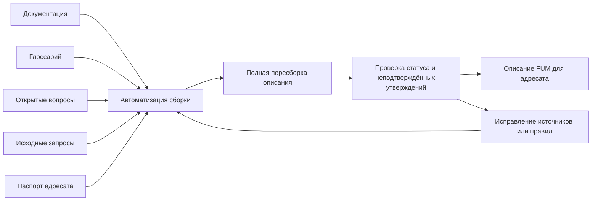

# [Opisaniya FUM dlya adresatov](../Glossarij/opisaniye-FUM-dlya-adresata.md)

## Trebovaniye

[FUM](../Glossarij/FUM.md) dolzhen podderzhivatj otdeljnuyu papku [Opisaniya](../Opisaniya/README.md), gde khranyatsya [opisaniya FUM dlya adresatov](../Glossarij/opisaniye-FUM-dlya-adresata.md): investorov, issledovatelej, inzhenerov, poljzovatelej, partnyorov i drugikh celevyikh auditorij.

Takiye opisaniya stroyatsya na osnove [dokumentacii](../Glossarij/proizvodnaya-dokumentaciya.md), [glossariya proyekta](../Glossarij/glossarij-proyekta.md), [otkryityikh voprosov](../Glossarij/otkryityij-vopros.md) i zafiksirovannyikh [iskhodnyikh zaprosov](../Glossarij/iskhodnyij-zapros.md). Oni nuzhnyi ne dlya sozdaniya novogo istochnika istinyi, a dlya adaptacii uzhe zafiksirovannoj [pamyati FUM](../Glossarij/pamyatj-FUM.md) k raznyim sposobam chteniya.

## Granica mezhdu dokumentaciyej i opisaniyami

[Proizvodnaya dokumentaciya](../Glossarij/proizvodnaya-dokumentaciya.md) opisyivayet sam [FUM](../Glossarij/FUM.md): trebovaniya, modelj, arkhitekturu, resheniya i otkryityiye neopredelyonnosti. [Opisaniye FUM dlya adresata](../Glossarij/opisaniye-FUM-dlya-adresata.md) vyibirayet iz etoj bazyi relevantnyiye tezisyi, menyayet poryadok podachi, obyyasnyayet cennostj cherez yazyik auditorii i yavno pokazyivayet, kakiye chasti poka yavlyayutsya proyektnyimi namereniyami, riskami ili otkryityimi voprosami.

Opisaniye ne dolzhno skryivatj status proyekta. Yesli v dokumentacii net podtverzhdenij kommercheskikh metrik, tekhnicheskoj gotovnosti, testov, vnedrenij ili drugikh faktov, adresnoye opisaniye ne dolzhno vyidavatj ikh za susjhestvuyusjhiye. Yesli opisaniye vyiyavlyayet novuyu myislj, vazhnuyu dlya samogo proyekta, eta myislj dolzhna byitj vyinesena v dokumentaciyu otdeljnyim izmeneniyem.

## Rolj pisatelya FUM

`fum-pisatelj` yavlyayetsya tekhnicheskoj identichnostjyu [dochernego fork-agenta FUM](../Glossarij/dochernij-fork-agent-FUM.md), kotoromu preimusjhestvenno naznachayetsya [kontekstnaya rolj](../Glossarij/kontekstnaya-rolj-FUM-agenta.md) pisatelya. On sozdayot [tekhnicheskoye samoopisaniye FUM](../Glossarij/tekhnicheskoye-samoopisaniye-FUM.md): opisyivayet ustrojstvo, sostoyaniye, ogranicheniya i sposobyi rabotyi FUM, vklyuchaya nablyudayemyiye osobennosti sobstvennoj konfiguracii, no ostayotsya proizvoditelem teksta, a ne novyim istochnikom istinyi.

Pisatelj poluchayet tochnyij srez dokumentacii, glossariya, voprosov, pasportov i proveryayemyikh svideteljstv. Kazhdomu utverzhdeniyu o sobstvennom runtime ili ustrojstve naznachayetsya odin status: nablyudeniye, vyivod, gipoteza ili neizvestnoye. Samoopisaniye modeli ne schitayetsya pryamoj introspekciyej yeyo vesov ili skryityikh sostoyanij, a sovpadeniye s vnutrennim osjhusjheniyem sessii ne zamenyayet vneshne proveryayemogo istochnika.

Naznacheniye pisatelya yavno vyibirayet formu rezuljtata. Integraciya uzhe zafiksirovannyikh trebovanij i arkhitekturyi prokhodit kak obyichnaya proizvodnaya dokumentaciya; adaptaciya dlya konkretnogo chitatelya ili zhanra — kak opisaniye FUM dlya adresata s pasportom auditorii. Yesli v khode pisjma poyavlyayetsya novaya proyektnaya myislj, ona snachala prokhodit obyichnuyu fiksaciyu v kanonicheskoj pamyati. Toljko posle etogo posleduyusjhaya peresborka mozhet vklyuchitj yeyo v kanonicheskuyu dokumentaciyu libo adresnoye opisaniye vyibrannogo zhanra. Tak rolj pisatelya ne obrazuyet paralleljnyij sloj trebovanij.

## Zhanrovyiye opisaniya

Opisaniya FUM mogut razlichatjsya ne toljko adresatom, no i zhanrovoj formoj. [Khudozhestvennoye samoopisaniye FUM](../Glossarij/khudozhestvennoye-samoopisaniye-FUM.md) yavlyayetsya otdeljnyim rezhimom, v kotorom FUM opisyivayet sebya cherez prozu, stikhi, muzyikaljnyiye treki, scenarii filjmov i drugiye khudozhestvennyiye ili mediazhanrovyiye formyi.

Takoj material ostayotsya proizvodnyim: on dolzhen opiratjsya na dokumentaciyu, glossarij, otkryityiye voprosyi, planirovaniye i iskhodnyiye zaprosyi. Khudozhestvennaya forma mozhet svyazyivatj tekhnicheskiye, socialjnyiye, issledovateljskiye i kosmicheskiye gorizontyi v yedinyij obraz, no ne dolzhna prevrasjhatj khudozhestvennuyu ekstrapolyaciyu v fakt, obesjhaniye ili novoye nezafiksirovannoye trebovaniye. Podrobnoye trebovaniye opisano v dokumente [Khudozhestvennoye samoopisaniye FUM](30-khudozhestvennoye-samoopisaniye-FUM.md), a [khudozhestvenno-fantasticheskoye samoopisaniye FUM](../Glossarij/khudozhestvenno-fantasticheskoye-samoopisaniye-FUM.md) ostayotsya yego chastnyim nauchno-fantasticheskim rezhimom.

## Vosproizvodimaya skhema

Dlya kazhdogo ustojchivogo tipa opisaniya dolzhna byitj zavedena [avtomatizaciya FUM](../Glossarij/avtomatizaciya-FUM.md) ili ssyilka na obsjhuyu avtomatizaciyu postroyeniya opisanij. Minimaljnaya skhema dolzhna fiksirovatj:

- adresata i yego klyuchevyiye voprosyi;
- celj opisaniya i dopustimyij ton;
- nabor iskhodnyikh dokumentov i glossarnyikh terminov;
- pravila otbora tezisov iz [pamyati](../Glossarij/pamyatj-FUM.md);
- sposob otlichatj podtverzhdyonnyiye trebovaniya ot interpretacij;
- strukturu rezuljtata;
- proverki pered publikaciyej i obnovleniyem.

Predpochtiteljnyij pattern dlya takoj avtomatizacii - [chistaya funkciya](../Glossarij/chistaya-funkciya.md): iz yavnogo nabora istochnikov, pasporta auditorii i pravil sborki poluchayetsya tekst opisaniya, a vneshniye dejstviya ogranichivayutsya chteniyem fajlov, zapisjyu rezuljtata i obnovleniyem navigacii.

Ustojchivoye opisaniye dolzhno izmenyatjsya ne ruchnoj pravkoj otdeljnyikh fragmentov, a peresborkoj cherez zakreplyonnuyu avtomatizaciyu. Yesli pri proverke najdeno ustarevsheye, netochnoye ili nepodtverzhdyonnoye utverzhdeniye, ispravlyayetsya istochnik, pravilo otbora ili skhema sborki, posle chego opisaniye sozdayotsya zanovo kak rezuljtat vyizova avtomatizacii.

## Skhema sborki adresnogo opisaniya

## Papka `Описания/`

Papka [Opisaniya](../Opisaniya/README.md) khranit ne obsjhuyu dokumentaciyu, a adresnyiye materialyi. Yeyo indeks obyyasnyayet pravila obnovleniya, a podpapka [Opisaniya/Avtomatizacii](../Opisaniya/Avtomatizacii/postroyeniye-opisaniya-FUM-dlya-adresata.md) khranit vosproizvodimyiye skhemyi sborki.

Kazhdoye opisaniye dolzhno soderzhatj pasport: adresat, celj, status, istochniki, avtomatizaciya, data ili versiya obnovleniya i ogranicheniya. Eto pozvolyayet peresobratj opisaniye posle izmeneniya dokumentacii i uvidetj, kakiye tezisyi zavisyat ot kakogo sloya [pamyati FUM](../Glossarij/pamyatj-FUM.md).

## Pervoye opisaniye dlya investorov

Pervyim adresnyim materialom yavlyayetsya [opisaniye FUM dlya investorov](../Opisaniya/dlya-investorov.md). Ono pokazyivayet proyekt kak rannyuyu otkryituyu razrabotku agenta sleduyusjhego pokoleniya, gde investicionno znachimyimi yavlyayutsya ne nepodtverzhdyonnyiye kommercheskiye pokazateli, a arkhitekturnaya stavka: svyaznaya [pamyatj FUM](../Glossarij/pamyatj-FUM.md), vosproizvodimyiye [avtomatizacii](../Glossarij/avtomatizaciya-FUM.md), moduljnaya fraktaljnaya arkhitektura, nauchno-inzhenernyij cikl i vozmozhnostj nakaplivatj perenosimyiye [narabotki](../Glossarij/narabotka.md).

Investorskoye opisaniye dolzhno yavno otdelyatj dolgosrochnuyu vozmozhnostj ot tekusjhego statusa. Ono mozhet formulirovatj investicionnuyu gipotezu, no ne dolzhno prevrasjhatj yeyo v obesjhaniye rezuljtata.

## Obnovleniye opisanij

Opisaniye nuzhno obnovlyatj, kogda menyayutsya dokumentyi, na kotoryikh ono osnovano, kogda poyavlyayetsya novyij adresat ili kogda susjhestvuyusjheye opisaniye perestayot tochno otrazhatj sostoyaniye [FUM](../Glossarij/FUM.md). Obnovleniye dolzhno idti cherez tu zhe vosproizvodimuyu skhemu: snachala perechitatj istochniki, zatem peresobratj tezisyi, posle etogo sravnitj novyij tekst so staryim i udalitj nepodtverzhdyonnyiye utverzhdeniya v pravilakh ili istochnikakh peresborki, a ne tochechnoj pravkoj gotovogo fajla.

Yesli raskhozhdeniye mezhdu opisaniyem i dokumentaciyej obnaruzheno posle publikacii, prioritet imeyet dokumentaciya i [iskhodnyiye zaprosyi](../Glossarij/iskhodnyij-zapros.md). Opisaniye ispravlyayetsya kak proizvodnyij sloj [pamyati](../Glossarij/pamyatj-FUM.md).

## Istochniki trebovanij

- [iskhodnyij zapros 2026-08-06 17:38:49 MSK — Sozdatj dochernikh fork-agentov FUM](../Zhurnal/2026-08-06_17-38-49_MSK_sozdatj-docherniye-fork-agentyi-FUM/zapros.md)
- [iskhodnyij zapros 2026-06-22 09:40:25 MSK](../Zhurnal/2026-06-22_09-40-25_MSK/zapros.md)
- [iskhodnyij zapros 2026-06-22 10:00:58 MSK](../Zhurnal/2026-06-22_10-00-58_MSK/zapros.md)
- [iskhodnyij zapros 2026-06-23 19:06:56 MSK](../Zhurnal/2026-06-23_19-06-56_MSK/zapros.md)
- [iskhodnyij zapros 2026-07-02 22:17:18 MSK](../Zhurnal/2026-07-02_22-17-18_MSK/zapros.md)
- [iskhodnyij zapros 2026-07-02 22:26:37 MSK](../Zhurnal/2026-07-02_22-26-37_MSK/zapros.md)

<!-- FUM-MD-RECENCY:BEGIN -->
<!-- last-content-edit: 2026-08-06 18:39:31 MSK -->
<!-- content-sha256: sha256:3047e258c1e96c4d421f0139a9dd4add8c82d5569892fe8a5b8f65f40ba9d1f9 -->
<!-- FUM-MD-RECENCY:END -->
