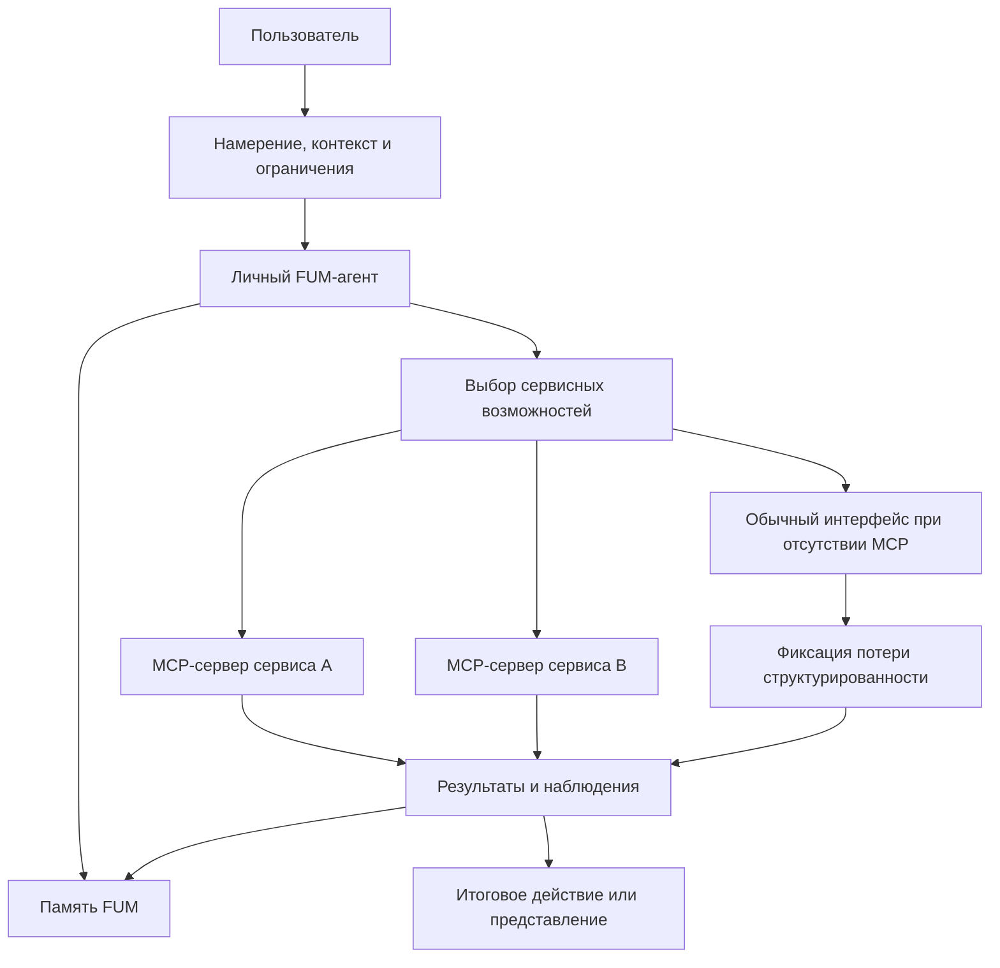

# [FUM](../Glossarij/FUM.md) kak [yedinaya tochka vzaimodejstviya s kompjyuterom](../Glossarij/yedinaya-tochka-vzaimodejstviya-s-kompjyuterom.md)

## Trebovaniye

Svyazka [FUM](../Glossarij/FUM.md) i [MCP-serverov](../Glossarij/MCP-server.md) razlichnyikh servisov dolzhna proyektirovatjsya kak budusjhaya [yedinaya tochka vzaimodejstviya poljzovatelya s kompjyuterom](../Glossarij/yedinaya-tochka-vzaimodejstviya-s-kompjyuterom.md). V etom rezhime poljzovatelj vzaimodejstvuyet prezhde vsego s [lichnyim FUM-agentom](../Glossarij/lichnyij-FUM-agent.md), a otdeljnyiye servisyi stanovyatsya dostupnyimi cherez mashinno-obrabatyivayemyiye kontraktyi, instrumentyi, resursyi i dejstviya.

Celevoj effekt sostoit ne v tom, chtobyi mgnovenno udalitj vse specializirovannyiye interfejsyi, a v tom, chtobyi zamenitj dlya poljzovatelya osnovnuyu neobkhodimostj postoyanno pereklyuchatjsya mezhdu razroznennyimi kliyentskimi prilozheniyami. FUM dolzhen prinimatj namereniye, kontekst i ogranicheniya poljzovatelya, vyibiratj nuzhnyiye servisnyiye vozmozhnosti, vyipolnyatj dejstviya cherez MCP-serveryi i sokhranyatj rezuljtat v [pamyati FUM](../Glossarij/pamyatj-FUM.md).

V terminakh [interfejsa FUM-uzla](../Glossarij/interfejs-FUM-uzla.md) yedinaya tochka vzaimodejstviya yavlyayetsya vneshnim interfejsom lichnogo uzla k cheloveku i cifrovoj srede. Ona dolzhna byitj soglasovana s vnutrennim interfejsom: to, chto poljzovatelj vidit, podtverzhdayet i poluchayet kak rezuljtat, dolzhno imetj nablyudayemuyu svyazj s vnutrennimi sostoyaniyami, pamyatjyu, trassami, pravami dostupa i ogranicheniyami dejstviya.

## Forma pervogo prilozheniya

Pervaya [korobochnaya realizaciya FUM](../Glossarij/korobochnaya-realizaciya-FUM.md) dolzhna predyyavlyatj etu yedinuyu tochku ne kak nabor razroznennyikh fajlov, skriptov i ruchnyikh perekhodov mezhdu instrumentami, a kak yedinoye lokaljnoye prilozheniye. Poljzovateljskij vkhod, poisk po pamyati, pokaz najdennogo konteksta, vyibor dejstviya, podtverzhdeniye, vyipolneniye, proverka, zhurnalirovaniye i sokhraneniye rezuljtata dolzhnyi byitj sobranyi v odnom postavlyayemom konture.

Yedinoye prilozheniye ne otmenyayet vnutrennyuyu [moduljnostj](../Glossarij/modulj-FUM.md). Vnutri nego mogut ostavatjsya CLI-komandyi, lokaljnyiye avtomatizacii, servisnyiye adapteryi, runtime-komponentyi i diagnosticheskiye rezhimyi, no dlya pervogo poljzovatelya oni ne dolzhnyi stanovitjsya osnovnoj formoj sborki FUM vruchnuyu. Vazhnyij kriterij korobochnoj formyi - chelovek zapuskayet FUM kak celjnyij rabochij centr, a ne vosstanavlivayet sistemu iz otdeljnyikh chastej.

[Tenevoj redaktor prodolzhenij](../Prototipyi/tenevoj-redaktor-prodolzhenij/README.md) yavlyayetsya pervyim dejstvuyusjhim interfejsnyim vertikaljnyim srezom tekusjhej osnovnoj linii, no ne podmenyayet soboj eto yedinoye prilozheniye. On namerenno proveryayet toljko odin lokaljnyij poljzovateljskij kontur: odin tekstovyij fajl, byistruyu suffiksno-prediktivnuyu strukturu, nezavisimoye prodolzheniye lokaljnoj LLM, fakticheskoye prodolzheniye cheloveka i nablyudayemuyu raznicu dvukh vetvej. Poisk po vsej pamyati, vyibor dejstvij, podtverzhdeniya effektov, servisnyiye adapteryi i polnyij agentskij cikl ostayutsya zavisimostyami boleye shirokoj postavki.

## Lokaljnaya celevaya vekha

V celevom variante [yedinaya tochka vzaimodejstviya](../Glossarij/yedinaya-tochka-vzaimodejstviya-s-kompjyuterom.md) dolzhna imetj lokaljnoye yadro: [lichnyij FUM-agent](../Glossarij/lichnyij-FUM-agent.md) zapuskayetsya na vyidelennoj mashine s lokaljnoj [pamyatjyu](../Glossarij/pamyatj-FUM.md), lokaljnyimi instrumentami, proverkami i lokaljno rabotayusjhej siljnoj LLM. Vneshniye MCP-serveryi i servisyi ostayutsya vazhnyimi organami rasshireniya, no oni ne dolzhnyi byitj yedinstvennyim osnovaniyem osnovnogo [agentskogo cikla](../Glossarij/agentskij-cikl.md).

Porog dostatochnosti lokaljnoj modeli, dopustimyij fallback i apparatnyij profilj etogo yadra yesjhyo ne opredelenyi; oni vyinesenyi v [otkryityij vopros o kriteriyakh lokaljnoj LLM i vyidelennoj mashinyi](../Voprosyi/2026-06-25_19-50-33_MSK_kriterii-lokaljnoj-LLM-i-vyidelennoj-mashinyi-FUM.md).

Takaya vekha opisana otdeljno v dokumente [Lokaljnyij agent FUM na vyidelennoj mashine](24-lokaljnyij-agent-na-vyidelennoj-mashine.md). Ona svyazyivayet poljzovateljskij kontur s apparatnyim i virtualizovannyim sloyami: lokaljnaya mashina stanovitsya upravlyayemyim [FUM-uzlom](../Glossarij/FUM-uzel.md), kotoryij mozhet prinimatj namereniye poljzovatelya, zapuskatj modeljnyij shag, vyizyivatj lokaljnyiye avtomatizacii, sokhranyatj rezuljtat i toljko zatem, pri neobkhodimosti, obrasjhatjsya k vneshnim servisam.

## Tekusjhij rabochij proobraz

Do celevoj lokaljnoj vekhi rolj blizhajshego proobraza yedinoj tochki vyipolnyayet svyazka Codex i Obsidian-khranilisjha. Poljzovatelj obrasjhayetsya k LLM cherez Codex, a [pamyatj FUM](../Glossarij/pamyatj-FUM.md) khranitsya v repozitorii, kotoryij chelovek mozhet chitatj i navigirovatj cherez Obsidian. Git, Markdown, lokaljnyiye proverki, zhurnal i fajlyi [iskhodnyikh zaprosov](../Glossarij/iskhodnyij-zapros.md) svyazyivayut namereniye, dejstviye i rezuljtat v proveryayemuyu istoriyu.

V etom proobraze Markdown-dokumentyi i ikh svyazi proveryayut osobuyu rolj [tekstovo-yazyikovyikh strukturiruyusjhikh operatorov FUM](../Glossarij/tekstovo-yazyikovoj-strukturiruyusjhij-operator-FUM.md) kak sovmestnoj vneshnej pamyati. V predelakh razreshyonnogo dostupa chelovek chitayet i ispravlyayet tu zhe adresuyemuyu zapisj, kotoruyu LLM izvlekayet v kontekst, porozhdayet i svyazyivayet s istochnikami; Git delayet izmeneniya sravnimyimi, a lokaljnyiye proverki - vosproizvodimyimi. Perenosimyij invariant sostoit ne v vyibore Markdown ili Obsidian, a v dvustoronnej dostupnosti, proiskhozhdenii, versionirovanii, proveryayemosti i svyazi tekstovoj proyekcii s pervichnyim materialom.

Nyineshnij Obsidian-sloj predyyavlyayet svyaznostj glavnyim obrazom cherez yavno materializovannyiye Markdown-ssyilki i poetomu yavlyayetsya toljko fajlovoj proyekciyej celevoj svyaznosti. Takiye ssyilki uzhe mogut porozhdatjsya chelovekom, LLM ili avtomatizaciyej, no dostupnostj perekhoda ne dolzhna zavisetj ot ikh predvariteljnoj zapisi. V tekstovom voplosjhenii [lichnogo FUM-agenta](../Glossarij/lichnyij-FUM-agent.md) ispolniteljnyij sloj dolzhen s pomosjhjyu [operatornogo grafa](../Glossarij/sistema-strukturiruyusjhikh-operatorov-FUM.md) predlagatj proveryayemyiye semanticheskiye perekhodyi mezhdu adresuyemyimi fragmentami. Interfejs reshayet, predyyavitj takoj perekhod kak ssyilku, rebro grafa, rekomendaciyu ili marshrut, sokhranyaya proiskhozhdeniye, uverennostj i status proverki.

Etot proobraz vazhen ne kak okonchateljnaya realizaciya produkta, a kak tekusjhij proveryayemyij kontur [gibridnogo uzla](../Glossarij/gibridnyij-uzel.md) chelovek-LLM. On pokazyivayet, kakiye chasti yedinoj tochki uzhe rabotayut cherez obsjhuyu pamyatj i podtverzhdeniya cheloveka, a kakiye yesjhyo dolzhnyi byitj vyinesenyi v lokaljnyij runtime, yavnyiye servisnyiye adapteryi, pasport interfejsa i vosproizvodimyiye avtomatizacii.

## Kalendarno-transportnyij kontur

Lichnyij FUM-agent dolzhen umetj vesti kalendari i raspisaniya, planirovatj poyezdki, vyizyivatj taksi i koordinirovatj drugiye servisyi peremesjheniya kak odin svyaznyij poljzovateljskij kontur. Dlya cheloveka eto vyiglyadit kak byitovoye namereniye: naznachitj sobyitiye, uchestj dorogu, vyibratj vremya vyikhoda, zakazatj transport ili podgotovitj marshrut. Dlya FUM eto vneshnij interfejs k kalendaryam, kartam, raspisaniyam, taksi, biletam, uvedomleniyam i pamyati proshlyikh dogovoryonnostej.

Takoj kontur yavlyayetsya pokazateljnyim sluchayem yedinoj tochki vzaimodejstviya: poljzovatelj ne dolzhen vruchnuyu perenositj odin plan mezhdu prilozheniyami, no FUM ne dolzhen prevrasjhatj etu svyaznostj v skryituyu avtonomnuyu vlastj. Dejstviya, kotoryiye zatragivayut oplatu, geolokaciyu, peredachu dannyikh tretjim storonam, fizicheskoye peremesjheniye cheloveka ili izmeneniye chuzhogo raspisaniya, trebuyut yavnyikh urovnej dostupa, podtverzhdenij, trass i otkaznyikh rezhimov.

Proveryayemyij scenarij etogo [kalendarno-transportnogo servisnogo kontura](../Glossarij/kalendarno-transportnyij-servisnyij-kontur.md) opisan v poljzovateljskoj istorii [Kalendarj, raspisaniye i poyezdki cherez FUM](31-poljzovateljskiye-istorii-FUM/vesti-kalendari-i-planirovatj-poyezdki.md). [Pasport kontura](42-pasport-kalendarno-transportnogo-servisnogo-kontura-lichnogo-FUM-agenta.md) zakreplyayet modeljnuyu granicu `R0`, matricu adapterov, podtverzhdeniye tochnogo snimka, oshibki, otmenyi, ochisjhennoye proiskhozhdeniye i lokaljnyij simulyator. Dopustimostj realjnogo ispolneniya i zaraneye zadannoj avtonomii ostayotsya neodnoznachnostjyu v [chastichno proyasnyonnom voprose o kalendarno-transportnyikh dejstviyakh FUM](../Voprosyi/2026-07-03_09-03-59_MSK_granicyi-kalendarno-transportnyikh-dejstvij-FUM.md).

## Skhema yedinoj tochki vzaimodejstviya

## Problema [modaljnosti prilozhenij](../Glossarij/modaljnostj-prilozhenij.md)

Sovremennaya rabota s kompjyuterom chasto trebuyet ot cheloveka perekhoditj mezhdu prilozheniyami, kazhdoye iz kotoryikh zadayot sobstvennuyu modaljnostj: navigaciyu, komandyi, modelj dannyikh, terminologiyu, pravila poiska, podtverzhdeniya i oshibki. Poljzovatelj vyinuzhden pomnitj, gde kakaya funkciya nakhoditsya, kak imenno v etom interfejse vyirazitj namereniye i kak perenesti rezuljtat v sleduyusjhij kontekst.

Dlya FUM eto yavlyayetsya arkhitekturnoj problemoj, a ne toljko voprosom udobstva. Yesli znachimaya rabota rassyipana po zakryityim interfejsnyim rezhimam, agentu trudno postroitj svyaznuyu [pamyatj](../Glossarij/pamyatj-FUM.md), vosstanovitj proiskhozhdeniye reshenij, najti povtoryayemyiye [patternyi](../Glossarij/pattern-pamyati.md) i prevratitj udachnyiye posledovateljnosti dejstvij v perenosimyiye [narabotki](../Glossarij/narabotka.md).

Yedinaya tochka vzaimodejstviya dolzhna umenjshatj etu modaljnostj: poljzovatelj opisyivayet celj v odnom konture, a FUM perevodit yeyo v servisnyiye dejstviya, proverki, promezhutochnyiye sostoyaniya i itogovyiye predstavleniya.

## MCP-serveryi kak servisnyiye organyi

[MCP-server](../Glossarij/MCP-server.md) v arkhitekture FUM rassmatrivayetsya kak ustojchivyij servisnyij adapter: kanal, cherez kotoryij vneshnij servis predostavlyayet agentu instrumentyi, resursyi, operacii i sostoyaniye v forme, prigodnoj dlya mashinnogo vyizova. Takoj adapter blizok k [ustrojstvu vospriyatiya i dejstviya FUM](../Glossarij/ustrojstvo-vospriyatiya-i-dejstviya-FUM.md): on odnovremenno dayot nablyudeniya o servise i pozvolyayet vyipolnyatj dejstviya v yego srede.

V etom smyisle MCP-server yavlyayetsya chastjyu vneshnego [interfejsa FUM-uzla](../Glossarij/interfejs-FUM-uzla.md), a ne zamenoj interfejsa celikom. On otvechayet za dostup k servisu, togda kak interfejs FUM-uzla otvechayet yesjhyo i za poljzovateljskoye namereniye, vnutrennyuyu pamyatj, podtverzhdeniya, prava, trassyi, proiskhozhdeniye i peredachu rezuljtata mezhdu uzlami.

Yesli MCP-server stanovitsya ustojchivoj chastjyu rabotyi, yego ispoljzovaniye dolzhno opisyivatjsya kak [avtomatizaciya FUM](../Glossarij/avtomatizaciya-FUM.md) ili kak chastj takoj avtomatizacii. V [pamyati FUM](../Glossarij/pamyatj-FUM.md) dolzhnyi sokhranyatjsya:

- naznacheniye servisa i oblastj primenimosti;
- dostupnyiye instrumentyi, resursyi, skhemyi vkhodov i vyikhodov;
- trebovaniya avtorizacii i [urovni dostupa](../Glossarij/urovenj-dostupa.md);
- versii, ogranicheniya, oshibki i izvestnyiye poteri nablyudayemosti;
- svyazj mezhdu poljzovateljskim namereniyem, vyizvannyimi operaciyami, rezuljtatom i posleduyusjhej [narabotkoj](../Glossarij/narabotka.md).

## Sokrasjheniye dublirovaniya koda

Yesli kazhdyij servis stroit otdeljnoye kliyentskoye prilozheniye kak glavnyij sposob vzaimodejstviya, industriya mnogokratno povtoryayet pokhozhiye sloi: navigaciyu, formyi, spiski, filjtryi, podtverzhdeniya, perenos dannyikh mezhdu kontekstami, shablonyi avtomatizacii i obvyazku vokrug tipovyikh dejstvij. Chastj takogo koda neizbezhno nuzhna, no znachiteljnaya dolya voznikayet iz-za togo, chto kazhdyij interfejs zanovo reshayet pokhozhuyu zadachu vyirazheniya poljzovateljskogo namereniya.

Svyazka FUM i MCP-serverov perenosit povtoryayemuyu chastj iz mnozhestva chelovecheskikh interfejsov v obsjhij agentskij sloj. Servisam vazhneye predostavlyatj nadyozhnyiye mashinnyiye kontraktyi, a FUM mozhet pereispoljzovatj [moduli](../Glossarij/modulj-FUM.md), [avtomatizacii](../Glossarij/avtomatizaciya-FUM.md), proverki, pravila dostupa i [patternyi pamyati](../Glossarij/pattern-pamyati.md) mezhdu raznyimi servisami. Eto dolzhno radikaljno sokratitj sovokupnoye dublirovaniye koda tam, gde raznyiye prilozheniya segodnya realizuyut odnotipnyiye poljzovateljskiye scenarii.

## Sokrasjheniye rasstoyaniya ot idei do voplosjheniya

Kogda poljzovatelj rabotayet cherez razroznennyiye prilozheniya, putj ot idei do rezuljtata prokhodit cherez mnozhestvo ruchnyikh perevodov: sformulirovatj myislj, vyibratj instrument, najti nuzhnoye mesto interfejsa, zapolnitj formu, skopirovatj rezuljtat, otkryitj sleduyusjhij instrument, povtoritj proverku. Kazhdaya takaya stupenj uvelichivayet rasstoyaniye mezhdu namereniyem i voplosjheniyem.

V celevom rezhime FUM dolzhen prinimatj ideyu kak [nablyudayemyij vkhodnoj signal](../Glossarij/nablyudayemyij-vkhodnoj-signal.md), razlozhitj yeyo na dejstviya, podobratj servisyi, vyizvatj MCP-serveryi, proveritj promezhutochnyiye rezuljtatyi, sokhranitj trassu v [pamyati](../Glossarij/pamyatj-FUM.md) i oformitj itog kak kod, dokument, issledovateljskij rezuljtat, poljzovateljskoye dejstviye ili druguyu proveryayemuyu formu. Chem boljshe takikh putej prevrasjhayetsya v vosproizvodimyiye [narabotki](../Glossarij/narabotka.md), tem koroche stanovitsya sleduyusjhij putj ot pokhozhej idei do voplosjheniya.

## Arkhitekturnyiye sledstviya

- FUM dolzhen imetj pervichnyij poljzovateljskij kontur, v kotorom namereniye, kontekst, ogranicheniya i podtverzhdeniya cheloveka ne zavisyat ot konkretnogo kliyentskogo prilozheniya.
- MCP-serveryi dolzhnyi vklyuchatjsya v [moduljnuyu arkhitekturu FUM](../Glossarij/modulj-FUM.md) kak servisnyiye adapteryi s yavnyimi kontraktami, versiyami, pravami dostupa i trassami vyizovov.
- Poljzovateljskiye interfejsyi servisov mogut ostavatjsya poleznyimi, no oni ne dolzhnyi byitj yedinstvennyim istochnikom sostoyaniya: znachimyiye dejstviya i rezuljtatyi dolzhnyi byitj dostupnyi agentu v strukturirovannoj forme ili cherez nablyudayemyij snimok.
- Dejstviya cherez vneshniye servisyi dolzhnyi sokhranyatj proiskhozhdeniye resheniya: chto zaprosil poljzovatelj, chto predlozhil agent, chto byilo podtverzhdeno chelovekom i chto byilo vyipolneno v ramkakh zaraneye razreshyonnoj avtonomii.
- Kalendarnyiye, transportnyiye i poyezdochnyiye dejstviya dolzhnyi proyektirovatjsya kak servisnyij kontur s razdeljnyim chteniyem raspisanij, modelirovaniyem variantov, podtverzhdeniyem vneshnego dejstviya, vyizovom adaptera i sokhraneniyem rezuljtata.
- Obsjhij agentskij sloj ne dolzhen prevrasjhatjsya v skryituyu totaljnuyu vlastj nad servisami i poljzovatelem; on dolzhen uvazhatj [decentralizaciyu FUM](../Glossarij/decentralizaciya-FUM.md), [granicyi vlasti](../Glossarij/granica-vlasti-FUM.md), privatnostj i urovni dostupa.
- Dlya servisov bez MCP-dostupa FUM dolzhen umetj rabotatj cherez obyichnyiye interfejsyi kak cherez meneye sovershennyiye ustrojstva vospriyatiya i dejstviya, yavno fiksiruya poteryu strukturirovannosti i vosproizvodimosti.

## Svyazj s drugimi trebovaniyami

Eto trebovaniye razvivayet obraz [lichnogo FUM-agenta](../Glossarij/lichnyij-FUM-agent.md): personaljnyij agent stanovitsya ne otdeljnyim pomosjhnikom ryadom s prilozheniyami, a rabochim centrom, cherez kotoryij chelovek vzaimodejstvuyet s cifrovoj sredoj.

Ono takzhe svyazyivayet [obzor agentskikh ciklov](06-obzor-agentskikh-ciklov.md), [dostup k vnutrennim sostoyaniyam](07-dostup-k-vnutrennim-sostoyaniyam.md), [moduljnuyu arkhitekturu](05-moduljnaya-arkhitektura-FUM.md), [interfejs FUM-uzla](25-interfejs-FUM-uzla.md) i [vosproizvodimyiye avtomatizacii](17-vosproizvodimyiye-avtomatizacii.md). Agentskij cikl poluchayet vneshnij servisnyij sloj, moduljnaya arkhitektura poluchayet ustojchivyiye adapteryi k servisam, a vosproizvodimostj trebuyet, chtobyi vyizovyi MCP-serverov ne ischezali kak neprozrachnyiye pobochnyiye effektyi.

## Istochniki trebovanij

- [iskhodnyij zapros 2026-06-23 13:08:36 MSK](../Zhurnal/2026-06-23_13-08-36_MSK/zapros.md)
- [iskhodnyij zapros 2026-06-23 19:06:56 MSK](../Zhurnal/2026-06-23_19-06-56_MSK/zapros.md)
- [iskhodnyij zapros 2026-06-25 19:50:33 MSK](../Zhurnal/2026-06-25_19-50-33_MSK/zapros.md)
- [iskhodnyij zapros 2026-06-26 09:55:41 MSK](../Zhurnal/2026-06-26_09-55-41_MSK/zapros.md)
- [iskhodnyij zapros 2026-06-26 10:34:02 MSK](../Zhurnal/2026-06-26_10-34-02_MSK/zapros.md)
- [iskhodnyij zapros 2026-06-26 10:47:01 MSK](../Zhurnal/2026-06-26_10-47-01_MSK/zapros.md)
- [iskhodnyij zapros 2026-06-29 12:44:23 MSK](../Zhurnal/2026-06-29_12-44-23_MSK/zapros.md)
- [iskhodnyij zapros 2026-07-03 09:03:59 MSK - Opisatj kalendarno transportnyiye dejstviya FUM](../Zhurnal/2026-07-03_09-03-59_MSK_opisatj-kalendarno-transportnyiye-dejstviya-FUM/zapros.md)
- [iskhodnyij zapros 2026-07-14 00:14:49 MSK - Zakrepitj operatoryi teksta i yazyika vo vneshnej pamyati](../Zhurnal/2026-07-14_00-14-49_MSK_zakrepitj-operatoryi-teksta-i-yazyika-vo-vneshnej-pamyati/zapros.md)
- [iskhodnyij zapros 2026-07-14 01:15:40 MSK - Zakrepitj avtomaticheskiye semanticheskiye svyazi lichnogo FUM](../Zhurnal/2026-07-14_01-15-40_MSK_zakrepitj-avtomaticheskiye-semanticheskiye-svyazi-lichnogo-FUM/zapros.md)
- [iskhodnyij zapros 2026-07-14 08:54:56 MSK - Sozdatj prototip raskhozhdeniya prodolzhenij](../Zhurnal/2026-07-14_08-54-56_MSK_sozdatj-prototip-raskhozhdeniya-prodolzhenij/zapros.md)

<!-- FUM-MD-RECENCY:BEGIN -->
<!-- last-content-edit: 2026-08-03 14:54:04 MSK -->
<!-- content-sha256: sha256:f6ed5ad06d01273d1bf478cd7b5cc9d89c20d5600b898cc3779880f49e7a3f3e -->
<!-- FUM-MD-RECENCY:END -->
