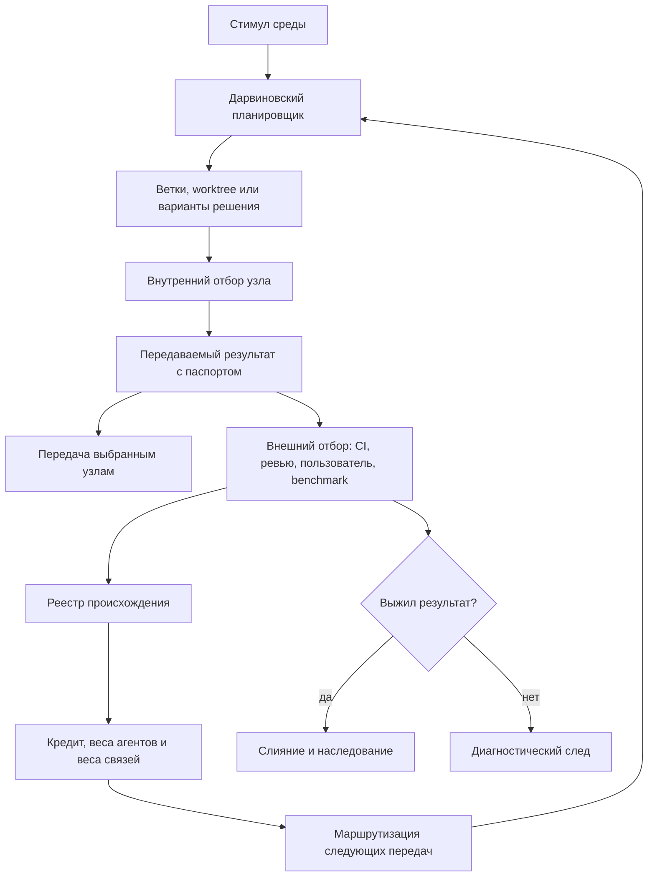

# Git-infrastruktura evolyucionnyikh cepochek [FUM](../Glossarij/FUM.md)

Ekspluatacionnyij status: konkretnyiye FIFO, continuation, worktree-pul, selector, reviewer/integrator/candidate/CAS i avtomaticheskaya publikaciya, opisannyiye nizhe dlya dokumentacionnogo prototipa, yavlyayutsya istoricheskoj i otlozhennoj arkhitekturoj. Oni ne dejstvuyut dlya tekusjhej zapisi repozitoriya; obyichnuyu pishusjhuyu sessiyu poljzovatelj zapuskayet vruchnuyu v pervichnom checkout `refs/heads/master`.

## Naznacheniye

[FUM](../Glossarij/FUM.md) dolzhen imetj inzhenernyij sloj, v kotorom [obobsjhyonnyij darvinovskij algoritm](../Glossarij/obobsjhyonnyij-darvinovskij-algoritm.md) stanovitsya ispolnyayemoj arkhitekturoj razrabotki. V takom sloye Git vyistupayet sredoj nasledovaniya i proiskhozhdeniya, Codex-podobnyiye agentyi i subagents - myislyasjhimi uzlami, a proverki, revjyu, benchmarks, poljzovateljskaya obratnaya svyazj i sliyaniye - vneshnej sredoj otbora.

Eta arkhitektura ne svodit [FUM](../Glossarij/FUM.md) k konkretnomu produktu Codex ili GitHub. Ona fiksiruyet realizuyemyij pattern: [FUM-uzlyi](../Glossarij/FUM-uzel.md) porozhdayut variantyi, provodyat vnutrennij otbor, peredayut vyibrannyiye rezuljtatyi drugim uzlam, poluchayut vneshnyuyu ocenku i obnovlyayut [vesa agentov](../Glossarij/ves-agenta-FUM.md), [vesa svyazej](../Glossarij/ves-svyazi-FUM.md) i marshrutyi peredachi.

Strategicheskoye znacheniye etogo sloya v tom, chto on svyazyivayet tekusjhuyu [pamyatj FUM](../Glossarij/pamyatj-FUM.md) s budusjhej ispolnyayemoj setjyu myishleniya. Git-infrastruktura ne dolzhna ostavatjsya pozdnim tekhnicheskim dopolneniyem k proyektu: ona zadayot proveryayemyij putj ot lokaljnogo sokhraneniya istochnikov i reshenij k [darvinovskomu planirovsjhiku](../Glossarij/darvinovskij-planirovsjhik-FUM.md), kotoryij umeyet zapuskatj variantyi, ocenivatj ikh po poleznosti otnositeljno cenyi, peredavatj rezuljtatyi i obnovlyatj marshrutyi na osnovanii vneshnej proverki.

Prakticheskij vektor vnedreniya:

- vkhodnoj sloj delayet kazhdyij zapros, istochnik i material nablyudayemyim elementom [pamyati](../Glossarij/pamyatj-FUM.md);
- rabochij sloj prevrasjhayet izmeneniya dokumentov, koda i avtomatizacij v [peredavayemyiye rezuljtatyi](../Glossarij/peredavayemyij-rezuljtat-FUM.md) s proiskhozhdeniyem;
- ocenochnyij sloj otdelyayet vnutrennyuyu ocenku uzla ot vneshnej proverki testami, revjyu, poljzovatelem ili benchmark;
- rodoslovnyij sloj nakaplivayet sobyitiya v [reyestre proiskhozhdeniya](../Glossarij/reyestr-proiskhozhdeniya-FUM.md) i raspredelyayet kredit po predkam;
- marshrutiziruyusjhij sloj ispoljzuyet [vesa agentov](../Glossarij/ves-agenta-FUM.md), vesa svyazej, stoimostj i ogranicheniya dostupa dlya vyibora sleduyusjhikh uzlov.

Takoj poryadok pozvolyayet razvivatj [FUM](../Glossarij/FUM.md) bez prezhdevremennogo obesjhaniya polnoj avtonomii: kazhdyij etap mozhno proveritj lokaljno, a uspeshnyiye konturyi stanovyatsya materialom dlya sleduyusjhej [evolyucionnoj cepochki](../Glossarij/evolyucionnaya-cepochka-FUM.md).

## Skhema dvukhkonturnogo otbora



## Klyuchevyiye vyivodyi iz dialoga

Rassharennyij dialog utochnil arkhitekturu ne kak obsjhij obraz mnogoagentnoj rabotyi, a kak vyichislimuyu modelj otbora.

- Kriterij vyizhivayemosti agenta ne dolzhen svoditjsya k samoj dolgoj cepochke. Ocenka dolzhna uchityivatj dolgovechnostj poleznyikh potomkov, vneshneye kachestvo rezuljtata, stoimostj, risk i tochnostj vnutrennego otbora.
- Sam [agentskij cikl](../Glossarij/agentskij-cikl.md) dolzhen byitj voplosjheniyem [obobsjhyonnogo darvinovskogo algoritma](../Glossarij/obobsjhyonnyij-darvinovskij-algoritm.md): agentyi porozhdayut cepochki rassuzhdenij, dejstvij i peredach, a sistema otbirayet tekh, kto sposoben podderzhivatj boleye dlinnyiye, poleznyiye i produktivnyiye cepochki bez raspada kachestva.
- [FUM-uzel](../Glossarij/FUM-uzel.md) snachala provodit otbor vnutri sobstvennogo mira, a zatem peredayot naruzhu toljko vyibrannyiye rezuljtatyi. Sreda i sleduyusjhiye uzlyi dayut vneshnij kontur proverki.
- Peredayotsya ne vesj vnutrennij process myishleniya, a [peredavayemyij rezuljtat FUM](../Glossarij/peredavayemyij-rezuljtat-FUM.md) s proiskhozhdeniyem, ozhidayemyim kachestvom, stoimostjyu, uverennostjyu i vyibrannyimi adresatami.
- [Ves agenta FUM](../Glossarij/ves-agenta-FUM.md) dolzhen voznagrazhdatj ne toljko finaljnogo ispolnitelya, no i uzlyi, kotoryiye sozdali poleznogo predka, praviljno ocenili yego vnutri sebya ili udachno napravili sleduyusjhemu uzlu.
- Poisk dolzhen idti ne za maksimaljnyim kachestvom lyuboj cenoj, a za luchshim otnosheniyem poljzyi, stoimosti, riska i vremeni. Dlya nesopostavimyikh zadach predpochtiteljna poleznostj s yavnyimi shtrafami, a ne prostoye otnosheniye kachestva k cene.
- Setj uzlov yavlyayetsya rekursivnoj: odin uzel mozhet byitj prostoj funkciyej, agentom, workflow ili vlozhennoj setjyu takikh zhe uzlov. Naruzhu takaya setj mozhet svorachivatjsya v makrouzel sleduyusjhego urovnya.
- Codex, Git, worktree, pull request i CI dayut pervyij inzhenernyij nositelj etoj modeli, no [darvinovskij planirovsjhik FUM](../Glossarij/darvinovskij-planirovsjhik-FUM.md) dolzhen byitj otdeljnyim proveryayemyim sloyem, a ne skryitoj nadezhdoj na sam Git.

## Karta sootvetstvij

| Ponyatiye [FUM](../Glossarij/FUM.md) | Inzhenernyij nositelj |
| --- | --- |
| Stimul sredyi | [iskhodnyij zapros](../Glossarij/iskhodnyij-zapros.md), issue, failing test, sobyitiye interfejsa ili vneshnij signal |
| [FUM-uzel](../Glossarij/FUM-uzel.md) | ekzemplyar Codex, specializirovannyij subagent, workflow-agent ili drugoj ispolniteljnyij uzel |
| Vnutrennij mir uzla | kontekst, `AGENTS.md`, skills, lokaljnoye sostoyaniye, dostupnaya [pamyatj](../Glossarij/pamyatj-FUM.md) i modelj zadachi |
| Variant resheniya | [vetka rabotyi](../Glossarij/vetka-rabotyi.md), Git branch, worktree, patch-kandidat ili otdeljnyij artefakt |
| Mutaciya | novyij commit, ispravleniye, perepisyivaniye resheniya ili izmeneniye dokumenta |
| Vnutrennij otbor | testyi, samoocenka, sravneniye variantov, lokaljnyiye kriterii kachestva i stoimosti |
| [Peredavayemyij rezuljtat FUM](../Glossarij/peredavayemyij-rezuljtat-FUM.md) | commit, patch, pull request, otchyot, benchmark, [narabotka](../Glossarij/narabotka.md) ili drugoj artefakt s pasportom proiskhozhdeniya |
| Vneshnij otbor | CI, review, benchmark, poljzovateljskaya proverka, production-metrika ili drugoj nezavisimyij sud sredyi |
| Nasledovaniye | novaya vetka ili zadacha, sozdannaya ot uspeshnogo commit, rezuljtata ili [narabotki](../Glossarij/narabotka.md) |
| Vyizhivaniye | merge, daljnejsheye ispoljzovaniye, poyavleniye poleznyikh potomkov i podtverzhdyonnaya cennostj rezuljtata |
| Rodoslovnaya | Git DAG vmeste s [reyestrom proiskhozhdeniya FUM](../Glossarij/reyestr-proiskhozhdeniya-FUM.md) |
| Smertj linii | zakryityij PR, revert, prekrasjhennaya vetka, vyitesneniye luchshim variantom ili otsutstviye poleznyikh potomkov |
| Ves uzla | [ves agenta FUM](../Glossarij/ves-agenta-FUM.md), vyichislennyij po poleznosti rezuljtatov i tochnosti otbora |
| [Ves svyazi FUM](../Glossarij/ves-svyazi-FUM.md) | uspeshnostj peredachi rezuljtatov mezhdu dvumya uzlami ili rolyami |

Eta karta yavlyayetsya pervoj zapolnennoj [kartochkoj sootvetstviya FUM](../Glossarij/kartochka-sootvetstviya-FUM.md): ona pokazyivayet, kak konkretnyij inzhenernyij instrument nesyot elementyi [obsjhej skhemyi FUM](../Glossarij/obsjhaya-skhema-FUM.md). V daljnejshem takiye kartyi dolzhnyi khranitjsya i sravnivatjsya v [reyestre kartochek sootvetstviya FUM](28-reyestr-kartochek-sootvetstviya-FUM/README.md), chtobyi perenositj modelj na drugiye tekhnicheskiye instrumentyi, nauchnyiye ramki i fizicheskiye gorizontyi s yavnyimi granicami analogii.

## [Dvukhkonturnyij otbor FUM](../Glossarij/dvukhkonturnyij-otbor-FUM.md)

Vnutri [agentskogo cikla](../Glossarij/agentskij-cikl.md) [FUM-uzel](../Glossarij/FUM-uzel.md) mozhet poroditj neskoljko variantov resheniya i otobratj luchshiye na osnovanii svoyej vnutrennej modeli zadachi. Posle etogo naruzhu peredayotsya ne vesj vnutrennij process, a toljko vyibrannyiye rezuljtatyi s metadannyimi proiskhozhdeniya, kachestva, stoimosti, uverennosti i adresatov.

Vneshnij kontur nachinayetsya posle peredachi rezuljtata. Sreda proveryayet rezuljtat cherez testyi, revjyu, benchmarks, poljzovatelya ili daljnejshuyu rabotu drugikh uzlov. Poetomu zhiznesposobnostj rezuljtata ne ravna prostomu vremeni zhizni vetki: zavisshaya vetka ne dolzhna poluchatj nagradu toljko za dliteljnostj susjhestvovaniya. Vyizhivaniye opredelyayetsya tem, voznikli li ot rezuljtata poleznyiye potomki, byil li on prinyat v obsjhuyu [pamyatj](../Glossarij/pamyatj-FUM.md) i kakuyu poljzu dal otnositeljno cenyi.

Smyislovaya ocenka agenta v takom cikle skladyivayetsya iz dolgovechnosti poleznyikh cepochek, vneshnej ocenki rezuljtatov i tochnosti vnutrennego otbora:

```text
S_a = alpha * L_a + beta * Q_ext_a + gamma * A_a
```

Zdesj `L_a` - vyizhivayemostj poleznyikh potomkov, `Q_ext_a` - vneshnyaya ocenka rezuljtata, a `A_a` - tochnostj vnutrennego otbora: naskoljko khorosho uzel zaraneye vyidelil resheniya, kotoryiye zatem dejstviteljno okazalisj uspeshnyimi vo vneshnej srede.

Dlya otbora cepochek rassuzhdenij vazhno razlichatj nablyudayemuyu dlinu i produktivnostj. Dlinnaya cepochka poluchayet preimusjhestvo toljko yesli dopolniteljnyiye zvenjya dayut novuyu proveryayemuyu poljzu: umenjshayut neopredelyonnostj, sozdayut [peredavayemyij rezuljtat](../Glossarij/peredavayemyij-rezuljtat-FUM.md), uluchshayut potomkov, povyishayut tochnostj otbora ili snizhayut budusjhuyu stoimostj. Cepochka, kotoraya prosto potreblyayet shagi i kontekst bez rosta poleznosti, dolzhna poluchatj shtraf kak neproduktivnaya.

Minimaljnaya poleznostj rezuljtata dolzhna uchityivatj cenu i risk:

```text
U(r) = Q_ext(r) - lambda * C(r) - mu * Time(r) - nu * Risk(r)
```

Otnosheniye `Q(r) / C(r)` dopustimo toljko dlya sopostavimyikh zadach, gde net riska poosjhritj deshyovyiye, no slabyiye resheniya. V obsjhem sluchaye stoimostj nuzhno raskladyivatj yavno:

```text
C(r) =
  C_compute +
  C_wall_time +
  C_communication +
  C_verification +
  C_error +
  C_human_attention
```

Poetomu otbor dolzhen iskatj ne maksimaljnoye kachestvo lyuboj cenoj, a luchshuyu dostupnuyu granicu kachestva, stoimosti, vremeni i riska.

## Rezuljtat kak nasleduyemyij obyyekt

Osnovnyim nasleduyemyim obyyektom yavlyayetsya ne sam agent, a rezuljtat yego rabotyi: ideya, patch, commit, dokument, test, modelj, skhema, avtomatizaciya ili inaya [narabotka](../Glossarij/narabotka.md). Agent vyistupayet generatorom variantov, vnutrennim selektorom i kanalom peredachi.

Kazhdyij [peredavayemyij rezuljtat FUM](../Glossarij/peredavayemyij-rezuljtat-FUM.md) dolzhen imetj mashinno chitayemyij pasport. [Minimaljnyij pasport versii 1](39-minimaljnyij-pasport-peredavayemogo-rezuljtata-FUM.md) zakreplyayet odno sostoyaniye rezuljtata i svyazyivayet yego artefaktyi s istochnikami, proizvodyasjhim uzlom, roditeljskimi rezuljtatami, Git-kontekstom proiskhozhdeniya, vnutrennimi i vneshnimi proverkami, ozhidayemoj i fakticheskoj stoimostjyu, uverennostjyu, adresatami i otdeljnyimi marshrutami peredachi.

Kanonicheskij format razlichayet dostavku, podtverzhdeniye polucheniya i vneshnij otbor. On khranit riski i ogranicheniya v yavnoj oblasti rezuljtata i usloviyakh adresatov, neizvestnuyu stoimostj - kak neizvestnuyu, a ne kak nolj, i ne vyidayot vnutrennyuyu uverennostj za nezavisimuyu ocenku. [JSON Schema](39-minimaljnyij-pasport-peredavayemogo-rezuljtata-FUM/skhema-pasporta-v1.json) i zapolnennyij primer zamenyayut prezhnij illyustrativnyij sokrasjhyonnyij konvert kak normativnyij kontrakt.

Takoj pasport prevrasjhayet commit ili pull request v [narabotku](../Glossarij/narabotka.md), prigodnuyu dlya peredachi, proverki, otbora i povtornogo ispoljzovaniya. Bez pasporta Git sokhranyayet toljko tekhnicheskuyu istoriyu fajlov, no ne vsyu arkhitekturnuyu istoriyu myishleniya [FUM](../Glossarij/FUM.md).

## [Darvinovskij planirovsjhik FUM](../Glossarij/darvinovskij-planirovsjhik-FUM.md)

Git, worktree, pull request i CI dayut izolyaciyu, istoriyu i proverku, no sami po sebe ne obrazuyut evolyucionnuyu agentnuyu sistemu. Dlya etogo nuzhen [darvinovskij planirovsjhik FUM](../Glossarij/darvinovskij-planirovsjhik-FUM.md), kotoryij vyipolnyayet pyatj funkcij.

- Orkestrator prinimayet vkhodnoj signal, zapuskayet podkhodyasjhiye uzlyi, sozdayot vetki i upravlyayet peredachej rezuljtatov.
- Ocensjhik zapuskayet testyi, benchmarks, proverki bezopasnosti, review i vneshniye judges.
- [Reyestr proiskhozhdeniya FUM](../Glossarij/reyestr-proiskhozhdeniya-FUM.md) svyazyivayet rezuljtat, roditelej, agenta, commit, stoimostj, adresatov i potomkov.
- Modulj kreditovaniya obnovlyayet [vesa agentov FUM](../Glossarij/ves-agenta-FUM.md), [vesa svyazej](../Glossarij/ves-svyazi-FUM.md) i vklad predkov posle vneshnej ocenki.
- Byudzhetnyij kontroller ogranichivayet dorogiye, riskovannyiye ili besperspektivnyiye linii do togo, kak oni nachnut vyitesnyatj boleye poleznyiye cepochki.

Sleduyusjhego poluchatelya rezuljtata planirovsjhik vyibirayet ne sluchajno i ne toljko po roli. Vyibor dolzhen uchityivatj sootvetstviye rezuljtata kompetencii uzla, tekusjhij ves uzla, uspeshnostj proshlyikh peredach mezhdu etimi uzlami, stoimostj prodolzheniya i ogranicheniya dostupa.

Otdeljnoj nizkoprioritetnoj ocheredjyu planirovsjhik mozhet vesti [fonovyiye zadaniya FUM](../Glossarij/fonovoye-zadaniye-FUM.md). Zadaniye iz neyo dopuskayetsya k ispolneniyu toljko pri odnovremennom otsutstvii neobrabotannogo poljzovateljskogo vvoda i gotovyikh zadach boleye vyisokogo prioriteta. Poyavleniye takogo vvoda ili zadachi vyitesnyayet fon v bezopasnoj kontroljnoj tochke: ispolnitelj sokhranyayet nablyudayemuyu trassu i status, posle chego priostanavlivayetsya libo zavershayetsya po politike zadaniya.

Pasport fonovogo zadaniya dolzhen soderzhatj celj, istochnik, prioritet, razreshyonnyiye dejstviya, byudzhetyi vremeni, vyichislenij i energii, kriterij ostanovki i ozhidayemyij vid rezuljtata. Fonovaya rabota ne poluchayet dopolniteljnyikh polnomochij i ne perevodit svoj rezuljtat pryamo v utverzhdyonnoye znaniye: opisaniye, gipoteza ili kandidat prokhodyat obyichnuyu proverku, otbor i fiksaciyu proiskhozhdeniya.

Kto formiruyet razreshyonnyij issledovateljskij pul, kak proveryayetsya nezavisimostj i gde prokhodyat predelyi eksperimenta, ostayotsya v [chastichno proyasnyonnom voprose o granicakh issledovateljskoj avtonomii FUM](../Voprosyi/2026-06-22_08-04-45_MSK_granicyi-issledovateljskoj-avtonomii-FUM.md).

## [Evolyucionnyiye cepochki FUM](../Glossarij/evolyucionnaya-cepochka-FUM.md)

[Evolyucionnaya cepochka FUM](../Glossarij/evolyucionnaya-cepochka-FUM.md) - eto posledovateljnostj, v kotoroj rezuljtat peredayotsya mezhdu uzlami, preobrazuyetsya, prokhodit proverki i porozhdayet potomkov. Naprimer: zadacha porozhdayet neskoljko vetok, odna vetka dayot commit, commit peredayotsya proveryayusjhemu agentu, zatem ispravlyayetsya, prokhodit CI, slivayetsya i stanovitsya osnovaniyem dlya sleduyusjhej zadachi.

Dlya ocenki takoj cepochki vazhnyi ne toljko poslednij commit i ne toljko agent, vyipolnivshij finaljnoye dejstviye. Kredit dolzhen rasprostranyatjsya nazad po rodoslovnoj: nagradu poluchayet takzhe uzel, kotoryij sozdal poleznogo predka, praviljno otobral promezhutochnyij rezuljtat ili udachno peredal yego sleduyusjhemu agentu.

Eto delayet [pamyatj FUM](../Glossarij/pamyatj-FUM.md) ne passivnyim arkhivom, a sredoj evolyucii: uspeshnyiye cepochki stanovyatsya [patternami pamyati](../Glossarij/pattern-pamyati.md), neudachnyiye cepochki sokhranyayut diagnosticheskuyu cennostj, a marshrutyi peredachi rezuljtatov postepenno poluchayut vesa.

### Repozitornaya kartochka i vetka cepochki

Dlya tekusjhego repozitornogo prototipa [kartochka cepochki shagov](../Glossarij/kartochka-cepochki-shagov.md) yavlyayetsya kanonicheskim upstream: ona svyazyivayet ustojchivyij `FUM-ЦЕПОЧКА-NNNN`, konechnyij uporyadochennyij spisok kanonicheskikh kartochek shagov, tochnyij polnyij ref vetki, bazovuyu vetku i proyekt. Zadachi, kriterii i istochniki ostayutsya v otdeljnyikh `FUM-STEP-*`; [sleduyusjhij shag vetki](../Glossarij/sleduyusjhij-shag-vetki.md) yavlyayetsya proizvodnyim ispolnyayemyim selektorom i ne pereopredelyayet poryadok ili identichnostj cepochki.

Realizaciya cepochki nachinayetsya ne svobodnoj komandoj pereklyucheniya, a ograzhdyonnyim perekhodom versii `1` mezhdu kornevyimi zadachami. Novaya zadacha predyyavlyayet tochnyiye kartochku, iskhodnyij imenovannyij ref i iskhodnyij `HEAD`, dokazyivayet chistyiye index/worktree i kanonicheski pustuyu FIFO-ocheredj, trebuyet otsutstviya celevogo `refs/heads/codex/...` i odnoj Git-tranzakciyej sozdayot yego rovno na iskhodnoj vershine. Zatem checkout pereklyuchayetsya bez izmeneniya dereva, a ta zhe zadacha nemedlenno poluchayet obyichnyij dopusk uzhe v celevoj vetke. Susjhestvuyusjhij target, razoshedshiyesya ref ili `HEAD`, gryazj, aktivnaya ocheredj i popyitka pereklyucheniya uzhe dopusjhennyim vladeljcem zakryivayut perekhod. Pervichnaya fiksaciya kartochek i perekhodnogo mekhanizma ostayotsya bootstrap-kommitom `refs/heads/master`; toljko sleduyusjhaya otdeljnaya zadacha mozhet nachatj konkretnuyu cepochku.

Kazhdyij izmenyayusjhij shag cepochki nasleduyetsya sleduyusjhim pokoleniyem toljko kak atomarnyij commit tekusjhej vetki. Nulevoj kod vnutrennego polnogo smoke-check podtverzhdayet proverki, no yesjhyo ne zavershayet vneshnyuyu smoke-sessiyu: roditeljskaya obolochka dolzhna zakryitj otchyot zapuska i yego `снимок.json`, vklyuchitj ikh v podgotovlennoye derevo, sozdatj tochnuyu [zadachu-prodolzheniye vetki](../Glossarij/obyazateljnoye-prodolzheniye-vetki.md), podtverditj yeyo waiting-bilet i zatem vyipolnitj atomarnyij `commit+handoff` obsjhej ocheredi s identifikatorom rebyonka. Toljko rezuljtat `committed` yavlyayetsya vneshnim uspekhom. Kommit vnutri vnutrennego smoke-runner sozdal byi samoreferenciyu: zakryivayusjhij otchyot poyavilsya byi posle uzhe zafiksirovannogo dereva i potomu ne dokazyival byi uspeshnyij commit.

Posle handoff rebyonok perechityivayet novyij `HEAD`, poluchayet FIFO-dopusk i neposredstvenno vyizyivayet vetochnyij selektor `show` dlya tochnogo tekusjhego ref. Kartochka cepochki ostayotsya kanonicheskim upstream poryadka, a selektor lishj zanovo vyichislyayet gotovnostj kandidatov. Periodicheskij heartbeat, obsjhij dispetcher, reyestrovoye zadaniye, reservation i claim v etu svyazj pokolenij ne vkhodyat; prezhnij kontur sokhranyayetsya toljko kak istoricheskaya realizaciya i dolzhen ostavatjsya ostanovlennyim.

### Derevo vetvevyikh fork

Linejnaya cepochka ostayotsya vnutrennim dvizheniyem odnogo [vetvevogo fork FUM](../Glossarij/vetvevoj-fork-FUM.md), no otdeljnyij ograzhdyonnyij perekhod mozhet poroditj ot yeyo tochnoj vershinyi dva dochernikh fork. Pasport sokhranyayet neizmenyayemyiye ryobra proiskhozhdeniya, proverennoye obsjheye iskhodnoye sostoyaniye, raznyiye paryi repozitoriya i polnogo rabochego ref, zhivyiye checkout, odnu dopusjhennuyu pishusjhuyu sessiyu na rebyonka i ravenstvo logicheskikh identichnostej roditelya i moderatora. Git sam ne khranit pervoklassnoye rebro fork mezhdu podvizhnyimi branch refs, poetomu derevo vosstanavlivayetsya iz pasporta, a ne vyivoditsya zadnim chislom toljko iz obsjhego predka kommitov.

Obyichnyij `commit+handoff` ne rasshiryayetsya do dvukh prodolzhenij: vnutri kazhdogo rebyonka on po-prezhnemu svyazyivayet kommit rovno s odnoj sleduyusjhej sessiyej toj zhe vetki. Yesli pered razvilkoj nuzhen soderzhateljnyij kommit, yego obyichnoye unarnoye prodolzheniye snachala poluchayet uzhe zafiksirovannuyu vershinu, a zatem nachinayet otdeljnyij perekhod bez zapisi v roditeljskij rabochij ref. Dve nachaljnyiye host-zadachi registriruyutsya kak neaktivnyiye i ne vkhodyat v FIFO dochernikh vetok do yedinogo CAS-perekhoda globaljnogo predaktivacionnogo barjyera. Neizvestnyij rezuljtat host-vyizova zakryivayet aktivaciyu, poka prezhnyaya popyitka ne dokazana avtoritetnyim chteniyem libo ne vyipolneno yavnoye chelovecheskoye vosstanovleniye. Posle aktivacii roditeljskaya host-sessiya osvobozhdayet vladeniye, a tot zhe logicheskij roditelj pozdneye vozobnovlyayet moderaciyu iz Git-sostoyaniya i sravnivayet zakreplyonnyiye rezuljtatyi po zaraneye sokhranyonnyim kriteriyam.

Derevom yavlyayetsya toljko genealogiya `родитель → ребёнок`: odin korenj, rovno odin roditelj u kazhdogo drugogo uzla i rovno dva rebyonka u sostoyavshejsya razvilki. Vyibor odnoj vershinyi ili obyyedineniye dvukh sovmestimyikh rezuljtatov vyipolnyayetsya otdeljnyim CAS-integratorom v zamorozhennyij roditeljskij rabochij ref; posle mnogoroditeljskogo kommita fakticheskij Git-graf stanovitsya DAG. Takoye razlicheniye sokhranyayet i proiskhozhdeniye aljternativ, i chestnuyu topologiyu sliyaniya.

## Publichnyij upstream i forki pamyati

Blizhajshaya GitHub-skhema delayet tekusjhij repozitorij publichnyim upstream, ot kotorogo drugiye lyudi mogut sozdavatj forki sobstvennoj [pamyati FUM](../Glossarij/pamyatj-FUM.md). V celevoj skheme obsjhij upstream yadra nesyot publikacionno chistyiye pravila, dokumentaciyu, instrumentyi i arkhitekturnyiye uluchsheniya; dolgovechnyiye universaljnyiye ispolniteljnyiye poduzlyi s naznachayemyimi kontekstnyimi rolyami zhivut v otdeljnyikh forkakh yadra, samostoyateljnyiye proyektyi — v sobstvennyikh repozitoriyakh, a konkretnaya kompozicionnaya sborka zakreplyayet proverennyiye revizii oboikh vidov cherez Git submodule.

Yavnaya proveryayemaya sinkhronizaciya zerkaljnogo `master` forka s tochnyim opublikovannyim pokoleniyem upstream stanovitsya prakticheskim mekhanizmom nasledovaniya. Rolevaya vetka poluchayet eto pokoleniye otdeljnyim perekhodom, sokhranyayet sobstvennuyu istoriyu i granicu dostupa, a smena kontekstnoj roli ne menyayet identichnostj fork-agenta i ne rasshiryayet polnomochiya. Proyektnyij repozitorij sinkhroniziruyetsya so svoim obyyavlennyim upstream i ne nasleduyet `master` FUM toljko iz-za podklyucheniya kak submodule.

Dlya [FUM](../Glossarij/FUM.md) eta skhema vazhna kak pervyij socialjnyij sloj [evolyucionnyikh cepochek](../Glossarij/evolyucionnaya-cepochka-FUM.md): yadro rasprostranyayet ustojchivyiye mutacii, universaljnyiye fork-poduzlyi proveryayut rezuljtatyi v raznyikh kontekstnyikh rolyakh, proyektyi sokhranyayut samostoyateljnyiye istorii, a poleznyiye uluchsheniya vozvrasjhayutsya v celevoj repozitorij cherez proveryayemyij peredavayemyij rezuljtat. Pasport dolzhen razlichatj iskhodnyij i celevoj repozitorii, tochnyiye bazovyij i rezuljtiruyusjhij kommityi, prinyatiye v celevoj ref i posleduyusjheye prodvizheniye gitlink kompozicii.

Prakticheskiye pravila etoj skhemyi — publikacionnyij audit, rekomenduyemyiye vetki forka, periodicheskoye sliyaniye `master` i obratnaya peredacha uluchshenij — opisanyi v dokumente [Publichnyij upstream i forki pamyati FUM](27-publichnyij-upstream-i-forki-pamyati.md). Topologiya yadra, kompozicii, pishusjhikh poduzlov i proyektov zakreplena v [repozitornom grafe pishusjhikh poduzlov i proyektov FUM](44-repozitornyij-graf-pishusjhikh-poduzlov-i-proyektov-FUM.md).

## Vesa, kredit i marshrutizaciya

[Ves agenta FUM](../Glossarij/ves-agenta-FUM.md) yavlyayetsya vyichislyayemoj reputaciyej, a ne ruchnoj ocenkoj statusa. On dolzhen uchityivatj vneshneye kachestvo rezuljtatov, vyizhivayemostj poleznyikh cepochek, tochnostj vnutrennego otbora i cennostj uspeshnyikh peredach:

```text
W_i = alpha * Q_i + beta * L_i + gamma * A_i + delta * P_i
```

Zdesj `Q_i` - vneshnyaya ocenka rezuljtatov, `L_i` - vyizhivayemostj poleznyikh potomkov, `A_i` - tochnostj vnutrennego otbora, a `P_i` - vklad rezuljtatov, kotoryiye uzel peredal daljshe.

Otlozhennyij vklad peredannogo rezuljtata vozvrasjhayetsya predkam cherez diskontirovannyij kredit:

```text
Credit_i(r) = a_i_r * discount ^ d(i, r) * U(r)
```

`a_i_r` fiksiruyet dolyu vklada uzla, `d(i, r)` - rasstoyaniye ot vklada do ocenennogo rezuljtata, `U(r)` - itogovuyu poleznostj rezuljtata. Poetomu sistema ne dolzhna voznagrazhdatj toljko poslednego ispolnitelya: poleznyij predok i udachnyij vyibor adresata tozhe poluchayut kredit.

[Ves svyazi FUM](../Glossarij/ves-svyazi-FUM.md) otrazhayet, naskoljko poleznyimi byili proshlyiye peredachi mezhdu dvumya uzlami:

```text
E_ij_next = (1 - eta) * E_ij + eta * U_i_to_j
```

Sleduyusjhij adresat rezuljtata vyibirayetsya s uchyotom sootvetstviya zadachi, vesa uzla, vesa svyazi, stoimosti i ogranichenij dostupa:

```text
P(i -> j | r) = softmax(
  alpha * relevance(r, j) +
  beta * W_j +
  chi * E_ij -
  zeta * Cost_j
)
```

Tak sistema postepenno uchitsya ne toljko tomu, kakiye uzlyi khorosho reshayut zadachi, no i tomu, kakiye uzlyi khorosho ocenivayut sobstvennyiye resheniya i komu vyigodneye peredavatj konkretnyij tip rezuljtata.

## Rekursivnaya setj uzlov

Eta arkhitektura stroit setj, pokhozhuyu odnovremenno na nejrosetj, mnogoagentnuyu sistemu i evolyucionnyij graf. Uzel snaruzhi mozhet vyiglyadetj kak yedinyij agent, no vnutri byitj prostoj funkciyej, workflow, gruppoj subagents ili polnocennoj setjyu [FUM-uzlov](../Glossarij/FUM-uzel.md). Setj mozhet byitj svyornuta v makrouzel sleduyusjhego urovnya.

V otlichiye ot obyichnoj nejroseti, svyazi peredayut ne toljko chislovuyu aktivaciyu, a [peredavayemyij rezuljtat FUM](../Glossarij/peredavayemyij-rezuljtat-FUM.md) s metadannyimi: soderzhaniye rezuljtata, ozhidayemoye kachestvo, stoimostj, uverennostj, proiskhozhdeniye i adresata. [Ves agenta](../Glossarij/ves-agenta-FUM.md) otrazhayet sposobnostj sozdavatj i otbiratj poleznyiye resheniya, a [ves svyazi](../Glossarij/ves-svyazi-FUM.md) - uspeshnostj marshruta peredachi.

Takaya rekursivnostj utochnyayet [moduljnuyu arkhitekturu FUM](05-moduljnaya-arkhitektura-FUM.md): [modulj FUM](../Glossarij/modulj-FUM.md) mozhet byitj ne toljko vyichisliteljnyim ili dokumentacionnyim elementom, no i vosproizvodimoj [evolyucionnoj cepochkoj](../Glossarij/evolyucionnaya-cepochka-FUM.md) s sobstvennyimi pravilami otbora i peredachi rezuljtatov.

## Lokaljnyij pul worktree-poduzlov

Nachaljnyij lokaljnyij profilj paralleljnogo ispolneniya ispoljzuyet konechnyij pul pereispoljzuyemyikh linked worktree `Подузлы/слот-*` odnogo repozitoriya. Do rezervirovaniya obyichnaya novaya sessiya v chistom osnovnom checkout stroit exact committed routing snapshot: tochnyij OID celevoj vershinyi, OID obyazateljnyikh planovyikh istochnikov, obyyekt i reviziyu protokola pula, vse aktivnyiye naznacheniya i linii s ikh polnyimi refs, worktree i sostoyaniyem branch-scoped FIFO, a takzhe svobodnyiye slotyi. Kanonicheskij khyesh svyazyivayet resheniye s etim sostoyaniyem; izmenivshijsya istochnik, ref, vladelec ili ozhidayusjhij bilet trebuyet novogo snimka i novogo vyibora.

Sessiya vyibirayet `параллельная_линия`, `последовательное_продолжение` libo `только_чтение`. Pervyij rezhim lenivo rezerviruyet slot toljko posle marshrutizacii i sozdayot naznacheniye `self_line` s unikaljnyimi ref i worktree. Vtoroj dobavlyayet dolgovechnyij bilet k FIFO tochnoj aktivnoj linii i sokhranyayet za sleduyusjhej sessiyej tot zhe fizicheskij slot, ref i worktree. Tretij ne zanimayet pisateljskij slot. Odnovremenno aktivnyiye pisatelj, recenzent i integrator rabotayut v raznyikh slotakh; checkout i indeksyi razlichayutsya, a object database, Git common-dir i prostranstvo refs ostayutsya obsjhimi.

Odna liniya dopuskayet rovno odnogo vladeljca, no mozhet posledovateljno projti neskoljko sessij. Pered kommitom tekusjhego vladeljca prodolzheniye uzhe zakrepleno ozhidayusjhim FIFO-biletom. Odna CAS-tranzakciya sveryayet iskhodnuyu vershinu, pokoleniye, ref, ocheredj i khyesh prodolzheniya, sozdayot odin pryamoj kommit, peredayot liniyu golove FIFO i sokhranyayet neizmenyayemuyu kvitanciyu. Poluchatelj vidit `reload_required`, perechityivayet pravila iz fakticheskogo novogo `HEAD`, podtverzhdayet tochnyij OID i lishj zatem poluchayet novoye pokoleniye. Tochnyij povtor i read-only-vosstanovleniye poteryannogo otveta vozvrasjhayut prezhnyuyu kvitanciyu ili marshrut, ne sozdavaya vtoroj slot, bilet, kommit libo handoff.

Poka u linii yestj ozhidayusjheye prodolzheniye, zamorozitj yeyo itogovyij result-ref neljzya. Posle terminaljnogo rezuljtata tochnyij commit zamorazhivayetsya pod ustojchivyim lokaljnyim ref; lishj otsutstviye vladeljca i ozhidayusjhikh biletov, ostanovka pozdnikh pisatelej, chistyiye checkout i indeks i terminaljnaya kvitanciya razreshayut ochistitj fizicheskij slot i vernutj yego v pul. Recenzent i integrator chitayut zamorozhennyij Git-obyyekt, poetomu sokhrannostj rezuljtata posle terminala ne zavisit ot kataloga slota.

Lokaljnyij otbor sostoit iz avtomaticheskogo nezavisimogo agentskogo revjyu, otdeljnoj agentskoj integracii i avtomaticheskogo agentskogo razresheniya dopustimyikh konfliktov. Lyuboj razreshyonnyij ili zanovo sobrannyij itog obyazateljno prokhodit povtornoye nezavisimoye revjyu. Dazhe prinyatyij neizmennyij obyyekt prodvigayet lokaljnyij `master` toljko cherez serializovannuyu obyichnuyu FIFO osnovnoj vetki i tochnyij CAS; integracionnyij slot ne poluchayet obkhodnogo prava menyatj `master`.

Vse result-ref, vklyuchaya zablokirovannyiye i neslivayemyiye, ostayutsya otdeljno dostizhimyimi. Posle proverki publikacionnoj chistotyi avtomaticheskij transport otpravlyayet kazhdyij takoj ref bez force v zaraneye nastroyennyij remote etogo zhe repozitoriya i tochnyim readback podtverzhdayet udalyonnyij OID. Oshibka seti ili autentifikacii dayot vozobnovlyayemoye sostoyaniye `publication_pending`, ne udalyayet lokaljnyij ref i ne razreshayet ugadyivatj uspekh. Zablokirovannyij ref publikuyetsya toljko kak otdeljnyij udalyonnyij result-ref i ne popadayet v `master`; remote `master` dvigayetsya lishj posle prinyatoj lokaljnoj integracii, povtornogo nezavisimogo revjyu i obyichnoj peredachi osnovnoj vetki. GitHub fork i pull request v etom profile FUM-STEP-0148 ne sozdayutsya.

Etalonnyij dokumentaljnyij CLI proveryayet exact repo-root soderzhateljnyikh i terminaljnyikh komand: on obyazan razreshatjsya v naznachennyij slot i sovpadatj s yego `worktree_id`. Eto zakryivayet vyizov takoj komandyi iz osnovnogo checkout na urovne protokola, no ne dokazyivayet perenos ili vozobnovleniye host-workspace zadachi Codex Desktop i ne dokazyivayet otsutstviye avtomaticheskikh chtenij osnovnogo checkout do pervogo instrumentaljnogo dejstviya. Profilj poetomu ne nazyivayetsya nativnoj izolyaciyej. On takzhe ne otmenyayet dolgovechnyiye fork-repozitorii, kompozicionnyiye assembly i submodule: te materializuyut samostoyateljnuyu pamyatj, repozitornuyu identichnostj i mezhrepozitornuyu peredachu, togda kak linked worktree ostayotsya lokaljnoj kooperativnoj formoj linij odnogo repozitoriya.

## Minimaljnaya realizaciya v repozitorii

Minimaljnyij repozitornyij sloj dlya takoj arkhitekturyi dolzhen soderzhatj:

- `AGENTS.md` i lokaljnyiye instrukcii dlya tipov uzlov;
- aciklichnyij reyestr repozitornoj kompozicii s ustojchivyimi identifikatorami poduzlov i proyektov, proverennyimi URL i tochnyimi gitlink;
- tochki `Проекты/<идентификатор>` dlya podklyucheniya samostoyateljnyikh proyektnyikh repozitoriyev kak Git submodule;
- reyestr agentov, rolej, kompetencij i ogranichenij dostupa;
- katalog zadach i vkhodnyikh signalov;
- katalog kanonicheskikh kartochek cepochek shagov, zakreplyayusjhikh konechnyij poryadok kartochek i polnyij ref kazhdoj cepochki;
- po odnomu rabochemu naboru individualjno dopustimyikh i otlozhennyikh [sleduyusjhikh shagov](../Glossarij/sleduyusjhij-shag-vetki.md) dlya kazhdoj imenovannoj vetki s razreshyonnyim obyazateljnyim prodolzheniyem;
- exact committed routing snapshot s OID planovyikh istochnikov, sostoyaniyem aktivnyikh linij i ikh FIFO i yavnyim vyiborom novoj linii, prodolzheniya libo read-only-marshruta;
- pereispoljzuyemyiye linked worktree `Подузлы/слот-*`, unikaljnyiye polnyiye vetki novyikh linij, dolgovechnyiye biletyi prodolzhenij i ustojchivyiye result-ref; otdeljnyiye klonyi sokhranyayutsya dlya samostoyateljnyikh repozitoriyev;
- proverku exact repo-root i `worktree_id` dlya soderzhateljnyikh i terminaljnyikh komand slota bez zayavleniya o dokazannom host-perenose Codex Desktop;
- serializovannuyu ocheredj integracii po pare celevogo repozitoriya i polnogo ref s compare-and-swap;
- nezavisimyiye roli avtomaticheskogo agentskogo revjyu, integracii i razresheniya konfliktov s obyazateljnyim povtornyim revjyu itogovogo kandidata;
- neforsirovannyij transport result-ref v nastroyennyij remote s tochnyim readback i vozobnovlyayemyim `publication_pending`;
- katalog [peredavayemyikh rezuljtatov](../Glossarij/peredavayemyij-rezuljtat-FUM.md) i pasportov peredachi;
- [reyestr proiskhozhdeniya FUM](../Glossarij/reyestr-proiskhozhdeniya-FUM.md) v mashinno chitayemom vide;
- metriki [vesov agentov](../Glossarij/ves-agenta-FUM.md) i [vesov svyazej](../Glossarij/ves-svyazi-FUM.md);
- workflows zapuska, proverki, marshrutizacii i obnovleniya vesov;
- pravila zasjhisjhyonnoj vetki, required checks, review i merge;
- pravila forka, sinkhronizacii s upstream `master` i obratnoj peredachi uluchshenij;
- zhurnal stoimosti, riskov i reshenij planirovsjhika.

Takoj sloj mozhet nachinatjsya kak nadstrojka nad obyichnyim Git-repozitoriyem, no dolzhen sokhranyatj vozmozhnostj obobsjheniya za predelyi Git. V daljnejshem te zhe principyi mogut primenyatjsya k dokumentam, nauchnyim [eksperimentam](../Glossarij/eksperiment-FUM.md), apparatnyim proyektam, robotizirovannyim dejstviyam i setyam [gibridnyikh uzlov](../Glossarij/gibridnyij-uzel.md).

Predyidusjhij dokumentacionnyij prototip svyazyival pokoleniya cherez obyazateljnoye prodolzheniye Git-vetki v dvukh soglasovannyikh profilyakh. Obyichnaya kornevaya vetka zaraneye sozdavala odnogo rebyonka v tom zhe sokhranyonnom proyekte Codex, fizicheskom checkout i polnom ref. Lokaljnaya `self_line` zaraneye registrirovala dolgovechnyij bilet prodolzheniya v FIFO svoyego tochnogo naznacheniya; sleduyusjhaya sessiya pereispoljzovala te zhe slot, ref i worktree. Etot profilj sokhranyon dlya istorii i budusjhego proyektirovaniya, no ne zapuskayet rabotu posle perekhoda na ruchnuyu skhemu.

Posle peredachi rebyonok perechityivayet novyij `HEAD`, podtverzhdayet yego i neposredstvenno vyizyivayet selektor. Rabochij nabor skhemyi `5` proveryayet ID i khyeshi vsekh [kartochek shagov](../Glossarij/kartochka-shaga.md), vyichislyayet gotovnostj iz `dispatch` i tochnyikh `requires_completed_card_ids` i vozvrasjhayet ne boleye odnogo `ready`. Politika `dynamic-readiness-source-history-first-parent-v2` rassmatrivayet ne boleye 16 first-parent-kommitov i toljko normalizovannyiye lokaljnyiye ssyilki razdelov `Источники`: siljnyij signal dayot izmenyonnaya zavershyonnaya ili poglosjhyonnaya kartochka, zatem tochnoye izmeneniye inogo istochnika, a vnutri klassa uchityivayutsya menjshaya distanciya, boljsheye chislo sovpavshikh putej i para `card_id`, `step_id`. Etot myagkij poryadok ne otmenyayet negotovnostj, pauzu, blokirovku, bezopasnostj, polnomochiya i kontekstnuyu posiljnostj.

Vyibor vozvrasjhayet obyyekt `selection` s identichnostjyu tochnogo `HEAD`, ready-pula i ranzhirovaniya, no ne stanovitsya lease i ne perenositsya cherez kommit. Zadacha sveryayet polnyij ref i vershinu so svoim FIFO-dopuskom, chitayet kartochku i vyipolnyayet odin rezuljtat. `done` i `not_ready` zavershayutsya `finish-clean` bez novogo rebyonka; sobstvennyij kommit `ready`-zadachi povtoryayet vesj protokol predvariteljnogo sozdaniya prodolzheniya.

Na masshtabe posledovateljnosti zadach sochetaniye predvariteljno sozdannyikh prodolzhenij, pryamogo versionnogo vyibora shaga, FIFO-dopuska, Git-pamyati i atomarnoj peredachi obrazuyet povedencheskij prototip nepreryivno vozobnovlyayemogo [agentskogo cikla](../Glossarij/agentskij-cikl.md). Nepreryivnostj zdesj yavlyayetsya prichinnoj cepjyu kommitov i zadach, a ne raspisaniyem ili beskonechnyim modeljnyim processom: kazhdyij podtverzhdyonnyij kommit uzhe imeyet tochnogo rebyonka, kotoryij zanovo chitayet sostoyaniye vetki. Neodnoznachnyij `create_thread` ostanavlivayet kommit i avtomaticheskij povtor, potomu chto host ne dayot tranzakcionnogo exactly-once vmeste s Git.

Strogij FIFO zadayot granicu etoj analogii. Poyavleniye poljzovateljskoj zadachi ne preryivayet uzhe dopusjhennogo vladeljca, a molchalivo ostanovivshijsya rebyonok ne obkhoditsya po tajmeru ili priznaku prostoya. Kandidatyi `automatic` oznachayut dopustimostj pryamogo prodolzheniya, no ne realizuyut otdeljnuyu ocheredj [fonovyikh zadanij FUM](../Glossarij/fonovoye-zadaniye-FUM.md) s byudzhetami i bezopasnyimi kontroljnyimi tochkami. [Poljzovateljski perenapravlyayemyij korobochnyij cikl](../Trebovaniya/🟡-poljzovateljskoye-perenapravleniye-nepreryivnogo-agentskogo-cikla.md) dolzhen prinimatj razreshyonnyij chelovecheskij vvod cherez [nepreryivnyij sobyitijnyij kontur](../Trebovaniya/🟡-nepreryivnoye-sobyitijnoye-nablyudeniye-poljzovateljskogo-vvoda.md) i proveryayemo vyibiratj prodolzheniye na takoj tochke.

Pyatiminutnyij heartbeat, universaljnyij dispetcher, obsjhij reyestr zadanij, reservation/claim, vosstanoviteljnyij tik i marshrutyi `Stop`/`Start` otnosyatsya toljko k snyatoj istoricheskoj realizacii. Ikh artefaktyi mogut sokhranyatjsya dlya proiskhozhdeniya i sovmestimosti, no susjhestvuyusjhaya host-avtomatizaciya dolzhna ostavatjsya ostanovlennoj i ne poluchayet prava sozdavatj novyiye pokoleniya.

## Sledstviya dlya [FUM](../Glossarij/FUM.md)

- [Agentskiye ciklyi](../Glossarij/agentskij-cikl.md) [FUM](../Glossarij/FUM.md) dolzhnyi sokhranyatj ne toljko finaljnyij otvet, no i rodoslovnuyu rezuljtatov, peredach i vneshnikh ocenok.
- [Vetki rabotyi](../Glossarij/vetka-rabotyi.md) stanovyatsya ne toljko paralleljnyimi liniyami ispolneniya, no i gipotezami, kotoryiye konkuriruyut za vklyucheniye v obsjhuyu [pamyatj](../Glossarij/pamyatj-FUM.md).
- Sliyaniye dolzhno oznachatj podtverzhdyonnoye vyizhivaniye rezuljtata, a ne mekhanicheskoye soyedineniye fajlov.
- Nagrada dolzhna nachislyatjsya za poleznostj potomkov i kachestvo otbora, a ne za obyyom rabotyi ili dliteljnostj susjhestvovaniya vetki.
- [FUM](../Glossarij/FUM.md) dolzhen razlichatj sozdaniye rezuljtata, vnutrennij otbor, peredachu, vneshnyuyu proverku i posleduyusjheye nasledovaniye.
- [Decentralizaciya FUM](../Glossarij/decentralizaciya-FUM.md) trebuyet, chtobyi [vesa agentov](../Glossarij/ves-agenta-FUM.md) i [vesa svyazej](../Glossarij/ves-svyazi-FUM.md) ne prevrasjhalisj v skryituyu totaljnuyu vlastj: pravila kreditovaniya, marshrutizacii i ostanovki dolzhnyi byitj proveryayemyimi.
- Arkhitektura dolzhna podderzhivatj [chistyiye funkcii](../Glossarij/chistaya-funkciya.md) dlya vyichisleniya metrik i nablyudayemyiye obolochki dlya dejstvij, kotoryiye menyayut repozitorij, zapuskayut agentov ili peredayut rezuljtat daljshe.

## Istochniki trebovanij

- [iskhodnyij zapros 2026-08-23 11:33:38 MSK — Vernutj ruchnuyu posledovateljnuyu skhemu sessij](../Zhurnal/2026-08-23_11-33-38_MSK_vernutj-ruchnuyu-posledovateljnuyu-skhemu-sessij/zapros.md)
- [iskhodnyij zapros 2026-08-13 18:17:47 MSK — Organizovatj paralleljnyiye sessii v lokaljnyikh worktree-poduzlakh](../Zhurnal/2026-08-13_18-17-47_MSK_organizovatj-paralleljnyiye-sessii-v-izolirovannyikh-fork-poduzlakh/zapros.md)
- [FUM-REQ-0043 — Derevo vetvevyikh fork i roditeljskaya moderaciya](../Trebovaniya/🟡-derevo-vetvevyikh-fork-i-roditeljskaya-moderaciya.md)
- [iskhodnyij zapros 2026-08-12 03:09:35 MSK — Smodelirovatj vetvleniye FUM derevom forkov](../Zhurnal/2026-08-12_03-09-35_MSK_smodelirovatj-vetvleniye-FUM-derevom-forkov/zapros.md)
- [FUM-REQ-0042 — Obyazateljnoye prodolzheniye Git-vetki posle kommita](../Trebovaniya/✅-obyazateljnoye-prodolzheniye-Git-vetki-posle-kommita.md)
- [iskhodnyij zapros 2026-08-11 23:30:57 MSK — Zamenitj avtozapusk obyazateljnyim prodolzheniyem vetki](../Zhurnal/2026-08-11_23-30-57_MSK_zamenitj-avtozapusk-obyazateljnyim-prodolzheniyem-vetki/zapros.md)
- [iskhodnyij zapros 2026-08-08 13:37:10 MSK — Vnedritj vetochnyiye cepochki shagov](../Zhurnal/2026-08-08_13-37-10_MSK_vnedritj-vetochnyiye-cepochki-shagov/zapros.md)
- [iskhodnyij zapros 2026-07-29 09:04:03 MSK — Rasshiritj dinamicheskij vyibor sleduyusjhego shaga](../Zhurnal/2026-07-29_09-04-03_MSK_rasshiritj-dinamicheskij-vyibor-sleduyusjhego-shaga/zapros.md)
- [iskhodnyij zapros 2026-07-27 18:28:42 MSK — Vyibiratj sleduyusjhij shag pri zapuske s uchyotom istorii kommitov](../Zhurnal/2026-07-27_18-28-42_MSK_vyibiratj-sleduyusjhij-shag-pri-zapuske-s-uchyotom-istorii-kommitov/zapros.md)
- [iskhodnyij zapros 2026-07-24 10:01:26 MSK — Utochnitj sobyitijnuyu nepreryivnostj dokumentacionnogo prototipa FUM](../Zhurnal/2026-07-24_10-01-26_MSK_utochnitj-sobyitijnuyu-nepreryivnostj-dokumentacionnogo-prototipa-FUM/zapros.md)
- [iskhodnyij zapros 2026-07-23 12:53:46 MSK - Opisatj minimaljnyij pasport peredavayemogo rezuljtata FUM](../Zhurnal/2026-07-23_12-53-46_MSK_opisatj-minimaljnyij-pasport-peredavayemogo-rezuljtata-FUM/zapros.md)
- [iskhodnyij zapros 2026-06-23 13:18:14 MSK](../Zhurnal/2026-06-23_13-18-14_MSK/zapros.md)
- [iskhodnyij zapros 2026-06-23 18:24:05 MSK](../Zhurnal/2026-06-23_18-24-05_MSK/zapros.md)
- [iskhodnyij zapros 2026-06-23 19:06:56 MSK](../Zhurnal/2026-06-23_19-06-56_MSK/zapros.md)
- [iskhodnyij zapros 2026-06-24 14:41:33 MSK](../Zhurnal/2026-06-24_14-41-33_MSK/zapros.md)
- [iskhodnyij zapros 2026-06-24 16:22:00 MSK](../Zhurnal/2026-06-24_16-22-00_MSK/zapros.md)
- [iskhodnyij zapros 2026-07-01 11:34:46 MSK](../Zhurnal/2026-07-01_11-34-46_MSK/zapros.md)
- [iskhodnyij zapros 2026-07-01 12:11:27 MSK](../Zhurnal/2026-07-01_12-11-27_MSK/zapros.md)
- [iskhodnyij zapros 2026-07-02 10:51:13 MSK](../Zhurnal/2026-07-02_10-51-13_MSK/zapros.md)
- [iskhodnyij zapros 2026-07-14 03:18:36 MSK - Zakrepitj fonovyiye zadaniya dlya prostoya LLM](../Zhurnal/2026-07-14_03-18-36_MSK_zakrepitj-fonovyiye-zadaniya-dlya-prostoya-LLM/zapros.md)
- [iskhodnyij zapros 2026-07-20 20:06:04 MSK - Zapuskatj sleduyusjhiye shagi vetok](../Zhurnal/2026-07-20_20-06-04_MSK_zapuskatj-sleduyusjhiye-shagi-vetok/zapros.md)
- [iskhodnyij zapros 2026-07-21 18:31:35 MSK — Vvesti posledovateljnuyu ocheredj sessij bez hooks](../Zhurnal/2026-07-21_18-31-35_MSK_vvesti-posledovateljnuyu-ocheredj-sessij-bez-hooks/zapros.md)
- [iskhodnyij zapros 2026-07-22 02:59:22 MSK - Dekompozirovatj predlozheniya na kartochki shagov](../Zhurnal/2026-07-22_02-59-22_MSK_dekompozirovatj-predlozheniya-na-kartochki-shagov/zapros.md)
- [iskhodnyij zapros 2026-07-22 03:38:35 MSK - Razreshitj vyipolneniye dostupnyikh kartochek shagov](../Zhurnal/2026-07-22_03-38-35_MSK_razreshitj-vyipolneniye-dostupnyikh-kartochek-shagov/zapros.md)
- [iskhodnyij zapros 2026-07-26 12:59:08 MSK — Sproyektirovatj Git-graf pishusjhikh subagentov i proyektov](../Zhurnal/2026-07-26_12-59-08_MSK_sproyektirovatj-Git-graf-pishusjhikh-subagentov-i-proyektov/zapros.md)

## Vneshnij material

- [rassharennyij chat "Zapusk dolgozhivusjhej cepochki"](../Istochniki/URL/https/chatgpt.com/share/6a3a5b33-0658-83eb-a491-8e5a7fef6f54/zapusk-dolgozhivusjhej-cepochki.md), sokhranyonnyij kak [prikreplyayemyij material](../Glossarij/prikreplyayemyij-material.md) svyazannyikh zaprosov.
- Iskhodnaya ssyilka: [source-url.txt](../Istochniki/URL/https/chatgpt.com/share/6a3a5b33-0658-83eb-a491-8e5a7fef6f54/source-url.txt).

<!-- FUM-MD-RECENCY:BEGIN -->
<!-- last-content-edit: 2026-08-23 15:47:26 MSK -->
<!-- content-sha256: sha256:0ca2bb20f51eae63566ed9ea4c7895da5064a5058497a7e23f0b40c8c63f6119 -->
<!-- FUM-MD-RECENCY:END -->
