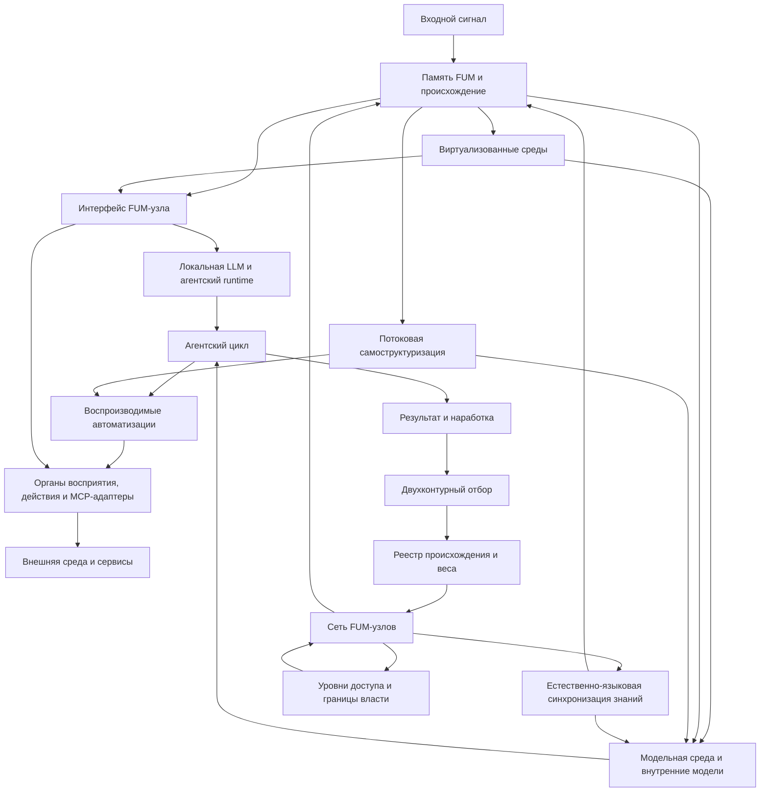

# [Arkhitektura FUM](../Glossarij/arkhitektura-FUM.md)

## Naznacheniye

Etot dokument sobirayet [arkhitekturu FUM](../Glossarij/arkhitektura-FUM.md) v odnu vkhodnuyu tochku. On ne zamenyayet detaljnyiye dokumentyi, a pokazyivayet, kak uzhe opisannyiye trebovaniya obrazuyut obsjhuyu sistemu i kuda smotretj pri izmenenii otdeljnogo sloya.

Bez takoj kartyi arkhitektura vyiglyadit raznesyonnoj po dokumentam o [pamyati](../Glossarij/pamyatj-FUM.md), [modulyakh](../Glossarij/modulj-FUM.md), [agentskikh ciklakh](../Glossarij/agentskij-cikl.md), [avtomatizaciyakh](../Glossarij/avtomatizaciya-FUM.md), [modeljnoj srede](../Glossarij/modeljnaya-sreda.md), [virtualizovannyikh sredakh](../Glossarij/virtualizovannaya-sreda-FUM.md), [MCP-serverakh](../Glossarij/MCP-server.md) i Git-evolyucii. Arkhitekturnyij razdel fiksiruyet ikh kak sloi odnoj [pamyati FUM](../Glossarij/pamyatj-FUM.md).

## Arkhitekturnoye yadro

[FUM](../Glossarij/FUM.md) proyektiruyetsya kak otkryitaya setj uzlov myishleniya, pamyati i dejstviya. Yego mozhno izobrazhatj kak rekursivnuyu nejrosetj: uzlom mozhet byitj prostoj nejronopodobnyij element, otdeljnyij agent, chelovek v rezhime vzaimodejstviya, [gibridnyij uzel](../Glossarij/gibridnyij-uzel.md), vnutrennyaya modelj, avtomatizaciya, programmnyij servisnyij adapter, apparatnyij ispolnitelj, sostavnaya socialjnaya struktura ili drugaya setj takikh zhe uzlov.

V boleye tochnom arkhitekturnom obraze eta rekursivnaya nejrosetj yavlyayetsya [nejronnoj gipersetjyu FUM](../Glossarij/nejronnaya-gipersetj-FUM.md): setjyu, gde uzlami mogut byitj drugiye seti, a razvitiye idyot v dvukh napravleniyakh. Naruzhu [FUM](../Glossarij/FUM.md) narasjhivayet svyazi s drugimi uzlami, servisami, lyudjmi i sredami; vnutrj on razvorachivayet poduzlyi, modeljnyiye i virtualizovannyiye sredyi, avtomatizacii i vnutrenniye sostoyaniya. Tak [obobsjhyonnyij darvinovskij algoritm](../Glossarij/obobsjhyonnyij-darvinovskij-algoritm.md) poluchayet arkhitekturnuyu formu: svyazi i konfiguracii poyavlyayutsya, proveryayutsya, usilivayutsya, oslablyayutsya i stanovyatsya materialom dlya sleduyusjhego urovnya seti.

Na chelovecheskom i agentskom urovnyakh etu setj svyazyivayet yestestvennyij yazyik kak yazyik [sinkhronizacii znanij FUM](../Glossarij/yestestvenno-yazyikovaya-sinkhronizaciya-znanij-FUM.md). Lyudi, LLM-podderzhivayemyiye agentyi i [gibridnyiye uzlyi](../Glossarij/gibridnyij-uzel.md) sokhranyayut lokaljnyiye i nepolnyiye sostoyaniya, predyyavlyayut chastj znaniya v vyiskazyivaniyakh, obnovlyayut modeli po otvetam i proverkam, ispravlyayut rassoglasovaniya i obrazuyut sostavnyiye uzlyi sleduyusjhego urovnya. Sinkhronizaciya oznachayet dostatochnuyu smyislovuyu sovmestimostj dlya prodolzheniya myishleniya i dejstviya, a ne ravenstvo pamyati, vesov, aktivacij ili mnenij.

Minimaljnyij proveryayemyij kontrakt takoj sovmestimosti, yeyo metriki i granicyi yestestvennogo yazyika yesjhyo ne opredelenyi; oni sobranyi v [otkryitom voprose o granicakh yestestvenno-yazyikovoj sinkhronizacii znanij](../Voprosyi/2026-07-13_20-34-23_MSK_granicyi-yestestvenno-yazyikovoj-sinkhronizacii-znanij-FUM.md).

Sam II-agent FUM dolzhen byitj postroyen po tomu zhe rekursivnomu principu. Snaruzhi on yavlyayetsya uchastnikom yazyikovoj seti, a vnutri mozhet byitj setjyu poduzlov i specializirovannyikh agentov s lokaljnyimi sostoyaniyami, obsjhej sredoj, proiskhozhdeniyem soobsjhenij i ciklami obratnoj svyazi. Yestestvennyij yazyik ne obyazan ostavatjsya syiryim tekstom mezhdu kazhdyim nizkourovnevyim komponentom: dopustima tipizirovannaya ili operatornaya forma, yesli ona sokhranyayet smyislovoj kontrakt, neodnoznachnostj, proiskhozhdeniye i vozmozhnostj obratnogo obyyasneniya. Eto otlichayet [agenta chelovecheskogo obrazca FUM](../Glossarij/agent-chelovecheskogo-obrazca-FUM.md) ot monolitnoj obolochki vokrug odnoj LLM.

Mnozhestvo modeljnyikh sessij samo po sebe ne obrazuyet takuyu vnutrennyuyu setj. [Proveryayemyij mnogoagentnyij kontur FUM](../Glossarij/proveryayemyij-mnogoagentnyij-kontur-FUM.md) trebuyet razlichimyikh rolej ili gipotez, ogranichennyikh lokaljnyikh kontekstov, adresuyemoj obsjhej pamyati, proiskhozhdeniya vkladov, otdeljnoj proverki, pravila vyibora i usloviya ostanovki. Soglasiye odinakovyikh modelej s obsjhimi vkhodami ostayotsya korrelirovannyim vnutrennim signalom, a ne nezavisimyim svideteljstvom.

Git-materializaciya etogo kontura otdelyayet dolgovechnyiye uzlyi ot kratkozhivusjhikh popyitok ispolneniya. Specializirovannyij poduzel i samostoyateljnyij proyekt imeyut otdeljnyiye repozitorii, kompozicionnaya sborka zakreplyayet ikh proverennyiye kommityi cherez tochnyiye gitlink, a [pishusjhij poduzel FUM](../Glossarij/pishusjhij-poduzel-FUM.md) poluchayet otdeljnyij klon i vetku odnogo shaga. Kommit delayet vklad adresuyemyim i sokhranyayet proiskhozhdeniye, no sam po sebe ne dokazyivayet nezavisimostj, istinnostj ili pravo na sliyaniye; eti granicyi i dvukhfaznaya peredacha opisanyi v [repozitornom grafe pishusjhikh poduzlov i proyektov FUM](44-repozitornyij-graf-pishusjhikh-poduzlov-i-proyektov-FUM.md).

Vnutrenneye ispolneniye mozhet rekursivno vetvitjsya derevom [vetvevyikh fork FUM](../Glossarij/vetvevoj-fork-FUM.md). Odin linejnyij uzel porozhdayet rovno dvukh detej ot proverennogo obsjhego Git-sostoyaniya; kazhdomu sootvetstvuyut odna avtoritetnaya para repozitoriya i rabochego ref, odin zhivoj checkout i ne boleye odnoj dopusjhennoj sessii-vladeljca, a tot zhe logicheskij roditelj stanovitsya vosstanavlivayemyim moderatorom ikh rezuljtatov. Derevom ostayotsya genealogiya s odnim kornem i odnim roditelem u kazhdogo potomka, togda kak posleduyusjheye prinyatiye i mnogoroditeljskoye sliyaniye obrazuyut otdeljnyij Git-DAG. Takaya modelj sokhranyayet fraktaljnostj uzla bez otozhdestvleniya dolgovechnogo fork-repozitoriya, vetki i efemernoj host-sessii.

Ne kazhdyij element seti imeyet odinakovyij agentskij status. Kandidatnaya [agentnostj FUM](../Glossarij/agentnostj-FUM.md) trebuyet proveryayemoj koordinacii chastej, kotoraya podderzhivayet otlichimuyu organizaciyu pri vozmusjheniyakh, a ne toljko obsjhego ispolneniya zakona ili dliteljnogo susjhestvovaniya. Dlya programmnogo FUM-uzla, pretenduyusjhego na ustojchivuyu individualjnuyu nepreryivnostj, arkhitektura dolzhna khranitj pamyatj i istoriyu perekhodov, razdeljno predstavlennyiye i potencialjno nesovpadayusjhiye [gorizontyi nablyudeniya i dejstviya](../Glossarij/gorizont-agenta-FUM.md), a takzhe profilj [lichnosti agenta FUM](../Glossarij/lichnostj-agenta-FUM.md), yesli eta gipoteza primenima; dopustimyi znacheniya «ne primenimo» i «ne ustanovleno». Eti priznaki ne prisvaivayut avtomaticheski soznaniye, prava ili avtonomiyu, a ikh dostatochnostj ostayotsya [otkryityim voprosom](../Voprosyi/2026-07-14_01-55-34_MSK_kriterii-agentnosti-i-nepreryivnosti-FUM.md).

Prioritetnyim profilem vneshnej pamyati na granice cheloveka i LLM yavlyayutsya [tekstovo-yazyikovyiye strukturiruyusjhiye operatoryi FUM](../Glossarij/tekstovo-yazyikovoj-strukturiruyusjhij-operator-FUM.md). Ikh graf vkhodit v [pamyatj FUM](../Glossarij/pamyatj-FUM.md), no ostayotsya vneshnim otnositeljno biologicheskoj pamyati cheloveka, parametrov i tekusjhego konteksta LLM. Obe storonyi v predelakh razreshyonnogo dostupa dolzhnyi rabotatj s odnoj proveryayemoj simvolicheskoj formoj, sokhranyaya razlichiye tekstovogo nositelya, yazyikovoj strukturyi, interpretacii, pervichnogo materiala i lokaljnyikh sostoyanij uchastnikov.

[Nejronnaya gipersetj FUM](../Glossarij/nejronnaya-gipersetj-FUM.md) mozhet predyyavlyatjsya ne toljko kak struktura vyichislenij, no i kak karta sredyi dlya agentov. V etom rezhime setj ostayotsya obsjhej, a agentyi razlichayutsya nastrojkami interpretacii: marshrutom obkhoda, glubinoj, [profilem vnimaniya FUM](../Glossarij/profilj-vnimaniya-FUM.md), dopustimyim riskom, pamyatjyu predyidusjhikh prokhodov i nasleduyemyimi parametrami. Yesli rabotayet populyaciya agentov, arkhitektura dolzhna khranitj ne toljko marshrut odnogo ispolnitelya, no i sostoyaniye populyacii, byudzhetyi, mutacii, potomkov, ischeznoveniye i vklad raznyikh strategij v itogovyij otvet. Takoj sloj pozvolyayet zapuskatj evolyucionnyij otbor vo vremya ispolneniya, ne smeshivaya yego s obucheniyem osnovnoj modeli ili medlennoj perestrojkoj arkhitekturyi.

[Interfejs FUM-uzla](../Glossarij/interfejs-FUM-uzla.md) stanovitsya skvoznyim arkhitekturnyim fokusom etoj seti. Uzel vazhen ne kak izolirovannyij obyyekt, a kak granica vnutrennej i vneshnej dostupnosti: chto on vidit v sobstvennoj pamyati i sostoyaniyakh, chto predyyavlyayet poduzlam, kakiye signalyi prinimayet izvne, kakiye rezuljtatyi otdayot drugim uzlam i kakiye prava dejstviya dopuskayet.

Eta granica zavisit ot [nablyudatelya FUM](../Glossarij/nablyudatelj-FUM.md). Na odnom urovne FUM predyyavlyayetsya CPU kak ispolnyayemyiye instrukcii i pamyatj, na drugom GPU kak buferyi, tenzoryi i graf vyichisleniya, na tretjyem LLM kak kontekst, skhemyi, ogranicheniya i trassyi, a cheloveku kak poljzovateljskij kontur smyisla, podtverzhdeniya i rezuljtata. Arkhitektura dolzhna sokhranyatj kartu preobrazovanij mezhdu etimi predyyavleniyami, chtobyi udobnaya forma verkhnego urovnya ne otryivalasj ot nizhnego substrata i proveryayemogo proiskhozhdeniya.

Etot princip v arkhitekture oformlyayetsya kak [nablyudateljskaya otnositeljnostj FUM](../Glossarij/nablyudateljskaya-otnositeljnostj-FUM.md). Ona perenosit na informacionnyiye sistemyi obsjhij urok otnositeljnogo opisaniya: sistema ne schitayetsya polno opisannoj, yesli skryit nablyudatelj, forma predyyavleniya, preobrazovaniye k drugim nablyudatelyam i invariantyi, kotoryiye dolzhnyi sokhranyatjsya mezhdu predstavleniyami.

Tenzornyij vyichisliteljnyij graf yavlyayetsya odnim iz prakticheskikh mostov mezhdu takimi nablyudatelyami. Dlya cheloveka i LLM avtomatizaciya dolzhna ostavatjsya proveryayemyim iskhodnyim opisaniyem s naznacheniyem, ogranicheniyami i testami; dlya kompilyatornogo sloya ona mozhet stanovitjsya promezhutochnyim predstavleniyem s tipami, formami i dopustimyimi preobrazovaniyami; dlya GPU - buferami, tenzorami, kernels i grafom ispolneniya. Arkhitektura dolzhna khranitj etu cepochku kak kartu sootvetstviya, a ne smeshivatj iskhodnuyu avtomatizaciyu, nejrosetevuyu modelj i uskorennyij ispolniteljnyij artefakt v odno nerazlichimoye ponyatiye.

[Iyerarkhiya funkcij i dannyikh FUM](../Glossarij/iyerarkhiya-funkcij-i-dannyikh-FUM.md) yavlyayetsya yesjhyo odnim skvoznyim invariantom arkhitekturyi. Na kazhdom urovne nuzhno razlichatj boleye byistro menyayusjhiyesya dannyiye i boleye ustojchivuyu funkciyu, kotoraya ikh obrabatyivayet. Pri etom sama funkciya mozhet statj dannyimi dlya boleye bazovoj funkcii: obucheniya, proverki, generatora avtomatizacij, kontrollera rosta modulej ili drugogo meta-sloya. Poetomu arkhitektura dolzhna khranitj ne toljko rezuljtat `F(x)`, no i proiskhozhdeniye funkcii `F`, dannyiye `x`, trassu primeneniya, kriterij izmeneniya funkcii i urovenj, na kotorom takoye izmeneniye razresheno.

Minimaljnyij arkhitekturnyij kontur etogo invarianta sostoit iz chetyiryokh povtoryayemyikh operacij: primenitj preobrazovaniye, ocenitj rezuljtat, izmenitj tot urovenj, gde izmeneniye deshevle i dostatochno obosnovano, zatem zakrepitj toljko ustojchivo luchshij variant. Ocenka izmeneniya dolzhna uchityivatj ne toljko prirost kachestva, no i stoimostj izmeneniya, shtraf nestabiljnosti i shtraf slozhnosti; inache plastichnostj prevrasjhayetsya v chastuyu perestrojku glubinnyikh sloyov bez dostatochnyikh osnovanij.

Yadro arkhitekturyi sostoit iz chetyiryokh povtoryayemyikh svyazej:

- vkhodnoj signal sokhranyayetsya v [pamyati](../Glossarij/pamyatj-FUM.md) vmeste s proiskhozhdeniyem;
- [agentskij cikl](../Glossarij/agentskij-cikl.md) prevrasjhayet pamyatj i zadachu v dejstviye, proverku i obnovleniye sostoyaniya, a v celevom vide sluzhit ispolnyayemyim uchastkom [obobsjhyonnogo darvinovskogo algoritma](../Glossarij/obobsjhyonnyij-darvinovskij-algoritm.md);
- ustojchivyiye dejstviya vyidelyayutsya v vosproizvodimyiye [avtomatizacii FUM](../Glossarij/avtomatizaciya-FUM.md);
- rezuljtatyi prokhodyat otbor, poluchayut formu [narabotok](../Glossarij/narabotka.md) i mogut peredavatjsya drugim [FUM-uzlam](../Glossarij/FUM-uzel.md) s uchyotom proiskhozhdeniya i [urovnej dostupa](../Glossarij/urovenj-dostupa.md).

Tekusjhaya ruchnaya skhema materializuyet malyij kontur obratnoj svyazi mezhdu etimi svyazyami cherez otdeljnyiye poljzovateljskiye zapuski: odna kornevaya zadacha v pervichnom checkout vyipolnyayet odin soderzhateljnyij zapros, sozdayot ne boleye odnogo lokaljnogo kommita i zavershayetsya. [Obyazateljnoye prodolzheniye Git-vetki posle kommita](45-obyazateljnoye-prodolzheniye-Git-vetki-posle-kommita.md), FIFO i `commit+handoff` sokhranenyi kak otlozhennaya arkhitekturnaya narabotka. Raspisaniye, obsjhij reyestr i nablyudayemyij host-prostoj ne dayut polnomochij na zapusk.

Prezhniye zhurnal zavershenij, porog `N`, specializirovannyiye claims, dispetcherskiye rezervacii i avtomaticheskoye sozdaniye periodicheskoj analitiki sokhranyayutsya toljko kak istoriya snyatogo kontura. Yesli analiticheskaya reviziya nuzhna vnovj, poljzovatelj zapuskayet dlya neyo otdeljnuyu obyichnuyu pishusjhuyu sessiyu s sobstvennyim soderzhateljnyim zaprosom; kartochka, dispetcherskij vyibor i protokol prodolzheniya ne zapuskayutsya avtomaticheski. Chislo sobyitij, shagov, kommitov ili dokumentov ostayotsya operacionnyim svideteljstvom i samo po sebe ne dokazyivayet uluchsheniye.

Mezhdu etimi svyazyami dejstvuyet yesjhyo odin skvoznoj princip: [FUM](../Glossarij/FUM.md) dolzhen agregirovatj neskoljko primerov, prototipov ili potencialjnyikh realizacij i abstragirovatj iz nikh [obsjhiye skhemyi FUM](../Glossarij/obsjhaya-skhema-FUM.md). Eto pozvolyayet otdelyatj perenosimuyu arkhitekturnuyu formu ot konkretnoj programmno-apparatnoj bazyi i ne zakreplyatj sluchajnyiye osobennosti pervogo prototipa kak pravilo vsej sistemyi.

Nizhnij sloj etoj sposobnosti - [potokovaya samostrukturizaciya FUM](../Glossarij/potokovaya-samostrukturizaciya-FUM.md). [FUM](../Glossarij/FUM.md) dolzhen umetj vyivoditj poleznyiye yedinicyi, klassyi, konstrukcii i kandidatyi v [moduli](../Glossarij/modulj-FUM.md) iz potoka dannyikh: ot bajtov i sobyitij do dejstvij agenta i skhem povedeniya. Etot sloj svyazyivayet [samotokenizaciyu](../Glossarij/samotokenizaciya-FUM.md), [suffiksno-prediktivnuyu pamyatj](../Glossarij/suffiksno-prediktivnaya-pamyatj-FUM.md) i [kontroliruyemuyu nejroplastichnostj](../Glossarij/kontroliruyemaya-nejroplastichnostj-FUM.md) s obsjhej arkhitekturoj.

Minimaljnyim yadrom etoj nizhnej sposobnosti yavlyayetsya pamyatj [strukturiruyusjhikh operatorov FUM](../Glossarij/strukturiruyusjhij-operator-FUM.md). Ona khranit predvariteljnyiye znaniya v forme operatorov raspoznavaniya i porozhdeniya: chastj operatorov mozhet byitj vyivedena iz potoka, chastj zadana chelovekom, chastj predlozhena LLM do analiza ili vo vremya analiza. Arkhitekturno eto sloj tipizacii vkhodnogo potoka: on prevrasjhayet shirokuyu posledovateljnostj bajtov, sobyitij, teksta ili dejstvij v boleye kompaktnoye opisaniye, prigodnoye dlya kontekstnogo okna LLM, no kazhdoye novoye popolneniye dolzhno prokhoditj proverku po szhatiyu, predskazaniyu, kachestvu obratnogo porozhdeniya, proiskhozhdeniyu i risku prinyatj oshibku vkhoda za novuyu strukturu. Neobyyasnyonnyij ostatok, konflikt operatorov i chastichnyiye sovpadeniya dolzhnyi sokhranyatjsya kak diagnosticheskiye dannyiye, a ne ischezatj za itogovoj interpretaciyej.

Operatornaya pamyatj dolzhna khranitj ne toljko nabor lokaljnyikh pravil, no i stratificirovannyij graf semanticheskikh svyazej mezhdu nimi. Nizkiye operatoryi mogut byitj yazyikovo-specifichnyimi: svyazyivatj okonchaniya, suffiksyi, variantyi transliteracii, kirillicheskiye i latinskiye formyi zapisi, osobennosti russkogo ili drugogo konkretnogo yazyika. Vyisokiye operatoryi dolzhnyi podderzhivatj perenos mezhdu yazyikami i domenami: svyazyivatj russkuyu i anglijskuyu konstrukciyu cherez obsjhij smyisl, semanticheskuyu rolj, perevodimyij shablon ili strukturu dejstviya, ne stiraya proiskhozhdeniye, urovenj abstrakcii, yazyikovo-specifichnyiye ostatki i poteri kazhdoj svyazi.

Kak arkhitekturnyij sloj sistema strukturiruyusjhikh operatorov yavlyayetsya interfejsom obyyasnimosti mezhdu chelovekom i LLM. Chelovek, LLM i ikh sovmestnyij kontur mogut predyyavlyatj znaniya v simvolicheskoj forme operatorov, a proveryayusjhiye algoritmyi dolzhnyi svyazyivatj eti formyi s vkhodnyimi potokami, primerami, povedeniyem modeli i rezhimami primeneniya. Poetomu operatornaya pamyatj stanovitsya obobsjhyonnyim yazyikom predstavleniya znanij: ona delayet chastj skryitogo znaniya LLM dostupnoj dlya proverki i primeneniya bez trebovaniya kazhdyij raz zanovo raskhodovatj vnimaniye cheloveka i kontekst modeli.

V obobsjhyonnoj arkhitekturnoj forme [sistema strukturiruyusjhikh operatorov FUM](../Glossarij/sistema-strukturiruyusjhikh-operatorov-FUM.md) stanovitsya promezhutochnyim yazyikom mezhdu boljshinstvom sloyov etoj kartyi. Ona svyazyivayet povtoryayemosti potoka, pamyatj proiskhozhdeniya, LLM-obyyasneniye, yazyik avtomatizacij, rost modulej, nablyudateljskiye predstavleniya i proveryayemoye dejstviye cherez odin princip: ustojchivuyu formu mozhno primenyatj, porozhdatj, proveryatj, utochnyatj, peredavatj, otobrazhatj na ekrane i otkatyivatj toljko vmeste s yeyo proiskhozhdeniyem, cenoj, ostatkami i granicami primenimosti. Poetomu [yazyik avtomatizacij FUM](../Glossarij/yazyik-avtomatizacij-FUM.md) sleduyet proyektirovatj kak ispolnyayemyij verkhnij sloj etoj sistemyi: yego konstrukcii dolzhnyi byitj operatorami s proveryayemyim profilem, a ne otdeljnyim naborom komand.

Operatoryi predyyavleniya obrazuyut sosednij verkhnij sloj toj zhe sistemyi: oni perevodyat operatornyij graf v ekran, tablicu, derevo, vremennuyu shkalu ili drugoj interfejs dlya konkretnogo nablyudatelya i vozvrasjhayut dejstviya cheloveka obratno v formaljnyiye sobyitiya pamyati. Blagodarya etomu graficheskij interfejs ostayotsya arkhitekturnoj proyekciyej znaniya, a ne otdeljnoj illyustraciyej, kotoruyu nevozmozhno proveritj ili svyazatj s proiskhozhdeniyem.

[Pervyij korobochnyij prototip](43-pasport-nachaljnogo-korobochnogo-prototipa-FUM.md) proveryayet etu arkhitekturu v obratnom ot vitrinyi poryadke. Minimaljnyij Swift-kontur bez GUI dolzhen vosproizvodimo projti cepochku `версионированный вход → пополнение памяти → внутреннее исполнение → канонический снимок → трасса`; toljko zatem tot zhe kontur mozhet poroditj deklarativnuyu modelj predyyavleniya i prinyatj obratnoye interfejsnoye sobyitiye. Poyavleniye okna ranjshe etoj granicyi dopustimo lishj kak vneshnyaya diagnosticheskaya obolochka i ne schitayetsya zhiznesposobnyim GUI FUM, yesli yego sostoyaniye i dejstviya zhivut otdeljno ot vnutrennikh mekhanizmov pamyati i ispolneniya.

[Kartochki sootvetstviya FUM](../Glossarij/kartochka-sootvetstviya-FUM.md) dayut etomu principu rabochij nositelj. Oni svyazyivayut konkretnyij instrument, infrastrukturnyij sloj, sredu ili fizicheskuyu analogiyu s obsjhej skhemoj cherez roli, invariantyi, poteri, granicyi primenimosti i proverku. Poetomu karta sootvetstvij stanovitsya ne toljko poyasniteljnyim naborom fajlov, no i chastjyu arkhitekturnoj disciplinyi FUM.

Yesjhyo odin skvoznoj princip - sposobnostj uzlov stroitj [virtualizovannyiye sredyi FUM](../Glossarij/virtualizovannaya-sreda-FUM.md) dlya vlozhennyikh uzlov. Takoj sloj skryivayet boleye syiroj substrat i predyyavlyayet poverkh nego organizovannyij interfejs: ot [modeljnoj sredyi](../Glossarij/modeljnaya-sreda.md) do fajlovoj sistemyi, grafa [pamyati](../Glossarij/pamyatj-FUM.md), zhurnala sobyitij ili drugogo sposoba organizacii dolgovremennogo sostoyaniya.

V etom smyisle blizhajsheye inzhenernoye voplosjheniye [FUM](../Glossarij/FUM.md) dolzhno rassmatrivatjsya kak organizaciya vyichislenij razuma na [kremniyevom substrate FUM](../Glossarij/kremniyevyij-substrat-FUM.md). Arkhitektura dolzhna perevoditj uzhe nablyudayemyiye principyi fraktaljnoj organizacii, otbora, nasledovaniya i setevogo nablyudeniya v formu, sovmestimuyu s CPU, GPU, pamyatjyu, nakopitelyami, lokaljnyimi LLM, instrumentami i trassami. Novyij uzel ne dolzhen pryatatj etot nizhnij sloj: karta sootvetstviya mezhdu fizicheskoj vyichisliteljnoj bazoj i smyislovyimi urovnyami [FUM](../Glossarij/FUM.md) yavlyayetsya chastjyu arkhitekturyi.

Vazhnaya celevaya vekha arkhitekturyi - [lokaljnyij agent FUM na vyidelennoj mashine](24-lokaljnyij-agent-na-vyidelennoj-mashine.md). V etoj forme [lichnyij FUM-agent](../Glossarij/lichnyij-FUM-agent.md), lokaljnaya [pamyatj](../Glossarij/pamyatj-FUM.md), instrumentyi, proverki i siljnaya LLM rabotayut na upravlyayemom lokaljnom [FUM-uzle](../Glossarij/FUM-uzel.md). Vneshniye servisyi i modeli mogut ostavatjsya rasshireniyami, no osnovnoj agentskij cikl ne dolzhen byitj neyavno privyazan k oblachnoj modeli.

Kriterii vyibora lokaljnoj modeli, runtime, apparatnogo profilya i vneshnego fallback ostayutsya v [otkryitom voprose o lokaljnoj LLM i vyidelennoj mashine](../Voprosyi/2026-06-25_19-50-33_MSK_kriterii-lokaljnoj-LLM-i-vyidelennoj-mashinyi-FUM.md).

Tekusjhij kontur Codex i Obsidian-khranilisjha yavlyayetsya blizhajshim sejchas proveryayemyim proobrazom etoj arkhitekturnoj formyi na urovne [gibridnogo uzla](../Glossarij/gibridnyij-uzel.md) chelovek-LLM. V nyom chelovek zadayot namereniye i podtverzhdayet smyisl rezuljtata, LLM porozhdayet tekst v agentskoj sessii Codex, Codex organizuyet chteniye pamyati, instrumentaljnyiye dejstviya i proverki, a repozitorij pamyati, dostupnyij cherez Obsidian i Git, sokhranyayet proiskhozhdeniye, dokumentyi, zhurnal i izmeneniya. Etot kontur ne dolzhen zakreplyatj Codex ili Obsidian kak obyazateljnyiye tekhnologii FUM, no dolzhen ispoljzovatjsya kak pervyij material dlya opisaniya pasporta interfejsa, granic vosproizvodimosti i trebovanij k budusjhemu lokaljnomu uzlu.

Na tekusjhej dokumentacionnoj stadii smyislovoye yadro etoj obsjhej [pamyati FUM](../Glossarij/pamyatj-FUM.md) mozhno priblizhyonno opisatj kak summu dvukh tekstovyikh vkladov: teksta cheloveka i proizvodnogo teksta LLM v agentskoj sessii Codex. Eto ne prevrasjhayet Codex v otdeljnogo soderzhateljnogo avtora: on oboznachayet vneshnij cikl chteniya konteksta, modeljnogo shaga, vyizova instrumentov, proverki i fiksacii rezuljtata. Prilozheniye ChatGPT yavlyayetsya poverkhnostjyu etoj sessii, a aktivnaya modelj, runtime i instrumentyi ostayutsya razlichimyimi tekhnicheskimi sloyami.

Daljnij lichnyij gorizont etoj zhe linii - [gibridnyij mozg](../Glossarij/gibridnyij-mozg.md), v kotorom [uglerodnyij mozg](../Glossarij/uglerodnyij-mozg.md) cheloveka i kremniyevaya cifrovaya chastj lichnogo FUM razvivayutsya vmeste. Arkhitektura dolzhna pozvolyatj opisyivatj takuyu svyazku kak dliteljnyij kontur sovmestnoj pamyati, proiskhozhdeniya reshenij, podtverzhdenij, dopustimoj avtonomii i [urovnej dostupa](../Glossarij/urovenj-dostupa.md). Pri etom status [cifrovogo prodolzheniya lichnosti](../Glossarij/cifrovoye-prodolzheniye-lichnosti.md) posle prekrasjheniya zhiznennogo puti uglerodnoj chasti ostayotsya otdeljnoj neopredelyonnostjyu, zafiksirovannoj v [otkryitom voprose o granicakh posmertnoj avtonomii cifrovoj chasti FUM](../Voprosyi/2026-07-03_08-21-17_MSK_granicyi-posmertnoj-avtonomii-cifrovoj-chasti-FUM.md).

Parnaya mezhpolusharnaya modelj dayot etomu gorizontu arkhitekturnyij invariant: sostavnyiye chasti sokhranyayut lokaljnyiye sostoyaniya i dostigayut koordinacii cherez yavnyij ogranichennyij interfejs. V gibridnom mozge uglerodnaya i cifrovaya chasti geterogennyi, poetomu analogiya ne trebuyet ikh odinakovogo ustrojstva i ne prevrasjhayet ikh kanal v bukvaljnoye mozolistoye telo. Granicyi perenosa zadayot [kartochka parnoj mezhpolusharnoj arkhitekturyi](28-reyestr-kartochek-sootvetstviya-FUM/FUM-MAP-BRAIN-01.md).

Pervaya [korobochnaya realizaciya FUM](../Glossarij/korobochnaya-realizaciya-FUM.md) dolzhna sobratj etot perenosimyij kontur v yedinoye lokaljnoye prilozheniye. Na arkhitekturnom urovne eto ne oznachayet monolit bez modulej: prilozheniye yavlyayetsya vneshnej poljzovateljskoj obolochkoj i tochkoj zapuska, vnutri kotoroj ostayutsya [moduli](../Glossarij/modulj-FUM.md), lokaljnyiye [avtomatizacii](../Glossarij/avtomatizaciya-FUM.md), pamyatj, proverki, runtime i servisnyiye adapteryi s yavnyimi kontraktami. Celj takoj formyi - ubratj ruchnuyu sborku rabochego kontura iz razroznennyikh instrumentov i sdelatj samu postavku nablyudayemyim [FUM-uzlom](../Glossarij/FUM-uzel.md).

## Karta sloyov

| Sloj                                                                                                           | Arkhitekturnaya rolj                                                                                                                                                                                                                                                                                                                                                                                                                           | Detaljnyiye dokumentyi                                                                                                                                                                                                                                                                                       |
| -------------------------------------------------------------------------------------------------------------- | -------------------------------------------------------------------------------------------------------------------------------------------------------------------------------------------------------------------------------------------------------------------------------------------------------------------------------------------------------------------------------------------------------------------------------------------- | --------------------------------------------------------------------------------------------------------------------------------------------------------------------------------------------------------------------------------------------------------------------------------------------------------- |
| [Pamyatj FUM](../Glossarij/pamyatj-FUM.md) i proiskhozhdeniye                                                       | Khranit vkhodyi, resheniya, proverki, dokumentyi, zhurnal, istochniki i svyazi trebovanij.                                                                                                                                                                                                                                                                                                                                                            | [Modelj pamyati FUM](01-modelj-pamyati-FUM.md), [Obzor proyekta FUM](00-obzor-proyekta.md)                                                                                                                                                                                                                    |
| [Moduli](../Glossarij/modulj-FUM.md), uzlyi i fraktaljnostj                                                     | Delayut malyiye i boljshiye chasti sistemyi pokhozhimi po forme: prostoj nejronopodobnyij uzel mozhet vkhoditj v setj, a setj stanovitjsya uzlom sleduyusjhego urovnya; v obraze [nejronnoj giperseti FUM](../Glossarij/nejronnaya-gipersetj-FUM.md) uzel razvorachivayetsya i naruzhu, i vnutrj.                                                                                                                                                                  | [Moduljnaya arkhitektura FUM](05-moduljnaya-arkhitektura-FUM.md), [Decentralizaciya FUM i granicyi vlasti](15-decentralizaciya-i-granicyi-vlasti.md)                                                                                                                                                              |
| [Interfejs FUM-uzla](../Glossarij/interfejs-FUM-uzla.md)                                                       | Zadayot vnutrennyuyu i vneshnyuyu granicu uzla: profilj [nablyudatelya](../Glossarij/nablyudatelj-FUM.md), nablyudayemyiye sostoyaniya, dostupnyiye operacii, vkhodnyiye signalyi, vyikhodnyiye rezuljtatyi, prava, podtverzhdeniya i trassyi.                                                                                                                                                                                                                            | [Interfejs FUM-uzla](25-interfejs-FUM-uzla.md), [Dostup k vnutrennim sostoyaniyam](07-dostup-k-vnutrennim-sostoyaniyam.md), [FUM kak yedinaya tochka vzaimodejstviya s kompjyuterom](19-yedinaya-tochka-vzaimodejstviya-s-kompjyuterom.md)                                                                              |
| [Nablyudateljskaya otnositeljnostj FUM](../Glossarij/nablyudateljskaya-otnositeljnostj-FUM.md)                     | Trebuyet opisyivatj informacionnyiye sistemyi cherez nablyudatelya, formu predstavleniya, preobrazovaniya mezhdu nablyudatelyami, sokhranyayemyiye invariantyi i poteri nablyudayemosti.                                                                                                                                                                                                                                                                          | [Nablyudateljskaya otnositeljnostj informacionnyikh sistem](26-nablyudateljskaya-otnositeljnostj-informacionnyikh-sistem.md), [minimaljnyij format preobrazovaniya](38-minimaljnyij-format-preobrazovaniya-mezhdu-nablyudatelyami-FUM.md), [Interfejs FUM-uzla](25-interfejs-FUM-uzla.md)                                |
| [Agentskij cikl](../Glossarij/agentskij-cikl.md)                                                               | Svyazyivayet nablyudeniye, postanovku zadachi, vyibor dejstviya, vyipolneniye, proverku i sokhraneniye rezuljtata; dolzhen pozvolyatj otbiratj agentov po sposobnosti porozhdatj dlinnyiye, poleznyiye i produktivnyiye proveryayemyiye cepochki rassuzhdenij i dejstvij.                                                                                                                                                                                               | [Obzor aktualjnyikh realizacij agentskikh ciklov](06-obzor-agentskikh-ciklov.md), [Dostup k vnutrennim sostoyaniyam](07-dostup-k-vnutrennim-sostoyaniyam.md)                                                                                                                                                      |
| [Avtomatizacii FUM](../Glossarij/avtomatizaciya-FUM.md)                                                         | Prevrasjhayut povtoryayemyiye rabochiye priyomyi v lokaljno vosproizvodimyiye, testiruyemyiye i perenosimyiye strukturyi.                                                                                                                                                                                                                                                                                                                                       | [Vosproizvodimyiye avtomatizacii FUM](17-vosproizvodimyiye-avtomatizacii.md), [LLM-oriyentirovannyij yazyik avtomatizacij](21-LLM-oriyentirovannyij-yazyik-avtomatizacij.md)                                                                                                                                          |
| [Obsjhiye skhemyi FUM](../Glossarij/obsjhaya-skhema-FUM.md)                                                             | Podnimayut neskoljko primerov ili realizacij do perenosimogo opisaniya invariantov, variacij i granic primenimosti.                                                                                                                                                                                                                                                                                                                            | [Obobsjhyonnyij poisk povtoryayusjhikhsya posledovateljnostej](08-obobsjhyonnyij-poisk-povtoryayusjhikhsya-posledovateljnostej.md), [Vosproizvodimyiye avtomatizacii FUM](17-vosproizvodimyiye-avtomatizacii.md)                                                                                                                  |
| [Iyerarkhiya funkcij i dannyikh FUM](../Glossarij/iyerarkhiya-funkcij-i-dannyikh-FUM.md)                                 | Razlichayet byistryiye dannyiye, boleye ustojchivyiye funkcii i meta-funkcii, kotoryiye menyayut funkcii proizvodnyikh urovnej cherez proverku, proiskhozhdeniye, byudzhet i otkat.                                                                                                                                                                                                                                                                                 | [Moduljnaya arkhitektura FUM](05-moduljnaya-arkhitektura-FUM.md), [Potokovaya samostrukturizaciya FUM](32-potokovaya-samostrukturizaciya-FUM.md), [Obzor aktualjnyikh realizacij agentskikh ciklov](06-obzor-agentskikh-ciklov.md)                                                                                    |
| [Potokovaya samostrukturizaciya FUM](../Glossarij/potokovaya-samostrukturizaciya-FUM.md)                           | Vyivodit yedinicyi potoka, podderzhivayet pamyatj [strukturiruyusjhikh operatorov](../Glossarij/strukturiruyusjhij-operator-FUM.md), porozhdayet kompaktnyiye opisaniya vkhoda i predlagayet kandidatyi v moduli cherez predskazaniye, szhatiye, byudzhet, proiskhozhdeniye i proverku.                                                                                                                                                                                    | [Potokovaya samostrukturizaciya FUM](32-potokovaya-samostrukturizaciya-FUM.md), [Obobsjhyonnyij poisk povtoryayusjhikhsya posledovateljnostej](08-obobsjhyonnyij-poisk-povtoryayusjhikhsya-posledovateljnostej.md), [Moduljnaya arkhitektura FUM](05-moduljnaya-arkhitektura-FUM.md)                                                  |
| [Sistema strukturiruyusjhikh operatorov FUM](../Glossarij/sistema-strukturiruyusjhikh-operatorov-FUM.md)               | Dayot obsjhij yazyik proveryayemyikh form mezhdu potokom, pamyatjyu, LLM-obyyasneniyem, avtomatizaciyami, modulyami, nablyudateljskimi predstavleniyami, ekrannyimi kartami znanij i dejstviyem; predstavlyayet [rolevuyu semantiku setevogo vzaimodejstviya](../Glossarij/rolevaya-semantika-setevogo-vzaimodejstviya-FUM.md) cherez kontekstnyiye roli govoryasjhego, adresatov i grupp.                                                                                   | [Sistema strukturiruyusjhikh operatorov FUM](33-sistema-strukturiruyusjhikh-operatorov-FUM.md), [Potokovaya samostrukturizaciya FUM](32-potokovaya-samostrukturizaciya-FUM.md), [LLM-oriyentirovannyij yazyik avtomatizacij](21-LLM-oriyentirovannyij-yazyik-avtomatizacij.md)                                                |
| [Yestestvenno-yazyikovaya sinkhronizaciya znanij FUM](../Glossarij/yestestvenno-yazyikovaya-sinkhronizaciya-znanij-FUM.md) | Svyazyivayet lokaljnyiye znaniya lyudej, LLM-podderzhivayemyikh agentov, gibridnyikh i vnutrennikh uzlov cherez vyiskazyivaniya, interpretacii, voprosyi, podtverzhdeniya, ispravleniya i sovmestnyiye dejstviya; sokhranyayet proiskhozhdeniye, neizvestnostj i raskhozhdeniya bez trebovaniya odinakovyikh vnutrennikh sostoyanij.                                                                                                                                                | [Yestestvennyij yazyik i sinkhronizaciya znanij FUM](34-yestestvennyij-yazyik-i-sinkhronizaciya-znanij-FUM.md), [Vnutrenniye modeli drugikh uzlov](10-vnutrenniye-modeli-drugikh-uzlov.md), [Gibridnyiye uzlyi i socialjnaya fraktaljnostj](12-gibridnyiye-uzlyi-i-socialjnaya-fraktaljnostj.md)                                  |
| [Kartochki sootvetstviya FUM](../Glossarij/kartochka-sootvetstviya-FUM.md)                                         | Sopostavlyayut konkretnyiye instrumentyi, sredyi, infrastrukturnyiye sloi i fizicheskiye analogii s obsjhej skhemoj cherez yavnyiye invariantyi, poteri, granicyi primenimosti i proverku.                                                                                                                                                                                                                                                                      | [Reyestr kartochek sootvetstviya FUM](28-reyestr-kartochek-sootvetstviya-FUM/README.md), [Git-infrastruktura evolyucionnyikh cepochek FUM](20-Git-infrastruktura-evolyucionnyikh-cepochek-FUM.md), [Nablyudateljskaya otnositeljnostj informacionnyikh sistem](26-nablyudateljskaya-otnositeljnostj-informacionnyikh-sistem.md) |
| Vospriyatiye, dejstviye i servisnyiye adapteryi                                                                      | Soyedinyayut agenta s vneshnimi servisami, interfejsami, ustrojstvami i fizicheskoj sredoj cherez nablyudayemyiye kontraktyi.                                                                                                                                                                                                                                                                                                                           | [FUM kak yedinaya tochka vzaimodejstviya s kompjyuterom](19-yedinaya-tochka-vzaimodejstviya-s-kompjyuterom.md), [Fizicheskoye dejstviye FUM i apparatnyiye uzlyi](13-fizicheskoye-dejstviye-i-apparatnyiye-uzlyi.md)                                                                                                            |
| [Modeljnaya sreda](../Glossarij/modeljnaya-sreda.md) i vnutrenniye modeli                                         | Pozvolyayut opisyivatj aktualjnyij mir, rekonstruirovatj proshloye, planirovatj budusjheye i modelirovatj sosedniye uzlyi.                                                                                                                                                                                                                                                                                                                              | [Sreda dlya vnutrennikh FUM](11-sreda-dlya-vnutrennikh-FUM.md), [Vnutrenniye modeli drugikh uzlov](10-vnutrenniye-modeli-drugikh-uzlov.md)                                                                                                                                                                        |
| [Virtualizovannyiye sredyi FUM](../Glossarij/virtualizovannaya-sreda-FUM.md) i dolgovremennaya pamyatj               | Pozvolyayut uzlu predyyavlyatj vlozhennyim uzlam boleye organizovannyij interfejs poverkh syirogo nositelya, fajlovoj sistemyi, servisa, modeli ili drugogo nizhnego sloya.                                                                                                                                                                                                                                                                                | [Virtualizovannyiye sredyi FUM i dolgovremennaya pamyatj](23-virtualizovannyiye-sredyi-i-dolgovremennaya-pamyatj.md), [Sreda dlya vnutrennikh FUM](11-sreda-dlya-vnutrennikh-FUM.md), [Fizicheskoye dejstviye FUM i apparatnyiye uzlyi](13-fizicheskoye-dejstviye-i-apparatnyiye-uzlyi.md)                                          |
| [Kremniyevyij substrat FUM](../Glossarij/kremniyevyij-substrat-FUM.md) i lokaljnyij agentskij runtime               | Sobirayet vyidelennuyu mashinu, lokaljnuyu LLM, runtime, lokaljnuyu pamyatj, instrumentyi i proverki v samodostatochnyij rabochij uzel, gde vyichisleniya razuma organizuyutsya na yavnoj apparatno-programmnoj baze.                                                                                                                                                                                                                                         | [Lokaljnyij agent FUM na vyidelennoj mashine](24-lokaljnyij-agent-na-vyidelennoj-mashine.md), [FUM kak yedinaya tochka vzaimodejstviya s kompjyuterom](19-yedinaya-tochka-vzaimodejstviya-s-kompjyuterom.md), [Virtualizovannyiye sredyi FUM i dolgovremennaya pamyatj](23-virtualizovannyiye-sredyi-i-dolgovremennaya-pamyatj.md)  |
| Socialjnyiye i gibridnyiye uzlyi                                                                                    | Opisyivayut cheloveka, lichnogo agenta, [gibridnyij mozg](../Glossarij/gibridnyij-mozg.md), komandu, organizaciyu i drugiye kollektivyi kak elementyi seti FUM s vnutrennimi granicami; pozvolyayut sobiratj kollektivnyij spros na vesjhi s zadannyimi kharakteristikami; dlya chelovecheskogo, gibridnogo i agentskogo urovnya dopuskayut psikhologicheskiye, psikhofiziologicheskiye i psikhiatricheskiye ramki opisaniya rezhimov razuma s yavnyimi granicami primenimosti. | [Gibridnyiye uzlyi i socialjnaya fraktaljnostj](12-gibridnyiye-uzlyi-i-socialjnaya-fraktaljnostj.md), [Obmen narabotkami i urovni dostupa](09-obmen-narabotkami-i-urovni-dostupa.md), [Evolyuciya i myishleniye](03-evolyuciya-i-myishleniye.md)                                                                            |
| Evolyucionnyiye cepochki                                                                                           | Delayut vetki, proverki, revjyu, peredachu rezuljtatov i reyestr proiskhozhdeniya nositelem otbora i nasledovaniya.                                                                                                                                                                                                                                                                                                                                  | [Paralleljnaya rabota i sliyaniye](04-paralleljnaya-rabota-i-sliyaniye.md), [Git-infrastruktura evolyucionnyikh cepochek FUM](20-Git-infrastruktura-evolyucionnyikh-cepochek-FUM.md)                                                                                                                                    |
| Issledovateljskij i daljnij fizicheskij gorizont                                                                | Rasshiryayet arkhitekturu k issledovaniyam, otkryitiyam, apparatnyim uzlam, potrebiteljskim i sobstvennyim proizvodstvennyim cepochkam, protivodejstviyu [zaplanirovannomu ustarevaniyu](../Glossarij/zaplanirovannoye-ustarevaniye.md), [zemnyim resursnyim poligonam FUM](../Glossarij/zemnoj-resursnyij-poligon-FUM.md) i kosmicheskoj avtonomii bez prezhdevremennogo rasshireniya prav dejstviya.                                                              | [Nauchnyiye issledovaniya i otkryitiya](16-nauchnyiye-issledovaniya-i-otkryitiya.md), [Fizicheskoye dejstviye FUM i apparatnyiye uzlyi](13-fizicheskoye-dejstviye-i-apparatnyiye-uzlyi.md), [Kosmicheskaya avtonomiya FUM i mezhzvyozdnoye rasseleniye](14-kosmicheskaya-avtonomiya-i-rasseleniye.md)                                        |

## Skhema sloyov

## Moduljnostj kak chastnyij sloj arkhitekturyi

[Moduljnaya arkhitektura FUM](05-moduljnaya-arkhitektura-FUM.md) ostayotsya centraljnyim detaljnyim dokumentom, no ona opisyivayet ne vsyu arkhitekturu celikom, a odin iz yeyo principov: povtoryayemuyu formu uzla, sposobnogo khranitj sostoyaniye, obrazovyivatj svyazi i vkhoditj v setj. V nejrosetevom izobrazhenii etot uzel mozhet byitj minimaljnyim nejronopodobnyim elementom ili celoj setjyu uzlov togo zhe roda.

Ostaljnyiye arkhitekturnyiye sloi otvechayut za to, chtobyi eta moduljnostj byila rabochej, a ne toljko metaforicheskoj: pamyatj sokhranyayet proiskhozhdeniye, agentskij cikl zadayot khod rabotyi, avtomatizacii delayut dejstviya vosproizvodimyimi, modeljnaya sreda otdelyayet plan ot fakta, urovni dostupa uderzhivayut granicyi vlasti, a Git-infrastruktura dayot mekhanizm otbora i nasledovaniya.

## Arkhitekturnyiye ogranicheniya

- Arkhitektura ne dolzhna prevrasjhatjsya v yedinuyu skryituyu iyerarkhiyu: sostavnoj [FUM-uzel](../Glossarij/FUM-uzel.md) ne poluchayet avtomaticheskoj totaljnoj vlasti nad [poduzlami](../Glossarij/poduzel-FUM.md).
- Kazhdyij ustojchivyij [FUM-uzel](../Glossarij/FUM-uzel.md) dolzhen imetj opisannyij vnutrennij i vneshnij interfejs: nablyudayemyiye sostoyaniya, dopustimyiye operacii, urovni dostupa, vkhodyi, vyikhodyi, podtverzhdeniya, trassyi i otkaznyiye rezhimyi.
- Kazhdyij ustojchivyij interfejs dolzhen ukazyivatj, dlya kakogo [nablyudatelya FUM](../Glossarij/nablyudatelj-FUM.md) on postroyen: CPU, GPU, LLM, cheloveka, poduzla, servisa ili drugogo uzla; inache urovenj abstrakcii, prava i poteri nablyudayemosti ostayutsya neyavnyimi.
- Kazhdoye ustojchivoye opisaniye informacionnoj sistemyi dolzhno yavno pokazyivatj nablyudatelya, formu predyyavleniya, [preobrazovaniya k drugim nablyudatelyam](../Glossarij/preobrazovaniye-mezhdu-nablyudatelyami-FUM.md), sokhranyayemyiye invariantyi i izvestnyiye poteri nablyudayemosti.
- Dlya znachimogo yazyikovogo akta, kotoryij razresheno fiksirovatj i kotoryij vliyayet na pamyatj ili dejstviye, dolzhna sokhranyatjsya iskhodnaya forma libo dopustimaya proizvodnaya zapisj, interpretaciya, referentyi, rechevoj akt, modaljnostj, proiskhozhdeniye, uverennostj i vyizvannoye izmeneniye modeli. Vyibor formyi i sroka khraneniya dolzhen uchityivatj privatnostj i [urovni dostupa](../Glossarij/urovenj-dostupa.md); mestoimennyiye roli `я`, `ты`, `мы`, `вы`, `они` yavlyayutsya toljko chastnyim sloyem i ne zamenyayut identifikatoryi uzlov, sostav grupp, polnomochiya i protokol dostavki.
- Tekstovo-yazyikovaya operatornaya pamyatj dolzhna byitj sovmestno chitayemoj, porozhdayemoj i ispravlyayemoj chelovekom i LLM, podderzhivatj adresaciyu, poisk, ssyilki, versii i povtornoye vvedeniye v kontekst, no yeyo prakticheskij prioritet ne dolzhen prevrasjhatjsya v zamenu pervichnyikh i muljtimodaljnyikh istochnikov ili v trebovaniye khranitj vsyu pamyatj kak tekst.
- Sinkhronizaciya znanij ne dolzhna priravnivatjsya k kopirovaniyu vnutrennikh sostoyanij ili obyazateljnomu konsensusu: arkhitektura obyazana sokhranyatj lokaljnuyu pamyatj, neizvestnostj, versii, zaderzhki i yavno ponyatyiye raskhozhdeniya.
- LLM ne dolzhna molcha priravnivatjsya ko vsemu agentu: samostoyateljnyij ustojchivyij uzel trebuyet pamyati, kontekstnoj identichnosti, proiskhozhdeniya, agentskogo cikla, instrumentov, granic dostupa i mekhanizma ispravleniya rassoglasovanij.
- Vneshnyaya setj FUM i vnutrennyaya setj yego poduzlov dolzhnyi sledovatj odnomu obsjhemu invariantu lokaljnogo znaniya, soobsjheniya, interpretacii, obnovleniya pamyati, obratnoj svyazi i proverki.
- Lyuboj ustojchivyij sloj dolzhen sokhranyatj proiskhozhdeniye: istochnik trebovaniya, vkhodnyiye dannyiye, resheniye, proverku, rezuljtat i ogranicheniya primenimosti.
- Vosproizvodimyiye chasti dolzhnyi stremitjsya k lokaljnyim testam i [TDD](../Glossarij/TDD.md), a nevosproizvodimyiye vneshniye chasti dolzhnyi imetj publikacionno chistyij kontrakt, fiksturyi ili otchyot o granice vosproizvodimosti.
- Kazhdyij sloj, kotoryij primenyayet ili menyayet funkciyu, dolzhen yavno ukazyivatj, chto schitayetsya dannyimi, chto schitayetsya telom funkcii, kakoj boleye bazovyij mekhanizm mozhet menyatj eto telo i po kakim proverkam takoye izmeneniye prinimayetsya.
- Uskorennoye ispolneniye cherez tenzornyij graf dolzhno ostavatjsya proizvodnyim ot proveryayemoj avtomatizacii: nuzhen iskhodnyij podyyazyik, formyi dannyikh, ogranicheniya chistotyi, etalonnoye ispolneniye, versii kompilyatora i runtime, apparatnyij profilj, benchmark, fallback i trassa ekvivalentnosti.
- Poljzovateljskij i servisnyij konturyi dolzhnyi prokhoditj cherez yavnyiye [urovni dostupa](../Glossarij/urovenj-dostupa.md), podtverzhdeniya i trassyi dejstvij.
- Otsutstviye trebuyemogo podtverzhdeniya do yego polucheniya dolzhno zakryivatj toljko svyazannyij vneshnij perekhod, a ne bezopasnuyu produktivnuyu modeljnuyu chastj vsego epizoda. Arkhitektura nezavisimo predstavlyayet ozhidayusjhij perekhod, modeljnyiye vetvi i vneshnij effekt; v predelakh zaraneye razreshyonnyikh dlya epizoda identichnosti provajdera, rezhima, raskryivayemyikh dannyikh i limitov vyizovov, tokenov i deneg vetvi nasleduyut obsjhego tochnogo predka, sokhranyayut razlichiya i proverki i prokhodyat vnutrennij otbor bez povyisheniya rezuljtata do poljzovateljskogo namereniya, podtverzhdeniya ili avtorizacii. Ozhidaniye otveta ne rasshiryayet eti predelyi.
- [Darvinovskij planirovsjhik FUM](../Glossarij/darvinovskij-planirovsjhik-FUM.md) mozhet naznachatj [fonovyiye zadaniya](../Glossarij/fonovoye-zadaniye-FUM.md) toljko pri otsutstvii neobrabotannogo poljzovateljskogo vvoda i gotovyikh zadach boleye vyisokogo prioriteta. Fon dolzhen imetj ogranichennyij byudzhet, bezopasnuyu kontroljnuyu tochku i nablyudayemuyu trassu, ustupatj boleye prioritetnoj rabote pri pervoj bezopasnoj kontroljnoj tochke i ne rasshiryatj polnomochiya uzla.
- Modeljnyiye dejstviya vo vnutrennej srede dolzhnyi otlichatjsya ot realjnyikh dejstvij vo vneshnem mire, osobenno v fizicheskikh i socialjno znachimyikh konturakh.
- Runtime-evolyuciya agentnyikh interpretacij dolzhna otlichatjsya ot obucheniya ili izmeneniya osnovnoj nejroseti: u agenta mogut menyatjsya nasleduyemyiye nastrojki chteniya setevoj sredyi, no eto trebuyet otdeljnoj trassyi, proverki, byudzhetov, zasjhityi ot paraziticheskikh strategij i otkata.
- Zemnyiye resursnyiye poligonyi i dostavka modulej razvyortyivaniya dolzhnyi ostavatjsya modeljnyim ili strogo podtverzhdyonnyim fizicheskim konturom s yavnyimi pravilami vyibora plosjhadki, prava, ekologii, bezopasnosti, otvetstvennosti, nablyudayemosti i svorachivaniya rabot; konkretnyiye predelyi sobranyi v [otkryitom voprose o granicakh zemnyikh resursnyikh poligonov](../Voprosyi/2026-07-02_20-08-37_MSK_granicyi-zemnyikh-resursnyikh-poligonov-FUM.md).
- Kazhdyij sloj [virtualizovannoj sredyi](../Glossarij/virtualizovannaya-sreda-FUM.md) dolzhen sokhranyatj svyazj s nizhelezhasjhim substratom: proiskhozhdeniye, kartu sootvetstviya, proverki celostnosti, vosstanovimostj, ogranicheniya i otkaznyiye rezhimyi.
- Lokaljnyij agent na vyidelennoj mashine dolzhen fiksirovatj, kakaya modelj, runtime, apparatnyij profilj i nabor instrumentov uchastvovali v rezuljtate; obrasjheniya k vneshnim modelyam i servisam ne dolzhnyi skryivatjsya pod vidom polnostjyu lokaljnogo vyipolneniya.
- Potokovaya samostrukturizaciya dolzhna imetj yavnyiye byudzhetyi pamyati, vyichislenij i riska: najdennaya povtoryayemostj ne stanovitsya tokenom, pravilom, modulem ili izmeneniyem modeli bez proiskhozhdeniya, proverki, karantina dlya somniteljnyikh istochnikov i vozmozhnosti otkata.
- Popolneniye pamyati strukturiruyusjhikh operatorov dolzhno razlichatj dva sluchaya: nedostayusjhij element mozhet byitj oshibkoj, shumom ili nepolnotoj vkhodnogo potoka, a mozhet byitj kandidatom na novyij operator. Novyij operator neljzya zakreplyatj toljko potomu, chto tekusjhaya pamyatj ne smogla opisatj fragment; snachala nuzhno sokhranitj diagnosticheskij ostatok, proveritj cenu, doveriye, povtornuyu primenimostj i rezhim vosstanovimosti kompaktnogo opisaniya.
- Iyerarkhiya strukturiruyusjhikh operatorov dolzhna sokhranyatj urovenj svyazi: yazyikovo-specifichnyij operator okonchaniya, suffiksa ili varianta zapisi ne dolzhen avtomaticheski schitatjsya mezhyyazyikovyim semanticheskim operatorom; perenos mezhdu russkimi i anglijskimi strukturami trebuyet otdeljnoj proverki obsjhego smyisla, roli, grafa promezhutochnyikh semanticheskikh uzlov i poterj.
- Sistema strukturiruyusjhikh operatorov ne dolzhna podmenyatjsya neprozrachnoj introspekciyej vesov LLM: obyyasneniye dolzhno khranitjsya kak simvolicheskij, proveryayemyij i primenimyij sloj, gde chelovek i LLM predyyavlyayut znaniya v yavnyikh operatorakh, a algoritmyi proveryayut sootvetstviye mezhdu simvolicheskoj formoj, iskhodnyimi potokami i povedeniyem modeli.
- Graficheskoye predstavleniye strukturirovannyikh znanij dlya cheloveka dolzhno byitj proyekciyej operatornogo grafa, a ne otdeljnoj ruchnoj skhemoj: vidimyiye uzlyi, svyazi, filjtryi i dejstviya interfejsa dolzhnyi sokhranyatj putj k operatoram, istochnikam, trassam, statusam proverki i izvestnyim poteryam.
- Lyuboye opisaniye [kremniyevogo substrata FUM](../Glossarij/kremniyevyij-substrat-FUM.md) dolzhno pokazyivatj, kakiye invariantyi mnogourovnevoj modeli perenosyatsya na apparatno-programmnuyu bazu, a kakiye svojstva ostayutsya gipotezoj, ogranicheniyem ili otkryityim voprosom.
- Cifrovaya chastj [gibridnogo mozga](../Glossarij/gibridnyij-mozg.md) ne dolzhna avtomaticheski poluchatj status [cifrovogo prodolzheniya lichnosti](../Glossarij/cifrovoye-prodolzheniye-lichnosti.md): dlya etogo nuzhnyi yavnyiye kriterii soglasiya, nepreryivnosti pamyati, avtonomii, dostupa, proiskhozhdeniya reshenij i zasjhityi ot prisvoyeniya identichnosti.
- Perekhod ot kollektivnogo zhelaniya poluchitj vesjhj s zadannyimi kharakteristikami k proizvodstvennomu zakazu dolzhen imetj yavnyiye specifikacii, soglasiya uchastnikov, ogranicheniya dostupa, proverku kachestva i granicyi otvetstvennosti; nereshyonnyiye predelyi etogo perekhoda sobranyi v [otkryitom voprose o potrebiteljskikh proizvodstvennyikh cepochkakh](../Voprosyi/2026-07-02_16-52-56_MSK_granicyi-potrebiteljskikh-proizvodstvennyikh-cepochek-FUM.md).

## Kak podderzhivatj razdel

Yesli novyij dokument menyayet ustrojstvo [FUM](../Glossarij/FUM.md), nuzhno proveryatj, k kakomu sloyu etoj kartyi on otnositsya. Yesli poyavlyayetsya novyij sloj ili staraya granica menyayetsya, etot dokument obnovlyayetsya vmeste s detaljnyim dokumentom, chtobyi arkhitektura snova chitalasj iz odnoj tochki.

Yesli izmeneniye utochnyayet toljko vnutrenneye ustrojstvo konkretnogo sloya, dostatochno obnovitj sootvetstvuyusjhij detaljnyij dokument i pri neobkhodimosti dobavitj iz nego ssyilku syuda. Tak arkhitekturnyij razdel ostayotsya kartoj, a ne dublikatom vsej dokumentacii.

Budusjhiye krupnyiye peresborki etogo razdela mozhno vesti cherez lokaljnuyu avtomatizaciyu [fum-sborka-svodnoj-dokumentacii](../Instrumentyi/fum-sborka-svodnoj-dokumentacii/SKILL.md): yavno zadavatj temu, opornyiye dokumentyi, ozhidayemyiye razdelyi i zatem proveryatj, chto svodnaya statjya sokhranila svyazi so vsemi istochnikami.

## Istochniki trebovanij

- [iskhodnyij zapros 2026-08-23 11:33:38 MSK — Vernutj ruchnuyu posledovateljnuyu skhemu sessij](../Zhurnal/2026-08-23_11-33-38_MSK_vernutj-ruchnuyu-posledovateljnuyu-skhemu-sessij/zapros.md)
- [iskhodnyij zapros 2026-08-12 03:09:35 MSK — Smodelirovatj vetvleniye FUM derevom forkov](../Zhurnal/2026-08-12_03-09-35_MSK_smodelirovatj-vetvleniye-FUM-derevom-forkov/zapros.md)
- [iskhodnyij zapros 2026-08-11 23:30:57 MSK — Zamenitj avtozapusk obyazateljnyim prodolzheniyem vetki](../Zhurnal/2026-08-11_23-30-57_MSK_zamenitj-avtozapusk-obyazateljnyim-prodolzheniyem-vetki/zapros.md)
- [iskhodnyij zapros 2026-08-10 14:30:08 MSK — Dobavitj analitiku po chislu zavershyonnyikh shagov](../Zhurnal/2026-08-10_14-30-08_MSK_dobavitj-analitiku-po-chislu-zavershyonnyikh-shagov/zapros.md)
- [iskhodnyij zapros 2026-07-31 14:01:03 MSK - Zakrepitj otbor profilya vnimaniya FUM](../Zhurnal/2026-07-31_14-01-03_MSK_zakrepitj-otbor-profilya-vnimaniya-FUM/zapros.md)
- [iskhodnyij zapros 2026-07-29 10:25:10 MSK — Prodolzhatj myishleniye pri ozhidanii podtverzhdeniya](../Zhurnal/2026-07-29_10-25-10_MSK_prodolzhatj-myishleniye-pri-ozhidanii-podtverzhdeniya/zapros.md)
- [iskhodnyij zapros 2026-07-25 11:56:07 MSK — Zakrepitj kontekstno ogranichennuyu mnogoagentnuyu realizaciyu FUM](../Zhurnal/2026-07-25_11-56-07_MSK_zakrepitj-kontekstno-ogranichennuyu-mnogoagentnuyu-realizaciyu-FUM/zapros.md)
- [iskhodnyij zapros 2026-07-26 12:59:08 MSK — Sproyektirovatj Git-graf pishusjhikh subagentov i proyektov](../Zhurnal/2026-07-26_12-59-08_MSK_sproyektirovatj-Git-graf-pishusjhikh-subagentov-i-proyektov/zapros.md)
- [iskhodnyij zapros 2026-07-23 11:50:58 MSK - Opisatj minimaljnyij format preobrazovaniya mezhdu nablyudatelyami FUM](../Zhurnal/2026-07-23_11-50-58_MSK_opisatj-minimaljnyij-format-preobrazovaniya-mezhdu-nablyudatelyami-FUM/zapros.md)
- [iskhodnyij zapros 2026-06-24 15:35:16 MSK](../Zhurnal/2026-06-24_15-35-16_MSK/zapros.md)
- [iskhodnyij zapros 2026-06-24 16:09:34 MSK](../Zhurnal/2026-06-24_16-09-34_MSK/zapros.md)
- [iskhodnyij zapros 2026-06-24 16:22:00 MSK](../Zhurnal/2026-06-24_16-22-00_MSK/zapros.md)
- [iskhodnyij zapros 2026-06-25 18:36:50 MSK](../Zhurnal/2026-06-25_18-36-50_MSK/zapros.md)
- [iskhodnyij zapros 2026-06-25 18:50:18 MSK](../Zhurnal/2026-06-25_18-50-18_MSK/zapros.md)
- [iskhodnyij zapros 2026-06-25 19:50:33 MSK](../Zhurnal/2026-06-25_19-50-33_MSK/zapros.md)
- [iskhodnyij zapros 2026-06-26 09:55:41 MSK](../Zhurnal/2026-06-26_09-55-41_MSK/zapros.md)
- [iskhodnyij zapros 2026-06-26 10:26:06 MSK](../Zhurnal/2026-06-26_10-26-06_MSK/zapros.md)
- [iskhodnyij zapros 2026-06-26 10:34:02 MSK](../Zhurnal/2026-06-26_10-34-02_MSK/zapros.md)
- [iskhodnyij zapros 2026-06-26 11:05:03 MSK](../Zhurnal/2026-06-26_11-05-03_MSK/zapros.md)
- [iskhodnyij zapros 2026-06-26 11:39:57 MSK](../Zhurnal/2026-06-26_11-39-57_MSK/zapros.md)
- [iskhodnyij zapros 2026-06-26 12:05:01 MSK](../Zhurnal/2026-06-26_12-05-01_MSK/zapros.md)
- [iskhodnyij zapros 2026-06-29 12:44:23 MSK](../Zhurnal/2026-06-29_12-44-23_MSK/zapros.md)
- [iskhodnyij zapros 2026-07-02 10:51:13 MSK](../Zhurnal/2026-07-02_10-51-13_MSK/zapros.md)
- [iskhodnyij zapros 2026-07-02 13:36:52 MSK](../Zhurnal/2026-07-02_13-36-52_MSK/zapros.md)
- [iskhodnyij zapros 2026-07-02 16:52:56 MSK](../Zhurnal/2026-07-02_16-52-56_MSK/zapros.md)
- [iskhodnyij zapros 2026-07-02 20:08:37 MSK](../Zhurnal/2026-07-02_20-08-37_MSK/zapros.md)
- [iskhodnyij zapros 2026-07-03 08:21:17 MSK - Opisatj gibridnyij mozg lichnogo FUM](../Zhurnal/2026-07-03_08-21-17_MSK_opisatj-gibridnyij-mozg-lichnogo-FUM/zapros.md)
- [iskhodnyij zapros 2026-07-06 10:05:34 MSK - Integrirovatj soderzhimoye ChatGPT dialoga](../Zhurnal/2026-07-06_10-05-34_MSK_integrirovatj-soderzhimoye-chatgpt-dialoga/zapros.md)
- [iskhodnyij zapros 2026-07-06 10:24:52 MSK - Opisatj nejrosetj kak sredu agentov](../Zhurnal/2026-07-06_10-24-52_MSK_opisatj-nejrosetj-kak-sredu-agentov/zapros.md)
- [iskhodnyij zapros 2026-07-06 10:51:33 MSK - Integrirovatj dialog ChatGPT pro](../Zhurnal/2026-07-06_10-51-33_MSK_integrirovatj-dialog-chatgpt-pro/zapros.md)
- [iskhodnyij zapros 2026-07-06 13:34:08 MSK - Opisatj kompilyaciyu algoritmov v tenzornyij graf](../Zhurnal/2026-07-06_13-34-08_MSK_opisatj-kompilyaciyu-algoritmov-v-tenzornyij-graf/zapros.md)
- [iskhodnyij zapros 2026-07-06 14:49:39 MSK - Opisatj iyerarkhiyu funkcij i dannyikh](../Zhurnal/2026-07-06_14-49-39_MSK_opisatj-iyerarkhiyu-funkcij-i-dannyikh/zapros.md)
- [iskhodnyij zapros 2026-07-06 15:00:09 MSK - Utochnitj iyerarkhiyu funkcij i dannyikh](../Zhurnal/2026-07-06_15-00-09_MSK_utochnitj-iyerarkhiyu-funkcij-i-dannyikh/zapros.md)
- [iskhodnyij zapros 2026-07-08 10:18:09 MSK - Zakrepitj pamyatj strukturiruyusjhikh operatorov](../Zhurnal/2026-07-08_10-18-09_MSK_zakrepitj-pamyatj-strukturiruyusjhikh-operatorov/zapros.md)
- [iskhodnyij zapros 2026-07-08 10:34:09 MSK - Dobavitj istochnik pamyati strukturiruyusjhikh operatorov](../Zhurnal/2026-07-08_10-34-09_MSK_dobavitj-istochnik-pamyati-strukturiruyusjhikh-operatorov/zapros.md)
- [iskhodnyij zapros 2026-07-08 10:54:49 MSK - Utochnitj urovni strukturiruyusjhikh operatorov](../Zhurnal/2026-07-08_10-54-49_MSK_utochnitj-urovni-strukturiruyusjhikh-operatorov/zapros.md)
- [iskhodnyij zapros 2026-07-08 11:06:21 MSK - Svyazatj utochneniye pamyati strukturiruyusjhikh operatorov](../Zhurnal/2026-07-08_11-06-21_MSK_svyazatj-utochneniye-pamyati-strukturiruyusjhikh-operatorov/zapros.md)
- [iskhodnyij zapros 2026-07-08 11:25:24 MSK - Zakrepitj operatoryi kak interfejs obyyasnimosti](../Zhurnal/2026-07-08_11-25-24_MSK_zakrepitj-operatoryi-kak-interfejs-obyyasnimosti/zapros.md)
- [iskhodnyij zapros 2026-07-08 11:37:43 MSK - Svyazatj rasshirennuyu vetku strukturiruyusjhikh operatorov](../Zhurnal/2026-07-08_11-37-43_MSK_svyazatj-rasshirennuyu-vetku-strukturiruyusjhikh-operatorov/zapros.md)
- [iskhodnyij zapros 2026-07-08 11:49:28 MSK - Obobsjhitj sistemu strukturiruyusjhikh operatorov](../Zhurnal/2026-07-08_11-49-28_MSK_obobsjhitj-sistemu-strukturiruyusjhikh-operatorov/zapros.md)
- [iskhodnyij zapros 2026-07-08 12:11:56 MSK - Svyazatj yazyik avtomatizacij i operatornuyu sistemu](../Zhurnal/2026-07-08_12-11-56_MSK_svyazatj-yazyik-avtomatizacij-i-operatornuyu-sistemu/zapros.md)
- [iskhodnyij zapros 2026-07-08 12:21:45 MSK - Svyazatj operatornuyu sistemu s graficheskim interfejsom](../Zhurnal/2026-07-08_12-21-45_MSK_svyazatj-operatornuyu-sistemu-s-graficheskim-interfejsom/zapros.md)
- [iskhodnyij zapros 2026-07-24 10:44:28 MSK - Nachatj bezokonnyij Swift-prototip vosproizvodimogo popolneniya pamyati FUM](../Zhurnal/2026-07-24_10-44-28_MSK_nachatj-bezokonnyij-Swift-prototip-vosproizvodimogo-popolneniya-pamyati-FUM/zapros.md)
- [iskhodnyij zapros 2026-07-08 12:38:52 MSK - Zakrepitj operatornuyu pamyatj kak yadro FUM](../Zhurnal/2026-07-08_12-38-52_MSK_zakrepitj-operatornuyu-pamyatj-kak-yadro-FUM/zapros.md)
- [iskhodnyij zapros 2026-07-13 20:34:23 MSK - Zakrepitj rolevuyu semantiku vzaimodejstviya II-agentov](../Zhurnal/2026-07-13_20-34-23_MSK_zakrepitj-rolevuyu-semantiku-vzaimodejstviya-II-agentov/zapros.md)
- [iskhodnyij zapros 2026-07-13 22:00:22 MSK - Zakrepitj yestestvennyij yazyik kak yazyik sinkhronizacii znanij](../Zhurnal/2026-07-13_22-00-22_MSK_zakrepitj-yestestvennyij-yazyik-kak-yazyik-sinkhronizacii-znanij/zapros.md)
- [iskhodnyij zapros 2026-07-13 23:39:13 MSK - Zakrepitj parnuyu arkhitekturu chelovecheskogo mozga](../Zhurnal/2026-07-13_23-39-13_MSK_zakrepitj-parnuyu-arkhitekturu-chelovecheskogo-mozga/zapros.md)
- [iskhodnyij zapros 2026-07-14 00:14:49 MSK - Zakrepitj operatoryi teksta i yazyika vo vneshnej pamyati](../Zhurnal/2026-07-14_00-14-49_MSK_zakrepitj-operatoryi-teksta-i-yazyika-vo-vneshnej-pamyati/zapros.md)
- [iskhodnyij zapros 2026-07-14 00:36:30 MSK - Utochnitj tekstovyij sostav pamyati dokumentacionnogo prototipa FUM](../Zhurnal/2026-07-14_00-36-30_MSK_utochnitj-tekstovyij-sostav-pamyati-dokumentacionnogo-prototipa-FUM/zapros.md)
- [iskhodnyij zapros 2026-07-14 01:55:34 MSK - Integrirovatj rekursivnuyu modelj agenta i sredyi](../Zhurnal/2026-07-14_01-55-34_MSK_integrirovatj-rekursivnuyu-modelj-agenta-i-sredyi/zapros.md)
- [iskhodnyij zapros 2026-07-14 03:18:36 MSK - Zakrepitj fonovyiye zadaniya dlya prostoya LLM](../Zhurnal/2026-07-14_03-18-36_MSK_zakrepitj-fonovyiye-zadaniya-dlya-prostoya-LLM/zapros.md)

## Opornyiye dokumentyi

- [Obyazateljnoye prodolzheniye Git-vetki posle kommita](45-obyazateljnoye-prodolzheniye-Git-vetki-posle-kommita.md)
- [Obzor proyekta FUM](00-obzor-proyekta.md)
- [Modelj pamyati FUM](01-modelj-pamyati-FUM.md)
- [Evolyuciya i myishleniye](03-evolyuciya-i-myishleniye.md)
- [Paralleljnaya rabota i sliyaniye](04-paralleljnaya-rabota-i-sliyaniye.md)
- [Moduljnaya arkhitektura FUM](05-moduljnaya-arkhitektura-FUM.md)
- [Obzor aktualjnyikh realizacij agentskikh ciklov](06-obzor-agentskikh-ciklov.md)
- [Dostup k vnutrennim sostoyaniyam](07-dostup-k-vnutrennim-sostoyaniyam.md)
- [Obobsjhyonnyij poisk povtoryayusjhikhsya posledovateljnostej](08-obobsjhyonnyij-poisk-povtoryayusjhikhsya-posledovateljnostej.md)
- [Obmen narabotkami i urovni dostupa](09-obmen-narabotkami-i-urovni-dostupa.md)
- [Vnutrenniye modeli drugikh uzlov](10-vnutrenniye-modeli-drugikh-uzlov.md)
- [Sreda dlya vnutrennikh FUM](11-sreda-dlya-vnutrennikh-FUM.md)
- [Gibridnyiye uzlyi i socialjnaya fraktaljnostj](12-gibridnyiye-uzlyi-i-socialjnaya-fraktaljnostj.md)
- [Fizicheskoye dejstviye FUM i apparatnyiye uzlyi](13-fizicheskoye-dejstviye-i-apparatnyiye-uzlyi.md)
- [Kosmicheskaya avtonomiya FUM i mezhzvyozdnoye rasseleniye](14-kosmicheskaya-avtonomiya-i-rasseleniye.md)
- [Decentralizaciya FUM i granicyi vlasti](15-decentralizaciya-i-granicyi-vlasti.md)
- [Nauchnyiye issledovaniya i otkryitiya](16-nauchnyiye-issledovaniya-i-otkryitiya.md)
- [Vosproizvodimyiye avtomatizacii FUM](17-vosproizvodimyiye-avtomatizacii.md)
- [FUM kak yedinaya tochka vzaimodejstviya s kompjyuterom](19-yedinaya-tochka-vzaimodejstviya-s-kompjyuterom.md)
- [Git-infrastruktura evolyucionnyikh cepochek FUM](20-Git-infrastruktura-evolyucionnyikh-cepochek-FUM.md)
- [Repozitornyij graf pishusjhikh poduzlov i proyektov FUM](44-repozitornyij-graf-pishusjhikh-poduzlov-i-proyektov-FUM.md)
- [LLM-oriyentirovannyij yazyik avtomatizacij](21-LLM-oriyentirovannyij-yazyik-avtomatizacij.md)
- [Reyestr kartochek sootvetstviya FUM](28-reyestr-kartochek-sootvetstviya-FUM/README.md)
- [Virtualizovannyiye sredyi FUM i dolgovremennaya pamyatj](23-virtualizovannyiye-sredyi-i-dolgovremennaya-pamyatj.md)
- [Lokaljnyij agent FUM na vyidelennoj mashine](24-lokaljnyij-agent-na-vyidelennoj-mashine.md)
- [Interfejs FUM-uzla](25-interfejs-FUM-uzla.md)
- [Nablyudateljskaya otnositeljnostj informacionnyikh sistem](26-nablyudateljskaya-otnositeljnostj-informacionnyikh-sistem.md)
- [Minimaljnyij format preobrazovaniya mezhdu nablyudatelyami FUM](38-minimaljnyij-format-preobrazovaniya-mezhdu-nablyudatelyami-FUM.md)
- [Potokovaya samostrukturizaciya FUM](32-potokovaya-samostrukturizaciya-FUM.md)
- [Sistema strukturiruyusjhikh operatorov FUM](33-sistema-strukturiruyusjhikh-operatorov-FUM.md)
- [Yestestvennyij yazyik i sinkhronizaciya znanij FUM](34-yestestvennyij-yazyik-i-sinkhronizaciya-znanij-FUM.md)

<!-- FUM-MD-RECENCY:BEGIN -->
<!-- last-content-edit: 2026-08-23 15:52:01 MSK -->
<!-- content-sha256: sha256:da3e35e75a17ef49d2dba470bdec3bc6c0d80666a70eea358fb118c1ce598222 -->
<!-- FUM-MD-RECENCY:END -->
