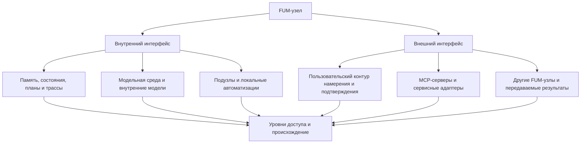

# Interfejs [FUM-uzla](../Glossarij/FUM-uzel.md)

## Trebovaniye

[FUM](../Glossarij/FUM.md) nuzhno proyektirovatj ne toljko kak sam [uzel myishleniya](../Glossarij/FUM-uzel.md), no i kak [interfejs FUM-uzla](../Glossarij/interfejs-FUM-uzla.md): ustojchivuyu granicu, cherez kotoruyu uzel vidit sebya iznutri, vzaimodejstvuyet s poduzlami, prinimayet vneshniye signalyi, predyyavlyayet rezuljtatyi drugim uzlam i dejstvuyet v srede.

Takoj fokus ne otmenyayet obraza [fraktaljnogo uzla myishleniya](../Glossarij/fraktaljnyij-uzel-myishleniya.md). On utochnyayet, chto arkhitekturno vazhen ne izolirovannyij nositelj uzla, a forma yego vnutrennej i vneshnej dostupnosti: kakiye sostoyaniya nablyudayemyi, kakiye operacii dopustimyi, kakiye prava i podtverzhdeniya nuzhnyi, kak sokhranyayetsya proiskhozhdeniye i kak drugoj uzel mozhet ponyatj rezuljtat.

Poetomu vopros o [FUM-uzle](../Glossarij/FUM-uzel.md) dolzhen zadavatjsya cherez interfejsyi:

- chto uzel pokazyivayet samomu sebe kak [vnutrenneye sostoyaniye](../Glossarij/vnutrenneye-sostoyaniye.md);
- kakiye oblasti [pamyati](../Glossarij/pamyatj-FUM.md), [modeljnoj sredyi](../Glossarij/modeljnaya-sreda.md), avtomatizacij i poduzlov dostupnyi vo vnutrennem konture;
- kakiye vkhodnyiye signalyi, namereniya, komandyi, servisnyiye vyizovyi i rezuljtatyi dostupnyi vo vneshnem konture;
- kak razlichayutsya chteniye, izmeneniye, eksport, publikaciya, peredacha [narabotok](../Glossarij/narabotka.md) i fizicheskoye ili servisnoye dejstviye;
- kakiye ogranicheniya, poteri nablyudayemosti, oshibki i otkaznyiye rezhimyi sokhranyayutsya v pamyati.

## Interfejs dlya raznyikh nablyudatelej

[FUM](../Glossarij/FUM.md) na raznyikh urovnyakh abstrakcii yavlyayetsya interfejsom dlya [nablyudatelej FUM](../Glossarij/nablyudatelj-FUM.md) raznogo urovnya i voplosjheniya. Odin i tot zhe uzel ili sloj mozhet predyyavlyatjsya CPU kak potok instrukcij, pamyati i preryivanij; GPU - kak buferyi, tenzoryi, yadra vyichislenij i graf ispolneniya; LLM - kak kontekst, instrukcii, skhemyi, ogranicheniya i trassyi; cheloveku - kak tekst, ekran, obyyasneniye, podtverzhdeniye i rezuljtat.

Takoj vzglyad vazhen dlya arkhitekturyi: interfejs ne susjhestvuyet sam po sebe, bez profilya nablyudatelya. To, chto yavlyayetsya udobnoj knopkoj dlya cheloveka, mozhet byitj nestrukturirovannyim ekrannyim sostoyaniyem dlya LLM; to, chto yavlyayetsya ponyatnyim tenzornyim grafom dlya GPU, mozhet byitj slishkom nizkourovnevyim dlya cheloveka; to, chto yavlyayetsya trassoj komand dlya CPU, ne obyazateljno sokhranyayet smyislovoye proiskhozhdeniye dlya FUM.

Kogda chistaya chislennaya avtomatizaciya kompiliruyetsya v tenzornyij vyichisliteljnyij graf, odin i tot zhe sloj poluchayet neskoljko predyyavlenij. Chelovek i LLM dolzhnyi videtj iskhodnyij kontrakt, smyisl operacii, ogranicheniya i proverku. Kompilyator vidit promezhutochnoye predstavleniye, formyi, tipyi i dopustimyiye preobrazovaniya. GPU vidit buferyi, tenzoryi, kernels i graf ispolneniya. [Pamyatj FUM](../Glossarij/pamyatj-FUM.md) dolzhna svyazyivatj eti predyyavleniya v odnu trassu, chtobyi uskorennyij sloj ne stanovilsya neprozrachnyim artefaktom bez proiskhozhdeniya.

Cherez [nablyudateljskuyu otnositeljnostj FUM](../Glossarij/nablyudateljskaya-otnositeljnostj-FUM.md) etot vyivod stanovitsya obsjhim pravilom dlya informacionnyikh sistem s nablyudatelem. Interfejs dolzhen pokazyivatj ne toljko dannyiye i operacii, no i sistemu koordinat opisaniya: kakiye elementyi yavlyayutsya vidimyimi imenno etomu nablyudatelyu, kak oni preobrazuyutsya v drugiye predstavleniya i kakiye invariantyi dolzhnyi sokhranitjsya.

Poetomu pasport interfejsa dolzhen fiksirovatj:

- dlya kakogo nablyudatelya ili klassa nablyudatelej postroyen interfejs;
- kakoj urovenj abstrakcii i forma voplosjheniya predpolagayutsya;
- kakiye signalyi, sostoyaniya i operacii dostupnyi etomu nablyudatelyu;
- kak elementyi interfejsa svyazanyi s nizhelezhasjhim substratom;
- kakiye invariantyi dolzhnyi sokhranyatjsya pri perekhode k drugim nablyudatelyam;
- kakiye smyislovyiye poteri, oshibki preobrazovaniya i ogranicheniya nablyudayemosti izvestnyi;
- kakoj putj vedyot ot proizvodnogo predstavleniya k istochniku polnoj informacii ili pochemu takoj putj nevozmozhen.

Pri fiksacii v pamyati tekusjhego dokumentacionnogo prototipa kazhdyij napravlennyij perekhod mezhdu dvumya takimi predyyavleniyami oformlyayetsya kak [preobrazovaniye mezhdu nablyudatelyami FUM](../Glossarij/preobrazovaniye-mezhdu-nablyudatelyami-FUM.md). Yego [minimaljnyij format versii 1](38-minimaljnyij-format-preobrazovaniya-mezhdu-nablyudatelyami-FUM.md) otdelyayet kartu signalov i poterj ot proveryayemyikh invariantov, vyivoda ob obratimosti i nezavisimogo marshruta k sokhranyonnomu istochniku; format budusjhego runtime opredelyayetsya otdeljno.

## Vnutrennij interfejs

Vnutrennij interfejs [FUM-uzla](../Glossarij/FUM-uzel.md) opisyivayet, kak uzel predyyavlyayet sebe sobstvennyiye sostoyaniya i vlozhennyiye oblasti. V nego vkhodyat rabochaya i dolgovremennaya [pamyatj](../Glossarij/pamyatj-FUM.md), celi, zadachi, aktivnyiye [agentskiye ciklyi](../Glossarij/agentskij-cikl.md), planyi, proverki, [vnutrenniye modeli drugikh uzlov](../Glossarij/vnutrennyaya-modelj-drugogo-uzla.md), [modeljnaya sreda](../Glossarij/modeljnaya-sreda.md), poduzlyi, lokaljnyiye avtomatizacii i izvestnyiye ogranicheniya dostupa.

Takoj interfejs dolzhen byitj nablyudayemyim dlya samogo [FUM](../Glossarij/FUM.md). Yesli sostoyaniye vliyayet na resheniye, no ne popadayet v dostupnyij vnutrennij kontur, sistema poluchayet slepuyu zonu. Yesli sostoyaniye dostupno toljko cheloveku cherez ekran, no nedostupno agentu kak struktura, snimok ili sobyitiye, eto tozhe poterya vnutrennego interfejsa.

Vnutrennij interfejs ne raven pravu neogranichenno menyatj vsyo vnutri uzla. On dolzhen razlichatj nablyudeniye, rassuzhdeniye, izmeneniye, udaleniye, peredachu, publikaciyu i dejstviye. [Urovni dostupa](../Glossarij/urovenj-dostupa.md) i [granicyi vlasti](../Glossarij/granica-vlasti-FUM.md) ostayutsya chastjyu samogo interfejsa, a ne vneshnej politikoj posle fakta.

Yesli FUM postroyen kak setj vnutrennikh poduzlov, vnutrennij interfejs dolzhen podderzhivatj tot zhe smyislovoj kontur, chto i vneshnyaya setj: lokaljnoye znaniye poduzla, soobsjheniye, interpretaciyu, obnovleniye pamyati, obratnuyu svyazj i ispravleniye rassoglasovaniya. Soobsjheniye mozhet byitj yestestvenno-yazyikovyim ili tipizirovannyim operatornyim predstavleniyem, no dolzhno sokhranyatj proiskhozhdeniye, modaljnostj, neodnoznachnostj i vozmozhnostj obratnogo obyyasneniya.

## Vneshnij interfejs

Vneshnij interfejs [FUM-uzla](../Glossarij/FUM-uzel.md) opisyivayet, kak uzel vzaimodejstvuyet s chelovekom, drugimi [FUM-uzlami](../Glossarij/FUM-uzel.md), servisami, fajlami, ustrojstvami i fizicheskoj sredoj. V nego vkhodyat poljzovateljskij kontur namereniya i podtverzhdeniya, mashinnyiye kontraktyi, [MCP-serveryi](../Glossarij/MCP-server.md), servisnyiye adapteryi, eksport i import [narabotok](../Glossarij/narabotka.md), interfejsyi chteniya i zapisi pamyati, a takzhe kanalyi vospriyatiya i dejstviya.

Dlya cheloveka i drugogo yazyikovogo uchastnika, vklyuchaya LLM-podderzhivayemogo agenta, yestestvennyij yazyik yavlyayetsya pervichnyim semanticheskim interfejsom [sinkhronizacii znanij FUM](../Glossarij/yestestvenno-yazyikovaya-sinkhronizaciya-znanij-FUM.md). Cherez nego uchastniki soglasuyut ne toljko roli `я`, `ты` ili `мы`, no i ponyatiya, faktyi, gipotezyi, celi, prichinyi, obyazateljstva, ogranicheniya i ozhidayemyiye dejstviya. Tekhnicheskiye API, transport, autentifikaciya i prava obrazuyut sosednij kontraktnyij sloj i ne dolzhnyi podmenyatj smyisl vyiskazyivaniya.

Granica dostatochnosti etogo semanticheskogo interfejsa i proveryayemyiye priznaki ispravlennogo vzaimoponimaniya ostayutsya v [otkryitom voprose o granicakh yestestvenno-yazyikovoj sinkhronizacii znanij](../Voprosyi/2026-07-13_20-34-23_MSK_granicyi-yestestvenno-yazyikovoj-sinkhronizacii-znanij-FUM.md).

Vneshnij interfejs dolzhen byitj dostatochno yavnyim, chtobyi drugoj uzel mog ponyatj, chto byilo zaprosheno, chto byilo razresheno, kakiye dannyiye byili ispoljzovanyi, kakoj rezuljtat poluchen, kakiye ogranicheniya ostalisj i mozhno li etot rezuljtat peredavatj daljshe. Udobnyij poljzovateljskij ekran sam po sebe nedostatochen: za nim dolzhen byitj vosstanovimyij kontrakt, trassa ili khotya byi zafiksirovannaya poterya strukturirovannosti.

Yesli vneshnij interfejs pokazyivayet szhatuyu ili nablyudateljski udobnuyu formu, on dolzhen davatj perekhod k iskhodnomu sloyu, iz kotorogo eta forma poluchena: fajlu, istochniku, zhurnalu, trasse, mashinnomu otvetu, DOM-snimku ili drugomu dostupnomu nositelyu podrobnostej. Kogda perekhod nevozmozhen, interfejs ne dolzhen molcha vyiglyadetj kak polnyij dostup; on pomechayet granicu, chtobyi poljzovatelj i drugoj uzel videli, gde opisaniye stalo neobratimyim.

Dlya [lichnogo FUM-agenta](../Glossarij/lichnyij-FUM-agent.md) vneshnij interfejs osobenno vazhen: chelovek vyirazhayet namereniye, zadayot ogranicheniya i podtverzhdayet dejstviya cherez etot kontur. Dlya servisov vneshnij interfejs zadayot, kakiye operacii dostupnyi agentu i kakiye prava nuzhnyi. Dlya seti uzlov on zadayot sposob obmena rezuljtatami bez skryitogo prisvoyeniya chuzhoj pamyati ili vlasti.

V tekusjhem ruchnom konture Git + Codex minimaljnoj dostupnoj repozitornomu agentu yedinicej chelovecheskogo vvoda yavlyayetsya otpravlennoye soobsjheniye-zadacha. Ono uzhe agregiruyet predshestvuyusjhiye nabor, redaktirovaniye i interfejsnyiye dejstviya; do otpravki eti sobyitiya ne vkhodyat v dostupnyij kontekst sessii. Poljzovateljskaya zadacha sposobna izmenitj trebovaniya i pamyatj, no sleduyusjhuyu pishusjhuyu sessiyu poljzovatelj zapuskayet toljko posle zaversheniya tekusjhej; avtomaticheskogo FIFO-vladeljca ili vyitesneniya net.

V [korobochnoj realizacii FUM](../Glossarij/korobochnaya-realizaciya-FUM.md) soobsjheniye ostayotsya dopustimyim vyisokourovnevyim agregatom, no perestayot byitj yedinstvennoj granicej nablyudeniya. Yavno vklyuchyonnaya oblastj interfejsa dolzhna peredavatj razreshyonnyiye sobyitiya vvoda po mere vozniknoveniya vo vremya aktivnogo cikla. Pervichnyij ili proizvodnyij signal sokhranyayet proiskhozhdeniye, poryadok, monotonnoye vremya, zaderzhku, izvestnyiye poteri i granicu agregacii; zasjhisjhyonnyij ili ne otnosyasjhijsya k razreshyonnoj oblasti vvod v rabochij kontekst ne popadayet. Etot vkhod zakreplyon v [trebovanii o nepreryivnom sobyitijnom nablyudenii](../Trebovaniya/🟡-nepreryivnoye-sobyitijnoye-nablyudeniye-poljzovateljskogo-vvoda.md), a yego vliyaniye na prodolzheniye — v [trebovanii o poljzovateljskom perenapravlenii cikla](../Trebovaniya/🟡-poljzovateljskoye-perenapravleniye-nepreryivnogo-agentskogo-cikla.md).

Nizkourovnevoye sobyitiye ne stanovitsya namereniyem avtomaticheski. Organ vospriyatiya mozhet filjtrovatj i obyyedinyatj potok, posle chego bezopasnaya kontroljnaya tochka proveryayemo sokhranyayet prezhneye prodolzheniye libo menyayet celj, prioritet, plan, vetku ili dejstviye. Takaya sobyitijnaya nepreryivnostj opisyivayet upravleniye ciklom, a ne nepreryivnyij inference, modeljnyij vyizov na kazhduyu klavishu ili dostup k skryityim rassuzhdeniyam.

[Pervyij korobochnyij Swift-prototip](43-pasport-nachaljnogo-korobochnogo-prototipa-FUM.md) namerenno ne obyazan imetj GUI. On snachala vosproizvodimo simuliruyet [shtatnoye popolneniye pamyati](../Glossarij/shtatnoye-popolneniye-pamyati-FUM.md) i ogranichennoye ispolneniye v bezokonnom rezhime, chtobyi interfejsnaya modelj ne stala prezhdevremennyim otdeljnyim istochnikom istinyi. Perekhod k zhiznesposobnomu GUI podtverzhdayetsya toljko skvoznyim scenariyem: ekrannaya proyekciya vyivoditsya iz kanonicheskogo sostoyaniya [pamyati FUM](../Glossarij/pamyatj-FUM.md), pokazyivayet proiskhozhdeniye i dostupnyiye dejstviya, a dejstviye cheloveka vozvrasjhayetsya v tot zhe sobyitijnyij kontur, menyayet pamyatj cherez te zhe vnutrenniye pravila i vosproizvoditsya povtornyim progonom.

Nabor teksta mozhet stanovitjsya [nablyudayemyim vkhodnyim signalom](../Glossarij/nablyudayemyij-vkhodnoj-signal.md) dlya proverki togo, kak LLM prodolzhila byi dostupnyij yej prefiks i kak yego fakticheski prodolzhayet konkretnyij chelovek. Interfejs dolzhen yavno razlichatj slepoye retrospektivnoye vosproizvedeniye, prospektivnyij tenevoj rezhim bez pokaza soderzhaniya prognoza i rezhim vidimogo avtodopolneniya, gde predlozheniye LLM uzhe vliyayet na daljnejshij nabor. Vo vtorom prospektivnom rezhime ostayutsya vozmozhnyi effektyi osvedomlyonnosti o nablyudenii i zaderzhki interfejsa. V pokazannom rezhime prinyatiye, otkloneniye i redaktirovaniye podskazki yavlyayutsya sobyitiyami vzaimodejstviya; prichinnyij effekt trebuyet zaraneye randomizirovannogo pokaza, a bez nego ocenka ostayotsya opisateljnoj.

Takoye nablyudeniye dopuskayetsya toljko v yavno vklyuchyonnoj oblasti interfejsa i s otdeljnyim kontraktom na dostupnyij modeli kontekst, khraneniye chernovikov, udalenij, pozicij kursora, vstavok, bufera obmena, teksta tretjikh lic i vremennyikh kharakteristik. Globaljnyij perekhvat klaviaturyi vne vyibrannoj oblasti zapresjhyon, a zasjhisjhyonnyiye polya dolzhnyi isklyuchatjsya; lokaljnaya obrabotka, minimizaciya dannyikh i korotkij srok khraneniya yavlyayutsya formoj po umolchaniyu. Poljzovatelj dolzhen videtj, kakoj rezhim aktiven, imetj vozmozhnostj ostanovitj zapisj i zapustitj proveryayemoye udaleniye syiroj trassyi, proizvodnyikh priznakov, kyeshej i otdelyayemogo personaljnogo adaptera ili indeksa. Yesli vneshnij provajder ne dayot garantii udaleniya svoyego sostoyaniya, interfejs obyazan pokazatj etu granicu do peredachi dannyikh. Peredacha yesjhyo ne opublikovannogo teksta vneshnej LLM trebuyet otdeljnogo razresheniya i ne vyivoditsya iz obsjhego soglasiya poljzovatjsya agentom.

V [pervom dejstvuyusjhem redaktorskom prototipe](../Prototipyi/tenevoj-redaktor-prodolzhenij/README.md) oblastj nablyudeniya svedena k odnomu yavno otkryitomu UTF-8-fajlu, a vneshnij modeljnyij provajder otsutstvuyet: prodolzheniye stroit toljko zaraneye ustanovlennaya lokaljnaya LLM. Fajl ostayotsya kanonicheskim chelovecheskim tekstom i ne dopisyivayetsya modeljyu. Kontroljnaya tochka dejstvuyet toljko v konce fajla, khranit zamorozhennuyu versiyu prefiksa i skryivayet modeljnuyu vetvj; pravka boleye rannego teksta delayet yeyo ustarevshej, a poljzovateljskij vvod ili dostizheniye gorizonta ostanavlivayut prodolzhayusjhuyusya generaciyu. Proizvodnyij indeks peresobirayem, lokaljnaya trassa otdelena ot fajla i udalyayetsya yavnyim dejstviyem.

Kalendarj, raspisaniye, taksi i poyezdki yavlyayutsya pokazateljnyim vneshnim interfejsnyim konturom lichnogo FUM-uzla. V nyom FUM chitayet vremennoye sostoyaniye, modeliruyet variantyi sobyitiya i dorogi, razlichayet lokaljnoye planirovaniye i vneshneye servisnoye dejstviye, zaprashivayet podtverzhdeniye pered platnyim ili fizicheski znachimyim shagom i sokhranyayet trassu vyizova adaptera. Neyasnyiye granicyi takoj avtonomii fiksiruyutsya v [otkryitom voprose o kalendarno-transportnyikh dejstviyakh FUM](../Voprosyi/2026-07-03_09-03-59_MSK_granicyi-kalendarno-transportnyikh-dejstvij-FUM.md).

## Otlichiye ot MCP

[Interfejs FUM-uzla](../Glossarij/interfejs-FUM-uzla.md) i [MCP-server](../Glossarij/MCP-server.md) nakhodyatsya na raznyikh urovnyakh arkhitekturyi. Interfejs FUM-uzla opisyivayet vsyu granicu dostupnosti uzla: chto on vidit vnutri sebya, chto pokazyivayet cheloveku, poduzlam i drugim uzlam, kakiye dejstviya dopuskayet, kak sokhranyayet proiskhozhdeniye, kakiye podtverzhdeniya trebuyet i kakiye poteri nablyudayemosti priznayot.

MCP-server uzhe po roli. On yavlyayetsya mashinnyim servisnyim adapterom vnutri vneshnego interfejsa: predostavlyayet instrumentyi, resursyi, operacii i sostoyaniye konkretnogo servisa ili sredyi v forme, prigodnoj dlya vyizova agentom. Cherez MCP FUM mozhet chitatj vneshnij kontekst i vyipolnyatj dejstviya, no sam MCP ne zadayot celikom vnutrennyuyu pamyatj, celi, [agentskij cikl](../Glossarij/agentskij-cikl.md), [granicyi vlasti](../Glossarij/granica-vlasti-FUM.md), poljzovateljskij kontur smyisla ili pravila peredachi [narabotok](../Glossarij/narabotka.md).

Prakticheskoye razlichiye mozhno formulirovatj tak:

| Vopros          | Interfejs FUM-uzla                                                                                                  | MCP-server                                                                             |
| --------------- | ------------------------------------------------------------------------------------------------------------------- | -------------------------------------------------------------------------------------- |
| Chto opisyivayet   | Granicu vnutrennej i vneshnej dostupnosti uzla.                                                                      | Mashinnyij kontrakt dostupa k servisu, instrumentu ili srede.                            |
| Dlya kogo        | Dlya samogo uzla, cheloveka, LLM, poduzlov, drugikh FUM-uzlov, servisov i nizhelezhasjhikh nablyudatelej.                    | Dlya agenta ili kliyenta, kotoryij vyizyivayet predostavlennyiye operacii.                     |
| Chto vklyuchayet    | Pamyatj, sostoyaniya, namereniya, podtverzhdeniya, prava, trassyi, oshibki, obmen rezuljtatami i svyazj s nizhnim substratom. | Instrumentyi, resursyi, skhemyi vkhodov i vyikhodov, oshibki i sostoyaniye konkretnogo adaptera. |
| Gde nakhoditsya   | Nad servisnyimi adapterami i vokrug nikh kak arkhitekturnaya granica uzla.                                              | Vnutri vneshnego interfejsa kak odin iz organov vospriyatiya i dejstviya.                  |
| Chto ne zamenyayet | Ne zamenyayet konkretnyiye protokolyi i adapteryi dostupa k servisam.                                                     | Ne zamenyayet celostnyij interfejs FUM-uzla i yego vnutrennyuyu organizaciyu.                 |

Poetomu FUM mozhet ispoljzovatj MCP kak udobnyij i proveryayemyij sposob podklyuchitj servis, no ne dolzhen svoditj svoj interfejs k spisku MCP-instrumentov. I naoborot, vneshnij servis mozhet imetj MCP-dostup, no poka yego vyizovyi ne svyazanyi s pamyatjyu, proiskhozhdeniyem, podtverzhdeniyami, urovnyami dostupa i rezuljtatami FUM, eto yesjhyo ne polnocennyij interfejs FUM-uzla.

## Rekursivnostj interfejsa

[Fraktaljnostj](../Glossarij/fraktaljnyij-uzel-myishleniya.md) [FUM](../Glossarij/FUM.md) oznachayet, chto interfejs tozhe rekursiven. Malyij uzel imeyet vnutrennij i vneshnij interfejs; setj takikh uzlov mozhet statj uzlom sleduyusjhego urovnya i poluchitj sobstvennyij vnutrennij i vneshnij interfejs; [virtualizovannaya sreda FUM](../Glossarij/virtualizovannaya-sreda-FUM.md) mozhet predyyavlyatj vlozhennyim uzlam novyij interfejs poverkh boleye syirogo nizhnego sloya.

Rekursivnostj dolzhna sokhranyatj obsjhij invariant yazyikovoj seti: kazhdyij urovenj imeyet lokaljnuyu pamyatj, predyyavlyayet smyislovyiye soobsjheniya, interpretiruyet ikh v svoyom kontekste, fiksiruyet izmeneniya modeli i vozvrasjhayet obratnuyu svyazj. Blagodarya etomu II-agent stroitsya po principu seti agentov chelovecheskogo obrazca, a ne toljko pokazyivayet cheloveku chat poverkh monolitnogo vnutrennego mekhanizma.

Eto ne dolzhno stiratj granicyi. Kogda sostavnoj uzel predyyavlyayet obsjhij interfejs naruzhu, yego [poduzlyi](../Glossarij/poduzel-FUM.md) ne stanovyatsya avtomaticheski polnostjyu prozrachnyimi ili polnostjyu upravlyayemyimi. Vnutrennyaya oblastj poduzla mozhet byitj dostupna cherez soglasovannyij interfejs, no ne cherez skryituyu totaljnuyu vlastj.

## Grafovyij sloj pamyati

V [korobochnoj realizacii FUM](../Glossarij/korobochnaya-realizaciya-FUM.md) odnim iz vazhnyikh sloyov interfejsa dolzhen statj grafovyij obzor [pamyati](../Glossarij/pamyatj-FUM.md), kotoryij pokazyivayet ne toljko yavno materializovannyiye ssyilki mezhdu dokumentami, no i semanticheskiye perekhodyi, avtomaticheski vyivedennyiye ispolniteljnyim sloyem s pomosjhjyu [sistemyi strukturiruyusjhikh operatorov FUM](../Glossarij/sistema-strukturiruyusjhikh-operatorov-FUM.md), a takzhe indeks [obobsjhyonnogo poiska povtoryayusjhikhsya posledovateljnostej](../Glossarij/obobsjhyonnyij-poisk-povtoryayusjhikhsya-posledovateljnostej.md). Tekusjhij graf Obsidian polezen kak proobraz vidimoj svyaznosti, no celevoj interfejs dolzhen pokazyivatj takzhe najdennyiye povtoryi, pozicii poyavlenij, normalizovannyiye formyi, kandidatyi v [patternyi](../Glossarij/pattern-pamyati.md), meryi podderzhki i statusyi proverki.

Perekhod dolzhen byitj dostupen dazhe togda, kogda iskhodnyij tekst ne soderzhit bukvaljnoj Markdown-ssyilki. Interfejs otdeljno pokazyivayet iniciatora predlozheniya ili vyivoda (chelovek, LLM libo avtomatizaciya), ispolniteljnyij kontur, primenyonnyij operator, iskhodnyiye materialyi i ikh proiskhozhdeniye, status proverki (kandidatnaya, podtverzhdyonnaya libo otklonyonnaya svyazj), uverennostj i formu predyyavleniya (dinamicheskij perekhod, Markdown-ssyilka, rebro grafa, rekomendaciya libo marshrut). Prinyatiye, otkloneniye ili zakrepleniye kandidata yavlyayetsya otdeljnyim nablyudayemyim dejstviyem i ne dolzhno neyavno perepisyivatj iskhodnyij tekst.

Dlya cheloveka takoj graf yavlyayetsya sposobom uvidetj, kak iz otdeljnyikh fragmentov pamyati vyirastayut povtoryayusjhiyesya formyi i obsjhiye skhemyi. Dlya agenta on dolzhen byitj mashinno chitayemyim interfejsom zaprosa: kakiye posledovateljnosti podderzhivayut gipotezu, gde lezhat kontrprimeryi, kakiye svyazi uzhe zakreplenyi, a kakiye ostayutsya toljko nablyudayemyimi kandidatami.

Yesli indeks primenyayetsya k russkomu tekstu, grafovyij sloj dolzhen umetj pokazyivatj morfologicheskiye gipotezyi: svyazi slovoform, sklonenij, spryazhenij, okonchanij i soglasovanij. Eti svyazi ne dolzhnyi smeshivatjsya s vruchnuyu utverzhdyonnyimi pravilami grammatiki: interfejs obyazan pokazyivatj proiskhozhdeniye, uverennostj, isklyucheniya i status proverki kazhdoj takoj regulyarnosti.

Otdeljnoj chastjyu grafovogo sloya dolzhna statj ekrannaya proyekciya [sistemyi strukturiruyusjhikh operatorov FUM](../Glossarij/sistema-strukturiruyusjhikh-operatorov-FUM.md). Odin i tot zhe operatornyij graf dolzhen umetj porozhdatj ne toljko tekstovoye obyyasneniye, no i chelovekochitayemuyu kartu strukturirovannyikh znanij: uzlyi operatorov, svyazi raspoznavaniya i porozhdeniya, urovni abstrakcii, cepochki istochnikov, proverki, konfliktyi, ostatki i variantyi perekhoda k dejstviyu.

Takoj ekran ne dolzhen byitj toljko vizualjnoj vitrinoj. Kazhdyij vidimyij element dolzhen po vozmozhnosti ostavatjsya svyazannyim s mashinnoj strukturoj: operatorom, fragmentom pamyati, iskhodnyim zaprosom, primerom, trassoj instrumenta, statusom doveriya ili yavno ukazannoj poterej. Yesli chelovek pravit kartu, prinimayet svyazj, otklonyayet kandidat ili raskryivayet diagnosticheskij ostatok, eto dejstviye dolzhno sokhranyatjsya kak sobyitiye interfejsa i vozvrasjhatjsya v operatornuyu sistemu dlya proverki.

Poetomu grafovyij sloj interfejsa dolzhen razlichatj vnutrennij operatornyij graf i operatoryi yego predyyavleniya cheloveku. Operator predyyavleniya opisyivayet, kakoj fragment strukturyi stanovitsya uzlom, rebrom, tablicej, derevom, vremennoj shkaloj ili drugim ekrannyim vidom, kakiye priznaki pokazyivayutsya kak status, doveriye, konflikt ili ostatok i kakiye dejstviya cheloveka perevodyatsya obratno v formaljnyiye izmeneniya pamyati. Takoj sloj pozvolyayet odnomu smyislovomu obyyektu imetj neskoljko predstavlenij bez poteri puti k iskhodnomu grafu.

## Skhema

## Arkhitekturnyiye sledstviya

- [Arkhitektura FUM](../Glossarij/arkhitektura-FUM.md) dolzhna opisyivatj uzlyi cherez ikh vnutrenniye i vneshniye interfejsyi, a ne toljko cherez tip nositelya ili mesto v iyerarkhii.
- Poljzovateljskij interfejs yavlyayetsya chastnyim sluchayem vneshnego interfejsa uzla, no ne ischerpyivayet yego: mashinnyiye kontraktyi, sobyitiya, trassyi i urovni dostupa ne meneye vazhnyi.
- Yestestvennyij yazyik dolzhen byitj pervichnyim semanticheskim interfejsom lyudej i drugikh yazyikovyikh uchastnikov, vklyuchaya LLM-podderzhivayemyikh agentov, a mestoimennaya adresaciya dolzhna ostavatjsya odnim iz yego chastnyikh sloyov.
- Vnutrennij i vneshnij interfejsyi seti FUM dolzhnyi sokhranyatj sovmestimyij kontur soobsjheniya, interpretacii, obnovleniya pamyati, obratnoj svyazi i ispravleniya.
- [Virtualizovannyiye sredyi](../Glossarij/virtualizovannaya-sreda-FUM.md) yavlyayutsya sposobom postroitj vnutrennij interfejs dlya vlozhennyikh uzlov poverkh boleye syirogo substrata.
- [Yedinaya tochka vzaimodejstviya s kompjyuterom](../Glossarij/yedinaya-tochka-vzaimodejstviya-s-kompjyuterom.md) yavlyayetsya vneshnim interfejsom lichnogo FUM-uzla k cheloveku i cifrovoj srede.
- Soobsjheniye-zadacha yavlyayetsya agregirovannoj formoj chelovecheskogo vvoda, a korobochnyij interfejs dolzhen umetj prinimatj razreshyonnyiye sobyitiya vo vremya aktivnogo cikla i svyazyivatj izmeneniye prodolzheniya s ikh proiskhozhdeniyem.
- Slepoj retrospektivnyij replay, prospektivnyij tenevoj prognoz i vidimoye avtodopolneniye dolzhnyi byitj raznyimi rezhimami interfejsa s raznyimi metrikami, trassami i razresheniyami.
- Obmen [narabotkami](../Glossarij/narabotka.md) mezhdu uzlami dolzhen prokhoditj cherez interfejsyi eksporta i importa, gde vidnyi proiskhozhdeniye, sovmestimostj, prava peredachi i ogranicheniya.
- Proverki FUM dolzhnyi iskatj ne toljko oshibki rezuljtata, no i razryivyi interfejsa: skryityiye sostoyaniya, neproveryayemyiye servisnyiye vyizovyi, neyavnyiye prava dejstviya, poteryu strukturirovannosti i neopisannyiye otkaznyiye rezhimyi.

## Blizhnij proveryayemyij sloj

Minimaljnyij sleduyusjhij shag - opisatj pasport interfejsa [FUM-uzla](../Glossarij/FUM-uzel.md). Takoj pasport dolzhen fiksirovatj vnutrenniye sostoyaniya, vneshniye vkhodyi i vyikhodyi, dopustimyiye operacii, urovni dostupa, tochki podtverzhdeniya, trassu, kartu svyazi s nizhnim substratom, ogranicheniya i proverku vosstanovleniya posle oshibki.

Pervyij pasport dolzhen byitj ne universaljnyim, a lokaljnyim: dlya tekusjhego [gibridnogo uzla](../Glossarij/gibridnyij-uzel.md) chelovek - Codex - Obsidian-khranilisjhe v etom repozitorii. Etot kontur yavlyayetsya [dokumentacionnyim prototipom FUM](../Glossarij/dokumentacionnyij-prototip-FUM.md), poetomu pasport dolzhen pokazatj, kakiye dannyiye vidit chelovek v Obsidian, kakiye fajlyi, pravila i instrumentyi vidit LLM-sreda Codex, kakiye komandyi dostupnyi cherez agentskuyu sredu, kakiye dejstviya trebuyut podtverzhdeniya, kak itog sokhranyayetsya v [pamyati FUM](../Glossarij/pamyatj-FUM.md), kakiye chasti rezuljtata ne yavlyayutsya polnostjyu lokaljno vosproizvodimyimi i kakiye kontraktyi nuzhno perenesti v budusjhuyu [korobochnuyu realizaciyu FUM](../Glossarij/korobochnaya-realizaciya-FUM.md).

Pasport takzhe dolzhen perechislyatj proizvodnyiye interfejsnyiye formyi i oformlyatj ikh perekhodyi po [minimaljnomu formatu preobrazovaniya mezhdu nablyudatelyami FUM](38-minimaljnyij-format-preobrazovaniya-mezhdu-nablyudatelyami-FUM.md): ot ekrannogo sostoyaniya k fajlu ili DOM, ot graficheskoj kartyi operatorov k mashinnomu grafu i istochnikam, ot kratkogo otchyota k polnoj trasse, ot kartochki k iskhodnomu trebovaniyu, ot mashinnogo JSON k chelovekochitayemomu obyyasneniyu i obratno v predelakh dostupnoj informacii.

## Istochniki trebovanij

- [iskhodnyij zapros 2026-08-23 11:33:38 MSK — Vernutj ruchnuyu posledovateljnuyu skhemu sessij](../Zhurnal/2026-08-23_11-33-38_MSK_vernutj-ruchnuyu-posledovateljnuyu-skhemu-sessij/zapros.md)

- [iskhodnyij zapros 2026-07-23 11:50:58 MSK - Opisatj minimaljnyij format preobrazovaniya mezhdu nablyudatelyami FUM](../Zhurnal/2026-07-23_11-50-58_MSK_opisatj-minimaljnyij-format-preobrazovaniya-mezhdu-nablyudatelyami-FUM/zapros.md)
- [iskhodnyij zapros 2026-06-26 09:55:41 MSK](../Zhurnal/2026-06-26_09-55-41_MSK/zapros.md)
- [iskhodnyij zapros 2026-06-26 10:26:06 MSK](../Zhurnal/2026-06-26_10-26-06_MSK/zapros.md)
- [iskhodnyij zapros 2026-06-26 10:34:02 MSK](../Zhurnal/2026-06-26_10-34-02_MSK/zapros.md)
- [iskhodnyij zapros 2026-06-26 10:47:01 MSK](../Zhurnal/2026-06-26_10-47-01_MSK/zapros.md)
- [iskhodnyij zapros 2026-06-26 11:39:57 MSK](../Zhurnal/2026-06-26_11-39-57_MSK/zapros.md)
- [iskhodnyij zapros 2026-06-29 10:59:18 MSK](../Zhurnal/2026-06-29_10-59-18_MSK/zapros.md)
- [iskhodnyij zapros 2026-07-01 15:19:31 MSK](../Zhurnal/2026-07-01_15-19-31_MSK/zapros.md)
- [iskhodnyij zapros 2026-07-02 11:14:15 MSK](../Zhurnal/2026-07-02_11-14-15_MSK/zapros.md)
- [iskhodnyij zapros 2026-07-03 09:03:59 MSK - Opisatj kalendarno transportnyiye dejstviya FUM](../Zhurnal/2026-07-03_09-03-59_MSK_opisatj-kalendarno-transportnyiye-dejstviya-FUM/zapros.md)
- [iskhodnyij zapros 2026-07-06 13:34:08 MSK - Opisatj kompilyaciyu algoritmov v tenzornyij graf](../Zhurnal/2026-07-06_13-34-08_MSK_opisatj-kompilyaciyu-algoritmov-v-tenzornyij-graf/zapros.md)
- [iskhodnyij zapros 2026-07-08 12:21:45 MSK - Svyazatj operatornuyu sistemu s graficheskim interfejsom](../Zhurnal/2026-07-08_12-21-45_MSK_svyazatj-operatornuyu-sistemu-s-graficheskim-interfejsom/zapros.md)
- [iskhodnyij zapros 2026-07-08 12:38:52 MSK - Zakrepitj operatornuyu pamyatj kak yadro FUM](../Zhurnal/2026-07-08_12-38-52_MSK_zakrepitj-operatornuyu-pamyatj-kak-yadro-FUM/zapros.md)
- [iskhodnyij zapros 2026-07-13 22:00:22 MSK - Zakrepitj yestestvennyij yazyik kak yazyik sinkhronizacii znanij](../Zhurnal/2026-07-13_22-00-22_MSK_zakrepitj-yestestvennyij-yazyik-kak-yazyik-sinkhronizacii-znanij/zapros.md)
- [iskhodnyij zapros 2026-07-14 01:15:40 MSK - Zakrepitj avtomaticheskiye semanticheskiye svyazi lichnogo FUM](../Zhurnal/2026-07-14_01-15-40_MSK_zakrepitj-avtomaticheskiye-semanticheskiye-svyazi-lichnogo-FUM/zapros.md)
- [iskhodnyij zapros 2026-07-14 01:40:47 MSK - Sravnitj prodolzheniye LLM s naborom cheloveka](../Zhurnal/2026-07-14_01-40-47_MSK_sravnitj-prodolzheniye-LLM-s-naborom-cheloveka/zapros.md)
- [iskhodnyij zapros 2026-07-14 08:54:56 MSK - Sozdatj prototip raskhozhdeniya prodolzhenij](../Zhurnal/2026-07-14_08-54-56_MSK_sozdatj-prototip-raskhozhdeniya-prodolzhenij/zapros.md)
- [iskhodnyij zapros 2026-07-24 10:01:26 MSK — Utochnitj sobyitijnuyu nepreryivnostj dokumentacionnogo prototipa FUM](../Zhurnal/2026-07-24_10-01-26_MSK_utochnitj-sobyitijnuyu-nepreryivnostj-dokumentacionnogo-prototipa-FUM/zapros.md)
- [iskhodnyij zapros 2026-07-24 10:44:28 MSK — Nachatj bezokonnyij Swift-prototip vosproizvodimogo popolneniya pamyati FUM](../Zhurnal/2026-07-24_10-44-28_MSK_nachatj-bezokonnyij-Swift-prototip-vosproizvodimogo-popolneniya-pamyati-FUM/zapros.md)

## Opornyiye dokumentyi

- [Arkhitektura FUM](22-arkhitektura-FUM.md)
- [Moduljnaya arkhitektura FUM](05-moduljnaya-arkhitektura-FUM.md)
- [Dostup k vnutrennim sostoyaniyam](07-dostup-k-vnutrennim-sostoyaniyam.md)
- [FUM kak yedinaya tochka vzaimodejstviya s kompjyuterom](19-yedinaya-tochka-vzaimodejstviya-s-kompjyuterom.md)
- [Virtualizovannyiye sredyi FUM i dolgovremennaya pamyatj](23-virtualizovannyiye-sredyi-i-dolgovremennaya-pamyatj.md)
- [Obmen narabotkami i urovni dostupa](09-obmen-narabotkami-i-urovni-dostupa.md)
- [Nablyudateljskaya otnositeljnostj informacionnyikh sistem](26-nablyudateljskaya-otnositeljnostj-informacionnyikh-sistem.md)
- [Minimaljnyij format preobrazovaniya mezhdu nablyudatelyami FUM](38-minimaljnyij-format-preobrazovaniya-mezhdu-nablyudatelyami-FUM.md)
- [Yestestvennyij yazyik i sinkhronizaciya znanij FUM](34-yestestvennyij-yazyik-i-sinkhronizaciya-znanij-FUM.md)

<!-- FUM-MD-RECENCY:BEGIN -->
<!-- last-content-edit: 2026-08-23 15:55:48 MSK -->
<!-- content-sha256: sha256:e3ae5ed31e4ad785425997dbca29ca17e919c68cf5b53410c86790c631fb4275 -->
<!-- FUM-MD-RECENCY:END -->
