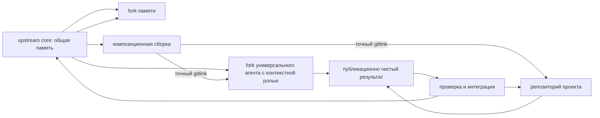

# Publichnyij upstream i forki pamyati FUM

Etot repozitorij opublikovan na GitHub kak publichnyij bazovyij upstream [pamyati FUM](../Glossarij/pamyatj-FUM.md): otkryitaya stranica [fum-lab/fum](https://github.com/fum-lab/fum) dostupna bez vkhoda. V nablyudayemoj osnovnoj rabochej kopii na 2026-07-21 lokaljnyij `origin` ukazyival na `https://github.com/fum-lab/fum.git`; eto snimok dannogo klona, a ne pravilo dlya poljzovateljskikh forkov. Publichnaya vetka `master` dolzhna ostavatjsya obsjhej, publikacionno chistoj i prigodnoj dlya nasledovaniya: v nej khranyatsya pravila, dokumentaciya, glossarij, planirovaniye, vosproizvodimyiye instrumentyi, istochniki trebovanij i proveryayemaya istoriya.

Fork takogo repozitoriya ne obyazan stanovitjsya publichnoj lichnoj pamyatjyu poljzovatelya. Bazovaya skhema sokhranyayet `master` kak obsjhij sloj, a sobstvennuyu pamyatj i eksperimentaljnyiye linii razmesjhayet v otdeljnyikh vetkakh ili privatnyikh forkakh s yavnyimi [urovnyami dostupa](../Glossarij/urovenj-dostupa.md). Dolgovechnyiye universaljnyiye ispolniteljnyiye poduzlyi s naznachayemyimi kontekstnyimi rolyami i samostoyateljnyiye proyektyi v celevoj arkhitekture poluchayut otdeljnyiye repozitorii; konkretnaya setj podklyuchayet ikh kak submodule v otdeljnoj kompozicionnoj sborke, ne smeshivaya yeyo graf ekzemplyarov s obsjhim upstream.

## Publikacionnyij audit

Lokaljnyij audit rabochej sessii 2026-07-01 12:11:27 MSK proveril gotovnostj repozitoriya k publikacii kak bazovogo upstream. Sleduyusjhaya tablica sokhranyayet istoricheskij snimok imenno toj sessii, a ne tekusjhij status GitHub.

| Oblastj                    | Rezuljtat                                                                                                                                                                                                                                        |
| -------------------------- | ------------------------------------------------------------------------------------------------------------------------------------------------------------------------------------------------------------------------------------------------ |
| Git-sostoyaniye              | Do rabochej sessii vetka `master` byila chistoj; udalyonnyij `remote` ne nastroyen, poetomu fakticheskaya publikaciya na GitHub yesjhyo trebuyet sozdaniya repozitoriya i `push`.                                                                                |
| Licenziya                   | [LICENZIYA.md](../LICENZIYA.md) fiksiruyet CC0 1.0 Universal.                                                                                                                                                                                       |
| Vkhodnoj fajl               | [README.md](../README.md) obnovlyon kak vkhodnaya tochka dlya vneshnego poljzovatelya i forka pamyati.                                                                                                                                                   |
| Sekretyi i tokenyi           | Poisk po siljnyim patternam API-klyuchej, tokenov, privatnyikh klyuchej, bearer-znachenij i parolej ne vyiyavil nezaredaktirovannyikh sekretov.                                                                                                              |
| Lokaljnyiye i mashinnyiye fajlyi | `.DS_Store` i `.obsidian/workspace.json` ostayutsya neotslezhivayemyim lokaljnyim sostoyaniyem po `.gitignore`; ustojchivyiye nastrojki `.obsidian/` otslezhivayutsya Git.                                                                                     |
| Syiryiye istochniki            | U sokhranyonnogo ChatGPT-share istochnika rasshirena redakciya: sluzhebnyiye request-id i `async_source` raspakovannogo potoka zamenenyi na `[REDACTED: local request metadata]`; avtomatizaciya `fum-materialyi-zaprosov` poluchila test na eto povedeniye. |
| Razmeryi fajlov             | Fajlov boljshe 1 MB v rabochem dereve ne obnaruzheno.                                                                                                                                                                                               |
| Svyaznostj pamyati           | Itogovaya sessiya proshla `fum-svezhestj-markdown`, `fum-svyaznostj-rabochej-sessii` i `git diff --check` pered kommitom.                                                                                                                           |

Po lokaljnomu auditu kriticheskikh blokerov dlya publikacii ne ostalosj. Zaplanirovannyiye togda sozdaniye publichnogo repozitoriya, nastrojka `origin` i pervaya otpravka `master` vposledstvii vyipolnenyi.

## Nablyudayemyij publikacionnyij status

Na 2026-07-21 publichnaya stranica [fum-lab/fum](https://github.com/fum-lab/fum) pomechayet repozitorij kak `Public`. Lokaljno nastroyenyi fetch- i push-URL `origin`, susjhestvuyet remote-tracking ref `refs/remotes/origin/master`, a rabochaya vetka soderzhit lokaljnyiye kommityi poverkh etogo snimka. Tochnoye chislo takikh kommitov yavlyayetsya operativnyim sostoyaniyem i namerenno ne zakreplyayetsya kak postoyannoye svojstvo dokumentacii.

Publichnostj udalyonnogo repozitoriya ne oznachayet, chto lyubaya tekusjhaya lokaljnaya pravka uzhe opublikovana. Izmeneniye stanovitsya chastjyu nablyudayemogo upstream-snimka toljko posle publikacionno chistogo kommita i yego uspeshnoj otpravki v dostizhimuyu udalyonnuyu vetku. Nastrojki branch protection i repository metadata etoj lokaljnoj sessiyej ne proveryalisj i ne obyyavlyayutsya zavershyonnyimi.

## Ruchnaya publikaciya `master`

Kazhdaya obyichnaya rabochaya sessiya `master` s osmyislennyim diff zakanchivayetsya lokaljnyimi proverkami i ne boleye chem odnim obyichnyim lokaljnyim kommitom. Zatem zadacha zavershayetsya bez continuation; sleduyusjhuyu pishusjhuyu sessiyu zapuskayet poljzovatelj. Kommit sam po sebe ne razreshayet `push` ili `publish`.

Publikaciyu podtverzhdayet otdeljnyij ruchnoj `push`, iniciirovannyij poljzovatelem posle prosmotra lokaljnogo rezuljtata. Yego obyyektom sluzhit tochnyij proverennyij commit i yego predki; vozmozhnyiye boleye pozdniye lokaljnyiye potomki ne poluchayut razresheniye avtomaticheski. Takoye podtverzhdeniye publikacii ne vyidayot polnomochij na podklyucheniye provajdera, polucheniye novyikh sekretov, platnyij dostup, chteniye poljzovateljskikh dannyikh ili inoj vneshnij effekt. Zaversheniye zadachi bez izmenenij ne sozdayot kommit i nichego ne otpravlyayet; istoricheskaya komanda `finish-clean` ne vkhodit v dejstvuyusjhij ruchnoj marshrut.

Udalyonnaya vershina ne uchastvuyet v dopuske ruchnoj pishusjhej sessii ili gotovnosti lokaljnogo kommita. Yesli ruchnoj `push` obnaruzhivayet divergence, avtomatizaciya ne primenyayet `pull`, merge, rebase, force-push ili force-with-lease: poljzovatelj otdeljno reshayet raskhozhdeniye i povtorno proveryayet tochnyij obyyekt publikacii. Proyektiruyemyiye zadaniya publikacii dlya drugikh refs i repozitoriyev ostayutsya samostoyateljnyimi kontraktami v [chastichno proyasnyonnom voprose o granicakh periodicheskoj publikacii](../Voprosyi/2026-07-27_15-21-35_MSK_granicyi-periodicheskoj-publikacii-vetki.md).

Nizkourovnevyij publikator ostayotsya proveryayemyim transportnyim primitivom dlya otdeljno avtorizovannyikh scenariyev: tochnyij refspec, gonka potomka, otkaz i raskhozhdeniye vosproizvodyatsya na lokaljnom bare-remote s uzkim testovyim dopuskom URL-podstanovki Git. On ne vyizyivayetsya obyichnoj zadachej `master` i ne yavlyayetsya skryitoj zamenoj ruchnogo podtverzhdeniya.

## Otlozhennaya lokaljnaya publikacionnaya granica worktree-pula

Sleduyusjhij profilj sokhranyon kak celevaya narabotka i ne dejstvuyet dlya tekusjhego repozitoriya. On ne razreshayet avtomaticheskuyu publikaciyu result-ref ili `master`.

Lokaljnyij pul FUM-STEP-0148 ne sozdayot GitHub-forki i pull request. Obyichnaya novaya sessiya snachala poluchayet exact committed routing snapshot: OID celevoj vershinyi i obyazateljnyikh planovyikh istochnikov, reviziyu protokola pula, aktivnyiye linii i tochnoye sostoyaniye ikh FIFO, a takzhe svobodnyiye slotyi. Toljko sovpadayusjhij khyesh snimka razreshayet vyibratj novuyu paralleljnuyu liniyu, posledovateljnoye prodolzheniye susjhestvuyusjhej linii libo read-only-marshrut bez pisateljskogo slota.

Novaya `self_line` lenivo zanimayet pereispoljzuyemyij linked worktree `Подузлы/слот-*` toljko posle vyibora marshruta. Posledovateljnoye prodolzheniye poluchayet dolgovechnyij FIFO-bilet toj zhe linii i posle CAS `commit+handoff` prodolzhayet rabotu v tekh zhe fizicheskom slote, polnom ref i worktree. Ono perechityivayet fakticheskij novyij `HEAD`, podtverzhdayet exact OID i toljko zatem poluchayet dopusk; tochnyij povtor i vosstanovleniye poteryannogo otveta ne dubliruyut bilet, kommit ili peredachu. Poka prodolzheniye ozhidayet, rezuljtat linii ne zamorazhivayetsya i slot ne osvobozhdayetsya. Pereispoljzovaniye razresheno lishj posle terminaljnoj kvitancii vsej linii i dokazannoj chistotyi.

Nezavisimyij agent-recenzent i otdeljnyij agent-integrator rabotayut s zamorozhennyim obyyektom v inyikh slotakh. Dopustimyij konflikt razreshayet agent, vladeyusjhij integracionnyim worktree, posle chego itog obyazateljno prokhodit povtornoye nezavisimoye revjyu. Lokaljnyij `master` menyayetsya toljko cherez obyichnuyu branch-scoped FIFO osnovnoj vetki, tochnyij CAS i yeyo zaraneye sozdannoye prodolzheniye; integracionnyij slot ne poluchayet pryamogo obkhoda etogo poryadka.

Kazhdyij result-ref, vklyuchaya zablokirovannyij ili neslivayemyij, posle proverki publikacionnoj chistotyi avtomaticheski otpravlyayetsya bez force v uzhe nastroyennyij remote etogo zhe repozitoriya. Avtoritetnyij readback obyazan podtverditj tochnyij OID. Sboj seti ili autentifikacii sokhranyayet lokaljnyij ref i sostoyaniye `publication_pending`; udalyonnyij rezuljtat ne obyyavlyayetsya poteryannyim ili opublikovannyim po dogadke. Zablokirovannyij rezuljtat sokhranyayetsya i publikuyetsya toljko otdeljnyim result-ref, no ne popadayet v lokaljnyij ili udalyonnyij `master`. Dvizheniye remote `master` vozmozhno lishj dlya prinyatoj lokaljnoj integracii posle obyazateljnogo povtornogo nezavisimogo revjyu i obyichnoj serializovannoj peredachi osnovnoj vetki.

Etalonnyij dokumentaljnyij CLI otvergayet soderzhateljnyiye i terminaljnyiye komandyi, yesli ikh `repo-root` ne sovpadayet s tochnyim naznachennyim slotom i yego `worktree_id`. Eto proveryayet disciplinu lokaljnogo marshruta, no ne dokazyivayet perenos ili vozobnovleniye host-workspace zadachi Codex Desktop i otsutstviye avtomaticheskogo chteniya osnovnogo checkout do pervogo instrumentaljnogo vyizova; profilj ne yavlyayetsya nativnoj izolyaciyej. Uzkaya avtomaticheskaya publikaciya result-ref ne menyayet obsjhuyu modelj vneshnikh poljzovateljskikh forkov, dolgovechnyikh fork-agentov, submodule i obratnoj peredachi uluchshenij. Dlya nikh sokhranyayutsya samostoyateljnyiye mezhrepozitornyiye kontraktyi i otdeljnyiye polnomochiya.

## Pravila bazovogo upstream

`master` bazovogo repozitoriya nesyot toljko obsjhuyu publikacionno chistuyu pamyatj. V nego ne popadayut privatnyiye zaprosyi, tokenyi, lokaljnyiye rabochiye sostoyaniya, lichnyiye zametki bez razresheniya na publikaciyu, mashinnyiye kyeshi i materialyi s neyasnyim urovnem dostupa.

Kazhdoye izmeneniye `master` dolzhno sokhranyatj cepochku proiskhozhdeniya: [iskhodnyij zapros](../Glossarij/iskhodnyij-zapros.md) -> proizvodnaya dokumentaciya ili instrument -> proverki -> Git-kommit. Dlya rabochikh sessij dejstvuyut pravila [AGENTS.md](../AGENTS.md): `запрос.md`, `отчёт.md` i sobstvennyiye materialyi obyyedinyayutsya [papkoj zaprosa](../Glossarij/papka-zaprosa.md) v `Журнал/`, spisok zatronutyikh fajlov i ispoljzovannyikh instrumentov fiksiruyetsya v zaprose, recency-metki i proverka svyaznosti zapuskayutsya pered kommitom.

Dlya `master` rekomenduyetsya trebovatj kak minimum review ili yavnoye podtverzhdeniye vladeljca, prokhozhdeniye lokaljnyikh proverok pered merge i zapret pryamogo dobavleniya fajlov s sekretami. Nalichiye i tochnaya konfiguraciya GitHub branch protection ne vyivodyatsya iz lokaljnogo Git-snimka i trebuyut otdeljnoj proverki s podkhodyasjhimi pravami.

## Yadro i kompozicionnaya sborka

Publichnyij upstream vyipolnyayet rolj obsjhego yadra (`core`). Otdeljnaya kompozicionnaya sborka (`assembly`) konkretnogo sostavnogo FUM-uzla podklyuchayet eto yadro, fork-repozitorii dolgovechnyikh poduzlov i samostoyateljnyiye repozitorii proyektov po tochnyim gitlink. Razdeleniye ne pozvolyayet fork-poduzlu unasledovatj iz yadra ssyilku na samogo sebya i vesj graf roditeljskikh ekzemplyarov.

Submodule ne yavlyayetsya zhivoj vetkoj. Osnovnaya vetka poduzla ili proyekta susjhestvuyet v yego remote, a commit assembly zakreplyayet odnu prinyatuyu reviziyu. Avtomaticheskoye sledovaniye za vershinoj vetki ne zamenyayet proverku, otbor i otdeljnoye obnovleniye gitlink.

## Kak forknutj pamyatj

Vneshnij poljzovatelj sozdayot fork na GitHub i kloniruyet uzhe svoj repozitorij:

```bash
git clone <url-вашего-форка-FUM>
cd FUM
git remote add upstream https://github.com/fum-lab/fum.git
git fetch upstream
```

V forke rekomenduyetsya derzhatj `master` maksimaljno blizko k upstream `master`, a sobstvennuyu pamyatj vesti v otdeljnoj vetke:

```bash
git switch -c memory/<краткое-название>
```

Dlya eksperimentov mozhno ispoljzovatj vetki vida `experiment/<краткое-название>`, a dlya uluchshenij, kotoryiye planiruyetsya vernutj v upstream, — `upstream-improvement/<краткое-название>`. [Dochernij fork-agent FUM](../Glossarij/dochernij-fork-agent-FUM.md) sokhranyayet `master` kak yavno sinkhroniziruyemoye zerkalo tochnogo pokoleniya kornevogo upstream, a rolevuyu pamyatj i rabotu vedyot v otdeljnyikh dolgovechnyikh liniyakh. Proyekt vedyot vetki v samostoyateljnom proyektnom repozitorii i podklyuchayetsya k assembly kak submodule.

Pasport proyekta khranitsya v yego repozitorii, a sleduyusjhij shag dolzhen odnoznachno nazyivatj ne toljko polnyij ref, no i celevoj repozitorij. Odinakovyij `refs/heads/master` v yadre, poduzle i proyekte ne oznachayet odnu vetku i ne mozhet vyibiratjsya bez repozitornoj identichnosti.

Fork-repozitorij na khostinge nuzhno otlichatj ot [vetvevogo fork FUM](../Glossarij/vetvevoj-fork-FUM.md). Pervyij yavlyayetsya dolgovechnyim kontejnerom i zakonomerno imeyet zerkaljnyij `master`, rabochiye, sluzhebnyiye i pull-request refs. Vtoroj yavlyayetsya odnim logicheskim uzlom dereva ispolneniya i imeyet rovno odnu avtoritetnuyu paru repozitoriya i rabochego ref i ne boleye odnoj dopusjhennoj sessii-vladeljca. Poetomu pravilo «odin fork — odna vetka» ne trebuyet udalyatj tekhnicheskiye refs repozitoriya i ne vyivoditsya toljko iz knopki Fork na GitHub.

## Vedeniye sobstvennoj pamyati, poduzla i proyekta

Sobstvennaya vetka pamyati mozhet soderzhatj lichnyiye pravila, privatnyiye istochniki i adaptacii, yesli vyibrannyij urovenj dostupa pozvolyayet khranitj ikh imenno v etom forke. Specializaciya i dolgovremennaya pamyatj poduzla prinadlezhat yego fork-repozitoriyu, a trebovaniya i rezuljtatyi proyekta — proyektnomu repozitoriyu. Dlya publichnogo repozitoriya lichnyiye i zakryityiye materialyi luchshe ne dobavlyatj vovse; dlya privatnogo vsyo ravno nuzhno otdelyatj budusjhiye publichnyiye uluchsheniya ot chastnoj pamyati.

Prakticheskoye pravilo: lichnyiye izmeneniya ostayutsya v `memory/*`, specializaciya poduzla — v yego fork, proyektnyiye izmeneniya — v repozitorii proyekta. Izmeneniya pravil, instrumentov, glossariya, publikacionnoj chistotyi, proverok ili obsjhej arkhitekturyi vyinosyatsya v otdeljnuyu vetku ot svezhego upstream `master`, chtobyi ikh mozhno byilo vernutj v yadro bez primesi lichnoj, agentskoj ili proyektnoj pamyati.

V otlozhennom profile [obyazateljnoye prodolzheniye vetki](../Glossarij/obyazateljnoye-prodolzheniye-vetki.md) byilo svyazano s tochnyim polnyim ref i fizicheskim checkout: kazhdyij zhivoj pishusjhij checkout khranil sobstvennuyu FIFO i cepochku prodolzhenij, a lokaljnyiye paralleljnyiye linii ispoljzovali pereispoljzuyemyiye linked worktree i unikaljnyiye polnyiye refs. Etot mekhanizm sokhranyon kak arkhitekturnaya narabotka i ne marshrutiziruyet tekusjhiye zapisi. Dejstvuyusjhaya ruchnaya skhema ispoljzuyet odin pervichnyij checkout `refs/heads/master` i ne sozdayot prodolzheniye posle kommita; samostoyateljnyij repozitorij po-prezhnemu ispoljzuyet otdeljnyij klon.

Pered kazhdyim sliyaniyem ili pull request nuzhno proveritj, chto v izmeneniyakh net tokenov, cookie, privatnyikh URL, lokaljnyikh IP, uchyotnyikh zapisej, mashinnyikh kyeshej i materialov, chej urovenj dostupa ne dopuskayet publikaciyu.

## Sliyaniye obnovlyayusjhegosya master

Periodicheskoye obnovleniye forka nachinayetsya s podtyagivaniya bazovogo upstream:

```bash
git fetch upstream
git switch master
git merge --ff-only upstream/master
git push origin master
```

`--ff-only` polezen kak zasjhita ot sluchajnogo razvitiya sobstvennogo `master`. Yesli komanda ne prokhodit, eto signal, chto v `master` forka poyavilisj lokaljnyiye izmeneniya; ikh nuzhno vyinesti v otdeljnuyu vetku ili osoznanno razobratj konflikt, a ne smeshivatj bazovuyu pamyatj i lichnuyu liniyu.

Posle obnovleniya `master` yego slivayut v sobstvennuyu vetku:

```bash
git switch memory/<краткое-название>
git merge master
```

Konfliktyi pri takom sliyanii schitayutsya normaljnyim mestom otbora: poljzovatelj reshayet, kakiye novyiye pravila i dokumentyi upstream primenimyi k yego pamyati, a gde lokaljnaya vetka dolzhna sokhranitj sobstvennoye resheniye. Itogovyij merge-kommit ostayotsya chastjyu istorii etoj vetki i pokazyivayet, kakiye bazovyiye izmeneniya byili unasledovanyi.

Fork-agent sinkhroniziruyet svoj `master` s tem zhe upstream toljko yavnyim proveryayemyim fast-forward do zakreplyonnogo commit. Rolevyiye vetki poluchayut eto pokoleniye otdeljnyim perekhodom; avtomaticheskoye sledovaniye za udalyonnoj vershinoj ne podmenyayet proverku sovmestimosti. Proyektnyij repozitorij sinkhroniziruyetsya so svoim upstream, yesli on obyyavlen; nalichiye proyekta kak submodule FUM samo po sebe ne delayet `master` FUM yego upstream.

## Obratnaya peredacha uluchshenij

Yesli v forke poyavilosj uluchsheniye, poleznoye dlya vsekh, yego luchshe otdelitj ot lichnoj vetki i perenesti na svezhij `master`:

```bash
git switch master
git merge --ff-only upstream/master
git switch -c upstream-improvement/<краткое-название>
```

V takuyu vetku popadayet toljko publikacionno chistyij obsjhij rezuljtat: ispravleniye dokumentacii, uluchsheniye avtomatizacii, test, glossarnoye utochneniye, pravilo rabochej sessii ili arkhitekturnoye resheniye. Pull request v upstream dolzhen zakreplyatj tochnyiye base/head, polnyij diapazon commit, naznacheniye i rolj, oblastj, proverki, granicyi primenimosti i publikacionnyij audit. Izmeneniye base ili head annuliruyet prezhneye prinyatiye. Sam pull request yavlyayetsya konvertom peredachi i revjyu, a ne dokazateljstvom poleznosti ili razresheniyem sliyaniya.

Shtatnoye GitHub-podklyucheniye Web ChatGPT ne yavlyayetsya takim pishusjhim fork-konturom: ono chitayet repozitorij, no ne sozdayot commit, vetku ili pull request. Dlya neboljshogo vneshnego rezuljtata dejstvuyet [proveryayemyij priyom vneshnego vklada](51-proveryayemyij-priyom-vneshnego-vklada.md): vneshnij agent pomesjhayet polnyij tipizirovannyij paket v tekst share-dialoga, a lokaljnaya kornevaya sessiya arkhiviruyet istochnik, proveryayet tochnyiye bazu, manifest, khyesh i primenimostj patch i sama oformlyayet prinyatyij rezuljtat. Dlya boljshogo rezuljtata dopustim fork i zakreplyonnyij draft pull request, sozdannyij Codex web/cloud ili inyim otdeljno dopusjhennyim pishusjhim adapterom; eto menyayet transport, no ne dayot PR prava na merge i ne obkhodit lokaljnuyu priyomku.

Yesli poleznaya ideya voznikla vnutri privatnoj pamyati, naruzhu peredayotsya ne vsya vetka, a obezlichennaya ili zanovo oformlennaya [narabotka](../Glossarij/narabotka.md): tekst trebovaniya, patch, test, shablon, otchyot ili drugoye soderzhaniye, kotoroye mozhno opublikovatj pod CC0.

Dlya poduzla dejstvuyet ta zhe granica: vverkh ne slivayetsya vsya yego rolevaya vetka s pamyatjyu. Publikacionno chistyij obsjhij vklad perenositsya na vetku ot tochnogo commit celevogo upstream i soprovozhdayetsya proiskhozhdeniyem, proverkami i ogranicheniyami. [Perenosimyij navyik FUM](../Glossarij/perenosimyij-navyik-FUM.md) stanovitsya kanonicheskim toljko posle vosproizvodimogo revjyu i integracii v kornevoj `master`; novyij celevoj agent nasleduyet tochnyij prinyatyij commit, a susjhestvuyusjhij fork poluchayet yego cherez yavnuyu sinkhronizaciyu. Rabota nad proyektom analogichno prinimayetsya snachala v proyektnyij repozitorij; assembly obnovlyayet yego gitlink toljko posle dokazannoj publikacii i proverki prinyatogo commit.

## Dvukhfaznaya fiksaciya i dostup

Commit dochernego repozitoriya i commit assembly s novyim gitlink ne mogut byitj odnoj atomarnoj Git-tranzakciyej. Snachala rezuljtat fiksiruyetsya i stanovitsya dostizhimyim v poduzle ili proyekte, zatem prokhodit integraciyu, posle chego otdeljnyij commit assembly prodvigayet ukazatelj. Sboj mezhdu etapami sokhranyayet nablyudayemyij promezhutochnyij status i vozobnovlyayetsya s poslednej dokazannoj granicyi.

Publichnaya assembly podklyuchayet toljko publikacionno dopustimyiye repozitorii. URL i imena privatnyikh poduzlov i proyektov sami yavlyayutsya dannyimi ogranichennogo dostupa i ne pomesjhayutsya v publichnuyu `.gitmodules`; smeshannaya setj trebuyet privatnoj assembly libo publikuyet toljko razreshyonnyiye obezlichennyiye rezuljtatyi.

## Skhema potokov



Eta skhema delayet GitHub ne prosto mestom publikacii, a pervyim socialjnyim nositelem [evolyucionnyikh cepochek FUM](../Glossarij/evolyucionnaya-cepochka-FUM.md): yadro rasprostranyayet ustojchivyiye izmeneniya, fork-poduzlyi sokhranyayut specializaciyu i proveryayut variantyi, proyektyi uderzhivayut samostoyateljnuyu istoriyu, a poleznyiye uluchsheniya vozvrasjhayutsya kak [peredavayemyiye rezuljtatyi FUM](../Glossarij/peredavayemyij-rezuljtat-FUM.md). Podrobnyij kontrakt grafa opisan v dokumente [Repozitornyij graf pishusjhikh poduzlov i proyektov FUM](44-repozitornyij-graf-pishusjhikh-poduzlov-i-proyektov-FUM.md).

## Istochniki trebovanij

- [iskhodnyij zapros 2026-08-23 11:33:38 MSK — Vernutj ruchnuyu posledovateljnuyu skhemu sessij](../Zhurnal/2026-08-23_11-33-38_MSK_vernutj-ruchnuyu-posledovateljnuyu-skhemu-sessij/zapros.md)
- [iskhodnyij zapros 2026-08-13 18:17:47 MSK — Organizovatj paralleljnyiye sessii v lokaljnyikh worktree-poduzlakh](../Zhurnal/2026-08-13_18-17-47_MSK_organizovatj-paralleljnyiye-sessii-v-izolirovannyikh-fork-poduzlakh/zapros.md)
- [iskhodnyij zapros 2026-08-12 03:09:35 MSK — Smodelirovatj vetvleniye FUM derevom forkov](../Zhurnal/2026-08-12_03-09-35_MSK_smodelirovatj-vetvleniye-FUM-derevom-forkov/zapros.md)
- [iskhodnyij zapros 2026-08-11 23:30:57 MSK — Zamenitj avtozapusk obyazateljnyim prodolzheniyem vetki](../Zhurnal/2026-08-11_23-30-57_MSK_zamenitj-avtozapusk-obyazateljnyim-prodolzheniyem-vetki/zapros.md)
- [iskhodnyij zapros 2026-08-06 17:38:49 MSK — Sozdatj dochernikh fork-agentov FUM](../Zhurnal/2026-08-06_17-38-49_MSK_sozdatj-docherniye-fork-agentyi-FUM/zapros.md)
- [iskhodnyij zapros 2026-07-31 16:31:18 MSK — Otklyuchitj avtomaticheskuyu publikaciyu master](../Zhurnal/2026-07-31_16-31-18_MSK_otklyuchitj-avtomaticheskuyu-publikaciyu-master/zapros.md)
- [iskhodnyij zapros 2026-07-27 15:21:35 MSK — Sdelatj dispetcher avtomatizacij vetki universaljnyim](../Zhurnal/2026-07-27_15-21-35_MSK_sdelatj-dispetcher-avtomatizacij-vetki-universaljnyim/zapros.md)
- [iskhodnyij zapros 2026-07-26 15:15:18 MSK - Publikovatj rabotu v GitHub avtomaticheski](../Zhurnal/2026-07-26_15-15-18_MSK_publikovatj-rabotu-v-GitHub-avtomaticheski/zapros.md)
- [iskhodnyij zapros 2026-07-01 11:34:46 MSK](../Zhurnal/2026-07-01_11-34-46_MSK/zapros.md)
- [iskhodnyij zapros 2026-07-01 12:11:27 MSK](../Zhurnal/2026-07-01_12-11-27_MSK/zapros.md)
- [iskhodnyij zapros 2026-07-20 20:06:04 MSK - Zapuskatj sleduyusjhiye shagi vetok](../Zhurnal/2026-07-20_20-06-04_MSK_zapuskatj-sleduyusjhiye-shagi-vetok/zapros.md)
- [iskhodnyij zapros 2026-07-21 11:32:46 MSK - Aktualizirovatj vkhodnyiye opisaniya FUM](../Zhurnal/2026-07-21_11-32-46_MSK_aktualizirovatj-vkhodnyiye-opisaniya-FUM/zapros.md)
- [iskhodnyij zapros 2026-07-26 12:59:08 MSK — Sproyektirovatj Git-graf pishusjhikh subagentov i proyektov](../Zhurnal/2026-07-26_12-59-08_MSK_sproyektirovatj-Git-graf-pishusjhikh-subagentov-i-proyektov/zapros.md)
- [Publikaciya i licenziya](02-publikaciya-i-licenziya.md)
- [Git-infrastruktura evolyucionnyikh cepochek FUM](20-Git-infrastruktura-evolyucionnyikh-cepochek-FUM.md)
- [Dorozhnaya karta FUM](../Planirovaniye/dorozhnaya-karta.md)

<!-- FUM-MD-RECENCY:BEGIN -->
<!-- last-content-edit: 2026-09-02 09:36:08 MSK -->
<!-- content-sha256: sha256:69f5244724075ce8639916b2621dcaa470297da5ca89afb5c5cb4b49969715fa -->
<!-- FUM-MD-RECENCY:END -->
