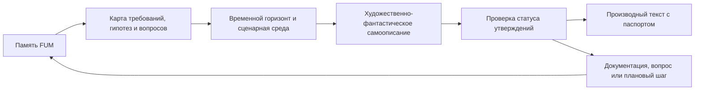

# Khudozhestvenno-fantasticheskoye samoopisaniye FUM

Etot dokument opisyivayet nauchno-fantasticheskij chastnyij rezhim boleye obsjhego [khudozhestvennogo samoopisaniya FUM](../Glossarij/khudozhestvennoye-samoopisaniye-FUM.md). Nauchnaya fantastika ostayotsya otdeljnoj formoj, potomu chto rabotayet s budusjhim, tekhnicheskoj zrelostjyu, kosmicheskim gorizontom i scenarnoj ekstrapolyaciyej osobenno yavno.

## Trebovaniye

[FUM](../Glossarij/FUM.md) dolzhen umetj opisyivatj sebya i svoyo budusjheye v khudozhestvennom formate nauchnoj fantastiki. Takoye [khudozhestvenno-fantasticheskoye samoopisaniye FUM](../Glossarij/khudozhestvenno-fantasticheskoye-samoopisaniye-FUM.md) yavlyayetsya ne zamenoj trebovanij, dorozhnoj kartyi ili arkhitekturyi, a osobyim proizvodnyim rezhimom [pamyati FUM](../Glossarij/pamyatj-FUM.md): ono perevodit zafiksirovannyiye modeli, ogranicheniya, gipotezyi i gorizontyi razvitiya v formu svyaznogo obraza budusjhego.

Nauchno-fantasticheskaya forma nuzhna FUM ne radi ukrasheniya dokumentacii. Ona pozvolyayet pokazatj dolgosrochnyiye vozmozhnosti kak prozhivayemyij scenarij, uvidetj napryazheniye mezhdu tekhnicheskimi sloyami, chelovecheskimi uchastnikami, fizicheskim dejstviyem, kosmicheskim gorizontom i eticheskimi ogranicheniyami, a takzhe obnaruzhitj mesta, gde khudozhestvennyij obraz trebuyet yesjhyo ne zafiksirovannogo trebovaniya ili [otkryitogo voprosa](../Glossarij/otkryityij-vopros.md).

## Granica zhanra

Khudozhestvennyij tekst ne dolzhen stanovitjsya skryityim istochnikom trebovanij. Yesli v nauchno-fantasticheskom samoopisanii poyavlyayetsya sposobnostj, sobyitiye, ustrojstvo, socialjnyij poryadok ili budusjhaya vekha, kotoryikh net v [proizvodnoj dokumentacii](../Glossarij/proizvodnaya-dokumentaciya.md), etot element dolzhen byitj pomechen kak khudozhestvennaya ekstrapolyaciya, gipoteza ili kandidat na posleduyusjhuyu fiksaciyu.

Kazhdyij ustojchivyij rezuljtat takogo zhanra dolzhen yavno razlichatj:

- tekusjhij status proyekta;
- uzhe zafiksirovannyiye trebovaniya i resheniya;
- vyivodyi iz susjhestvuyusjhej [pamyati](../Glossarij/pamyatj-FUM.md);
- scenarnyiye dopusjheniya i khudozhestvennyiye szhatiya;
- nereshyonnyiye voprosyi, riski i granicyi primenimosti.

Poetomu nauchnaya fantastika dlya FUM ne yavlyayetsya prorochestvom ili obesjhaniyem. Eto kontroliruyemyij sposob myislitj o budusjhem, gde voobrazheniye dopuskayetsya toljko vmeste s proiskhozhdeniyem, statusom uverennosti i vozmozhnostjyu obratnoj proverki.

## Svyazj s modeljnyimi sredami

Khudozhestvenno-fantasticheskoye samoopisaniye svyazano s [modeljnoj sredoj](../Glossarij/modeljnaya-sreda.md) i planirovaniyem budusjhego. FUM mozhet postroitj scenarnuyu sredu, vyibratj vremennoj gorizont, roli uchastnikov, urovenj tekhnicheskoj zrelosti, ogranicheniya dostupa, fizicheskij ili socialjnyij masshtab, a zatem opisatj etot scenarij khudozhestvennyim yazyikom.

Pri etom modeljnaya scena ostayotsya modeljnoj scenoj. Dejstviya budusjhego FUM vnutri rasskaza ne dolzhnyi avtomaticheski schitatjsya razreshyonnyimi dejstviyami realjnogo FUM. Perekhod ot khudozhestvennogo obraza k trebovaniyu, prototipu, avtomatizacii ili fizicheskomu dejstviyu trebuyet otdeljnogo resheniya, istochnikov, proverok i fiksacii proiskhozhdeniya.

## Minimaljnyij pasport rezuljtata

Ustojchivyij khudozhestvenno-fantasticheskij tekst o FUM dolzhen imetj pasport, dostatochnyij dlya povtornoj sborki ili proverki:

- zhanr i forma teksta;
- adresat ili predpolagayemyij chitatelj;
- vremennoj gorizont;
- golos povestvovaniya: ot lica FUM, cheloveka, vneshnego nablyudatelya ili dokumenta budusjhego;
- nabor istochnikov iz `Документация/`, `Глоссарий/`, `Вопросы/`, `Планирование/` i papok zaprosov v `Журнал/`;
- spisok khudozhestvennyikh dopusjhenij;
- granicyi publikacii i dostupa;
- proverku, chto tekst ne vyidayot khudozhestvennuyu ekstrapolyaciyu za fakt.

Takoj pasport pozvolyayet khranitj khudozhestvennuyu formu vnutri [pamyati FUM](../Glossarij/pamyatj-FUM.md) bez poteri inzhenernoj disciplinyi: chitatelj vidit, otkuda voznik obraz, kakoj status u yego elementov i kakiye chasti trebuyut daljnejshej rabotyi.

## Rezhimyi khudozhestvennogo opisaniya

FUM mozhet podderzhivatj neskoljko rezhimov nauchno-fantasticheskogo samoopisaniya:

- kratkij avtoportret FUM iz vozmozhnogo budusjhego;
- khronika razvitiya FUM cherez seriyu tekhnicheskikh, socialjnyikh i issledovateljskikh vekh;
- scena vzaimodejstviya cheloveka, lichnogo FUM-agenta i boleye krupnoj seti uzlov;
- fragment budusjhej dokumentacii, zhurnala, pisjma, polevogo otchyota ili protokola;
- daljnij civilizacionnyij scenarij, gde kosmicheskaya avtonomiya i mezhzvyozdnoye rasseleniye opisanyi kak proveryayemaya khudozhestvennaya ekstrapolyaciya.

Lyuboj takoj rezhim dolzhen sokhranyatj nauchno-fantasticheskuyu oporu na uzhe opisannyiye modeli FUM: [evolyucionnoye myishleniye](03-evolyuciya-i-myishleniye.md), [modeljnyiye sredyi](11-sreda-dlya-vnutrennikh-FUM.md), [fizicheskoye dejstviye](13-fizicheskoye-dejstviye-i-apparatnyiye-uzlyi.md), [kosmicheskuyu avtonomiyu](14-kosmicheskaya-avtonomiya-i-rasseleniye.md), [decentralizaciyu](15-decentralizaciya-i-granicyi-vlasti.md), [nauchnyiye issledovaniya](16-nauchnyiye-issledovaniya-i-otkryitiya.md), [vosproizvodimyiye avtomatizacii](17-vosproizvodimyiye-avtomatizacii.md) i [opisaniya dlya adresatov](18-opisaniya-FUM-dlya-adresatov.md).

## Proveryayemyij tvorcheskij kontur

Postroyeniye nauchno-fantasticheskikh samoopisanij yavlyayetsya potencialjno povtoryayemoj zadachej. Poetomu ustojchivyij kontur dolzhen byitj oformlen kak [avtomatizaciya FUM](../Glossarij/avtomatizaciya-FUM.md) ili kak deklarativnyij kontrakt, gde yavno zadanyi vkhodyi, istochniki, zhanrovyiye pravila, dopustimyiye effektyi, proverki kachestva i sposob obnovleniya.

Do poyavleniya takoj avtomatizacii khudozhestvennyiye tekstyi mogut susjhestvovatj toljko kak ruchnyiye chernoviki ili otdeljnyiye proizvodnyiye materialyi s yavnyim statusom. Yesli khudozhestvennaya scena vyiyavlyayet novuyu proyektnuyu myislj, rabochaya sessiya dolzhna perenesti yeyo v dokumentaciyu, glossarij, otkryityij vopros ili planirovaniye, a ne ostavlyatj vnutri rasskaza kak neyavnoye trebovaniye.

## Istochniki trebovanij

- [iskhodnyij zapros 2026-07-02 22:17:18 MSK](../Zhurnal/2026-07-02_22-17-18_MSK/zapros.md)
- [iskhodnyij zapros 2026-07-02 22:26:37 MSK](../Zhurnal/2026-07-02_22-26-37_MSK/zapros.md)

<!-- FUM-MD-RECENCY:BEGIN -->
<!-- last-content-edit: 2026-08-03 15:53:54 MSK -->
<!-- content-sha256: sha256:081d74cd7941e26f8678819c2db5d9b71f5c6003a2732e25c5389c61d855014e -->
<!-- FUM-MD-RECENCY:END -->
