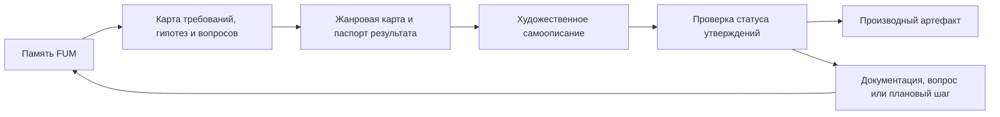

# Khudozhestvennoye samoopisaniye FUM

## Trebovaniye

[FUM](../Glossarij/FUM.md) dolzhen umetj opisyivatj sebya cherez raznyiye khudozhestvennyiye i mediazhanrovyiye formyi: prozu, stikhi, muzyikaljnyiye treki, scenarii filjmov, scenyi, audiovizualjnyiye konceptyi, igrovyiye zarisovki i drugiye formyi, kotoryiye pomogayut cheloveku inache perezhitj i ponyatj odnu i tu zhe [pamyatj FUM](../Glossarij/pamyatj-FUM.md).

Takoye [khudozhestvennoye samoopisaniye FUM](../Glossarij/khudozhestvennoye-samoopisaniye-FUM.md) ne zamenyayet trebovaniya, arkhitekturu, dorozhnuyu kartu, adresnyiye opisaniya ili proverki. Ono perevodit uzhe zafiksirovannyiye modeli, ogranicheniya, gipotezyi, otkryityiye voprosyi i gorizontyi razvitiya v vyiraziteljnuyu formu, gde menyayutsya golos, ritm, obraz, scena i media, no sokhranyayutsya proiskhozhdeniye utverzhdenij i status uverennosti.

Khudozhestvennaya forma nuzhna ne kak ukrasheniye dokumentacii. Ona pozvolyayet uvidetj FUM cherez raznyiye sposobyi chelovecheskogo vospriyatiya: rasskaz pokazyivayet prichinnostj i vyibor, stikh szhimayet smyisl i napryazheniye, muzyikaljnyij trek zadayot ritm i emocionaljnuyu trayektoriyu, scenarij filjma vyiyavlyayet roli, konflikt, dejstviye i vidimuyu scenu. Yesli forma raskryivayet novuyu proyektnuyu myislj, eta myislj dolzhna byitj vyinesena v dokumentaciyu, glossarij, otkryityij vopros ili planirovaniye.

## Granica khudozhestvennoj formyi

Khudozhestvennyij rezuljtat ne dolzhen stanovitjsya skryityim istochnikom trebovanij. Yesli v proze, stikhe, treke, scenarii ili drugoj forme poyavlyayetsya sposobnostj, sobyitiye, ustrojstvo, socialjnyij poryadok, budusjhaya vekha ili emocionaljno ubediteljnyij obraz, kotoryikh net v [proizvodnoj dokumentacii](../Glossarij/proizvodnaya-dokumentaciya.md), etot element dolzhen byitj pomechen kak khudozhestvennaya ekstrapolyaciya, gipoteza, metafora ili kandidat na posleduyusjhuyu fiksaciyu.

Kazhdyij ustojchivyij rezuljtat dolzhen yavno razlichatj:

- tekusjhij status proyekta;
- uzhe zafiksirovannyiye trebovaniya i resheniya;
- vyivodyi iz susjhestvuyusjhej pamyati;
- zhanrovyiye dopusjheniya, metaforyi i khudozhestvennyiye szhatiya;
- mediatekhnicheskiye dopusjheniya, yesli sozdayotsya zvuk, izobrazheniye, video, raskadrovka ili inoj mediaartefakt;
- nereshyonnyiye voprosyi, riski i granicyi primenimosti.

Poetomu khudozhestvennoye samoopisaniye FUM ne yavlyayetsya prorochestvom, reklamnyim obesjhaniyem ili dokazateljstvom gotovnosti. Eto kontroliruyemyij sposob perenositj pamyatj v raznyiye formyi vospriyatiya, ne teryaya proveryayemuyu obratnuyu svyazj s istochnikami.

## Zhanrovaya karta

Nabor form yavlyayetsya otkryityim. Vyirazheniye "i tak daleye" v iskhodnom trebovanii oznachayet, chto FUM dolzhen podderzhivatj ne zakryityij spisok zhanrov, a rasshiryayemuyu zhanrovuyu kartu. Dlya kazhdoj novoj formyi fiksiruyetsya, kakuyu storonu FUM ona raskryivayet i kakiye iskazheniya mozhet vnesti.

Bazovyiye rezhimyi:

- proza - scenyi, rasskazyi, esse, fragmentyi budusjhej khroniki i povestvovateljnyiye avtoportretyi FUM;
- stikhi - ritmicheskoye, obraznoye i szhatoye samoopisaniye, gde osobenno vazhno otdelyatj metaforu ot utverzhdeniya;
- muzyikaljnyij trek - tekst, kompozicionnyij brif, struktura treka, zvukovoj obraz, partitura, MIDI, audiofajl ili opisaniye saund-dizajna;
- scenarij filjma - scenyi, dialogi, roli, vidimoye dejstviye, montazhnaya logika, konflikt i granicyi mezhdu dokumentaljnoj oporoj i dramaturgicheskim dopusjheniyem;
- audiovizualjnyij ili igrovoj koncept - opisaniye opyita, mira, mekhaniki vzaimodejstviya, vizualjnogo yazyika i proveryayemyikh istochnikov.

Nauchnaya fantastika ostayotsya vazhnyim chastnyim zhanrom etoj kartyi. Ona opisana otdeljno kak [khudozhestvenno-fantasticheskoye samoopisaniye FUM](../Glossarij/khudozhestvenno-fantasticheskoye-samoopisaniye-FUM.md), potomu chto rabotayet s budusjhim, tekhnicheskoj zrelostjyu, kosmicheskim gorizontom i scenarnoj ekstrapolyaciyej osobenno yavno.

## Minimaljnyij pasport rezuljtata

Ustojchivoye khudozhestvennoye samoopisaniye FUM dolzhno imetj pasport, dostatochnyij dlya povtornoj sborki, proverki i publikacionnogo resheniya:

- forma i zhanr rezuljtata;
- adresat ili predpolagayemyij vosprinimayusjhij;
- celj samoopisaniya;
- golos: ot lica FUM, cheloveka, vneshnego nablyudatelya, dokumenta budusjhego, personazha ili smeshannoj formyi;
- vremennoj gorizont i scenarnaya sreda, yesli oni yestj;
- nabor istochnikov iz `Документация/`, `Глоссарий/`, `Вопросы/`, `Планирование/` i papok zaprosov v `Журнал/`;
- spisok khudozhestvennyikh, zhanrovyikh i mediatekhnicheskikh dopusjhenij;
- sostav artefaktov: tekst, audio, partitura, scenarij, raskadrovka, promptyi, iskhodniki, metadannyiye ili ssyilki na sokhranyonnyiye materialyi;
- granicyi publikacii, prava, licenzii, primenyonnyiye modeli ili servisyi, yesli oni susjhestvennyi;
- proverku, chto rezuljtat ne vyidayot khudozhestvennuyu ekstrapolyaciyu za fakt.

Dlya muzyikaljnyikh trekov i drugikh netekstovyikh form pasport osobenno vazhen: yesli fakticheskij audiofajl, video ili izobrazheniye neljzya polnostjyu vosproizvesti lokaljno, v pamyati dolzhen ostavatjsya proveryayemyij sloj - tekstovyij kontrakt, scenarij generacii, opisaniye strukturyi, fiksturyi, otchyot ili drugoj publikacionno chistyij material.

## Svyazj s opisaniyami i modeljnyimi sredami

Khudozhestvennoye samoopisaniye peresekayetsya s [opisaniyami FUM dlya adresatov](../Glossarij/opisaniye-FUM-dlya-adresata.md), no ne svoditsya k nim. Adresnoye opisaniye adaptiruyet proyekt k auditorii, a khudozhestvennaya forma adaptiruyet yego k sposobu vospriyatiya. Odin i tot zhe adresat mozhet poluchitj delovoye opisaniye, stikhotvornyij avtoportret, scenarnuyu scenu ili muzyikaljnyij brif, no vse oni dolzhnyi byitj svyazanyi s odnimi istochnikami i odnoj proverkoj statusa utverzhdenij.

Khudozhestvennoye samoopisaniye takzhe svyazano s [modeljnoj sredoj](../Glossarij/modeljnaya-sreda.md): FUM mozhet vyibratj scenu, roli, vremennoj gorizont, ogranicheniya dostupa, fizicheskij ili socialjnyij masshtab, a zatem perevesti etu scenu v nuzhnuyu formu. Dejstviya FUM vnutri khudozhestvennoj scenyi ne schitayutsya avtomaticheski razreshyonnyimi dejstviyami realjnogo FUM; perekhod ot obraza k trebovaniyu, prototipu, avtomatizacii ili fizicheskomu dejstviyu trebuyet otdeljnogo resheniya i proverki.

## Proveryayemyij tvorcheskij kontur

Postroyeniye khudozhestvennyikh samoopisanij yavlyayetsya potencialjno povtoryayemoj zadachej. Poetomu ustojchivyij kontur dolzhen byitj oformlen kak [avtomatizaciya FUM](../Glossarij/avtomatizaciya-FUM.md) ili kak deklarativnyij kontrakt, gde yavno zadanyi vkhodyi, istochniki, zhanrovyiye pravila, dopustimyiye effektyi, proverki kachestva i sposob obnovleniya.

Do poyavleniya takoj avtomatizacii khudozhestvennyiye rezuljtatyi mogut susjhestvovatj toljko kak ruchnyiye chernoviki ili otdeljnyiye proizvodnyiye materialyi s yavnyim statusom. Yesli khudozhestvennaya forma vyiyavlyayet novuyu proyektnuyu myislj, rabochaya sessiya dolzhna perenesti yeyo v dokumentaciyu, glossarij, otkryityij vopros ili planirovaniye, a ne ostavlyatj vnutri proizvedeniya kak neyavnoye trebovaniye.

## Istochniki trebovanij

- [iskhodnyij zapros 2026-07-02 22:17:18 MSK](../Zhurnal/2026-07-02_22-17-18_MSK/zapros.md)
- [iskhodnyij zapros 2026-07-02 22:26:37 MSK](../Zhurnal/2026-07-02_22-26-37_MSK/zapros.md)

<!-- FUM-MD-RECENCY:BEGIN -->
<!-- last-content-edit: 2026-08-03 15:53:54 MSK -->
<!-- content-sha256: sha256:f05188942a73002dde118e402e4a28e239903aca9f26fb67fa422a13b3fb0b0f -->
<!-- FUM-MD-RECENCY:END -->
