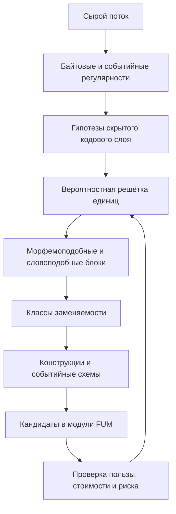

# [Potokovaya samostrukturizaciya FUM](../Glossarij/potokovaya-samostrukturizaciya-FUM.md)

[FUM](../Glossarij/FUM.md) dolzhen umetj stroitj sobstvennyiye yedinicyi vospriyatiya i myishleniya iz potoka opyita, a ne toljko primenyatj zaraneye zadannyij slovarj tokenov, skhem, modulej ili pravil. Etot sloj svyazyivayet [obobsjhyonnyij poisk povtoryayusjhikhsya posledovateljnostej](../Glossarij/obobsjhyonnyij-poisk-povtoryayusjhikhsya-posledovateljnostej.md), [pamyatj FUM](../Glossarij/pamyatj-FUM.md), [moduljnuyu arkhitekturu](../Glossarij/modulj-FUM.md) i [nejronnuyu gipersetj FUM](../Glossarij/nejronnaya-gipersetj-FUM.md): povtoryayemyiye i poleznyiye strukturyi snachala voznikayut kak statisticheskiye gipotezyi, zatem stanovyatsya latentnyimi yedinicami, potom [patternami pamyati](../Glossarij/pattern-pamyati.md), a posle proverki mogut datj osnovaniye dlya rosta novyikh modulej.

Glavnyij princip: yedinica uderzhivayetsya ne potomu, chto yeyo zaraneye nazval chelovek, a potomu, chto ona uluchshayet predskazaniye, szhatiye, perenosimostj, dejstviye ili proveryayemostj pri dopustimoj stoimosti. Poetomu bajt, skryitaya kodovaya yedinica, grafemopodobnyij blok, morfemopodobnyij fragment, slovopodobnaya yedinica, grammaticheskij klass, frazovaya konstrukciya, sobyitijnyij frejm i rabochij workflow otlichayutsya ne tipom proiskhozhdeniya, a urovnem abstrakcii i poleznostjyu v daljnejshej rabote.

## Ne staticheskaya LLM

[FUM](../Glossarij/FUM.md) ne dolzhen opisyivatjsya kak odna boljshaya samoizmenyayusjhayasya LLM, kotoraya v processe rabotyi beskontroljno perepisyivayet sobstvennyiye vesa. Boleye realistichnaya i proveryayemaya forma - ustojchivyij backbone, byistryiye vneshniye sloi pamyati, sredniye adaptivnyiye moduli i medlennaya konsolidaciya.

V etoj modeli fiksirovannaya siljnaya modelj mozhet ostavatjsya vazhnyim komponentom, no ona ne ravna vsemu [FUM](../Glossarij/FUM.md). Potokovaya samostrukturizaciya dobavlyayet vokrug neyo strukturnyij kontur: byistryij indeks povtoryayemosti, [samotokenizaciyu FUM](../Glossarij/samotokenizaciya-FUM.md), vyivedeniye abstrakcij, kontroller rosta, proverku poleznosti, zhurnal izmenenij i otkat. Tak proyekt sokhranyayet otlichiye mezhdu obyichnyim doobucheniyem modeli, vneshnej pamyatjyu, agentskim ciklom i nastoyasjhej arkhitekturnoj plastichnostjyu.

## [Iyerarkhiya funkcij i dannyikh](../Glossarij/iyerarkhiya-funkcij-i-dannyikh-FUM.md)

Ustojchivostj [FUM](../Glossarij/FUM.md) dolzhna opiratjsya na razlicheniye funkcii i dannyikh. Dannyiye menyayutsya byistreye: novyiye vkhodyi, kontekstyi, trassyi, oshibki, nablyudeniya, lokaljnyiye statistiki i poljzovateljskiye zaprosyi postupayut postoyanno. Telo funkcii menyayetsya medlenneye: pravilo segmentacii, prediktor prodolzheniya, agentskaya politika, adapter, ekspert, workflow ili nejrosetevaya karta dolzhnyi vyiderzhivatj seriyu vkhodov i proverok, prezhde chem byitj izmenyonnyimi.

Pri etom telo funkcii samo mozhet statj dannyimi dlya boleye bazovoj funkcii. Obucheniye klassicheskoj nejroseti yavlyayetsya chastnyim primerom: procedura obucheniya obrabatyivayet dataset i porozhdayet setj, kotoraya zatem obrabatyivayet novyiye vkhodyi. Dlya [FUM](../Glossarij/FUM.md) takaya skhema dolzhna statj mnogourovnevoj: byistryiye dannyiye obnovlyayut statistiku, statistika predlagayet abstrakcii, abstrakcii predlagayut moduli, kontroller plastichnosti menyayet moduli, a boleye medlennyij sloj proveryayet, nuzhno li menyatj sam kontroller.

Minimaljnyij mekhanizm mozhno opisatj kak povtoryayemuyu trojku:

```text
уровень N: функция F_N обрабатывает данные D_N
трасса T_N фиксирует входы, выходы, ошибки, стоимость и пользу
уровень N-1 решает, менять ли D_N, параметры F_N, тело F_N или правила отбора
```

Prakticheskaya yedinica takogo mekhanizma khranit telo preobrazovaniya, pattern primenimyikh vkhodov, sostoyaniye, istoriyu primeneniya, ocenku poljzyi, meru ustojchivosti i dopustimyij sposob izmeneniya. Yeyo minimaljnyij cikl mozhno svesti k chetyiryom operaciyam: primenitj preobrazovaniye, ocenitj rezuljtat, izmenitj podkhodyasjhij urovenj i zakrepitj udachnyij variant. Vyibor urovnya izmeneniya dolzhen byitj ekonomicheskim: poleznostj izmeneniya schitayetsya vmeste so stoimostjyu izmeneniya, shtrafom nestabiljnosti i shtrafom slozhnosti.

Takoj mekhanizm ne trebuyet srazu stroitj slozhnuyu samoizmenyayusjhuyusya sistemu. V pervom prototipe dostatochno razlichatj dannyiye zadachi, telo lokaljnoj funkcii, parametryi agenta i meta-funkciyu otbora, kotoraya po nablyudayemoj trasse reshayet, kakoj urovenj menyatj. Eto pozvolit iskatj resheniya po principu ustojchivyikh funkcij i boleye byistryikh dannyikh, ne smeshivaya obyichnuyu obrabotku vkhoda, obucheniye, runtime-mutaciyu i arkhitekturnuyu perestrojku.

## Nejrosetj kak sreda dlya agentov

Na nejrosetj v [FUM](../Glossarij/FUM.md) mozhno smotretj kak na kartu ili [modeljnuyu sredu](../Glossarij/modeljnaya-sreda.md), po kotoroj dvizhutsya agentyi. V prostejshem variante takaya karta sostoit iz arifmeticheskikh vyichislitelej: uzel prinimayet lokaljnyij signal, primenyayet elementarnoye preobrazovaniye i otkryivayet sosedniye perekhodyi. Agent v etoj ramke ne yavlyayetsya vsej nejrosetjyu; on yavlyayetsya interpretatorom, kotoryij vyibirayet marshrut, poryadok chteniya i sposob primeneniya lokaljnyikh vyichislenij.

Takoj vzglyad dobavlyayet runtime-sloj izmenchivosti. Odna i ta zhe setj mozhet predyyavlyatjsya neskoljkim agentam odinakovo po strukture, no po-raznomu po smyislu: odin agent vidit v uzlakh arifmeticheskiye operacii, drugoj - priznaki, tretij - pravila marshrutizacii, chetvyortyij - kandidatov v [moduli FUM](../Glossarij/modulj-FUM.md). Razlichiye voznikayet ne toljko iz vesov samoj seti, no i iz nastroyek agenta, yego pamyati, byudzheta, celej, dopustimyikh dejstvij i pravil interpretacii.

Vesa, aktivacii i svojstva ryober v takom rezhime yavlyayutsya ne toljko chislovyimi parametrami, no i obyyektami sredyi dlya agentov. Odin i tot zhe ves mozhet byitj marshrutom, soprotivleniyem, resursom, sledom, pravilom perekhoda, markerom zonyi ili triggerom mutacii v zavisimosti ot profilya agenta. Poetomu smyisl setevogo uchastka ne schitayetsya yedinstvennyim zaraneye zadannyim svojstvom vesa; on voznikayet vo vzaimodejstvii setevoj sredyi, vkhoda, agenta i pravil chteniya.

Nastrojki agenta mogut imetj nasleduyemyij ili geneticheskij status. Eto oznachayet, chto evolyucionnyij cikl perenositsya ne toljko v obucheniye nejroseti i ne toljko v medlennuyu [kontroliruyemuyu nejroplastichnostj FUM](../Glossarij/kontroliruyemaya-nejroplastichnostj-FUM.md), no i v ispolneniye: agentyi s raznyimi parametrami obkhoda, [profilyami vnimaniya FUM](../Glossarij/profilj-vnimaniya-FUM.md), riska, glubinyi, mutacij i kriteriyev poleznosti konkuriruyut na odnoj setevoj srede. Udachnyiye parametryi mogut zakreplyatjsya kak [narabotki](../Glossarij/narabotka.md), a neudachnyiye oslablyatjsya ili ukhoditj v arkhiv opyita.

Minimaljnaya formalizaciya takogo sloya opisyivayet sredu kak graf uzlov i ryober s sostoyaniyami, a ispolneniye - kak ogranichennuyu dinamiku populyacii agentov. U kazhdogo agenta yestj poziciya, vnutrenneye sostoyaniye, nasleduyemyij profilj interpretacii, energeticheskij ili vyichisliteljnyij byudzhet, politika povedeniya i pravila zaversheniya. Togda rezuljtat inferensa poyavlyayetsya ne kak yedinstvennyij pryamoj prokhod `y = F(x)`, a kak itog neskoljkikh nablyudayemyikh shagov: agentyi chitayut lokaljnoye okruzheniye, vyibirayut dejstviya, menyayut svoyo sostoyaniye ili sostoyaniye sredyi, peremesjhayutsya, poluchayut ocenku, mogut porozhdatj potomkov, mutirovatj ili ischezatj.

Dlya bezopasnosti eto razlichiye susjhestvenno. Izmeneniye interpretatora, kotoryij khodit po seti, deshevle i obratimeye, chem izmeneniye osnovnoj modeli ili yeyo medlennyikh modulej. Poetomu pervyiye prototipyi dolzhnyi proveryatj agentnoye chteniye setevoj sredyi na malyikh grafakh i prostyikh vyichislitelyakh: s trassoj marshruta, nastrojkami agenta, proiskhozhdeniyem rezuljtata, kriteriyem otbora i vozmozhnostjyu povtoritj tot zhe eksperiment.

Otdeljnaya granica upravlyayemosti - vnutrennyaya ekonomika populyacii. Yesli agentam razresheno razmnozhatjsya, mutirovatj, zanimatj resursyi ili menyatj sredu, prototip dolzhen imetj ogranicheniye chisla agentov, chisla shagov, byudzheta zapisi, kriterij lokaljnoj i globaljnoj poleznosti, sposob izvlecheniya itogovogo otveta i zasjhitu ot paraziticheskikh strategij. Inache runtime-evolyuciya mozhet nachatj optimizirovatj sobstvennoye vyizhivaniye, a ne zadachu [FUM](../Glossarij/FUM.md).

## Sloi rozhdeniya yedinic

Nizhnij vkhodnoj sloj mozhet nachinatjsya s syirogo bajtovogo ili sobyitijnogo potoka. [FUM](../Glossarij/FUM.md) ne obyazan zaraneye znatj, chto potok yavlyayetsya `UTF-8`, russkim tekstom, logom, kodom, interfejsnyim sobyitiyem ili trassoj instrumenta. On dolzhen umetj vyidvigatj neskoljko konkuriruyusjhikh gipotez o tom, kakiye skryityiye yedinicyi delayut potok luchshe predskazuyemyim i kompaktnyim.

Tipichnaya lestnica vyiglyadit tak:

```text
сырой поток
байтовые и событийные регулярности
скрытые кодовые единицы
графемоподобные единицы
морфемоподобные единицы
словоподобные блоки
классы взаимозаменяемости
конструкции и фразы
событийные схемы
модули, адаптеры и эксперты
```

## Opornyiye strukturnyiye elementyi

Syiroj vkhodnoj potok dlya [FUM](../Glossarij/FUM.md) ne sleduyet ponimatj kak polnostjyu besformennuyu materiyu. Kogda chelovek ili LLM vosprinimayet vneshnij nestrukturirovannyij signal, kompjyuter obyichno sokhranyayet yego uzhe v cifrovoj forme, kotoraya v toj ili inoj stepeni prigodna dlya strukturirovaniya: kak soobsjheniye, fajl, potok sobyitij, iskhodnyij kod, TeX-istochnik, razmetku, zhurnal dejstvij, derevo katalogov ili drugoj nositelj s yavnyimi i neyavnyimi granicami.

Osobenno eto zametno dlya porozhdayemoj informacii. Programmnyij kod, Markdown, TeX-dokument, specifikaciya, tablica ili scenarij dejstvij mogut srazu sokhranyatjsya tak, chtobyi budusjhaya obrabotka videla ne toljko linejnuyu posledovateljnostj simvolov, no i prostyiye strukturnyiye elementyi: komandyi, bloki, argumentyi, imena, zavisimosti, razdelyi, ssyilki, povtoryayusjhiyesya shablonyi i proiskhozhdeniye. Poetomu [pamyatj FUM](../Glossarij/pamyatj-FUM.md) dolzhna podderzhivatj ne toljko obnaruzheniye strukturyi "s nulya", no i soznateljnoye sokhraneniye uzhe izvestnyikh elementarnyikh form, kotoryiye pomogayut algoritmicheski dostrukturirovatj daljnejshij potok.

Takiye elementyi ne yavlyayutsya zhyostkoj vneshnej ontologiyej. Oni rabotayut kak proveryayemyiye oporyi i priors dlya samostrukturizacii: morfemyi, slovoformyi vmeste s paradigmami, soglasuyemyiye slovosochetaniya, predlozheniya, sintaksicheskiye formyi koda, TeX-komandyi i drugiye lokaljnyiye konstrukcii mogut zaraneye popadatj v pamyatj kak kandidatyi na yedinicyi razbora. Yesli oni povyishayut predskazaniye, szhatiye, perenosimostj ili kachestvo dejstviya, sistema usilivayet ikh; yesli oni meshayut novomu razboru, slishkom dorogi ili pereobobsjhayut potok, oni oslablyayutsya, utochnyayutsya ili udalyayutsya.

Pri zakreplenii takaya opora stanovitsya [strukturiruyusjhim operatorom FUM](../Glossarij/strukturiruyusjhij-operator-FUM.md): ne toljko fragmentom dlya khraneniya, no i dvunapravlennoj yedinicej formyi. V vospriyatii ona pomogayet perevesti potok v strukturu, a v porozhdenii - vyibratj formu, kotoraya snova mozhet statj nablyudayemyim potokom. Poetomu slovo s paradigmoj, soglasovateljnyij shablon, TeX-komanda, konstrukciya programmyi ili dokumentnyij blok dolzhnyi khranitj ne toljko imya, no i sposob raspoznavaniya, sposob porozhdeniya i svyazi s drugimi elementami.

Pamyatj takikh operatorov dolzhna byitj iyerarkhicheskoj, no ne obyazana byitj chistyim derevom. Tekhnicheski ona blizhe k stratificirovannomu grafu: odin nizkij element mozhet uchastvovatj v neskoljkikh sintaksicheskikh, semanticheskikh i diskursivnyikh strukturakh, a ryobra fiksiruyut obyyasneniye, porozhdeniye, obobsjheniye, perevod, utochneniye i konflikt. Nizkourovnevyij operator mozhet byitj privyazan k konkretnomu yazyiku, pisjmennosti ili formaljnomu sintaksisu: naprimer, k russkomu okonchaniyu, suffiksu, cheredovaniyu, svyazi kirillicheskoj i latinskoj zapisi ili forme zapisi TeX-komandyi. Boleye vyisokij operator mozhet opisyivatj uzhe ne poverkhnostnuyu formu, a semanticheskuyu svyazj mezhdu konstrukciyami: rolj uchastnika sobyitiya, otnosheniye opredeleniya i opredelyayemogo, perevodimyij shablon, argumentnuyu strukturu ili drugoj smyislovoj uzel, kotoryij sposoben svyazyivatj russkiye i anglijskiye formyi mezhdu soboj.

Mezhyyazyikovoye svyazyivaniye v takoj pamyati prokhodit cherez promezhutochnyiye semanticheskiye strukturyi, a ne cherez pryamoye ravenstvo slov ili form. Russkaya konstrukciya i anglijskaya konstrukciya mogut realizovyivatj odin i tot zhe frejm sobyitiya, rolj uchastnika ili sostoyaniye raznyimi morfosintaksicheskimi sredstvami; pri etom [FUM](../Glossarij/FUM.md) dolzhen sokhranyatj yazyikovo-specifichnyiye priznaki, neodnoznachnosti i poteri perevoda kak otdeljnyiye ostatki, a ne stiratj ikh radi slishkom gladkogo obsjhego uzla.

Minimaljnyij profilj takogo operatora vklyuchayet kanonicheskuyu formu, nabor nablyudayemyikh variantov, priznaki ili parametryi, usloviya raspoznavaniya, pravila porozhdeniya, ogranicheniya, cenu primeneniya, doveriye, polozhiteljnyiye i otricateljnyiye primeryi, svyazi s drugimi elementami, urovenj abstrakcii, proiskhozhdeniye, versiyu i istoriyu podtverzhdenij. Takoj profilj pozvolyayet [FUM](../Glossarij/FUM.md) zadavatj k novomu potoku prakticheskiye voprosyi: kakiye izvestnyiye formyi uzhe obyyasnyayut fragment, kakogo elementa ne khvatayet, stoit li sozdatj novyij operator i kak on pomozhet v budusjhikh razborakh i porozhdeniyakh.

Pamyatj strukturiruyusjhikh operatorov yavlyayetsya ne pobochnyim slovaryom, a minimaljnyim yadrom, s kotorogo mozhno nachinatj realizaciyu [FUM](../Glossarij/FUM.md). Ona khranit predvariteljnyiye znaniya v proveryayemoj forme: operator mozhet byitj vyiveden iz syirogo potoka, zadan chelovekom, predlozhen LLM ili utochnyon avtomatizaciyej, no ostayotsya rabochej gipotezoj, poka ne pokazyivayet vyiigryish opisaniya potoka. Poetomu samostrukturizaciya ne protivopostavlyayet ruchnoye i avtomaticheskoye proiskhozhdeniye operatorov; ona sravnivayet ikh po sposobnosti davatj kompaktnoye, perenosimoye i prigodnoye dlya dejstviya opisaniye.

Sistema strukturiruyusjhikh operatorov yavlyayetsya otdeljnyim napravleniyem resheniya zadachi obyyasnimosti togo, chto uzhe zalozheno v nejroseti. Ona ne prevrasjhayet vesa i svyazi LLM v polnostjyu prozrachnyij slovarj, no zadayot proveryayemyij vneshnij simvolicheskij interfejs mezhdu neyavnyimi znaniyami cheloveka i neyavnyimi znaniyami modeli. Cherez etot interfejs chelovek i LLM mogut sami i sovmestno predyyavlyatj svoi znaniya v forme operatorov, a algoritmyi - avtomaticheski proveryatj eti simvolicheskiye opisaniya, primenyatj ikh k potokam, vyiyavlyatj oshibki i nedostayusjhiye strukturyi, ekonomya resursyi cheloveka, modeli i kontekstnogo okna.

V polnoj arkhitekturnoj ramke eta liniya vyidelyayetsya kak [sistema strukturiruyusjhikh operatorov FUM](../Glossarij/sistema-strukturiruyusjhikh-operatorov-FUM.md). Potokovaya samostrukturizaciya ostayotsya nizhnim mekhanizmom rozhdeniya i proverki yedinic, a sistema operatorov opisyivayet obsjhij graf, cherez kotoryij takiye yedinicyi svyazyivayutsya s pamyatjyu, obyyasnimostjyu, avtomatizaciyami, modulyami i proveryayemyim dejstviyem.

Yesli pri analize vkhodnogo potoka ne khvatayet strukturiruyusjhego elementa, eto samo po sebe ne dokazyivayet, chto vkhod korrekten i sistema obyazana vyirastitj novyij operator. Takoj signal dolzhen rassmatrivatjsya dvoyako: kak vozmozhnaya oshibka, shum, nepolnota ili netochnostj vkhoda i kak vozmozhnoye obnaruzheniye novoj ustojchivoj formyi. Resheniye o popolnenii pamyati operatorov prinimayet proverochnyij kontur: on ocenivayet, umenjshayet li novyij operator opisaniye potoka, uluchshayet li predskazaniye i porozhdeniye, ne dubliruyet li uzhe izvestnyij operator i ne prevrasjhayet li sluchajnuyu oshibku v ustojchivoye pravilo.

Neobyyasnyonnaya chastj potoka dolzhna sokhranyatjsya ne kak pustoj proval razbora, a kak diagnosticheskij ostatok. V nyom fiksiruyutsya fragment, chastichnyiye sovpadeniya, neudavshiyesya operatoryi, tip konflikta, konkuriruyusjhiye obyyasneniya i tekusjhij status: shum, oshibka, redkij chastnyij sluchaj, gipoteza novogo operatora, utochneniye starogo operatora ili otlozhennaya neodnoznachnostj. Poetomu LLM v etom konture vyistupayet ne istochnikom istinyi, a generatorom kandidatov, kotoryiye zatem proveryayutsya po szhatiyu, soglasovannosti, povtornoj primenimosti i obratnomu porozhdeniyu.

V etoj roli strukturiruyusjhiye operatoryi pokhozhi na mekhanizm tipizacii v yazyikakh programmirovaniya. Oni ne obyazanyi zaraneye opisyivatj vsyu realjnostj, no dayut imenovannyiye, proveryayemyiye i kombiniruyemyiye formyi, cherez kotoryiye potok stanovitsya koroche dlya zapisi, ponyatneye dlya LLM i bezopasneye dlya daljnejshikh preobrazovanij. Chem luchshe operatornaya pamyatj obyyasnyayet vkhodnoj potok pri menjshej cene, tem boljshe poleznogo materiala pomesjhayetsya v kontekstnoye okno bez poteri proiskhozhdeniya i granic primenimosti.

Kompaktnoye opisaniye potoka dolzhno razlichatj rezhimyi vosstanovimosti. Dlya koda, TeX, matematicheskikh dokazateljstv, dannyikh, logov i yuridicheski znachimyikh dokumentov nuzhen polnostjyu vosstanovimyij rezhim: struktura vmeste s ostatkom i ssyilkami na iskhodnyiye fragmentyi dolzhna pozvolyatj proveritj ili vosstanovitj iskhodnyij potok. Dlya rezyume, dialoga, planirovaniya i dolgovremennoj smyislovoj pamyati dopustim smyislovoj rezhim, gde sokhranyayetsya kompaktnaya struktura i trassirovka k syirjyu, no ne kazhdaya poverkhnostnaya detalj. Oba rezhima nuzhnyi odnoj i toj zhe celi: szhatj potok dlya myishleniya, ne poteryav vozmozhnostj proverki.

Eta lestnica ne dolzhna byitj zhyostkoj. Odin uchastok potoka mozhet imetj neskoljko razborov odnovremenno: kak bajtovaya cepochka, kak skryitaya kodovaya yedinica, kak slovopodobnyij blok, kak chastj morfologicheskogo shablona i kak element konstrukcii. Poetomu vnutrenneye predstavleniye blizhe k veroyatnostnoj mnogourovnevoj reshyotke, chem k odnoj okonchateljnoj iyerarkhii.



## [Samotokenizaciya FUM](../Glossarij/samotokenizaciya-FUM.md)

Samotokenizaciya oznachayet, chto tokenyi i granicyi ne zadayutsya vneshnim preprocessorom kak okonchateljnaya istina. Oni voznikayut kak gipotezyi o vyigodnoj segmentacii potoka. Probel mozhet byitj siljnyim signalom granicyi v odnom domene i slabyim signalom v drugom. Kodovaya tochka Unicode mozhet byitj poleznyim urovnem, no ne obyazana sovpadatj s grafemoj ili smyislovoj yedinicej. Slovo mozhet byitj ne susjhnostjyu, a rezhimom szhatiya: dostatochno avtonomnyim blokom, kotoryij zamenyayetsya drugimi blokami v pokhozhikh kontekstakh i uchastvuyet v boleye krupnyikh konstrukciyakh.

Dlya russkogo teksta eto osobenno vazhno. [FUM](../Glossarij/FUM.md) dolzhen videtj ne toljko sosedstvo slovoform, no i sovmestnuyu variativnostj okonchanij, soglasovaniya i cheredovanij. Fragmentyi vrode `большой дом`, `большого дома`, `большим домом` dolzhnyi davatj signal ne toljko o povtorenii slov, no i o soglasovannoj sisteme form. V predeljnoj versii sistema vyivodit morfemopodobnyiye yedinicyi, osnovyi, okonchaniya i klassyi upotreblenij bez zaraneye zadannogo morfologicheskogo slovarya.

Takoj podkhod ne oznachayet polnogo otsutstviya predposyilok. Vstroyennyimi ostayutsya obsjhiye kriterii: predskazyivatj prodolzheniye, szhimatj potok, ekonomitj resursyi, sokhranyatj poleznyiye abstrakcii, udalyatj bespoleznyiye i uchityivatj proiskhozhdeniye. No lingvisticheskiye susjhnosti ne schitayutsya obyazateljnyimi aksiomami: oni dolzhnyi stanovitjsya vnutrennimi yedinicami toljko posle vyiigryisha v predskazanii, szhatii, perenosimosti ili dejstvii.

## [Suffiksno-prediktivnaya pamyatj FUM](../Glossarij/suffiksno-prediktivnaya-pamyatj-FUM.md)

Dlya samostrukturizacii nuzhen byistryij sloj, kotoryij vidit povtoryayusjhiyesya kontekstyi peremennoj dlinyi. Polnoye suffiksnoye derevo slishkom bukvaljnoye i dorogoye: ono khorosho isjhet tochnyiye podstroki, no plokho podkhodit kak yedinstvennyij substrat zhivoj pamyati. Dlya [FUM](../Glossarij/FUM.md) tochneye trebovatj ogranichennyij veroyatnostnyij suffiksno-kontekstnyij les.

Uzel takoj pamyati khranit ne toljko chastotu. Minimaljnyij profilj uzla vklyuchayet posledovateljnostj ili shablon, pozicii proiskhozhdeniya, schyotchik, davnostj, raspredeleniye prodolzhenij, entropiyu, vyiigryish predskazaniya, vyiigryish szhatiya, oshibku osnovnoj modeli na etom kontekste, svyazj s nagradoj ili usjherbom, urovenj abstrakcii, doveriye k istochnikam, byudzhet khraneniya i ssyilku na vozmozhnyij nejronnyij modulj.

Kontekstyi dolzhnyi otbiratjsya. [FUM](../Glossarij/FUM.md) ne dolzhen khranitj vsyo podryad: eto vedyot k kombinatornomu rostu. Kontekst sokhranyayetsya ili prodvigayetsya vyishe, yesli on dostatochno chasto vstrechayetsya, predskazyivayet budusjheye luchshe roditeljskogo konteksta, dayot szhatiye, obyyasnyayet oshibku, svyazan s vazhnyim rezuljtatom ili yavlyayetsya redkoj kritichnoj anomaliyej. Ustarevshiye, vrednyiye, slishkom dorogiye ili dubliruyusjhiye uzlyi slivayutsya, oslablyayutsya ili udalyayutsya.

Vazhnaya granica: tochnoye sovpadeniye formyi ne ravno ponimaniyu. Poetomu suffiksno-prediktivnaya pamyatj dolzhna podderzhivatj ne toljko bukvaljnyiye puti, no i pribliziteljnyiye sovpadeniya, peremennyiye slotyi, antiunifikaciyu, semanticheskiye klasteryi, vremennuyu terpimostj, normalizaciyu i svyazj s embedding-predstavleniyami. Inache sistema budet ploditj tyisyachi chastnyikh vetok vmesto odnogo perenosimogo pravila.

### Personaljnaya trassa prodolzhenij

Nabor teksta konkretnyim chelovekom dayot suffiksno-prediktivnoj pamyati yestestvennuyu posledovateljnostj proverok. Na vyibrannyikh kontroljnyikh tochkakh FUM mozhet zafiksirovatj dostupnoye modeli sostoyaniye dokumenta, kursor i kontekst, poluchitj raspredeleniye vozmozhnyikh prodolzhenij, a zatem sokhranitj fakticheskij sleduyusjhij fragment ili redaktorskoye sobyitiye. Para `замороженный прогноз -> последующий ввод` obrazuyet nablyudayemuyu trassu oshibki, prigodnuyu dlya sravneniya obsjhej LLM, LLM s kontekstom zadachi i personalizirovannogo byistrogo sloya; dopolniteljnyim kontrolem mogut sluzhitj perestanovka personaljnoj istorii ili sopostavimyiye profili neskoljkikh soglasivshikhsya uchastnikov.

Osnovnoj lokaljnoj meroj mozhet sluzhitj neozhidannostj fakticheskogo prodolzheniya `S_t = -log p(y_t | x_{<=t})`, a personaljnyij vyiigryish opredelyayetsya parnoj raznostjyu log-loss obsjhej i personalizirovannoj modelej na odnikh i tekh zhe sobyitiyakh. Pryamoye sravneniye trebuyet odnogo backbone i tokenizatora, zaraneye zadannyikh yedinicyi, gorizonta i sposoba usredneniya; dlya raznyikh tokenizacij loss nuzhno normirovatj, naprimer, v bitakh na UTF-8-bajt ili grafemu. Popadaniye v top-k i kalibrovka zaraneye opredelyonnogo sobyitiya yavlyayutsya vspomogateljnyimi merami, kak i redakcionnoye rasstoyaniye ili semanticheskaya blizostj na dlinnyikh gorizontakh. Yesli provajder ne raskryivayet veroyatnosti, mnozhestvo syemplov dayot toljko boleye slabuyu ocenku i eta poterya dolzhna byitj ukazana yavno.

Proveryayemaya trassa dolzhna stroitjsya po zaraneye zadannomu pravilu kontroljnyikh tochek i posledovateljnomu khronologicheskomu razdeleniyu. Snimok personaljnoj pamyati na kazhdom sreze obuchayetsya toljko na proshlom; otdeljnaya validation-seriya vyibirayet porogi i nastrojki, a proveryayemaya sessiya ne ispoljzuyetsya dlya adaptacii do zaversheniya ocenki. Sosedniye tokenyi i perekryivayusjhiyesya gorizontyi zavisimyi, poetomu rezuljtatyi agregiruyutsya po dokumentam ili sessiyam, a neopredelyonnostj ocenivayetsya s klasterizaciyej libo povtornoj vyiborkoj po sessiyam. Vyivod dlya odnogo cheloveka i nabora domenov ne obobsjhayetsya avtomaticheski na drugikh lyudej i zadachi.

Eta trassa proveryayet uzkij prediktor, no ne zadayot dostatochnuyu metriku sinkhronizacii znanij; svyazj mezhdu nimi ostayotsya v [otkryitom voprose o granicakh yestestvenno-yazyikovoj sinkhronizacii znanij](../Voprosyi/2026-07-13_20-34-23_MSK_granicyi-yestestvenno-yazyikovoj-sinkhronizacii-znanij-FUM.md).

Piki raskhozhdeniya yavlyayutsya kandidatami dlya analiza novyikh celej, ponyatij, konstrukcij i [strukturiruyusjhikh operatorov FUM](../Glossarij/strukturiruyusjhij-operator-FUM.md), no ne dokazateljstvom ikh poyavleniya. Oni takzhe mogut byitj vyizvanyi oshibkoj, smenoj zhanra, vstavkoj, nedostatkom razreshyonnogo konteksta ili stokhastichnostjyu LLM. Porog pika i procedura posleduyusjhego chelovecheskogo utochneniya zadayutsya do prosmotra proveryayemyikh rezuljtatov, a otchyot sokhranyayet lozhnyiye srabatyivaniya. Poleznyij personaljnyij pattern snachala popadayet v byistruyu pamyatj; ustojchivoye izmeneniye adaptera, modulya ili medlennoj modeli trebuyet povtornoj proverki na otlozhennyikh dannyikh.

## Vyivedeniye abstrakcij

Abstrakcii voznikayut iz dvukh dopolnyayusjhikh signalov. Sintagmaticheskij signal pokazyivayet, kakiye elementyi ustojchivo sosedstvuyut. Paradigmaticheskij signal pokazyivayet, kakiye elementyi mogut zanimatj odin i tot zhe slot. Yesli raznyiye elementyi poyavlyayutsya v pokhozhikh okruzheniyakh, [FUM](../Glossarij/FUM.md) mozhet vyivesti klass; yesli klassyi ustojchivo sochetayutsya, voznikayet konstrukciya; yesli konstrukciya vedyot sebya kak yedinyij vneshnij element, ona mozhet statj novyim simvolom boleye vyisokogo urovnya.

Antiunifikaciya prevrasjhayet pokhozhiye konkretnyiye puti v shablonyi s peremennyimi slotami. Naprimer, semejstvo konkretnyikh fragmentov mozhet datj shablon `X дом`, drugoye semejstvo - `красный Y`, a posleduyusjheye sopostavleniye - boleye obsjhij shablon `X Y`, gde `X` i `Y` uzhe ne proizvoljnyiye fragmentyi, a statisticheski ustojchivyiye klassyi. Dlya [FUM](../Glossarij/FUM.md) eto vazhno ne toljko v yazyike: ta zhe logika primenima k kodu, logam, interfejsnyim scenariyam, roboticheskim trayektoriyam i posledovateljnostyam dejstvij agenta.

Kriterij prinyatiya abstrakcii dolzhen byitj ekonomicheskim i proverochnyim. Novaya yedinica, klass ili konstrukciya uderzhivayetsya, yesli vyiigryish opisaniya dannyikh, predskazaniya i posleduyusjhego dejstviya prevyishayet stoimostj pravila, isklyuchenij, khraneniya, vyichisleniya i riska pereobobsjheniya. Poetomu chastota sama po sebe ne yavlyayetsya dostatochnoj: chastyiye sluzhebnyiye fragmentyi mogut byitj bespoleznyi, a redkiye predavarijnyiye, bezopasnostnyiye ili medicinskiye signalyi mogut byitj kriticheski vazhnyi.

## Otbor profilya vnimaniya

[Profilj vnimaniya FUM](../Glossarij/profilj-vnimaniya-FUM.md) yavlyayetsya byistryim konturom pereraspredeleniya nablyudeniya i proverki do boleye dorogogo izmeneniya pamyati ili arkhitekturyi. Suffiksno-prediktivnyij sloj uzhe dayot dlya oblasti chislo vozmozhnostej nablyudeniya, raspredeleniye prodolzhenij, neozhidannostj, oshibku modeli i svyazj s poljzoj ili usjherbom. Eti velichinyi pozvolyayut poroditj kandidatnoye povyisheniye vnimaniya tam, gde oshibka povtoryayema, znachima i predpolozhiteljno ustranima, libo kandidatnoye snizheniye dopolniteljnoj doli tam, gde otlozhennaya proverka pokazyivayet ustojchivuyu kalibrovannuyu predskazuyemostj i nizkij predeljnyij vyiigryish.

Sravneniye vyipolnyayetsya v sopostavimyikh vremennyikh oknakh i normiruyet oshibki po vozmozhnostyam ikh vozniknoveniya, tyazhesti, dostovernosti atribucii i polnote obratnoj svyazi. Zavisimyij vsplesk ne schitayetsya mnozhestvom nezavisimyikh oshibok, otsutstviye nablyudenij ne schitayetsya uspekhom, a yedinichnyij redkij kritichnyij otkaz mozhet imetj risk-zavisimyij prioritet nad obyichnoj chastotoj. Izmeneniye profilya prokhodit replay, tenevuyu libo otlozhennuyu proverku po posleduyusjhemu usjherbu, kachestvu dejstviya, kalibrovke i cene resursa; snizheniye chisla zaregistrirovannyikh oshibok samo po sebe ne yavlyayetsya uspekhom.

Byudzhet vnimaniya sokhranyayet nizhniye granicyi dlya obyazateljnyikh konturov i otdeljnyij issledovateljskij rezerv dlya novyikh, nizkovesovyikh i davno ne proveryavshikhsya oblastej. Sglazhivaniye, ogranicheniye razmera odnogo izmeneniya, periodicheskaya perekalibrovka i kontrolj smenyi raspredeleniya prepyatstvuyut drebezgu, zakhvatu vnimaniya shumom i petle `мало внимания -> мало обнаруженных ошибок -> ещё меньше внимания`. Toljko posle takoj proverki kontroller plastichnosti reshayet, nuzhen li novyij modulj, vspominaniye, izmeneniye vesa pamyati ili obratimoye oslableniye strukturyi.

## Kontroller plastichnosti

[Kontroliruyemaya nejroplastichnostj FUM](../Glossarij/kontroliruyemaya-nejroplastichnostj-FUM.md) perevodit poleznyiye uzlyi pamyati v arkhitekturnyiye izmeneniya. Snachala kontekst mozhet susjhestvovatj kak statistika i raspredeleniye prodolzhenij. Zatem on poluchayet latentnyij simvol ili embedding. Posle podtverzhdeniya poljzyi dlya nego mozhet poyavitjsya adapter, ekspert, specializirovannyij prediktor, detektor anomalii, pravilo marshrutizacii ili drugoj [modulj FUM](../Glossarij/modulj-FUM.md). Yesli modulj dolgo ostayotsya poleznyim, on mozhet byitj konsolidirovan v boleye medlennuyu pamyatj; yesli vreden ili ustarel, on prokhodit yavnyiye rezhimyi upravlyayemogo oslableniya, sliyaniya, razborki libo otdeljnogo fizicheskogo udaleniya.

Perekhodyi dolzhnyi prokhoditj cherez yavnyiye usloviya:

- kontekst imeyet dostatochnuyu podderzhku ili redkuyu kriticheskuyu vazhnostj;
- raspredeleniye prodolzhenij otlichayetsya ot roditeljskogo konteksta;
- tekusjhaya modelj stabiljno oshibayetsya na etom uchastke;
- novaya yedinica umenjshayet opisaniye dannyikh ili povyishayet kachestvo dejstviya;
- istochnik i doveriye pozvolyayut ispoljzovatj pattern bez zagryazneniya pamyati;
- byudzhet pamyati, zaderzhki i vyichislenij dopuskayet novyij modulj;
- proverka na uderzhannyikh dannyikh, replay ili sandbox ne pokazyivayet degradacii.

Takoj kontroller delayet rost seti ne obratnoj operaciyej pruning, a otdeljnyim upravlyayemyim processom. Novyiye chasti vkhodyat v uzhe specializirovavshuyusya sistemu, poetomu im nuzhnyi marshrutizaciya signalov, obucheniye, proverka na otsutstviye vreda i mekhanizm otkata. Inache novyiye elementyi mogut statj myortvyimi, poluchitj slabyij obuchayusjhij signal, vyizvatj drejf ili razdutj arkhitekturu.

## Kontur upravlyayemogo zabyivaniya

[Upravlyayemoye zabyivaniye FUM](../Glossarij/upravlyayemoye-zabyivaniye-FUM.md) dopolnyayet rost otdeljnyim konturom otbora nad susjhestvuyusjhimi strukturami. Konceptualjno kontroller razlichayet aktivnyij ves, porog i pokonturnuyu oblastj rabotosposobnosti, ne zakreplyaya poka ikh ispolnyayemoye predstavleniye: nenulevoj ves nizhe poroga uzhe vyiklyuchayet mekhanizm v dannom konture, no ne vo vsekh ostaljnyikh. On mozhet oslabitj svyazi, slitj dubliruyusjhiye formyi, razobratj proizvodnyij uzel ili vyivesti modulj iz marshrutizacii, odnako strukturnaya razborka zapresjhena, poka ostayotsya zasjhisjhyonnyij aktivnyij kontur ili zavisimostj. Dlya kazhdogo perekhoda sokhranyayutsya versiya politiki, osnovaniya, prezhneye i novoye sostoyaniye, zatronutyiye zavisimosti i rezuljtat posleduyusjhej proverki.

Struktura nizhe poroga aktivacii isklyuchayetsya iz obyichnogo izvlecheniya, marshrutizacii, konsolidacii i vliyaniya na dejstviye toljko v dannom konture, no yeyo soderzhimoye ne obyazano unichtozhatjsya. Yesli eto dopuskayut resursyi, privatnostj i politika khraneniya, struktura ostayotsya v kholodnom arkhive s identichnostjyu i proiskhozhdeniyem. Minimaljnaya vozmozhnostj obnaruzhitj otsutstviye mekhanizma ne dolzhna zavisetj toljko ot zabyivayemogo rabochego indeksa; yeyo tochnoye predstavleniye poka ne vyibrano. Novaya potrebnostj ili otkaz zapuskayet [vspominaniye FUM](../Glossarij/vspominaniye-FUM.md): otdeljnyij poisk osnovaniya, sozdaniye kandidata, proverku zavisimostej i lishj zatem naznacheniye novogo vesa. Fizicheskoye udaleniye ostayotsya otdeljnoj polnomochnoj operaciyej: v obyyavlennoj kontroliruyemoj oblasti ona udalyayet okhvachennyiye payload, kopii, kyeshi i soderzhateljnyiye proizvodnyiye, invalidiruyet dopustimyiye bessoderzhateljnyiye ssyilki i ne obesjhayet unichtozheniya nedostupnyikh avtonomnyikh kopij.

Kontroller otbirayet ne odnu globaljnuyu skorostj zabyivaniya, a politiki dlya raznyikh tempov pamyati, zadach i profilej riska. On sravnivayet kachestvo posleduyusjhikh predskazanij i dejstvij, osvobozhdyonnyij resurs, stoimostj i tochnostj vspominaniya ili novogo obucheniya, oshibki prezhdevremennogo i bezvozvratnogo zabyivaniya i sposobnostj sokhranitj redkiye kritichnyiye signalyi. Avtomaticheskij otbor ne izmenyayet poljzovateljskiye pravila khraneniya, udaleniya i dostupa, zasjhitu pervichnyikh istochnikov ili obyazateljnyiye ogranicheniya bezopasnosti. Sobyitiya zabyivaniya, vspominaniya i neudachnogo povtornogo obucheniya stanovyatsya dannyimi dlya sleduyusjhej versii politiki toljko cherez novyiye otdeljno prinyatyiye artefaktyi s sobstvennyim proiskhozhdeniyem.

Zasjhitnyij kontur dolzhen prepyatstvovatj petle chastotnogo samousileniya, pri kotoroj redko izvlekayemoye avtomaticheski stanovitsya yesjhyo meneye dostupnyim, proveryatj zavisimyiye vyivodyi pered razborkoj opornoj strukturyi i ne pozvolyatj obyichnomu poisku nezametno vernutj zabyityij mekhanizm v dejstviye. Otdeljnyij polnomochnyij audit mozhet chitatj kholodnoye osnovaniye, ne vosstanavlivaya mekhanizm; yego soderzhateljnyij rezuljtat vkhodit v pamyatj kak novyij proiskhozhdyonnyij kandidat s obyichnoj proverkoj. Yesli celj sostoit v vosstanovlenii identichnosti i rabotosposobnosti iskhodnogo mekhanizma, primenyayetsya vspominaniye.

Po umolchaniyu etot kontur rabotayet nad avtomaticheski vyivedennyimi proizvodnyimi strukturami. V lichnom FUM na odnoj mashine vkhodnaya sensornaya informaciya, razreshyonnaya imenno k dolgovremennomu khraneniyu i dopustimaya po pravam subyyektov dannyikh, pri dostatochnom byudzhete ostayotsya pervichnyim osnovaniyem. Kontroller mozhet izmenitj klass khraneniya i prioritet izvlecheniya zapisi, no ne yeyo operacionnyij ves kak mekhanizma i ne dolzhen avtomaticheski unichtozhatj soderzhimoye ili proiskhozhdeniye. Pri nekhvatke mesta snachala udalyayutsya perestraivayemyiye proizvodnyiye i kyeshi, zatem ogranichivayetsya novyij sbor i zaprashivayetsya polnomochnoye resheniye. V raspredelyonnoj seti ta zhe zasjhita ne oznachayet obyazateljnoj globaljnoj replikacii privatnogo vkhoda; zabyivaniye proizvodnyikh form vyipolnyayetsya lokaljno v granicakh vlasti uzla.

## Tempyi pamyati

Praktichnaya [pamyatj FUM](../Glossarij/pamyatj-FUM.md) dolzhna imetj neskoljko tempov obnovleniya.

Byistraya pamyatj khranit nedavniye i chastyiye povtoreniya: suffiksno-prediktivnyiye lesa, kyeshi, schyotchiki, lokaljnyiye reshyotki segmentacii i vremennyiye statisticheskiye uzlyi. Ona byistro reagiruyet, no ne obyazana nemedlenno menyatj osnovnyiye modeli.

Srednyaya pamyatj khranit proveryayemyiye specializirovannyiye formyi: adapteryi, LoRA-podobnyiye moduli, ekspertov, lokaljnyiye ansambli, pravila marshrutizacii i ustojchivyiye [patternyi pamyati](../Glossarij/pattern-pamyati.md). Ona uzhe vliyayet na vyichisleniye, no dolzhna ostavatjsya nablyudayemoj i zamenyayemoj.

Medlennaya pamyatj khranit konsolidirovannyiye strukturyi: osnovnuyu modelj, ustojchivyiye [moduli](../Glossarij/modulj-FUM.md), dokumentaciyu, proverennyiye avtomatizacii, dolgovremennyiye [narabotki](../Glossarij/narabotka.md) i pravila dostupa. Perenos iz byistryikh sloyov v medlennyiye trebuyet replay, distillation, proverki na uderzhannyikh potokakh, zhurnala proiskhozhdeniya i vozmozhnosti otkata.

## Bezopasnostj i ogranicheniya

Potokovaya samostrukturizaciya nesyot otdeljnyiye riski. Glavnyij risk - konflikt stabiljnosti i plastichnosti: sistema dolzhna uchitj novoye, no ne razrushatj nekontroliruyemo sokhranyayusjhiye poljzu staryiye strukturyi. Slishkom stabiljnaya sistema perestayot adaptirovatjsya, slishkom plastichnaya teryayet pamyatj i doveriye.

Vtoroj risk - poterya plastichnosti: dazhe bez yavnogo zabyivaniya sistema mozhet perestatj effektivno uchitj novoye iz-za zastyivshikh marshrutov i staryikh predstavlenij. Poetomu [FUM](../Glossarij/FUM.md) dolzhen uchityivatj ne toljko kachestvo tekusjhikh otvetov, no i sposobnostj sokhranyatj obuchayemostj.

Tretij risk - otravleniye i navyazannyij rost. Yesli povtoreniye sozdayot strukturu, zloumyishlennik ili shumnyij istochnik mozhet mnogokratno podatj vrednyij pattern i vyirastitj nezhelateljnyij modulj. Nuzhnyi karantin novyikh patternov, vesa doveriya k istochnikam, sandbox-konsolidaciya, proiskhozhdeniye, ruchnyiye ili avtomaticheskiye podtverzhdeniya dlya opasnyikh oblastej i proveryayemyij otkat.

Chetvyortyij risk - apparatnaya i ekspluatacionnaya cena. Neregulyarnyiye strukturyi, runtime-vetvleniya, postoyannoye rewiring i mnozhestvo melkikh ekspertov mogut byitj logicheski ekonomnyi, no plokho lozhitjsya na GPU i uvelichivatj zaderzhki. Poetomu kriterii rosta dolzhnyi uchityivatj ne toljko kachestvo modeli, no i realjnuyu stoimostj vyipolneniya.

Otdeljnyij risk personaljnoj trassyi prodolzhenij svyazan s chernovikami, udalyonnyim tekstom i vremennyimi kharakteristikami nabora. Oni mogut byitj chuvstviteljneye otpravlennogo soobsjheniya i stanovitjsya povedencheskim otpechatkom. Nablyudayemostj poljzovateljskogo vvoda ne oznachayet razresheniya sokhranyatj yego, obuchatjsya na nyom ili peredavatj vneshnej modeli: nuzhnyi yavnoye vklyucheniye rezhima, otdeljnyiye [urovni dostupa](../Glossarij/urovenj-dostupa.md), zapret globaljnogo perekhvata vne vyibrannoj oblasti, isklyucheniye zasjhisjhyonnyikh polej, minimizaciya sroka i sostava khraneniya i lokaljnaya obrabotka po umolchaniyu. Personalizaciya dolzhna po vozmozhnosti zhitj v otdelyayemom adaptere ili indekse; kontrakt udaleniya perechislyayet syiruyu trassu, proizvodnyiye priznaki, kyeshi, rezervnyiye kopii i modeljnyij sloj i yavno priznayot sostoyaniya vneshnego provajdera, udaleniye kotoryikh neljzya garantirovatj.

## Minimaljnyij prototip

Pervyij prototip ne dolzhen pyitatjsya postroitj polnocennyij samorastusjhij mozg. Dostatochno proveritj svyazku:

```text
backbone model
+ multi-level prediction suffix forest
+ segmentation lattice
+ abstraction/growth controller
+ adapter or expert registry
+ replay/check/rollback loop
```

Dejstvuyusjhiye prototipyi yesjhyo ne podtverzhdayut etot kontur upravlyayemogo zabyivaniya. Ogranichennyij pruning suffiksnyikh kontekstov i status `obsolete` operatornogo kandidata realizuyut toljko otdeljnyiye predshestvuyusjhiye mekhaniki; pokonturnyij ves i porog prekrasjheniya rabotyi, meta-urovenj obnaruzheniya, razdeleniye khraneniya i rabotosposobnosti, vspominaniye, bezvozvratnoye zabyivaniye i otbor ikh tempa ne realizovanyi i ne imeyut ispolnyayemoj priyomki.

Dlya proverki [iyerarkhii funkcij i dannyikh FUM](../Glossarij/iyerarkhiya-funkcij-i-dannyikh-FUM.md) nuzhen yesjhyo boleye malyij kontur: chistaya funkciya nad vkhodnyimi dannyimi, nabor parametrov, nablyudayemaya trassa oshibok i poljzyi, a takzhe meta-funkciya, kotoraya vyibirayet odin iz variantov izmeneniya: obnovitj dannyiye, izmenitj parametryi, zamenitj telo funkcii ili ostavitj sloj neizmennyim. Takoj prototip dolzhen pokazyivatj, chto ustojchivostj voznikayet ne iz zapreta izmenenij, a iz razlicheniya urovnej, na kotoryikh izmeneniye dopustimo.

Dlya dokumentacionnogo prototipa [FUM](../Glossarij/FUM.md) blizhajshaya proverka mozhet byitj yesjhyo prosjhe: vzyatj neboljshoj potok zaprosov, pravok, logov ili tekstov, postroitj ogranichennyij suffiksno-prediktivnyij indeks, pokazatj kandidatyi v yedinicyi i abstrakcii, ocenitj ikh po predskazaniyu i szhatiyu, zatem oformitj otchyot o tom, kakiye iz nikh mogli byi statj [patternami pamyati](../Glossarij/pattern-pamyati.md), avtomatizaciyami ili modulyami.

Odna iz uzkikh fikstur dolzhna vyipolnyatj slepoye retrospektivnoye vosproizvedeniye dobrovoljno zapisannoj trassyi: v kazhdoj zaraneye zadannoj kontroljnoj tochke modelj poluchayet toljko tot prefiks i razreshyonnyij kontekst, kotoryiye susjhestvovali v sootvetstvuyusjhij moment, a proverochnyij skript otkryivayet sleduyusjheye sobyitiye lishj posle fiksacii prognoza. Takoj replay vyichislyayetsya posle nabora i ne vyidayotsya za prospektivnoye predskazaniye. Otdeljnyij prospektivnyij tenevoj rezhim stroit prognoz do sobyitiya, no ne pokazyivayet yego soderzhaniye cheloveku; on ustranyayet pryamoye vliyaniye podskazki, odnako ne isklyuchayet effekta osvedomlyonnosti o zapisi, indikatorov i zaderzhek. Vidimoye avtodopolneniye obrazuyet tretjyu, intervencionnuyu fazu: bez zaraneye randomizirovannogo pokaza i kontrolya perenosa mezhdu usloviyami ona dayot toljko opisateljnuyu ocenku prinyatiya, otkloneniya i redaktirovaniya, a ne prichinnyij effekt podskazki.

[Tenevoj redaktor prodolzhenij](../Prototipyi/tenevoj-redaktor-prodolzhenij/README.md) realizuyet pervyij uzkij vertikaljnyij srez etoj fiksturyi. Odin boljshoj tekstovyij fajl yavlyayetsya kanonicheskim vkhodom cheloveka. Ogranichennoye derevo tochnyikh UTF-8-suffiksnyikh kontekstov obnovlyayetsya potokovo i soobsjhayet o dostizhenii byudzheta. Na odnoj zamorozhennoj kontroljnoj tochke lokaljnaya LLM stroit skryitoye prodolzheniye, po mere vyivoda dlya nego sobirayetsya takaya zhe proizvodnaya struktura, a posleduyusjhij nabor cheloveka obrazuyet vtoruyu vetvj. Po dostizhenii obsjhego bajtovogo gorizonta generaciya ostanavlivayetsya i sravnivayutsya tekst, redakcionnoye rasstoyaniye i vesa obsjhikh libo razdeljnyikh perekhodov. Takoj baseline proveryayet skvoznoj potok, no yesjhyo ne realizuyet veroyatnostnyij les, log-loss, personalizirovannoye obucheniye, samotokenizaciyu ili statisticheskij vyivod po serii sessij.

Pervyij prototip pamyati strukturiruyusjhikh operatorov dolzhen byitj yesjhyo uzhe: vzyatj malyij potok, nabor zaraneye zadannyikh operatorov, rezhim LLM-predlozheniya novyikh operatorov i proverku otkazov. On dolzhen sravnivatj svobodnyij razbor s razborom cherez operatornuyu pamyatj, fiksirovatj vyiigryish szhatiya, vyiigryish predskazaniya, kachestvo obratnogo porozhdeniya, cenu khraneniya operatora, diagnosticheskiye ostatki, konfliktyi, statusyi kandidatov i sluchai, gde nedostayusjhij element skoreye ukazyivayet na oshibochnyij vkhod, chem na novuyu poleznuyu formu. Otdeljnaya proverka dolzhna pokazyivatj, chto operatornaya pamyatj ne toljko szhimayet potok, no i delayet obyyasnimyim sootvetstviye mezhdu poljzovateljskim smyislom, simvolicheskim operatorom i povedeniyem LLM, kotoroye etot operator pomogayet stabilizirovatj ili proveryatj. Otdeljnyiye fiksturyi dolzhnyi razlichatj polnostjyu vosstanovimyij razbor koda ili TeX, smyislovoye szhatiye dialoga ili planovogo teksta, nizkourovnevyiye yazyikovo-specifichnyiye operatoryi dlya okonchanij, suffiksov i variantov zapisi, a takzhe boleye vyisokourovnevyiye semanticheskiye operatoryi, svyazyivayusjhiye russkiye i anglijskiye konstrukcii cherez obsjhij frejm s yavnyimi yazyikovyimi ostatkami i poteryami.

Otdeljnyij minimaljnyij prototip dolzhen proveritj nejrosetj kak sredu dlya agentov: postroitj malyij graf arifmeticheskikh vyichislitelej, zadatj neskoljko agentov s raznyimi nasleduyemyimi parametrami interpretacii, sokhranitj trassyi peremesjheniya i sravnitj, kakiye parametryi dayut poleznyiye rezuljtatyi bez izmeneniya samoj setevoj kartyi.

Takoj prototip dolzhen byitj vosproizvodimyim, lokaljnyim i ne trebovatj sekretov. Yesli on nachinayet menyatj povedeniye agenta, snachala nuzhna TDD-proverka kontraktov: vkhodnaya zadacha, nachaljnyij graf, nachaljnaya populyaciya, nasleduyemyiye parametryi, ogranicheniye byudzheta, ozhidayemaya trassa, kriterii razmnozheniya i udaleniya, otchyot proiskhozhdeniya i otkaznyiye rezhimyi.

## Svyazj s arkhitekturoj

[Potokovaya samostrukturizaciya FUM](../Glossarij/potokovaya-samostrukturizaciya-FUM.md) utochnyayet neskoljko uzhe opisannyikh sloyov. Dlya [obobsjhyonnogo poiska povtoryayusjhikhsya posledovateljnostej](../Glossarij/obobsjhyonnyij-poisk-povtoryayusjhikhsya-posledovateljnostej.md) ona zadayot konkretnyij mekhanizm: ne toljko spisok povtorov, no i mnogourovnevyij prediktivnyij les s ocenkoj poljzyi. Dlya [moduljnoj arkhitekturyi](../Glossarij/modulj-FUM.md) ona obyyasnyayet, otkuda berutsya novyiye kandidatyi v moduli. Dlya [evolyucionnogo myishleniya](../Glossarij/obobsjhyonnyij-darvinovskij-algoritm.md) ona zadayot nizhnij kontur izmenchivosti i otbora vnutri samogo potoka opyita. Dlya [nejronnoj giperseti FUM](../Glossarij/nejronnaya-gipersetj-FUM.md) ona pokazyivayet, kak vnutrenniye svyazi mogut rasti ne proizvoljno, a iz povtoryayemyikh, proveryayemyikh i poleznyikh struktur.

## Istochniki trebovanij

- [iskhodnyij zapros 2026-07-31 14:01:03 MSK - Zakrepitj otbor profilya vnimaniya FUM](../Zhurnal/2026-07-31_14-01-03_MSK_zakrepitj-otbor-profilya-vnimaniya-FUM/zapros.md)
- [iskhodnyij zapros 2026-07-31 12:25:42 MSK - Utochnitj sokhraneniye vkhodnoj sensornoj informacii](../Zhurnal/2026-07-31_12-25-42_MSK_utochnitj-sokhraneniye-vkhodnoj-sensornoj-informacii/zapros.md)
- [iskhodnyij zapros 2026-07-31 12:20:47 MSK - Utochnitj vspominaniye i bezvozvratnoye zabyivaniye](../Zhurnal/2026-07-31_12-20-47_MSK_utochnitj-vspominaniye-i-bezvozvratnoye-zabyivaniye/zapros.md)
- [iskhodnyij zapros 2026-07-31 11:57:37 MSK - Zakrepitj upravlyayemoye zabyivaniye FUM](../Zhurnal/2026-07-31_11-57-37_MSK_zakrepitj-upravlyayemoye-zabyivaniye-FUM/zapros.md)
- [iskhodnyij zapros 2026-07-06 10:05:34 MSK - Integrirovatj soderzhimoye ChatGPT dialoga](../Zhurnal/2026-07-06_10-05-34_MSK_integrirovatj-soderzhimoye-chatgpt-dialoga/zapros.md)
- [iskhodnyij zapros 2026-07-06 10:24:52 MSK - Opisatj nejrosetj kak sredu agentov](../Zhurnal/2026-07-06_10-24-52_MSK_opisatj-nejrosetj-kak-sredu-agentov/zapros.md)
- [iskhodnyij zapros 2026-07-06 10:51:33 MSK - Integrirovatj dialog ChatGPT pro](../Zhurnal/2026-07-06_10-51-33_MSK_integrirovatj-dialog-chatgpt-pro/zapros.md)
- [iskhodnyij zapros 2026-07-06 14:49:39 MSK - Opisatj iyerarkhiyu funkcij i dannyikh](../Zhurnal/2026-07-06_14-49-39_MSK_opisatj-iyerarkhiyu-funkcij-i-dannyikh/zapros.md)
- [iskhodnyij zapros 2026-07-06 15:00:09 MSK - Utochnitj iyerarkhiyu funkcij i dannyikh](../Zhurnal/2026-07-06_15-00-09_MSK_utochnitj-iyerarkhiyu-funkcij-i-dannyikh/zapros.md)
- [iskhodnyij zapros 2026-07-08 09:10:55 MSK - Opisatj strukturnyiye elementyi samostrukturizacii](../Zhurnal/2026-07-08_09-10-55_MSK_opisatj-strukturnyiye-elementyi-samostrukturizacii/zapros.md)
- [iskhodnyij zapros 2026-07-08 09:21:09 MSK - Utochnitj strukturnyiye elementyi FUM](../Zhurnal/2026-07-08_09-21-09_MSK_utochnitj-strukturnyiye-elementyi-FUM/zapros.md)
- [iskhodnyij zapros 2026-07-08 10:18:09 MSK - Zakrepitj pamyatj strukturiruyusjhikh operatorov](../Zhurnal/2026-07-08_10-18-09_MSK_zakrepitj-pamyatj-strukturiruyusjhikh-operatorov/zapros.md)
- [iskhodnyij zapros 2026-07-08 10:34:09 MSK - Dobavitj istochnik pamyati strukturiruyusjhikh operatorov](../Zhurnal/2026-07-08_10-34-09_MSK_dobavitj-istochnik-pamyati-strukturiruyusjhikh-operatorov/zapros.md)
- [iskhodnyij zapros 2026-07-08 10:54:49 MSK - Utochnitj urovni strukturiruyusjhikh operatorov](../Zhurnal/2026-07-08_10-54-49_MSK_utochnitj-urovni-strukturiruyusjhikh-operatorov/zapros.md)
- [iskhodnyij zapros 2026-07-08 11:06:21 MSK - Svyazatj utochneniye pamyati strukturiruyusjhikh operatorov](../Zhurnal/2026-07-08_11-06-21_MSK_svyazatj-utochneniye-pamyati-strukturiruyusjhikh-operatorov/zapros.md)
- [iskhodnyij zapros 2026-07-08 11:25:24 MSK - Zakrepitj operatoryi kak interfejs obyyasnimosti](../Zhurnal/2026-07-08_11-25-24_MSK_zakrepitj-operatoryi-kak-interfejs-obyyasnimosti/zapros.md)
- [iskhodnyij zapros 2026-07-08 11:37:43 MSK - Svyazatj rasshirennuyu vetku strukturiruyusjhikh operatorov](../Zhurnal/2026-07-08_11-37-43_MSK_svyazatj-rasshirennuyu-vetku-strukturiruyusjhikh-operatorov/zapros.md)
- [iskhodnyij zapros 2026-07-08 11:49:28 MSK - Obobsjhitj sistemu strukturiruyusjhikh operatorov](../Zhurnal/2026-07-08_11-49-28_MSK_obobsjhitj-sistemu-strukturiruyusjhikh-operatorov/zapros.md)
- [iskhodnyij zapros 2026-07-08 11:58:07 MSK - Utochnitj vneshnij interfejs strukturiruyusjhikh operatorov](../Zhurnal/2026-07-08_11-58-07_MSK_utochnitj-vneshnij-interfejs-strukturiruyusjhikh-operatorov/zapros.md)
- [iskhodnyij zapros 2026-07-14 01:40:47 MSK - Sravnitj prodolzheniye LLM s naborom cheloveka](../Zhurnal/2026-07-14_01-40-47_MSK_sravnitj-prodolzheniye-LLM-s-naborom-cheloveka/zapros.md)
- [iskhodnyij zapros 2026-07-14 08:54:56 MSK - Sozdatj prototip raskhozhdeniya prodolzhenij](../Zhurnal/2026-07-14_08-54-56_MSK_sozdatj-prototip-raskhozhdeniya-prodolzhenij/zapros.md)

## Vneshnij material

- [Dinamicheskaya nejrosetj](../Istochniki/URL/https/chatgpt.com/share/6a4b5320-48c4-83ed-829e-e856d313b1fb/dinamicheskaya-nejrosetj.md)
- [Indeks istochnika](../Istochniki/URL/https/chatgpt.com/share/6a4b5320-48c4-83ed-829e-e856d313b1fb/source-index.md)
- [Otchyot ob izvlechenii](../Istochniki/URL/https/chatgpt.com/share/6a4b5320-48c4-83ed-829e-e856d313b1fb/extraction-report.md)
- [Oformlennyij dialog ob evolyucii agentov v setyakh](../Istochniki/URL/https/chatgpt.com/share/6a4b5e1a-f1e0-83eb-9288-df45821b1f2a/evolyutsiya-agentov-v-setyakh.md)
- [Indeks istochnika](../Istochniki/URL/https/chatgpt.com/share/6a4b5e1a-f1e0-83eb-9288-df45821b1f2a/source-index.md)
- [Otchyot ob izvlechenii](../Istochniki/URL/https/chatgpt.com/share/6a4b5e1a-f1e0-83eb-9288-df45821b1f2a/extraction-report.md)
- [FUM i ustojchivost'](../Istochniki/URL/https/chatgpt.com/share/6a4b9890-148c-83eb-bda3-8ac1ac836d02/fum-i-ustojchivost.md)
- [Indeks istochnika](../Istochniki/URL/https/chatgpt.com/share/6a4b9890-148c-83eb-bda3-8ac1ac836d02/source-index.md)
- [Otchyot ob izvlechenii](../Istochniki/URL/https/chatgpt.com/share/6a4b9890-148c-83eb-bda3-8ac1ac836d02/extraction-report.md)
- [Strukturirovannye elementy FUM](../Istochniki/URL/https/chatgpt.com/share/6a4dec02-7e54-83eb-b2cb-798dca93d239/strukturirovannye-elementy-fum.md)
- [Indeks istochnika](../Istochniki/URL/https/chatgpt.com/share/6a4dec02-7e54-83eb-b2cb-798dca93d239/source-index.md)
- [Otchyot ob izvlechenii](../Istochniki/URL/https/chatgpt.com/share/6a4dec02-7e54-83eb-b2cb-798dca93d239/extraction-report.md)
- [Vetka · Strukturirovannye elementy FUM](../Istochniki/URL/https/chatgpt.com/share/6a4dfd46-c6e4-83eb-8f27-8c91e25d6e01/vetka-strukturirovannye-elementy-fum.md)
- [Indeks istochnika](../Istochniki/URL/https/chatgpt.com/share/6a4dfd46-c6e4-83eb-8f27-8c91e25d6e01/source-index.md)
- [Otchyot ob izvlechenii](../Istochniki/URL/https/chatgpt.com/share/6a4dfd46-c6e4-83eb-8f27-8c91e25d6e01/extraction-report.md)
- [Vetka · Strukturirovannye elementy FUM](../Istochniki/URL/https/chatgpt.com/share/6a4e0a66-774c-83eb-bfca-799a30bd9ad7/vetka-strukturirovannye-elementy-fum.md)
- [Indeks istochnika](../Istochniki/URL/https/chatgpt.com/share/6a4e0a66-774c-83eb-bfca-799a30bd9ad7/source-index.md)
- [Otchyot ob izvlechenii](../Istochniki/URL/https/chatgpt.com/share/6a4e0a66-774c-83eb-bfca-799a30bd9ad7/extraction-report.md)

<!-- FUM-MD-RECENCY:BEGIN -->
<!-- last-content-edit: 2026-08-03 14:54:04 MSK -->
<!-- content-sha256: sha256:96de73d394be10cdcf956561d13ede4ef36595e930be890c8cc533997d8a279a -->
<!-- FUM-MD-RECENCY:END -->
