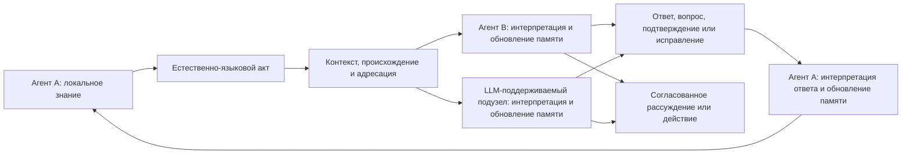

# Yestestvennyij yazyik i [sinkhronizaciya znanij FUM](../Glossarij/yestestvenno-yazyikovaya-sinkhronizaciya-znanij-FUM.md)

Yestestvennyij yazyik yavlyayetsya dlya [FUM](../Glossarij/FUM.md) ne toljko poljzovateljskim interfejsom i ne toljko istochnikom otdeljnyikh semanticheskikh rolej. On rassmatrivayetsya kak uzhe slozhivshijsya u lyudej yazyik sinkhronizacii znanij mezhdu avtonomnyimi uchastnikami s raznyimi telami, pamyatjyu, opyitom, celyami i tochkami zreniya. Cherez vyiskazyivaniya, otvetyi i ispravleniya uchastniki ne peredayut drug drugu polnoye vnutrenneye sostoyaniye, a delayut znachimuyu chastj znaniya vzaimno vosstanavlivayemoj i prigodnoj dlya sovmestnogo myishleniya i dejstviya.

Iz etogo sleduyet arkhitekturnyij princip: II-agent dolzhen byitj postroyen po obrazcu takoj seti. [FUM](../Glossarij/FUM.md) dolzhen umetj byitj yeyo uchastnikom ryadom s lyudjmi i drugimi agentami, a sobstvennoye ustrojstvo organizovyivatj rekursivno kak setj uzlov s lokaljnyimi sostoyaniyami, yazyikovyim vzaimodejstviyem, obsjhej i razdeljnoj pamyatjyu, obratnoj svyazjyu i mekhanizmami ispravleniya rassoglasovanij. LLM yestestvenno vklyuchayetsya v etot kontur kak mekhanizm ponimaniya i porozhdeniya yazyika, no ustojchivyij agentskij uzel dopolniteljno trebuyet pamyati, proiskhozhdeniya, identichnosti, agentskogo cikla, instrumentov i granic dostupa.

## Yazyikovoj agent i yazyikovoye prostranstvo

V rabochej modeli yazyikovoj agent nakhoditsya v prostranstve yazyika: nablyudayet dostupnyiye vyiskazyivaniya i strukturyi, stroit ikh modeli, porozhdayet novyiye formyi i podderzhivayet sobstvennuyu nepreryivnostj vnutri yazyikovogo vzaimodejstviya. Yazyik odnovremenno sluzhit sredoj, kartoj, instrumentom i materialom, no eti slova dolzhnyi perevoditjsya v nablyudayemyiye operacii chteniya, interpretacii, porozhdeniya, zapominaniya, ispravleniya i dejstviya, a ne ispoljzovatjsya kak dokazateljstvo subyyektivnogo perezhivaniya.

Chelovek, LLM i sostavnoj [FUM-uzel](../Glossarij/FUM-uzel.md) mogut uchastvovatj v odnom yazyikovom konture, ne stanovyasj agentami odnogo ustrojstva ili odnogo urovnya [agentnosti FUM](../Glossarij/agentnostj-FUM.md). Chelovek odnovremenno dejstvuyet v fizicheskikh, biologicheskikh, ekonomicheskikh, kuljturnyikh, politicheskikh i istoricheskikh otnosheniyakh; otdeljnyij modeljnyij vyizov LLM mozhet obrabatyivatj i porozhdatj yazyik bez sobstvennoj dolgovremennoj pamyati, ustojchivoj identichnosti, instrumentaljnogo cikla i samostoyateljnogo [gorizonta dejstviya](../Glossarij/gorizont-agenta-FUM.md). Poetomu minimaljnoye yazyikovoye uchastiye ne dolzhno avtomaticheski schitatjsya polnyim agentskim statusom; dostatochnyiye kriterii ostayutsya v [otkryitom voprose ob agentnosti i nepreryivnosti FUM](../Voprosyi/2026-07-14_01-55-34_MSK_kriterii-agentnosti-i-nepreryivnosti-FUM.md).

Yazyikovoj agent dolzhen umetj predyyavlyatj ne toljko gotovyiye utverzhdeniya, no i granicu znaniya: chto neizvestno, kakaya neodnoznachnostj ostayotsya i polucheniye kakoj informacii sposobno izmenitj modelj ili resheniye. «Interes» v tekhnicheskom kontrakte FUM oznachayet prioritizirovannuyu potrebnostj v nablyudenii ili voprose, a ne nedokazannoye vnutrenneye perezhivaniye.

## Vesj yazyik, a ne otdeljnyiye mestoimeniya

Formyi `я`, `ты`, `мы`, `вы`, `они` naglyadno pokazyivayut otnositeljnyiye roli uchastnikov, no yavlyayutsya toljko maloj chastjyu yazyikovoj sistemyi. Dlya sinkhronizacii znanij rabotayut sovmestno:

- slovarj i imenovaniye, pozvolyayusjhiye vyidelyatj obyyektyi, processyi, svojstva i otnosheniya;
- morfologiya i sintaksis, svyazyivayusjhiye uchastnikov, sobyitiya, priznaki, obstoyateljstva i vlozhennyiye vyiskazyivaniya;
- vremya, vid i poryadok povestvovaniya, pozvolyayusjhiye soglasovyivatj proshloye, nastoyasjheye, budusjheye i nezavershyonnostj;
- modaljnostj, otricaniye, vopros, pobuzhdeniye, uslovnostj i vozmozhnostj, razlichayusjhiye fakt, gipotezu, zhelaniye, obyazateljstvo, zapret i aljternativu;
- prichinnostj, obyyasneniye, dokazateljnostj, stepenj uverennosti i proiskhozhdeniye svedenij;
- dejksis, referenciya, prinadlezhnostj, citirovaniye i kosvennaya rechj, svyazyivayusjhiye soderzhaniye s uchastnikami i kontekstami;
- opredeleniye, obobsjheniye, primer, analogiya, metafora i povestvovaniye, perenosyasjhiye strukturyi znaniya mezhdu oblastyami;
- ocherednostj replik, podtverzhdeniye ponimaniya, utochneniye, pereformulirovaniye, vozrazheniye i ispravleniye, kotoryiye obnaruzhivayut i umenjshayut rassoglasovaniye.

[Rolevaya semantika setevogo vzaimodejstviya FUM](../Glossarij/rolevaya-semantika-setevogo-vzaimodejstviya-FUM.md) poetomu yavlyayetsya chastnyim sloyem obsjhej [yestestvenno-yazyikovoj sinkhronizacii znanij FUM](../Glossarij/yestestvenno-yazyikovaya-sinkhronizaciya-znanij-FUM.md), a ne yeyo polnyim opisaniyem.

## Chto oznachayet sinkhronizaciya znanij

U kazhdogo uchastnika seti ostayotsya sobstvennaya pamyatj i sobstvennaya interpretaciya. Yazyikovoj akt sozdayot nablyudayemoye sobyitiye, po kotoromu adresat obnovlyayet lokaljnuyu modelj soderzhaniya, govoryasjhego, situacii i ozhidayemogo prodolzheniya. Otvet pokazyivayet chastj rezuljtata etogo obnovleniya: podtverzhdayet ponimaniye, proyavlyayet raskhozhdeniye, zadayot vopros, ispravlyayet oshibku, predlagayet boleye tochnuyu formulirovku ili perevodit soglasovannoye znaniye v dejstviye.

Znaniya schitayutsya sinkhronizirovannyimi ne togda, kogda vnutrenniye sostoyaniya stali odinakovyimi, a kogda dostignuta dostatochnaya dlya zadachi vzaimnaya soglasovannostj. Uchastniki dolzhnyi umetj:

- vosstanovitj znachimyiye utverzhdeniya i ikh modaljnostj;
- razlichitj izvestnoye, predpolagayemoye, spornoye i neizvestnoye;
- svyazatj utverzhdeniye s istochnikom, vremenem, adresatami i kontekstom;
- predskazatj ozhidayemoye sovmestnoye dejstviye ili prodolzheniye rassuzhdeniya;
- obnaruzhitj susjhestvennoye raskhozhdeniye i zapustitj cikl utochneniya;
- sokhranitj dopustimyiye razlichiya, ne vyidavaya ikh za soglasiye.

Takaya sinkhronizaciya po prirode lokaljna, chastichna i iterativna. V seti net trebovaniya k mgnovennomu globaljnomu sostoyaniyu: znaniya rasprostranyayutsya s zaderzhkami, prokhodyat cherez raznyiye kontekstyi, mogut konfliktovatj, utochnyatjsya i ustarevatj. [FUM](../Glossarij/FUM.md) dolzhen khranitj ne toljko itogovuyu formulirovku, no i putj soglasovaniya, proiskhozhdeniye, versii, uverennostj, izvestnyiye poteri i otkryityiye raskhozhdeniya.

## Potokovaya proverka ozhidayemogo prodolzheniya

Odin iz nablyudayemyikh priznakov yazyikovogo vzaimodejstviya voznikayet yesjhyo do zaversheniya repliki. Yesli LLM na posledovateljnyikh prefiksakh teksta fiksiruyet raspredeleniye prodolzhenij, a zatem ono sopostavlyayetsya s naborom cheloveka, seriya sravnenij proveryayet uzkij prediktor sleduyusjhego sobyitiya vnutri [modeli etogo uchastnika](../Glossarij/vnutrennyaya-modelj-drugogo-uzla.md) strozhe, chem yedinichnoye vpechatleniye o pokhozhesti gotovyikh tekstov.

Sovpadeniye ne oznachayet ravenstva vnutrennikh sostoyanij, a raskhozhdeniye ne yavlyayetsya oshibkoj cheloveka. Oba rezuljtata opisyivayut granicu mezhdu dostupnyim modeli kontekstom i fakticheskim yazyikovyim vyiborom uchastnika. Ustojchivoye snizheniye oshibki personalizirovannogo prediktora podtverzhdayet toljko personaljnyij predskazateljnyij vyiigryish v obsledovannom tekstovom domene: on mozhet vozniknutj iz slovarya, stilya ili zhanra bez luchshego ponimaniya celej i znanij. Sinkhronizaciyu znanij nuzhno otdeljno proveryatj pereskazom, otvetami, ispravleniyem i sovmestnyim dejstviyem; neozhidannyiye prodolzheniya mogut lishj predlagatj mesta dlya takogo dialoga.

Nuzhno razlichatj slepoye retrospektivnoye vosproizvedeniye, prospektivnoye tenevoye nablyudeniye i vidimuyu intervenciyu. Pri replay modelj vyizyivayetsya posle zapisi, no ne vidit budusjhego otnositeljno vosproizvodimoj kontroljnoj tochki. V tenevom rezhime prognoz dejstviteljno stroitsya do sobyitiya, no cheloveku ne predyyavlyayetsya yego soderzhaniye; eto ustranyayet pryamoye vliyaniye podskazki, ne isklyuchaya effekta osvedomlyonnosti o zapisi, indikatorov ili zaderzhki interfejsa. Pokazannoye avtodopolneniye uzhe stanovitsya yazyikovyim vozdejstviyem LLM: bez zaraneye randomizirovannogo pokaza ono pozvolyayet opisatj prinyatiye, otkloneniye i redaktirovaniye podskazki, no ne izmeritj yeyo prichinnyij effekt.

## Tekstovo-yazyikovaya vneshnyaya pamyatj

Ustnyij ili kratkovremennyij yazyikovoj akt stanovitsya ustojchivoj oporoj sovmestnogo myishleniya, kogda yego znachimaya struktura vyinesena vo vneshnyuyu [pamyatj FUM](../Glossarij/pamyatj-FUM.md). Dlya cheloveka i LLM osobenno vazhnyi [tekstovo-yazyikovyiye strukturiruyusjhiye operatoryi FUM](../Glossarij/tekstovo-yazyikovoj-strukturiruyusjhij-operator-FUM.md): oni svyazyivayut adresuyemuyu tekstovuyu formu s leksicheskimi, grammaticheskimi, semanticheskimi, pragmaticheskimi i diskursivnyimi strukturami, sokhranyaya proiskhozhdeniye, neodnoznachnosti, ogranicheniya i izvestnyiye poteri.

Pri razreshyonnom dostupe odna operatornaya zapisj mozhet byitj prochitana i ispravlena chelovekom, izvlechena v kontekst i primenena LLM, proverena avtomatizaciyej, svyazana s istochnikami i sopostavlena s predyidusjhej versiyej. Eto delayet tekstovo-yazyikovoj profilj udobnoj obsjhej poverkhnostjyu pamyati, no ne yedinyim globaljnyim sostoyaniyem: uchastniki sokhranyayut lokaljnuyu pamyatj, raznyiye interpretacii i urovni dostupa, a obsjhaya oblastj soderzhit toljko dopustimuyu proyekciyu i istoriyu soglasovaniya.

Tekstovaya fiksaciya ne zamenyayet zhivoj yazyik, pervichnyij material i drugiye modaljnosti. Rechj, zhest, izobrazheniye, zvuk, izmereniye, dejstviye, kod ili formaljnaya struktura mogut soderzhatj svojstva, kotoryiye tekstovaya proyekciya ne sokhranyayet. Poetomu FUM dolzhen svyazyivatj operator s istochnikom, ukazyivatj tochnyij ili smyislovoj rezhim vosstanovimosti i ostavlyatj vozmozhnostj vernutjsya k materialu, iz kotorogo byila poluchena zapisj.

## LLM kak uchastnik seti

LLM uzhe obuchena rabotatj s yestestvennyim yazyikom i poetomu mozhet yestestvenno uchastvovatj v toj zhe srede obsjheniya, chto i chelovek. Ona sposobna interpretirovatj vyiskazyivaniya, prodolzhatj diskurs, obyyasnyatj, pereformulirovatj, zadavatj voprosyi i porozhdatj otvetyi. Eto delayet LLM ne vneshnim perevodchikom dlya osobogo mashinnogo protokola, a potencialjnyim yazyikovyim uchastnikom obsjhej seti.

Dlya ustojchivogo vklyucheniya nedostatochno yedinichnogo modeljnogo vyizova. LLM dolzhna vkhoditj v [FUM-uzel](../Glossarij/FUM-uzel.md), gde razlichimyi:

- lokaljnaya i obsjhaya [pamyatj FUM](../Glossarij/pamyatj-FUM.md);
- identichnostj tekusjhego uzla, sobesednikov i grupp;
- proiskhozhdeniye soobsjhenij, vyivodov, ispravlenij i dejstvij;
- kontekst dialoga i granicyi citirovaniya;
- urovni uverennosti, dostupa, delegirovaniya i avtonomii;
- agentskij cikl nablyudeniya, interpretacii, otveta, proverki i obnovleniya pamyati;
- instrumentyi dejstviya i proveryayemaya svyazj mezhdu skazannyim, ponyatyim i vyipolnennyim.

Tak LLM stanovitsya chastjyu [agenta chelovecheskogo obrazca FUM](../Glossarij/agent-chelovecheskogo-obrazca-FUM.md), ne trebuya ravenstva chelovecheskomu mozgu i ne podmenyaya soboj vesj agent.

## Agent, postroyennyij po principu seti

[Agent chelovecheskogo obrazca FUM](../Glossarij/agent-chelovecheskogo-obrazca-FUM.md) povtoryayet ne vneshnij obraz cheloveka, a organizacionnyij princip chelovecheskoj seti znanij. On imeyet lokaljnuyu perspektivu, podderzhivayet ispravlyayemyiye modeli drugikh uchastnikov, umeyet govoritj ot sobstvennogo imeni i razlichatj chuzhuyu rechj, uchastvuyet v gruppakh, vedyot dialog do dostatochnogo vzaimoponimaniya i sokhranyayet granicyi mezhdu lichnoj, obsjhej i publichnoj pamyatjyu.

Princip primenyayetsya na dvukh svyazannyikh masshtabakh:

- snaruzhi FUM yavlyayetsya odnim iz uchastnikov seti lyudej, II-agentov, LLM-podderzhivayemyikh uzlov, [gibridnyikh uzlov](../Glossarij/gibridnyij-uzel.md), komand i organizacij;
- vnutri FUM mozhet byitj setjyu poduzlov i specializirovannyikh agentov, kotoryiye imeyut lokaljnyiye sostoyaniya, obmenivayutsya yestestvenno-yazyikovyimi ili operatorno sovmestimyimi soobsjheniyami i obrazuyut uzel sleduyusjhego urovnya.

Vneshnyaya i vnutrennyaya formyi dolzhnyi ispoljzovatj sovmestimyij kontrakt: lokaljnoye znaniye, yazyikovoj akt, interpretaciya, obnovleniye pamyati, obratnaya svyazj, ispravleniye i proveryayemoye dejstviye. Blagodarya etomu FUM ostayotsya [fraktaljnyim uzlom myishleniya](../Glossarij/fraktaljnyij-uzel-myishleniya.md), a ne monolitnoj LLM-obyortkoj s dobavlennyim interfejsom chata.

## Kontur vzaimodejstviya

Skhema pokazyivayet ne centralizovannuyu rassyilku yedinstvennogo istinnogo sostoyaniya, a povtoryayemyij cikl lokaljnyikh obnovlenij. Na meste kazhdogo uchastnika mozhet nakhoditjsya chelovek, II-agent, LLM-podderzhivayemyij uzel, [gibridnyij uzel](../Glossarij/gibridnyij-uzel.md) ili sostavnoj [FUM-uzel](../Glossarij/FUM-uzel.md).

## Svyazj s sistemoj strukturiruyusjhikh operatorov

[Sistema strukturiruyusjhikh operatorov FUM](../Glossarij/sistema-strukturiruyusjhikh-operatorov-FUM.md) dolzhna predstavlyatj ne toljko mestoimennyiye roli, no vesj proveryayemyij putj yazyikovoj sinkhronizacii. Nizkiye operatoryi raspoznayut konkretnyiye formyi yazyika; boleye vyisokiye svyazyivayut ponyatiya, sobyitiya, roli, vremya, modaljnostj, prichinnostj, dokazateljnostj, diskursivnyiye otnosheniya, namereniya, voprosyi i ispravleniya. Yesjhyo boleye vyisokij sloj svyazyivayet posledovateljnostj replik s izmeneniyami lokaljnyikh modelej i sovmestnyim dejstviyem.

Yestestvennyij yazyik ne zamenyayetsya operatornyim grafom. Graf yavlyayetsya vneshnej proveryayemoj pamyatjyu o chasti yazyikovyikh sootvetstvij: yego [tekstovo-yazyikovoj profilj](../Glossarij/tekstovo-yazyikovoj-strukturiruyusjhij-operator-FUM.md) pomogayet sokhranyatj proiskhozhdeniye interpretacii, sopostavlyatj raznyiye yazyiki, obnaruzhivatj ostatki i raskhozhdeniya, porozhdatj obyyasneniya i povtorno ispoljzovatj soglasovannyiye formyi. Zhivoj yazyikovoj obmen ostayotsya istochnikom novyikh operatorov, proverok, ispravlenij i kontekstov.

## Svyazj s mnogourovnevoj sinkhronizaciyej

[Yestestvenno-yazyikovaya sinkhronizaciya znanij FUM](../Glossarij/yestestvenno-yazyikovaya-sinkhronizaciya-znanij-FUM.md) yavlyayetsya semanticheski bogatyim chastnyim sluchayem [mnogourovnevoj yazyikovoj sinkhronizacii FUM](../Glossarij/mnogourovnevaya-yazyikovaya-sinkhronizaciya-FUM.md). Na kletochnom, khimicheskom i atomnom urovnyakh, na urovne elementarnyikh chastic i drugikh subatomnyikh masshtabakh obsjhim kandidatom yavlyayetsya ne chelovecheskaya rechj, a struktura razlichimyikh sostoyanij i vozdejstvij, dopustimyikh perekhodov, kontekstno zavisimogo otveta i obratnoj svyazi. Gravitacionno-relyativistskij kontur zadayot skvoznyiye usloviya prichinnoj svyaznosti, lokaljnogo vremeni i granic soglasovaniya.

Eto rasshireniye ne pozvolyayet perenositj na fizicheskiye obyyektyi ponyatiya vyiskazyivaniya, znaniya, namereniya ili ponimaniya bez otdeljnogo osnovaniya. Obsjhej ostayotsya proveryayemaya forma lokaljnogo vzaimodejstviya; yestestvennyij yazyik dobavlyayet k nej simvolicheskuyu referenciyu, kompozicionnuyu semantiku, pragmatiku, proiskhozhdeniye utverzhdenij i dialogicheskoye ispravleniye ponimaniya. Podrobnaya urovnevaya karta i usloviya oproverzheniya vyinesenyi v dokument [Mnogourovnevaya yazyikovaya sinkhronizaciya FUM](35-mnogourovnevaya-yazyikovaya-sinkhronizaciya-FUM.md).

## Fonovoye opisaniye modeli mira i yazyikovogo prostranstva

V korobochnoj realizacii odnim iz [fonovyikh zadanij FUM](../Glossarij/fonovoye-zadaniye-FUM.md) mozhet byitj postroyeniye i obnovleniye yavnogo opisaniya togo, kakuyu modelj mira i yazyikovogo prostranstva konkretnaya LLM sposobna vosstanovitj v tekusjhej konfiguracii. Opisaniye mozhet vklyuchatj razlichayemyiye susjhnosti i otnosheniya, yazyikovyiye konstrukcii, ozhidayemyiye perekhodyi, istochniki uverennosti, protivorechiya, probelyi i voprosyi, sposobnyiye izmenitj modelj. Ono khranitsya kak versioniruyemyij artefakt vneshnej pamyati s privyazkoj k modeli, runtime, dostupnomu kontekstu, ispoljzovannyim istochnikam, testovyim vkhodam i nablyudayemyim otvetam.

Eto opisaniye yavlyayetsya predyyavlennoj modeljyu po dostupnomu povedeniyu i pamyati, a ne privilegirovannyim chteniyem vesov, aktivacij ili skryityikh sostoyanij LLM. Ono ne dokazyivayet polnotu vnutrennego znaniya, ustojchivuyu agentnostj ili subyyektivnoye perezhivaniye. Nablyudeniya, vyivodyi, gipotezyi i neizvestnoye dolzhnyi razlichatjsya, a soderzhateljnyiye izmeneniya prokhoditj proverku i obyichnyij otbor pered vklyucheniyem v ustojchivuyu [pamyatj FUM](../Glossarij/pamyatj-FUM.md).

Razreshyonnyij pul takikh fonovyikh issledovanij, ikh byudzhetyi, kriterii nezavisimoj proverki i predelyi eksperimenta ostayutsya v [chastichno proyasnyonnom voprose o granicakh issledovateljskoj avtonomii FUM](../Voprosyi/2026-06-22_08-04-45_MSK_granicyi-issledovateljskoj-avtonomii-FUM.md).

## Tekhnicheskaya granica

Yestestvennyij yazyik zadayot smyislovoj sloj sinkhronizacii, no sam po sebe ne garantiruyet dostavku, autentifikaciyu, celostnostj, poryadok soobsjhenij, polnomochiya, dostup, privatnostj ili vosstanovleniye posle sboya. Tekhnicheskij kontur dolzhen svyazyivatj yazyikovoj akt s ustojchivyimi metadannyimi, ne vyidavaya metadannyiye za smyisl vyiskazyivaniya i ne svodya yazyik k fiksirovannoj setevoj skheme.

Dlya muljtimodaljnyikh uchastnikov yazyik mozhet svyazyivatj izobrazheniya, zvuk, dejstviye, zhestyi, sensornyiye potoki i formaljnyiye artefaktyi s obsjhim kontekstom, no ne obyazan ischerpyivatj vse svojstva iskhodnogo potoka. [FUM](../Glossarij/FUM.md) dolzhen sokhranyatj ssyilki na pervichnyij material, izvestnyiye poteri opisaniya i vozmozhnostj vernutjsya k nemu.

Neproyasnyonnyimi ostayutsya kriterii dostatochnoj sinkhronizacii, minimaljnyij proveryayemyij kontrakt yazyikovogo akta, granicyi polnotyi yestestvennogo yazyika i sposob dokazatj, chto vnutrennyaya setj agenta dejstviteljno sleduyet tomu zhe principu. Oni sobranyi v [otkryitom voprose o granicakh yestestvenno-yazyikovoj sinkhronizacii znanij FUM](../Voprosyi/2026-07-13_20-34-23_MSK_granicyi-yestestvenno-yazyikovoj-sinkhronizacii-znanij-FUM.md).

## Arkhitekturnyiye sledstviya

- Yestestvennyij yazyik dolzhen rassmatrivatjsya kak osnovnoj smyislovoj kontur sinkhronizacii znanij mezhdu agentami chelovecheskogo obrazca.
- Tekstovo-yazyikovyiye strukturiruyusjhiye operatoryi dolzhnyi sluzhitj prioritetnyim profilem vneshnej pamyati cheloveka i LLM, ostavayasj proveryayemoj proyekciyej, a ne zamenoj pervichnyikh istochnikov i lokaljnyikh sostoyanij.
- Mestoimennaya rolevaya semantika dolzhna proveryatjsya kak chastnyij sluchaj vsej yazyikovoj sistemyi, a ne kak yeyo zamena.
- Kazhdyij uchastnik sokhranyayet lokaljnuyu pamyatj; sinkhronizaciya obnovlyayet modeli i obsjhuyu rabochuyu oblastj, no ne trebuyet polnogo sovpadeniya vnutrennikh sostoyanij.
- LLM dolzhna vklyuchatjsya v setj cherez tot zhe yazyikovoj kontur, chto i chelovek, s dobavlennyimi pamyatjyu, proiskhozhdeniyem, identichnostjyu, dostupom, proverkami i agentskim ciklom.
- FUM dolzhen byitj ustroyen rekursivno: vneshnij setevoj uchastnik sam sobirayetsya kak setj uzlov s sovmestimyim konturom sinkhronizacii.
- Proverki dolzhnyi ocenivatj ne toljko korrektnostj otdeljnoj repliki, no i izmeneniye znanij uchastnikov, obnaruzheniye raskhozhdenij, kachestvo ispravleniya i sposobnostj prodolzhitj sovmestnoye dejstviye.
- Potokovoye sopostavleniye prodolzhenij proveryayet uzkij prediktor sleduyusjhego sobyitiya v modeli uchastnika; samo po sebe ono ne yavlyayetsya metrikoj sinkhronizacii znanij, a retrospektivnyij, tenevoj i pokazannyij rezhimyi ne dolzhnyi smeshivatjsya.
- Yazyikovoj smyisl dolzhen ostavatjsya otdelyonnyim ot transporta, autentifikacii, polnomochij i urovnej dostupa.
- Minimaljnoye uchastiye v yazyikovom prostranstve dolzhno otlichatjsya ot ustojchivoj agentnosti: pamyatj, identichnostj, proiskhozhdeniye, instrumentaljnyij cikl i gorizontyi dejstviya proveryayutsya otdeljno.
- Uzel dolzhen umetj yavno predstavlyatj neizvestnoye i sleduyusjhij informacionnyij zapros, ne maskiruya granicu znaniya uverennoj yazyikovoj formoj.
- Fonovoye opisaniye modeli mira i yazyikovogo prostranstva LLM dolzhno khranitjsya kak versioniruyemyij artefakt modeljnoj sredyi s proiskhozhdeniyem i razdeljnyimi statusami nablyudenij, vyivodov, gipotez i neizvestnogo, a ne kak dokazateljstvo pryamogo dostupa k vnutrennemu sostoyaniyu modeli.

## Istochniki trebovanij

- [iskhodnyij zapros 2026-07-13 20:34:23 MSK - Zakrepitj rolevuyu semantiku vzaimodejstviya II-agentov](../Zhurnal/2026-07-13_20-34-23_MSK_zakrepitj-rolevuyu-semantiku-vzaimodejstviya-II-agentov/zapros.md)
- [iskhodnyij zapros 2026-07-13 22:00:22 MSK - Zakrepitj yestestvennyij yazyik kak yazyik sinkhronizacii znanij](../Zhurnal/2026-07-13_22-00-22_MSK_zakrepitj-yestestvennyij-yazyik-kak-yazyik-sinkhronizacii-znanij/zapros.md)
- [iskhodnyij zapros 2026-07-13 22:50:54 MSK - Zakrepitj mnogourovnevuyu yazyikovuyu sinkhronizaciyu](../Zhurnal/2026-07-13_22-50-54_MSK_zakrepitj-mnogourovnevuyu-yazyikovuyu-sinkhronizaciyu/zapros.md)
- [iskhodnyij zapros 2026-07-14 00:14:49 MSK - Zakrepitj operatoryi teksta i yazyika vo vneshnej pamyati](../Zhurnal/2026-07-14_00-14-49_MSK_zakrepitj-operatoryi-teksta-i-yazyika-vo-vneshnej-pamyati/zapros.md)
- [iskhodnyij zapros 2026-07-14 01:40:47 MSK - Sravnitj prodolzheniye LLM s naborom cheloveka](../Zhurnal/2026-07-14_01-40-47_MSK_sravnitj-prodolzheniye-LLM-s-naborom-cheloveka/zapros.md)
- [iskhodnyij zapros 2026-07-14 01:55:34 MSK - Integrirovatj rekursivnuyu modelj agenta i sredyi](../Zhurnal/2026-07-14_01-55-34_MSK_integrirovatj-rekursivnuyu-modelj-agenta-i-sredyi/zapros.md)
- [iskhodnyij zapros 2026-07-14 03:18:36 MSK - Zakrepitj fonovyiye zadaniya dlya prostoya LLM](../Zhurnal/2026-07-14_03-18-36_MSK_zakrepitj-fonovyiye-zadaniya-dlya-prostoya-LLM/zapros.md)

<!-- FUM-MD-RECENCY:BEGIN -->
<!-- last-content-edit: 2026-08-03 14:54:04 MSK -->
<!-- content-sha256: sha256:b06971bbbcdb3de861a9cc48154dffe8fa48c918f60b486a4a0b9b1e42370b23 -->
<!-- FUM-MD-RECENCY:END -->
