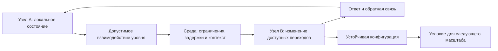

# [Mnogourovnevaya yazyikovaya sinkhronizaciya FUM](../Glossarij/mnogourovnevaya-yazyikovaya-sinkhronizaciya-FUM.md)

Yazyikovaya sinkhronizaciya v rasshirennoj issledovateljskoj ramke [FUM](../Glossarij/FUM.md) prokhodit ne toljko na urovne chelovecheskogo yestestvennogo yazyika. Kletochnyiye i nejronnyiye signaljnyiye konturyi, mezhpolusharnaya koordinaciya, khimicheskiye reakcii, atomnyiye vzaimodejstviya, vzaimodejstviya elementarnyikh chastic i drugikh subatomnyikh masshtabov, a takzhe gravitacionno-relyativistskiye ogranicheniya rassmatrivayutsya kak raznyiye po bogatstvu voplosjheniya obsjhej skhemyi: lokaljnyiye sostoyaniya stanovyatsya vzaimno obuslovlennyimi cherez dostupnyij dannomu urovnyu yazyik vzaimodejstvij.

[Yestestvenno-yazyikovaya sinkhronizaciya znanij FUM](../Glossarij/yestestvenno-yazyikovaya-sinkhronizaciya-znanij-FUM.md) ostayotsya osobyim chelovecheskim i agentskim sluchayem. Ona vklyuchayet simvolyi, referenciyu, semantiku, pragmatiku, vyiskazyivaniya, ispravleniye ponimaniya i yavnuyu rabotu so znaniyem. Perenos slova «yazyik» na drugiye urovni ne pripisyivayet chasticam, atomam, molekulam ili kletkam chelovecheskuyu rechj, namereniye libo soznaniye; on zadayot [gipotezu FUM](../Glossarij/gipoteza-FUM.md) o povtoryayusjhejsya strukture vzaimodejstviya, kotoruyu yesjhyo nuzhno operacionalizirovatj i proveritj.

## Obsjhij invariant

Kandidat na obsjhij invariant yazyikovoj sinkhronizacii sostoit iz semi chastej:

- u vzaimodejstvuyusjhikh storon yestj razlichimyiye lokaljnyiye sostoyaniya;
- [okruzhayusjhaya sreda FUM](../Glossarij/okruzhayusjhaya-sreda-FUM.md) dopuskayet odni vzaimodejstviya i isklyuchayet drugiye;
- sostoyaniye odnoj storonyi prichinno izmenyayet dostupnyiye perekhodyi drugoj;
- nabor signalov, konfiguracij ili vozdejstvij imeyet vosproizvodimyiye razlichiya;
- otvet zavisit ne toljko ot vozdejstviya, no i ot lokaljnogo sostoyaniya poluchatelya i konteksta;
- obratnaya svyazj pozvolyayet usilivatj, oslablyatj, ispravlyatj ili prekrasjhatj sopryazheniye;
- rezuljtat mozhet zakreplyatjsya kak ustojchivaya konfiguraciya i stanovitjsya usloviyem vzaimodejstvij sleduyusjhego masshtaba.

V etoj skheme sinkhronizaciya ne trebuyet odinakovyikh sostoyanij i ne oznachayet mgnovennogo globaljnogo vremeni. Trebuyetsya prichinnoye lokaljnoye sopryazheniye perekhodov i koordinaciya, opredelyonnaya otnositeljno konkretnogo urovnya, nablyudatelya i zadachi. Ustojchivaya korrelyaciya mozhet byitj nablyudayemyim sledstviyem takogo sopryazheniya, no sama po sebe ne dokazyivayet sinkhronizaciyu.

## Proyavleniya na raznyikh urovnyakh

| Urovenj                                         | Kandidat yazyika vzaimodejstvij                                                                   | Chto mozhet sinkhronizirovatjsya                                                          | Granica tolkovaniya                                                                              |
| ----------------------------------------------- | ----------------------------------------------------------------------------------------------- | ------------------------------------------------------------------------------------- | ----------------------------------------------------------------------------------------------- |
| Elementarnyiye chasticyi i inyiye subatomnyiye masshtabyi | Kanalyi fizicheskikh vzaimodejstvij, dopustimyiye sostoyaniya, perekhodyi i zakonyi sokhraneniya            | Perekhodyi, korrelyacii i ustojchivyiye fizicheskiye konfiguracii                             | Prichinnaya svyazj ili korrelyaciya yesjhyo ne dokazyivayet nalichiye soobsjheniya i smyisla                     |
| Atomnyij                                         | Energeticheskiye sostoyaniya, elektromagnitnyiye vzaimodejstviya i pravila obrazovaniya svyazej          | Sostoyaniya atomov, obmen energiyej i vozmozhnostj sostavnyikh form                         | Atom ne schitayetsya nositelem chelovecheskoj modeli mira ili namereniya                              |
| Molekulyarno-khimicheskij                          | Reakcii, svyazyivaniye, kataliticheskiye konturyi, koncentracii i diffuziya                            | Sostav, skorosti prevrasjhenij i ustojchivyiye seti reakcij                                | Khimicheskoye sopryazheniye ne avtomaticheski yavlyayetsya semanticheskim kodom                             |
| Kletochnyij                                       | Receptoryi, signaljnyiye molekulyi, elektricheskiye, mekhanicheskiye i regulyatornyiye konturyi              | Funkcii, ekspressiya, metabolizm, deleniye i sovmestnoye povedeniye                       | «Interpretaciya» oznachayet funkcionaljno razlichimyij otvet, a ne obyazateljno refleksiyu             |
| Nejronnyij i mezhpolusharnyij                       | Patternyi nejronnoj aktivnosti i provodyasjhiye puti mezhdu polushariyami, prezhde vsego mozolistoye telo | Koordinaciya chastichno specializirovannyikh setej s razlichayusjhimisya lokaljnyimi sostoyaniyami | Polushariya skhodnyi po obsjhemu planu, no ne identichnyi; obmen signalami ne raven yestestvennomu yazyiku |
| Chelovecheskij i agentskij                        | Yestestvennyij yazyik, zhestyi, formaljnyiye zapisi i operatorno sovmestimyiye soobsjheniya                  | Znaniya, modeli, celi, obyazateljstva i sovmestnyiye dejstviya                             | Zdesj trebuyetsya razlichatj smyisl, dostavku, polnomochiya i lokaljnuyu pamyatj                        |
| Gravitacionno-relyativistskij                    | Geometriya prostranstva-vremeni, prichinnaya svyaznostj, lokaljnyiye chasyi i gorizontyi                 | Dostupnostj sobyitij, trayektorii, temp processov i granicyi svyazi                       | Eto skvoznoj kontur prichinnosti, a ne sleduyusjhaya stupenj organizacii posle chastic                |

Mezhpolusharnyij profilj pokazyivayet perekhodnyij masshtab mezhdu kletochnoj signalizaciyej i chelovecheskoj semantikoj. V nyom boljshiye polushariya rassmatrivayutsya kak sostavnyiye nejronnyiye seti, kotoryiye sokhranyayut lokaljnuyu dinamiku i koordiniruyutsya cherez ogranichennyiye provodyasjhiye puti. Eto urovnevoye uprosjheniye, a ne utverzhdeniye, chto mozg bukvaljno svoditsya k dvum odinakovyim mashinam.

Eta tablica ne obyyavlyayet perechislennyiye mekhanizmyi tozhdestvennyimi. Ona zadayot marshrut sravneniya: dlya kazhdogo urovnya nuzhno ustanovitj storonyi vzaimodejstviya, sredu, nablyudayemyiye sostoyaniya, dopustimyiye perekhodyi, obratnuyu svyazj, ustojchivyij rezuljtat i poteri pri perevode v opisaniye drugogo urovnya.

## Perekhodyi mezhdu urovnyami

Odin obyyekt mozhet menyatj rolj vmeste s masshtabom opisaniya. Molekula uchastvuyet v atomnyikh vzaimodejstviyakh i odnovremenno stanovitsya signalom ili mekhanizmom kletochnogo kontura; kletka yavlyayetsya sredoj dlya molekulyarnyikh processov i agentom v tkani; chelovek yavlyayetsya sredoj dlya kletok i yazyikovyim agentom v socialjnoj seti; sostavnoj [FUM-uzel](../Glossarij/FUM-uzel.md) mozhet byitj setjyu poduzlov i uchastnikom seti sleduyusjhego masshtaba.

Perekhod na sleduyusjhij urovenj trebuyet ne toljko boljshego chisla elementov. Dolzhna vozniknutj novaya ustojchivaya granica, novyij repertuar razlichimyikh sostoyanij i vzaimodejstvij, sobstvennaya obratnaya svyazj i sposob uderzhivatj rezuljtat. Poetomu neljzya zaraneye schitatj, chto slovarj odnogo urovnya napryamuyu perevoditsya v slovarj drugogo. [Nablyudateljskaya otnositeljnostj FUM](../Glossarij/nablyudateljskaya-otnositeljnostj-FUM.md) trebuyet ukazyivatj nablyudatelya, preobrazovaniye predstavlenij, sokhranyayemyiye invariantyi i poteri.

Gravitaciya zanimayet v etoj shkale osoboye mesto. Ona ne dobavlyayetsya kak avtonomnyij agentskij urovenj posle elementarnyikh chastic, a zadayot skvoznyiye geometricheskiye i prichinnyiye usloviya sovmestnoj evolyucii sostoyanij: lokaljnostj, sobstvennoye vremya, gorizontyi i konechnostj rasprostraneniya vliyanij. Poetomu gravitacionnaya sinkhronizaciya ne mozhet oznachatj universaljnuyu odnovremennostj; naprotiv, ona dolzhna uchityivatj granicyi globaljnogo soglasovaniya.

## Arkhitekturnyiye sledstviya

- FUM dolzhen razlichatj semanticheskuyu sinkhronizaciyu znanij, biologicheskuyu signalizaciyu, khimicheskoye sopryazheniye i fizicheskoye vzaimodejstviye, dazhe kogda isjhet ikh obsjhuyu skhemu.
- Kazhdoye opisaniye sinkhronizacii dolzhno yavno nazyivatj urovenj, storonyi vzaimodejstviya, sredu, nablyudatelya, sostoyaniya, zaderzhki, obratnuyu svyazj i kriterij dostatochnogo rezuljtata.
- Perevod mezhdu urovnyami dolzhen khranitj proiskhozhdeniye, dopusjheniya i izvestnyiye poteri, a ne vyidavatj chelovecheskoye opisaniye za vnutrennij yazyik fizicheskogo obyyekta.
- Arkhitektura FUM mozhet zaimstvovatj najdennyij invariant lokaljnyikh sostoyanij, dopustimyikh perekhodov, obratnoj svyazi i obrazovaniya ustojchivyikh konfiguracij, no ne dolzhna zavisetj ot nedokazannoj bukvaljnoj tozhdestvennosti urovnej.
- Parnaya organizaciya yavlyayetsya minimaljnyim chastnyim sluchayem seti: FUM mozhet primenyatj skhemu lokaljnyikh podsistem i yavnogo kanala koordinacii, no ne ogranichivayetsya rovno dvumya uzlami i ne trebuyet tozhdestva ikh vnutrennikh sostoyanij.
- Dlya fizicheskogo urovnya termin «agent» dopustim toljko kak element proveryayemoj [obsjhej skhemyi FUM](../Glossarij/obsjhaya-skhema-FUM.md), a ne kak avtomaticheskoye utverzhdeniye avtonomii, znaniya ili soznaniya.
- Vnutrenniye i vneshniye seti FUM dolzhnyi proyektirovatjsya bez predpolozheniya o mgnovennom obsjhem sostoyanii: zaderzhki, lokaljnyiye chasyi, chastichnyiye predstavleniya i nesoglasovannostj yavlyayutsya chastjyu modeli.

## Proveryayemaya forma

Gipoteza dolzhna proveryatjsya cherez pasport urovnevogo sootvetstviya, a ne podtverzhdatjsya toljko skhodstvom slov. Dlya kazhdogo zayavlennogo voplosjheniya nuzhno:

1. vyidelitj nablyudayemyiye lokaljnyiye sostoyaniya i granicyi uzlov;
2. ukazatj fizicheskij, khimicheskij, biologicheskij ili simvolicheskij nositelj vzaimodejstviya;
3. opisatj repertuar razlichij i pravila dopustimyikh perekhodov;
4. pokazatj prichinno proveryayemoye izmeneniye poluchatelya i kontekstnuyu zavisimostj otveta;
5. opredelitj obratnuyu svyazj, ustojchivyij rezuljtat i sposob perekhoda k sleduyusjhemu masshtabu;
6. sravnitj invariantyi i razlichiya kak minimum dvukh urovnej;
7. zadatj proveryayemyiye predskazaniya urovnevogo profilya i usloviya ikh oproverzheniya, a otdeljno - kriterij otkaza ot termina «yazyik», yesli on ne dayot dopolniteljnoj obyyasniteljnoj, predskazateljnoj ili inzhenernoj cennosti.

Blizhajshimi artefaktami proverki sluzhat [kartochka fizicheskikh sootvetstvij FUM](28-reyestr-kartochek-sootvetstviya-FUM/FUM-MAP-PHYS-01.md), kotoruyu nuzhno razvitj v pasport s otdeljnyimi profilyami urovnej, i [kartochka parnoj mezhpolusharnoj arkhitekturyi](28-reyestr-kartochek-sootvetstviya-FUM/FUM-MAP-BRAIN-01.md), kotoraya utochnyayet biologicheskuyu analogiyu i yeyo inzhenernuyu proyekciyu. Nereshyonnyiye kriterii obsjhej abstrakcii sobranyi v [otkryitom voprose ob urovnyakh nablyudayemoj Vselennoj](../Voprosyi/2026-06-26_12-19-03_MSK_abstrakciya-urovnej-nablyudayemoj-vselennoj-FUM.md), a granicyi sobstvenno yestestvennogo yazyika - v [otkryitom voprose o yestestvenno-yazyikovoj sinkhronizacii znanij](../Voprosyi/2026-07-13_20-34-23_MSK_granicyi-yestestvenno-yazyikovoj-sinkhronizacii-znanij-FUM.md).

## Granicyi gipotezyi

Mnogourovnevaya yazyikovaya sinkhronizaciya ne yavlyayetsya zavershyonnoj fizicheskoj, khimicheskoj ili biologicheskoj teoriyej. Ona ne vyivodit namereniye iz prichinnogo vozdejstviya, semantiku iz lyuboj korrelyacii, znaniye iz ustojchivogo sostoyaniya ili soznaniye iz odnogo fakta vzaimodejstviya. V chastnosti, kvantovaya korrelyaciya sama po sebe ne obyyavlyayetsya kanalom peredachi soobsjheniya ili smyisla.

Dlya kazhdogo urovnya gipoteza dolzhna predskazyivatj vosproizvodimuyu prichinnuyu zavisimostj mezhdu razlichimyimi klassami vozdejstvij, lokaljnyim sostoyaniyem poluchatelya i yego posleduyusjhimi perekhodami, a takzhe zayavlennyiye formyi obratnoj svyazi i ustojchivogo rezuljtata. Yesli posle kontrolya obsjhikh prichin eti zavisimosti, kontekstnaya izbirateljnostj ili obratnaya svyazj ne vosproizvodyatsya v nezavisimyikh nablyudeniyakh, sootvetstvuyusjhij urovnevyij profilj oprovergayetsya libo suzhayetsya.

Otdeljno ocenivayetsya poleznostj slova «yazyik». Dazhe neoprovergnutyij urovnevyij profilj sleduyet pereimenovatj ili isklyuchitj iz obsjhej skhemyi, yesli etot termin skryivayet razlichiya urovnej, ne zadayot dopolniteljnyikh proverok i ne uluchshayet obyyasneniye, predskazaniye ili proyektirovaniye FUM.

## Istochniki trebovanij

- [iskhodnyij zapros 2026-07-13 22:50:54 MSK - Zakrepitj mnogourovnevuyu yazyikovuyu sinkhronizaciyu](../Zhurnal/2026-07-13_22-50-54_MSK_zakrepitj-mnogourovnevuyu-yazyikovuyu-sinkhronizaciyu/zapros.md)
- [iskhodnyij zapros 2026-07-13 23:39:13 MSK - Zakrepitj parnuyu arkhitekturu chelovecheskogo mozga](../Zhurnal/2026-07-13_23-39-13_MSK_zakrepitj-parnuyu-arkhitekturu-chelovecheskogo-mozga/zapros.md)

## Opornyiye dokumentyi

- [Yestestvennyij yazyik i sinkhronizaciya znanij FUM](34-yestestvennyij-yazyik-i-sinkhronizaciya-znanij-FUM.md)
- [Evolyuciya i myishleniye](03-evolyuciya-i-myishleniye.md)
- [Sreda dlya vnutrennikh FUM](11-sreda-dlya-vnutrennikh-FUM.md)
- [Nablyudateljskaya otnositeljnostj informacionnyikh sistem](26-nablyudateljskaya-otnositeljnostj-informacionnyikh-sistem.md)
- [Moduljnaya arkhitektura FUM](05-moduljnaya-arkhitektura-FUM.md)
- [Gibridnyiye uzlyi i socialjnaya fraktaljnostj](12-gibridnyiye-uzlyi-i-socialjnaya-fraktaljnostj.md)
- [Kartochka parnoj mezhpolusharnoj arkhitekturyi](28-reyestr-kartochek-sootvetstviya-FUM/FUM-MAP-BRAIN-01.md)

<!-- FUM-MD-RECENCY:BEGIN -->
<!-- last-content-edit: 2026-08-03 14:54:04 MSK -->
<!-- content-sha256: sha256:4c8452bd3dccf7422d88d7fd4cbacb9a7eabc83789aabf1eea479bcb29ebcd75 -->
<!-- FUM-MD-RECENCY:END -->
