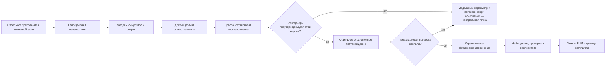

# Karta ogranichitelej [fizicheskogo dejstviya FUM](../Glossarij/fizicheskoye-dejstviye-FUM.md)

Karta versii `1` zadayot konservativnyij barjyer mezhdu cifrovyim zamyislom i vozdejstviyem na materialjnuyu sredu. Ona pomogayet do ispolneniya razdeljno zafiksirovatj risk, dostup k svedeniyam, operacionnyiye polnomochiya, otvetstvennostj, nablyudayemostj i proveryayemuyu modelj ispolniteljnogo kontura. Klassifikaciya ne yavlyayetsya razresheniyem: lyuboye realjnoye fizicheskoye dejstviye trebuyet otdeljnogo trebovaniya, proverki i podtverzhdeniya, otnosyasjhikhsya k tochnomu dejstviyu, obyyektu, versii i usloviyam.

Poka granicyi apparatnoj, issledovateljskoj, socialjnoj, territorialjnoj i kosmicheskoj avtonomii ostayutsya otkryityimi, dokumentacionnyij prototip [FUM](../Glossarij/FUM.md) rabotayet v modeljnom i dokumentacionnom sloye. Karta sokhranyayet trebovaniya k budusjhemu perekhodu, no ne podklyuchayet ispolniteljnyij vyikhod i ne nadelyayet FUM pravom rasporyazhatjsya ustrojstvom, syirjyom, proizvodstvom, territoriyej ili drugim [FUM-uzlom](../Glossarij/FUM-uzel.md).

## Granica primenimosti

Karta primenyayetsya, kogda cifrovoj plan, programma ili komanda potencialjno mogut izmenitj syiroj nositelj dannyikh, oborudovaniye, materialjnyij obyyekt, proizvodstvennyij process, infrastrukturu, cheloveka, zhivuyu sistemu libo fizicheskuyu sredu. Podgotoviteljnyiye chteniye, vyichisleniye i modelirovaniye sami po sebe ne yavlyayutsya fizicheskim dejstviyem v smyisle kartyi, poka u kontura net ispolniteljnogo effekta. Podklyucheniye privoda, vyidacha komandyi vneshnemu ustrojstvu, izmeneniye syirogo nositelya, izgotovleniye, dostavka, dobyicha, stroiteljstvo i rasshireniye materialjnoj bazyi uzhe peresekayut etu granicu.

Versiya `1` yavlyayetsya arkhitekturnoj i dokumentacionnoj kartoj. Ona ne zamenyayet ocenku bezopasnosti, inzhenernyiye standartyi, pravo, sertifikaciyu, dogovor, strakhovaniye, ekologicheskuyu ekspertizu, soglasiye zatronutyikh lyudej, nezavisimuyu proverku ili avarijnyij reglament. Publikacionno chistoye opisaniye kontrakta oznachayet lishj vozmozhnostj bezopasno khranitj yego v otkryitoj [pamyati FUM](../Glossarij/pamyatj-FUM.md); ono ne oznachayet publichnyij dostup k ustrojstvu i tem boleye polnomochiye na ispolneniye.

## Konservativnyij perekhod

Perekhod stroitsya kak posledovateljnostj barjyerov. Propusjhennyij ili nepodtverzhdyonnyij barjyer vsegda zakryivayet fizicheskij perekhod i vozvrasjhayet epizod v modeljnyij sloj; otsutstviye svedenij ne schitayetsya nulevyim riskom. Vesj epizod sozdayot kontroljnuyu tochku ozhidaniya toljko posle ischerpaniya konechnogo byudzheta ili bezopasnyikh produktivnyikh modeljnyikh prodolzhenij. Resheniye otnositsya k odnomu ogranichennomu dejstviyu i ne sozdayot postoyannogo obsjhego dopuska dlya posleduyusjhikh dejstvij.

Podtverzhdeniye v etoj skheme yavlyayetsya trebovaniyem k budusjhemu ispolniteljnomu konturu, a ne vyidannyim tekusjhej kartoj razresheniyem. Dlya klassov, zakryityikh otkryityimi voprosami, vetka `да` poka nedostupna.

## Son ne vooruzhayet ispolniteljnyij kontur

[Mekhanizm sna FUM](../Glossarij/mekhanizm-sna-FUM.md) ostayotsya modeljnyim rezhimom R0 nezavisimo ot shirinyi vetvleniya, neobyichnosti gipotezyi ili uspeshnosti vnutrennej proverki. Povyishennaya izmenchivostj primenyayetsya toljko k kandidatnyim preobrazovaniyam i ne mozhet podklyuchitj privod, syiroj nositelj, vneshnyuyu sistemu, publikaciyu, soobsjheniye ili platyozh, povyisitj urovenj dostupa libo sozdatj podtverzhdeniye i avtorizaciyu.

Fizicheskaya karta ne nazyivayet vyichisleniye otsutstviyem realjnogo effekta: lokaljnaya rabota, energiya i khraneniye trassyi susjhestvuyut v materialjnom mire. Dlya sna dejstvuyet boleye uzkij polozhiteljnyij konvert zaraneye razreshyonnyikh vyichisleniya, zhurnala, kandidata i kontroljnoj tochki. Rezuljtat probuzhdeniya vozvrasjhayetsya v modeljnyij razbor; perekhod k fizicheskomu dejstviyu nachinayetsya zanovo s tochnoj versii kandidata i prokhodit vse barjyeryi etoj kartyi bez nasledovaniya dopuska po skhodstvu.

## Yedinica kartyi

Odna zapisj kartyi opisyivayet odno dejstviye ili odnorodnuyu seriyu dejstvij v neizmennyikh predelakh. Ona dolzhna soderzhatj:

- tochnoye dejstviye, obyyekt, sredu, istochnik trebovaniya, ozhidayemyij effekt i yavno zapresjhyonnyiye effektyi;
- versiyu proyekta, upravlyayusjhego koda, ustrojstva, modeli, konfiguracii i iskhodnogo sostoyaniya;
- klass riska, osi riska, izvestnyiye neopredelyonnosti, obratimostj i maksimaljnyij masshtab posledstvij;
- [urovenj dostupa](../Glossarij/urovenj-dostupa.md) k kazhdomu materialu otdeljno ot operacionnyikh polnomochij;
- konkretnyikh nositelej rolej trebovaniya, dopuska, ispolneniya, nezavisimoj proverki, avarijnogo svorachivaniya i otvetstvennosti za posledstviya;
- simulyator, modelj ili interfejsnyij kontrakt, oblastj ikh validnosti, kriterii priyomki i izvestnyiye raskhozhdeniya s realjnostjyu;
- bezopasnoye sostoyaniye, usloviya ostanovki, fizicheski dostupnyij sposob avarijnogo prekrasjheniya i proverennyij plan vosstanovleniya libo svorachivaniya;
- minimaljno dostatochnuyu trassu do, vo vremya i posle dejstviya, a takzhe pravila dostupa i sroka khraneniya svideteljstv;
- svyazannyiye [otkryityiye voprosyi](../Glossarij/otkryityij-vopros.md) i tochnoye usloviye, pri kotorom oni blokiruyut perekhod.

Izmeneniye dejstviya, celi, obyyekta, sredyi, klassa riska, versii ispolniteljnogo kontura, polnomochij ili usloviya podtverzhdeniya vyipuskayet novuyu zapisj. Prezhnij dopusk neljzya perenositj po skhodstvu nazvaniya ili namereniya.

## Rabochiye klassyi riska

Klassyi `R0–R4` nuzhnyi dlya vyibora boleye strogogo barjyera, a ne dlya avtomaticheskogo razresheniya. Risk ocenivayetsya po vozmozhnomu vredu lyudyam i zhivyim sistemam, usjherbu dannyim i imusjhestvu, vozdejstviyu na sredu, energii i masshtabu, obratimosti, nablyudayemosti, avtonomnosti, sposobnosti k vosproizvodstvu ili rasshireniyu, pravovyim i socialjnyim posledstviyam. Itogovyij klass ne nizhe naiboleye strogoj primenimoj osi; susjhestvennaya neizvestnostj povyishayet ogranicheniye, poka ne polucheno svideteljstvo.

| Klass | Kontur i primeryi                                                                                             | Minimaljnyij proveryayemyij sloj                                                                                                                          | Tekusjhaya granica                                                                                            |
| ----- | ------------------------------------------------------------------------------------------------------------ | ----------------------------------------------------------------------------------------------------------------------------------------------------- | ---------------------------------------------------------------------------------------------------------- |
| `R0`  | Dokument, proyekt, raschyot, modeljnyij scenarij bez ispolniteljnogo vyikhoda.                                     | Proiskhozhdeniye, dopusjheniya, ogranicheniya modeli, status utverzhdenij, zapresjhyonnyiye effektyi i proverka ssyilok.                                              | Dopustima dokumentacionnaya i modeljnaya rabota; rezuljtat ne perenositsya na fizicheskij mir bez novogo shaga. |
| `R1`  | Lokaljnaya vyichisliteljnaya mashina, passivnyij sensor ili stend bez komandyi vneshnemu ispolniteljnomu organu.     | Pasport apparaturyi, granicyi dannyikh, rezervirovaniye, nablyudayemaya proverka i dokazannoye otsutstviye ispolniteljnogo effekta.                             | Ne dayot prava podklyuchitj privod, izmenitj syiroj nositelj ili upravlyatj vneshnim ustrojstvom.                |
| `R2`  | Syiroj nositelj, privod, robot ili prototip na fizicheski izolirovannom stende.                                | Simulyator i kontrakt ustrojstva, vladelec obyyekta, ogranichennyij operator, nezavisimyij proveryayusjhij, bezopasnoye sostoyaniye i vosstanovleniye.             | Realjnoye ispolneniye ne razresheno kartoj i trebuyet otdeljnogo trebovaniya i podtverzhdeniya.                   |
| `R3`  | Proizvodstvo, tovar dlya lyudej, transport, ispyitaniye vne stenda ili obsjhestvenno znachimaya infrastruktura.      | Vsyo dlya `R2`, a takzhe roli zakazchika i proizvoditelya, priyomka, sertifikaciya, dogovornyiye i platyozhnyiye granicyi, garantiya i uchyot zatronutyikh storon.       | Ostayotsya modeljnyim do razresheniya socialjnyikh, pravovyikh i otraslevyikh voprosov.                               |
| `R4`  | Dobyicha, zemnoj poligon, avtonomnoye stroiteljstvo, samovosproizvodstvo, kosmicheskij ili ekologicheskij kontur. | Vsyo dlya `R3`, a takzhe pravo territorii, ekologiya, soobsjhestva, suverenitet, zaderzhka svyazi, lokaljnaya ostanovka i predel rasshireniya materialjnoj bazyi. | Toljko proyektirovaniye i modelirovaniye do otdeljnogo proyasneniya svyazannyikh voprosov.                         |

Perekhod ot `R0` k `R1` ne schitayetsya postepennoj vyidachej polnomochij. Naprimer, nalichiye cifrovoj modeli robota ne razreshayet podklyucheniye yego privoda, a uspeshnyij stend ne razreshayet perenos komandyi na proizvodstvennuyu plosjhadku. Kazhdaya granica trebuyet sobstvennogo istochnika, proverki i zapisi resheniya.

## Dve nezavisimyiye osi dostupa

[Urovenj dostupa](../Glossarij/urovenj-dostupa.md) opredelyayet, kto mozhet chitatj, izmenyatj ili peredavatj svedeniya i [narabotki](../Glossarij/narabotka.md). On ne opredelyayet pravo fizicheskogo ispolneniya. Karta poetomu vedyot otdeljno:

- informacionnyij dostup k trebovaniyu, modeli, kodu, dannyim, telemetrii, zhurnalu, opasnyim instrukciyam i rezuljtatu;
- operacionnyiye polnomochiya `проектировать`, `симулировать`, `проверять`, `подтверждать`, `вооружать исполнительный контур`, `исполнять`, `останавливать`, `восстанавливать` i `публиковать`.

Kazhdoye polnomochiye svyazyivayetsya s nazvannyim uzlom ili chelovekom, tochnoj celjyu, obyyektom, versiyej, vremennyim oknom, predelom povtorov, usloviyami otzyiva i sposobom proverki. Pravo chteniya upravlyayusjhego koda ne dayot prava zapuskatj yego; pravo ostanovki ne dayot prava nachatj dejstviye; pravo proveritj rezuljtat ne prevrasjhayet proveryayusjhego v operatora.

Dlya `R2–R4` proyektnaya karta trebuyet razdeleniya kak minimum ispolneniya i nezavisimoj proverki. Sovmesjheniye inyikh rolej dolzhno byitj otdeljno obosnovano otnositeljno klassa riska. Ni FUM v celom, ni yedinstvennyij sostavnoj uzel ne schitayutsya avtorizatorom po umolchaniyu: eto sozdalo byi nesovmestimuyu s [decentralizaciyej FUM](../Glossarij/decentralizaciya-FUM.md) koncentraciyu dostupa, dejstviya i proverki.

## Otvetstvennostj

Do obsuzhdeniya ispolneniya zapisj nazyivayet konkretnyikh nositelej rolej. Odna organizaciya ili chelovek mozhet vyipolnyatj neskoljko rolej toljko tam, gde eto yavno dopustimo budusjhim protokolom i ne unichtozhayet nezavisimostj proverki.

| Rolj                             | Minimaljnaya otvetstvennostj                                                                                                                          |
| -------------------------------- | ---------------------------------------------------------------------------------------------------------------------------------------------------- |
| Vladelec trebovaniya              | Formuliruyet celj, oblastj, kriterii rezuljtata i zapresjhyonnyiye effektyi.                                                                                |
| Vladelec obyyekta ili sredyi       | Podtverzhdayet pravo rasporyazhatjsya obyyektom i izvestnyiye ogranicheniya; vidimaya pustota sredyi ne zamenyayet eto podtverzhdeniye.                              |
| Ocensjhik riska                    | Klassificiruyet osi riska, neizvestnyiye, zatronutyiye storonyi i dostatochnostj modeli; ne vyidayot sobstvennuyu ocenku za razresheniye.                        |
| Avtorizuyusjhij subyyekt             | Prinimayet ogranichennoye resheniye dlya tochnoj versii i nesyot zayavlennuyu otvetstvennostj za osnovaniye dopuska.                                            |
| Operator ili ispolniteljnyij uzel | Vyipolnyayet toljko obyyavlennyiye komandyi v predelakh dopuska, proveryayet predstartovyiye usloviya i ostanavlivayetsya pri raskhozhdenii.                          |
| Nezavisimyij nablyudatelj          | Proveryayet rezuljtat i svideteljstva bez podmenyi operatora; dostup poluchayet toljko k neobkhodimoj dlya proverki chasti trassyi.                           |
| Vladelec avarijnogo svorachivaniya | Obespechivayet dostupnostj ostanovki, bezopasnogo sostoyaniya, vosstanovleniya i fiksacii incidenta.                                                      |
| Predstavitelj zatronutyikh storon  | Sokhranyayet interesyi lyudej, soobsjhestv, poduzlov i sredyi, kotoryikh dejstviye mozhet zatronutj, no kotoryiye ne predstavlenyi vladeljcem tekhnicheskogo kontura. |

Karta ne pripisyivayet yuridicheskuyu, dogovornuyu ili moraljnuyu otvetstvennostj abstraktnomu FUM i ne obyyavlyayet yego proizvoditelem, prodavcom, garantom ili vladeljcem territorii. Yesli nositelj otvetstvennosti ne opredelyon libo ne imeyet polnomochij prinyatj posledstviya, fizicheskij perekhod ostayotsya zakryityim.

## Nablyudayemostj

Nablyudayemostj dolzhna pozvolyatj vosstanovitj proveryayemyij khod dejstviya bez serializacii skryityikh rassuzhdenij i bez totaljnogo chteniya vnutrennej pamyati uzla. Minimaljnaya trassa razgranichivayetsya po dostupu i vklyuchayet:

- do dejstviya — istochnik trebovaniya, tochnyij plan, obyyekt, versii, iskhodnoye sostoyaniye, risk, modeljnyiye proverki, polnomochiya, podtverzhdeniya i rezuljtat predstartovoj proverki;
- vo vremya dejstviya — zaproshennuyu komandu do effekta, ispolnitelj, vremya, fakticheskij otvet adaptera, sensornyiye nablyudeniya, otkloneniya, oshibki, povtornyiye popyitki i sobyitiya ostanovki;
- posle dejstviya — nablyudayemyij fizicheskij rezuljtat, ostatochnoye sostoyaniye, posledstviya, nezavisimuyu proverku, vosstanovleniye ili svorachivaniye, incidentyi i granicu togo, chto rezuljtat ne dokazyivayet.

[Minimaljnaya trassa ispolnyayemogo agentskogo cikla](37-minimaljnyij-format-trassyi-ispolnyayemogo-agentskogo-cikla.md) uzhe razlichayet zadachu, nablyudeniye, zapros dejstviya, rezuljtat, oshibku, proverku i resheniye o prodolzhenii. Fizicheskij kontur mozhet ispoljzovatj eti sobyitiya kak osnovu, no dolzhen otdeljno zakrepitj obyyekt, versiyu ustrojstva, avtorizaciyu, bezopasnoye sostoyaniye i materialjnyiye posledstviya. Zapisj komandyi dokazyivayet zapros, a ne fakticheskij effekt; telemetriya bez nezavisimoj proverki ne dokazyivayet otsutstviye vreda.

Dlya udalyonnogo uzla dopustima lokaljnaya trassa s posleduyusjhej sinkhronizaciyej proiskhozhdeniya, yesli zaderzhka svyazi nazvana v kontrakte. Eto ne reshayet, kakiye polnomochiya mozhno delegirovatj na vremya nedostupnosti cheloveka: takaya granica ostayotsya otkryitoj.

## Simulyator i kontrakt

Formula «simulyator ili kontrakt» oznachayet minimaljnyij vkhod dlya rannego proyektirovaniya, a ne dostatochnyij dopusk dlya lyubogo fizicheskogo dejstviya. Dlya zamknutogo ispolniteljnogo kontura `R2–R4` obyichno nuzhnyi oba sloya:

- simulyator ili proveryayemaya modelj nazyivayet versiyu, dopusjheniya, istochniki parametrov, oblastj validnosti, kalibrovku, scenarii shtatnoj rabotyi i otkazov, raskhozhdeniya s realjnostjyu i kriterii neprigodnosti;
- kontrakt ustrojstva ili processa nazyivayet dostupnyiye komandyi i nablyudeniya, predusloviya i postusloviya, fizicheskiye predelyi, yedinicyi, tajm-autyi, semantiku povtora, bezopasnoye sostoyaniye, ostanovku, vosstanovleniye, telemetriyu i testovyij dvojnik libo fiksturu.

Uspekh simulyacii ne dokazyivayet bezopasnostj realjnogo kontura, a interfejsnyij kontrakt ne dokazyivayet, chto ustrojstvo yemu sootvetstvuyet. Perekhod trebuyet otdeljno proveritj realizaciyu kontrakta i pokazatj, chto modelj pokryivayet susjhestvennyiye dlya dejstviya riski.

| Kontur                   | Trebuyemaya modelj ili simulyaciya                                                             | Trebuyemyij kontrakt i svideteljstvo                                                                                                 |
| ------------------------ | ------------------------------------------------------------------------------------------ | ---------------------------------------------------------------------------------------------------------------------------------- |
| Syiroj nositelj           | Programmnaya fikstura otkazov, poteri pitaniya, chastichnoj zapisi i vosstanovleniya.           | Blochnyij interfejs, granicyi obyyekta, rezervnaya kopiya i vosproizvedyonnaya proverka vosstanovleniya.                                    |
| Robot, privod ili stanok | Dinamika, predelyi dvizheniya i energii, stolknoveniya, sensornyiye oshibki i avarijnyiye scenarii. | Komandyi, rezhimyi, interloki, bezopasnoye sostoyaniye, fizicheskaya ostanovka, telemetriya i proverka stenda.                              |
| Proizvodstvennaya cepochka | Proizvodimostj, dopuski, otkaz izdeliya i opasnyiye etapyi processa.                           | Specifikaciya materialov i versij, roli uchastnikov, priyomochnyiye ispyitaniya, proiskhozhdeniye i granicyi kachestva.                         |
| Zemnoj resursnyij poligon | Sreda, dostavka, energetika, svyazj, razvyortyivaniye, avariya i svorachivaniye.                  | Pasport plosjhadki, pravo i ekologiya, zatronutyiye soobsjhestva, zapretnyiye dejstviya, nezavisimoye nablyudeniye i vosstanovleniye territorii. |
| Kosmicheskij kontur       | Zaderzhka svyazi, otkaz, remont, snabzheniye, lokaljnoye proizvodstvo i predel rasshireniya.      | Lokaljnyiye polnomochiya, ostanovka bez svyazi, zapret samovoljnogo vosproizvodstva i sinkhronizaciya proiskhozhdeniya s udalyonnyim uzlom.    |

## Minimaljnyij barjyer pered fizicheskim ispolneniyem

Obsuzhdeniye konkretnogo realjnogo dejstviya vozmozhno toljko posle poyavleniya vsekh sleduyusjhikh svideteljstv:

1. Otdeljnyij doslovno sokhranyonnyij istochnik poruchayet imenno fizicheskij perekhod, a ne toljko proyektirovaniye ili simulyaciyu.
2. Obyyekt, sreda, ozhidayemyij i zapresjhyonnyiye effektyi, iskhodnoye i bezopasnoye sostoyaniya ogranichenyi i proveryayemyi.
3. Risk klassificirovan po vsem osyam; susjhestvennyiye neizvestnyiye perechislenyi i ne vyidanyi za nolj.
4. Simulyator i kontrakt prigodnyi dlya klassa dejstviya, ikh versii zakreplenyi, a raskhozhdeniya s realjnostjyu nazvanyi.
5. Informacionnyij dostup i operacionnyiye polnomochiya razdelenyi; avtorizaciya otnositsya k tochnoj versii, celi i vremeni i mozhet byitj otozvana.
6. Roli otvetstvennosti naznachenyi konkretnyim nositelyam, vklyuchaya nezavisimuyu proverku, ostanovku i posledstviya.
7. Avarijnaya ostanovka, bezopasnoye sostoyaniye, vosstanovleniye ili svorachivaniye proverenyi bez ispoljzovaniya celevogo opasnogo effekta.
8. Trassa gotova fiksirovatj zapros do dejstviya, fakticheskij iskhod, oshibki, proverki i posledstviya s minimaljno neobkhodimyim raskryitiyem.
9. Pravovyiye, dogovornyiye, ekologicheskiye, socialjnyiye i otraslevyiye ogranicheniya podtverzhdenyi kompetentnyimi dlya oblasti subyyektami.
10. Neposredstvenno pered ispolneniyem iskhodnoye sostoyaniye, versii, polnomochiya i dostupnostj ostanovki sovpali s podtverzhdyonnoj zapisjyu.

Otsutstviye lyubogo punkta zakryivayet fizicheskij perekhod. Ono ne obyazano ostanavlivatj vesj myisliteljnyij epizod: pri nalichii bezopasnoj produktivnoj rabotyi i konechnogo razreshyonnogo byudzheta FUM prodolzhayet modeljnyij peresmotr, sravnivayet variantyi i sokhranyayet rekomendaciyu otdeljno ot podtverzhdeniya i avtorizacii. Predyidusjhij uspeshnyij zapusk ne zamenyayet novuyu predstartovuyu proverku, yesli izmenilisj obyyekt, sreda, versiya, sostoyaniye ili polnomochiya.

## Otkryityiye voprosyi

Karta delayet nereshyonnyiye granicyi vidimyimi, no ne zakryivayet ikh:

- [granicyi apparatnoj avtonomii FUM](../Voprosyi/2026-06-22_07-28-43_MSK_granicyi-apparatnoj-avtonomii-FUM.md) dolzhnyi opredelitj, kto vprave vyidavatj podtverzhdeniye, kakiye klassyi voobsjhe mogut ispolnyatjsya, kakovyi srok i otzyiv polnomochij, minimaljnaya trassa i kriterii dostatochnosti simulyatora;
- [granicyi issledovateljskoj avtonomii FUM](../Voprosyi/2026-06-22_08-04-45_MSK_granicyi-issledovateljskoj-avtonomii-FUM.md) dolzhnyi otdelitj bezopasnyij modeljnyij opyit ot apparatnogo, laboratornogo, socialjnogo i publikacionnogo eksperimenta;
- [granicyi vlasti uzlov FUM](../Voprosyi/2026-06-22_07-51-48_MSK_granicyi-vlasti-uzlov-FUM.md) dolzhnyi soglasovatj avarijnoye vmeshateljstvo, kvorumyi i nezavisimuyu proverku s ostatochnoj avtonomiyej poduzlov;
- [granicyi potrebiteljskikh proizvodstvennyikh cepochek FUM](../Voprosyi/2026-07-02_16-52-56_MSK_granicyi-potrebiteljskikh-proizvodstvennyikh-cepochek-FUM.md) dolzhnyi opredelitj otvetstvennostj za kachestvo, sertifikaciyu, dogovoryi, platezhi, garantiyu i usjherb;
- [granicyi zemnyikh resursnyikh poligonov FUM](../Voprosyi/2026-07-02_20-08-37_MSK_granicyi-zemnyikh-resursnyikh-poligonov-FUM.md) dolzhnyi opredelitj pravo plosjhadki, ekologicheskiye i kuljturnyiye ogranicheniya, nezavisimoye nablyudeniye i priyemlemoye svorachivaniye;
- [granicyi kosmicheskoj avtonomii FUM](../Voprosyi/2026-06-22_07-40-59_MSK_granicyi-kosmicheskoj-avtonomii-FUM.md) dolzhnyi opredelitj delegirovaniye pri zaderzhke svyazi, predel samovosproizvodstva i zapret nekontroliruyemogo rasshireniya materialjnoj bazyi.

Do razresheniya etikh voprosov karta sluzhit fail-closed-kontraktom fizicheskogo effekta: neyasnostj sokhranyayetsya kak blokiruyusjheye usloviye ispolneniya, a ne zapolnyayetsya podrazumevayemyim pravom FUM na dejstviye. Prodolzheniye modeljnogo otbora ne oslablyayet etot zapret i ne sozdayot razresheniya nezavisimo ot uverennosti vyibrannogo varianta.

## Istochniki trebovanij

- [iskhodnyij zapros 2026-07-31 13:23:13 MSK - Utochnitj issledovateljskuyu funkciyu mekhanizma sna FUM](../Zhurnal/2026-07-31_13-23-13_MSK_utochnitj-issledovateljskuyu-funkciyu-mekhanizma-sna-FUM/zapros.md)
- [iskhodnyij zapros 2026-07-31 13:17:46 MSK - Zakrepitj mekhanizm sna FUM](../Zhurnal/2026-07-31_13-17-46_MSK_zakrepitj-mekhanizm-sna-FUM/zapros.md)
- [iskhodnyij zapros 2026-07-29 10:25:10 MSK — Prodolzhatj myishleniye pri ozhidanii podtverzhdeniya](../Zhurnal/2026-07-29_10-25-10_MSK_prodolzhatj-myishleniye-pri-ozhidanii-podtverzhdeniya/zapros.md)
- [iskhodnyij zapros tekusjhej rabochej sessii](../Zhurnal/2026-07-23_17-37-10_MSK_opisatj-kartu-ogranichitelej-fizicheskogo-dejstviya-FUM/zapros.md)
- [kartochka FUM-STEP-0028](../Planirovaniye/kartochki-shagov/✅-FUM-STEP-0028-opisatj-kartu-ogranichitelej-fizicheskogo-dejstviya-FUM.md)
- [napravleniye «Fizicheskiye i daljniye konturyi»](../Planirovaniye/napravleniya-proyektirovaniya-i-razvitiya/08-fizicheskiye-i-daljniye-konturyi.md)

## Opornyiye materialyi

- [Fizicheskoye dejstviye FUM i apparatnyiye uzlyi](13-fizicheskoye-dejstviye-i-apparatnyiye-uzlyi.md)
- [Decentralizaciya FUM i granicyi vlasti](15-decentralizaciya-i-granicyi-vlasti.md)
- [Minimaljnyij format trassyi ispolnyayemogo agentskogo cikla](37-minimaljnyij-format-trassyi-ispolnyayemogo-agentskogo-cikla.md)
- [Minimaljnyij pasport peredavayemogo rezuljtata FUM](39-minimaljnyij-pasport-peredavayemogo-rezuljtata-FUM.md)
- [shablon kartochki eksperimenta FUM](../Planirovaniye/shablon-kartochki-eksperimenta-FUM.md)

<!-- FUM-MD-RECENCY:BEGIN -->
<!-- last-content-edit: 2026-08-03 14:54:04 MSK -->
<!-- content-sha256: sha256:97c266d2da46c9ef54801ccb5f988a438d5c9cbf711a6beed43020e9be5670ed -->
<!-- FUM-MD-RECENCY:END -->
