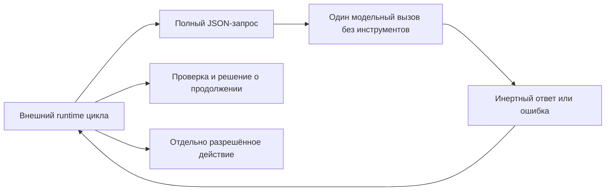

# Kontrakt chistogo modeljnogo shaga

[Chistyij modeljnyij shag](../Glossarij/chistyij-modeljnyij-shag.md) versii `1` — eto odin ogranichennyij vyizov zaraneye vyibrannogo provajdera: vyizyivayusjhij kontur peredayot vesj dostupnyij modeli kontekst kak dannyiye i poluchayet odin nablyudayemyij tekstovyij rezuljtat libo strukturirovannuyu oshibku. Provajder ne poluchayet instrumentyi, fajlyi, setj ili pravo ispolnyatj sobstvennyij vyivod i ne reshayet, prodolzhatj li [agentskij cikl](../Glossarij/agentskij-cikl.md).

Slovo «chistyij» oboznachayet granicu effektov, a ne matematicheskuyu chistotu i ne obyazateljnuyu povtoryayemostj realjnoj LLM. Determinirovannostj dokazana toljko dlya proverochnoj zaglushki. Dva realjnyikh adaptera LM Studio sokhranyayut inertnyij rezuljtat: sovmestimyij CLI-profilj versii `1` dokazyivayet process-granicu, a otdeljnyij byudzhetnyij REST v0-profilj versii `2` dobavlyayet ispolnimyij token limit, provider usage i atomarnyij reservation. Ni odin iz nikh ne obesjhayet povtoryayemostj otveta. Lyuboye dejstviye, proverka, povtor, ostanovka i zapisj v [pamyatj FUM](../Glossarij/pamyatj-FUM.md) prinadlezhat vyizyivayusjhemu runtime.

## Mesto v agentskom cikle

Provajder ne chitayet ssyilki iz zaprosa i ne vosstanavlivayet kontekst iz fajlov ili prezhnej sessii. `messages` yavlyayutsya polnyim uporyadochennyim kontekstom konkretnogo vyizova. Vozvrasjhyonnyij `output.content` ostayotsya nedoverennyim tekstom: dazhe stroka, pokhozhaya na komandu, vyizov instrumenta ili JSON dejstviya, nichego ne ispolnyayet sama po sebe.

## Konvert zaprosa versii 1

Strukturnaya perenosimaya forma zakreplena v [JSON Schema konverta versii 1](41-kontrakt-chistogo-modeljnogo-shaga/skhema-konverta-v1.json). Neizvestnyiye polya zapresjhenyi; dopolniteljnyiye bajtovyiye predelyi proveryayet prinimayusjhaya realizaciya, potomu chto JSON Schema schitayet dlinu strok ne v UTF-8-bajtakh.

| Pole                          | Kontrakt                                                                                                                              |
| ----------------------------- | ------------------------------------------------------------------------------------------------------------------------------------- |
| `schema_version`              | Tochnoye celoye znacheniye `1`.                                                                                                            |
| `invocation_id`               | Zadannyij vyizyivayusjhim ustojchivyij tekhnicheskij identifikator; provajder ne sozdayot UUID sam.                                              |
| `provider`                    | Ozhidayemyiye `kind`, `id`, `model` i `runtime`; nesovpadeniye s zagruzhennyim provajderom zakryivayet vyizov.                                  |
| `messages`                    | Ot `1` do `128` nepustyikh soobsjhenij `system`, `user` ili `assistant`; sredi nikh obyazateljno yestj `user`.                               |
| `response_format`             | V versii `1` toljko `text`. Razbor predmetnogo JSON prinadlezhit vneshnemu runtime.                                                     |
| `limits.max_output_bytes`     | Polozhiteljnyij predel otveta ne boleye `65536` bajt UTF-8; usechyonnyij otvet ne schitayetsya uspekhom.                                        |
| `limits.timeout_milliseconds` | Polozhiteljnyij byudzhet ne boleye `300000` ms; fakticheskoye preryivaniye dolgogo processa obespechivayet vneshnij adapter.                      |
| `capabilities.tools`          | Toljko `false`.                                                                                                                       |
| `capabilities.files`          | Toljko `false`.                                                                                                                       |
| `capabilities.network`        | Toljko `false`; budusjhij lokaljnyij adapter mozhet obrasjhatjsya lishj k otdeljno razreshyonnomu loopback-runtime vne interfejsa samoj modeli. |

Maksimaljnyij JSON-konvert i summarnoye soderzhimoye soobsjhenij ogranichenyi `1048576` bajt. Versiya `1` ne soderzhit neyavnyikh znachenij syemplirovaniya. Dlya realjnoj LLM sovmestimyij budusjhij profilj dolzhen yavno dobavitj versionirovannyiye parametryi, svedeniya o podderzhke seed i tochnuyu identichnostj vesov ili chestnoye znacheniye `unknown`; profilj zaglushki ne vyidayotsya za takoj adapter.

## Uspeshnyij rezuljtat

Uspekh soderzhit tot zhe `invocation_id`, fakticheskuyu identichnostj provajdera, `status = "completed"`, tekst i `finish_reason = "stop"`. Pole `input_sha256` svyazyivayet rezuljtat s kanonicheski serializovannyim zaprosom, a `metrics` fiksiruyet summu UTF-8-bajtov soobsjhenij i otveta.

V rezuljtate namerenno net vremeni, avtomaticheski sozdannyikh identifikatorov, lokaljnyikh putej, skryityikh rassuzhdenij, `tool_calls` i utverzhdeniya o vyipolnennom dejstvii. Kanonicheskij JSON kodiruyetsya s otsortirovannyimi klyuchami, poetomu zaglushka dayot pobitovo odinakovyij stdout na odinakovom vkhode.

Realjnyij process-adapter dopolniteljno vozvrasjhayet konvert popyitki `schema_version = 1`. On svyazyivayet `invocation_id` i `input_sha256` s pasportom fakticheski nastroyennogo provajdera i soderzhit rovno odin iz dvukh iskhodov: `completed` s tekstom i metrikami libo `rejected` s tipizirovannoj bezopasnoj prichinoj. Etot konvert ne pereopredelyayet strogij zapros versii `1` i ne vyidayotsya za kanonicheskij bajtovyij profilj pamyati.

## Oshibki i povtor

Nevalidnyij vkhod, neizvestnoye pole, nesovpadeniye provajdera i prevyisheniye limita dayut konvert `status = "rejected"` so stabiljnyimi `code`, publikacionno chistyim `message` i priznakom `retryable`. Diagnostika ne vklyuchayet syiroj stderr vneshnego processa, sekretyi ili lokaljnyiye puti.

Versiya `1` ne povtoryayet vyizov avtomaticheski. Resheniye o povtore prinimayet vneshnij runtime posle proverki koda oshibki, byudzheta, idempotentnosti i sostoyaniya zadachi. Realjnyij adapter razlichayet `provider_unconfigured`, `provider_unavailable`, `provider_mismatch`, `provider_input_unsupported`, `provider_timed_out`, `provider_cancelled`, `output_limit_exceeded`, `provider_refused`, `provider_failed` i `provider_protocol_error`. Diagnostika ne vklyuchayet syiroj stderr, putj k ispolnyayemomu fajlu ili znacheniya sredyi.

## Svyazj s trassoj agentskogo cikla

[Minimaljnaya trassa versii 1](37-minimaljnyij-format-trassyi-ispolnyayemogo-agentskogo-cikla.md) v sobyitii `task` khranit toljko `model_step.mode` i `provider_ref`. Dlya zaglushki `mode` raven `stub`, a `provider_ref` mozhet vesti na etot kontrakt ili pasport konkretnogo provajdera.

Trassa versii `1` ne soderzhit otdeljnogo tipa sobyitiya modeljnogo vyizova. Poetomu polnyij konvert zaprosa i rezuljtata poka sokhranyayetsya otdeljnyim nablyudayemyim artefaktom i ne maskiruyetsya pod vyipolnennoye dejstviye. Vklyucheniye modeljnogo vyizova v linejnuyu trassu bez poteri yego otlichiya ot dejstviya otnositsya k budusjhemu runtime libo novoj versii formata trassyi.

## Dva rezhima povtoreniya

[Vosproizvedeniye prinyatogo epizoda FUM](../Glossarij/vosproizvedeniye-prinyatogo-epizoda-FUM.md) povtorno ne vyizyivayet provajder. Ono chitayet sokhranyonnyiye tochnyiye konvertyi modeljnyikh otvetov vmeste s vkhodami, dejstviyami, nablyudeniyami, resheniyami i podtverzhdeniyami i proveryayet, chto versionnyiye reduktoryi vyivodyat to zhe prinyatoye sostoyaniye. Takoj rezhim mozhet byitj determinirovannyim dazhe dlya nedeterminirovannoj LLM.

[Povtornoye zhivoye ispolneniye FUM](../Glossarij/povtornoye-zhivoye-ispolneniye-FUM.md) sozdayot novyij vyizov provajdera iz sopostavimogo nachaljnogo konteksta. Yego otvet yavlyayetsya novyim sobyitiyem i ne obyazan sovpadatj pobajtno s zapisannyim otvetom; ustojchivostj rezuljtata ocenivayetsya sravniteljnyim protokolom. Khyesh-ravenstvo zaglushki neljzya perenositj na etot rezhim kak garantiyu realjnoj modeli.

## Proveryayemaya zaglushka

[Swift-prototip chistogo modeljnogo shaga](../Prototipyi/chistyij-modeljnyij-shag/README.md) realizuyet `fum.deterministic-echo.v1`. On strogo razbirayet konvert, sveryayet ozhidayemuyu identichnostj provajdera, vozvrasjhayet posledneye soobsjheniye `user`, proveryayet bajtovyij limit i pechatayet kanonicheskij JSON. Znacheniya s shell-metasimvolami ostayutsya obyichnyim tekstom i ne peredayutsya shell.

Avtonomnyiye testyi podtverzhdayut:

- uspeshnyij UTF-8-vyizov i tochnyiye bajtovyiye metriki;
- pobitovuyu povtoryayemostj rezuljtata;
- izmeneniye `input_sha256` pri izmenenii yavnogo konteksta;
- otkaz ot neizvestnyikh polej i lyubogo znacheniya `true` u vozmozhnostej s pobochnyimi effektami;
- obyazateljnoye soobsjheniye `user`;
- nablyudayemuyu oshibku prevyisheniya vyikhoda;
- inertnostj shell-podobnogo teksta.

Susjhestvuyusjhij [tenevoj redaktor prodolzhenij](../Prototipyi/tenevoj-redaktor-prodolzhenij/README.md) ostayotsya chastnyim svideteljstvom lokaljnogo subprocess-vyizova Ollama cherez stdin, loopback, predvariteljnuyu proverku modeli, tajm-aut, otmenu i predel vyivoda. On ne obyyavlen realizaciyej obsjhego kontrakta versii `1`: yego identichnostj runtime, vesov i parametryi generacii poka nedostatochno polnyi.

Rezhim `Codex CLI` takzhe ne prinyat kak chistyij provajder. Ogranicheniye sandbox umenjshayet dostupnyiye effektyi, no samo po sebe ne dokazyivayet otsutstviye sobstvennogo agentskogo cikla, skryityikh nablyudenij i popyitok vyizvatj instrumentyi. Dlya prinyatiya nuzhen otdeljnyij nablyudayemyij rezhim odnogo modeljnogo otveta bez sobyitij dejstvij i prodolzheniya cikla.

## Realjnyij profilj LM Studio CLI

Profilj `fum.lm-studio-cli.one-shot.v1` ispoljzuyet toljko dokumentirovannyij rezhim `lms chat --prompt`: odin lokaljnyij process pechatayet otvet v stdout i zavershayetsya. Adapter zapuskayet ispolnyayemyij fajl napryamuyu cherez `Process`, ne ispoljzuyet shell, ne peredayot instrumentyi ili fajlyi, zapresjhayet obrasjheniye CLI k katalogu, vklyuchayet neinteraktivnyij rezhim i uderzhivayet modelj posle otveta ne boleye odnoj sekundyi. Tekst stdout strogo proveryayetsya kak UTF-8 i nikogda ne ispolnyayetsya.

Pasport kazhdoj popyitki soderzhit tochnyij klyuch vyibrannoj modeli, nablyudayemuyu versiyu CLI i prilozheniya, versiyu adaptera, fakticheskiye bajtovyij limit i tajm-aut, sredu `local_process` i zapretyi `tools`, `files`, `network`, `executes_output`. LM Studio CLI etogo profilya ne raskryivayet temperature, top-p, top-k, seed, maksimaljnoye chislo vyikhodnyikh tokenov i SHA-256 vesov, poetomu pasport chestno zapisyivayet dlya nikh `unknown`.

`lms chat --prompt` peredayot prompt cherez argv. Poetomu profilj ogranichivayet serializovannyij kontekst `65536` bajtami, otklonyayet U+0000 i yavno ne prednaznachen dlya chuvstviteljnogo proizvoljnogo konteksta. Polnaya posledovateljnostj rolej peredayotsya kak determinirovannyij JSON-frejm `FUM_MODEL_MESSAGES_V1`, a ne svorachivayetsya do poslednego soobsjheniya. Dlya chuvstviteljnogo konteksta potrebuyetsya otdeljnyij stdin- ili loopback-profilj.

Process-runner chitayet ne boleye `max_output_bytes + 1`: rovno zadannyij predel dopustim, a nablyudayemyij lishnij bajt zavershayet process i dayot `output_limit_exceeded` bez usechyonnogo uspekha. Tajm-aut i otmena vyizyivayusjhim runtime zavershayut process i ostayutsya razlichimyimi. Nulevoj kod vyikhoda ne maskiruyet nevalidnyij UTF-8 ili pustoj otvet; nenulevoj kod ne raskryivayet stderr.

Avtonomnyiye testyi ispoljzuyut zapisannyiye process-iskhodyi i sistemnyiye processyi bez modeli, seti i sekretov. Zhivoye CLI-svideteljstvo byilo polucheno pri vyipolnenii FUM-STEP-0102; tekusjhij paket sokhranyayet dlya CLI avtonomnyiye process-level proverki, a yedinstvennyij dejstvuyusjhij opt-in live-test otnositsya k REST v0-profilyu. Pri otsutstvii konfiguracii CLI-adapter vozvrasjhayet `provider_unconfigured` i nikogda ne pereklyuchayetsya na echo-zaglushku.

## Ispolnimyij byudzhetnyij profilj LM Studio REST v0

Profilj `fum.lm-studio-rest-v0.budgeted.v1` i rezuljtat popyitki imeyut `schema_version = 2`, a otdeljnaya uzkaya Swift-forma `BudgetedModelOnlyInvocation` soderzhit odin `input` bez sobstvennogo polya versii. Eti publichnyiye tipyi biblioteki ne menyayut znacheniye strogogo konverta versii `1` i poka ne perenosyat yego polnyij `messages`-kontekst, `response_format`, JSON Schema i vse pasportnyiye polya. Ikh proveryayemaya rolj uzhe: ispolnitj odin byudzhetirovannyij vyizov i sokhranitj usage libo tipizirovannyij otkaz.

Profilj razreshayet odin yavnyij kanal adaptera `POST http://127.0.0.1:<порт>/api/v0/chat/completions`. Eto novyij nezavisimo zakreplyonnyij tekusjhej kartochkoj provider-interfejs k uzhe ustanovlennyim LM Studio i modeli, a ne neyavnoye rasshireniye prezhnego dopuska `fum.lm-studio-cli.one-shot.v1`. Znacheniye `remote` mozhno strogo serializovatj v profilj, no ispolnyayemyij adapter prinimayet toljko `local` i zakryivayetsya `invalid_profile` do tokenizer i provider dazhe pri sovpavshej remote-capability: remote-transport, istochnik cenyi i soglasovaniye denezhnogo usage ne realizovanyi. Modelj po-prezhnemu ne poluchayet sobstvennuyu setj, instrumentyi, fajlyi ili pravo ispolnyatj vyivod.

Profilj i otdeljnoye tokenizacionnoye svideteljstvo sovmestno zakreplyayut:

| Gruppa                   | Zakreplyonnyiye znacheniya                                                                                                       |
| ------------------------ | --------------------------------------------------------------------------------------------------------------------------- |
| Ispolneniye               | `local | remote`, provider identity, provider interface, tochnyij endpoint, model identity, runtime name i runtime version.   |
| Raskryitiye                | Razreshyonnyiye klassyi dannyikh, maksimaljnyij obyyom UTF-8-bajtov i konechnyij allowlist naznachenij.                                  |
| Predvariteljnaya ocenka   | Profilj khranit identity tokenizer i obyazateljnyij sposob `exact`; svideteljstvo khranit `input_sha256` i tochnoye chislo tokenov. |
| Obsjhij byudzhet             | Maksimumyi vyizovov, vkhodnyikh tokenov, vyikhodnyikh tokenov, wall-clock-millisekund, vyichisliteljnyikh yedinic i denezhnyikh mikroyedinic. |
| Reservation odnogo shaga  | Maksimaljnyij raskhod togo zhe shestimernogo vektora; vyizov vsegda rezerviruyet rovno odnu yedinicu `calls`.                      |
| Provider capability      | Tochnoye pole `max_tokens` i doverennyij istochnik `structured_provider_response`; otsutstviye capability zakryivayet vyizov.      |
| Yedinicyi lokaljnogo uchyota | `compute_unit = wall_clock_millisecond`, `money_unit = none`; maksimumyi i reservation deneg obyazanyi byitj nulevyimi.          |
| Dolgovechnostj            | Tochnoye znacheniye `process_memory`; mezhprocessnoye vosstanovleniye etim profilem ne zayavlyayetsya.                                 |

Strogij decoder otklonyayet neizvestnyiye polya samogo profilya, runtime identity, disclosure-politiki, oboikh byudzhetov i invocation. Do kanonicheskoj JSON-serializacii i SHA-256 ogranichennyij prehash-etap skaniruyet ne boleye fiksirovannogo predela kazhdogo polya: stroki profilya ogranichenyi `4096` UTF-8-bajtami, spisok klassov — `16` elementami, spisok naznachenij — `64` elementami po `1024` bajta, `max_input_bytes` — `1048576`, a `invocation_id` i naznacheniye invocation — `1024` bajtami. Publichnaya exact-attestaciya dopolniteljno obryivayet prosmotr vkhoda na `28`-m bajte i dopuskayet toljko zakreplyonnuyu 27-bajtovuyu fiksturu. Prevyisheniye profiljnoj granicyi dayot `invalid_profile`, invocation-granicyi — `disclosure_denied`; oba rannikh otkaza imeyut `request_sha256 = nil`, ne sozdayut terminal ledger entry i reservation i ne menyayut byudzhet; slishkom dlinnyiye identifikatoryi zamenyayutsya bezopasnyimi markerami v otvete.

Posle prehash-etapa disclosure-proverka vyipolnyayetsya ranjshe tokenizer, reservation/operacii `ledger.begin` i provider. Nesovpadeniye rezhima, endpoint, provider-interfejsa, tokenizer identity, klassa, obyyavlennogo obyyoma ili naznacheniya vozvrasjhayet tipizirovannyij otkaz bez provider-vyizova. Klass i naznacheniye yavlyayutsya deklaraciyami vyizyivayusjhego kontura: etot adapter ne umeyet raspoznatj sekret, oshibochno pomechennyij kak `synthetic`. `max_tokens` stroitsya toljko iz neizmenyayemogo profilya i ne mozhet byitj povyishen vkhodnyim zaprosom ili modeljnyim tekstom.

Do otpravki prompt proveryayutsya staticheskiye identity i capability nastroyennogo transport: rezhim, provider, interfejs, endpoint, tokenizer i podderzhka `max_tokens`/structured usage. Fakticheskiye model/runtime dostupnyi toljko v provider-otvete i sveryayutsya posle otpravki sinteticheskogo prompt na uzhe razreshyonnyij tochnyij loopback endpoint; nesovpadeniye stanovitsya konservativnyim terminaljnyim otkazom, a ne zayavlyayetsya identity-preflight do raskryitiya.

### Reservation i soglasovaniye

`VolatileModelBudgetLedger` yavlyayetsya actor i odnoj operaciyej proveryayet request hash, arifmetiku vsekh izmerenij, ostatok i otsutstviye drugogo aktivnogo reservation s tem zhe `invocation_id`, posle chego sokhranyayet polnyij maksimaljnyij vektor. Razdeljnyikh operacij `canAfford` i posleduyusjhego nebezopasnogo dobavleniya net. Konkuriruyusjhiye vyizovyi poetomu ne mogut sovmestno prevyisitj ceiling. Aktivnyiye request hashes i terminal snapshots prinadlezhat ledger, poetomu povtor ostayotsya idempotentnyim i posle sozdaniya drugogo ekzemplyara adapter s tem zhe ledger.

Posle vyizova adapter chitayet toljko verkhneurovnevyiye `usage.prompt_tokens`, `usage.completion_tokens` i `usage.total_tokens`, model identity, runtime name/version i `finish_reason`. Uspeshno soglasovannaya popyitka sokhranyayet SHA-256 tochnyikh bajtov tela, peredannyikh `URLSession` transport posle obrabotki HTTP-peredachi; status i headers v etot khyesh ne vkhodyat. Lyuboj posle-provider otkaz, vklyuchaya malformed JSON, nesovmestimuyu skhemu, otsutstviye libo nesoglasovannostj usage ili identity, dayot tipizirovannyij otkaz bez sokhranyonnogo digest. `message.content` ostayotsya nedoverennyim tekstom: pokhozhij na usage JSON vnutri nego ne vliyayet na ledger. Vkhodnyiye i vyikhodnyiye tokenyi soglasuyutsya s provider usage. Dlya lokaljnogo profilya wall-clock i compute imeyut odnu izmerimuyu yedinicu — millisekundu: obsjhij raskhod skladyivayet vremya tokenizer i HTTP, a nulevaya cena zakreplena nezavisimo.

Publichnaya ispolnyayemaya poverkhnostj adapter prinimayet toljko vstroyennuyu attestaciyu `PinnedModelOnlyExactTokenization.lmStudioQwen3SmallFixtureV1` i konkretnyij `LMStudioRESTV0BudgetTransport`; vnedreniye protocol-zaglushek v adapter i transport dostupno paketu toljko dlya avtonomnyikh testov, a syiryiye provider- i HTTP-metodyi ne vkhodyat v public API. HTTP-kliyent sozdayot dlya kazhdogo vyizova ephemeral-sessiyu bez cookie, credential storage, cache i sistemnogo proxy, ne sleduyet redirect, povtorno proveryayet konechnyij URL, zadayot odin absolyutnyij resource timeout i prekrasjhayet chteniye posle `1048576` bajt. Ostatok provider deadline raven minimumu wall-clock- i compute-reservation za vyichetom vremeni attestacii, a nezavisimyij monotonic clock povtorno proveryayetsya posle transport. Poetomu proizvoljnyij zavisayusjhij tokenizer/transport ne vkhodit v ispolnyayemuyu capability, a trickle-response ne obkhodit obsjhij predel.

Transportno chastichnyij otvet otdelyon ot kategorii `invalid_response`, v kotoruyu vkhodyat polnostjyu poluchennyij malformed JSON i validnyij JSON nesovmestimoj skhemyi. Slishkom boljshoye telo, otsutstviye usage, otricateljnoye znacheniye, arifmeticheskoye perepolneniye wire-chisla, nevernaya summa token counters, prevyisheniye reservation i nesovpadeniye identity takzhe imeyut tipizirovannyiye terminaljnyiye otkazyi. Neodnoznachnyij provider-iskhod spisyivayet polnyij reservation i imeyet `retryable = false`. Povtor zavershyonnogo sochetaniya `invocation_id + request_sha256` vozvrasjhayet sokhranyonnyij terminal snapshot bez tokenizer i provider; drugoj vkhod s tem zhe identifikatorom dayot `invocation_conflict`. Prostoye ozhidaniye vneshnego podtverzhdeniya ne obrasjhayetsya k ledger i ne menyayet schyotchiki.

### Predvariteljnaya tokenizaciya

Interfejs tokenizer sozdayot otdeljnoye svideteljstvo s `input_sha256`. Profilj dopuskayet toljko metod `exact`, a fakticheskij `prompt_tokens` obyazan tochno sovpastj s preflight. V dostupnom lokaljnom LM Studio REST v0 net otdeljnogo REST-tokenize-vyizova, poetomu publichno sozdavayemaya capability namerenno ogranichena odnoj konstantnoj attestaciyej sinteticheskoj live-fiksturyi: provider, interface i framing odnogo user-message, endpoint, model/runtime, stroka `Return the single letter A.`, yeyo SHA-256 i nablyudyonnyiye `14` vkhodnyikh tokenov zakreplenyi vmeste. Proizvoljnoye chislo cherez publichnyij initializer peredatj neljzya; drugoj profilj, input ili model zakryivayetsya do provider. Uspeshnyij opt-in-vyizov povtorno podtverzhdayet ravenstvo `prompt_tokens = 14`; universaljnyij tokenizer dlya proizvoljnogo konteksta etim ne zayavlyayetsya.

Granica `process_memory` oznachayet atomarnostj, konkurentnuyu affordability i idempotentnostj toljko v predelakh zhizni konkretnogo actor/process. Ona ne dokazyivayet sokhraneniye reservation posle avarii processa. Podtverzhdyonnoye khranilisjhe i mezhprocessnoye vozobnovleniye otnosyatsya k otdeljnoj kartochke FUM-STEP-0110.

Avtonomnyiye testyi ispoljzuyut zapisannyiye HTTP-otvetyi i concrete `URLSession`-fiksturyi: oni proveryayut strogij profilj, disclosure, vse byudzhetnyiye izmereniya, tochnyij `max_tokens`, redirect-otkaz, bajtovyij predel, tochnyij SHA-256 poluchennyikh bajtov tela, wire-overflow, obsjhij deadline, konkurentnyiye reservation i replay mezhdu ekzemplyarami adapter bez zhivoj modeli. Otdeljnyij opt-in-test na uzhe sokhranyonnoj lokaljnoj modeli podtverzhdayet tochnyiye model/runtime identity, `finish_reason = length`, vyikhodnoj predel v odin token, `prompt_tokens = 14`, `completion_tokens = 1`, provider usage i nalichiye khyesha tela praviljnogo formata. On ne zapuskayet server, ne skachivayet vesa, ne poluchayet sekretyi, ne ispoljzuyet platnyij dostup i peredayot toljko sinteticheskij prompt.

## Granica primenimosti

Kontrakt, zaglushka i dva LM Studio-profilya dokazyivayut perenosimuyu granicu dannyikh, stroguyu validaciyu, otsutstviye predostavlennyikh modeli effektov, process-level timeout/cancel, ispolnimyij REST-predel generacii, nablyudayemoye provider usage i odin zhivoj lokaljnyij model-only-vyizov. Oni ne dokazyivayut kachestvo LLM, prigodnostj oborudovaniya, bezopasnostj budusjhikh dejstvij, determinizm realjnoj modeli, mezhprocessnuyu dolgovechnostj budget ledger, vlozheniye ciklov, zavershyonnostj runtime FUM ili prigodnostj `Codex CLI` kak model-only-provajdera.

Obyichnyij zapusk prototipa ostayotsya avtonomnyim i ispoljzuyet zaglushku. Zhivoj rezhim zapuskayetsya toljko yavno, ispoljzuyet uzhe ustanovlennyij lokaljnyij runtime i uzhe sokhranyonnuyu modelj, ne skachivayet vesa, ne obrasjhayetsya k platnomu servisu, ne chitayet proizvoljnyiye poljzovateljskiye fajlyi, ne izmenyayet pamyatj i ne nachinayet korobochnuyu stadiyu.

## Istochniki trebovanij

- [iskhodnyij zapros o zakreplenii ispolnimogo token-byudzheta](../Zhurnal/2026-07-31_18-05-50_MSK_zakrepitj-ispolnimyij-token-byudzhet-model-only-profilya/zapros.md)
- [iskhodnyij zapros ob otklyuchenii avtomaticheskoj publikacii i poetapnogo podtverzhdeniya](../Zhurnal/2026-07-31_16-31-18_MSK_otklyuchitj-avtomaticheskuyu-publikaciyu-master/zapros.md)
- [iskhodnyij zapros 2026-07-27 20:45:59 MSK — Integrirovatj kriticheskij analiz i prioritetyi razvitiya FUM](../Zhurnal/2026-07-27_20-45-59_MSK_integrirovatj-kriticheskij-analiz-i-prioritetyi-razvitiya-FUM/zapros.md)
- [iskhodnyij zapros o podklyuchenii proveryayemogo realjnogo model-only-adaptera](../Zhurnal/2026-07-29_23-53-42_MSK_podklyuchitj-proveryayemyij-realjnyij-model-only-adapter/zapros.md)
- [iskhodnyij zapros tekusjhej rabochej sessii](../Zhurnal/2026-07-23_18-12-05_MSK_proveritj-kontrakt-chistogo-modeljnogo-shaga-dlya-ispolnyayemogo-agentskogo-cikla/zapros.md)
- [MVP-kandidat ispolnyayemogo agentskogo cikla](../Planirovaniye/MVP-kandidatyi/04-ispolnyayemyij-agentskij-cikl/README.md)
- [chastichno proyasnyonnyij vopros o razvilke giperseti i agentskogo cikla FUM](../Voprosyi/2026-07-03_15-36-48_MSK_razvilka-giperseti-i-agentskogo-cikla-FUM.md)
- [minimaljnyij format trassyi ispolnyayemogo agentskogo cikla](37-minimaljnyij-format-trassyi-ispolnyayemogo-agentskogo-cikla.md)
- [obzor aktualjnyikh realizacij agentskikh ciklov](06-obzor-agentskikh-ciklov.md)

## Opornyiye materialyi

- [lokaljnyij agent FUM na vyidelennoj mashine](24-lokaljnyij-agent-na-vyidelennoj-mashine.md)
- [tenevoj redaktor prodolzhenij](../Prototipyi/tenevoj-redaktor-prodolzhenij/README.md)

<!-- FUM-MD-RECENCY:BEGIN -->
<!-- last-content-edit: 2026-08-03 14:54:04 MSK -->
<!-- content-sha256: sha256:265dd8268fcc7f677ae4118c98966beac9f1b697d6c47a9c8ddb57277403ddd4 -->
<!-- FUM-MD-RECENCY:END -->
