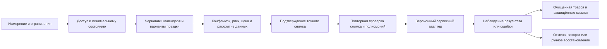

# Pasport [kalendarno-transportnogo servisnogo kontura](../Glossarij/kalendarno-transportnyij-servisnyij-kontur.md) lichnogo FUM-agenta

Pasport versii `1` zadayot zontichnyij kontrakt, po kotoromu [lichnyij FUM-agent](../Glossarij/lichnyij-FUM-agent.md) smozhet svyazyivatj kalendarj, raspisaniye i poyezdku v odin proveryayemyij scenarij. Kontur prinimayet namereniye cheloveka, chitayet toljko dostupnoye sostoyaniye, modeliruyet variantyi, otdelyayet chernovik ot vneshnego effekta, svyazyivayet podtverzhdeniye s tochnyim snimkom dejstviya, proveryayet otvet adaptera i sokhranyayet ochisjhennoye proiskhozhdeniye rezuljtata.

Tekusjhaya materializaciya pasporta ogranichena sinteticheskimi fiksturami i determinirovannyim simulyatorom klassa `R0`. Ona ne podklyuchayet setj, realjnyiye kalendari, kartyi, taksi, biletnyiye ili platyozhnyiye servisyi, ne otpravlyayet uvedomleniya, ne peredayot geolokaciyu i ne izmenyayet fizicheskoye ili vneshneye sostoyaniye. Dazhe polnostjyu sovpavsheye podtverzhdeniye v fiksture razreshayet toljko simulirovannyij otvet s zhyostkimi invariantami `simulation_only = true`, `external_effect = "none"` i `external_effects = []`.

## Naznacheniye i granica versii

Pasport okhvatyivayet obsjhij khod odnogo kalendarno-transportnogo namereniya:



Versiya `1` opredelyayet obsjhiye invariantyi, modelj operacij, dostup, podtverzhdeniye, oshibki, otmenu, proiskhozhdeniye i lokaljnuyu priyomku. Ona ne vyibirayet postavsjhikov, protokolyi avtorizacii, realjnyiye API, yuridicheskuyu otvetstvennostj, srok khraneniya personaljnyikh dannyikh, kriptograficheskij format zasjhisjhyonnyikh ssyilok, universaljnuyu ocenku bezopasnosti marshruta ili politiku avtonomii dlya povtoryayusjhikhsya dejstvij.

Konkretnyij kalendarnyij, kartograficheskij, taksomotornyij, biletnyij, platyozhnyij ili uvedomiteljnyij adapter trebuyet sobstvennogo pasporta. Takoj pasport dolzhen zakrepitj versiyu komand i nablyudenij, avtorizaciyu, kategorii peredavayemyikh dannyikh, idempotentnostj, sostoyaniye effekta, kvitancii, tajm-autyi, sverku, otmenu i otlichiya testovogo dvojnika ot postavsjhika. Uspekh nyineshnego simulyatora ne dokazyivayet sootvetstviye budusjhego adaptera.

## Yedinica operacii

Odna operaciya otnositsya k odnomu neizmennomu snimku plana. Minimaljnaya zapisj soderzhit:

- `operation_id` i `intent_id`, svyazyivayusjhiye dejstviye s iskhodnyim namereniyem;
- vid operacii i tochnuyu versiyu adaptera;
- `state_fingerprint` vkhodnogo sostoyaniya i `terms_version` uslovij postavsjhika;
- vremya, chasovoj poyas, uchastnikov i obyyektyi kak zasjhisjhyonnyiye ssyilki, a ne publikacionnyiye syiryiye znacheniya;
- kategorii dannyikh, kotoryiye budut prochitanyi, ispoljzovanyi ili peredanyi;
- cenu v minimaljnyikh yedinicakh i valyutu libo yavnoye otsutstviye cenyi;
- trebuyemyiye informacionnyiye prava i otdeljnoye operacionnoye polnomochiye;
- srok aktualjnosti, pravilo povtora, klyuch idempotentnosti i sposob proverki effekta;
- usloviya otmenyi, vozmozhnyij shtraf, vozvrat i kompensacionnyiye dejstviya;
- podtverzhdeniye, rezuljtat, oshibku i proverku rezuljtata kak otdeljnyiye sobyitiya proiskhozhdeniya.

Izmeneniye vremeni, chasovogo poyasa, marshruta, postavsjhika, uchastnikov, cenyi, valyutyi, uslovij vozvrata, sostava operacij, kategorij raskryivayemyikh dannyikh ili vkhodnogo sostoyaniya vyipuskayet novyij snimok. Prezhneye podtverzhdeniye k nemu ne perenositsya.

## Lokaljnyiye klassyi effekta

Klassyi `S0–S5` yavlyayutsya slovaryom etogo pasporta, a ne obsjhim razresheniyem FUM:

| Klass | Operaciya                                                                                       | Minimaljnyij barjyer versii `1`                                                                                                   |
| ----- | ---------------------------------------------------------------------------------------------- | ------------------------------------------------------------------------------------------------------------------------------- |
| `S0`  | Lokaljnoye chteniye uzhe razreshyonnoj fiksturyi, raschyot, sravneniye i chernovik bez peredachi naruzhu.   | Proveritj informacionnyij dostup i sokhranitj istochnik; otdeljnoye podtverzhdeniye dejstviya ne trebuyetsya.                            |
| `S1`  | Vneshneye chteniye, sposobnoye raskryitj servisu vremya, mesto, kontakt ili inoj privatnyij kontekst.  | Otdeljno proveritj pravo peredachi i tochnyij poluchatelj; realjnyij vyizov v versii `1` zapresjhyon.                                    |
| `S2`  | Obratimaya zapisj v lichnyij kalendarj, napominaniye ili inoj sobstvennyij servis.                  | Yavnoye podtverzhdeniye tochnogo snimka; zaraneye razreshyonnaya politika v versii `1` ne ispolnyayetsya.                                   |
| `S3`  | Izmeneniye sostoyaniya drugogo uchastnika ili otpravka yemu uvedomleniya.                            | Podtverzhdeniye soderzhaniya, adresata i raskryivayemyikh kategorij; pravo zapisi ne vyivoditsya iz prava chteniya.                         |
| `S4`  | Zakaz taksi, pokupka bileta, bronirovaniye, platyozh libo fizicheski znachimoye prodolzheniye.         | Yavnoye podtverzhdeniye cenyi, uslovij i dannyikh; dlya realjnogo transporta takzhe otdeljnyij barjyer klassa ne nizhe `R3`.                |
| `S5`  | Otmena, vozvrat, kompensaciya ili povtornaya sverka posle chastichnogo libo neodnoznachnogo iskhoda. | Novyij tochnyij snimok; podtverzhdeniye obyazateljno pri shtrafe, vozvrate, soobsjhenii tretjyej storone ili inom dopolniteljnom effekte. |

«Chteniye» ne obrazuyet odin bezopasnyij klass. Lokaljnoye chteniye uzhe dostupnoj fiksturyi ne raskryivayet dannyiye, a zapros marshruta vneshnemu postavsjhiku mozhet peredatj mestopolozheniye, vremya i povedencheskij kontekst. Poetomu informacionnyij effekt ocenivayetsya otdeljno ot HTTP-metoda ili nazvaniya operacii.

## Matrica servisnyikh oblastej

| Oblastj               | Chteniye i modelirovaniye                                          | Vozmozhnyij vneshnij effekt                                                         | Podtverzhdeniye i proverka                                                                                                                 | Otmena i vosstanovleniye                                                                                        |
| --------------------- | --------------------------------------------------------------- | -------------------------------------------------------------------------------- | ---------------------------------------------------------------------------------------------------------------------------------------- | -------------------------------------------------------------------------------------------------------------- |
| Kalendari             | `free/busy`, dostupnyiye sobyitiya, chernovik sobyitiya i napominanij. | Sozdaniye, izmeneniye ili udaleniye sobyitiya; priglasheniye uchastnikov.                | Snimok vremeni, zonyi, kalendarya, uchastnikov i raskryivayemyikh polej; posle zapisi — chteniye versii sobyitiya.                                  | Kompensacionnaya zapisj ili udaleniye s otdeljnyim uchyotom uzhe otpravlennyikh priglashenij.                           |
| Raspisaniya            | Publichnoye ili razreshyonnoye raspisaniye, intervalyi i peresadki.    | Peredacha poiskovogo konteksta postavsjhiku; zavisimyij vyibor rejsa ili seansa.      | Svezhestj istochnika, zona vremeni i identichnostj versii; rezuljtat poiska ne raven bronirovaniyu.                                          | Obnovitj modelj, ne obyyavlyaya prezhnij variant dostupnyim; zavisimyiye dejstviya vernutj k proverke.                 |
| Kartyi i marshrutyi      | Geokodirovaniye fiksturyi, ETA, variantyi puti i zapas vremeni.    | Raskryitiye iskhodnoj tochki, naznacheniya, vremeni, predpochtenij i tekusjhego mesta.    | Soglasovatj kategorii i granulyarnostj mestopolozheniya; neizvestnyij ili opasnyij marshrut blokiruyet avtomaticheskoye prodolzheniye.              | Perestroitj toljko modelj; uzhe sdelannyiye zakazyi i biletyi otmenyayutsya otdeljnyimi operaciyami.                     |
| Taksi                 | Sinteticheskaya ocenka cenyi, vremeni podachi i klassa uslugi.      | Peredacha tochnoj geolokacii i kontakta, zakaz, platyozh, dvizheniye avtomobilya.       | Tochnyij postavsjhik, tochki, okno, cena, valyuta, usloviya otmenyi i srok predlozheniya; zatem sverka zakaza po idempotentnomu klyuchu.             | Otdeljnaya otmena, nablyudayemaya kvitanciya, shtraf i status vozvrata; tajm-aut ne razreshayet slepoj povtor.         |
| Biletyi i bronirovaniya | Poisk sinteticheskikh variantov, mest, tarifov i pravil vozvrata. | Uderzhaniye mesta, peredacha identifikacionnyikh dannyikh, pokupka i dogovornyij effekt. | Podtverditj passazhira kak zasjhisjhyonnuyu ssyilku, segment, tarif, cenu, valyutu i pravila; izmeneniye lyubogo polya trebuyet novogo podtverzhdeniya. | Razdeljnyiye statusyi otmenyi broni, vozvrata deneg i uvedomleniya; otmena ne schitayetsya mgnovennyim otkatom.         |
| Uvedomleniya           | Chernovik soobsjheniya, kanal, adresat i vremya otpravki.            | Lokaljnyij pokaz, vneshnyaya dostavka, izmeneniye sostoyaniya drugogo uchastnika.        | Razlichatj `scheduled`, `sent`, `delivered` i `acknowledged`; podtverditj adresata, soderzhaniye i kanal.                                   | Otmenitj mozhno toljko yesjhyo ne vyipolnennuyu otpravku; uzhe raskryitoye soobsjheniye ne otzyivayetsya iz pamyati poluchatelya. |

## Dostup i operacionnyiye polnomochiya

[Urovenj dostupa](../Glossarij/urovenj-dostupa.md) zadayotsya dlya kazhdogo istochnika i rezuljtata kak `публичный`, `ограниченный`, `приватный` ili `закрытый`. Ryadom perechislyayutsya dopustimyiye chteniye, ispoljzovaniye, izmeneniye, publikaciya i peredacha. Proizvodnoye sostoyaniye nasleduyet naiboleye stroguyu granicu svoikh istochnikov, poka otdeljnaya proverka ne dokazhet bezopasnoye oslableniye.

Informacionnyij dostup ne yavlyayetsya polnomochiyem na dejstviye. Kontur vedyot otdeljno:

- pravo prochitatj `free/busy`, raspisaniye, marshrutnuyu fiksturu ili zasjhisjhyonnuyu ssyilku;
- pravo ispoljzovatj svedeniya vnutri lokaljnoj modeli;
- pravo raskryitj vyibrannyiye kategorii konkretnomu adapteru;
- pravo izmenitj sobstvennyij servis;
- pravo zatronutj drugogo uchastnika;
- pravo podtverditj platnoye, dogovornoye ili fizicheski znachimoye dejstviye;
- pravo ostanovitj, otmenitj, sveritj, vosstanovitj i proveritj rezuljtat.

Ni lichnyij FUM-agent, ni adapter ne schitayutsya avtorizuyusjhim subyyektom po umolchaniyu. Otsutstvuyusjheye, otozvannoye, prosrochennoye ili ne otnosyasjheyesya k snimku pravo privodit k ostanovke do vyizova adaptera.

## Kontrakt podtverzhdeniya

Podtverzhdeniye versii `1` svyazyivayetsya kak minimum so sleduyusjhimi polyami:

- `confirmation_id`, podtverzhdayusjhij subyyekt i nablyudayemoye vremya;
- `operation_id`, `state_fingerprint`, versiya adaptera i `terms_version`;
- tochnyiye operacii, postavsjhik, adresatyi i srok dejstviya;
- vremya, chasovoj poyas, marshrut i uchastniki cherez zasjhisjhyonnyiye ssyilki;
- `amount_minor`, valyuta, verkhnyaya granica stoimosti, shtraf i pravila vozvrata;
- polnyij nabor kategorij dannyikh, kotoryiye budut peredanyi;
- klyuch idempotentnosti, predel povtorov i sposob otzyiva.

Predstartovaya proverka povtorno sravnivayet vesj snimok. Nesovpadeniye ne pyitayetsya ugadatj namereniye cheloveka i vozvrasjhayet `reconfirmation_required`. Fikstura izmeneniya cenyi odnovremenno menyayet cenu, usloviya i otpechatok sostoyaniya i podtverzhdayet etot fail-closed-perekhod.

Obsjhij [otkryityij vopros o granicakh kalendarno-transportnyikh dejstvij](../Voprosyi/2026-07-03_09-03-59_MSK_granicyi-kalendarno-transportnyikh-dejstvij-FUM.md) poka ne opredelyayet, kogda zaraneye zadannaya politika avtonomii mozhet zamenitj yavnoye podtverzhdeniye. Poetomu versiya `1` ne ispolnyayet takuyu politiku. Budusjhij kontrakt dolzhen sdelatj yeyo versionnoj, otzyivnoj i ogranichennoj po operacii, summe, valyute, vremeni, mestu, postavsjhiku, uchastnikam, kategoriyam dannyikh, risku i chislu povtorov; vyikhod za lyuboj predel vozvrasjhayet yavnoye podtverzhdeniye.

## Sostoyaniya, oshibki i otmenyi

Pered potencialjnyim effektom realjnyij kontur obyazan dolgovechno svyazatj namereniye, tochnyij snimok, dostup i podtverzhdeniye. Toljko posle etogo dopustim versionnyij vyizov s idempotentnyim klyuchom. Otvet adaptera i nezavisimaya sverka sostoyaniya yavlyayutsya otdeljnyimi sobyitiyami: zapisj popyitki ne dokazyivayet uspekh, a lokaljnyij tajm-aut ne dokazyivayet otsutstviye vneshnego effekta.

| Sostoyaniye ili oshibka                            | Resheniye                                                                                                                               |
| ----------------------------------------------- | ------------------------------------------------------------------------------------------------------------------------------------- |
| Net dostupa ili adaptera                        | Pokazatj nedostupnuyu chastj i bezopasnyij ruchnoj shag; ne imitirovatj rezuljtat.                                                         |
| Privatnyij konflikt raspisaniya                   | Soobsjhitj toljko razreshyonnyij fakt `busy`; ne raskryivatj nazvaniye, uchastnikov, mesto, zametki i zasjhisjhyonnoye proiskhozhdeniye.               |
| Neizvestnyij ili opasnyij marshrut                 | Ostanovitj prodolzheniye, pokazatj bezopasnoye rezyume riska i variantyi; ne obyyavlyatj universaljnuyu bezopasnostj.                         |
| Net podtverzhdeniya                               | Vernutj `confirmation_required`; adapter ne vyizyivayetsya dazhe v fiksture.                                                               |
| Snimok ili srok podtverzhdeniya ne sovpal         | Vernutj `reconfirmation_required`; staroye podtverzhdeniye sokhranyayetsya toljko kak proiskhozhdeniye otkaza.                                  |
| Setj ili servis nedostupnyi do effekta           | Zafiksirovatj bezopasnyij kod; razreshitj povtor toljko posle novogo preflight i pri dokazannom otsutstvii effekta.                     |
| Tajm-aut posle otpravki                         | Pometitj sostoyaniye effekta kak `unknown`, zaprositj status po idempotentnomu klyuchu i zapretitj slepoj povtor zakaza ili oplatyi.       |
| Chastichnyij uspekh zavisimyikh operacij              | Khranitj sostoyaniye kazhdogo shaga; ne obyyavlyatj scenarij zavershyonnyim i predlozhitj otdeljnyiye kompensacionnyiye dejstviya.                    |
| Otmena prinyata                                  | Otdeljno nablyudatj otmenu zakaza, shtraf, sozdaniye vozvrata, zaversheniye vozvrata i uvedomleniye uchastnikov.                             |
| Otmena otklonena ili opozdala                   | Sokhranitj dejstvuyusjhij vneshnij effekt i bezopasnyiye variantyi ruchnogo vmeshateljstva; ne maskirovatj otkaz lokaljnyim udaleniyem namereniya. |
| Ne udalosj sokhranitj obyazateljnoye proiskhozhdeniye | Do vneshnego vyizova — ostanovitjsya; posle vozmozhnogo effekta — sokhranitj `unknown`, vyipolnitj sverku i ne sozdavatj lozhnyij uspekh.      |

Dlya budusjhikh oshibok minimaljnyi polya `code`, `stage`, `retryable`, `side_effect_state`, bezopasnoye rezyume, ssyilki na svideteljstva i variantyi vosstanovleniya. `side_effect_state` razlichayet `none`, `not_applied`, `applied` i `unknown`; toljko pervyiye dva mogut razreshitj povtor posle novogo preflight.

Otmena yavlyayetsya novyim dejstviyem, a ne peremotkoj istorii. Uzhe otpravlennoye priglasheniye, raskryitaya geolokaciya, ispoljzovannyij bilet ili vyipolnennaya poyezdka ne ischezayut iz vneshnego mira iz-za lokaljnogo statusa `cancelled`.

## Proiskhozhdeniye i privatnostj

Ochisjhennaya trassa dolzhna pozvolyatj vosstanovitj nablyudayemuyu cepochku bez publikacii chastnoj zhizni:

1. namereniye i yego publikacionno bezopasnyij identifikator;
2. versii i zasjhisjhyonnyiye ssyilki prochitannyikh istochnikov;
3. predlozhennyiye variantyi i tochnyij otpechatok vyibrannogo sostoyaniya;
4. dostup, podtverzhdeniye i osnovaniye operacionnogo polnomochiya;
5. adapter, versiya, operaciya i idempotentnyij klyuch;
6. popyitka do effekta, otvet, oshibka, sverka i fakticheskij status;
7. otmena, kompensaciya, vozvrat i ostatochnoye sostoyaniye.

Publichnaya [pamyatj FUM](../Glossarij/pamyatj-FUM.md) khranit pasport, skhemyi, sinteticheskiye fiksturyi, bezopasnyiye kodyi i agregirovannyiye rezuljtatyi proverok. Realjnyiye mesta, tochnyiye intervalyi, nazvaniya sobyitij, uchastniki, kontaktyi, dokumentyi, identifikatoryi zakazov, platyozhnyiye svedeniya, tokenyi i syiryiye otvetyi ostayutsya v privatnoj ili zakryitoj pamyati, zasjhisjhyonnom khranilisjhe libo vneshnem servise.

Publikacionnaya trassa ispoljzuyet neprozrachnuyu ssyilku na zasjhisjhyonnyij obyyekt i minimaljnoye rezyume. Obyichnyij SHA-256 nizkoentropijnogo privatnogo znacheniya sam po sebe ne schitayetsya bezopasnoj ssyilkoj: yego mozhno perebiratj. Nuzhen neprozrachnyij identifikator, klyuchevoj dajdzhest libo inoj mekhanizm zasjhisjhyonnogo sloya, chej tochnyij vyibor versiya `1` ne zadayot.

Yesli zakryitoye sobyitiye sozdayot konflikt, naruzhu popadayet toljko razreshyonnaya politikoj granulyarnostj zanyatosti. Dazhe tochnyij interval mozhet byitj chuvstviteljnyim; urovenj `busy` v fiksture dokazyivayet lishj otsutstviye nazvaniya, mesta i uchastnikov v publichnom otchyote, a ne universaljnuyu dostatochnostj takoj redakcii.

## Fiksturyi i determinirovannyij simulyator

[JSON Schema nabora fikstur](42-pasport-kalendarno-transportnogo-servisnogo-kontura-lichnogo-FUM-agenta/skhema-nabora-fikstur-v1.json) zapresjhayet neizvestnyiye polya i zakreplyayet tochnyiye vidyi operacij, dostupa, podtverzhdeniya, uslovij, otvetov adaptera i ozhidayemyikh reshenij. [Nabor iz desyati scenariyev](42-pasport-kalendarno-transportnogo-servisnogo-kontura-lichnogo-FUM-agenta/fiksturyi-scenariyev-v1.json) ispoljzuyet fiksirovannoye vremya `2030-01-15T09:00:00Z`, testovuyu valyutu `XTS` i toljko stroki s yavnyim prefiksom `SYNTHETIC_PRIVATE_` dlya chuvstviteljnyikh znachenij.

[Simulyator versii 1](42-pasport-kalendarno-transportnogo-servisnogo-kontura-lichnogo-FUM-agenta/simulyator-v1.py) chitayet lokaljnyij nabor, strogo proveryayet strukturu, primenyayet matricu dostupa, zasjhitnyiye usloviya i podtverzhdeniye, zatem vozvrasjhayet kanonicheski uporyadochennyij JSON-otchyot. On ne importiruyet setevoj kliyent, ne vyizyivayet subprocess, ne pishet fajlyi, ne chitayet sistemnyiye kalendari i ne ispoljzuyet nastennyiye chasyi sredyi.

Zapusk vsekh scenariyev:

```bash
python3 Документация/42-паспорт-календарно-транспортного-сервисного-контура-личного-FUM-агента/симулятор-v1.py --pretty
```

Zapusk odnoj fiksturyi:

```bash
python3 Документация/42-паспорт-календарно-транспортного-сервисного-контура-личного-FUM-агента/симулятор-v1.py \
  --fixture-id taxi-order.confirmed \
  --pretty
```

| Fikstura                            | Proveryayemyij iskhod                                                                                 |
| ----------------------------------- | ------------------------------------------------------------------------------------------------- |
| `route-model.no-effect`             | Marshrut modeliruyetsya pri dostupe, no vneshnij effekt ostayotsya pustyim.                              |
| `taxi-order.confirmation-missing`   | Zakaz ostanavlivayetsya do fiksturnogo adaptera bez yavnogo podtverzhdeniya.                           |
| `taxi-order.confirmed`              | Tochnyij snimok dopuskayet odin simulirovannyij otvet, no ne realjnyij zakaz.                          |
| `ticket-purchase.price-changed`     | Izmeneniye cenyi, uslovij i otpechatka trebuyet novogo podtverzhdeniya.                                 |
| `calendar-write.private-conflict`   | Publichnyij otchyot soderzhit toljko `busy`, a zakryityiye detali ne pokidayut vkhod.                       |
| `notification-send.access-missing`  | Otsutstvuyusjheye pravo peredachi blokiruyet uvedomleniye ranjshe podtverzhdeniya.                          |
| `schedule-read.adapter-error`       | Oshibka raspisaniya sokhranyayetsya otdeljno ot rezuljtata i ne stanovitsya vyidumannyim raspisaniyem.      |
| `ticket-cancel.confirmed`           | Otmena modeliruyetsya kak otdeljnoye podtverzhdyonnoye dejstviye s sobstvennyim iskhodom.                  |
| `route-model.unsafe`                | Opasnyij marshrut blokiruyet prodolzheniye dazhe bez platnogo dejstviya.                                 |
| `calendar-read.network-unavailable` | Nedostupnostj seti vozvrasjhayet oshibku bez podmenyi kyeshem i bez utverzhdeniya ob aktualjnom kalendare. |

[Avtonomnyij testovyij nabor](42-pasport-kalendarno-transportnogo-servisnogo-kontura-lichnogo-FUM-agenta/test-simulyatora-v1.py) proveryayet vse ozhidayemyiye resheniya, neizmennyij nulevoj vneshnij effekt, poryadok sobyitij, proiskhozhdeniye, redakciyu kazhdogo sinteticheskogo privatnogo znacheniya, rassoglasovannyij i prosrochennyij snimok podtverzhdeniya i bezopasnyij otkaz neizvestnoj operacii.

```bash
python3 Документация/42-паспорт-календарно-транспортного-сервисного-контура-личного-FUM-агента/тест-симулятора-v1.py
```

Pervyij TDD-progon ozhidayemo zavershilsya otsutstviyem `симулятор-v1.py`. Posle realizacii semj testov proshli na vsekh desyati fiksturakh. Eto dokazyivayet toljko determinirovannostj tekusjhej modeljnoj politiki i otsutstviye syiryikh znachenij fiksturyi v sformirovannom otchyote; test ne nablyudayet sistemnyij setevoj stek i potomu ne yavlyayetsya dokazateljstvom apparatnoj setevoj izolyacii Python-processa.

## Granica primenimosti

Versiya `1` yavlyayetsya dokumentacionnyim i modeljnyim rezuljtatom `R0`. Realjnyij transport otnositsya kak minimum k klassu `R3` [kartyi ogranichitelej fizicheskogo dejstviya FUM](40-karta-ogranichitelej-fizicheskogo-dejstviya-FUM.md) i ostayotsya zakryit do otdeljnogo doslovnogo trebovaniya, otraslevogo kontrakta, pravovyikh i dogovornyikh osnovanij, naznacheniya otvetstvennosti, pasportov adapterov i proveryayemogo podtverzhdeniya tochnogo dejstviya.

Pasport ne utverzhdayet, chto marshrut bezopasen, raspisaniye aktualjno, postavsjhik vyipolnil dejstviye, platyozh proshyol, uvedomleniye dostavleno ili otmena zavershilasj. On ne razreshayet nachalo [korobochnoj realizacii FUM](../Glossarij/korobochnaya-realizaciya-FUM.md) i ne zakryivayet otkryityij vopros ob avtonomii. Fiksturnyij `simulated_success` oznachayet lishj, chto sinteticheskij otvet dostignut po lokaljnoj vetvi pravil pri `external_effects = []`.

## Istochniki trebovanij

- [iskhodnyij zapros tekusjhej rabochej sessii](../Zhurnal/2026-07-24_09-17-50_MSK_podgotovitj-pasport-kalendarno-transportnogo-servisnogo-kontura-lichnogo-FUM-agenta/zapros.md)
- [kartochka FUM-STEP-0007](../Planirovaniye/kartochki-shagov/✅-FUM-STEP-0007-podgotovitj-pasport-kalendarno-transportnogo-servisnogo-kontura-lichnogo-FUM-agenta.md)
- [iskhodnyij zapros o kalendaryakh, raspisaniyakh, taksi i poyezdkakh](../Zhurnal/2026-07-03_09-03-59_MSK_opisatj-kalendarno-transportnyiye-dejstviya-FUM/zapros.md)
- [poljzovateljskaya istoriya kalendarya, raspisaniya i poyezdok](31-poljzovateljskiye-istorii-FUM/vesti-kalendari-i-planirovatj-poyezdki.md)
- [otkryityij vopros o granicakh kalendarno-transportnyikh dejstvij](../Voprosyi/2026-07-03_09-03-59_MSK_granicyi-kalendarno-transportnyikh-dejstvij-FUM.md)

## Opornyiye materialyi

- [FUM kak yedinaya tochka vzaimodejstviya s kompjyuterom](19-yedinaya-tochka-vzaimodejstviya-s-kompjyuterom.md)
- [Interfejs FUM-uzla](25-interfejs-FUM-uzla.md)
- [Minimaljnyij format trassyi ispolnyayemogo agentskogo cikla](37-minimaljnyij-format-trassyi-ispolnyayemogo-agentskogo-cikla.md)
- [Minimaljnyij format preobrazovaniya mezhdu nablyudatelyami FUM](38-minimaljnyij-format-preobrazovaniya-mezhdu-nablyudatelyami-FUM.md)
- [Minimaljnyij pasport peredavayemogo rezuljtata FUM](39-minimaljnyij-pasport-peredavayemogo-rezuljtata-FUM.md)
- [Karta ogranichitelej fizicheskogo dejstviya FUM](40-karta-ogranichitelej-fizicheskogo-dejstviya-FUM.md)
- [Kontrakt chistogo modeljnogo shaga](41-kontrakt-chistogo-modeljnogo-shaga.md)
- [shablon scenariya modeljnoj sredyi](../Planirovaniye/shablon-scenariya-modeljnoj-sredyi.md)

<!-- FUM-MD-RECENCY:BEGIN -->
<!-- last-content-edit: 2026-08-03 14:54:04 MSK -->
<!-- content-sha256: sha256:e8445fa5b461e14c0dc7b145dec15ebebb9885371670603f287b85fc09b68ed7 -->
<!-- FUM-MD-RECENCY:END -->
