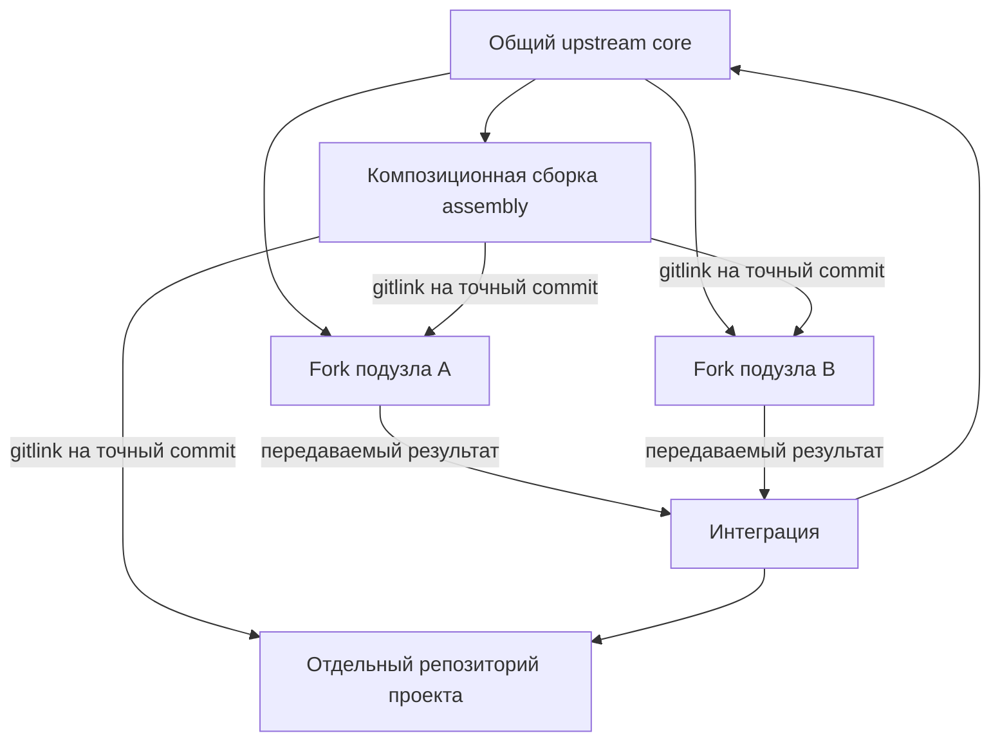

# Repozitornyij graf pishusjhikh poduzlov i proyektov FUM

Ekspluatacionnyij status: etot dokument sokhranyayet celevuyu arkhitekturu fork-repozitoriyev, worktree-pula, FIFO, continuation, review/integration/candidate/CAS i publikacii. Kontur otlozhen i ne dayot prava zapisi v tekusjhem repozitorii; dejstvuyusjhaya rabota vyipolnyayetsya odnoj vruchnuyu zapusjhennoj pishusjhej sessiyej v pervichnom checkout `refs/heads/master`.

[FUM](../Glossarij/FUM.md) dolzhen sokhranyatj soderzhateljnuyu rabotu universaljnyikh ispolnitelej s raznyimi kontekstnyimi rolyami ne toljko v soobsjheniyakh odnoj sessii, no i v proveryayemyikh Git-kommitakh. Dlya etogo dolgovechnyiye [poduzlyi](../Glossarij/poduzel-FUM.md) i proyektyi poluchayut sobstvennyiye repozitorii. V lokaljnom profile odnogo repozitoriya nezavisimyiye paralleljnyiye linii rabotayut v pereispoljzuyemyikh linked worktree `Подузлы/слот-*`, a posledovateljnyiye sessii odnoj linii peredayut drug drugu te zhe fizicheskij slot, polnyij ref i worktree. Samostoyateljnyiye repozitorii po-prezhnemu ispoljzuyut otdeljnyiye zhivyiye klonyi dlya svoikh linejnyikh cepochek.

Eta arkhitektura opisyivayet celevoj repozitornyij graf i [repozitornuyu kompoziciyu FUM](../Glossarij/repozitornaya-kompoziciya-FUM.md). Yedinyij avtonomnyij stend na vremennyikh lokaljnyikh bare-repozitoriyakh uzhe zamyikayet skvoznuyu priyomku dvukh paralleljnyikh pishusjhikh kandidatov, CAS-integracii, ogranichennogo resolver, dolgovechnogo fork-poduzla, samostoyateljnogo proyekta i tochnyikh roditeljskikh gitlink. Stend ne obyyavlyayet sozdannyimi vneshniye dolgovechnyiye resursyi, realjnyij proyektnyij submodule ili raspredelyonnyij ispolniteljnyij runtime.

## Yadro i kompozicionnaya sborka

Obsjhij upstream FUM i konkretnaya sborka seti vyipolnyayut raznyiye funkcii.

- **Yadro (`core`)** khranit publikacionno chistyiye obsjhiye pravila, skhemyi, dokumentaciyu, instrumentyi i perenosimyiye uluchsheniya. V nyom net grafa zhivyikh ekzemplyarov poduzlov i proyektov konkretnogo vladeljca.
- **Kompozicionnaya sborka (`assembly`)** yavlyayetsya otdeljnyim superproject konkretnogo sostavnogo uzla. Ona podklyuchayet yadro, dolgovechnyiye poduzlyi i proyektyi kak Git submodule i fiksiruyet soglasovannyij snimok ikh revizij.

Takoye razdeleniye predotvrasjhayet rekursivnoye samovklyucheniye. Yesli poduzel yavlyayetsya fork togo zhe repozitoriya, kotoryij uzhe soderzhit yego kak submodule, obyichnoye nasledovaniye roditeljskoj vetki sposobno vnesti v poduzel ssyilku na nego samogo i na vsyu roditeljskuyu sborku. Poetomu poduzlyi dolzhnyi nasledovatj chistoye yadro, a ne vetku assembly s grafom ekzemplyarov.

## Prototipyi kak ispolnyayemyiye testyi yadra

Proveryayemyij [prototip](../Prototipyi/README.md) mozhno povtorno ispoljzovatj kak ispolnyayemyij test realizacii kornevogo yadra. Dlya etogo pasport zaraneye svyazyivayet versiyu prototipa s tochnyim srezom `core`, obsjhimi vkhodnyimi fiksturami, nablyudayemyimi invariantami, ozhidayemyimi otkazami i profilem ekvivalentnosti. Odin i tot zhe nabor primenyayetsya k prototipu i otdeljnoj realizacii yadra, a raskhozhdeniye stanovitsya otkazom testa ili yavnoj versionirovannoj smenoj kontrakta.

Takoye ispoljzovaniye ne delayet eksperimentaljnyij kod chastjyu yadra i ne trebuyet sovpadeniya vnutrennikh arkhitektur. Vyichisliteljnaya logika proveryayemogo sreza ne dolzhna byitj obsjhej dlya etalona i realizacii: inache sravneniye stanet krugovyim. Uspekh podtverzhdayet toljko obyyavlennuyu oblastj prototipnogo kontrakta i ne zamenyayet moduljnuyu, integracionnuyu, bezopasnostnuyu ili produktovuyu priyomku vsego yadra.

## Dolgovechnyij ispolniteljnyij poduzel

Dolgovechnyij poduzel yavlyayetsya ne processom i ne vetkoj roditeljskogo checkout, a otdeljnyim fork-repozitoriyem yadra. On imeyet ustojchivyij identifikator, profilj sposobnostej, pamyatj, razresheniya, proverki i istoriyu. Yego osnovnaya vetka mozhet zhitj doljshe otdeljnyikh [sessij shagov FUM](../Glossarij/sessiya-shaga-FUM.md), a novyiye sessii vosstanavlivayut rabotu iz sokhranyonnyikh artefaktov, ne polagayasj na skryituyu istoriyu chata.

Celevoj [dochernij fork-agent FUM](../Glossarij/dochernij-fork-agent-FUM.md) sokhranyayet [universaljnyij](../Glossarij/universaljnyij-ispolniteljnyij-poduzel-FUM.md) potencialjnyij profilj: chteniye pamyati, planirovaniye, rabotu s instrumentami, dekompoziciyu, proverku, peredachu i pri otdeljnom razreshenii daljnejshuyu delegaciyu. Specializaciya stanovitsya [kontekstnoj roljyu](../Glossarij/kontekstnaya-rolj-FUM-agenta.md) naznacheniya, a ne inyim vidom agenta ili neizmenyayemyim urezaniyem yego sposobnostej. Rolj ne nasleduyet neogranichennyiye prava roditelya: konkretnoye naznacheniye otdeljno zadayot konechnyiye granicyi oblasti, dostupa, vneshnikh effektov, resursov i glubinyi rekursii, a takzhe kriterij ostanovki.

Kompozicionnaya sborka ne kopiruyet vnutrennyuyu istoriyu poduzla i ne poluchayet nad nim neyavnuyu totaljnuyu vlastj. Ona nablyudayet i prinimayet konkretnuyu reviziyu cherez gitlink. `master` dochernego fork yavno sinkhroniziruyetsya s tochnyim pokoleniyem kornevogo upstream; rolevaya pamyatj i kandidatyi zhivut vne etogo zerkaljnogo sloya. Uluchsheniye, poleznoye obsjhemu yadru, peredayotsya vverkh otdeljnoj publikacionno chistoj vetkoj ili drugim [peredavayemyim rezuljtatom FUM](../Glossarij/peredavayemyij-rezuljtat-FUM.md), a ne sliyaniyem vsej privatnoj i rolevoj pamyati poduzla.

## Kornevoye upravleniye konechnoj cepochkoj

Kornevoj FUM upravlyayet dolgovechnyim ispolniteljnyim poduzlom cherez versionirovannoye naznacheniye, a ne cherez neogranichennoye svobodnoye tekstovoye porucheniye. Naznacheniye zakreplyayet identichnosti roditelya, rebyonka i repozitoriya, kontekstnuyu rolj, tochnoye pokoleniye kornevogo upstream i iskhodnyij commit, polnyij rabochij ref i polnyij celevoj ref, konechnyij uporyadochennyij spisok kartochek, oblastj zapisi i isklyucheniya, dostup i vneshniye effektyi, byudzhetyi vremeni i resursov, predeljnyiye znacheniya parallelizma i glubinyi rekursii, obyazateljnyiye proverki, sostoyaniya ostanovki i vozobnovleniya, formu rezuljtata, klass obsjhego kandidata i kriterii nezavisimogo revjyu i integracii.

Proveryayemyij prototip materializuyet etu deklarativnuyu granicu dvumya zakryityimi skhemami pokoleniya `1`: neizmenyayemyim naznacheniyem linejnoj cepochki i pasportom yeyo sostoyaniya. Naznacheniye khyeshiruyet rolj, tochnoye kornevoye pokoleniye, iskhodnyij commit, kartochku cepochki, rabochij nabor, tochnyiye kartochki, ustojchivuyu identichnostj fizicheskogo checkout, rabochij i celevoj refs, vse konechnyiye ogranicheniya i odnu iz tryokh par klassa i marshruta rezuljtata. Pasport sostoyaniya svyazyivayet nachaljnuyu host-zadachu, naznachennyij, aktivnyij, ostanovlennyij libo gotovyij prefiks, chastnyiye pasporta, byudzhetyi, proverki, odnoroditeljskiye perekhodyi, stroguyu vetochnuyu FIFO, zaraneye sozdannyiye prodolzheniya i `finish-clean` togo zhe checkout i ref. Kontraktnyij validator ispolnyayet obe zakryityiye skhemyi i sopostavlyayet dokumentyi s neizmenyayemyim doverennyim kontekstom, a otdeljnyij lokaljnyij runtime teperj stroit etot kontekst iz fakticheskogo `HEAD`, Git-refs, snimkov FIFO, dopuskov i svyazannyikh commit-kvitancij vremennogo stenda.

Polozhiteljnaya runtime-fikstura ispoljzuyet odin fizicheskij zhivoj checkout i odin polnyij rabochij ref `refs/heads/роль/писатель`, otlichnyij ot neizmenyayemogo celevogo `refs/heads/master`. Tri otdeljnyiye processnyiye sessii posledovateljno poluchayut vladeniye cherez shtatnuyu ocheredj iz `HEAD`: pervyiye dve neposredstvenno vyizyivayut vetochnyij selector, ispolnyayut dve zavisimyiye kartochki, zaraneye sozdayut i podtverzhdayut rovno po odnomu ozhidayusjhemu prodolzheniyu i vyipolnyayut yedinyij `commit+handoff`; tretjya vidit `not_ready` i zavershayet ocheredj cherez `finish-clean`. Poluchennyij diapazon sostoit rovno iz dvukh svyazannyikh neposredstvennyikh odnoroditeljskikh commit. Mezhdu shagami ne sozdayutsya novyij klon, vremennyij step-ref ili result-ref.

Dochernij uzel mozhet poluchitj celuyu konechnuyu linejnuyu cepochku, no ne prevrasjhayet yeyo v odin beskontroljnyij pishusjhij khod. Kazhdaya kartochka stanovitsya otdeljnyim kontekstno posiljnyim vladeniyem vetkoj: zadacha vkhodit v stroguyu ocheredj odnogo fizicheskogo checkout cepochki, perechityivayet yego fakticheskuyu tekusjhuyu vershinu na tom zhe polnom rabochem ref i sozdayot proveryayemyij commit libo tipizirovannyij otricateljnyij rezuljtat. Yesli rezuljtat trebuyet osmyislennogo commit, tekusjhij vladelec zaraneye sozdayot rovno odnu zadachu-prodolzheniye togo zhe checkout i ref, podtverzhdayet yeyo ozhidayusjhij bilet i toljko zatem vyipolnyayet yedinyij `commit+handoff`, kotoryij atomarno prodvigayet rabochij ref na neposredstvennogo odnoroditeljskogo potomka i peredayot FIFO. Otdeljnyij integrator mezhdu posledovateljnyimi shagami ne uchastvuyet; merge-kommityi vnutri cepochki zapresjhenyi. Sovokupnyij pasport poetomu svyazyivayet polnyij linejnyij diapazon ot iskhodnogo commit do vershinyi, poryadok shagov, chastnyiye pasporta, fakticheskuyu oblastj izmenenij, byudzhetyi i proverki. Rasshireniye celi, oblasti ili polnomochij trebuyet novogo pokoleniya naznacheniya.

Zhiznennyij cikl razdelyon na nezavisimo vozobnovlyayemyiye granicyi:

1. Korenj proveryayet registraciyu rebyonka i prinyatyij gitlink, sozdayot unikaljnyij rabochij ref cepochki ot tochnogo iskhodnogo commit i odin zhivoj checkout dlya vsej dolgovechnoj cepochki samostoyateljnogo dochernego repozitoriya. Lokaljnyij profilj FUM-STEP-0148 otdeljno lenivo vyidayot linked worktree iz `Подузлы/слот-*` odnoj `self_line`; slot ostayotsya za liniyej cherez vse yeyo posledovateljnyiye prodolzheniya do terminaljnoj kvitancii. Celevoj ref ostayotsya neizmennyim.
2. Korenj sozdayot toljko nachaljnuyu [sessiyu shaga FUM](../Glossarij/sessiya-shaga-FUM.md), kotoraya svyazyivayet sobstvennyij `CODEX_THREAD_ID`, ocheredj, zhivoj klon i polnyij rabochij ref s tochnyim naznacheniyem; obyichnyij subagent obsjhego checkout etu rolj ne poluchayet.
3. Dopusjhennyij rebyonok vyipolnyayet shag v otdeljnoj sessii togo zhe checkout i ref. Pered osmyislennyim commit on sozdayot rovno odno prodolzheniye, mashinno podtverzhdayet yego ozhidayusjhij bilet i vyipolnyayet `commit+handoff`; prodolzheniye ostayotsya v strogoj FIFO, posle dopuska perechityivayet fakticheskij `HEAD`, vyizyivayet vetochnyij selector i vyibirayet sleduyusjhij dopustimyij shag. Otricateljnyij iskhod bez commit zavershayetsya chisto i ne sozdayot prodolzheniye. Korenj nablyudayet toljko versionirovannoye sostoyaniye i ne uderzhivayet sobstvennoye FIFO-pokoleniye na vremya vsej cepochki.
4. Posle gotovnosti diapazona otdeljnaya proveryayusjhaya zadacha vne posledovateljnogo vladeniya vetkoj v chistom klone zakreplyayet tochnuyu vershinu, povtoryayet mashinnyiye proverki, provodit smyislovoye revjyu i vozvrasjhayet odno iz sostoyanij prinyatiya, dorabotki, otkloneniya ili neopredelyonnosti.
5. Toljko prinyatuyu vershinu otdeljnyij integrator, takzhe ne yavlyayusjhijsya promezhutochnyim vladeljcem rabochej vetki cepochki, sopostavlyayet so svezhim celevyim ref, povtorno proveryayet i tochnyim CAS integriruyet po zakreplyonnomu marshrutu. Sobstvennyij dochernij ili proyektnyij marshrut posle prinyatiya dopuskayet otdeljnyij commit assembly s novyim gitlink sootvetstvuyusjhego repozitoriya. Obsjhij core-marshrut snachala zavershayet pull request, revjyu i CAS core, zatem sinkhroniziruyet fork i toljko posle proverki novogo dochernego commit dopuskayet soglasovannyij perekhod assembly.

Posle vtorogo commit lokaljnyij sborsjhik chitayet iz fakticheskoj vershinyi kartochki, rabochij nabor i chastnyiye pasporta, vosproizvodit istoricheskiye dopuski, ozhidayusjhiye biletyi i oficialjnyiye kvitancii iz Git-obyyektov, vyichislyayet polnyij diapazon, summarnyij diff i ostatok byudzheta i provodit postroyennyiye naznacheniye i sostoyaniye cherez obe zakryityiye skhemyi i semanticheskij validator. Gotovyij paket peredachi zakreplyayet base, head, vesj spisok commit, kvitancii, pasporta, puti i khyesh sovokupnogo izmeneniya i dve otdeljnyiye zapisi o budusjhikh zadachakh proverki i integracii. On yavno sokhranyayet `создан_pull_request = false` i `результат_принят = false`: materializaciya paketa ne dvigayet celevoj ref i ne obyyavlyayet rezuljtat prinyatyim.

Otricateljnyiye runtime-scenarii zakryivayut neodnoznachnyij otvet sozdaniya prodolzheniya bez povtornogo sozdaniya i bez dvizheniya vershinyi, poteryannyij otvet posle commit s tochnyim vosstanovleniyem po neizmenyayemoj kvitancii, idempotentnyij tochnyij povtor bez vtorogo commit, otkaz izmenyonnogo povtora i podmenu vershinyi v pakete peredachi. Eti scenarii dokazyivayut lokaljnuyu mekhaniku ograzhdenij, no ne zamenyayut avtoritetnyij readback realjnogo host.

Poverkh gotovogo paketa peredachi dobavlena chistaya granica kornevogo revjyu i integracii. Pasport revjyu svyazyivayet proveryayusjhego, postavsjhika i integratora, marshrut rezuljtata, tochnyiye base i head, linejnyij spisok commit s roditelyami, chastnyiye pasporta, kriterii, pervonachaljnyiye i povtornyiye proverki, strukturirovannyiye zamechaniya, korrelyacii i odin iskhod. Validator sopostavlyayet eti znacheniya s otdeljno peredannyim aktualjnyim snimkom; izmeneniye pokoleniya, base, head, chastnogo pasporta, kriteriya ili celevogo ref annuliruyet resheniye. Proverka vozvrasjhayet toljko predispolniteljnoye razresheniye s ozhidayemoj i novoj vershinami i ne chitayet Git ili rabochuyu kopiyu.

Dlya obsjhego vklada otdeljnyij konvert zaprosa sliyaniya zakreplyayet postavsjhika, iskhodnyij i celevoj repozitorii, polnyiye refs, identifikator, pokoleniye naznacheniya, base, head, diapazon, publikacionnyij audit, sostoyaniye i schyotchiki sozdaniya i avtoritetnogo chteniya. Eto mashinochitayemoye znacheniye ne yavlyayetsya sozdannyim setevyim pull request: zakryityiye, povtorno otkryityiye, force-push-, sdvinutyiye, neizvestnyiye i dublirovannyiye sostoyaniya toljko proveryayutsya kak vkhod. Prinyatyij tochnyij prefiks trebuyet novyikh pokoleniya, kandidatnogo ref i pasporta, a dlya core — otdeljnogo konverta s head na vershine prefiksa; neprinyatyij ostatok ostayotsya v iskhodnom pokolenii.

Chistyij pasport moderacii sokhranyayet identichnostj roditelya-moderatora i popyitki, proverennuyu bazu, roditeljskij rabochij ref, ref sostoyaniya, celevoj ref integracii i zamorozhennyiye rezuljtatyi. Sovmestimoye obyyedineniye trebuyet otdeljnuyu integracionnuyu vershinu s dvumya roditelyami, ne menyaya docherniye refs. Sleduyusjhij chistyij reduktor svorachivayet peredannyiye sobyitiya sravneniya celi, ozhidaniya assembly-gitlink, sinkhronizacii rebyonka s core i soglasovaniya dvukh gitlink. Yego sostoyaniya `принято_в_ребёнке_обновление_gitlink_ожидается` i `принято_в_ядре_синхронизация_ребёнка_ожидается` opisyivayut vozobnovlyayemuyu sagu, no sami ne vyipolnyayut commit, `update-ref`, clone, push ili izmeneniye submodule.

Uzkij avtonomnyij ispolnitelj zamyikayet effekt toljko dlya odnogo prinyatogo linejnogo diapazona mezhdu raznyimi vremennyimi bare-repozitoriyami. On prinimayet khyesh-svyazannoye razresheniye, proveryayet bare-rezhim, pryamyiye refs i formatyi obyyektov, tochnoye sovpadeniye iskhodnogo ref s prinyatoj head i polnyij odnoroditeljskij `base..head`, perenosit obyyektyi pod ustojchivyij ref uderzhaniya i povtoryayet proverku v celevom repozitorii. Yedinstvennoye dvizheniye celi vyipolnyayetsya tranzakciyej `update-ref` s `option no-deref` i tochnyimi old/new OID; konkurentnyij sdvig zakryivayetsya bez perezapisi, post-CAS readback vosstanavlivayet poteryannyij uspeshnyij otvet, a tochnyij povtor idempotenten.

Etot effektnyij srez ne sozdayot setevoj pull request, host-zadachu ili modeljnoye smyislovoye revjyu. On ne stroit mnogoroditeljskij commit i ne vyipolnyayet assembly-, submodule-, gitlink- ili core-child-sinkhronizaciyu: eti perekhodyi ostayutsya chistyimi sostoyaniyami reduktora i vkhodami budusjhikh ispolnitelej.

Celevoj ref i roditeljskij gitlink prinadlezhat raznyim repozitoriyam, poetomu obsjhej atomarnoj Git-tranzakcii mezhdu nimi net. Posle CAS sobstvennogo dochernego ili proyektnogo rezuljtata protokol sokhranyayet sostoyaniye `принято_в_дочернем_репозитории_обновление_gitlink_ожидается` s tochnyimi OID i kvitanciyej. Posle CAS obsjhego vklada otdeljno sokhranyayetsya `принято_в_ядре_синхронизация_ребёнка_ожидается`. Povtor ne otkatyivayet prinyatyij commit i ne ugadyivayet rezuljtat, a idempotentno prodolzhayet toljko svoj marshrut ot poslednej dokazannoj granicyi.

Raznyiye naznacheniya mogut ispolnyatjsya paralleljno, toljko yesli ikh tochnyiye paryi repozitoriya i rabochego ref, oblasti zapisi i inyiye izmenyayemyiye resursyi sovmestimyi. Podgotovka kandidatov dopuskayet paralleljnostj; prinyatiye v odin celevoj ref i obnovleniye odnogo roditeljskogo gitlink ostayutsya serializovannyimi. Neizvestnaya aktivnaya zadacha, poteryannaya privyazka k naznacheniyu, izmenivshayasya baza, nesovpavshij rezuljtat revjyu ili proigrannyij CAS zakryivayut perekhod bez predpolozheniya ob uspekhe.

Rekursivnaya delegaciya ne sleduyet iz universaljnosti avtomaticheski. Roditelj yavno razreshayet yeyo i zadayot konechnuyu glubinu, predeljnoye chislo odnovremenno aktivnyikh detej, sovokupnyiye byudzhetyi i nasleduyemuyu chastj polnomochij; rebyonok mozhet toljko suzhatj eti granicyi. Sostoyaniye kazhdogo rebra roditelj — rebyonok sokhranyayetsya nezavisimo, poetomu perezapusk modeli ili zaversheniye odnoj host-zadachi ne teryayet cepochku i ne sozdayot skryitogo vladeljca.

## Dvoichnaya razvilka i roditeljskaya moderaciya

[Vetvevoj fork FUM](../Glossarij/vetvevoj-fork-FUM.md) yavlyayetsya logicheskim uzlom odnoj rabochej linii, a ne sinonimom fizicheskogo fork-repozitoriya. Uzel zakreplyayet odnu paru identichnosti repozitoriya i polnogo rabochego ref i odin zhivoj pishusjhij checkout; eta para ostayotsya zarezervirovannoj za nim posle zaversheniya. Repozitorij mozhet dopolniteljno soderzhatj zerkaljnyij `master`, sluzhebnyiye, rezuljtatnyiye i pull-request refs. Poetomu proveryayemaya kardinaljnostj imeyet vid «odin fork-uzel — odna avtoritetnaya para repozitoriya i rabochego ref — ne boleye odnoj dopusjhennoj sessii-vladeljca», a ne «vo vsyom repozitorii susjhestvuyet odna Git-vetka».

Odin linejnyij uzel mozhet perejti v podgotovku razvilki i obyyavitj rovno dvukh detej s proverennyim obsjhim iskhodnyim sostoyaniyem. Pasport pokoleniya khranit ustojchivyiye identichnosti roditelya i detej, ravenstvo identichnostej roditelya i moderatora, repozitorii, obsjhij format Git-obyyektov, proverennuyu iskhodnuyu vershinu kazhdogo repozitoriya, raznyiye refs i checkout, roditeljskij rabochij ref, ref sostoyaniya moderacii, celevoj ref integracii, khyeshi naznachenij, kriterii sravneniya, byudzhetyi i predel rekursii. U dereva rovno odin korenj, u kazhdogo drugogo uzla odin roditelj, a odna sostoyavshayasya razvilka uzla imeyet rovno dvukh detej.

Oba rebyonka snachala susjhestvuyut bez prava zapisi. Kornevoj reyestr svyazyivayet s kazhdyim odnu podtverzhdyonnuyu nachaljnuyu host-zadachu v globaljnom predaktivacionnom sostoyanii, a sama ocheredj ne dopuskayet zadachu v FIFO yeyo novoj vetki do yedinogo CAS-perekhoda paryi. Obyichnyij prompt ne zamenyayet eto ograzhdeniye. Chastichnoye sozdaniye, poteryannyij otvet ili nesovpavshaya baza ne dopuskayut ni odnogo pisatelya; prodolzheniye vozmozhno lishj ot dokazannoj sokhranyonnoj granicyi cherez avtoritetnoye chteniye prezhnej popyitki libo yavnoye chelovecheskoye vosstanovleniye, no ne cherez povtornoye sozdaniye po dogadke.

Yesli pered razvilkoj nuzhen soderzhateljnyij kommit, yego obyichnoye unarnoye prodolzheniye snachala poluchayet zafiksirovannuyu vershinu cherez `commit+handoff`. Koordinator razvilki zatem ne menyayet roditeljskij rabochij ref, sokhranyayet sagu v ref sostoyaniya moderacii i posle aktivacii detej zavershayet roditeljskoye FIFO cherez `finish-clean`. Roditeljskij rabochij ref zamorazhivayetsya do resheniya, a logicheskij roditelj sam perekhodit v vosstanavlivayemoye sostoyaniye moderatora. Moderator ne vladeyet dochernimi refs i ne obyazan sokhranyatj prezhnij chat: otdeljnaya ograzhdyonnaya sessiya toj zhe logicheskoj identichnosti chitayet pasport i zakreplyonnyiye vershinyi iz Git. Kazhdyij rebyonok nezavisimo vedyot linejnuyu cepochku obyichnyimi odnoroditeljskimi `commit+handoff`; ozhidayusjheye prodolzheniye ne yavlyayetsya vtoryim aktivnyim vladeljcem.

Terminaljnyiye deti sokhranyayut dostizhimyiye refs rezuljtatov i pasporta tochnyikh diapazonov. Moderator primenyayet kriterii, zakreplyonnyiye do polucheniya rezuljtatov, i sokhranyayet tipizirovannoye resheniye: vyibratj levyij rezuljtat, vyibratj pravyij rezuljtat, obyyedinitj, vernutj na dorabotku v novom pokolenii, otklonitj oba libo ostavitj neopredelyonnostj. V pervoj versii celevoj ref integracii sovpadayet s zamorozhennyim roditeljskim rabochim ref; otdeljnyij integrator toljko posle dejstviteljnogo resheniya dvigayet yego ot ozhidayemoj bazyi po CAS, a mnogoroditeljskij kommit razreshyon lishj na etoj granice. Ryobra porozhdeniya ostayutsya neizmenyayemyim derevom v predaktivacionnom pasporte. Otdeljnyij post-decision graf integracii khranitsya v reshenii: rovno odno mnogoroditeljskoye rebro dopustimo toljko dlya sovmestimogo obyyedineniya, a ostaljnyiye iskhodyi ne soderzhat takogo rebra. Razreshyonnyij rezuljtat vlozhennoj razvilki zamorazhivayetsya kak rezuljtat uzla dlya moderatora urovnem vyishe.

Eta modelj zakreplena v proveryayemom prototipe tremya zakryityimi skhemami versii `1`, semanticheskim validatorom i chistyim reduktorom pokoleniya. Pasport khranit globaljnoye derevo i konechnyiye granicyi, chistyij reduktor razlichayet predaktivaciyu, yedinuyu aktivaciyu paryi, osvobozhdeniye roditelya, dopusk i zaversheniye detej, a resheniye ssyilayetsya na tochnyiye khyeshi dvukh zamorozhennyikh rezuljtatov i zaraneye zadannyikh kriteriyev. Opublikovannaya skhema sostoyaniya i tryokhdokumentnyij validator okhvatyivayut toljko terminaljnyij proverochnyij snimok; promezhutochnyiye value-sostoyaniya reduktora v versii `1` ne serializuyutsya. Chastichnyij ili neizvestnyij otvet sredyi zakryivayet perekhod bez povtornogo sozdaniya po dogadke; avtoritetnoye vosstanovleniye predstavleno otdeljnyim dokazateljnyim sobyitiyem. Validator ne pozvolyayet post-decision grafu perepisatj predaktivacionnyij pasport i posle dejstviteljnogo integriruyemogo resheniya vozvrasjhayet lishj deklarativnoye predispolniteljnoye razresheniye sravnitj i zamenitj celj ot tochnoj ozhidayemoj bazyi.

Poverkh chistogo sloya dobavlen effektnyij kornevoj reyestr zapuskov. On pod mezhprocessnoj blokirovkoj atomarno zamenyayet kanonicheskoye lokaljnoye sostoyaniye, navsegda rezerviruyet svyazj fork s paroj repozitoriya i polnogo ref i ne peredayot zhivoj checkout drugomu pokoleniyu. Dlya dvukh storon on dejstviteljno materializuyet otdeljnyiye lokaljnyiye Git-klonyi, proveryayet ikh `origin`, obsjhuyu bazu, tochnyij `HEAD`, polnyij ref i raznyiye Git common-dir. Mashinno-lokaljnyiye puti ostayutsya v lokaljnom reyestre, a perenosimyij pasport soderzhit toljko ikh neprozrachnyiye identichnosti.

Kazhdaya storona poluchayet sobstvennuyu neizmenyayemuyu popyitku sozdaniya i vyichislennyij khyesh polnogo konverta vyizova. Namereniye «vyizov mog sostoyatjsya» sokhranyayetsya do effekta; kak nachatyij vyizov bez podtverzhdyonnogo otveta, tak i yavno poteryannyij libo nepolnyij otvet blokiruyut obe storonyi bez prava na povtor. Vosstanovleniye samo zaprashivayet avtoritetnoye chteniye tochnoj prezhnej popyitki i prinimayet toljko odin polnostjyu sovpavshij rezuljtat; nolj, neskoljko rezuljtatov ili podmena ograzhdeniya sokhranyayut neopredelyonnostj. Ono dopustimo toljko do zamorazhivaniya pokoleniya: predaktivacionnyij snimok i kvitanciyu neljzya pozdneye izmenitj vosstanovleniyem. Tochnyiye `threadId` i `hostId` svyazyivayutsya s sobstvennyim `CODEX_THREAD_ID` i polnyim svideteljstvom neaktivnogo bileta naznacheniya.

Do yedinstvennogo host-vyizova kazhdogo rebyonka v yego novom checkout ustanavlivayetsya nesvyazannyij barjyer s vetkoj, bazoj, fork, pokoleniyem, kliyentskoj popyitkoj, tochnyimi identifikatorom i khyeshem strukturirovannogo naznacheniya, identifikatorom resursnoj popyitki i khyeshem yeyo dopuska. Posle tochnogo otveta otdeljnyij CAS dobavlyayet `threadId`, `hostId`, khyesh polnogo konverta i pereschitannyij khyesh privyazki, no vsyo yesjhyo ne otkryivayet FIFO. Posle podtverzhdeniya obeikh storon yedinyij CAS kornevogo reyestra pereschityivayet zamorozhennyij snimok i vyidayot obsjhuyu kvitanciyu i kornevoye dokazateljstvo, kotoroye svyazyivayet dva raznyikh sortirovannyikh khyesha privyazok, uzhe kommityasjhikh resursnyiye ograzhdeniya obeikh storon. Toljko zatem barjyer otkryivayetsya po tochnoj Git CAS-osnove. Pervyij i kazhdyij posleduyusjhij dopusk v sobstvennuyu FIFO fizicheskogo dochernego checkout zanovo proveryayut obyyekt barjyera, polnyij branch-ref, pokoleniye, vse chetyire resursnyikh ograzhdeniya i aktivirovannuyu bazu; roditeljskaya FIFO nikogda ne schitayetsya dochernim vladeniyem. Posle aktivacii kazhdaya vetka prodolzhayetsya toljko svoim obyichnyim `create → waiting-ticket → commit+handoff`, bez dochernego dispetchera.

V tom zhe atomarnom reyestre dejstvuyet uzkij resursnyij raspredelitelj. Yego yedinstvennyij vkhod — zakryitoye strukturirovannoye naznacheniye s tochnyimi identifikatorom, khyeshem i pokoleniyem, fork i rebyonkom, repozitoriyem, polnyim rabochim ref, neprozrachnyimi identichnostyami live-checkout i Git common-dir, zakreplyonnyimi kornem roljyu, klassom rezuljtata i effektami, oblastyami zapisi s isklyucheniyami, prochimi yavno izmenyayemyimi resursami, Desktop-host, modeljnyim profilem i konechnyimi limitami. Svobodnaya proza ne klassificiruyetsya, sovmestimostj iz neizvestnyikh alias, putej, limitov ili pokoleniya ne vyivoditsya, a uzhe vyidannyiye polnomochiya ne rasshiryayutsya.

Kornevyiye polnomochiya zakreplyayut vesj zakryityij resursnyij kontrakt: oblasti zapisi i isklyucheniya, inyiye izmenyayemyiye resursyi, stadiyu, celj integracii, host- i modeljnyij profili i kazhdyij limit. Kliyent ne mozhet podmenitj eti polya pri registracii ili dopuske.

Paralleljnyij dopusk trebuyet odnovremenno raznyikh rabochikh refs i dokazanno neperesekayusjhikhsya effektivnyikh oblastej zapisi. Odin polnyij rabochij ref, odna live-checkout/common-dir identity i kazhdyij inoj yavno nazvannyij izmenyayemyij resurs imeyut ne boleye odnogo vladeljca; obsjhij celevoj ref ne konfliktuyet na podgotovke, no stadiya integracii v odnu celj imeyet otdeljnyij isklyuchiteljnyij slot. Sostavnoj klyuch fork i pokoleniya ne zamenyayet otdeljnyiye konfliktnyiye indeksyi repozitoriya/ref i normalizovannyikh putej: inache raznyiye pokoleniya skryili byi vladeniye odnim fizicheskim resursom.

Resheniye dopuska ograzhdeno khyeshem naznacheniya, pokoleniyem i reviziyej CAS. Pered kazhdyim vyideleniyem reyestr proveryayet yomkosti fork, naznacheniya, rebyonka, Desktop-host i modeljnogo profilya i sveryayet sokhranyonnyiye schyotchiki s pereschyotom po kanonicheskim sessiyam. Pishusjhaya i moderiruyusjhaya sessii odnogo zhivogo fork delyat obsjhij predel rovno `1`. Ozhidayusjheye prodolzheniye, neaktivnyij rebyonok i vneshnyaya read-only proverka ne vladeyut fork i izmenyayemyimi resursami, no po yavnoj politike naznacheniya uderzhivayut slotyi samogo naznacheniya, rebyonka, Desktop-host i modeljnogo profilya. Namereniye host-vyizova, neizvestnyij ili poteryannyij otvet, ostanovka i otmena ostayutsya neterminaljnyimi i uderzhivayut tochnuyu prezhnyuyu masku vyideleniya do avtoritetnogo svideteljstva; terminalizaciya odnim CAS sokhranyayet polnyiye iskhod i kvitanciyu i osvobozhdayet toljko runtime-yomkostj, ne udalyaya vechnyiye topologicheskiye rezervacii fork, repo/ref i rodoslovnoj checkout.

Avtonomnyiye scenarii ispoljzuyut poddeljnuyu sredu bez seti, modeli, vneshnikh repozitoriyev ili realjnogo Codex Desktop. Oni pokryivayut tochnuyu paru, poteryannyij i nepolnyij otvetyi, ograzhdyonnoye vosstanovleniye, podmenu `CODEX_THREAD_ID`, mezhpokolencheskiye povtoryi resursov, obsjhij Git common-dir, povtor zadachi i vosstanovleniye kvitancii posle padeniya. Otdeljnaya sinkhronizirovannaya fikstura dokazyivayet `max_active = 2` dlya raznyikh refs s neperesekayusjhimisya oblastyami i strogij poryadok konfliktuyusjhikh naznachenij. Etot sloj ne dokazyivayet fizicheskij singleton Desktop pri nedostupnoj host-identichnosti, ne vyizyivayet modelj, ne publikuyet rezuljtatyi, ne provodit nezavisimoye revjyu ili CAS-integraciyu i ne dvigayet roditeljskij ref.

## Nachaljnyij rolevoj pul i Codex Desktop

V nachaljnoj celevoj konfiguracii kornevoj `fum` planiruyet, zapuskayet, nablyudayet, nakaplivayet i integriruyet rabotu tryokh dolgovechnyikh fork-agentov. `fum-yadro` preimusjhestvenno voplosjhayet prinyatyiye perenosimyiye navyiki i razrabatyivayet korobochnyiye versii FUM; `fum-optimizator` isjhet povtoryayemyiye LLM-processyi s algoritmiziruyemoj obolochkoj; `fum-pisatelj` stroit [tekhnicheskoye samoopisaniye FUM](../Glossarij/tekhnicheskoye-samoopisaniye-FUM.md). Naznacheniye pisatelya otdeljno vyibirayet kanonicheskuyu proizvodnuyu dokumentaciyu libo opisaniye FUM dlya adresata. Vse troye ostayutsya universaljnyimi: imya zadayot predpochtiteljnyij marshrut, no ne isklyuchiteljnoye umeniye i ne razresheniye.

Kornevoj FUM vzaimodejstvuyet s Codex Desktop kak s host-orkestratorom etoj nachaljnoj sborki. V lokaljnom profile obyichnaya novaya zadacha snachala stroit v chistom osnovnom checkout exact committed routing snapshot: OID celevoj vershinyi i planovyikh istochnikov, reviziyu pula, aktivnyiye linii i tochnoye sostoyaniye ikh FIFO, a takzhe svobodnyiye slotyi. Ona yavno vyibirayet novuyu paralleljnuyu liniyu, posledovateljnoye prodolzheniye susjhestvuyusjhej linii libo read-only-marshrut bez pisateljskogo slota. Sovmestimyiye linii pisatelya, recenzenta i integratora mogut ispolnyatjsya paralleljno, a kazhdyij kontekstno posiljnyij shag ostayotsya otdeljnoj Desktop-zadachej. Sessiya shaga ne yavlyayetsya dolgovechnyim fork-agentom i ne nesyot yego dolgovremennuyu pamyatj.

## Lokaljnyij pul linked worktree

Pul sostoit iz konechnogo nabora pereispoljzuyemyikh katalogov `Подузлы/слот-*`. Khyesh exact committed routing snapshot svyazyivayet resheniye obyichnoj zadachi ne toljko s OID planovyikh istochnikov, no i so vsemi aktivnyimi naznacheniyami, polnyimi refs, worktree, queue OID, vladeljcami i ozhidayusjhimi zadachami. `параллельная_линия` lishj posle takogo resheniya lenivo rezerviruyet svobodnyij slot i sozdayot unikaljnoye naznacheniye `self_line`; `последовательное_продолжение` atomarno dobavlyayet dolgovechnyij bilet k tochnoj susjhestvuyusjhej linii; `только_чтение` ne raskhoduyet pisateljskij slot.

Odin slot imeyet ne boleye odnoj odnovremenno dopusjhennoj sessii, no ostayotsya za liniyej cherez posledovateljnostj vladeljcev. Do kommita tekusjhego vladeljca sleduyusjhij tochnyij `CODEX_THREAD_ID` uzhe zakreplyon v FIFO toj zhe paryi ref i worktree. CAS `commit+handoff` odnoj tranzakciyej sveryayet pokoleniye i iskhodnuyu vershinu, sozdayot odin pryamoj kommit, dvigayet ref i peredayot ocheredj yeyo golove. Poluchatelj obyazan uvidetj `reload_required`, perechitatj fakticheskij novyij `HEAD`, podtverditj exact OID i toljko zatem poluchitj novoye pokoleniye. Neizmenyayemaya kvitanciya i read-only-vosstanovleniye pozvolyayut povtoritj ili vozobnovitj poteryannyij otvet bez dublirovaniya slota, bileta, kommita i handoff.

Poka v FIFO linii yestj prodolzheniye, yeyo itogovyij rezuljtat neljzya zamorozitj. Toljko posle terminala vsej linii, otsutstviya vladeljca i ozhidayusjhikh biletov, ostanovki pozdnikh pisatelej i proverki chistyikh checkout i indeksa commit zakreplyayetsya ustojchivyim result-ref, a slot vozvrasjhayetsya v pul. Soderzhateljnaya identichnostj rezuljtata posle etogo zhivyot v Git-obyyekte, ref i pasporte, a ne v kataloge `Подузлы/`; sleduyusjhij poljzovatelj poluchayet novoye naznacheniye i novyij rabochij ref.

Zamorozhennyij rezuljtat avtomaticheski poluchayet nezavisimoye agentskoye revjyu v otdeljnom slote. Otdeljnyij agent-integrator povtoryayet proverki; pri konflikte on razreshayet toljko zaraneye razreshyonnyij klass i peredayot poluchennyij itog na povtornoye nezavisimoye revjyu. Prinyatyij obyyekt prokhodit v lokaljnyij `master` toljko cherez obyichnuyu branch-scoped FIFO osnovnoj vetki i yeyo exact-CAS, a ne pryamyim dvizheniyem ref iz integracionnogo slota.

Vse result-ref, vklyuchaya zablokirovannyiye i neslivayemyiye, sokhranyayutsya otdeljno ot `master`. Posle proverki publikacionnoj chistotyi kazhdyij ref avtomaticheski otpravlyayetsya bez force v nastroyennyij remote etogo zhe repozitoriya i podtverzhdayetsya tochnyim readback. Setevoj ili autentifikacionnyij otkaz perevodit transport v `publication_pending`, ne udalyayet lokaljnyij ref i ne razreshayet ugadyivatj uspekh. Zablokirovannyij rezuljtat publikuyetsya toljko otdeljnyim udalyonnyim result-ref; remote `master` sleduyet lishj za prinyatoj integraciyej posle povtornogo revjyu i obyichnoj serializovannoj peredachi. Marshrut FUM-STEP-0148 ne sozdayot GitHub fork ili pull request.

Dokumentaljnyij etalonnyij CLI dopuskayet soderzhateljnyiye i terminaljnyiye komandyi pula lishj pri exact `repo-root` naznachennogo slota i sovpavshem `worktree_id`. Eto dokazyivayet protokoljnuyu disciplinu vyizovov, no ne perenos ili vozobnovleniye host-workspace Codex Desktop i ne otsutstviye avtomaticheskikh chtenij osnovnogo checkout do pervogo instrumenta; profilj ne nazyivayetsya nativnoj izolyaciyej. Linked worktree takzhe ne zamenyayet dolgovechnyij fork-poduzel, otdeljnyij proyektnyij repozitorij, assembly ili submodule. Eti formyi sokhranyayut sobstvennyiye repozitornyiye identichnosti i pamyatj; lokaljnyij pul otvechayet toljko za kooperativnuyu materializaciyu linij odnogo repozitoriya.

Podrobnyiye roli, spisok tem algoritmizacii i dokazateljnaya granica sobranyi v [plane nachaljnogo rolevogo pula](../Planirovaniye/nachaljnyij-rolevoj-pul-dochernikh-fork-agentov-FUM.md).

## Proyekt kak samostoyateljnyij repozitorij

Proyekt imeyet sobstvennyij repozitorij, ustojchivyiye identichnosti proyekta i repozitoriya, osnovnuyu vetku, trebovaniya, proverki i granicyi dostupa. Putj `Проекты/<краткое-имя>` v assembly yavlyayetsya tochkoj podklyucheniya submodule, a ne obyichnyim katalogom proyekta vnutri vetki obsjhej pamyati. Roditeljskij katalog `Проекты/регистрации/` khranit zakryityiye mashinnyiye zapisi kompozicii po ustojchivyim identifikatoram proyektov.

Pasport proyekta razdelyon na chelovekochitayemyij kornevoj `README.md` i svyazannyij zakryityij `Паспорт-проекта.json`. Mashinnaya chastj zakreplyayet celj, identichnosti, ustojchivyij adres repozitoriya, polnyij rabochij ref, dostup, publikacionnuyu granicu, puti sobstvennyikh pravil, ocheredi, vetochnogo selektora, rabochego nabora i kartochki, khyesh rabochego nabora, istochniki, proverki i usloviye zaversheniya. Ona ne soderzhit OID kommita, v kotoryij sama vkhodit, ili gitlink na proyekt: takoj self-OID sozdal byi ciklicheskuyu zavisimostj soderzhimogo ot sobstvennogo khyesha.

Roditeljskaya registraciya khranit toljko vid `project`, identichnosti, adres i polnyij ref repozitoriya, putj submodule, tochnyij gitlink, dostup, publikacionnuyu granicu, proverki i marshrut peredachi. Ona ne kopiruyet celj, zadachu, pravila, ocheredj, sostoyaniye prodolzheniya, kartochku ili rabochij nabor. Blagodarya etoj granice roditelj mozhet proveritj formu registracii i zakreplyonnuyu reviziyu, ne prisvaivaya vnutrenneye upravlyayusjheye sostoyaniye proyekta.

Proyektnyij `AGENTS.md`, ocheredj i protokol obyazateljnogo prodolzheniya vetki dejstvuyut otnositeljno fizicheskogo checkout dochernego repozitoriya i tochnogo polnogo ref. Novaya zadacha-prodolzheniye sozdayotsya v tom zhe sokhranyonnom lokaljnom proyekte; sluzhebnyiye refs i kvitancii vyichislyayutsya iz Git common-dir etogo checkout, ne publikuyutsya v bare-repozitorij i ne perenosyatsya v novyij klon. Dopusk, prodolzheniye ili sostoyaniye roditelya ne yavlyayutsya dokazateljstvom sostoyaniya proyekta.

Rolj proyekta i rolj poduzla ne sovpadayut avtomaticheski. Poduzel yavlyayetsya ispolnitelem s sobstvennyim profilem sposobnostej i dolgovremennoj pamyatjyu; proyekt yavlyayetsya celevoj oblastjyu rezuljtatov. Odin poduzel mozhet rabotatj nad neskoljkimi proyektami, neskoljko poduzlov — nad odnim proyektom, a repozitorij, sovmesjhayusjhij obe roli, dolzhen obyyavlyatj ikh razdeljno.

## Tochnyij gitlink vmesto zhivoj vetki

Git submodule fiksiruyet v dereve roditelya tochnyij commit dochernego repozitoriya. Dazhe yesli v `.gitmodules` ukazana rekomenduyemaya vetka, gitlink ne nachinayet avtomaticheski sledovatj za yeyo vershinoj. Dolgovechnaya vetka zhivyot v fork ili proyektnom remote, a commit assembly zakreplyayet toljko prinyatyij snimok.

Obnovleniye submodule dopustimo posle togo, kak vyibrannyij commit opublikovan libo inache nadyozhno sokhranyon i dostizhim iz razreshyonnogo istochnika. Neyavnoye `update --remote` ne yavlyayetsya vyiborom sleduyusjhego sostoyaniya FUM: novaya reviziya prokhodit proverku, otbor i otdeljnoye obnovleniye gitlink.

Do materialization roditelj chitayet sobstvennyiye registraciyu, `.gitmodules` i zapisj dereva rezhima `160000`, proveryayet tochnyij OID i yego dostizhimostj i ne ugadyivayet zhivuyu vershinu dochernej vetki. Yavnaya materialization sozdayot chistyij detached-snimok rovno na gitlink. Rabochaya vetka prodolzhayet zhitj toljko v otdeljnom zhivom klone dochernego repozitoriya.

## Ispolneniye shagov i izolirovannyikh kandidatov

Kratkozhivusjhij pishusjhij ispolnitelj poluchayet odin kontekstno ogranichennyij rabochij paket vnutri naznachennoj cepochki s tochnyimi identifikatorami poduzla, proyekta, cepochki i shaga, celevyim repozitoriyem, fakticheskim bazovyim commit, fizicheskim zhivyim checkout, tochnyim polnyim rabochim ref cepochki, otlichnyim ot nego celevyim ref integracii, razreshyonnyimi putyami, vkhodami, proverkami i formoj peredachi. V lokaljnom profile FUM-STEP-0148 checkout yavlyayetsya linked worktree `Подузлы/слот-*`, zakreplyonnyim za vsej aktivnoj `self_line`: sleduyusjhaya posledovateljnaya zadacha poluchayet bilet toj zhe linii i tot zhe slot, a nezavisimoye naznacheniye — inoj svobodnyij slot. Dolgovechnaya cepochka samostoyateljnogo repozitoriya otdeljno ispoljzuyet odin zhivoj klon i obyichnyiye obyazateljnyiye prodolzheniya yego ref.

Otdeljnyij odnorazovyij klon celevogo repozitoriya sokhranyayetsya dlya samostoyateljnogo repozitoriya ili avtonomnoj fiksturyi. V lokaljnom pule nezavisimaya paralleljnaya liniya poluchayet pereispoljzuyemyij slot i unikaljnyij polnyij ref vida `refs/heads/codex/подузлы/<assignment-id>`. Raznyiye linii ne menyayut checkout i indeksyi drug druga i po kontraktu ne menyayut chuzhiye refs, khotya linked worktree delyat common-dir. Fizicheskij slot osvobozhdayetsya toljko posle terminala vsej linii, a ne posle kazhdogo yeyo promezhutochnogo shaga ili prodolzheniya.

Soderzhateljnyij rezuljtat shaga vnutri cepochki fiksiruyetsya rovno odnim neposredstvennyim odnoroditeljskim commit vmeste s nablyudayemyim proiskhozhdeniyem i proverkami posle sozdaniya i podtverzhdeniya tochnogo prodolzheniya. Otricateljnyij rezuljtat, vozrazheniye ili neustranyonnyij konflikt sokhranyayutsya otdeljnyim tipizirovannyim pasportom i ne dvigayut rabochij ref, yesli oni dayut proveryayemuyu informaciyu; pri zavershenii bez commit sleduyusjhaya zadacha ne sozdayotsya. Skryityiye rassuzhdeniya modeli, mashinnyij shum i sekretyi ne stanovyatsya pamyatjyu toljko radi uvelicheniya chisla kommitov.

## Peredacha i prinyatiye rezuljtata

Peredacha mezhdu repozitoriyami prokhodit kak vosstanavlivayemaya posledovateljnostj, potomu chto Git ne predostavlyayet odnoj atomarnoj tranzakcii dlya neskoljkikh nezavisimyikh repozitoriyev.

1. Nezavisimyij paralleljnyij pishusjhij kandidat sozdayot commit vo vremennom ref svoyej popyitki i zakreplyayet pasport rezuljtata s iskhodnyim i celevyim repozitoriyami, bazovyim i rezuljtiruyusjhim commit, proverkami i ogranicheniyami dostupa.
2. Commit takogo nezavisimogo kandidata sokhranyayetsya pod ustojchivyim ref rezuljtata v istochnike, iz kotorogo yego dostizhimostj mozhno proveritj.
3. Posledovateljnyij shag linejnoj cepochki ne prokhodit eti dve granicyi: yego dopusjhennyij vladelec posle podtverzhdyonnogo prodolzheniya vyipolnyayet `commit+handoff` neposredstvenno na tochnom rabochem ref togo zhe checkout. Otdeljnyiye proveryayusjhij i integrator podklyuchayutsya toljko k gotovomu diapazonu ili yavno vyibrannomu prefiksu i ne stoyat mezhdu shagami cepochki; celevoj ref integracii do etogo ostayotsya neizmennyim.
4. Gotovaya cepochka klassificiruyetsya po zaraneye zakreplyonnomu celevomu repozitoriyu. Sobstvennyij rezuljtat rebyonka prokhodit revjyu i CAS v dochernij celevoj ref; proyektnyij rezuljtat — priyomku v samostoyateljnom proyektnom repozitorii; publikacionno chistyij obsjhij vklad — otdeljnuyu vetku fork i pull request v kornevoye yadro. Ni odin marshrut ne podmenyayetsya drugim iz-za identichnosti ispolnitelya.
5. Posle nezavisimogo revjyu neizmennyikh bazyi i vershinyi integrator celevogo repozitoriya povtoryayet proverki i tochnyim CAS obnovlyayet toljko obyyavlennyij ref. V marshrute obsjhego vklada kornevoye yadro sokhranyayet docherniye commit v rodoslovnoj bez svyortki istorii; pravila istorii proyekta zadayutsya proyektnyim kontraktom.
6. Assembly obnovlyayet gitlink toljko togo dochernego repozitoriya, v kotorom uzhe poyavilsya novyij prinyatyij commit. Prinyatiye obsjhego vklada v core samo po sebe ne razreshayet postavitj gitlink fork na PR-head yadra.

Dlya mnogoshagovoj cepochki peredavayemyim kandidatom yavlyayetsya ne proizvoljnaya zhivaya vetka, a zakreplyonnyij proveryayemyij linejnyij diapazon ot tochnogo iskhodnogo commit do tochnoj vershinyi. Integrator proveryayet vesj dostizhimyij diapazon, neposredstvennogo yedinstvennogo roditelya kazhdogo commit, poryadok, chastnyiye pasporta i summarnyij diff; nalichiye neskoljkikh commit ne oslablyayet trebovaniya k proiskhozhdeniyu, oblasti i povtornyim proverkam.

Pull request yavlyayetsya obyazateljnyim host-konvertom peredachi publikacionno chistogo obsjhego vklada iz fork v sovmestimoye kornevoye yadro, no ne universaljnyim transportom lyubogo proyektnogo rezuljtata i ne samostoyateljnyim dokazateljstvom kachestva ili prinyatiya. Yego vosstanavlivayemyij pasport zakreplyayet provajdera, iskhodnyiye i celevyiye repozitorii i polnyiye refs, ustojchivyij identifikator pull request, klyuch idempotentnosti, tochnyiye base/head, pokoleniye naznacheniya i nablyudayemyij host-status. Dvizheniye base ili head, force-push, dublikat, zakryitiye, povtornoye otkryitiye, poteryannyij otvet sozdaniya i sostoyaniye «CAS uspeshen, host-status neizvesten» poluchayut otdeljnyiye zakryityiye iskhodyi i readback; neizvestnostj ne ugadyivayetsya kak uspekh.

Dlya lokaljnogo worktree-pula FUM-STEP-0148 dejstvuyet otdeljnyij vnutrepozitornyij marshrut, kotoryij ne ispoljzuyet punkt pro fork i pull request. Zamorozhennyij result-ref prokhodit avtomaticheskoye nezavisimoye agentskoye revjyu; otdeljnyij integrator v svoyom worktree razreshayet dopustimyij konflikt, a itog posle lyubogo razresheniya obyazateljno poluchayet povtornoye nezavisimoye revjyu. Toljko prinyatyij obyyekt mozhet byitj peredan v obyichnuyu FIFO osnovnoj vetki dlya exact-CAS lokaljnogo `master`. Result-ref nezavisimo ot prinyatiya sokhranyayetsya i posle publikacionnogo audita avtomaticheski otpravlyayetsya bez force v nastroyennyij remote s exact-readback. Zablokirovannyij obyyekt ostayotsya otdeljnyim result-ref i ne popadayet v `master`; otkaz transporta sokhranyayet `publication_pending`.

Yesli revjyu prinimayet toljko tochnyij prefiks cepochki, sozdayutsya novoye pokoleniye kandidatnoj vetki i novyij pull request s head na vershine etogo prefiksa. Iskhodnyij pull request s polnoj vershinoj ostayotsya neprinyatyim. Tak odno resheniye ne otnositsya odnovremenno k dvum razlichnyim diapazonam.

[Perenosimyij navyik FUM](../Glossarij/perenosimyij-navyik-FUM.md) stanovitsya kanonicheskim toljko posle vosproizvodimogo revjyu i integracii obsjhego vklada v kornevoye yadro. Posle CAS core sokhranyayetsya sostoyaniye `принято_в_ядре_синхронизация_ребёнка_ожидается`: `master` fork yavno sinkhroniziruyetsya s tochnyim novyim pokoleniyem core, rolevaya vetka prinimayet etu osnovu otdeljnyim proveryayemyim perekhodom, i lishj yeyo novyij dochernij commit mozhet statj gitlink assembly. Odin CAS-kommit assembly obyazan libo odnovremenno obnovitj core-gitlink do prinyatogo OID i dochernij gitlink do proverennogo potomka etogo OID, libo dokazatj, chto core-gitlink uzhe raven prinyatomu OID; rebyonok, osnovannyij na boleye novom core, ne mozhet sosusjhestvovatj v prinyatom snimke so staryim core-gitlink. Novyiye celevyiye agentyi nasleduyut tochnyij prinyatyij commit yadra; susjhestvuyusjhiye fork ne poluchayut yego cherez avtomaticheskoye kopirovaniye pamyati.

Sboj mezhdu etapami ne ugadyivayetsya kak uspekh. Promezhutochnoye sostoyaniye sokhranyayetsya razdeljno dlya rezuljtata rebyonka, proyekta i obsjhego vklada: podgotovleno, opublikovano, prinyato v obyyavlennyij celevoj repozitorij, ozhidayet sinkhronizacii fork libo prodvinuto v assembly. Povtornyij zapusk prodolzhayet toljko s poslednej dokazannoj granicyi svoyego marshruta.

## Strukturnoye vyiravnivaniye pered sliyaniyem

Raznyiye vetki i forki mogut soderzhatj sovmestimyiye izmeneniya, zapisannyiye v raznyikh pokoleniyakh strukturyi fajlov. Soderzhateljnoye sliyaniye ne dolzhno odnovremenno ugadyivatj, kak perenesti kazhduyu storonu na novuyu raskladku. Do merge kazhdaya tochnaya iskhodnaya liniya nezavisimo prokhodit odnu i tu zhe cepochku versionirovannyikh strukturnyikh migracij v otdeljnom checkout, a preflight podtverzhdayet sovpadeniye celevogo pokoleniya strukturyi.

Plan migracii yavlyayetsya determinirovannyim mashinochitayemyim manifestom s tochnyimi vkhodnyimi Git OID, identichnostjyu i versiyej preobrazovaniya, repozitorno-otnositeljnyimi operaciyami i predusloviyami soderzhimogo. On ne soderzhit absolyutnyij putj checkout, ne vyivodit semantiku iz imeni vetki ili remote i ne menyayet iskhodnyiye refs. Odinakovyij plan mozhet primenyatjsya v nezavisimyikh klonakh, poetomu lokaljnaya avtomatizaciya odnoj strukturyi stanovitsya povtorno ispoljzuyemyim stroiteljnyim blokom dlya vetok i forkov.

Sovpadeniye strukturnogo pokoleniya ne dokazyivayet soderzhateljnuyu sovmestimostj. Posle vyiravnivaniya otdeljno ostayutsya Git-konfliktyi, raskhozhdeniya zasjhisjhyonnyikh pervichnyikh bajtov, nezavisimyiye izmeneniya odnogo celevogo fajla, polnomochiya na merge i publikaciyu. [FUM-STEP-0113](../Planirovaniye/kartochki-shagov/🟡-FUM-STEP-0113-dobavitj-mezhvetochnuyu-sinkhronizaciyu-strukturnyikh-migracij.md) sokhranyayet etot budusjhij pre-merge-kontur otdeljno ot tekusjhej lokaljnoj migracii papok zaprosov.

## Razresheniye konfliktov

Avtomaticheskoye ustraneniye merge-konfliktov yavlyayetsya proveryayemyim konvejyerom, a ne bezuslovnyim vyiborom odnoj storonyi. Tekusjhij ispolnyayemyij srez ogranichen reyestrom versii `1` i dvumya tochnyimi klassami.

- Neperesekayusjhiyesya izmeneniya obyyedinyayutsya obyichnyim Git-sliyaniyem.
- Proizvodnoj manifest polnostjyu peresobirayetsya iz tochnogo spiska kanonicheskikh regular-file-istochnikov; vyibor `ours` ili `theirs` zapresjhyon.
- Kanonicheskiye JSON-zapisi obyyedinyayutsya base-aware po ustojchivyim ID toljko pri unikaljnyikh klyuchakh, tochnoj skheme, soglasovannyikh normativnyikh polyakh i smyislovoj unikaljnosti.
- Neizvestnyij putj, neodnoznachnoye pravilo, narusheniye predusloviya, raskhozhdeniye skhemyi ili normativnogo polya, smyislovaya nesovmestimostj i proval proverki dayut `resolution_required` s kanonicheskoj diagnostikoj i ne menyayut celevoj ref.
- Konfliktyi gitlink, raskhodyasjhiyesya docherniye commits, izmeneniya puti ili URL submodule i inyiye klassyi ostayutsya za granicej tekusjhego resolver.

Uspeshnoye avtomaticheskoye razresheniye sozdayot novyij integracionnyij commit so vsemi iskhodnyimi roditelyami. Pasport versii `2` sokhranyayet identichnostj i versiyu pravila, khyesh specifikacii, vkhodnyiye i vyikhodnoj khyeshi, invariantyi i dva progona obyazateljnyikh proverok. Vozobnovleniye polnostjyu povtoryayet merge i resolver iz zakreplyonnyikh commit v otdeljnom klone i sveryayet vesj tree, resolver-zapisi i commit object. Chistyij tekstovyij merge bez konfliktnyikh markerov sam po sebe ne dokazyivayet smyislovuyu sovmestimostj.

## Invariantyi repozitornogo grafa

- Identichnostj poduzla i proyekta zadayotsya ustojchivyim identifikatorom, a ne URL, lokaljnyim putyom, vetkoj ili tekusjhej sessiyej.
- Materializuyemyiye ryobra submodule obrazuyut aciklicheskij graf; fork-proiskhozhdeniye mozhet ukazyivatj k yadru, no ne schitayetsya rebrom vlozheniya.
- Assembly ne vkhodit v sobstvennoye tranzitivnoye podderevo, a poduzel ne nasleduyet graf ekzemplyarov svoyego roditelya.
- Kazhdyij gitlink ukazyivayet na tochnyij dostizhimyij commit razreshyonnogo repozitoriya.
- Tochnyij gitlink proyekta khranitsya toljko v roditeljskoj registracii i dereve; docherniye `README.md` i mashinnyij pasport ne soderzhat self-OID.
- Nezavisimyiye paralleljnyiye pisateli odnogo lokaljnogo repozitoriya ispoljzuyut raznyiye worktree-slotyi i unikaljnyiye refs; ikh effektivnyiye oblasti zapisi mogut peresekatjsya, potomu chto tekstovyij konflikt razbirayet otdeljnyij agent-integrator, a integration candidate prokhodit povtornoye nezavisimoye revjyu. Obsjhij common-dir dlya nikh ozhidayem i schitayetsya doverennoj granicej, togda kak sovpavshij ref ili checkout zakryivayet dopusk. Peresekayusjhiyesya oblasti recenzenta libo integratora serializuyutsya do aktivacii. Posledovateljnyiye vladeljcyi odnoj `self_line` ispoljzuyut tot zhe slot, ref i worktree, no dopuskayutsya strogo po odnomu cherez dolgovechnyij FIFO-bilet, CAS handoff i reload/ack; slot osvobozhdayet toljko terminal vsej linii. Samostoyateljnyiye repozitorii ispoljzuyut raznyiye klonyi, a posledovateljnyiye vladeljcyi ikh linejnoj cepochki — odin zhivoj checkout i tochnyij rabochij ref. Integraciya v odnu celevuyu vetku serializuyetsya obyichnoj FIFO etoj vetki.
- Universaljnyij ispolnitelj sokhranyayet obsjhij profilj sposobnostej, no poluchayet toljko konechnuyu delegaciyu; rebyonok ne mozhet rasshiritj vyidannyij dostup, vneshniye effektyi, byudzhet, parallelizm ili glubinu rekursii.
- Odin shag cepochki ostayotsya odnim kontekstno posiljnyim pishusjhim paketom; vershina cepochki prinimayetsya toljko vmeste s proveryayemyim poryadkom vsekh promezhutochnyikh rezuljtatov.
- Dliteljnaya dochernyaya cepochka ne uderzhivayet FIFO-pokoleniye roditeljskogo checkout: korenj sozdayot toljko yeyo nachaljnuyu host-zadachu, a posleduyusjhiye vladeljcyi odnogo zhivogo checkout i tochnogo rabochego ref sozdayutsya obyazateljnyimi prodolzheniyami; sobstvennaya FIFO rebyonka pri kazhdom dopuske sveryayet naznacheniye, bazu, ref, pokoleniye i khyesh vyideleniya. Nablyudeniye, revjyu i integraciya yavlyayutsya otdeljnyimi fenced-zadachami vne posledovateljnogo vladeniya vetkoj i svyazanyi sokhranyonnyim naznacheniyem.
- Pishusjhaya i moderiruyusjhaya sessii odnogo zhivogo fork delyat odnu yomkostj vladeljca rovno `1`; ozhidayusjheye prodolzheniye, neaktivnyij rebyonok i vneshnij read-only reviewer uchityivayutsya razdeljno, a poteryannyij ili neizvestnyij vneshnij iskhod ne osvobozhdayet resurs bez avtoritetnoj terminalizacii.
- Lokaljnaya FIFO-ocheredj odnogo checkout ne vyidayotsya za koordinaciyu sosednikh worktree, otdeljnyikh klonov ili udalyonnyikh refs; mezhslotovoye vladeniye proveryayet kornevoj reyestr.
- Ocheredj i obyazateljnoye prodolzheniye vetki proyekta ispoljzuyut toljko fizicheskij checkout proyekta i tochnyij polnyij ref; upravlyayusjheye sostoyaniye roditelya ne dokazyivayet ikh dopusk ili gotovnostj.
- Ustarevshij bazovyij commit, izmenivshijsya celevoj ref ili nesovpavshij pasport ostanavlivayut integraciyu do novogo pokoleniya popyitki.
- Publichnaya assembly ne raskryivayet URL, imena ili gitlink privatnyikh poduzlov i proyektov. Smeshannyij po dostupu graf khranitsya v privatnoj assembly libo publikuyet toljko yavno razreshyonnyiye obezlichennyiye rezuljtatyi.
- Commit poduzla podtverzhdayet proiskhozhdeniye vklada, no ne dokazyivayet nezavisimostj modeli, istinnostj rezuljtata ili pravo na sliyaniye.

## Granica tekusjhego prototipa

Lokaljnyij profilj FUM-STEP-0148 ogranichen linked worktree odnogo repozitoriya, ikh obsjhimi object database, common-dir i refs, exact committed routing snapshot, avtomaticheskimi agentskimi rolyami i tochnyimi lokaljnyimi CAS-perekhodami. Etalonnyij CLI zakryivayet soderzhateljnyiye i terminaljnyiye vyizovyi vne exact repo-root naznachennogo slota, no Codex Desktop host-level relocation ili resume zadachi i otsutstviye avtomaticheskogo chteniya osnovnogo checkout do pervogo instrumentaljnogo vyizova ne dokazanyi. Poetomu eto ne nativnaya izolyaciya i ne zasjhita ot nedoverennogo Git-pisatelya. Profilj takzhe ne dokazyivayet samostoyateljnuyu dolgovechnuyu pamyatj rebyonka ili mezhrepozitornuyu atomarnostj.

Subagentyi Codex, kotoryiye razdelyayut rabocheye derevo odnoj kornevoj zadachi, ne yavlyayutsya samostoyateljnyimi pishusjhimi poduzlami; dejstvuyusjhij zapret menyatj imi Git-indeks, refs i istoriyu ostayotsya neobkhodimyim. Lokaljnyij worktree-pul yavlyayetsya otdeljnyim ispolniteljnyim marshrutom s sobstvennyimi checkout, indeksami, refs, FIFO, posledovateljnyimi prodolzheniyami linii i avtomaticheskimi rolyami revjyu i integracii. Zablokirovannyiye rezuljtatyi sokhranyayutsya i bez force publikuyutsya otdeljnyimi result-ref; neizvestnyij iskhod dayot `publication_pending`, a `master` ostayotsya neizmennyim. Profilj ne sozdayot imenovannyiye fork-repozitorii `fum-yadro`, `fum-optimizator` i `fum-pisatelj`, postoyannuyu assembly, proyektnyiye submodule ili pull request i ne dokazyivayet dolgovechnuyu mezhrepozitornuyu orkestraciyu.

Chistyij sloj dereva vetvevyikh fork po-prezhnemu ostayotsya do granicyi effektov: on proveryayet dokumentyi i svorachivayet sobyitiya kak znacheniya. Kornevoj reyestr materializuyet i proveryayet dva otdeljnyikh klona, sokhranyayet dve ograzhdyonnyiye host-popyitki, raspredelyayet toljko zaraneye strukturirovannyiye izmenyayemyiye resursyi, vosstanavlivayet ikh resheniya i vyidayot yedinuyu kvitanciyu aktivacii posle tochnyikh privyazok. Poddeljnaya sreda dokazyivayet lokaljnyiye konfliktnyiye indeksyi, yomkosti i terminaljnoye osvobozhdeniye, no dve host-zadachi vsyo yesjhyo yavlyayutsya fiktivnyimi; fakticheskiye Codex Desktop, setj, modelj, vneshniye docherniye repozitorii, publikaciya rezuljtatov, smyislovaya moderaciya i CAS-integracionnyij commit ostayutsya za granicej avtonomnogo stenda. Etot sloj yavlyayetsya uzkim raspredelitelem izvestnyikh resursov, a ne universaljnyim smyislovyim planirovsjhikom ili zhivyim host-dispetcherom.

[Proveryayemyij mnogoagentnyij kontur](../Prototipyi/proveryayemyij-mnogoagentnyij-kontur/README.md) zakreplyayet neskoljko ispolnyayemyikh sloyov etoj granicyi. Zakryitaya skhema pasporta repozitornoj kompozicii versii `1` sokhranyayet istoricheskij zavershyonnyij srez: efemernuyu vetku shaga, dolgovechnyij `specialized_subnode` i samostoyateljnyij proyekt. Yego smyisl ne izmenyayetsya zadnim chislom. Otdeljnyij tekusjhij lokaljnyij sloj opisyivayet celevogo rebyonka kak universaljnyij ispolniteljnyij profilj s naznachayemoj kontekstnoj roljyu i samostoyateljnoj granicej polnomochij; on svyazyivayet ustojchivyiye identichnosti yadra, assembly, rebyonka i repozitoriya, remotes, zerkaljnyij `master`, rolevyiye refs, roditeljskuyu registraciyu, tochnyij gitlink, polnyij zhivoj ref i docherniye upravlyayusjhiye kontraktyi.

Oba sloya ispoljzuyut toljko lokaljnyiye bare-repozitorii i ustojchivyiye identichnosti bez mashinno-lokaljnyikh putej v pasporte. Avtonomnyij validator novogo sloya dopolniteljno zakryivayet sovpavshiye `origin` i `upstream`, nevernyij upstream, lokaljnoye dvizheniye libo divergence zerkaljnogo `master`, ustarevsheye pokoleniye roli, otsutstvuyusjhij ili nesovpavshij pasport rebyonka, gitlink ne ot potomka zakreplyonnoj sinkhronizirovannoj osnovyi, ispoljzovaniye materialized submodule kak rabochego klona, self-gitlink i pryamuyu libo tranzitivnuyu repozitornuyu rekursiyu.

Odnopaketnyij `WritingSubnodeExecutor` yavlyayetsya realizovannyim prototipom nezavisimogo paralleljnogo kandidata vne linejnoj cepochki. On povtorno proveryayet tochnyiye bajtyi WorkPackage v1 i obyazateljnyiye vkhodyi, bezopasnuyu lokaljnuyu Git-konfiguraciyu i polnyij pobajtovyij snimok istochnika, sozdayot sobstvennyij klon bez lokaljnyikh hardlink i alternates, naznachayet unikaljnyiye branch ref i result ref i dopuskayet toljko determinirovannyiye zapisi obyichnyikh fajlov vnutri obyyavlennogo scope. Zakryityiye deklarativnyiye proverki vkhodyat v khyesh zaprosa; uspeshnyij rezuljtat zavershayetsya odnim nepustyim neposredstvennyim commit ot `base_oid`, a branch ref i result ref fiksiruyutsya odnoj Git-tranzakciyej. Vneshnij kanonicheskij pasport svyazyivayet commit, tree, roditelya, paket, snimok istochnika, vkhodyi, zavisimosti, byudzhetyi, fakticheskij diff, proverki, ogranicheniya i yesjhyo ne ispolnennyij marshrut peredachi. Mashinnyiye puti ostayutsya vo vneshnem kontekste. Neizmenyayemyiye kvitancii sokhranyayut otricateljnyiye iskhodyi, a povtor uspekha nezavisimo sveryayet klon, refs i obyyektyi Git; otdeljnyij bezokonnyij probnik vosstanavlivayet tot zhe pasport v novom processe. `no-op`, blokirovka, izmenivshijsya vkhod, gryazj, zapresjhyonnyij putj, sekret, publikacionnyij otkaz, proval proverki, smena bazyi i konflikt zapuska dayut razdeljnyiye iskhodyi bez iskusstvennogo commit.

Ispolnitelj sravnivayet iskhodnyiye HEAD, simvolicheskij HEAD, status, refs, dostizhimyiye obyyektyi i indeks do i posle kazhdogo iskhoda. Avtonomnyiye testyi sozdayut nastoyasjhij lokaljnyij repozitorij, proveryayut yedinstvennogo pryamogo roditelya i vosstanovleniye pasporta novyim ekzemplyarom khranilisjha. Tochnyij povtor uspeshnogo zaprosa vosstanavlivayet prezhnij OID, a inoye soderzhimoye pod tem zhe `run_id` zakryivayetsya konfliktom.

Sosednij `CandidateCommitIntegrator` prinimayet toljko neizmenyayemyij nabor OID i khyeshej etikh vosstanovlennyikh pasportov dlya togo zhe repozitoriya i polnogo celevogo ref. Kandidatyi kanonicheski sortiruyutsya po OID, obyazanyi imetj obsjhego neposredstvennogo roditelya, a etot roditelj — byitj predkom tochnoj ozhidayemoj vershinyi. Integracionnyij klon i celevoj bare-repozitorij prokhodyat zakryityij audit fajlovoj i Git-konfiguracii; sistemnyiye i lokaljnyiye merge-atributyi, symbolic target ref, normalized path collision, sekret, mashinnyij musor, vyikhod za obyyedinyonnuyu oblastj i pustoj libo neuspeshnyij nabor doverennyikh proverok zakryivayut popyitku.

Odin lokaljnyij vladelec uderzhivayet advisory-blokirovku vnutri fizicheskogo celevogo bare-repozitoriya po polnomu ref. Obyichnoye Git-sliyaniye ne ispoljzuyet proizvoljnyij resolver: konfliktnyij putj mozhet perejti toljko v odno tochnoye pravilo reyestra versii `1`, a neizvestnostj, neodnoznachnostj i narusheniye predusloviya zakryivayut popyitku. Integracionnyij commit yavno poluchayet prezhnyuyu vershinu i kazhdyij prinyatyij kandidat pryamyimi roditelyami, uderzhivayetsya otdeljnyim sluzhebnyim ref i svyazyivayetsya s kandidatami, primenyonnyimi pravilami i proverkami kanonicheskim pasportom versii `2` do peredachi obyyektov. Yedinstvennoye izmeneniye celi vyipolnyayetsya tranzakciyej `update-ref` s `option no-deref`, tochnyimi staryim i novyim OID i compare-and-swap. Dvizheniye celi, nerazreshyonnyij konflikt, povrezhdeniye, proval proverki i proigrannyij CAS ne menyayut celevoj ref; poteryannyij otvet posle CAS i tochnyij povtor vosstanavlivayutsya iz podgotovlennogo pasporta i kvitancii s polnoj povtornoj sborkoj dereva i commit object.

Istoricheskij sloj dolgovechnogo fork-poduzla FUM-STEP-0088 vyipolnyayet mezhrepozitornyij shag na avtonomnoj lokaljnoj topologii. On registriruyet specializirovannuyu fiksturu ot otdeljnogo instance-free yadra s ustojchivyimi identichnostyami, sobstvennyimi `AGENTS.md`, pasportom specializacii, kanonicheskoj kartochkoj i rabochim naborom sleduyusjhego shaga skhemyi `5`; zhivoj klon imeyet raznyiye `origin` i `upstream`, a assembly khranit toljko tochnyij gitlink. Etot sloj ostayotsya vosproizvodimyim dokazateljstvom iskhodnoj kompozicionnoj mekhaniki, no ne zadayot celevoj vid agenta.

Novyij universaljnyij sloj sokhranyayet eti Git-invariantyi i dobavlyayet razlichiye profilya sposobnostej, kontekstnoj roli i polnomochij. Roditeljskaya registraciya svyazyivayet tochnyij pasport i gitlink rebyonka, no ne kopiruyet yego FIFO, kvitancii prodolzheniya, rabochij nabor selector ili zhivoye sostoyaniye vetki. Shtatnyiye scenarii vyibora shaga i ocheredi vkhodyat v commit fork, a branch-scoped FIFO vyichislyayet sluzhebnyij ref otdeljno iz Git-kataloga kazhdogo fizicheskogo checkout; novyij klon ne nasleduyet service ref, vladeljca ili ozhidayusjhiye biletyi iskhodnogo klona. Materializovannyij submodule proveryayetsya kak chistyij detached-snimok tochnogo prinyatogo commit, a polnyij zhivoj ref susjhestvuyet toljko v otdeljnom klone s inyim Git common-dir. Kontrakt cepochki vyibirayet rovno odin sobstvennyij, proyektnyij ili obsjhij marshrut, tochnyiye celevyiye repozitorij i ref i uslovnyiye polya pull request. Lokaljnyij runtime ispolnyayet dvukhkommitnyij diapazon na odnom ref, stroit doverennyij kontekst iz zhivyikh svideteljstv vremennogo Git-stenda i vyipuskayet proveryayemyij paket peredachi; vneshnij perekhod, host-orkestraciya, revjyu i integraciya ostayutsya za yego granicej.

Sosednij sloj teperj proveryayet znacheniya budusjhikh revjyu i integracii etogo paketa i effektno ispolnyayet toljko tochnyij CAS odinochnogo prinyatogo linejnogo diapazona v avtonomnoj local-bare-topologii. Klon proveryayusjhego, host-vyizov, provajder pull request, modeljnoye smyislovoye revjyu, mnogoroditeljskaya sborka i mezhrepozitornyiye gitlink-perekhodyi v nyom otsutstvuyut.

Avtonomnyiye scenarii vosstanavlivayut chistyij detached-snimok poduzla iz svezhego klona assembly i sokhranyonnuyu vetku so sleduyusjhim shagom iz novogo zhivogo klona fork. V zhivom klone realjnyij `show` povtorno proveryayet branch-specific selector i yego kartochku i vyibirayet gotovyij shag dlya tochnogo rolevogo ref. Nalichiye scenariya ocheredi i yeyo sluzhebnyikh putej proveryayetsya kak pasportnaya granica, no otdeljnyij `join` v etoj fiksture ne ispolnyayetsya i zhivoj FIFO-dopusk ne zayavlyayetsya. Nesovpavshij OID ili checkout, nevernyij `upstream`, podmenyonnaya sekciya `.gitmodules`, ssyilka submodule na predka i cikl lyuboj izvestnoj chasti grafa zakryivayutsya otkazom. Runtime-puti ostayutsya vneshnim kontekstom, a kanonicheskiye pasporta i otchyotyi soderzhat toljko ustojchivyiye identichnosti. Lokaljnoye dokazateljstvo ne sozdayot imenovannyij fork-agent, vneshnij remote, postoyannyij assembly-submodule, Codex-zadachu ili pull request i ne podtverzhdayet zhivoye ispolneniye cepochki.

Sokhranyonnyij avtonomnyij scenarij samostoyateljnogo proyekta prezhnego pokoleniya sozdayot otdeljnyiye vremennyiye bare-repozitorii proyekta i roditeljskoj kompozicii. V yego dochernem kommite nakhodyatsya svyazannyiye `README.md` i `Паспорт-проекта.json`, sobstvennyiye `AGENTS.md`, scenarii ocheredi i snyatogo dispetchera, kartochka i rabochij nabor sleduyusjhego shaga. Eto opisaniye testovogo proiskhozhdeniya, a ne dejstvuyusjhij marshrut zapuska. Mashinnyij pasport ne soderzhit self-OID; roditeljskaya zapisj v `Проекты/регистрации/` khranit kompozicionnyij vid `project` i tochnyij gitlink i zakryito proveryayetsya vmeste s `.gitmodules` i rezhimom dereva `160000`.

V etoj legacy-fiksture zhivyiye klonyi proyekta i roditelya nezavisimo vyipolnyayut `validate`, `show`, `claim`, `join`, `bind-run`, `verify-run`, `rearm` i chistoye zaversheniye. Ikh queue-ref i claim-ref razlichayutsya, a bare-repozitorii ne poluchayut sluzhebnyiye refs. Zatem proyektnyij shag menyayet odin razreshyonnyij fajl, sozdayot yedinstvennyij neposredstvennyij commit i prodvigayet toljko polnyij proyektnyij ref tochnyim CAS, ostavlyaya roditelya nepodvizhnyim. Sovremennyij rabochij kontur sokhranyayet `validate`, `show` i `join`, no ne vyizyivayet legacy-komandyi `claim`, `bind-run`, `verify-run` i `rearm`; vetka peredayotsya zaraneye sozdannoj zadache-prodolzheniyu.

Posle proverki novoj dochernej vershinyi otdeljnyij integracionnyij klon roditelya sveryayet ozhidayemyiye roditeljskij OID, prezhnij gitlink i proyektnyij ref. Odnoroditeljskij CAS-kommit menyayet toljko gitlink i soglasovannuyu registraciyu. Zatem zhivoj proyektnyij ref namerenno prodvigayetsya yesjhyo odnim neprinyatyim commit. Svezhij klon roditelya do materialization vsyo ravno vidit prezhnij tochnyij nematerializovannyij OID, a posle yavnoj inicializacii poluchayet chistyij detached-snimok na prinyatom commit, a ne novuyu zhivuyu vershinu. Obyichnyij katalog vmesto gitlink, otsutstviye mashinnogo pasporta, otsutstviye sleduyusjhego shaga, obsjhij checkout s roditelem, nevernyij gitlink, cikl i nedostupnaya publikacionnaya granica dayut semj razdeljnyikh zakryityikh otkazov bez neozhidannogo dvizheniya refs. Ustarevshaya vershina, izmenivshijsya gitlink, proigrannyij CAS ili konflikt takzhe ne poluchayut avtomaticheskogo resolver-vyibora.

## Skvoznaya priyomka repozitornoj kompozicii

Yedinyij local-bare scenarij paralleljno zapuskayet dva `WritingSubnodeExecutor` ot zakreplyonnyikh rabochikh paketov v raznyikh klonakh i unikaljnyikh vetkakh. Oba osmyislennyikh publikacionno dopustimyikh rezuljtata stanovyatsya kandidatnyimi commit s dolgovechnyimi refs, a roditeljskij checkout ostayotsya neizmennyim. Otchyot pokryitiya vyichislyayetsya svyortkoj pyati fakticheskikh sobyitij dopusjhennyikh pishusjhikh zapuskov i tryokh sobyitij integracii: on otdeljno tipiziruyet `commit`, `no-op`, blokirovku, publikacionnyij otkaz i konflikt, a otsutstviye iskusstvennogo pustogo commit podtverzhdayet sravneniyem realjnyikh derevjyev.

Beskonfliktnyij kandidat publikuyetsya tochnyim CAS s sokhraneniyem iskhodnogo commit v rodoslovnoj. Zaregistrirovannyij konflikt prokhodit ogranichennyij resolver i povtornyiye proverki, posle chego sozdayotsya otdeljnyij mnogoroditeljskij integracionnyij commit. Neizvestnyij ili smyislovoj konflikt dayot `resolution_required`: celevoj ref ne menyayetsya, kandidatnyiye refs ostayutsya dostizhimyimi, a kanonicheskaya diagnostika sokhranyayet prichinu neprinyatiya.

Obsjheye itogovoye derevo roditelya zakreplyayet tochnyiye gitlink dolgovechnogo fork-poduzla i samostoyateljnogo proyekta. Fork prodolzhayet sobstvennuyu vetku i peredayot obsjhij rezuljtat vverkh, a proyekt vyipolnyayet sobstvennyij sleduyusjhij shag i peredayot novuyu vershinu roditelyu. V kazhdom dochernem commit sokhranyayetsya kanonicheskij `Планирование/состояние-очереди.json` s posledovateljnostyami biletov, khyeshem sleduyusjhego shaga i svyazjyu s predyidusjhim sostoyaniyem. Svezhij klon roditelya vosstanavlivayet oba chistyikh detached-snimka na zakreplyonnyikh OID, a otdeljnyiye svezhiye zhivyiye klonyi chitayut sostoyaniye toljko iz sobstvennogo `HEAD`, proveryayut kanonichnostj i khyesh sleduyusjhego shaga, provodyat sleduyusjhij bilet sobstvennoj fizicheskoj rabochej kopii i podtverzhdayut otsutstviye sluzhebnyikh `refs/fum/` v bare-repozitoriyakh.

Povtor polnogo scenariya dayot sovpadayusjhiye itogovyiye derevjya i kartu shesti pasportov i diagnostik. Profilj ekvivalentnosti versii `1` isklyuchayet toljko chetyire yavno perechislennyikh runtime-zavisimyikh polya khyeshej kandidatov i integracij; vse ostaljnyiye kanonicheskiye polya, diagnostika neizvestnogo konflikta i kompozicionnyij pasport uchastvuyut v sravnenii. Kontroliruyemyiye preryivaniya proveryayut vosemj nastoyasjhikh granic — dva kandidatnyikh ref, dve integracii, fork, peredachu v obsjheye yadro, proyekt i roditeljskij gitlink. Obyyekt v kazhdoj tochke uzhe peredan i proveren, oshibka vvoditsya neposredstvenno pered zamenoj ref, celevoj ref i kvitanciya ne menyayutsya, a tochnyij povtor zavershayet tot zhe podgotovlennyij perekhod.

Scenarij zapuskayetsya odnim lokaljnyim probnikom vmeste s avtonomnyimi testami i ne trebuyet seti, sekretov ili modelej. On ne sozdayot GitHub fork, vneshnij proyekt, vneshnij remote ili realjnyij proyektnyij submodule i ne vyipolnyayet setevoj libo inoj vneshnij push; lokaljnyiye push-perekhodyi k vremennyim bare-repozitoriyam vkhodyat v proveryayemuyu mekhaniku stenda. Reyestr resolver po-prezhnemu ogranichen dvumya zaregistrirovannyimi klassami, ne razreshayet gitlink-konfliktyi i ne yavlyayetsya universaljnyim. Kanonichnostj lokaljnyikh fikstur ne dokazyivayet otsutstviye skryitogo chteniya, nezavisimostj modelej ili gotovnostj raspredelyonnogo runtime.

## Istochniki trebovanij

- [iskhodnyij zapros 2026-08-23 11:33:38 MSK — Vernutj ruchnuyu posledovateljnuyu skhemu sessij](../Zhurnal/2026-08-23_11-33-38_MSK_vernutj-ruchnuyu-posledovateljnuyu-skhemu-sessij/zapros.md)
- [tekusjhij zapros 2026-08-13 18:17:47 MSK — Organizovatj paralleljnyiye sessii v lokaljnyikh worktree-poduzlakh](../Zhurnal/2026-08-13_18-17-47_MSK_organizovatj-paralleljnyiye-sessii-v-izolirovannyikh-fork-poduzlakh/zapros.md)
- [tekusjhij zapros 2026-08-13 07:41:51 MSK — Dobavitj resursno-konfliktnoye raspredeleniye cepochek](../Zhurnal/2026-08-13_07-41-51_MSK_dobavitj-resursno-konfliktnoye-raspredeleniye-cepochek/zapros.md)
- [tekusjhij zapros 2026-08-13 03:21:13 MSK — Dobavitj kornevoj reyestr zapuskov i vosstanovleniye host-privyazok](../Zhurnal/2026-08-13_03-21-13_MSK_dobavitj-kornevoj-reyestr-zapuskov-i-vosstanovleniye-host-privyazok/zapros.md)
- [tekusjhij zapros 2026-08-12 18:43:09 MSK — Zakrepitj pasport dereva vetvevyikh fork i reshenij moderatora](../Zhurnal/2026-08-12_18-43-09_MSK_zakrepitj-pasport-dereva-vetvevyikh-fork-i-reshenij-moderatora/zapros.md)
- [tekusjhij zapros 2026-08-12 12:40:10 MSK — Realizovatj vozobnovlyayemoye ispolneniye cepochki v universaljnom fork-poduzle](../Zhurnal/2026-08-12_12-40-10_MSK_realizovatj-vozobnovlyayemoye-ispolneniye-cepochki-v-universaljnom-fork-poduzle/zapros.md)
- [tekusjhij zapros 2026-08-12 09:11:46 MSK — Zakrepitj pasport delegirovaniya konechnoj cepochki kartochek](../Zhurnal/2026-08-12_09-11-46_MSK_zakrepitj-pasport-delegirovaniya-konechnoj-cepochki-kartochek/zapros.md)
- [FUM-REQ-0043 — Derevo vetvevyikh fork i roditeljskaya moderaciya](../Trebovaniya/🟡-derevo-vetvevyikh-fork-i-roditeljskaya-moderaciya.md)
- [iskhodnyij zapros 2026-08-12 03:09:35 MSK — Smodelirovatj vetvleniye FUM derevom forkov](../Zhurnal/2026-08-12_03-09-35_MSK_smodelirovatj-vetvleniye-FUM-derevom-forkov/zapros.md)
- [iskhodnyij zapros 2026-08-11 23:30:57 MSK — Zamenitj avtozapusk obyazateljnyim prodolzheniyem vetki](../Zhurnal/2026-08-11_23-30-57_MSK_zamenitj-avtozapusk-obyazateljnyim-prodolzheniyem-vetki/zapros.md)
- [iskhodnyij zapros 2026-08-06 17:38:49 MSK — Sozdatj dochernikh fork-agentov FUM](../Zhurnal/2026-08-06_17-38-49_MSK_sozdatj-docherniye-fork-agentyi-FUM/zapros.md)
- [iskhodnyij zapros 2026-08-05 20:01:32 MSK — Zakrepitj prototipyi kak testyi i sozdatj kartochku ozhidaniya ocheredi](../Zhurnal/2026-08-05_20-01-32_MSK_zakrepitj-prototipyi-kak-testyi-i-sozdatj-kartochku-ozhidaniya-ocheredi/zapros.md)
- [iskhodnyij zapros 2026-08-05 15:49:53 MSK — Upravlyatj universaljnyimi pishusjhimi poduzlami](../Zhurnal/2026-08-05_15-49-53_MSK_upravlyatj-universaljnyimi-pishusjhimi-poduzlami/zapros.md)
- [iskhodnyij zapros 2026-08-05 00:37:53 MSK — Provesti avtonomnuyu skvoznuyu priyomku repozitornoj kompozicii](../Zhurnal/2026-08-05_00-37-53_MSK_provesti-avtonomnuyu-skvoznuyu-priyomku-repozitornoj-kompozicii/zapros.md)
- [iskhodnyij zapros 2026-08-04 17:51:27 MSK — Perevesti proyektyi na repozitorii-submodule s sobstvennyimi ocheredyami](../Zhurnal/2026-08-04_17-51-27_MSK_perevesti-proyektyi-na-repozitorii-submodule-s-sobstvennyimi-ocheredyami/zapros.md)
- [iskhodnyij zapros 2026-08-04 09:38:47 MSK — Podklyuchitj dolgovechnyij fork-poduzel i peredachu vverkh](../Zhurnal/2026-08-04_09-38-47_MSK_podklyuchitj-dolgovechnyij-fork-poduzel-i-peredachu-vverkh/zapros.md)
- [iskhodnyij zapros 2026-08-04 02:55:45 MSK — Dobavitj ogranichennoye avtomaticheskoye razresheniye Git-konfliktov](../Zhurnal/2026-08-04_02-55-45_MSK_dobavitj-ogranichennoye-avtomaticheskoye-razresheniye-Git-konfliktov/zapros.md)
- [iskhodnyij zapros 2026-08-03 21:37:49 MSK — Dobavitj CAS-integraciyu beskonfliktnyikh kommitov](../Zhurnal/2026-08-03_21-37-49_MSK_dobavitj-CAS-integraciyu-beskonfliktnyikh-kommitov/zapros.md)
- [iskhodnyij zapros 2026-08-03 18:46:53 MSK — Dobavitj izolirovannyij pishusjhij poduzel i kandidatnyij commit](../Zhurnal/2026-08-03_18-46-53_MSK_dobavitj-izolirovannyij-pishusjhij-poduzel-i-kandidatnyij-commit/zapros.md)
- [iskhodnyij zapros 2026-08-03 11:49:04 MSK — Obyyedinitj zaprosyi i zhurnal](../Zhurnal/2026-08-03_11-49-04_MSK_obyyedinitj-zaprosyi-i-zhurnal/zapros.md)
- [iskhodnyij zapros 2026-08-03 08:48:44 MSK — Zakrepitj topologiyu i pasport repozitornoj kompozicii FUM](../Zhurnal/2026-08-03_08-48-44_MSK_zakrepitj-topologiyu-i-pasport-repozitornoj-kompozicii-FUM/zapros.md)
- [iskhodnyij zapros 2026-07-26 12:59:08 MSK — Sproyektirovatj Git-graf pishusjhikh subagentov i proyektov](../Zhurnal/2026-07-26_12-59-08_MSK_sproyektirovatj-Git-graf-pishusjhikh-subagentov-i-proyektov/zapros.md)

## Opornyiye dokumentyi

- [Indeks i kontrakt samostoyateljnyikh proyektov](../Proyektyi/README.md)
- [Paralleljnaya rabota i sliyaniye](04-paralleljnaya-rabota-i-sliyaniye.md)
- [Git-infrastruktura evolyucionnyikh cepochek FUM](20-Git-infrastruktura-evolyucionnyikh-cepochek-FUM.md)
- [Publichnyij upstream i forki pamyati FUM](27-publichnyij-upstream-i-forki-pamyati.md)
- [Pasport dokumentacionnogo prototipa i pervogo korobochnogo sreza FUM](36-pasport-dokumentacionnogo-prototipa-i-pervogo-korobochnogo-sreza.md)
- [Minimaljnyij pasport peredavayemogo rezuljtata FUM](39-minimaljnyij-pasport-peredavayemogo-rezuljtata-FUM.md)

<!-- FUM-MD-RECENCY:BEGIN -->
<!-- last-content-edit: 2026-08-23 15:41:30 MSK -->
<!-- content-sha256: sha256:250d84ba22313e304305558462f829dff362dc5845c685a5e3f5684559e5d10d -->
<!-- FUM-MD-RECENCY:END -->
