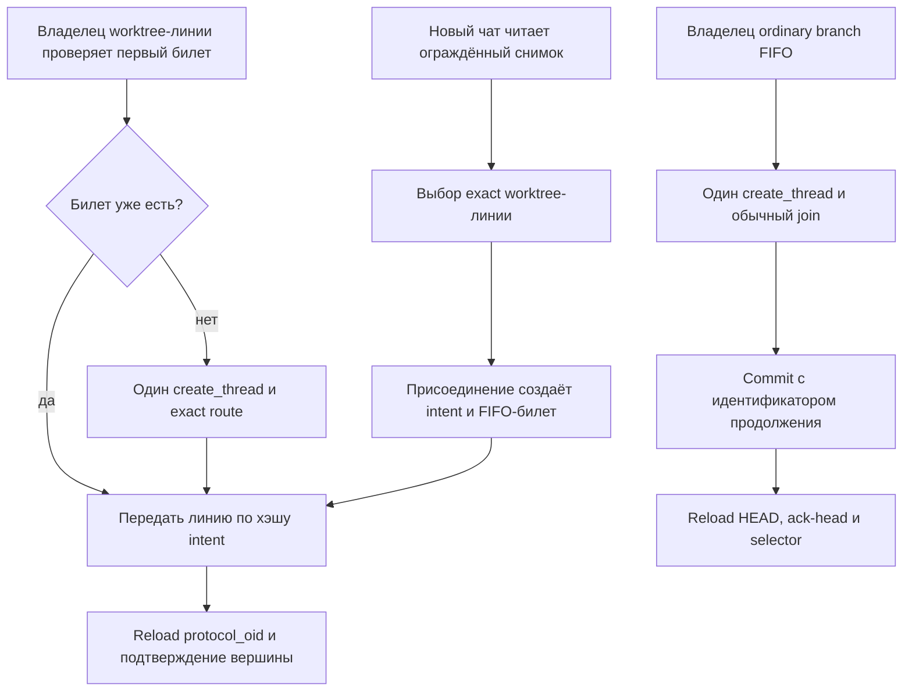

# Obyazateljnoye prodolzheniye Git-vetki posle kommita

## Status kontura

Opisannyij nizhe FIFO/pool-konvejyer sokhranyon kak istoricheski realizovannaya i otlozhennaya arkhitektura. On ne yavlyayetsya dejstvuyusjhim marshrutom repozitoriya posle perekhoda na ruchnuyu posledovateljnuyu skhemu: kazhduyu pishusjhuyu sessiyu zapuskayet poljzovatelj, ona sozdayot ne boleye odnogo lokaljnogo kommita na `refs/heads/master` i zavershayetsya bez continuation, selector, worktree-pula ili avtomaticheskoj publikacii. Vozvrat etogo kontura potrebuyet otdeljnogo poljzovateljskogo zaprosa i novogo proverennogo perekhoda pravil.

[Obyazateljnoye prodolzheniye vetki](../Glossarij/obyazateljnoye-prodolzheniye-vetki.md) byilo konturom posledovateljnogo razvitiya uzhe vyibrannoj imenovannoj Git-linii. Do obyichnogo promezhutochnogo kommita [rabochej sessii](../Glossarij/rabochaya-sessiya.md) susjhestvoval rovno odin pervyij exact-bilet prodolzheniya togo zhe polnogo ref, fizicheskogo worktree i FIFO. Dlya worktree-linii yego mog zaraneye zaregistrirovatj samostoyateljno otkryityij chat; toljko pri otsutstvii bileta vladelec sozdaval odnu zadachu-prodolzheniye. Dlya obyichnoj branch FIFO, vklyuchaya `master`, vladelec vsegda zaraneye sozdaval otdeljnuyu zadachu. Terminaljnyiye commits rezuljtata pisatelya, revjyu i integracionnogo kandidata lokaljnogo pula zavershali otdeljnyiye naznacheniya sobstvennyimi kvitanciyami i obyazateljnogo prodolzheniya ne sozdavali.

Etot kontur zamenyal planovyij avtozapusk vnutri posledovateljnoj linii. Dlya yeyo dvizheniya ne trebovalisj raspisaniye, heartbeat, postoyannaya prikreplyonnaya zadacha, obsjhij dispetcher, reyestr periodicheskikh zadanij, dispetcherskiye rezervacii ili vosstanoviteljnyij tik. Istochnikom sleduyusjhego zapuska sluzhila predshestvuyusjhaya sessiya, dejstviteljno doshedshaya do obyichnogo kommita linii. Chisto zavershivshayasya sessiya i terminaljnoye naznacheniye pula novuyu zadachu-prodolzheniye ne sozdavali.

## Marshrutizaciya novoj zadachi

Obyichnyij novyij chat Codex nachinayet v pervichnom checkout s doverennogo read-only-marshruta po aktualjnomu planu i neizmenyayemyim kvitanciyam aktivnyikh linij. Marshrutizator ne vyidayot pishusjheye polnomochiye po imeni chata, cwd, pokhozhemu ref, odnomu `HEAD` ili svobodnomu tekstu. On razlichayet chetyire zakryityikh klassa:

- read-only-zadacha ne rezerviruyet pisateljskij slot;
- nezavisimyij pisatelj lenivo rezerviruyet, pereispoljzuyet libo materializuyet `Подузлы/слот-NNNN` s novyim polnyim ref;
- exact-prodolzheniye vyibirayet odnu worktree-liniyu iz ograzhdyonnogo snimka, posle chego atomarnoye prisoyedineniye sozdayot intent, kvitanciyu i FIFO-bilet tekh zhe ref i worktree bez vtorogo checkout; zaraneye sozdannaya vladeljcem zadacha predyyavlyayet ekvivalentnuyu uzhe zakreplyonnuyu svyazj;
- recenzent i integrator poluchayut toljko otdeljnyiye naznacheniya, zakreplyayusjhiye tochnyiye proveryayemyiye obyyektyi.

`refs/heads/master` yavlyayetsya yavnyim isklyucheniyem razmesjheniya: yego sozdannoye vladeljcem dokazannoye prodolzheniye ostayotsya v pervichnom checkout i ispoljzuyet obyichnuyu branch FIFO. Nezavisimyij pisatelj, lishj otkryityij iz etogo kataloga, poluchayet otdeljnyiye ref i slot. Posle registracii prodolzheniya otsutstvuyusjhaya, ispoljzovannaya, stale libo nesovpavshaya kvitanciya zakryivayet marshrut bez rezervnogo nezavisimogo vyideleniya.

## Identichnostj prodolzheniya

Prodolzheniye svyazyivayetsya s identichnostjyu imenovannoj linii, polnyim lokaljnyim ref vida `refs/heads/...`, fizicheskim worktree, yego FIFO, roditeljskimi task i generation i tochnyim `CODEX_THREAD_ID`. Korotkoye imya vetki, pokhozhij ref, remote-vetka ili toljko tekusjhij `HEAD` ne zamenyayut etu sovokupnostj. Samostoyateljno otkryityij chat worktree-linii sozdayot intent i bilet svoim ograzhdyonnyim vyiborom iz aktualjnogo snimka. `create_thread` v tom zhe sokhranyonnom proyekte ispoljzuyetsya, kogda vladeljcu worktree-linii ne khvatayet pervogo bileta, i vsegda ispoljzuyetsya pered promezhutochnyim kommitom obyichnoj branch FIFO; toljko dlya sozdannoj host-zadachi kvitanciya dopolniteljno zakreplyayet podtverzhdyonnyij `hostId`. Lyubaya novaya host-zadacha nachinayet iz pervichnogo kataloga, a exact route posledovateljno napravlyayet worktree-prodolzheniye v uzhe susjhestvuyusjhij slot bez vtorogo checkout.

Odnovremenno aktivnyiye pisatelj, nezavisimyij recenzent i integrator zanimayut raznyiye slotyi. Checkout, indeksyi, polnyiye rabochiye refs i ocheredi etikh slotov razlichayutsya; object database, Git common-dir i refs obsjhiye i obrazuyut doverennuyu kooperativnuyu granicu. Poetomu identichnostj prodolzheniya dokazyivayet posledovateljnoye vladeniye svoim checkout i ref, no ne prevrasjhayet linked worktree v otdeljnyij repozitorij.

Prompt sozdannogo vladeljcem prodolzheniya zakreplyayet khyesh kvitancii, polnyij ref i otnositeljnyiye k proyektu vkhodyi, no ne perenosit absolyutnyiye puti fajlovoj sistemyi. Samostoyateljno otkryityij chat ne poluchayet roditeljskij prompt kak polnomochiye: yego svyazyivayut toljko svezhij snimok marshruta i atomarno sozdannyij intent. Ni odin putj ne vyidayot pravo zapisi zaraneye. Yedinstvennyim avtoritetnyim dopuskom ostayotsya FIFO fizicheskogo checkout linii, a identichnostjyu zadachi — yeyo fakticheskij `CODEX_THREAD_ID`, sovpadayusjhij s zakreplyonnyim `threadId`.

Udalyonnaya vetka i `push` v identichnostj prodolzheniya ne vkhodyat. Lokaljnoye prodolzheniye mozhet nachatjsya posle peredachi lokaljnogo kommita, ne ozhidaya publikacii. Posle terminalizacii naznacheniya worktree-pula tochnyij rezuljtiruyusjhij commit zamorazhivayetsya pod ustojchivyim lokaljnyim result-ref; lishj togda chistyij slot bez vladeljca, ozhidayusjhikh biletov i pozdnikh pisatelej mozhno vernutj v pul do revjyu.

Avtomaticheskaya publikaciya result-ref yavlyayetsya otdeljnyim posleduyusjhim transportom: posle proverki publikacionnoj chistotyi ref otpravlyayetsya bez force v nastroyennyij remote togo zhe repozitoriya i podtverzhdayetsya tochnyim readback. Oshibka seti ili autentifikacii sokhranyayet lokaljnyij ref i `publication_pending`. Etot transport ne prodolzhayet vetochnuyu FIFO, ne sozdayot GitHub fork ili pull request i ne razreshayet remote `master` do prinyatoj integracii i obyazateljnogo povtornogo nezavisimogo revjyu.

## Perekhod mezhdu sessiyami

Perekhod stroitsya do sozdaniya obyyekta kommita i sokhranyayet odnogo vladeljca zapisi na vsyom puti, no worktree-liniya i obyichnaya branch FIFO ispoljzuyut raznyiye mashinnyiye komandyi:

V worktree-profile samostoyateljno otkryityij chat vyibirayet exact aktivnuyu liniyu iz svezhego snimka i vyizyivayet `присоединиться-к-линии`: odna ograzhdyonnaya tranzakciya sozdayot continuation-intent i vozrastayusjhij FIFO-bilet tekh zhe slota, ref i worktree. Yesli k momentu gotovnosti promezhutochnogo kommita takogo pervogo bileta net, vladelec sozdayot rovno odnu zadachu i poluchayet ot neyo ekvivalentnuyu svyazj; susjhestvuyusjhij bilet zapresjhayet sozdavatj zamenu. Do handoff prodolzheniye ostayotsya ozhidayusjhim i ne menyayet checkout, indeks, refs ili vneshneye sostoyaniye.

Vladelec worktree-linii vyizyivayet `передать-линию` s exact khyeshem intent. Odna CAS-tranzakciya sveryayet assignment, pokoleniye, iskhodnuyu vershinu, polnyij ref i pervyij bilet, sozdayot pryamoj kommit, dvigayet toljko ref linii, peredayot yeyo FIFO i obnovlyayet sostoyaniye pula. Novyij vladelec poluchayet `reload_required`, perechityivayet pravila iz zakreplyonnogo doverennogo `protocol_oid`, sveryayet fakticheskiye ref, vershinu i `worktree_id`, vyizyivayet `подтвердить-вершину-линии` i lishj posle `admitted` prodolzhayet to zhe naznacheniye. Tekusjhij result libo integration candidate ne stanovitsya istochnikom protokola.

V ordinary branch FIFO, vklyuchaya `master`, vladelec do kommita vsegda rovno odin raz vyizyivayet `create_thread`. Uspeshnyim podtverzhdeniyem schitayutsya toljko nepustyiye tochnyiye `threadId` i `hostId`; predvariteljnyij `clientThreadId`, chastichnyij otvet ili kosvennyij vyivod ob uspekhe ne podkhodyat. Sozdannaya zadacha safe HEAD-bootstrap-komandoj registriruyet obyichnyij `join` i zhdyot. Komanda `commit --идентификатор-продолжения <threadId>` povtorno proveryayet vladeljca, pokoleniye, iskhodnyij `HEAD`, polnyij ref, indeks i tochnyij bilet, a odnoj Git-tranzakciyej obnovlyayet vetku, peredayot branch-scoped FIFO i sozdayot neizmenyayemuyu kvitanciyu svyazi.

Kogda ordinary-bilet dostigayet golovyi, prodolzheniye perechityivayet fakticheskiye `HEAD`, `AGENTS.md`, kontrakt ocheredi i zatronutyiye materialyi, vyipolnyayet `ack-head` i poluchayet pravo zapisi toljko posle novogo `admitted`. Zatem ono povtoryayet ozhidayusjhiye publikacii i zanovo vyizyivayet vetochnyij selektor. Boleye ranniye biletyi mogli zakonno prodvinutj ref yesjhyo raz; staryij prompt soobsjhayet identichnostj linii, no ne zakreplyayet ustarevshij soderzhateljnyij snimok. V oboikh profilyakh FIFO ne dopuskayet obkhoda boleye rannej zadachi, a posle uspeshnogo handoff prezhnij vladelec boljshe ne vyipolnyayet mutacij.

## Linejnoye prodolzheniye i dvoichnaya razvilka

Obyazateljnoye prodolzheniye yavlyayetsya unarnyim rebrom vnutri odnoj posledovateljnoj imenovannoj linii [vetvevogo fork FUM](../Glossarij/vetvevoj-fork-FUM.md): odin yeyo podtverzhdyonnyij obyichnyij kommit svyazyivayetsya rovno s odnoj sleduyusjhej zadachej togo zhe worktree i polnogo ref. Ono ne sozdayot novuyu vetku, ne menyayet logicheskuyu identichnostj fork i ne mozhet byitj zameneno dvumya prodolzheniyami radi razvetvleniya. Terminaljnyiye result-, review- i integration-commits prinadlezhat drugim naznacheniyam i etim rebrom ne schitayutsya.

Dvoichnaya razvilka yavlyayetsya celevoj, yesjhyo ne realizovannoj arkhitekturoj FUM-REQ-0043 i otdeljnyim ograzhdyonnyim perekhodom nad uzhe zafiksirovannoj vershinoj. Yesli pered nej trebovalsya soderzhateljnyij kommit, unarnoye prodolzheniye snachala prinimayet yego cherez atomarnyij handoff svoyego runtime-profilya; zatem koordinator ne menyayet roditeljskij rabochij ref, sokhranyayet sagu v ref sostoyaniya moderacii i posle aktivacii detej zavershayet roditeljskoye FIFO cherez `finish-clean`.

Perekhod sozdayot pasport roditelya i dvukh detej, raznyiye rabochiye refs i checkout i dve nachaljnyiye host-zadachi bez prava zapisi. Deti registriruyutsya v globaljnom predaktivacionnom sostoyanii, kotoroye sama ocheredj proveryayet do vkhoda v FIFO novoj vetki; oni aktiviruyutsya toljko yedinyim CAS-perekhodom posle podtverzhdeniya obeikh privyazok. Mezhdu dvumya host-vyizovami i neskoljkimi repozitoriyami net obsjhej Git-tranzakcii, poetomu chastichnyij ili neodnoznachnyij iskhod ne razreshayet povtor po dogadke. Saga prodolzhayetsya toljko ot sokhranyonnoj dokazannoj granicyi posredstvom avtoritetnogo chteniya prezhnej popyitki libo yavnogo chelovecheskogo vosstanovleniya.

Posle aktivacii prezhnyaya roditeljskaya host-sessiya osvobozhdayet vladeniye, a tot zhe roditeljskij logicheskij uzel sokhranyayetsya kak vosstanavlivayemyij moderator, ne porozhdaya tretjyego fork. Kazhdyij rebyonok s etogo momenta snova primenyayet obyichnoye obyazateljnoye prodolzheniye na svoyej yedinstvennoj rabochej vetke. Ozhidayusjhaya zadacha-prodolzheniye ne schitayetsya vtoroj aktivnoj sessiyej: aktivnyim yavlyayetsya toljko dopusjhennyij pishusjhij vladelec, togda kak neaktivnyiye i vneshniye proveryayusjhiye zadachi bez prava zapisi vladeljcami vetvevogo fork ne yavlyayutsya.

## Vyibor rabotyi v prodolzhenii

Posle dopuska prodolzheniye ordinary branch FIFO napryamuyu chitayet rabochij nabor [sleduyusjhego shaga vetki](../Glossarij/sleduyusjhij-shag-vetki.md). Mezhdu nim i selektorom net planovogo posrednika, obsjhego zadaniya, rezervacii ili heartbeat. Selektor vyichislyayet sostoyaniye na novom `HEAD` i dayot odin iz tryokh iskhodov:

- `ready` — sessiya prinimayet odnu gotovuyu kartochku, ispolnyayet yeyo polnyij proverochnyij kontur i pri sobstvennom kommite povtoryayet tot zhe protokol prodolzheniya;
- `done` — vetochnaya cepochka zavershena, sessiya vyipolnyayet `finish-clean` i ne sozdayot rebyonka;
- `not_ready` — sejchas net dopustimoj kartochki, sessiya vyipolnyayet `finish-clean`, a cepochka ostanavlivayetsya do novogo yavnogo zapuska ili izmeneniya uslovij.

Takim obrazom, ordinary-kommit obrazuyet sleduyusjhij uzel vetochnoj cepochki, a chistoye zaversheniye yavlyayetsya yeyo yavnoj terminaljnoj granicej. Prodolzheniye ne obyazano sozdavatj pustoj kommit radi podderzhaniya cepochki. Worktree-prodolzheniye vmesto selektora vozvrasjhayetsya k exact naznacheniyu svoyej `self_line` posle dopuska po `protocol_oid`; yego polnomochiya ne vyivodyatsya iz rabochego nabora osnovnoj vetki.

## Zakryitoye povedeniye pri sboyakh

Stroki o `create_thread` otnosyatsya k sluchayu, kogda vladelec dejstviteljno sozdayot prodolzheniye: vsegda dlya ordinary branch FIFO i toljko pri otsutstvii pervogo bileta dlya worktree-linii. Poteryannyij otvet `присоединиться-к-линии` vosstanavlivayetsya po exact `task_id` iz Git-sostoyaniya prezhnikh intent i FIFO, a ne novyim biletom.

| Nablyudeniye                                                                 | Rezuljtat                                                                                                                                        |
| -------------------------------------------------------------------------- | ------------------------------------------------------------------------------------------------------------------------------------------------ |
| `create_thread` vernul oshibku do tochnogo podtverzhdeniya                     | Roditelj ne kommitit; prodolzheniye ne schitayetsya sozdannyim.                                                                                        |
| Otvet sozdaniya poteryan, istyok po tajm-autu, nepolon ili neodnoznachen       | Roditelj ne kommitit i avtomaticheski ne povtoryayet sozdaniye, potomu chto pervaya zadacha mogla fakticheski poyavitjsya.                                 |
| Tochnyiye `threadId` i `hostId` poluchenyi, no ozhidayusjhij bilet yesjhyo ne obnaruzhen | Roditelj sokhranyayet vladeniye i zhdyot togo zhe rebyonka; zamenyayusjhaya zadacha ne sozdayotsya.                                                              |
| Bilet otnositsya k drugoj zadache, ocheredi, rabochej kopii ili vetke          | Commit+handoff zakryivayetsya otkazom do sozdaniya kommita.                                                                                          |
| `HEAD`, ref, pokoleniye, indeks ili ocheredj izmenilisj                      | Git-perekhod zakryivayetsya otkazom; prezhnyaya svyazj ne perenositsya na novyij snimok po dogadke.                                                        |
| Sozdaniye podtverzhdeno, no commit+handoff ne sostoyalsya                      | Rebyonok ostayotsya ozhidayusjhim za roditelem; roditelj ispravlyayet prichinu i ne sozdayot yesjhyo odnogo prodolzheniya dlya toj zhe popyitki.                     |
| Rebyonok perestal ispolnyatjsya posle uspeshnoj peredachi                       | Ocheredj bezopasno ostanavlivayetsya na nyom do vozobnovleniya toj zhe zadachi libo otdeljnogo yavno razreshyonnogo vosstanovleniya; tajmer yego ne obkhodit. |

Avtomaticheskij povtor dopustim dlya idempotentnogo vyiyasneniya iskhoda uzhe nachatyikh prisoyedineniya, handoff i drugikh Git-perekhodov, no ne dlya neodnoznachnogo host-vyizova sozdaniya zadachi. Eta asimmetriya sokhranyayet bezopasnostj na granice, gde Git-tranzakciya ne mozhet atomarno okhvatitj Codex-host.

## Garantii i granicyi zhivuchesti

Kontur dayot proveryayemuyu lokaljnuyu garantiyu: kazhdyij podtverzhdyonnyij obyichnyij kommit posledovateljnoj imenovannoj linii svyazan s odnim tochnyim uzhe zaregistrirovannyim prodolzheniyem i yego ozhidayusjhim biletom v tekh zhe FIFO, worktree i ref. Identifikator svyazi i kvitanciya prodolzheniya khranyatsya v rezuljtate ocheredi i neizmenyayemoj Git-kvitancii, poetomu tochnyij povtor handoff-komandyi svoyego profilya ne naznachayet kommitu drugogo rebyonka i vosstanavlivayet prezhnij rezuljtat dazhe posle boleye pozdnej peredachi FIFO. Eta garantiya namerenno ne otnositsya k terminaljnyim commits rezuljtata, revjyu i integracionnogo kandidata.

Dlya puti, na kotorom trebovalsya `create_thread`, eta garantiya ne yavlyayetsya tranzakcionnyim exactly-once host-vyizova. Host i Git prinadlezhat raznyim sistemam. Yesli host uspel sozdatj zadachu, no otvet poteryan, neizvestnaya zadacha mozhet susjhestvovatj, odnako roditelj ne sozdayot dublj i ne kommitit. Yesli Git-perekhod ne sostoyalsya posle podtverzhdyonnogo sozdaniya, izvestnyij rebyonok ostayotsya zablokirovannyim za roditelem. Kontur vyibirayet bezopasnuyu ostanovku vmesto obesjhaniya bezuslovnogo progressa.

Zhivuchestj takzhe ne garantiruyetsya odnoj strukturoj protokola. Ona zavisit ot dostupnosti Codex-host, fakticheskikh doverennogo marshruta i komandyi vkhoda sootvetstvuyusjhego profilya, vozobnovlyayemosti zadachi, celostnosti worktree i — dlya ordinary branch FIFO — nalichiya gotovoj kartochki. Net fonovogo nablyudatelya, kotoryij obnaruzhit molchalivuyu ostanovku, povtorit host-vyizov, snimet vladeljca ili obojdyot bilet. Ruchnoye vosstanovleniye ne vyivoditsya iz fakta ostanovki i trebuyet sobstvennogo yavnogo polnomochiya i ograzhdeniya.

Dokumentarnyij i etalonnyij prototip mashinno zakreplyayet exact slot `repo-root`, ref i `HEAD` dlya soderzhateljnyikh komand. Codex Desktop poka ne predostavlyayet protokolu perenos workspace na urovne host s otdeljnyim mashinnyim ACK. Poetomu etot rezuljtat ne yavlyayetsya nativnoj izolyaciyej host, ne dokazyivayet otsutstviye chtenij pervichnogo checkout i do poyavleniya takogo ACK dopolniteljno zavisit ot soblyudeniya agentom sformirovannogo workdir-marshruta. Linked worktree takzhe razdelyayut object database, refs i Git common-dir i ne stanovyatsya otdeljnyimi klonami.

Dlya neskoljkikh linij kazhdaya cepochka svyazyivayetsya so svoimi polnyim ref, fizicheskim worktree i FIFO. Kommit odnoj linii ne sozdayot pravo prodolzhatj druguyu, a sokhranyonnyij proyekt sam po sebe ne dokazyivayet prinadlezhnostj. Nezavisimyiye sovmestimyiye pisateli mogut rabotatj paralleljno v raznyikh slotakh; FIFO serializuyet toljko sessii odnoj linii i ne razreshayet pereuporyadochivatj yeyo biletyi radi uskoreniya.

Prodolzheniye vetki ne predostavlyayet polnomochij na publikaciyu. Uzkij transport result-ref worktree-pula poluchayet sobstvennoye zaraneye zakreplyonnoye polnomochiye toljko posle terminalizacii linii i proverki publikacionnoj chistotyi; on ne rasshiryayet prava prodolzheniya. Vozmozhnyij otdeljnyij periodicheskij transport dlya drugikh refs i repozitoriyev ostayotsya predmetom [voprosa o granicakh publikacii vetki](../Voprosyi/2026-07-27_15-21-35_MSK_granicyi-periodicheskoj-publikacii-vetki.md).

## Snyatyij kontur avtozapuska

[Dispetcher avtomatizacij FUM](../Glossarij/dispetcher-avtomatizacij-FUM.md) sokhranyon toljko kak istoricheskij termin. Yego heartbeat, prikreplyonnaya upravlyayusjhaya zadacha, reyestrovyiye zadaniya, rezervirovaniye, analitika zavershenij, ograzhdyonnoye avtomaticheskoye vozobnovleniye i vosstanovleniye po sleduyusjhemu tiku boljshe ne yavlyayutsya dejstvuyusjhim putyom zapuska. Ikh artefaktyi mogut ostavatjsya v istorii i sovmestimom lokaljnom kode dlya proiskhozhdeniya ili bezopasnoj migracii, no ne dayut runtime-polnomochij i ne konkuriruyut s obyazateljnyim prodolzheniyem vetki.

Predyidusjhij kontur sokhranyal dve oporyi prezhnej infrastrukturyi: FIFO-serializaciyu zapisi i vetochnyij selector. Posle `manual-sequential-v1` oni ne vyizyivayutsya obyichnoj rabochej sessiyej i ostayutsya istoricheskoj libo otlozhennoj narabotkoj.

## Opornyiye materialyi

- [Vetvevoj fork FUM](../Glossarij/vetvevoj-fork-FUM.md)
- [Kontrakt FIFO-ocheredi zadach Git-vetki](../Instrumentyi/fum-ocheredj-zadach-git-vetki/SKILL.md)
- [Kontrakt sleduyusjhego shaga vetki](../Instrumentyi/fum-sleduyusjhij-shag-vetki/SKILL.md)
- [Rabochaya sessiya](../Glossarij/rabochaya-sessiya.md)
- [Sleduyusjhij shag vetki](../Glossarij/sleduyusjhij-shag-vetki.md)

## Istochniki trebovanij

- [iskhodnyij zapros 2026-08-23 11:33:38 MSK — Vernutj ruchnuyu posledovateljnuyu skhemu sessij](../Zhurnal/2026-08-23_11-33-38_MSK_vernutj-ruchnuyu-posledovateljnuyu-skhemu-sessij/zapros.md)

- [iskhodnyij zapros 2026-08-13 18:17:47 MSK — Organizovatj paralleljnyiye sessii v lokaljnyikh worktree-poduzlakh](../Zhurnal/2026-08-13_18-17-47_MSK_organizovatj-paralleljnyiye-sessii-v-izolirovannyikh-fork-poduzlakh/zapros.md)
- [iskhodnyij zapros 2026-08-12 03:09:35 MSK — Smodelirovatj vetvleniye FUM derevom forkov](../Zhurnal/2026-08-12_03-09-35_MSK_smodelirovatj-vetvleniye-FUM-derevom-forkov/zapros.md)
- [iskhodnyij zapros 2026-08-11 23:30:57 MSK — Zamenitj avtozapusk obyazateljnyim prodolzheniyem vetki](../Zhurnal/2026-08-11_23-30-57_MSK_zamenitj-avtozapusk-obyazateljnyim-prodolzheniyem-vetki/zapros.md)
- [iskhodnyij zapros 2026-07-20 20:06:04 MSK — Zapuskatj sleduyusjhiye shagi vetok](../Zhurnal/2026-07-20_20-06-04_MSK_zapuskatj-sleduyusjhiye-shagi-vetok/zapros.md)

<!-- FUM-MD-RECENCY:BEGIN -->
<!-- last-content-edit: 2026-08-23 15:47:26 MSK -->
<!-- content-sha256: sha256:4d112e60eb92e4dbb933d5a42c3d62e64ccca689b33824e671030c19a4103b4c -->
<!-- FUM-MD-RECENCY:END -->
