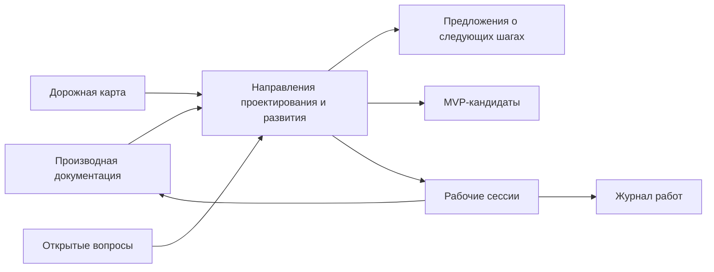

# Napravleniya proyektirovaniya i razvitiya FUM

## Naznacheniye

Etot katalog khranit [napravleniya proyektirovaniya i razvitiya FUM](../../Glossarij/napravleniye-proyektirovaniya-i-razvitiya-FUM.md) - skvoznyiye planovyiye osi mezhdu [arkhitekturoj FUM](../../Glossarij/arkhitektura-FUM.md), [dorozhnoj kartoj](../dorozhnaya-karta.md), [MVP-kandidatami](../../Glossarij/MVP-kandidat.md), [predlozheniyami o sleduyusjhikh shagakh](../../Glossarij/predlozheniye-o-sleduyusjhem-shage.md) i budusjhimi rabochimi sessiyami.

Dorozhnaya karta pokazyivayet posledovateljnostj gorizontov. MVP-kandidatyi pokazyivayut vozmozhnyiye startovyiye produktyi. Napravleniya pokazyivayut, kakiye inzhenernyiye i issledovateljskiye oblasti nuzhno razvivatj paralleljno, chtobyi blizhniye rabotyi ne teryali svyazj s daljnej celjyu [FUM](../../Glossarij/FUM.md) kak otkryitogo agenta sleduyusjhego pokoleniya.

## Kak chitatj napravleniya

Kazhdoye napravleniye otvechayet na pyatj voprosov:

- zachem etot sloj nuzhen v proyektirovanii [FUM](../../Glossarij/FUM.md);
- na kakiye dokumentyi, terminyi, voprosyi i planovyiye materialyi on opirayetsya;
- kakiye proyektnyiye voprosyi neljzya poteryatj pri razvitii sloya;
- kakoj odin blizhajshij proveryayemyij artefakt dolzhen dvigatj napravleniye vperyod;
- kakiye granicyi zasjhisjhayut [pamyatj FUM](../../Glossarij/pamyatj-FUM.md) ot prezhdevremennyikh ili neproveryayemyikh reshenij.

Napravleniya ne yavlyayutsya samostoyateljnyim istochnikom trebovanij. Yesli iz napravleniya voznikayet novoye trebovaniye, ono prokhodit obyichnuyu cepochku: [iskhodnyij zapros](../../Glossarij/iskhodnyij-zapros.md) -> [proizvodnaya dokumentaciya](../../Glossarij/proizvodnaya-dokumentaciya.md) -> proverka -> kommit.

## Karta napravlenij i blizhajshikh artefaktov

| Napravleniye                                                                          | Smyisl                                                                                                                                                        | Blizhajshij proveryayemyij artefakt                                                                                                                                                                | Proverka                                                                                                                           |
| ------------------------------------------------------------------------------------ | ------------------------------------------------------------------------------------------------------------------------------------------------------------ | --------------------------------------------------------------------------------------------------------------------------------------------------------------------------------------------- | ---------------------------------------------------------------------------------------------------------------------------------- |
| [01. Pamyatj i proiskhozhdeniye](01-pamyatj-i-proiskhozhdeniye.md)                           | Sokhranyatj vkhodyi, istochniki, resheniya, proverki, instrumentyi, zhurnal i svyazi trebovanij kak proveryayemuyu [pamyatj FUM](../../Glossarij/pamyatj-FUM.md).           | Pasport dokumentacionnogo prototipa i pervogo vertikaljnogo korobochnogo sreza s yavnyim otdeleniyem prinyatogo lokaljnogo arkhivatora ot proyektiruyemogo servisa.                                   | Pervyij poljzovatelj, scenarij, vkhodyi, vyikhodyi, trassa, otkazyi, prava, privatnostj i avtonomnaya priyomka zadanyi bez nachala stadii 02. |
| [02. Avtomatizacii i yazyik](02-avtomatizacii-i-yazyik.md)                               | Prevrasjhatj povtoryayemyiye dejstviya v lokaljno vosproizvodimyiye [avtomatizacii FUM](../../Glossarij/avtomatizaciya-FUM.md) i postepenno vyidelyatj yazyik ikh opisaniya. | Yedinyij lokaljnyij smoke-check repozitoriya, kotoryij zapuskayet testyi lokaljnyikh avtomatizacij i proverku svyaznosti vyibrannoj rabochej sessii.                                                      | Komanda rabotayet bez seti i sekretov, vyivodit spisok zapusjhennyikh proverok i padayet pri sboye lyuboj obyazateljnoj proverki.            |
| [03. Agentskij cikl i ispolnyayemyij kontur](03-agentskij-cikl-i-ispolnyayemyij-kontur.md) | Sobratj minimaljnyij ispolnyayemyij cikl nablyudeniya, resheniya, dejstviya, proverki i obnovleniya pamyati.                                                            | Specifikaciya minimaljnoj trassyi [agentskogo cikla](../../Glossarij/agentskij-cikl.md): nablyudeniye, zadacha, dejstviye, proverka, rezuljtat i status prodolzheniya.                                | Lokaljnaya fikstura zapolnyayet obyazateljnyiye polya trassyi i ne trebuyet raskryitiya skryityikh rassuzhdenij modeli.                           |
| [04. Modeljnaya sreda i planirovaniye](04-modeljnaya-sreda-i-planirovaniye.md)           | Razdelyatj faktyi, rekonstrukcii proshlogo, planyi budusjhego i vnutrenniye modeli uzlov.                                                                           | Shablon scenariya [modeljnoj sredyi](../../Glossarij/modeljnaya-sreda.md) s vremennyim rezhimom, statusom utverzhdenij, uverennostjyu, istochnikami i ssyilkami na voprosyi.                             | Odin primer scenariya razlichayet fakt, rekonstrukciyu i plan, a zavisimaya razvilka ssyilayetsya na fajl v `Вопросы/`.                    |
| [05. Interfejs i servisnyiye adapteryi](05-interfejs-i-servisnyiye-adapteryi.md)           | Delatj [FUM](../../Glossarij/FUM.md) yedinoj tochkoj rabotyi cheloveka s instrumentami, servisami i podtverzhdyonnyimi dejstviyami.                                  | Pasport lokaljnogo servisnogo adaptera dlya proverki svyaznosti rabochej sessii: namereniye, vkhodyi, vyikhodyi, podtverzhdeniye, oshibki, dostup i sokhraneniye rezuljtata.                                | Testovyij poljzovateljskij scenarij prokhodit cepochku namereniye -> podtverzhdeniye -> zapusk proverki -> sokhranyonnyij rezuljtat.        |
| [06. Evolyucionnyiye cepochki i otbor](06-evolyucionnyiye-cepochki-i-otbor.md)               | Ispoljzovatj vetki, proverki, revjyu, peredachu rezuljtatov i reyestr proiskhozhdeniya kak nositelj otbora.                                                        | Minimaljnyij pasport [peredavayemogo rezuljtata FUM](../../Glossarij/peredavayemyij-rezuljtat-FUM.md): istochniki, proverka, stoimostj, uverennostj, adresatyi i status peredachi.                   | Zapolnennyij primer svyazyivayet odin rezuljtat s zaprosom, proverkami, izmenyonnyimi fajlami i kommitom.                                |
| [07. Issledovaniya i otkryitiya](07-issledovaniya-i-otkryitiya.md)                         | Delatj gipotezyi, eksperimentyi, otricateljnyiye rezuljtatyi i otkryitiya normaljnoj chastjyu proyekta.                                                                | Shablon kartochki [eksperimenta FUM](../../Glossarij/eksperiment-FUM.md): vopros, gipoteza, metod, dannyiye, sreda, rezuljtat, ogranicheniya, status i sleduyusjhij shag.                               | Odin lokaljnyij primer eksperimenta mozhno povtoritj ili prochitatj s yavnoj granicej nevosproizvodimoj chasti.                         |
| [08. Fizicheskiye i daljniye konturyi](08-fizicheskiye-i-daljniye-konturyi.md)               | Uderzhivatj fizicheskoye dejstviye, apparatnyiye uzlyi i kosmicheskuyu avtonomiyu kak daljnij, ogranichennyij proverkami gorizont.                                       | [Karta ogranichitelej fizicheskogo dejstviya FUM](../../Dokumentaciya/40-karta-ogranichitelej-fizicheskogo-dejstviya-FUM.md): risk, dostup, otvetstvennostj, simulyator, kontrakt i otkryityiye voprosyi. | Karta ssyilayetsya na voprosyi o granicakh avtonomii i yavno zapresjhayet perekhod k realjnomu dejstviyu bez otdeljnogo trebovaniya.           |

## Skhema svyazi

## Pravila obnovleniya

- Novoye napravleniye dobavlyayetsya otdeljnyim Markdown-fajlom s istochnikom trebovaniya, opornyimi materialami, naznacheniyem, proyektnyimi voprosami, odnim blizhajshim proveryayemyim artefaktom i granicami.
- Yesli napravleniye menyayet arkhitekturnuyu kartu [FUM](../../Glossarij/FUM.md), obnovlyayetsya [Arkhitektura FUM](../../Dokumentaciya/22-arkhitektura-FUM.md) ili sootvetstvuyusjhij detaljnyij dokument.
- Yesli napravleniye vyiyavlyayet neyasnostj trebovanij, sozdayotsya ili obnovlyayetsya [otkryityij vopros](../../Glossarij/otkryityij-vopros.md) v `Вопросы/`.
- Yesli po napravleniyu poyavlyayetsya prakticheskoye prodolzheniye, ono dobavlyayetsya otdeljnoj [kartochkoj shaga](../kartochki-shagov/README.md), no ne schitayetsya trebovaniyem do otdeljnogo zaprosa.

## Istochniki trebovanij

- [iskhodnyij zapros 2026-06-25 17:59:02 MSK](../../Zhurnal/2026-06-25_17-59-02_MSK/zapros.md)
- [iskhodnyij zapros 2026-06-25 18:17:22 MSK](../../Zhurnal/2026-06-25_18-17-22_MSK/zapros.md)
- [iskhodnyij zapros 2026-07-21 10:36:18 MSK - Zavershitj skvoznuyu priyomku arkhivatora istochnikov](../../Zhurnal/2026-07-21_10-36-18_MSK_zavershitj-skvoznuyu-priyomku-arkhivatora-istochnikov/zapros.md)
- [iskhodnyij zapros 2026-07-21 11:32:46 MSK - Aktualizirovatj vkhodnyiye opisaniya FUM](../../Zhurnal/2026-07-21_11-32-46_MSK_aktualizirovatj-vkhodnyiye-opisaniya-FUM/zapros.md)
- [iskhodnyij zapros 2026-07-22 02:59:22 MSK - Dekompozirovatj predlozheniya na kartochki shagov](../../Zhurnal/2026-07-22_02-59-22_MSK_dekompozirovatj-predlozheniya-na-kartochki-shagov/zapros.md)

## Opornyiye materialyi

- [Dorozhnaya karta FUM](../dorozhnaya-karta.md)
- [Arkhitektura FUM](../../Dokumentaciya/22-arkhitektura-FUM.md)
- [Obzor proyekta FUM](../../Dokumentaciya/00-obzor-proyekta.md)
- [MVP-kandidatyi FUM](../MVP-kandidatyi/README.md)
- [Kartochki shagov FUM](../kartochki-shagov/README.md)

<!-- FUM-MD-RECENCY:BEGIN -->
<!-- last-content-edit: 2026-08-03 14:54:04 MSK -->
<!-- content-sha256: sha256:ba0bc0640c59905c43aac9bf1ce4a0fb4ef2a7ebe26be20e7a128c22bd95716f -->
<!-- FUM-MD-RECENCY:END -->
