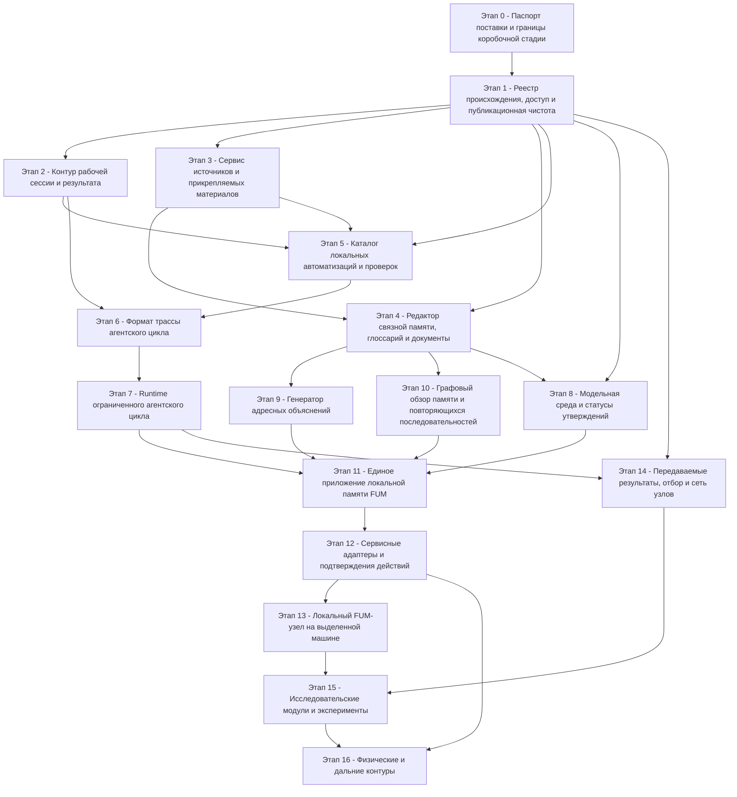

# Graf zavisimostej elementov korobochnoj realizacii FUM

[Korobochnuyu realizaciyu FUM](../../../Glossarij/korobochnaya-realizaciya-FUM.md) nuzhno stroitj ne kak nabor nezavisimyikh funkcij, a kak cepochku sloyov, gde kazhdyij sleduyusjhij element poluchayet proveryayemyiye vkhodyi, trassyi, prava dostupa i kriterii ostanovki ot predyidusjhikh. Poetomu poryadok realizacii zadayotsya ne toljko produktovoj privlekateljnostjyu, no i tem, kakiye elementyi uzhe mogut nadyozhno sokhranyatj proiskhozhdeniye, proverku i rezuljtat.

Prakticheskij vyivod: pervoj dolzhna sozretj ne yedinaya poljzovateljskaya poverkhnostj, a yadro [pamyati FUM](../../../Glossarij/pamyatj-FUM.md), proiskhozhdeniya, istochnikov i lokaljnyikh proverok. Yedinoye prilozheniye stanovitsya khoroshim pervyim korobochnyim produktom toljko posle togo, kak ono smozhet operetjsya na rabochiye servisyi pamyati, istochnikov, avtomatizacij, trass i podtverzhdenij.

Graf pokazyivayet tekusjhuyu luchshuyu gipotezu poryadka, a ne okonchateljnyij prikaz realizacii. Na kazhdom perekhode nuzhno zanovo vyibiratj, kakiye uzhe opisannyiye elementyi dvigatj pervyimi, kakiye derzhatj sleduyusjhimi, kakiye otlozhitj do poyavleniya zavisimostej, a kakiye otbrositj kak ne vyiderzhavshiye proverku cenoj, riskom ili poljzoj. Takoj vyibor sam yavlyayetsya chastjyu [dvukhkonturnogo otbora FUM](../../../Glossarij/dvukhkonturnyij-otbor-FUM.md): vnutrennij plan dolzhen pozdneye proveryatjsya vneshnimi rezuljtatami.

Novaya razvilka kasayetsya etapov trassyi i runtime. Gipersetevoj prototip na Git + Codex mozhet dvigatjsya byistreye kak demonstraciya pamyati, proiskhozhdeniya i otbora; dlya etapov 6–7 uzhe proverenyi strukturnyij [kontrakt chistogo modeljnogo shaga](../../../Dokumentaciya/41-kontrakt-chistogo-modeljnogo-shaga.md) i determinirovannaya zaglushka. Eta vstroyennaya model-only-granica dostatochna dlya pervogo proveryayemogo `P7`, poetomu polnyij `P8` ne yavlyayetsya yego predshestvennikom. Realjnyij LLM-provajder, otmena i tajm-aut vneshnego processa ostayutsya otdeljnyim rasshireniyem, a polnocennaya modeljnaya sreda i statusyi utverzhdenij `P8` obyazanyi sojtisj s runtime do integracionnogo `P11`. Usloviya vyibora ostayutsya v [chastichno proyasnyonnom voprose o razvilke giperseti i agentskogo cikla FUM](../../../Voprosyi/2026-07-03_15-36-48_MSK_razvilka-giperseti-i-agentskogo-cikla-FUM.md).

[Iskhodnyij zapros 2026-07-24 10:44:28 MSK](../../../Zhurnal/2026-07-24_10-44-28_MSK_nachatj-bezokonnyij-Swift-prototip-vosproizvodimogo-popolneniya-pamyati-FUM/zapros.md) razreshil ogranichennyij inzhenernyij putj vne produktovoj interpretacii grafa: nachatj s bezokonnogo Swift-kontura, vosproizvodimo napolnyatj pamyatj shtatnyimi perekhodami i narasjhivatj yego do GUI, vyivedennogo iz vnutrennikh pamyati i ispolneniya. Sozdannyij [SwiftPM-paket](../../../Prototipyi/vosproizvodimoye-popolneniye-pamyati/README.md) podtverzhdayet toljko konechnyij replay malogo sostoyaniya; on ne menyayet ryobra grafa i ne dokazyivayet gotovnostj `P1`, `P7` ili `P11`.

## Graf zavisimostej

## Poryadok realizacii

| Poryadok | Element                                                                | Chto dolzhno byitj gotovo pered nim                                                                                       | Pervyij proveryayemyij rezuljtat                                                                                                                |
| ------- | ---------------------------------------------------------------------- | ---------------------------------------------------------------------------------------------------------------------- | ------------------------------------------------------------------------------------------------------------------------------------------- |
| 0       | Pasport postavki i granicyi korobochnoj stadii                           | Planovaya stadiya korobochnoj realizacii, svodnaya tablica trebovanij, resheniye o granicakh avtonomii.                       | Pasport pervogo reliza: sostav modulej, isklyucheniya, prava dostupa, kriterii priyomki i otkaznyiye rezhimyi.                                      |
| 1       | Reyestr proiskhozhdeniya, dostup i publikacionnaya chistota                  | Pravila [rabochej sessii](../../../Glossarij/rabochaya-sessiya.md), struktura pamyati i Git-istoriya.                        | Yedinyij format zapisi vkhoda, istochnika, dejstviya, proverki, izmenyonnyikh fajlov, versii i rezuljtata.                                          |
| 2       | Kontur rabochej sessii i rezuljtata                                     | Reyestr proiskhozhdeniya i pravila dostupa.                                                                                | Lokaljnyij pomosjhnik sessii, kotoryij sozdayot zapros, zhurnal, spisok instrumentov, proverki i sostav kommita bez ruchnogo vosstanovleniya.       |
| 3       | Servis istochnikov i prikreplyayemyikh materialov                           | Reyestr proiskhozhdeniya, publikacionnaya chistota, struktura `Источники/`.                                                  | Priyom URL ili vlozheniya s kanonicheskoj papkoj istochnika, izvlechyonnyim tekstom, otchyotom i ssyilkoj iz zaprosa.                                  |
| 4       | Redaktor svyaznoj pamyati, glossarij i dokumentyi                         | Kontur rabochej sessii, servis istochnikov, pravila glossariya.                                                           | Predkommitnyij otchyot po terminam, ssyilkam, novyim ponyatiyam, strukture Markdown i publikacionnoj chistote.                                      |
| 5       | Katalog lokaljnyikh avtomatizacij i proverok                             | Kontur sessii, istochniki, svyaznaya dokumentaciya, susjhestvuyusjhiye lokaljnyiye skriptyi.                                        | Versioniruyemyij katalog vozmozhnostej s lokaljnyim zapuskom proverok bez sekretov i setevoj zavisimosti po umolchaniyu.                          |
| 6       | Format trassyi [agentskogo cikla](../../../Glossarij/agentskij-cikl.md) | Kontur rezuljtata i katalog proveryayemyikh dejstvij.                                                                      | Strukturirovannyij format celi, nablyudenij, namerenij, dejstvij, modeljnogo shaga, oshibok, proverok, ostanovki i rezuljtata.                  |
| 7       | Runtime ogranichennogo agentskogo cikla                                 | Format trassyi, katalog avtomatizacij, granicyi dostupa i vstroyennaya determinirovannaya zaglushka chistogo modeljnogo shaga. | Scenarij parkuyet effekt, prodolzhayet dve byudzhetnyiye model-only-vetvi i sokhranyayet trassu; realjnyij provajder ne vkhodit v `P7`.                 |
| 8       | Modeljnaya sreda i statusyi utverzhdenij                                  | Bazovaya pamyatj, proiskhozhdeniye i glossarno-dokumentacionnyij kontur.                                                     | Kontejner, gde faktyi, rekonstrukcii, planyi, gipotezyi i otkryityiye voprosyi razlichayutsya po statusu i istochnikam.                                |
| 9       | Generator adresnyikh obyyasnenij                                          | Svyaznaya pamyatj, statusyi utverzhdenij, istochniki trebovanij i avtomatizaciya peresborki opisanij.                         | Peresobrannoye adresnoye opisaniye s pasportom auditorii, kartoj tezisov, istochnikami i ogranicheniyami obesjhanij.                                |
| 10      | Grafovyij obzor pamyati i povtoryayusjhikhsya posledovateljnostej              | Svyaznaya pamyatj, glossarnyij sloj, indeks povtoryayemostej i statusyi proverki.                                             | Vizualizaciya, kotoraya otdelyayet utverzhdyonnyiye svyazi pamyati ot najdennyikh povtorov, morfologicheskikh gipotez i neproverennyikh sovpadenij.         |
| 11      | Yedinoye prilozheniye lokaljnoj pamyati FUM                                 | Runtime agentskogo cikla, graf pamyati, generator obyyasnenij, katalog avtomatizacij i bazovoye lokaljnoye podtverzhdeniye.  | Poljzovatelj vidit, chto podtverzhdeniye zakryivayet toljko effekt, poka modeljnyiye vetvi prodolzhayutsya, a zatem poluchayet proverennyij rezuljtat.   |
| 12      | Servisnyiye adapteryi i podtverzhdeniya dejstvij                            | Yedinoye prilozheniye, prava dostupa, trassa dejstvij, otkaznyiye rezhimyi i bazovoye lokaljnoye podtverzhdeniye.                  | Pervyij adapter, kotoryij rasshiryayet bazovyij mekhanizm adapter-specifichnyim yavnyim kontraktom vkhodov, vyikhodov, oshibok i zapreta skryityikh effektov. |
| 13      | Lokaljnyij FUM-uzel na vyidelennoj mashine                                | Yedinoye prilozheniye, runtime, proveryayemyiye adapteryi, apparatnyij pasport i fallback.                                       | Lokaljnyij uzel s pamyatjyu, modeljnyim shagom, instrumentami, proverkami, nablyudeniyem i yavnoj trassoj lokaljnogo ili vneshnego ispolneniya.       |
| 14      | Peredavayemyiye rezuljtatyi, otbor i setj uzlov                            | Reyestr proiskhozhdeniya, runtime cikla, format rezuljtata i proveryayemyiye ocenki.                                           | Pasport peredavayemogo rezuljtata s istochnikami, stoimostjyu, uverennostjyu, proverkami, adresatami i svyazjyu s predkami.                       |
| 15      | Issledovateljskiye moduli i eksperimentyi                                | Peredavayemyiye rezuljtatyi, modeljnaya sreda, lokaljnyij uzel ili vosproizvodimaya simulyaciya.                                | Kartochka eksperimenta s gipotezoj, protokolom, rezuljtatom, otricateljnyimi iskhodami, vosproizvedeniyem i ogranicheniyami primenimosti.         |
| 16      | Fizicheskiye i daljniye konturyi                                           | Servisnyiye adapteryi, simulyatoryi, issledovateljskiye protokolyi, otkryityiye voprosyi o riskakh i dostupe.                      | Toljko pasport, simulyator ili strogo podtverzhdyonnyij ogranichennyij kontur; realjnoye fizicheskoye dejstviye ne poyavlyayetsya bez otdeljnogo resheniya. |

## Kriticheskij putj

Minimaljnaya korobochnaya postavka okhvatyivayet `P0`–`P11`; liniya yeyo sozrevaniya vyiglyadit tak:

1. Pasport postavki.
2. Reyestr proiskhozhdeniya i dostupa.
3. Kontur rabochej sessii i servis istochnikov.
4. Svyaznaya pamyatj i katalog avtomatizacij.
5. Format trassyi i ogranichennyij runtime so vstroyennoj determinirovannoj zaglushkoj.
6. Modeljnaya sreda, adresnyiye obyyasneniya i graf pamyati.
7. Yedinoye lokaljnoye prilozheniye.

Elementyi `P12`–`P16` — servisnyiye adapteryi, vyidelennyij uzel, peredavayemyiye rezuljtatyi i setj uzlov, issledovateljskiye moduli i fizicheskiye konturyi — yavlyayutsya rasshireniyami posle minimaljnoj postavki. Generator adresnyikh obyyasnenij i polnyij `P8` mozhno razvivatj paralleljno posle svyaznoj pamyati: oni ne blokiruyut pervyij `P7`, no dolzhnyi byitj gotovyi do `P11`.

Bazovoye lokaljnoye podtverzhdeniye namereniya i dejstviya vkhodit v granicu `P0–P1` i [FUM-REQ-0032](../../../Trebovaniya/🟡-privyazannoye-podtverzhdeniye-i-minimaljnyiye-prava-priyoma-istochnika.md) i dolzhno byitj gotovo do `P11`. `P12` ne sozdayot yego zadnim chislom, a dobavlyayet k nemu adapter-specifichnyiye prava, plan, otkazyi i trassu bez obratnoj zavisimosti `P11 → P12`.

Yesli sleduyusjhij opyit pokazyivayet, chto otdeljnyij element stal deshevle, vazhneye ili riskovanneye, poryadok dolzhen peresmatrivatjsya yavno: s ukazaniyem, chto podnimayetsya v blizhajshij shag, chto ostayotsya sleduyusjhim, chto otkladyivayetsya i chto snimayetsya. Otbroshennyij variant ne stirayetsya iz pamyati, a poluchayet status nezhiznesposobnoj ili prezhdevremennoj [narabotki](../../../Glossarij/narabotka.md), chtobyi budusjhij vyibor ne povtoryal tu zhe oshibku bez novogo osnovaniya.

## Zapretyi prezhdevremennogo perekhoda

- Yedinoye prilozheniye ne dolzhno poyavlyatjsya ranjshe formata trassyi, prav dostupa i khotya byi odnogo proveryayemogo lokaljnogo dejstviya.
- Servisnyiye adapteryi ne dolzhnyi vyipolnyatj vneshniye dejstviya ranjshe yavnyikh podtverzhdenij, otkaznyikh rezhimov i zapisi proiskhozhdeniya.
- Lokaljnyij uzel na vyidelennoj mashine ne dolzhen schitatjsya korobochnoj postavkoj bez proveryayemogo fallback i razlicheniya lokaljnogo i vneshnego modeljnogo shaga.
- Fizicheskiye dejstviya, proizvodstvennyiye cepochki i daljnyaya avtonomiya ne dolzhnyi perekhoditj iz planirovaniya v ispolneniye bez otdeljnogo trebovaniya, simulyatora, ogranichitelej riska i svyazi s otkryityimi voprosami.

## Svyazj s tekusjhimi MVP-kandidatami

Tekusjhaya ocheredj [MVP-kandidatov](../../MVP-kandidatyi/README.md) ostayotsya praviljnoj, no teperj chitayetsya kak chastnyij putj cherez graf zavisimostej:

- [arkhivirovaniye prikreplyayemyikh materialov](../../MVP-kandidatyi/02-arkhivirovaniye-prikreplyayemyikh-materialov/README.md) ukreplyayet vkhodnoj sloj istochnikov;
- [pamyatj rabochej sessii](../../MVP-kandidatyi/01-pamyatj-rabochej-sessii/README.md) oformlyayet kontur rezuljtata;
- [glossarno-dokumentacionnyij kontur](../../MVP-kandidatyi/03-glossarno-dokumentacionnyij-kontur/README.md) delayet pamyatj svyaznoj;
- [adresnyiye opisaniya](../../MVP-kandidatyi/05-adresnyiye-opisaniya-i-pasporta-auditorij/README.md) proveryayut, chto iz pamyati mozhno sobiratj chestnyiye obyyasneniya;
- [ispolnyayemyij agentskij cikl](../../MVP-kandidatyi/04-ispolnyayemyij-agentskij-cikl/README.md) dayot perekhodnyij runtime;
- [yedinaya tochka lokaljnoj rabotyi](../../MVP-kandidatyi/06-yedinaya-tochka-lokaljnoj-rabotyi/README.md) stanovitsya integracionnyim korobochnyim produktom, a ne pervyim izolirovannyim modulem.

## Sostoyaniye P0 i granica produktovogo zapuska

[Pasport `P0`](../../../Dokumentaciya/36-pasport-dokumentacionnogo-prototipa-i-pervogo-korobochnogo-sreza.md) dorabotan po zamechaniyam audita i proshyol povtornuyu proverku. Poetomu prezhnij globaljnyij risk, kotoryij blokiroval traktovku vsekh `P1`–`P16` iz-za neproverennoj granicyi razresheniya, zakryit.

Zakryitiye riska ne delayet elementyi realizovannyimi. Razresheniye poljzovatelya okhvatyivayet inzhenernuyu posledovateljnostj ot bezokonnoj vosproizvodimoj pamyati k GUI iz vnutrennikh mekhanizmov FUM, no ne produktovyij URL-servis, setj ili vyipusk `P1`–`P11`. Ikh gotovnostj ustanavlivayetsya toljko otdeljnyim vyiborom, neobkhodimyimi polnomochiyami i nablyudayemyimi rezuljtatami proverok kazhdogo elementa.

## Mashinno chitayemyij sloj

[Mashinno chitayemyij graf zavisimostej](graf-zavisimostej.json) zakreplyayet tochnyij nabor identifikatorov `P0`–`P16`, ryobra Mermaid, tekstovyiye predposyilki gotovnosti, pervyij proveryayemyij rezuljtat kazhdogo elementa, bezopasnyiye gruppyi parallelizma, blokiruyusjhiye riski i svyazi so vsemi tekusjhimi MVP-kandidatami. [Planovyij reyestr](../../reyestr-trebovanij-variantov-i-kandidatov.json) vklyuchayet etot graf celikom i proveryayet yego skhemu, khyesh iskhodnogo Markdown, polnotu elementov, aciklichnostj ryober, ssyilki na elementyi i MVP, a takzhe nezavisimostj elementov vnutri kazhdoj obyyavlennoj paralleljnoj gruppyi. Element gotov toljko pri odnovremennoj gotovnosti yego ryobernyikh zavisimostej, vyipolnenii tekstovyikh predposyilok i kriteriyev rezuljtata i snyatii vsekh svyazannyikh riskov.

Polya `depends_on` doslovno proyeciruyut ryobra Mermaid, a `readiness_prerequisites` — otdeljnuyu kolonku «Chto dolzhno byitj gotovo pered nim». Eti dva predstavleniya poka ne vezde izomorfnyi: v chastnosti, raskhodyatsya zavisimosti elementov `P4`, `P5`, `P9`, `P10` i `P15`. Mashinnyij sloj sokhranyayet raskhozhdeniye kak blokiruyusjhij risk i ne ispravlyayet yego neyavnyim vyivodom. Pole `order` oznachayet nomer predstavleniya elementa v tekusjhem plane, a ne topologicheskij rang. Otdeljnyiye riski fiksiruyut ostavshiyesya razryivyi realizacii i priyomki, tochnuyu granicu inzhenernogo razresheniya i razlichiye mezhdu prototipom i gotovnostjyu produktovyikh elementov; zakryityiye zamechaniya audita `P0` boljshe ne schitayutsya dejstvuyusjhimi riskami.

Granica primenimosti sloya — proveryayemoye planirovaniye po uzhe sokhranyonnoj gipoteze. On ne yavlyayetsya ispolnyayemyim planirovsjhikom, ne podtverzhdayet fakticheskuyu gotovnostj elementov, ne vyibirayet novyij MVP i ne razreshayet vneshniye ili fizicheskiye dejstviya. Posle zavershyonnoj proverki `P0` dlya produktovogo perekhoda ostayutsya obyazateljnyi yavnyij vetochnyij vyibor ogranichennoj realizacii, otdeljnoye razresheniye trebuyemyikh polnomochij i vyipolneniye yeyo kriteriyev priyomki.

## Opornyiye istochniki

- [iskhodnyij zapros 2026-07-29 10:25:10 MSK — Prodolzhatj myishleniye pri ozhidanii podtverzhdeniya](../../../Zhurnal/2026-07-29_10-25-10_MSK_prodolzhatj-myishleniye-pri-ozhidanii-podtverzhdeniya/zapros.md)
- [iskhodnyij zapros 2026-07-24 05:27:17 MSK - Perevesti graf zavisimostej korobochnoj realizacii v mashinnyij sloj](../../../Zhurnal/2026-07-24_05-27-17_MSK_perevesti-graf-zavisimostej-korobochnoj-realizacii-v-mashinnyij-sloj/zapros.md)
- [iskhodnyij zapros 2026-07-24 10:44:28 MSK — Nachatj bezokonnyij Swift-prototip vosproizvodimogo popolneniya pamyati FUM](../../../Zhurnal/2026-07-24_10-44-28_MSK_nachatj-bezokonnyij-Swift-prototip-vosproizvodimogo-popolneniya-pamyati-FUM/zapros.md)
- [iskhodnyij zapros 2026-07-23 18:12:05 MSK - Proveritj kontrakt chistogo modeljnogo shaga dlya ispolnyayemogo agentskogo cikla](../../../Zhurnal/2026-07-23_18-12-05_MSK_proveritj-kontrakt-chistogo-modeljnogo-shaga-dlya-ispolnyayemogo-agentskogo-cikla/zapros.md)
- [iskhodnyij zapros 2026-07-03 11:32:14 MSK - Ispravitj otobrazheniye grafa zavisimostej](../../../Zhurnal/2026-07-03_11-32-14_MSK_ispravitj-otobrazheniye-grafa-zavisimostej/zapros.md)
- [iskhodnyij zapros 2026-07-03 11:23:15 MSK - Vyistroitj graf zavisimostej korobochnoj realizacii FUM](../../../Zhurnal/2026-07-03_11-23-15_MSK_vyistroitj-graf-zavisimostej-korobochnoj-realizacii-FUM/zapros.md)
- [iskhodnyij zapros 2026-07-03 11:49:25 MSK - Zafiksirovatj poshagovyij otbor realizacii](../../../Zhurnal/2026-07-03_11-49-25_MSK_zafiksirovatj-poshagovyij-otbor-realizacii/zapros.md)
- [iskhodnyij zapros 2026-07-03 15:36:48 MSK - Utochnitj razvilku giperseti i agentskogo cikla](../../../Zhurnal/2026-07-03_15-36-48_MSK_utochnitj-razvilku-giperseti-i-agentskogo-cikla/zapros.md)
- [Stadiya korobochnoj realizacii FUM](README.md)
- [Svodnaya tablica trebovanij i realizacij FUM](../../svodnaya-tablica-trebovanij-i-realizacij.md)
- [MVP-kandidatyi FUM](../../MVP-kandidatyi/README.md)
- [Dorozhnaya karta FUM](../../dorozhnaya-karta.md)
- [Arkhitektura FUM](../../../Dokumentaciya/22-arkhitektura-FUM.md)

<!-- FUM-MD-RECENCY:BEGIN -->
<!-- last-content-edit: 2026-08-03 14:54:04 MSK -->
<!-- content-sha256: sha256:81f84fa4538452d1c93fb15be7ca9d639caf7bdb16209e3ca7bbbcbe5cb39f01 -->
<!-- FUM-MD-RECENCY:END -->
