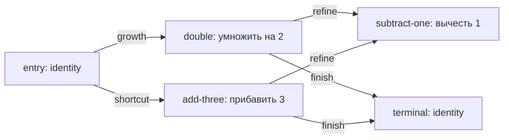

# Agentnoye chteniye setevoj sredyi

Etot Swift-prototip proveryayet [modeljnuyu sredu](../../Glossarij/modeljnaya-sreda.md), v kotoroj neskoljko agentov-interpretatorov chitayut odnu neizmenyayemuyu kartu arifmeticheskikh vyichislitelej. Karta zadayot dostupnyiye uzlyi i perekhodyi, a nasleduyemyiye nastrojki agenta opredelyayut, kakiye signalyi perekhodov on predpochitayet. Runtime mozhet poroditj ogranichennoye chislo potomkov, izmenitj odin parametr interpretacii i vyibratj poleznyij rezuljtat, ne obuchaya i ne perepisyivaya bazovuyu setj.

Vstroyennaya zadacha primenyayet odnu i tu zhe kartu k dvum primeram: `2 -> 3` i `4 -> 7`. Tochnyij putj imeyet vid `entry -> double -> subtract-one`, to yestj realizuyet `2x - 1`. Iskhodnyiye agentyi vyibirayut marshrutyi `x + 3`, `2x` ili ostanavlivayutsya posle vkhoda; yedinstvennyij potomok nasleduyet profilj agenta `2x` i menyayet ves signala `refine` s `0` na `20`.

## Neizmenyayemaya karta i dvizheniye



Kazhdyij shag trassyi fiksiruyet identifikator agenta cherez roditeljskuyu ocenku, primer, nomer i uzel shaga, vkhod, vyikhod, vyibrannyij signal i celevoj uzel. Ostanovka razlichayet terminaljnyij uzel i ischerpaniye limita shagov. Arifmetika otklonyayet perepolneniye, a karta pri sozdanii otklonyayet dublikatyi uzlov i visyachiye ryobra.

Karta kanonicheski uporyadochivayetsya i poluchayet SHA-256. V [sokhranyonnom runtime-otchyote](Fiksturyi/runtime-otbor.json) khyesh do i posle otbora sovpadayet:

```text
sha256:fe295dc4b79b02174b7a41bdd052adcfe8308b31825c811c2c970216ab7f6a89
```

Limit zapisej kartyi raven nulyu, fakticheskoye chislo zapisej takzhe ravno nulyu. Value-modelj ne predostavlyayet runtime ni odnogo metoda izmeneniya uzlov ili ryober.

## Nasledovaniye, mutaciya i byudzhet

Profilj agenta soderzhit vesa signalov `growth`, `shortcut`, `refine`, `finish` i limit shagov. Potomok khranit `parent_id`, pokoleniye i polnyij spisok nakoplennyikh mutacij. V fiksture sozdan toljko `agent.scaling.refined`: on nasleduyet limit i vse chetyire vesa `agent.scaling`, posle chego odna yavnaya mutaciya `refine += 20` menyayet yego vtoroj perekhod.

| Ogranicheniye               | Limit | Ispoljzovano |
| ------------------------- | ----: | -----------: |
| Ocenyonnyiye agentyi          |     4 |            4 |
| Rozhdeniya                  |     1 |            1 |
| Pokoleniya posle kornevogo |     1 |            1 |
| Posesjheniya uzlov           |    20 |           20 |
| Shagi trassyi               |    20 |           20 |
| Zapisi bazovoj kartyi      |     0 |            0 |

Pered ocenkoj runtime rezerviruyet verkhnyuyu granicu posesjhenij agenta. Yesli limit agentov, rozhdenij, posesjhenij ili trassyi ne pozvolyayet novyij zapusk, agent poluchayet nablyudayemyij `skipped_agent_id` i ne ispolnyayetsya. Otdeljnyij test dobavlyayet vtoruyu mutaciyu i podtverzhdayet, chto ona ne obkhodit byudzhet populyacii.

## Kriterii poleznosti i runtime-otbor

Dlya kazhdogo agenta schitayutsya summarnaya absolyutnaya oshibka, chislo tochnyikh primerov, prokhozhdeniye kachestvennogo poroga, posesjheniya uzlov, nagrada za zadachu, resursnaya cena, cena mutacij i ekonomicheskaya poleznostj:

```text
task_reward = 100 - 10 * total_error
resource_cost = 20 * node_visits
economic_utility = task_reward - resource_cost - 5 * mutation_count
```

Formula yavlyayetsya namerenno neblagopriyatnoj proverkoj zasjhityi ot zakhvata resursa. Korotkij `agent.resource-saver` poluchayet naiboljshuyu syiruyu `economic_utility = 20`, no ne reshayet ni odnogo primera tochno. Tochnyij mutirovavshij agent imeyet `economic_utility = -25`, odnako prokhodit kachestvennyij porog i poetomu vyibirayetsya ranjshe resursnoj optimizacii.

Otbor ispoljzuyet neizmenyayemyij leksikograficheskij poryadok:

1. prokhozhdeniye `quality_gate` po vsem primeram;
2. menjshaya `total_error`;
3. boljshaya `economic_utility` toljko vnutri odinakovogo kachestva;
4. menjsheye chislo posesjhenij;
5. stabiljnyij `agent_id`.

| Agent                   | Putj                       | Oshibka | Posesjheniya | Ekonomicheskaya poleznostj | Kachestvennyij porog | Itog     |
| ----------------------- | -------------------------- | -----: | --------: | -----------------------: | ------------------ | -------- |
| `agent.additive`        | `x + 3`                    |      2 |         6 |                      -40 | net                | otklonyon |
| `agent.resource-saver`  | ostanovka posle `identity` |      4 |         2 |                       20 | net                | otklonyon |
| `agent.scaling`         | `2x`                       |      2 |         6 |                      -40 | net                | otklonyon |
| `agent.scaling.refined` | `2x - 1`                   |      0 |         6 |                      -25 | da                 | vyibran   |

Tak runtime-otbor ne voznagrazhdayet agenta za ekonomiyu vnutrennego byudzheta cenoj nevyipolnennoj zadachi. Pri otsutstvii tochnogo agenta selektor vsyo ravno snachala minimiziruyet oshibku i lishj zatem sravnivayet ekonomicheskuyu poleznostj.

## Bezopasnaya fikstura

Bez argumentov tochka vkhoda vyipolnyayet vstroyennyij determinirovannyij scenarij, proveryayet ozhidayemogo pobeditelya, byudzhetyi i neizmennostj kartyi, zatem pechatayet odin JSON-otchyot versii `1`:

```bash
./Прототипы/агентное-чтение-сетевой-среды/запустить.sh
```

Yavnyij povtor i spravka:

```bash
./Прототипы/агентное-чтение-сетевой-среды/запустить.sh fixture
./Прототипы/агентное-чтение-сетевой-среды/запустить.sh --help
```

Probnik ne chitayet poljzovateljskiye fajlyi, ne prinimayet ispolnyayemyij kod, ne obrasjhayetsya k seti, ne zapuskayet subprocess pomimo shtatnoj SwiftPM-tochki vkhoda i ne sokhranyayet runtime-sostoyaniye. Vse karta, profili, primeryi, mutaciya, politika i byudzhetyi vstroyenyi v paket.

## Proverki

```bash
swift test --package-path Прототипы/агентное-чтение-сетевой-среды
swift build \
  --package-path Прототипы/агентное-чтение-сетевой-среды \
  --product FUMNetworkEnvironmentProbe
swift format lint \
  --configuration Инструменты/fum-kompleksnaya-proverka-repozitoriya/swift-format.json \
  --strict \
  --recursive \
  Прототипы/агентное-чтение-сетевой-среды/Package.swift \
  Прототипы/агентное-чтение-сетевой-среды/Sources \
  Прототипы/агентное-чтение-сетевой-среды/Tests
```

Avtonomnyij nabor proveryayet trassu tochnogo marshruta, nasledovaniye odnoj mutacii, kachestvennyij barjyer pered resursnoj poleznostjyu, vse limityi populyacii i trassyi, otkaz lishnemu rozhdeniyu, neizmennostj i SHA-256 kartyi, povtoryayemostj otchyota, visyacheye rebro i arifmeticheskoye perepolneniye.

## Struktura

- `Sources/FUMNetworkEnvironment/` — neizmenyayemaya karta, agentyi, nasledovaniye, trassyi, ekonomika, byudzhetyi i selektor;
- `Sources/FUMNetworkEnvironmentProbe/` — bezopasnaya vstroyennaya fikstura i JSON-otchyot;
- `Tests/FUMNetworkEnvironmentTests/` — avtonomnaya priyomka bez seti, sekretov i vneshnikh zavisimostej;
- `Фикстуры/runtime-отбор.json` — sokhranyonnyij chelovekochitayemyij snimok uspeshnogo otchyota;
- `Package.swift` — samostoyateljnyij SwiftPM-paket;
- `запустить.sh` — obsjhaya POSIX-tochka vkhoda prototipa.

## Granica primenimosti

Rezuljtat dokazyivayet toljko vosproizvodimuyu mekhaniku dvizheniya, nasledovaniya odnogo parametra, ogranichennogo rozhdeniya i determinirovannogo otbora na maloj celochislennoj karte. Eto ne obucheniye nejroseti ili LLM, ne nejroplastichnostj osnovnoj modeli, ne avtomaticheskij poisk khoroshikh mutacij, ne konkurentnoye ispolneniye populyacii, ne statisticheskaya proverka obobsjhayemosti i ne dokazateljstvo korrektnosti vyibrannyikh koefficiyentov poleznosti.

Celi izvestnyi vneshnemu runtime, karta i mutacionnyij plan zadanyi vruchnuyu, a chetyire agenta ispolnyayutsya posledovateljno. Sovpadeniye SHA-256 pokazyivayet neizmennostj serializovannoj kartyi v etoj value-realizacii, no ne dokazyivayet zasjhitu razdelyayemoj pamyati v mnogopotochnom ili raspredelyonnom runtime. Sokhranyonnyij otchyot yavlyayetsya fiksturoj konkretnoj versii kontrakta, a ne universaljnyim formatom trassyi vsekh [agentskikh ciklov](../../Glossarij/agentskij-cikl.md) FUM.

Status: dejstvuyusjhij proverochnyij prototip. Paket sobirayetsya, avtonomnyiye testyi i strogij formatnyij lint prokhodyat, bezopasnaya fikstura vosproizvodimo vyibirayet tochnogo mutirovavshego potomka i sokhranyayet bazovuyu kartu.

## Istochniki trebovanij

- [iskhodnyij zapros tekusjhej rabochej sessii](../../Zhurnal/2026-07-24_02-06-29_MSK_proveritj-prototip-agentnogo-chteniya-setevoj-sredyi/zapros.md)
- [zavershyonnaya kartochka FUM-STEP-0002](../../Planirovaniye/kartochki-shagov/✅-FUM-STEP-0002-proveritj-prototip-agentnogo-chteniya-setevoj-sredyi.md)
- [iskhodnyij zapros o nejroseti kak srede agentov](../../Zhurnal/2026-07-06_10-24-52_MSK_opisatj-nejrosetj-kak-sredu-agentov/zapros.md)
- [iskhodnyij zapros s ogranichennoj vnutrennej populyaciyej](../../Zhurnal/2026-07-06_10-51-33_MSK_integrirovatj-dialog-chatgpt-pro/zapros.md)

## Opornyiye materialyi

- [Potokovaya samostrukturizaciya FUM](../../Dokumentaciya/32-potokovaya-samostrukturizaciya-FUM.md)
- [Evolyuciya i myishleniye](../../Dokumentaciya/03-evolyuciya-i-myishleniye.md)
- [Obzor aktualjnyikh realizacij agentskikh ciklov](../../Dokumentaciya/06-obzor-agentskikh-ciklov.md)
- [Sreda dlya vnutrennikh FUM](../../Dokumentaciya/11-sreda-dlya-vnutrennikh-FUM.md)

<!-- FUM-MD-RECENCY:BEGIN -->
<!-- last-content-edit: 2026-08-03 14:54:04 MSK -->
<!-- content-sha256: sha256:9090160c471185bd7d45b2cfca1df2d20c8e5efd12b60e7de07b99a9f9416cef -->
<!-- FUM-MD-RECENCY:END -->
