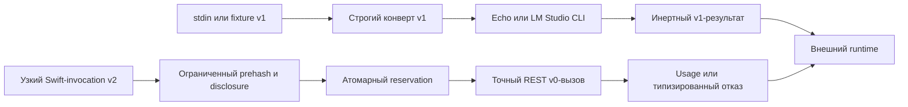

# Chistyij modeljnyij shag

Etot Swift-prototip proveryayet [kontrakt chistogo modeljnogo shaga](../../Dokumentaciya/41-kontrakt-chistogo-modeljnogo-shaga.md) na determinirovannoj zaglushke `fum.deterministic-echo.v1`, sovmestimom process-adapter `fum.lm-studio-cli.one-shot.v1` i otdeljnom byudzhetnom profile `fum.lm-studio-rest-v0.budgeted.v1`. Strogij konvert versii `1` sokhranyayet prezhnij perenosimyij interfejs, a profilj versii `2` dobavlyayet nezavisimo zadannyiye disclosure-granicyi, shestimernyij byudzhet, atomarnyij reservation, ispolnimyij `max_tokens` i doverennoye provider usage.

Adapter ne zapuskayet [agentskij cikl](../../Glossarij/agentskij-cikl.md) i ne imitiruyet kachestvo modeli. On proveryayet boleye uzkuyu granicu: modeljnyij vyivod mozhno poluchitj odnim lokaljnyim vyizovom, svyazatj s tochnyim vkhodom i byudzhetom i peredatj vneshnemu runtime, ne davaya modeli instrumentov, fajlov, sobstvennoj seti ili prava ispolnyatj etot vyivod.

## Proveryayemyij kontur



Tochka vkhoda `FUMModelStepProbe` chitayet toljko konvert versii `1` i v obyichnom zapuske ispoljzuyet `DeterministicEchoProvider`. Byudzhetnaya forma versii `2` vkhodit v bibliotechnyij API i proveryayetsya avtonomnyimi i opt-in-testami; CLI ne vyidayotsya za yeyo tochku vkhoda.

Yadro trebuyet tochnyiye polya konverta i otklonyayet neizvestnyiye. `capabilities.tools`, `capabilities.files` i `capabilities.network` prinimayutsya toljko so znacheniyem `false`. Staticheskaya identity nastroyennogo provider/interface sveryayetsya do vyizova; fakticheskiye model/runtime REST-profilya dostupnyi v otvete i proveryayutsya posle otpravki sinteticheskogo prompt na uzhe razreshyonnyij loopback endpoint. Shell-podobnyiye stroki ostayutsya obyichnyimi bajtami Swift `String` i ne peredayutsya shell ili subprocess.

## Kak zapustitj

Bez argumentov tochka vkhoda vyipolnyayet bezopasnuyu vstroyennuyu fiksturu:

```bash
./Прототипы/чистый-модельный-шаг/запустить.sh
```

Yavnyij povtor toj zhe fiksturyi:

```bash
./Прототипы/чистый-модельный-шаг/запустить.sh fixture
```

Peredatj sobstvennyij konvert cherez stdin:

```bash
printf '%s\n' '<JSON-конверт-версии-1>' | \
  ./Прототипы/чистый-модельный-шаг/запустить.sh stdin
```

Probnik chitayet ne boleye `1048577` bajt: odin bajt sverkh predela nuzhen toljko dlya nablyudayemogo otkaza. Zaversheniye stdin obespechivayet vyizyivayusjhij process; `limits.timeout_milliseconds` ispolnyayetsya real-provider process-runner.

## Sovmestimyij CLI-profilj

`LMStudioModelOnlyAdapter` trebuyet yavnuyu konfiguraciyu: tochnyij putj uzhe ustanovlennogo `lms`, tochnyij klyuch uzhe sokhranyonnoj modeli, nablyudayemyiye versii CLI i prilozheniya i minimaljnyij allowlist sredyi. Bez neyo rezuljtat imeyet kod `provider_unconfigured`; echo-zaglushka avtomaticheski ne podstavlyayetsya.

Adapter peredayot vsyu posledovateljnostj soobsjhenij kak JSON-frejm, zapuskayet `lms chat` napryamuyu bez shell, ispoljzuyet `--prompt`, `--dont-fetch-catalog`, `-y` i korotkij TTL. V pasporte sampling, seed, predel tokenov i khyesh vesov zapisanyi kak `unknown`, potomu chto tekusjhij CLI ikh ne raskryivayet i ne pozvolyayet zadatj v etom rezhime. Prompt prokhodit cherez argv, poetomu profilj ogranichen `65536` bajtami, ne prinimayet U+0000 i ne prednaznachen dlya chuvstviteljnogo proizvoljnogo konteksta.

Otsutstviye ispolnimogo token limit v `lms chat` ne maskiruyetsya bajtovyim ogranicheniyem. Poetomu CLI-profilj sokhranyayetsya dlya sovmestimosti i process-level proverok, no ne ispoljzuyetsya kak byudzhetnyij profilj versii `2`.

## Byudzhetnyij REST v0-profilj

`BudgetedModelOnlyAdapter` trebuyet polnostjyu zadannyij `ModelOnlyBudgetProfile`: `local | remote`, provider/interface/endpoint, model/runtime/tokenizer identity, klassyi, bajtovyij obyyom i naznacheniye raskryitiya, obsjhij ceiling i maksimaljnyij reservation sleduyusjhego vyizova po vyizovam, vkhodnyim i vyikhodnyim tokenam, wall-clock-vremeni, vyichisliteljnyim yedinicam i denezhnyim mikroyedinicam. Strogij decoder otklonyayet neizvestnyiye polya profilya i vlozhennyikh authority-obyyektov. Klass i naznacheniye dannyikh obyyavlyayet vyizyivayusjhij kontur; adapter ne raspoznayot sekret, oshibochno nazvannyij `synthetic`.

Profilj i rezuljtat popyitki imeyut versiyu `2`, a publichnyij `BudgetedModelOnlyInvocation` yavlyayetsya otdeljnoj uzkoj Swift-formoj s odnim `input` bez sobstvennogo polya versii. Eto ne polnoye rasshireniye konverta versii `1`: perenos `messages`, `response_format`, JSON Schema i vsego pasporta ostayotsya budusjhej integraciyej. Pole `remote` serializuyetsya strogo, no ispolnyayemyij adapter prinimayet toljko `local` i zakryivayet remote-profilj do tokenizer/provider; istochnik cenyi i remote-soglasovaniye ne predostavlenyi.

`VolatileModelBudgetLedger` odnoj actor-operaciyej svyazyivayet request hash s polnyim reservation. Aktivnyiye i terminaljnyiye zapisi prinadlezhat ledger, poetomu replay ostayotsya idempotentnyim mezhdu ekzemplyarami adapter, poka zhiv actor/process; `durability = process_memory` ne vyidayotsya za mezhprocessnoye khranilisjhe. Dlya lokaljnogo profilya `compute_unit = wall_clock_millisecond`, `money_unit = none`, oba denezhnyikh predela ravnyi nulyu. Obsjhij deadline vklyuchayet tokenizer i HTTP, a provider poluchayet ostatok minimuma wall-clock- i compute-reservation.

Do JSON/SHA profilj i invocation prokhodyat absolyutnyiye prehash-predelyi: `4096` UTF-8-bajtov na stroku profilya, ne boleye `16` klassov i `64` naznachenij po `1024` bajta, `max_input_bytes <= 1048576`, a takzhe `1024` bajta na invocation ID i naznacheniye. Publichnaya exact-fikstura dopolniteljno skaniruyet ne boleye `28` bajt vkhoda. Rannij otkaz tipizirovan, imeyet `request_sha256 = nil`, ne sozdayot terminal ledger entry i reservation i ne menyayet byudzhet.

Publichnyij ispolnyayemyij initializer prinimayet toljko konstantnuyu attestaciyu FUM-STEP-0108 i konkretnyij `LMStudioRESTV0BudgetTransport`; vnedreniye protocol-zaglushek v adapter i transport dostupno paketu toljko dlya avtonomnyikh testov, a raw provider/HTTP API skryit. Transport zakryit na tochnuyu posledovateljnostj komponentov loopback-puti `api`, `v0`, `chat`, `completions`, peredayot `max_tokens` toljko iz profilya i razbirayet model/runtime/usage otdeljno ot `message.content`. Ephemeral HTTP-sessiya ne ispoljzuyet ambient cookie, credentials, cache ili proxy, ne sleduyet redirect, imeyet absolyutnyij resource timeout i absolyutnyij verkhnij predel tela `1048576` bajt; nastrojka mozhet toljko umenjshitj yego. Toljko uspeshno soglasovannaya popyitka khranit SHA-256 tochnyikh bajtov tela, poluchennyikh posle obrabotki HTTP-peredachi; lyuboj post-provider otkaz dayot tipizirovannyij iskhod bez digest, transport partial otdelyon ot obsjhej kategorii invalid response dlya malformed/schema mismatch, a wire-overflow imeyet sobstvennyij iskhod.

Predvariteljnaya tokenizaciya dolzhna byitj `exact` i sovpastj s `prompt_tokens`. Tak kak REST v0 ne predostavlyayet otdeljnuyu tokenize-capability, dostupnyij live-profilj ogranichen publichnoj konstantnoj attestaciyej odnogo sinteticheskogo vkhoda `Return the single letter A.`: provider/interface i framing odnogo user-message, endpoint, `qwen/qwen3-0.6b`, runtime, tochnyij SHA-256 i `14` vkhodnyikh tokenov zakreplenyi vmeste. Drugoj profilj, input ili model zakryivayetsya do provider; proizvoljnoye chislo neljzya peredatj cherez publichnyij initializer, universaljnaya tokenizaciya proizvoljnogo konteksta ne zayavlyayetsya.

Zhivoj integracionnyij XCTest vklyuchayetsya toljko polnyim byudzhetnyim pasportom i otdeljnyim flagom. LM Studio server dolzhen byitj uzhe zapusjhen, a tochnaya modelj — uzhe nakhoditjsya na diske:

```bash
FUM_RUN_LIVE_MODEL_TEST=1 \
FUM_LM_STUDIO_ENDPOINT='http://127.0.0.1:1234/api/v0/chat/completions' \
FUM_LM_STUDIO_MODEL='qwen/qwen3-0.6b' \
FUM_LM_STUDIO_RUNTIME_NAME='llama.cpp-mac-arm64-apple-metal-advsimd' \
FUM_LM_STUDIO_RUNTIME_VERSION='2.27.1' \
FUM_LM_STUDIO_TOKENIZER_ID='lmstudio.rest-v0.qwen3-0.6b.prompt-attestation.v1' \
swift test --package-path Прототипы/чистый-модельный-шаг \
  --filter LMStudioModelOnlyAdapterTests/testLiveLMStudioBudgetedRESTV0WhenExplicitlyConfigured
```

Test peredayot toljko zakreplyonnyij sinteticheskij prompt, trebuyet `max_tokens = 1`, sveryayet model/runtime identity, `finish_reason = length`, `prompt_tokens = 14`, `completion_tokens = 1` i format khyesha tela otveta. Tochnoye sovpadeniye SHA-256 s poluchennyimi bajtami tela proveryayet avtonomnaya transport-fikstura. Test ne zapuskayet server, ne skachivayet modelj, ne obrasjhayetsya k katalogu, ne izvlekayet sekretyi i ne ispoljzuyet platnyij dostup. Obyichnyij `swift test` ispoljzuyet zapisannyiye iskhodyi, zapuskayet toljko bezopasnyiye sistemnyiye processyi dlya proverki granic i propuskayet zhivoj test.

Poluchitj spravku:

```bash
./Прототипы/чистый-модельный-шаг/запустить.sh --help
```

## Proverki

```bash
swift test --package-path Прототипы/чистый-модельный-шаг
swift build \
  --package-path Прототипы/чистый-модельный-шаг \
  --product FUMModelStepProbe
swift format lint \
  --configuration Инструменты/fum-kompleksnaya-proverka-repozitoriya/swift-format.json \
  --strict \
  --recursive \
  Прототипы/чистый-модельный-шаг/Package.swift \
  Прототипы/чистый-модельный-шаг/Sources \
  Прототипы/чистый-модельный-шаг/Tests
```

Avtonomnyij nabor proveryayet uspeshnyij UTF-8-vyizov, kanonicheskuyu povtoryayemostj, privyazku `input_sha256`, strogiye polya, zapret effektnyikh capabilities, obyazateljnoye soobsjheniye `user`, rovno dopustimyij bajtovyij predel, lishnij bajt, tajm-aut, otmenu, otkaz, oshibku, nedostupnostj i nenastroyennostj bez raskryitiya diagnostiki. Byudzhetnyiye suites dopolniteljno proveryayut strogij authority-profilj, disclosure do provider, affordability kazhdogo izmereniya, obsjhij deadline, konkurentnyiye reservation, same-ID reentrancy, replay mezhdu adapter, tochnyij REST payload, redirect-otkaz, byte cap, SHA-256 tela, trusted usage, tochnuyu tokenization i terminal outcomes dlya timeout, transport partial, invalid response, missing, negative, wire overflow i inconsistent counters.

## Struktura

- `Sources/FUMPureModelStep/` — tipyi konverta, strogij dekoder, kodirovsjhiki, determinirovannyij provajder, sovmestimyij LM Studio process-adapter, byudzhetnyij ledger i REST v0-transport;
- `Sources/FUMModelStepProbe/` — bezopasnaya vstroyennaya fikstura i rezhim chteniya stdin;
- `Tests/FUMPureModelStepTests/` — avtonomnyiye zapisannyiye proverki i otdeljnyij opt-in live-test;
- `Package.swift` — samostoyateljnyij paket bez vneshnikh SwiftPM-zavisimostej;
- `запустить.sh` — obsjhaya POSIX-tochka vkhoda prototipa.

## Granica primenimosti

Rezuljtat dokazyivayet kontrakt, zaglushku, process-level timeout/cancel/output-limit, atomarnyij process-memory budget ledger, ispolnimyij provider token limit, strukturirovannoye usage i odin zhivoj vyizov lokaljnoj LLM dlya odnoj tochnoj tokenizacionnoj fiksturyi. On ne dokazyivayet universaljnyij tokenizer, polnyij konvert versii `2`, remote transport, kachestvo ili determinizm modeli, prigodnostj lyubogo oborudovaniya, bezopasnostj budusjhikh dejstvij, dolgovechnostj posle avarii processa, vlozheniye ciklov libo nalichiye polnogo sobstvennogo runtime FUM.

[Tenevoj redaktor prodolzhenij](../tenevoj-redaktor-prodolzhenij/README.md) uzhe podtverzhdayet chastj lokaljnogo Ollama-profilya, no ne obyyavlen sovmestimyim s obsjhim kontraktom do polnoj fiksacii runtime, vesov i parametrov generacii. `Codex CLI` ne prinimayetsya kak model-only-provajder bez otdeljnogo dokazannogo rezhima, isklyuchayusjhego yego sobstvennyij agentskij cikl i instrumentyi.

Status: dejstvuyusjhij proverochnyij prototip. Paket sobirayetsya, avtonomnyiye testyi prokhodyat, vstroyennaya fikstura dayot vosproizvodimyij rezuljtat, a opt-in-profilj LM Studio REST v0 vyipolnyayet odin realjnyij ogranichennyij model-only-vyizov pri yavnoj konfiguracii.

## Istochniki trebovanij

- [iskhodnyij zapros o zakreplenii ispolnimogo token-byudzheta](../../Zhurnal/2026-07-31_18-05-50_MSK_zakrepitj-ispolnimyij-token-byudzhet-model-only-profilya/zapros.md)
- [iskhodnyij zapros tekusjhej rabochej sessii](../../Zhurnal/2026-07-23_18-12-05_MSK_proveritj-kontrakt-chistogo-modeljnogo-shaga-dlya-ispolnyayemogo-agentskogo-cikla/zapros.md)
- [iskhodnyij zapros o podklyuchenii realjnogo model-only-adaptera](../../Zhurnal/2026-07-29_23-53-42_MSK_podklyuchitj-proveryayemyij-realjnyij-model-only-adapter/zapros.md)
- [MVP-kandidat ispolnyayemogo agentskogo cikla](../../Planirovaniye/MVP-kandidatyi/04-ispolnyayemyij-agentskij-cikl/README.md)
- [kartochka FUM-STEP-0005](../../Planirovaniye/kartochki-shagov/✅-FUM-STEP-0005-proveritj-kontrakt-chistogo-modeljnogo-shaga-dlya-ispolnyayemogo-agentskogo-cikla.md)

## Opornyiye materialyi

- [minimaljnyij format trassyi ispolnyayemogo agentskogo cikla](../../Dokumentaciya/37-minimaljnyij-format-trassyi-ispolnyayemogo-agentskogo-cikla.md)
- [chastichno proyasnyonnyij vopros o razvilke giperseti i agentskogo cikla FUM](../../Voprosyi/2026-07-03_15-36-48_MSK_razvilka-giperseti-i-agentskogo-cikla-FUM.md)
- [tenevoj redaktor prodolzhenij](../tenevoj-redaktor-prodolzhenij/README.md)

<!-- FUM-MD-RECENCY:BEGIN -->
<!-- last-content-edit: 2026-08-03 14:54:04 MSK -->
<!-- content-sha256: sha256:5f3f34defd126f7664b3297f5548292c540f8c709e457d7e42e5f303071e5ad5 -->
<!-- FUM-MD-RECENCY:END -->
