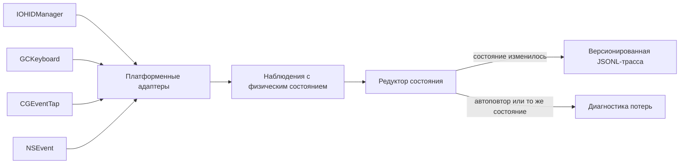

# Fizicheskiye sostoyaniya klavish

Etot Swift-prototip vyibirayet stek nablyudeniya klaviaturyi dlya trebovaniya o [fizicheskikh perekhodakh klavish](../../Trebovaniya/🚧-fizicheskiye-perekhodyi-klavish.md) i realizuyet klaviaturnyij srez [versionirovannoj pervichnoj trassyi sobyitij vvoda](../../Trebovaniya/🚧-versionirovannaya-pervichnaya-trassa-sobyitij-vvoda.md). Gibridnaya arkhitektura ispoljzuyet `IOHIDManager` kak pervichnyij macOS-istochnik, `GCKeyboard` kak perenosimyij sloj platform Apple, a `CGEventTap` i `NSEvent` kak diagnosticheskiye istochniki dlya izmereniya poterj i povedeniya sistemnogo potoka.

Graficheskij provodnik `FUMInputGuide` prevrasjhayet plan fizicheskoj priyomki v upravlyayemyij lokaljnyij seans. On obyyasnyayet naznacheniye i granicyi sbora, trebuyet yavnogo soglasiya, zapuskayet vyibrannyiye istochniki, posledovateljno pokazyivayet kartochki scenariyev, vklyuchayet zapisj toljko vnutri aktivnoj kartochki i sokhranyayet lokaljnyij nabor dannyikh pryamo v rabochej kopii repozitoriya. Mezhdu kartochkami sobyitiya ne zapisyivayutsya; neozhidannaya klavisha annuliruyet popyitku, no yeyo kod v fajl ne popadayet.

Pervichnaya trassa soderzhit toljko izmeneniya yavnogo fizicheskogo sostoyaniya klavishi. Avtopovtor ne schitayetsya fizicheskim sobyitiyem: istochnik s yavnyim priznakom povtora otbrasyivayetsya srazu, a obsjhij reduktor nezavisimo isklyuchayet povtor uzhe izvestnogo sostoyaniya.

## Proveryayemyij kontrakt



Klyuch zadayotsya prostranstvom kodov, identifikatorom ustrojstva, usage page i usage. Dlya HID-istochnika eto nastoyasjhij HID usage; virtualjnyij kod `CGEvent` i `NSEvent` khranitsya v otdeljnom prostranstve `macVirtualKeyCode` i ne vyidayotsya za HID usage. Sostoyaniya `pressed` i `released` ne vyivodyatsya iz simvola, raskladki, obsjhego flaga modifikatorov ili logicheskogo rezhima Caps Lock.

Vse adapteryi privodyat vremennyiye metki k yedinoj monotonnoj shkale nanosekund s momenta zapuska sistemyi cherez `MonotonicTimestampNormalizer`. IOHID peredayot tiki AbsoluteTime, kotoryiye preobrazuyutsya s koefficiyentom `mach_timebase_info`; `CGEvent` i `GCKeyboard` yavno peredayut uzhe nanosekundnyiye znacheniya, a sekundyi `NSEvent` proveryayutsya i perevodyatsya v nanosekundyi. Preobrazovaniye IOHID ne perepolnyayet promezhutochnoye proizvedeniye i otklonyayet nepredstavimyij itog vmesto avarii ili nezametnogo iskazheniya.

Filjtraciya vyipolnyayetsya v dva sloya:

1. nablyudeniye s `isAutoRepeat == true` otklonyayetsya kak avtopovtor;
2. nablyudeniye, ravnoye uzhe izvestnomu sostoyaniyu toj zhe klavishi togo zhe ustrojstva, otklonyayetsya kak neizmenivsheyesya sostoyaniye;
3. toljko ostavshijsya perekhod poluchayet `schemaVersion`, posledovateljnyij nomer, predyidusjheye sostoyaniye, novoye sostoyaniye i monotonnoye vremya.

## Vyibor steka

| Istochnik       | Fizicheskoye sostoyaniye                                                 | Identichnostj ustrojstva | Avtopovtor                                  | Rolj v vyibrannom steke                    |
| -------------- | -------------------------------------------------------------------- | ----------------------- | ------------------------------------------- | ----------------------------------------- |
| `IOHIDManager` | znacheniye HID-elementa i HID usage                                    | razdeljnaya              | ne nuzhen; dublikatyi otsekayet reduktor       | pervichnyij istochnik klaviaturyi na macOS    |
| `GCKeyboard`   | `pressed` v obrabotchike izmeneniya i `GCKeyCode`                      | obyyedinyonnaya            | otdeljnogo priznaka net; sostoyaniye menyayetsya | perenosimyij sloj Apple i rezerv na macOS  |
| `CGEventTap`   | `keyDown`/`keyUp`; dlya `flagsChanged` — zapros sostoyaniya HID-sistemyi | otsutstvuyet             | yestj yavnoye pole                             | sistemnaya diagnostika i sravneniye poterj  |
| `NSEvent`      | `keyDown`/`keyUp`; modifikatoryi prikhodyat kak `flagsChanged`          | otsutstvuyet             | yestj `isARepeat`                            | prikladnaya diagnostika, ne pervichnyij sloj |
| UI Presses     | HID usage i fazyi na podderzhivayemyikh UI-platformakh                     | otsutstvuyet             | zavisit ot platformennogo kontura           | budusjhij prikladnoj kontroljnyij istochnik   |

`IOHIDManager` vyiigryivayet na macOS ne iz-za zaraneye zadannogo vesa API, a potomu chto yedinstvennyij iz realizovannyikh kandidatov odnovremenno sokhranyayet HID usage, znacheniye elementa, monotonnoye vremya i razdeljnuyu identichnostj ustrojstv. `GCKeyboard` vyiigryivayet v perenosimom sreze blagodarya obsjhemu publichnomu API Apple i yavnomu bulevu sostoyaniyu, no yego `coalesced`-modelj fiksiruyetsya kak poterya razlichimosti neskoljkikh klaviatur.

## Sostav prototipa

- `FUMInputCore` — perenosimaya modelj klyucha, nablyudeniya, perekhoda, JSONL-zapisi, reduktor sostoyaniya i vosproizvodimaya matrica kandidatov;
- `FUMInputMac` — adapteryi `IOHIDManager`, `GCKeyboard`, `CGEventTap` i `NSEvent`, inventarizaciya HID-klaviatur i snimok dostupnosti sredyi;
- `FUMInputGuide` — nativnyij SwiftUI-provodnik soglasiya, vyibora istochnikov, scenariyev fizicheskoj priyomki, lokaljnogo khraneniya, prosmotra i udaleniya rezuljtata;
- `FUMInputProbe` — headless-komandyi dlya vyivoda matricyi, proverki sredyi, inventarizacii ustrojstv i yavno vklyuchayemoj zapisi;
- `FUMInputCoreTests` i `FUMInputMacTests` — avtonomnyiye testyi fizicheskogo kontrakta i preobrazovaniya platformennyikh sobyitij.

Plan provodnika versii `1` soderzhit obyazateljnyiye i uslovnyiye scenarii: obyichnyij cikl i perekryitiye dvukh klavish, dolgoye uderzhaniye s avtopovtorom, storonyi vsekh modifikatorov, odnovremennyiye Command, kombinaciyu Shift + A, dva cikla Caps Lock, odinakovuyu fizicheskuyu klavishu v dvukh raskladkakh, Fn ili Globe s verkhnim ryadom, granicu media-klavishi, poteryu fokusa, vtoruyu klaviaturu, otklyucheniye i podklyucheniye, son i probuzhdeniye, otzyiv razresheniya i plotnyij potok pod nagruzkoj. Apparatno nedostupnyij ili nenablyudayemyij scenarij ostayotsya v manifeste so statusom `unsupported`, a ne ischezayet i ne podmenyayetsya sinteticheskim perekhodom.

## Kak proveritj

Sborka i avtonomnyiye testyi ne trebuyut seti, sekretov, razresheniya na zapisj poljzovateljskogo vvoda ili fakticheskogo nazhatiya klavish:

```bash
swift test --package-path Прототипы/физические-состояния-клавиш
swift build \
  --package-path Прототипы/физические-состояния-клавиш \
  --product FUMInputProbe
swift format lint \
  --configuration Инструменты/fum-kompleksnaya-proverka-repozitoriya/swift-format.json \
  --strict \
  --recursive \
  Прототипы/физические-состояния-клавиш/Sources \
  Прототипы/физические-состояния-клавиш/Tests \
  Прототипы/физические-состояния-клавиш/Package.swift
```

Obsjhij [smoke-check repozitoriya](../../Instrumentyi/fum-kompleksnaya-proverka-repozitoriya/SKILL.md) avtomaticheski vyipolnyayet eti avtonomnyiye testyi, otdeljno sobirayet `FUMInputProbe` i primenyayet strogij `swift format lint --strict` ko vsem putyam celej i `Package.swift`.

Prostoj zapusk bez argumentov otkryivayet graficheskij provodnik. Samo otkryitiye okna ne zapuskayet istochniki i ne sozdayot soderzhateljnyikh zapisej:

```bash
./Прототипы/физические-состояния-клавиш/запустить.sh
```

Vosproizvodimaya matrica i predvariteljnaya rekomendaciya ostayutsya dostupnyi otdeljnoj bezopasnoj komandoj:

```bash
./Прототипы/физические-состояния-клавиш/запустить.sh matrix
```

Proverka dostupnosti API i publikacionno chistaya inventarizaciya bez serijnyikh nomerov i lokaljnyikh putej:

```bash
./Прототипы/физические-состояния-клавиш/запустить.sh environment
./Прототипы/физические-состояния-клавиш/запустить.sh devices
```

Zapisj zapuskayetsya toljko otdeljnoj yavnoj komandoj. Ona nichego ne sokhranyayet sama, a vyivodit JSONL v stdout; perenapravleniye v fajl yavlyayetsya otdeljnyim resheniyem operatora:

```bash
./Прототипы/физические-состояния-клавиш/запустить.sh record \
  --source iohid-manager \
  --seconds 30
```

Skript sam opredelyayet putj k Swift-paketu i rabotayet iz lyubogo tekusjhego kataloga. Dostupnyi takzhe `gc-keyboard`, `cg-event-tap` i `ns-event`. Posledniye dva trebuyut razresheniya macOS Input Monitoring. Uspeshnyij zapusk CLI ne oznachayet soglasiya na dolgovremennoye khraneniye ili peredachu trassyi.

## Lokaljnyiye dannyiye provodnika

`запустить.sh` vyichislyayet korenj tekusjhej rabochej kopii otnositeljno sobstvennogo raspolozheniya i peredayot yego processu `FUMInputGuide` toljko cherez runtime-peremennuyu `FUM_REPOSITORY_ROOT`. Provodnik prinimayet lishj absolyutnoye znacheniye, kanoniziruyet peredannyij korenj s razresheniyem yego simvoljnyikh komponentov i podtverzhdayet rezuljtat po odnovremennomu nalichiyu `AGENTS.md`, `.git` i tochnogo `Прототипы/физические-состояния-клавиш/Package.swift`. Pri pryamom zapuske sobrannogo binarnika peremennuyu nuzhno zadatj yavno; yeyo otsutstviye, otnositeljnoye znacheniye ili nesovpadeniye markerov zakryivayet zapisj. Poetomu perenesyonnyij binarnik ne znayet prezhnij checkout i mozhet rabotatj s novyim yavno peredannyim kornem. Aktualjnyij absolyutnyij putj pokazyivayetsya cheloveku, no ne serializuyetsya v dannyiye.

Zavershyonnyij seans khranitsya v:

```text
Прототипы/физические-состояния-клавиш/Локальные-данные-прогонов/session-<время-MSK>-<идентификатор>/
├── manifest.json
└── events.jsonl
```

`manifest.json` soderzhit versiyu formata, tochnyij snimok plana, vyibrannyiye i fakticheski dostupnyiye istochniki i iskhod kazhdoj popyitki. `events.jsonl` soderzhit toljko razreshyonnyiye tekusjhej kartochkoj fizicheskiye kodyi, fazyi, istochnik, monotonnoye vremya, imenovannyiye diagnosticheskiye flagi, rezuljtat otdeljnogo dlya kazhdogo istochnika reduktora i razryivyi `CGEventTap`. Simvolyi, vvedyonnyij tekst, nazvaniye raskladki, prilozheniye perednego plana, imya poljzovatelya, imya mashinyi, serijnyij nomer i absolyutnyij putj ne sokhranyayutsya.

Nezavershyonnyij seans snachala zhivyot v kataloge `.incomplete-*`; sobyitiya pishutsya tuda srazu vo vremya aktivnoj kartochki. Shtatnaya otmena ili zakryitiye yedinstvennogo okna ostanavlivayet istochniki i udalyayet etot katalog, no posle avarijnogo zaversheniya on mozhet ostatjsya dlya ruchnogo razbora. Posle sinkhronizacii fajlov i atomarnoj zapisi manifesta vesj katalog pereimenovyivayetsya v okonchateljnoye imya bez perezapisi susjhestvuyusjhego rezuljtata. Katalog poluchayet prava `0700`, fajlyi — `0600`. Tochnyij putj bazovo isklyuchyon iz Git cherez kornevoj `.gitignore`: dannyiye nakhodyatsya pryamo v rabochej kopii i dostupnyi lokaljnomu analizu, no ne popadut v publichnyij CC0-repozitorij sluchajnyim `git add`. Yavnaya knopka GUI udalyayet zavershyonnyij seans posle podtverzhdeniya.

Bazovoye isklyucheniye zasjhisjhayet ot sluchajnoj publikacii, no ne razreshayet otdelyatj susjhestvennyij vyivod ot iskhodnyikh svideteljstv. Yesli zavershyonnyij seans stanovitsya osnovaniyem dlya vyivoda, vliyayusjhego na trebovaniya, vyibor steka, arkhitekturu, status ili priyomku, publikacionno proverennyij katalog imenno etogo seansa s `manifest.json` i `events.jsonl` dobavlyayetsya v tot zhe kommit tochnyim obkhodom isklyucheniya:

```bash
git add -f -- \
  "Прототипы/физические-состояния-клавиш/Локальные-данные-прогонов/session-<время-MSK>-<идентификатор>/"
```

Material s vyivodom dolzhen ssyilatjsya na etot katalog. Vesj katalog `Локальные-данные-прогонов/`, nezavershyonnyiye `.incomplete-*` i seansyi, ne proshedshiye publikacionnuyu proverku, prinuditeljno ne dobavlyayutsya. Yesli iskhodnyij seans neljzya opublikovatj, susjhestvennyij vyivod otkladyivayetsya do publikacionno chistogo vosproizvodimogo progona.

## Proverennyij rezuljtat

Testyi upravlyayemogo sbora snachala byili zapusjhenyi v krasnom sostoyanii pri otsutstvuyusjhikh plane, khranilisjhe i poiske repozitoriya. Realizaciya dovedena do prokhozhdeniya 38 avtonomnyikh testov. Oni proveryayut:

- otdeljnyiye nazhatiye i otpuskaniye;
- isklyucheniye pomechennogo avtopovtora;
- isklyucheniye povtornogo sostoyaniya bez priznaka avtopovtora;
- nezavisimyiye sostoyaniya levoj i pravoj Command;
- nezavisimyiye sostoyaniya odinakovyikh klavish raznyikh ustrojstv;
- otkloneniye nablyudeniya bez yavnogo fizicheskogo sostoyaniya;
- versionirovannoye kodirovaniye i chteniye trassyi bez polya avtopovtora;
- preobrazovaniye HID usage i znachenij;
- preobrazovaniye `CGEvent`, vklyuchaya yavnyij priznak avtopovtora;
- polucheniye sostoyaniya `flagsChanged` iz tablicyi fizicheskogo sostoyaniya, a ne iz flagov;
- preobrazovaniye tikov Mach s koefficiyentom, otlichnyim ot `1/1`, bez perepolneniya promezhutochnogo proizvedeniya;
- bezopasnoye otkloneniye nepredstavimoj vremennoj metki i nedopustimyikh sekund;
- svedeniye vremennyikh domenov IOHID, CGEvent, NSEvent i GCKeyboard k odinakovomu nanosekundnomu znacheniyu;
- vosproizvodimyij vyibor `IOHIDManager` dlya macOS i `GCKeyboard` dlya perenosimogo sloya;
- polnotu i unikaljnostj scenarnogo plana versii `1`;
- otdeljnyij reduktor dlya kazhdogo odnovremenno rabotayusjhego istochnika;
- uporyadochennuyu dostavku vsekh uzhe prinyatyikh callback do zakryitiya granicyi scenariya;
- sokhraneniye avtopovtora kak diagnosticheski otklonyonnogo syirogo nablyudeniya;
- otkaz ot sokhraneniya neozhidannoj klavishi pri vidimom schyotchike narusheniya;
- zapret lozhnogo `completed` dlya nulevogo, chastichnogo, nesbalansirovannogo, slishkom korotkogo, neverno uporyadochennogo ili nedostatochnogo svideteljstva i zapret sokhraneniya seansa s neklassificirovannyimi kartochkami;
- atomarnoye zaversheniye seansa, JSONL-kodirovaniye, otsutstviye absolyutnogo puti i prava `0700`/`0600`;
- fail-closed-proverku absolyutnogo runtime-kornya iz `FUM_REPOSITORY_ROOT`, obyazateljnyikh markerov, perenosa checkout i otkloneniya simvoljnoj ssyilki kataloga zapisi;
- matching top-level-interfejsov Keyboard i Consumer Control i sokhraneniye vyibrannyikh consumer usage media-klavish cherez `IOHIDManager`;
- diagnosticheskiye vid sobyitiya i imenovannyiye flagi `CGEvent`, vklyuchaya `secondaryFn`.

Na tekusjhem stende macOS 27.0 s Xcode 27.0 probnik obnaruzhil odnu HID-klaviaturu s 271 klaviaturnyim elementom, podtverdil dostup passivnogo `CGEventTap` i pokazal otsutstviye dostupnogo `GCKeyboard.coalesced` v headless-processe. Soderzhateljnyiye sobyitiya klaviaturyi v etoj priyomke ne zapisyivalisj: poljzovatelj ne daval otdeljnogo soglasiya na zakhvat fakticheskikh nazhatij.

## Plan realizacii

### Etap 1 — zavershyonnyij karkas

Perenosimoye Swift-yadro, chetyire macOS-adaptera, dvukhslojnaya filjtraciya avtopovtora, versiya skhemyi, headless-probnik i avtonomnyiye testyi uzhe realizovanyi. Kartochki fizicheskikh perekhodov klavish i obsjhego karkasa trassyi imeyut status `🚧`.

### Etap 2 — provodnik gotov, fizicheskaya matrica ozhidayet progona

Graficheskij provodnik, lokaljnyij format dannyikh i avtonomnyiye proverki gotovyi. Nuzhen otdeljnyij yavno vklyuchyonnyij progon na realjnyikh ustrojstvakh: provesti kartochki cherez dostupnyiye istochniki, povtoritj raskladochnyij scenarij dvumya popyitkami, otdeljno projti uslovnyiye scenarii na vneshnej klaviature i zafiksirovatj `unsupported` tam, gde API ne nablyudayet Fn, consumer-klavishu ili zhiznennyij cikl. Pervichnaya trassa dolzhna soderzhatj toljko fizicheskiye izmeneniya, a avtopovtor i razryivyi — diagnosticheskij sloj.

### Etap 3 — perenosimyij stend Apple

Sleduyusjhij paket dolzhen dobavitj minimaljnyiye prilozheniya-obolochki dlya iOS, iPadOS, tvOS i visionOS. V nikh sravnivayutsya `GCKeyboard` i platformennyiye UI Presses na odnoj skheme, proveryayutsya dostupnostj vneshnej klaviaturyi, HID usage, storonyi modifikatorov, Caps Lock, oblastj fokusa i ogranicheniya fonovogo rezhima.

### Etap 4 — dolgovremennaya trassa

Posle fizicheskikh izmerenij [obsjhij kontrakt trassyi](../../Trebovaniya/🚧-versionirovannaya-pervichnaya-trassa-sobyitij-vvoda.md) rasshiryayetsya sobyitiyami podklyucheniya, otklyucheniya, konfiguracii, razryiva i perepolneniya. Khranilisjhe poluchayet atomarnuyu dozapisj, versiyu adaptera i API, a [zasjhisjhyonnyij sbor chuvstviteljnogo vvoda](../../Trebovaniya/🟡-zasjhisjhyonnyij-sbor-chuvstviteljnogo-vvoda.md) — politiku sroka khraneniya, zasjhitu klaviaturnogo potoka i proveryayemoye udaleniye. Diagnostika ostayotsya otdelena ot pervichnyikh perekhodov.

### Etap 5 — integraciya

Podtverzhdyonnyiye adapteryi podklyuchayutsya k servisnomu sloyu korobochnoj FUM. Interpretaciya klavish, zhestyi i komandyi stroyatsya kak proizvodnyiye potrebiteli neizmenyayemoj trassyi i ne menyayut nablyudayemyij fizicheskij sloj.

## Ogranicheniya

- Realjnyiye fazyi Caps Lock i vsekh modifikatorov yesjhyo ne proverenyi na fizicheskoj klaviature cherez kazhdyij istochnik.
- `NSEvent` obyyedinyayet lokaljnyij i globaljnyij monitoryi, chtobyi okno provodnika ne sozdavalo slepuyu zonu; eto vsyo ravno prikladnoj istochnik s obsjhej identichnostjyu seansa, a ne zamena `IOHIDManager`.
- `CGEventTap` soobsjhayet otklyucheniye po tajm-autu ili poljzovateljskomu vvodu i povtorno vklyuchayetsya v obsjhem run-loop mode, no tekusjhij seans yesjhyo ne sbrasyivayet sostoyaniye reduktora na takoj granice; fizicheskij progon dolzhen schitatj yeyo diagnosticheskim razryivom.
- Kartochka media-klavishi razreshayet HID Consumer usages Volume Increment i Play/Pause cherez `IOHIDManager`, kotoryij podklyuchayet top-level-interfejsyi Keyboard i Consumer Control; `CGEventTap`, `NSEvent` i `GCKeyboard` mogut ikh ne soobsjhitj. Drugiye consumer-klavishi poka ne vkhodyat v allowlist, a nenablyudayemaya apparatnaya granica fiksiruyetsya kak `unsupported`.
- `IOHIDManager` realizovan dlya klaviaturnoj usage page i dvukh vyibrannyikh Consumer usages; myishj, kontaktnyiye poverkhnosti i perjyevyiye ustrojstva vyidelenyi v samostoyateljnyiye kartochki i trebuyut sobstvennyikh adapterov.
- Identifikator HID-ustrojstva sejchas ustojchiv toljko vnutri odnogo zapuska i namerenno ne stroitsya iz serijnogo nomera; dolgovremennaya publikacionno chistaya identichnostj trebuyet otdeljnogo kontrakta.
- `GCKeyboard.coalesced` ne sokhranyayet identichnostj neskoljkikh fizicheskikh klaviatur, a yego metka fiksiruyet vremya obrabotki callback, a ne predostavlennoye API vremya vozniknoveniya sobyitiya.
- `CGEventTap` i `NSEvent` ispoljzuyut virtualjnyiye kodyi i obsjheye sostoyaniye seansa, poetomu ne mogut zamenitj HID-istochnik.
- Nepredstavimaya vremennaya metka bezopasno otklonyayetsya, no otdeljnyij diagnosticheskij schyotchik takoj poteri yesjhyo ne realizovan.
- Yedinica vremennyikh metok normalizovana, no fakticheskiye smesjheniya, drejf i povedeniye chasov raznyikh API vo vremya sna i probuzhdeniya yesjhyo ne proverenyi fizicheskoj seriyej.
- Zapusk cherez `swift run` ne dayot ustojchivoj podpisannoj identichnosti prilozheniya dlya TCC. Dlya povtoryayemoj priyomki razreshenij ponadobitsya otdeljnaya `.app`-obolochka; tekusjhij GUI lishj zaprashivayet i pokazyivayet sostoyaniye sistemnogo dostupa.
- Korenj repozitoriya prinimayetsya toljko iz runtime-peremennoj `FUM_REPOSITORY_ROOT`; launcher vyichislyayet yeyo dlya tekusjhego checkout, a pryamoj zapusk obyazan peredatj yeyo yavno. Avtomaticheskij poisk drugogo kataloga namerenno otsutstvuyet.
- Lokaljnyiye Debug-produktyi Swift mogut soderzhatj putj sborochnoj mashinyi v otladochnyikh i linkovochnyikh metadannyikh, khotya locator boljshe ne ispoljzuyet takoj putj vo vremya ispolneniya. Katalog `.build` isklyuchyon iz Git i ne yavlyayetsya publikuyemyim binarnyim artefaktom; budusjhaya postavka binarnika potrebuyet otdeljnoj Release-sborki s preobrazovaniyem ili udaleniyem putej i pobajtovoj publikacionnoj proverkoj.
- Tochnyiye monotonnyiye vremena i posledovateljnostj fizicheskikh kodov ostayutsya chuvstviteljnyimi lokaljnyimi dannyimi dazhe bez simvolov. Avtomaticheskogo sroka udaleniya i eksporta net: chelovek udalyayet seans yavno, a lyubaya publikaciya trebuyet otdeljnoj proverki.
- Paket poka oriyentirovan na macOS; perenosimoye yadro ne ravno sobrannyim prilozheniyam dlya ostaljnyikh platform Apple.
- Prototip ne sozdayot sinteticheskij vvod, ne obkhodit sistemnuyu zasjhitu i ne obesjhayet dostup k apparatnyim otchyotam, kotoryiye OS ne predostavlyayet.

## Status

Status: dejstvuyusjhij issledovateljskij prototip, gotovyij graficheskij provodnik fizicheskoj macOS-priyomki i prinyatyij predvariteljnyij vyibor klaviaturnogo steka. Avtomaticheskiye proverki prokhodyat, no fakticheskij nabor poljzovateljskikh sobyitij yesjhyo ne sobran; zaversheniye trebovaniya o fizicheskikh perekhodakh klavish zavisit ot yavno razreshyonnyikh fizicheskikh progonov i perenosimyikh prilozhenij-stendov.

## Istochniki trebovanij

- [iskhodnyij zapros 2026-07-22 13:39:29 MSK - Ustranitj mashinno-lokaljnyiye puti](../../Zhurnal/2026-07-22_13-39-29_MSK_ustranitj-mashinno-lokaljnyiye-puti/zapros.md)
- [iskhodnyij zapros 2026-07-21 15:33:02 MSK - Dobavlyatj dokazateljnyiye dannyiye progonov klavish](../../Zhurnal/2026-07-21_15-33-02_MSK_dobavlyatj-dokazateljnyiye-dannyiye-progonov-klavish/zapros.md)
- [iskhodnyij zapros 2026-07-21 13:49:43 MSK - Dorabotatj prototip sbora klaviaturnyikh sobyitij](../../Zhurnal/2026-07-21_13-49-43_MSK_dorabotatj-prototip-sbora-klaviaturnyikh-sobyitij/zapros.md)
- [iskhodnyij zapros 2026-07-17 10:40:21 MSK - Sozdatj prototip fizicheskikh sostoyanij klavish](../../Zhurnal/2026-07-17_10-40-21_MSK_sozdatj-prototip-fizicheskikh-sostoyanij-klavish/zapros.md)
- [iskhodnyij zapros 2026-07-17 10:07:09 MSK - Razlichatj fazyi modifikatorov i Caps Lock](../../Zhurnal/2026-07-17_10-07-09_MSK_razlichatj-fazyi-modifikatorov-i-Caps-Lock/zapros.md)
- [iskhodnyij zapros 2026-07-17 09:41:27 MSK - Utochnitj razlicheniye nazhatiya i otpuskaniya Caps Lock](../../Zhurnal/2026-07-17_09-41-27_MSK_utochnitj-razlicheniye-nazhatiya-i-otpuskaniya-Caps-Lock/zapros.md)
- [iskhodnyij zapros 2026-07-17 09:18:01 MSK - Dobavitj kartochku syiroj zapisi sobyitij vvoda](../../Zhurnal/2026-07-17_09-18-01_MSK_dobavitj-kartochku-syiroj-zapisi-sobyitij-vvoda/zapros.md)
- [iskhodnyij zapros 2026-07-17 12:20:17 MSK - Sozdatj skriptyi zapuska prototipov](../../Zhurnal/2026-07-17_12-20-17_MSK_sozdatj-skriptyi-zapuska-prototipov/zapros.md)
- [iskhodnyij zapros 2026-07-18 07:11:37 MSK - Dekompozirovatj kartochku ustrojstv vvoda](../../Zhurnal/2026-07-18_07-11-37_MSK_dekompozirovatj-kartochku-ustrojstv-vvoda/zapros.md)
- [iskhodnyij zapros 2026-07-20 14:24:31 MSK - Normalizovatj monotonnoye vremya istochnikov vvoda](../../Zhurnal/2026-07-20_14-24-31_MSK_normalizovatj-monotonnoye-vremya-istochnikov-vvoda/zapros.md)

## Opornyiye materialyi

- [`GCKeyboard`](https://developer.apple.com/documentation/gamecontroller/gckeyboard)
- [`GCKeyboardValueChangedHandler`](https://developer.apple.com/documentation/gamecontroller/gckeyboardvaluechangedhandler)
- [`CGEvent`](https://developer.apple.com/documentation/coregraphics/cgevent)
- [`CGEventField.keyboardEventAutorepeat`](https://developer.apple.com/documentation/coregraphics/cgeventfield/keyboardeventautorepeat)
- [`CGEventSource.keyState`](https://developer.apple.com/documentation/coregraphics/cgeventsource/keystate%28_%3Akey%3A%29)
- [`NSEvent`](https://developer.apple.com/documentation/appkit/nsevent)
- [`IOHIDManagerRegisterInputValueCallback`](https://developer.apple.com/documentation/iokit/1438367-iohidmanagerregisterinputvalueca)

<!-- FUM-MD-RECENCY:BEGIN -->
<!-- last-content-edit: 2026-08-03 14:54:04 MSK -->
<!-- content-sha256: sha256:14cae4ca3566b3fffe436732b07da7c24950c142f1eecbccdcb768fdbdc9f714 -->
<!-- FUM-MD-RECENCY:END -->
