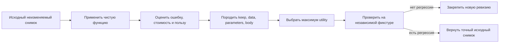

# Iyerarkhiya funkcij i dannyikh

Etot Swift-prototip proveryayet minimaljnuyu [iyerarkhiyu funkcij i dannyikh FUM](../../Glossarij/iyerarkhiya-funkcij-i-dannyikh-FUM.md) na konechnoj celochislennoj fiksture. [Chistaya funkciya](../../Glossarij/chistaya-funkciya.md) poluchayet neizmenyayemyij snimok vkhodnyikh dannyikh, parametrov i tela, a cikl `применить -> оценить -> изменить -> закрепить` sravnivayet chetyire atomarnyikh varianta: ostavitj sloj neizmennyim, obnovitj dannyiye, izmenitj parametryi ili zamenitj telo funkcii.

Ozhidayemyij rezuljtat i proverochnaya vyiborka nakhodyatsya vne izmenyayemogo snimka. Poetomu kandidat ne mozhet uluchshitj sobstvennuyu ocenku podmenoj celi. Kazhdyij kandidat stroitsya neposredstvenno ot iskhodnogo snimka i menyayet rovno odin obyyavlennyij sloj; meta-funkciya otbrasyivayet sostavnyiye ili neverno obyyavlennyiye izmeneniya do ocenki.

## Proveryayemyij cikl



Telo funkcii — zakryityij perechislimyij tip: `affine` vyichislyayet `multiplier * x + bias`, a `quadratic` — `multiplier * x * x + bias`. Zamena tela v etom prototipe oznachayet vyibor drugogo zaraneye skompilirovannogo varianta, a ne generaciyu ili ispolneniye novogo Swift-koda.

Dlya kazhdogo kandidata trassa khranit vyikhod, summarnuyu absolyutnuyu oshibku, stoimostj vyichisleniya, tri sostavlyayusjhiye cenyi izmeneniya, poljzu otnositeljno iskhodnoj oshibki i itogovuyu poleznostj:

```text
benefit = baseline_error - candidate_error
total_cost = change_cost + instability_penalty + complexity_penalty
utility = benefit - total_cost
```

Fiksirovannyij profilj illyustriruyet raznyij temp izmeneniya sloyov:

| Dejstviye            | Cena izmeneniya | Shtraf nestabiljnosti | Shtraf slozhnosti                           |
| ------------------- | --------------: | -------------------: | ----------------------------------------- |
| `keep`              |               0 |                    0 | `0`                                       |
| `update_data`       |               1 |                    0 | `0`                                       |
| `change_parameters` |               2 |                    1 | `0`                                       |
| `replace_body`      |               4 |                    2 | rost slozhnosti otnositeljno prezhnego tela |

Konkretnyiye chisla yavlyayutsya parametrami fiksturyi, a ne universaljnyimi koefficiyentami FUM. Pri odinakovoj `utility` determinirovanno vyibirayetsya boleye byistryij sloj v poryadke `keep -> data -> parameters -> body`. Izmeneniye zakreplyayetsya toljko pri polozhiteljnoj poleznosti i otsutstvii regressii na nezavisimoj proverke.

## Bezopasnaya fikstura

Bez argumentov tochka vkhoda vyipolnyayet pyatj scenariyev i pechatayet odin kanonicheski uporyadochennyij JSON-otchyot:

```bash
./Прототипы/иерархия-функций-и-данных/запустить.sh
```

Yavnyij povtor toj zhe fiksturyi:

```bash
./Прототипы/иерархия-функций-и-данных/запустить.sh fixture
```

Poluchitj spravku:

```bash
./Прототипы/иерархия-функций-и-данных/запустить.sh --help
```

| Scenarij            | Proveryayemoye resheniye                                                                      |
| ------------------- | ---------------------------------------------------------------------------------------- |
| `keep`              | tochnyij iskhodnyij sloj ostayotsya bez novoj revizii                                          |
| `update-data`       | izolirovannaya oshibka vkhoda ispravlyayetsya bez izmeneniya parametrov i tela                  |
| `change-parameters` | obsjhij masshtab ispravlyayetsya parametrom, kotoryij prokhodit nezavisimuyu proverku             |
| `replace-body`      | kvadratichnoye telo okupayet boleye vyisokuyu cenu i zakreplyayetsya                              |
| `rollback`          | to zhe telo vyiigryivayet na osnovnoj vyiborke, ukhudshayet proverochnuyu i polnostjyu otkatyivayetsya |

Probnik ne chitayet fajlyi, ne obrasjhayetsya k seti, ne zapuskayet subprocess i ne prinimayet ispolnyayemyij kod. Vse dannyiye scenariyev vstroyenyi v paket.

## Proverki

```bash
swift test --package-path Прототипы/иерархия-функций-и-данных
swift build \
  --package-path Прототипы/иерархия-функций-и-данных \
  --product FUMFunctionHierarchyProbe
swift format lint \
  --configuration Инструменты/fum-kompleksnaya-proverka-repozitoriya/swift-format.json \
  --strict \
  --recursive \
  Прототипы/иерархия-функций-и-данных/Package.swift \
  Прототипы/иерархия-функций-и-данных/Sources \
  Прототипы/иерархия-функций-и-данных/Tests
```

Avtonomnyij nabor proveryayet chistotu i povtoryayemostj primeneniya, polnuyu ekonomiku trassyi, kazhdoye iz chetyiryokh reshenij, preimusjhestvo poleznosti nad minimaljnoj syiroj oshibkoj, ustojchivoye razresheniye ravenstva, uspeshnoye zakrepleniye, otkat do tochnogo iskhodnogo znacheniya, atomarnostj kandidatov, nesovpadeniye razmera celi i celochislennoye perepolneniye.

## Struktura

- `Sources/FUMFunctionHierarchy/` — neizmenyayemyiye tipyi, chistoye primeneniye, generator atomarnyikh kandidatov, ocenka, meta-vyibor, proverka i otkat;
- `Sources/FUMFunctionHierarchyProbe/` — pyatj bezopasnyikh vstroyennyikh scenariyev i JSON-otchyot;
- `Tests/FUMFunctionHierarchyTests/` — avtonomnyiye proverki bez seti, sekretov i vneshnikh zavisimostej;
- `Package.swift` — samostoyateljnyij SwiftPM-paket;
- `запустить.sh` — obsjhaya POSIX-tochka vkhoda prototipa.

## Granica primenimosti

Rezuljtat dokazyivayet razlicheniye dannyikh, parametrov, tela i neizmenyayemoj meta-funkcii na odnoj maloj determinirovannoj modeli. On ne dokazyivayet obucheniye nejroseti ili LLM, avtomaticheskij poisk khoroshikh mutacij, sintez i bezopasnoye ispolneniye koda, korrektnostj vyibrannyikh vesov stoimosti, statisticheskuyu obobsjhayemostj, dliteljnuyu rabotu na potoke, konkurentnostj, persistentnostj, mnogourovnevuyu rekursiyu meta-funkcij ili izmeneniye samoj politiki otbora.

Kandidatyi zaraneye zadanyi fiksturoj, a obnovleniye dannyikh dopustimo toljko kak variant s vneshnim proiskhozhdeniyem; celj i proverochnyiye primeryi ostayutsya neizmenyayemyimi. Proverka na odnoj konechnoj vyiborke pokazyivayet mekhanizm fail-closed otkata, no ne utverzhdayet, chto zakreplyonnyij variant ustojchivo luchshe v realjnoj srede. Otkat zdesj yavlyayetsya vozvratom iskhodnogo value-snimka v pamyati processa, a ne tranzakciyej vneshnego sostoyaniya.

Status: dejstvuyusjhij proverochnyij prototip. Paket sobirayetsya, avtonomnyiye testyi i strogij formatnyij lint prokhodyat, bezopasnaya fikstura vosproizvodimo pokazyivayet `keep`, obnovleniye dannyikh, izmeneniye parametrov, zamenu tela i otkat.

## Istochniki trebovanij

- [iskhodnyij zapros tekusjhej rabochej sessii](../../Zhurnal/2026-07-23_19-08-00_MSK_proveritj-minimaljnyij-Swift-prototip-iyerarkhii-funkcij-i-dannyikh-FUM/zapros.md)
- [zavershyonnaya kartochka FUM-STEP-0001](../../Planirovaniye/kartochki-shagov/✅-FUM-STEP-0001-proveritj-minimaljnyij-Swift-prototip-iyerarkhii-funkcij-i-dannyikh-FUM.md)
- [iskhodnyij zapros ob iyerarkhii funkcij i dannyikh](../../Zhurnal/2026-07-06_14-49-39_MSK_opisatj-iyerarkhiyu-funkcij-i-dannyikh/zapros.md)
- [utochneniye iyerarkhii funkcij i dannyikh](../../Zhurnal/2026-07-06_15-00-09_MSK_utochnitj-iyerarkhiyu-funkcij-i-dannyikh/zapros.md)

## Opornyiye materialyi

- [Iyerarkhiya funkcij i dannyikh FUM](../../Glossarij/iyerarkhiya-funkcij-i-dannyikh-FUM.md)
- [Potokovaya samostrukturizaciya FUM](../../Dokumentaciya/32-potokovaya-samostrukturizaciya-FUM.md)
- [Moduljnaya arkhitektura FUM](../../Dokumentaciya/05-moduljnaya-arkhitektura-FUM.md)
- [Arkhitektura FUM](../../Dokumentaciya/22-arkhitektura-FUM.md)
- [Evolyuciya i myishleniye](../../Dokumentaciya/03-evolyuciya-i-myishleniye.md)

<!-- FUM-MD-RECENCY:BEGIN -->
<!-- last-content-edit: 2026-08-03 14:54:04 MSK -->
<!-- content-sha256: sha256:ef16b97dba5827f4a5a7a54d324cd02638f1f932a8952133c83288a81ab27232 -->
<!-- FUM-MD-RECENCY:END -->
