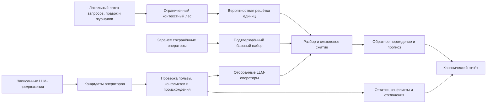

# Pamyatj strukturiruyusjhikh operatorov

Etot Swift-prototip proveryayet minimaljnuyu [pamyatj FUM](../../Glossarij/pamyatj-FUM.md), v kotoroj [strukturiruyusjhiye operatoryi FUM](../../Glossarij/strukturiruyusjhij-operator-FUM.md) odnovremenno raspoznayut malyij lokaljnyij potok zaprosov, pravok i zhurnalov, dayut kompaktnoye opisaniye najdennoj strukturyi i uchastvuyut v obratnom porozhdenii. Ogranichennyij kontekstnyij les sokhranyayet kontekstyi v predelakh zadannogo byudzheta i determinirovanno otsekayet novyiye posle yego ischerpaniya, veroyatnostnaya reshyotka uderzhivayet konkuriruyusjhiye yedinicyi razbora, a [sistema strukturiruyusjhikh operatorov FUM](../../Glossarij/sistema-strukturiruyusjhikh-operatorov-FUM.md) svyazyivayet formu, smyisl, obyyasneniye i proveryayemoye dejstviye.

Prototip sopostavlyayet rezhim zaraneye sokhranyonnyikh operatorov s rezhimom LLM-popolneniya. Vtoroj rezhim ispoljzuyet toljko determinirovannyij adapter zapisannoj fiksturyi: on vosproizvodit zaraneye sokhranyonnyiye predlozheniya modeli, ne vyizyivayet vneshnyuyu LLM, ne obrasjhayetsya k seti i ne vyidayot zapisannyij otvet za zhivoye modeljnoye ispolneniye. Predlozheniya adaptera prokhodyat proverku vyiigryisha, konfliktov, obratimosti i proiskhozhdeniya; zaraneye sokhranyonnyiye operatoryi obrazuyut obyyavlennyij fiksturoj podtverzhdyonnyij bazovyij nabor, a otchyot razlichayet proiskhozhdeniye oboikh istochnikov.

## Proveryayemyij kontur



[Suffiksno-prediktivnaya pamyatj FUM](../../Glossarij/suffiksno-prediktivnaya-pamyatj-FUM.md) predstavlena konechnyim lesom kontekstov peremennoj dlinyi. Byudzhet fiksturyi ogranichivayet glubinu i chislo uzlov; posle ischerpaniya byudzheta novyiye kontekstyi determinirovanno otsekayutsya, a les ne rastyot neogranichenno. Otchyot razlichayet ustanovlennyij limit, fakticheskoye ispoljzovaniye i otsechyonnyiye elementyi.

[Samotokenizaciya FUM](../../Glossarij/samotokenizaciya-FUM.md) predstavlena veroyatnostnoj reshyotkoj, gde odin fragment mozhet imetj neskoljko konkuriruyusjhikh razborov. Nizkourovnevyiye operatoryi formyi opisyivayut okonchaniya, suffiksyi i variantyi zapisi, a boleye vyisokiye operatoryi svyazyivayut yazyikovyiye realizacii cherez obsjhij semanticheskij uzel. Mezhyyazyikovoj perekhod ne stirayet yazyikovo-specifichnyij ostatok i ne vyidayot chastichnoye sootvetstviye za polnuyu ekvivalentnostj.

## Operatoryi, kandidatyi i otbor

Pamyatj khranit versiyu operatora, urovenj, usloviya raspoznavaniya, pravila porozhdeniya, polozhiteljnyiye i otricateljnyiye primeryi, svyazi s nizhnimi i verkhnimi urovnyami, cenu khraneniya, doveriye i proiskhozhdeniye. Stratificirovannyiye svyazi obrazuyut proveryayemyij graf formyi, morfosintaksisa, semantiki, diskursa i ispolnyayemoj proyekcii, a ne ploskij spisok pravil.

Otchyot razdelyayet neskoljko urovnej nablyudeniya:

- scenarnyiye metriki soderzhat obsjhij vyiigryish predskazaniya, vyiigryish szhatiya s nastroyennoj stoimostjyu ssyilki, kachestvo obratnogo porozhdeniya, priznaki tochnogo i operatornogo vosstanovleniya, obyyomyi syirogo i operatorno porozhdyonnogo vkhoda;
- otchyot kazhdogo operatornogo kandidata soderzhit podderzhku, sobstvennyiye vyiigryishi predskazaniya i szhatiya, kachestvo obratnogo porozhdeniya, istochnik, konfliktyi, istoriyu perekhodov i itogovyij status `hypothesis`, `low_confidence`, `confirmed`, `conflicting`, `rejected` ili `obsolete`;
- reshyotka kazhdogo vkhodnogo elementa soderzhit konkuriruyusjhiye yedinicyi, ikh normirovannyiye veroyatnosti, syiroj ves, sposob rekonstrukcii i vyibrannyij putj, no ne povtoryayet scenarnyiye gain-metriki;
- ostatki, konfliktyi i sobyitiya pruning publikuyutsya otdeljnyimi kollekciyami; udalyonnyij kandidat poluchayet `obsolete`, a yego identifikator i istoriya otbora ostayutsya v otchyote;
- semanticheskaya svyazj obyyasneniya mozhet otdeljno imetj status `pending_external_review`.

Oshibochnyij ili nepolnyij vkhod snachala stanovitsya diagnosticheskim ostatkom. Nesposobnostj tekusjhej pamyati razobratj fragment sama po sebe ne sozdayot novyij poleznyij operator: kandidat dolzhen povtorno primenyatjsya, davatj polozhiteljnyij vyiigryish i ne ukhudshatj trebuyemuyu obratimostj. Metriki predstavlenyi celochislennyimi `predictionGainMilliBits`, `compressionGainBits` i `roundTripQualityPPM`; veroyatnosti reshyotki normiruyutsya v celyikh millionnyikh dolyakh. Ravnyiye Viterbi-ocenki razreshayutsya chislom yedinic i ustojchivyim poryadkom identifikatorov, poetomu povtornyij zapusk odnoj fiksturyi dayot tot zhe snimok.

## Rezhimyi istochnika operatorov

V rezhime zaraneye sokhranyonnyikh operatorov razbor ispoljzuyet toljko versionnyij nabor iz fiksturyi. V rezhime LLM-popolneniya tot zhe nabor dopolnyayetsya predlozheniyami cherez kontrakt adaptera. Zapisannyij adapter chitayet kanonicheskij konvert s identifikatorom modeli, tekstom i khyeshem zaprosa, khyeshem kanonicheskogo massiva tipizirovannyikh predlozhenij i samimi predlozheniyami; zagruzchik pereschityivayet oba khyesha i proveryayet profili i prostranstva imyon do indeksirovaniya. Otchyot yavno ukazyivayet istochnik zapisannoj fiksturyi i otsutstviye vneshnego modeljnogo ispolneniya.

Takoj rezhim proveryayet granicu integracii, statusyi i otbor LLM-predlozhenij, no ne kachestvo neizvestnoj modeli i ne dostupnostj vneshnego runtime. V scenarii sinkhronizacii odin [FUM-uzel](../../Glossarij/FUM-uzel.md) pomechen kak LLM-podderzhivayemyij agent imenno cherez etot zapisannyij adapter.

## Proveryayemyiye fiksturyi

| Identifikator fiksturyi     | Proveryayemyij rezuljtat                                                                                                                                                                    |
| -------------------------- | ---------------------------------------------------------------------------------------------------------------------------------------------------------------------------------------- |
| `local_stream`             | Zaprosyi, pravki, zhurnalyi i zapisj sessii stroyat ogranichennyij kontekstnyij les, aljternativyi veroyatnostnoj reshyotki i nablyudayemoye pruning.                                                  |
| `bad_input_rejection`      | Opechatka v TeX sokhranyayetsya kak diagnosticheskij ostatok; zapisannyij LLM-kandidat oshibochnoj formyi otklonyayetsya i ne stanovitsya operatorom.                                                  |
| `exact_roundtrip`          | Markdown, TeX i Swift-kod prokhodyat razbor cherez zaraneye sokhranyonnyiye sintaksicheskiye operatoryi i pobajtovo vosstanavlivayutsya s tem zhe SHA-256.                                             |
| `semantic_compression`     | Operatoryi zazemlyayut smyislovyiye faktyi v bajtovyikh diapazonakh planovogo teksta; boleye korotkoye opisaniye sokhranyayet obyazateljnyiye slotyi i proiskhozhdeniye, no ne obyyavlyayetsya iskhodnoj strokoj.    |
| `language_forms`           | Russkiye okonchaniya, soglasovaniye i transliteraciya obrabatyivayutsya yazyikovo-specifichnyimi operatorami bez perenosa poverkhnostnogo pravila na drugoj yazyik.                                     |
| `cross_language_graph`     | Russkaya i anglijskaya konstrukcii svyazanyi cherez obsjhij sobyitijnyij frejm i stratyi `form → syntax → semantic`; vid, artiklj i neodnoznachnostj mestoimenij ostayutsya yavnyimi ostatkami.         |
| `explainability_and_links` | Chelovecheskoye i oriyentirovannoye na LLM predstavleniya obyyasneniya, simvolicheskij operator, primeryi i polozhiteljnyiye, otricateljnyiye libo neodnoznachnyiye svyazi soyedinyayutsya proveryayemoj trassoj. |
| `automation_projection`    | Ogranichennyij fragment [yazyika avtomatizacij FUM](../../Glossarij/yazyik-avtomatizacij-FUM.md) vyivoditsya iz operatornogo grafa i ispolnyayetsya chistyim zakryityim interpretatorom.                |
| `sync_external_confirmed`  | Chelovekopodobnyij i LLM-podderzhivayemyij uzlyi s raznoj lokaljnoj pamyatjyu prokhodyat polnyij cikl sinkhronizacii i razreshyonnoye sovmestnoye dejstviye.                                              |
| `sync_external_divergence` | Nesovmestimyij pereskaz sokhranyayetsya kak raskhozhdeniye; lozhnogo podtverzhdeniya i sovmestnogo dejstviya net.                                                                                    |
| `sync_internal_subnodes`   | Tot zhe redjyuser, protokol i tipyi trassyi povtoryayut polnyij kontur mezhdu vnutrennimi poduzlami `planner` i `executor`.                                                                      |

Fiksturyi sovmestno pokryivayut malyij potok zaprosov, pravok i zhurnalov. Sokhranyonnyiye ozhidaniya scenariyev i kanonicheskij otchyot dvizhka delayut nablyudayemyimi iskhodnyiye elementyi, primenyonnyiye versii operatorov, predlozheniya adaptera, kandidatov i ikh statusyi, vyibrannyiye razboryi, ostatki, konfliktyi, pruning, metriki, tipyi aktov sinkhronizacii, rolevyiye privyazki, snimki faktov s ikh istoriyej i itogovoye dejstviye.

## Sinkhronizaciya znanij

[Yestestvenno-yazyikovaya sinkhronizaciya znanij FUM](../../Glossarij/yestestvenno-yazyikovaya-sinkhronizaciya-znanij-FUM.md) ne kopiruyet operatornuyu pamyatj mezhdu uzlami. Sinkhronizacionnyij snimok sokhranyayet dlya kazhdogo uzla yego tip, tekusjhiye faktyi i otdeljnuyu istoriyu faktov; obsjhaya trassa khranit posledovateljnostj tipov rechevyikh aktov, rolevyiye privyazki, raskhozhdeniya i itog sovmestnogo dejstviya. Redjyuser proveryayet uchastnikov kazhdogo akta po fiksture. Referentyi `я`, `ты`, `мы`, `вы` i `они` poluchayut yavnyiye rolevyiye privyazki, otdelyonnyiye ot identichnosti uzla, sostava gruppyi, dostavki, dostupa i polnomochij.

Scenarij vneshnikh uzlov vklyuchayet utverzhdeniye, vopros, utochneniye, ispravleniye, pereskaz i podtverzhdeniye. Yesli podtverzhdeniye nevozmozhno, raskhozhdeniye ostayotsya yavnyim i ne maskiruyetsya lozhnyim soglasiyem. Sovmestnoye dejstviye poyavlyayetsya toljko posle dostatochnogo dlya nego soglasovaniya. Otdeljnyij scenarij peredayot tot zhe potok mezhdu vnutrennimi poduzlami i proveryayet tot zhe dvizhok, skhemu otchyota i pravila sokhraneniya raskhozhdeniya.

## Proiskhozhdeniye i vosproizvodimostj

Kanonicheskij otchyot svyazyivayet kazhdyij vyivod s identifikatorami vkhodnyikh elementov, operatorami i ikh versiyami, rezhimom istochnika, zapisannyim predlozheniyem LLM-adaptera, rezuljtatami metrik, konfliktami i resheniyem otbora. Khyesh nabora fiksiruyet kanonicheskij logicheskij snimok dekodirovannyikh fikstur, a khyeshi vkhodnyikh elementov — ikh tochnyiye bajtyi; ni odin iz nikh ne dokazyivayet istinnostj soderzhasjhikhsya utverzhdenij.

Probnik ne zapisyivayet poljzovateljskiye fajlyi, ne obrasjhayetsya k seti, ne zapuskayet vneshnij kod i ne sobirayet hostname, poljzovateljskiye katalogi ili drugiye mashinno-lokaljnyiye identifikatoryi. Vyivod yavlyayetsya determinirovannyim JSON-otchyotom, prigodnyim dlya tochnogo sravneniya v avtonomnyikh testakh.

## Kak zapustitj

Bez argumentov tochka vkhoda vyipolnyayet vesj bezopasnyij nabor determinirovannyikh fikstur:

```bash
./Прототипы/память-структурирующих-операторов/запустить.sh
```

Yavnyij povtor i spravka:

```bash
./Прототипы/память-структурирующих-операторов/запустить.sh --list
./Прототипы/память-структурирующих-операторов/запустить.sh fixture exact_roundtrip
./Прототипы/память-структурирующих-операторов/запустить.sh --help
```

## Proverki

```bash
swift test \
  --package-path Прототипы/память-структурирующих-операторов
swift build \
  --package-path Прототипы/память-структурирующих-операторов \
  --product FUMStructuringOperatorMemoryProbe
swift format lint \
  --configuration Инструменты/fum-kompleksnaya-proverka-repozitoriya/swift-format.json \
  --strict \
  --recursive \
  Прототипы/память-структурирующих-операторов/Package.swift \
  Прототипы/память-структурирующих-операторов/Sources \
  Прототипы/память-структурирующих-операторов/Tests
```

Avtonomnyiye testyi podtverzhdayut determinizm kanonicheskogo otchyota, limityi lesa, reshyotki i kandidatov, rezhimyi istochnika, gain-metriki, kachestvo obratnogo porozhdeniya, statusyi i pruning, diagnosticheskiye ostatki, konfliktyi, yazyikovyiye urovni, stratificirovannyiye svyazi, simvolicheskuyu obyyasnimostj, ispolnyayemuyu proyekciyu i tri scenariya sinkhronizacii. Otricateljnyiye proverki otklonyayut povrezhdyonnyij konvert, nevalidnyiye khyeshi i profili, kollizii identifikatorov, visyachiye grafovyiye i smyislovyiye svyazi, nepodtverzhdyonnuyu avtomatizaciyu, nerelevantnoye podtverzhdeniye i lozhnopolozhiteljnyij smyislovoj fakt; veroyatnaya oshibka vkhoda ne stanovitsya operatorom.

## Struktura

- `Sources/FUMStructuringOperatorMemory/` — neizmenyayemyiye kontraktyi, ogranichennyij kontekstnyij les, veroyatnostnaya reshyotka, operatornaya pamyatj, razbor, porozhdeniye, metriki, otbor, sinkhronizaciya i otchyotyi;
- `Sources/FUMStructuringOperatorMemory/Фикстуры/` — vkhodnyiye scenarii s proveryayemyimi ozhidaniyami i povrezhdyonnyij otricateljnyij LLM-konvert, upakovannyiye SwiftPM kak resursyi library target;
- `Sources/FUMStructuringOperatorMemoryProbe/` — bezopasnyij zapusk polnogo nabora fikstur i spravka;
- `Tests/FUMStructuringOperatorMemoryTests/` — avtonomnaya priyomka bez seti, sekretov i vneshnikh zavisimostej;
- `Package.swift` — samostoyateljnyij SwiftPM-paket bez vneshnikh zavisimostej;
- `запустить.sh` — POSIX-tochka vkhoda, nezavisimaya ot tekusjhego kataloga.

## Granica primenimosti

Prototip podtverzhdayet toljko mekhaniku neboljshogo konechnogo nabora vruchnuyu podgotovlennyikh potokov i operatorov. Yego pruning so statusom `obsolete` i sokhraneniyem istorii kandidata ne realizuyet [upravlyayemoye zabyivaniye FUM](../../Glossarij/upravlyayemoye-zabyivaniye-FUM.md): u prototipa net pokonturnogo vesa i poroga prekrasjheniya rabotyi, meta-urovnya obnaruzheniya, razdeleniya khraneniya i rabotosposobnosti, [vspominaniya FUM](../../Glossarij/vspominaniye-FUM.md), bezvozvratnogo zabyivaniya ili otbora ikh tempa. On takzhe ne dokazyivayet kachestvo samotokenizacii na proizvoljnyikh dannyikh, statisticheskuyu kalibrovku veroyatnostej, universaljnostj koefficiyentov poljzyi, polnotu russkogo ili anglijskogo yazyika, korrektnostj proizvoljnogo perevoda, bezopasnostj sintezirovannoj programmyi, dolgovremennuyu konsolidaciyu pamyati ili effektivnostj na boljshom potoke.

Zapisannyij LLM-adapter ne ispolnyayet modelj, ne izmeryayet yeyo variativnostj i ne podtverzhdayet kachestvo zhivyikh predlozhenij. Scenarii sinkhronizacii rabotayut posledovateljno v odnom processe i ne dokazyivayut raspredelyonnuyu soglasovannostj, konkurentnostj, razgranicheniye dostupa ili ustojchivostj k nedoverennomu uzlu. Vnutrenniye poduzlyi predstavlenyi tem zhe lokaljnyim protokolom, no prototip ne utverzhdayet ikh otdeljnoye soznaniye, samostoyateljnyij runtime ili gotovyij [agentskij cikl](../../Glossarij/agentskij-cikl.md).

Svyazj s yazyikom avtomatizacij ogranichena odnoj zaraneye zadannoj ispolnyayemoj proyekciyej operatornoj sistemyi. Ona ne yavlyayetsya gotovoj grammatikoj yazyika, kompilyatorom ili razresheniyem na vneshniye effektyi. Vse chislennyiye metriki i porogi prinadlezhat proverochnoj fiksture i ne schitayutsya universaljnyimi parametrami FUM.

Status: ogranichennyij proverochnyij Swift-prototip s avtonomnyimi fiksturami i chestnoj granicej zapisannogo LLM-adaptera.

## Istochniki trebovanij

- [iskhodnyij zapros 2026-07-31 12:20:47 MSK - Utochnitj vspominaniye i bezvozvratnoye zabyivaniye](../../Zhurnal/2026-07-31_12-20-47_MSK_utochnitj-vspominaniye-i-bezvozvratnoye-zabyivaniye/zapros.md)
- [iskhodnyij zapros 2026-07-31 11:57:37 MSK - Zakrepitj upravlyayemoye zabyivaniye FUM](../../Zhurnal/2026-07-31_11-57-37_MSK_zakrepitj-upravlyayemoye-zabyivaniye-FUM/zapros.md)

- [iskhodnyij zapros tekusjhej rabochej sessii](../../Zhurnal/2026-07-24_03-39-33_MSK_podgotovitj-Swift-prototip-pamyati-strukturiruyusjhikh-operatorov-FUM/zapros.md)

## Opornyiye materialyi

- [Potokovaya samostrukturizaciya FUM](../../Dokumentaciya/32-potokovaya-samostrukturizaciya-FUM.md)
- [Sistema strukturiruyusjhikh operatorov FUM](../../Dokumentaciya/33-sistema-strukturiruyusjhikh-operatorov-FUM.md)
- [Yestestvennyij yazyik i sinkhronizaciya znanij FUM](../../Dokumentaciya/34-yestestvennyij-yazyik-i-sinkhronizaciya-znanij-FUM.md)
- [LLM-oriyentirovannyij yazyik avtomatizacij](../../Dokumentaciya/21-LLM-oriyentirovannyij-yazyik-avtomatizacij.md)
- [Modelj pamyati FUM](../../Dokumentaciya/01-modelj-pamyati-FUM.md)
- [Arkhitektura FUM](../../Dokumentaciya/22-arkhitektura-FUM.md)
- [otkryityij vopros o granicakh yestestvenno-yazyikovoj sinkhronizacii znanij FUM](../../Voprosyi/2026-07-13_20-34-23_MSK_granicyi-yestestvenno-yazyikovoj-sinkhronizacii-znanij-FUM.md)

<!-- FUM-MD-RECENCY:BEGIN -->
<!-- last-content-edit: 2026-08-03 14:54:04 MSK -->
<!-- content-sha256: sha256:375385dc4a117cf357bb22d9d2fd87b0f6d67b049048ebcc4b480e2f82b86da7 -->
<!-- FUM-MD-RECENCY:END -->
