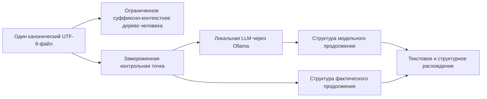

# Tenevoj redaktor prodolzhenij

Etot prototip yavlyayetsya pervyim dejstvuyusjhim vertikaljnyim srezom [korobochnoj realizacii FUM](../../Glossarij/korobochnaya-realizaciya-FUM.md) v tekusjhej osnovnoj linii repozitoriya: chelovek rabotayet s odnim boljshim tekstovyim fajlom, lokaljnaya LLM nezavisimo prodolzhayet zamorozhennyij prefiks, a obe vetvi poluchayut odinakovuyu ogranichennuyu [suffiksno-prediktivnuyu strukturu](../../Glossarij/suffiksno-prediktivnaya-pamyatj-FUM.md). Posle nabora chelovecheskogo prodolzheniya redaktor raskryivayet modeljnuyu gipotezu i pokazyivayet nablyudayemoye raskhozhdeniye teksta i struktur.

Prototip ne obyyavlyayet eto raskhozhdeniye pryamyim dostupom k myisli cheloveka. On proveryayet boleye uzkij i vosproizvodimyij signal: kak konkretnaya lokaljnaya modelj prodolzhila dostupnyij yej tekst i kak tot zhe prefiks fakticheski prodolzhil konkretnyij chelovek.

## Proveryayemyij kontur



Redaktor sozdayot kontroljnuyu tochku posle korotkoj pauzyi ili po knopke. Ona fiksiruyet versiyu dokumenta, dlinu i ustojchivyij diagnosticheskij otpechatok prefiksa, ogranichennoye kontekstnoye okno, modelj, gorizont i konfiguraciyu indeksa. Prognoz stroitsya v tenevom rezhime: poka chelovek ne naberyot zadannyij gorizont, soderzhimoye gipotezyi skryito. Novyij vvod imeyet prioritet; po mere postupleniya modeljnyikh i chelovecheskikh bajtov obe proizvodnyiye strukturyi rastut potokovo. Pri dostizhenii gorizonta modeljnyij process ostanavlivayetsya, i v sravneniye popadayet stoljko prodolzheniya, skoljko lokaljnaya LLM uspela poroditj.

Byistryij indeks realizovan kak ogranichennoye derevo tochnyikh suffiksnyikh kontekstov po UTF-8-bajtam. Puti khranyatsya v obratnom poryadke, poetomu novyij bajt obnovlyayet vse kontekstyi ne glubzhe zadannogo predela za `O(maxDepth)`. Byudzhet uzlov ogranichen, a propusjhennyiye rasshireniya otobrazhayutsya diagnostikoj. Eto minimaljnyij ispolnyayemyij baseline, a ne polnoye neogranichennoye suffiksnoye derevo i ne okonchateljnaya forma pamyati FUM.

Dlya sravneniya ispoljzuyutsya dlina obsjhego bajtovogo prefiksa, redakcionnoye rasstoyaniye, yego normirovannoye znacheniye, vesa obsjhikh i razdeljnyikh kontekstnyikh perekhodov i vzveshennoye skhodstvo Zhakkara. Veroyatnostnyij log-loss ne podmenyayetsya nulyom: tekusjhij CLI-kontrakt Ollama ne predostavlyayet dostatochnyikh veroyatnostnyikh dannyikh, poetomu eta metrika ostayotsya sleduyusjhim rasshireniyem.

## Chto vkhodit

- macOS-redaktor na `NSTextView` dlya odnogo UTF-8-fajla;
- avtomaticheskoye lokaljnoye sokhraneniye otkryitogo fajla;
- potokovoye i byudzhetirovannoye suffiksno-kontekstnoye derevo osnovnogo teksta;
- odna neperekryivayusjhayasya tenevaya kontroljnaya tochka;
- lokaljnyij subprocess-kontrakt Ollama bez shell i bez peredachi teksta v argumentakh processa;
- predvariteljnaya proverka `ollama show`, ne pozvolyayusjhaya `ollama run` avtomaticheski zagruzitj otsutstvuyusjhuyu modelj;
- strogaya proverka kanonicheskogo imeni modeli, chtobyi znacheniye ne moglo statj CLI-flagom, URL ili obkhodom puti;
- prinuditeljnyij loopback-adres runtime i otklyucheniye istorii Ollama dlya dochernikh processov;
- potokovaya normalizaciya stdout, kotoraya snimayet polnoye ekho prefiksa i otklonyayet pustoj vyivod, usechyonnoye ekho i spravku CLI;
- ostanovka generacii po gorizontu, tajm-autu, otmene ili zaversheniyu chelovecheskoj vetvi;
- odinakovyiye potokovo rastusjhiye proizvodnyiye strukturyi dvukh prodolzhenij i izmerimyiye metriki;
- vyiklyuchennaya po umolchaniyu lokaljnaya JSONL-trassa ryadom s dokumentom i yavnoye udaleniye fajla etoj trassyi;
- headless-probnik realjnoj lokaljnoj LLM;
- avtonomnyiye testyi yadra bez seti, Ollama i modeli.

## Kak zapustitj

Nuzhnyi Swift 6 ili noveye, zapusjhennyij lokaljnyij Ollama i uzhe ustanovlennaya modelj. Prototip sam modeli ne zagruzhayet. Prostoj zapusk iz kornya repozitoriya:

```bash
ollama serve
ollama list
FUM_LLM_MODEL=<имя-установленной-модели> \
  ./Прототипы/теневой-редактор-продолжений/запустить.sh \
  /путь/к/текстовому-файлу.txt
```

Putj k fajlu neobyazatelen: bez nego otkroyetsya pustoj redaktor, v kotorom dokument mozhno vyibratj ili sokhranitj cherez interfejs. Skript rabotayet iz lyubogo tekusjhego kataloga i podderzhivayet `--help`. Yesli Ollama nakhoditsya ne v odnom iz standartnyikh putej, zadayotsya publikacionno bezopasnaya peremennaya okruzheniya `FUM_OLLAMA_EXECUTABLE` s lokaljnyim putyom k ispolnyayemomu fajlu. Imya modeli takzhe mozhno vvesti v pole redaktora.

Proverka toljko modeljnogo adaptera bez GUI:

```bash
swift run \
  --package-path Прототипы/теневой-редактор-продолжений \
  FUMShadowProbe \
  --model <имя-установленной-модели> \
  --context "Проверяемый префикс текста" \
  --horizon 128
```

Lokaljnyiye testyi i sborka:

```bash
swift test --package-path Прототипы/теневой-редактор-продолжений
swift build --package-path Прототипы/теневой-редактор-продолжений --product FUMShadowEditor
swift build --package-path Прототипы/теневой-редактор-продолжений --product FUMShadowProbe
```

Obsjhij [smoke-check repozitoriya](../../Instrumentyi/fum-kompleksnaya-proverka-repozitoriya/SKILL.md) avtomaticheski nakhodit paket, sveryayet oba ispolnyayemyikh produkta s proveryayemyim inventaryom, zapuskayet 30 avtonomnyikh testov, otdeljno sobirayet oba produkta i primenyayet strogij `swift format lint` k manifestu i vsem Swift-fajlam celej. Istoricheskoye khyesh-privyazannoye isklyucheniye udaleno posle otdeljnoj mekhanicheskoj normalizacii vsego paketa; tekusjhaya [politika SwiftPM-paketov](../../Instrumentyi/fum-kompleksnaya-proverka-repozitoriya/swift-package-policy.json) ne oslablyayet lint dlya tenevogo redaktora.

## Khraneniye i privatnostj

Vyibrannyij tekstovyij fajl ostayotsya yedinstvennyim kanonicheskim chelovecheskim dokumentom. Suffiksnyij indeks peresobirayem i ne sokhranyayetsya. Sokhraneniye zavershyonnyikh sravnenij po umolchaniyu vyiklyucheno i vklyuchayetsya otdeljnyim pereklyuchatelem. Togda ryadom s dokumentom sozdayotsya sluzhebnaya papka `<имя-файла>.fum/` s `comparisons.jsonl`: katalog poluchayet prava `0700`, fajl - `0600`. Zapisj soderzhit metadannyiye kontroljnoj tochki, dva korotkikh prodolzheniya i metriki, no ne sokhranyayet peredannoye modeli kontekstnoye okno. Knopka udaleniya udalyayet toljko prinadlezhasjhij prototipu `comparisons.jsonl` i ostavlyayet neizvestnyiye fajlyi sluzhebnoj papki netronutyimi.

Prototip ne perekhvatyivayet vvod globaljno, ne chitayet drugiye dokumentyi i ne soderzhit oblachnogo fallback. Ollama vyizyivayetsya toljko cherez lokaljnyij loopback, a otsutstvuyusjhaya modelj ne zagruzhayetsya avtomaticheski. Granica doveriya ostayotsya na vyibrannom lokaljnom ispolnyayemom fajle Ollama i yego daemon: prototip ne dokazyivayet vnutrenneye ustrojstvo podmenyonnogo executable. Chernovik i korotkiye prodolzheniya ostayutsya chuvstviteljnyimi lokaljnyimi dannyimi, poetomu sokhraneniye trassyi trebuyet yavnogo opt-in dlya konkretnogo zapuska.

## Struktura paketa

- `Sources/FUMShadowCore/` - suffiksno-kontekstnoye derevo, dve vetvi, metriki, kontroljnaya tochka, lokaljnyij process i Ollama-adapter;
- `Sources/FUMShadowEditor/` - macOS-redaktor, upravleniye fajlom, tenevoj cikl, inspektor i lokaljnaya trassa;
- `Sources/FUMShadowProbe/` - headless-proverka ustanovlennoj lokaljnoj modeli;
- `Tests/FUMShadowCoreTests/` - avtonomnyiye testyi dereva, vetvej, kontroljnoj tochki, metrik i subprocess-kontrakta.

## Proverennyij rezuljtat

Testyi byili snachala dobavlenyi v krasnom sostoyanii, zatem realizaciya dovedena do ikh prokhozhdeniya. Avtonomnyij nabor iz 30 testov proveryayet izvestnyiye perekhodyi `banana`, ekvivalentnostj potokovogo i paketnogo postroyeniya, kirillicu, byudzhet uzlov, otmenyayemuyu peresborku, dve rastusjhiye strukturyi prodolzheniya, metriki, neizmenyayemostj i invalidirovaniye kontroljnoj tochki, inkrementaljnoye dopisyivaniye, bezopasnuyu peredachu shell-metasimvolov cherez stdin, strogiye imena modeli, normalizaciyu modeljnogo stdout, ogranicheniye vyivoda i oshibki dochernego processa.

Pomimo mock-nezavisimyikh testov vyipolnen realjnyij lokaljnyij progon: raneye zagruzhennaya modelj Qwen3 0.6B v kvantovanii Q8 byila vremenno podklyuchena k Ollama 0.31.1, chej lokaljnyij server zapustil inference-process v offline-rezhime na loopback. Uzhestochyonnyij `FUMShadowProbe` poluchil russkoyazyichnoye prodolzheniye, a zapusjhennyij `FUMShadowEditor` avtomaticheski sozdal kontroljnuyu tochku i vyizval tot zhe lokaljnyij modeljnyij kontur, ne sozdav vyiklyuchennuyu po umolchaniyu trassu. Vremennaya modelj i proverochnyiye fajlyi posle priyomki udalenyi. Nazvaniye vremennogo lokaljnogo manifesta i mashinnyij putj k vesam ne yavlyayutsya chastjyu vosproizvodimogo kontrakta; dlya povtoreniya podkhodit lyubaya zaraneye ustanovlennaya modelj, ukazannaya poljzovatelem.

## Ogranicheniya

- Byistryij putj predpolagayet dopisyivaniye v konec. Pravka do kontroljnoj tochki invalidiruyet yeyo, a proizvoljnoye izmeneniye zapuskayet polnuyu fonovuyu peresborku indeksa.
- Tochnaya vstavka v konec obnovlyayet indeks bez polnoj UTF-8-kopii. Peresborka otmenyayema i serializovana, no SwiftUI vsyo yesjhyo peredayot novoye znacheniye stroki celikom, a avtosokhraneniye atomarno perepisyivayet fajl; prigodnostj dlya dejstviteljno boljshikh fajlov trebuyet otdeljnogo benchmark.
- Indeks ogranichen tochnyimi UTF-8-bajtami, glubinoj i chislom uzlov. Grafemnyiye, tokennyiye, morfologicheskiye, smyislovyiye i priblizhyonnyiye predstavleniya poka otsutstvuyut.
- Gorizont sravneniya bajtovyij; poslednij simvol mozhet byitj obrezan na granice UTF-8 i otobrazhyon s zamenyayusjhim znakom, khotya sami bajtovyiye metriki ostayutsya vosproizvodimyimi.
- Odnovremenno podderzhivayetsya odna kontroljnaya tochka, odin fajl, odin poljzovatelj i odin Ollama-provajder.
- Ne realizovanyi logprobs, statisticheskoye sravneniye serii sessij, personalizirovannyij obuchayemyij sloj, vidimoye avtodopolneniye, randomizaciya pokaza, prichinnaya ocenka vliyaniya podskazki i doobucheniye modeli.
- Podpisj i upakovka `.app`, modeljnyij menedzher, otdeljnyij Linux-interfejs i promyishlennyij dinamicheskij indeks ne vkhodyat v etot srez.
- Prototip ne yavlyayetsya vsej korobochnoj FUM, yedinyim prilozheniyem lokaljnoj pamyati ili polnyim agentskim ciklom. On proveryayet uzkij skvoznoj komponent, kotoryij mozhet byitj unasledovan etimi sistemami.

## Status

Status: dejstvuyusjhij issledovateljskij prototip. Yadro, GUI-produkt i headless-probnik sobirayutsya; 30 avtonomnyikh testov prokhodyat; realjnyij lokaljnyij LLM-vyizov i zapusk redaktora proverenyi. Dlya prinyatiya v produktovyij kontur nuzhnyi benchmark boljshikh fajlov, dliteljnyiye poljzovateljskiye progonyi, bezopasnoye zaversheniye nesokhranyonnoj sessii, versionirovannaya identichnostj runtime i modeli, veroyatnostnyiye metriki i resheniye otkryityikh voprosov o prigodnosti lokaljnoj LLM.

## Istochniki trebovanij

- [iskhodnyij zapros 2026-07-22 09:33:05 MSK - Snyatj lint isklyucheniye tenevogo redaktora prodolzhenij](../../Zhurnal/2026-07-22_09-33-05_MSK_snyatj-lint-isklyucheniye-tenevogo-redaktora-prodolzhenij/zapros.md)
- [iskhodnyij zapros 2026-07-14 08:54:56 MSK - Sozdatj prototip raskhozhdeniya prodolzhenij](../../Zhurnal/2026-07-14_08-54-56_MSK_sozdatj-prototip-raskhozhdeniya-prodolzhenij/zapros.md)
- [iskhodnyij zapros 2026-07-14 01:40:47 MSK - Sravnitj prodolzheniye LLM s naborom cheloveka](../../Zhurnal/2026-07-14_01-40-47_MSK_sravnitj-prodolzheniye-LLM-s-naborom-cheloveka/zapros.md)
- [iskhodnyij zapros 2026-07-17 12:20:17 MSK - Sozdatj skriptyi zapuska prototipov](../../Zhurnal/2026-07-17_12-20-17_MSK_sozdatj-skriptyi-zapuska-prototipov/zapros.md)

## Opornyiye materialyi

- [Obobsjhyonnyij poisk povtoryayusjhikhsya posledovateljnostej](../../Dokumentaciya/08-obobsjhyonnyij-poisk-povtoryayusjhikhsya-posledovateljnostej.md)
- [Vnutrenniye modeli drugikh uzlov](../../Dokumentaciya/10-vnutrenniye-modeli-drugikh-uzlov.md)
- [Lokaljnyij agent FUM na vyidelennoj mashine](../../Dokumentaciya/24-lokaljnyij-agent-na-vyidelennoj-mashine.md)
- [Interfejs FUM-uzla](../../Dokumentaciya/25-interfejs-FUM-uzla.md)
- [Potokovaya samostrukturizaciya FUM](../../Dokumentaciya/32-potokovaya-samostrukturizaciya-FUM.md)
- [Granicyi yestestvenno-yazyikovoj sinkhronizacii znanij FUM](../../Voprosyi/2026-07-13_20-34-23_MSK_granicyi-yestestvenno-yazyikovoj-sinkhronizacii-znanij-FUM.md)
- [Kriterii lokaljnoj LLM i vyidelennoj mashinyi FUM](../../Voprosyi/2026-06-25_19-50-33_MSK_kriterii-lokaljnoj-LLM-i-vyidelennoj-mashinyi-FUM.md)

<!-- FUM-MD-RECENCY:BEGIN -->
<!-- last-content-edit: 2026-08-03 14:54:04 MSK -->
<!-- content-sha256: sha256:45a9fce96588cca97d3058cde3c97a50e15243b6cb37b7d31e2373928304f7ba -->
<!-- FUM-MD-RECENCY:END -->
