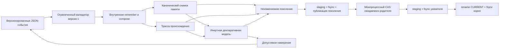

# Vosproizvodimoye popolneniye pamyati

Etot minimaljnyij Swift-prototip bez okon proigryivayet [shtatnoye popolneniye pamyati FUM](../../Glossarij/shtatnoye-popolneniye-pamyati-FUM.md) iz versionirovannogo nabora vkhodnyikh sobyitij. On vyipolnyayet toljko dve ogranichennyiye vnutrenniye operacii, stroit kanonicheskiye snimok pamyati, trassu proiskhozhdeniya i inertnuyu deklarativnuyu modelj predstavleniya, a zatem mozhet atomarno podtverditj rezuljtat kak vosstanavlivayemoye pokoleniye. Pokoleniye skhemyi `3` vstraivayet identifikator [profilya `fum.memory.canonical-json.v1`](../../Dokumentaciya/47-yazyikonejtraljnyij-kanonicheskij-protokol-pamyati.md), yavnyij pustoj seed i polnyij kumulyativnyij zhurnal prinyatyikh sobyitij, poetomu validator zanovo ispolnyayet `remember` i `compose` bez vneshnej fiksturyi. Mezhprocessnyij compare-and-swap linearizuyet publikaciyu `CURRENT` skhemyi `2` mezhdu sotrudnichayusjhimi pisatelyami, a uporyadochennyiye staging-zapisi, `fsync`, publikaciya i sinkhronizaciya katalogov obespechivayut proverennuyu soglasovannostj posle avarii processa. Prinyatyiye kanonizatorom zapisi odnoj programmyi, razlichayusjhiyesya poryadkom polej, razreshyonnyimi probelami ili escape, dayut odin `input_sha256`; soderzhateljnoye izmeneniye vkhoda nablyudayemo menyayet rezuljtat.

Fajlovaya chastj vyidelena v publichnyij skhemonezavisimyij `ContentAddressedGenerationStore`. On odin vladeyet adresaciyej pokolenij, ukazatelem `CURRENT`, mezhprocessnyim CAS i avarijnoj finalizaciyej, a `MemoryGenerationStore` sokhranyayet prezhnij API kak domennyij adapter skhemyi pamyati. To zhe yadro mozhet prinyatj drugoj kanonicheskij nositelj s sobstvennyimi validatorami skhemyi i linii proiskhozhdeniya; semantika `remember` i `compose` pri etom ne perenositsya v obsjhij sloj.

Prototip namerenno ne soderzhit GUI, renderer, seti, sekretov, vneshnikh SwiftPM-zavisimostej i realjnoj LLM. On proveryayet vosstanovleniye pamyati mezhdu processami i proiskhozhdeniye budusjhego predstavleniya, no ne vyidayot serializuyemuyu modelj za zhiznesposobnyij poljzovateljskij interfejs.

## Proveryayemyij kontur



Vkhodnoj nabor soderzhit `schema_version`, `policy_version`, tekhnicheskij `dataset_id` i sobyitiya s nepreryivnoj posledovateljnostjyu `sequence`. Interpretator prinimayet ne boleye 256 sobyitij vo vsej cepochke i ne boleye 1 MiB odnogo vkhoda, ogranichivayet odnu proizvodnuyu zapisj 64 KiB, a sovokupnyiye znacheniya snimka — 4 MiB. Zapisj sozdayotsya odin raz: povtornaya celj otklonyayetsya, poetomu rezuljtat ne zavisit ot skryitoj politiki perezapisi.

Podderzhivayutsya toljko dve operacii:

- `remember` sokhranyayet nepustoye strokovoye znacheniye pod novyim klyuchom;
- `compose` chitayet perechislennyiye raneye sozdannyiye zapisi i soyedinyayet ikh znacheniya zadannyim razdelitelem v novuyu zapisj.

`compose` ne yavlyayetsya universaljnyim yazyikom programmirovaniya i ne mozhet vyizvatj komandu, otkryitj fajl, obratitjsya k seti ili vyipolnitj tekst iz pamyati. Nepodderzhivayemaya operaciya, neizvestnoye ili yavno `null`-pole, propusk nomera, povtornyij identifikator, chteniye otsutstvuyusjhej zapisi i narusheniye limita zavershayutsya determinirovannoj tipizirovannoj oshibkoj bez vyidachi prinyatogo snimka. Otdeljnyij zhurnal otklonyonnyikh kandidatov yesjhyo ne realizovan.

## Snimok, trassa i proiskhozhdeniye

Rezuljtat soderzhit otsortirovannyij po klyuchu `snapshot`, posledovateljnuyu `trace`, `view_model`, SHA-256 kanonicheskoj programmyi vkhodnyikh sobyitij i otdeljnyiye khyeshi tryokh kanonicheskikh predstavlenij, a takzhe sovmestimyij diagnosticheskij blok `gui_projection_prerequisites`. Kazhdyij shag trassyi fiksiruyet identifikator vkhodnogo sobyitiya, chteniya, zapisj, khyesh kanonicheskogo sobyitiya i khyesh sozdannoj zapisi; polnoye telo prinyatogo sobyitiya nakhoditsya v zhurnale pokoleniya. Kazhdaya zapisj pamyati sokhranyayet iskhodnyij nabor, porodivsheye sobyitiye, polnyij uporyadochennyij spisok sobyitij-vkladov i identichnostj zakryitogo interpretatora.

[Kanonicheskij JSON pamyati](../../Dokumentaciya/47-yazyikonejtraljnyij-kanonicheskij-protokol-pamyati.md) ispoljzuyet UTF-8 bez BOM i probelov, ASCII-imena polej v bajtovom poryadke, tochnyiye neotricateljnyiye celyiye do `2^53−1`, glubinu do `128`, odnoznachnyiye pravila Unicode i ekranirovaniya i ne vklyuchayet chasyi, sluchajnyiye chisla, hostname, poljzovateljskiye katalogi libo inoye mashinno-lokaljnoye sostoyaniye. Sobstvennyiye Swift-parser i writer formiruyut bajtyi bez Foundation-serializacii, a uzkij Python-verifier dokazyivayet ikh perenosimostj na obsjhikh golden vectors. CLI dobavlyayet konechnyij `LF` toljko kak vneshnij framing. Vstroyennaya fikstura delitsya na bazovyij i prodolzhayusjhij vkhodyi, no ikh obyyedinyonnyij polnyij replay ostayotsya samostoyateljnyim etalonnyim putyom, a ne gotovyim snimkom pamyati.

## Pokoleniya i vosstanovleniye

`MemoryGeneration` versii `3` sokhranyayet `canonical_profile`, versiyu politiki `fum.memory.policy.v1`, SHA-256 kanonicheskoj programmyi sobyitij tekusjhego perekhoda, ssyilku na predyidusjheye pokoleniye, yavnyij versionirovannyij pustoj seed i kumulyativnuyu `event_journal`-programmu s polnyimi telami vsekh prinyatyikh sobyitij. Validator vyivodit tekusjhuyu programmu kak vesj zhurnal nachaljnogo pokoleniya libo dobavlennyij suffiks prodolzheniya i tem samyim svyazyivayet `input_sha256` s proiskhozhdeniyem. Otdeljnyiye SHA-256 seed i zhurnala, kanonicheskiye snimok, trassa i modelj predstavleniya s ikh khyeshami, a takzhe versii interpretatora i operatora proyekcii ostayutsya v tom zhe neizmenyayemom fajle. Khyesh vsego kanonicheskogo fajla stanovitsya identifikatorom neizmenyayemogo pokoleniya. Skhema `2` otklonyayetsya yavno, poskoljku ona ne zakreplyayet yazyikonejtraljnyij profilj.

`ContentAddressedGenerationStore` ispoljzuyet sleduyusjhij poryadok fiksacii, a `MemoryGenerationStore` dobavlyayet k nemu proverku skhemyi i proiskhozhdeniya pamyati:

1. Proveryayet kandidata, poluchayet kanonicheskiye bajtyi i ikh adresnyij SHA-256.
2. Polnostjyu zapisyivayet unikaljnyij staging-fajl v `generations/` i vyizyivayet `fsync` yego otkryitogo deskriptora.
3. Publikuyet sinkhronizirovannyij inode bez zamesjheniya cherez `link(2)` kak `generations/<sha256>.json`, udalyayet staging-imya i vyizyivayet `fsync` kataloga `generations/`. Uzhe susjhestvuyusjheye adresnoye imya prinimayetsya toljko posle pobajtovogo sovpadeniya i sobstvennoj sinkhronizacii fajla.
4. Otkryivayet postoyannyij `CURRENT.lock`, poluchayet eksklyuzivnuyu POSIX record lock, zanovo chitayet i polnostjyu proveryayet `CURRENT` i sravnivayet yego khyesh s zakreplyonnyim `previous_generation_sha256` kandidata.
5. Pri sovpadenii polnostjyu zapisyivayet otdeljnyij staging-fajl ukazatelya i vyizyivayet `fsync` yego deskriptora.
6. Atomarno zamenyayet `CURRENT.json` cherez `rename(2)` i zatem vyizyivayet `fsync` kornevogo kataloga khranilisjha. Shtatnyij uspekh vozvrasjhayetsya toljko posle etoj sinkhronizacii.

Tochnyij povtor uzhe podtverzhdyonnogo khyesha vozvrasjhayet idempotentnyij uspekh, a kandidat ot ustarevshego roditelya poluchayet tipizirovannyij konflikt. Oshibka posle uspeshnogo `rename` ukazatelya, no do zaversheniya `fsync` kornevogo kataloga, neodnoznachna: protokol ne obesjhayet otkat, a vyizyivayusjhij process dolzhen zanovo prochitatj i polnostjyu proveritj `CURRENT`.

Yedinstvennyim avtoritetnyim sostoyaniyem vosstanovleniya yavlyayetsya tochnyij `CURRENT.json`. Khranilisjhe ne skaniruyet `generations/`, ne vyibirayet obyyekt po imeni, vremeni ili predpolagayemoj novizne i ne povyishayet sirotu do podtverzhdyonnogo sostoyaniya. Otsutstvuyusjhij `CURRENT` oznachayet pustoye podtverzhdyonnoye sostoyaniye; povrezhdyonnyij ukazatelj ili svyazannoye pokoleniye dayut yavnyij otkaz bez evristicheskogo otkata. Finaljnyiye adresuyemyiye obyyektyi i staging-khvostyi, ostavshiyesya do publikacii `CURRENT`, neavtoritetnyi i ignoriruyutsya vosstanovleniyem. Ikh budusjhaya sborka ne vkhodit v recovery, sejchas ne realizovana i potrebuyet otdeljnoj koordinacii s pisatelyami i analiza dostizhimosti.

### Urovni fajlovoj garantii

- **Logicheskaya atomarnostj (`logical atomicity`)**: advisory-lock, povtornaya proverka `CURRENT` i atomarnaya zamena ukazatelya linearizuyut resheniye sotrudnichayusjhikh processov, no sami po sebe ne dokazyivayut sokhrannostj bajtov.
- **Soglasovannostj posle avarii processa (`process-crash consistency`)**: posle prinuditeljnogo zaversheniya pisatelya novyij process prinimayet toljko prezhnij `CURRENT` libo novyij `CURRENT`, ssyilayusjhijsya na polnostjyu zapisannoye i polnostjyu proveryayemoye pokoleniye. Etot urovenj podtverzhdyon otdeljnyim processnyim scenariyem na tekusjhem lokaljnom macOS-stende.
- **Sokhrannostj pri potere pitaniya (`power-loss durability`)**: ne dokazana. Uspeshnyiye `fsync` fajla i kataloga zadayut yavnyij poryadok zaprosov k OS, no `SIGKILL` ne modeliruyet padeniye yadra, kontrollera ili nositelya. Otdeljnyij [eksperiment](../../Glossarij/eksperiment-FUM.md) dolzhen zakrepitj fajlovuyu sistemu, nositelj, rezhimyi kyesha i realjnoye otklyucheniye pitaniya; do nego universaljnaya power-loss-garantiya ne zayavlyayetsya.

Blokirovka yavlyayetsya advisory i obespechivayet CAS toljko dlya sotrudnichayusjhikh processov, ispoljzuyusjhikh etot protokol na lokaljnoj fajlovoj sisteme s rabotayusjhimi POSIX record locks, hard links, atomarnyim `rename` i sinkhronizaciyej katalogov. `CURRENT.lock` sokhranyayetsya na meste i ne udalyayetsya mezhdu operaciyami. Proizvoljnyiye potoki odnogo processa, staryiye pisateli, obkhodyasjhiye protokol, i setevyiye fajlovyiye sistemyi etoj proverkoj ne pokryityi.

Prodolzheniye vosstanavlivayet zapisi i trassu iz podtverzhdyonnogo pokoleniya, trebuyet tot zhe `dataset_id`, neizmennyiye prefiksyi zhurnala i trassyi, a takzhe neizmennostj raneye podtverzhdyonnyikh zapisej, prodolzhayet `sequence` i zapresjhayet povtornyiye sobyitiya i celi. Validator proveryayet vnutrenniye khyeshi i proiskhozhdeniye, svyazyivayet kazhdoye kanonicheskoye sobyitiye s shagom trassyi, a zatem iz pustogo seed povtorno ispolnyayet tochnuyu versiyu politiki `remember` i `compose`. Povtorno vyichislennyiye snimok, trassa, proiskhozhdeniye zapisej i modelj predstavleniya dolzhnyi tochno sovpastj s sokhranyonnyimi artefaktami. Eto [vosproizvedeniye prinyatogo epizoda FUM](../../Glossarij/vosproizvedeniye-prinyatogo-epizoda-FUM.md) ne vyizyivayet modelj, ne obrasjhayetsya k prezhnemu chatu i ne zavisit ot vneshnej fiksturyi.

Nakoplennyij zhurnal pereispolnyayetsya tipizirovannyim yadrom bez transportnogo limita odnogo vkhoda v 1 MiB; sam zhurnal po-prezhnemu ogranichen 256 sobyitiyami i byudzhetami politiki. Prezhniye skhemyi pokolenij ne migriruyutsya molcha: skhema `1` utratila tela sobyitij, a skhema `2` ne zakreplyayet yazyikonejtraljnyij kanonicheskij profilj. Khranilisjhe otklonyayet obe s yavnoj prichinoj i ne perepisyivayet fajl pokoleniya ili `CURRENT`; ukazatelj skhemyi `1` takzhe poluchayet yavnyij nemutiruyusjhij otkaz.

## Deklarativnaya modelj i granica GUI

Operator `fum.view-projection.operator.v1` determinirovanno vyivodit po odnomu tekstovomu elementu iz kazhdoj prinyatoj zapisi. Element khranit klyuch istochnika, porodivsheye sobyitiye, vesj vklad sobyitij i versiyu operatora. Validator pokoleniya povtorno stroit modelj iz snimka i otklonyayet pokoleniye, yesli otdeljnaya domennaya istina predstavleniya raskhoditsya s pamyatjyu.

Dopustimoye namereniye `remember` imeyet sobstvennuyu versiyu skhemyi i preobrazuyetsya v obyichnuyu `MemoryPopulationProgram` s versiyami skhemyi i politiki, tem zhe `dataset_id` i sleduyusjhim nomerom sobyitiya. Testovaya fikstura proslezhivayet proiskhozhdeniye elementa `memory.next-stage` i preobrazuyet namereniye `add-user-note` v sobyitiye `intent.add-user-note` bez podklyucheniya GUI.

Polya `view_model.headless` i `gui_projection_prerequisites.headless` vsegda ravnyi `true`: paket ne sozdayot i ne proveryayet graficheskij interfejs. Modelj ne soderzhit polya iskhodnogo koda i ostayotsya inertnyim JSON. Sovmestimyij otchyot predposyilok diagnostiruyet toljko prisutstviye tryokh markerov i namerenno ne nazyivayet ikh gotovnostjyu. Dlya `markers_present` odnovremenno nuzhnyi:

- vosproizvodimaya pamyatj, podtverzhdyonnaya primenyonnyim `remember`;
- ogranichennoye vnutrenneye ispolneniye, podtverzhdyonnoye primenyonnyim `compose`;
- nepustaya zapisj `gui-projection-specification`, sozdannaya tem zhe potokom pamyati.

Shtatnaya fikstura namerenno ne soderzhit poslednego markera i poluchayet `markers_missing`. Dazhe `markers_present` podtverzhdayet lishj prisutstviye zapisej s ozhidayemyimi priznakami: on ne oznachayet susjhestvovaniye GUI, vyibor UI-frejmvorka, proverku udobstva, bezopasnostj okonnogo runtime libo zhiznesposobnostj polnogo FUM. Renderer i ispolneniye porozhdyonnogo Swift-koda ostayutsya za [granicej otkryitogo voprosa](../../Voprosyi/2026-07-24_10-44-28_MSK_granica-GUI-iz-vnutrennikh-mekhanizmov-FUM.md).

## Kak zapustitj

Vneshnyaya sessiya Codex mozhet vyipolnitj vesj bezokonnyij inzhenernyij cikl: vyizvatj tochki vkhoda, peredatj vkhod, prochitatj iskhodniki i kanonicheskij JSON, sopostavitj snimki i trassyi, proveritj kodyi zaversheniya i zapustitj testyi. Ruchnoye okno FUM dlya etogo ne trebuyetsya. Codex ostayotsya vneshnim stendom, a ne zavisimostjyu Swift-paketa: te zhe komandyi dostupnyi obyichnomu neinteraktivnomu processu bez konteksta agentskoj sessii.

Bez argumentov tochka vkhoda bezopasno vyipolnyayet vstroyennyij nabor `fum.bootstrap.memory.v1` i pechatayet kanonicheskij JSON:

```bash
./Прототипы/воспроизводимое-пополнение-памяти/запустить.sh
```

Yavnyij povtor vstroyennoj fiksturyi i spravka:

```bash
./Прототипы/воспроизводимое-пополнение-памяти/запустить.sh fixture
./Прототипы/воспроизводимое-пополнение-памяти/запустить.sh --help
```

Sobstvennyij nabor versii 1 mozhno yavno peredatj cherez standartnyij vvod:

```bash
printf '%s\n' '<JSON-набор-событий-версии-1>' | \
  ./Прототипы/воспроизводимое-пополнение-памяти/запустить.sh stdin
```

Vosstanovleniye proveryayetsya dvumya otdeljnyimi processami nad yavno vyibrannyim katalogom. `bootstrap` sozdayot i podtverzhdayet bazovoye pokoleniye, `continue` zanovo chitayet `CURRENT` i podtverzhdayet prodolzheniye, a `show` proveryayet i pechatayet posledneye sostoyaniye:

```bash
./Прототипы/воспроизводимое-пополнение-памяти/запустить.sh bootstrap <каталог-поколений>
./Прототипы/воспроизводимое-пополнение-памяти/запустить.sh continue <каталог-поколений>
./Прототипы/воспроизводимое-пополнение-памяти/запустить.sh show <каталог-поколений>
```

Katalog zadayotsya yavno i ne dolzhen nakhoditjsya vnutri repozitoriya, yesli rezuljtat ne prednaznachen dlya otdeljnoj publikacionnoj proverki.

## Proverki

```bash
swift test \
  --package-path Прототипы/воспроизводимое-пополнение-памяти
swift test \
  --package-path Прототипы/воспроизводимое-пополнение-памяти \
  --filter CanonicalMemoryProtocolConformanceTests
swift build \
  --package-path Прототипы/воспроизводимое-пополнение-памяти \
  --product FUMMemoryPopulationProbe
swift format lint \
  --configuration Инструменты/fum-kompleksnaya-proverka-repozitoriya/swift-format.json \
  --strict \
  --recursive \
  Прототипы/воспроизводимое-пополнение-памяти/Package.swift \
  Прототипы/воспроизводимое-пополнение-памяти/Sources \
  Прототипы/воспроизводимое-пополнение-памяти/Tests
```

Avtonomnyiye testyi dopolniteljno proveryayut obsjhij corpus iz 52 golden vectors dvumya nezavisimyimi bajtovyimi realizaciyami, kanonicheskiye tela obyichnyikh i granichnyikh sobyitij i ikh svyazj s trassoj, samodostatochnyij replay nachaljnogo i prodolzhennogo pokolenij, nakoplennyij zhurnal boljshe 1 MiB, yavnyij nemutiruyusjhij otkaz skhem `1` i `2` i dve vnutrenne khyesh-soglasovannyiye poddelki `remember` i `compose`, kotoryiye otklonyayutsya toljko posle pereispolneniya. Otdeljnyij scenarij zapuskayet dva realjnyikh processa s raznyimi kandidatami ot odnogo roditelya: rovno odin publikuyet pokoleniye, vtoroj poluchayet tipizirovannyij konflikt, a yego tochnyij adresuyemyij obyyekt ostayotsya nepodtverzhdyonnyim. Dopolniteljnaya proverka uderzhivayet `CURRENT.lock` v roditeljskom processe i dokazyivayet, chto dochernij pisatelj ne prokhodit CAS do osvobozhdeniya blokirovki.

Otdeljnyij obobsjhyonnyij test podtverzhdayet, chto to zhe yadro sokhranyayet ne otnosyasjheyesya k pamyati kanonicheskoye pokoleniye, prodolzhayet yego cherez `CURRENT`, idempotentno prinimayet tochnyij povtor i otklonyayet ustarevshij CAS, ne menyaya podtverzhdyonnoye sostoyaniye. Prezhniye testyi pamyati i obsjhij Swift↔Python corpus prokhodyat cherez adapter bez izmeneniya zakreplyonnyikh bajtov.

Process-crash-scenarij otdeljno dlya pervoj fiksacii iz pustogo khranilisjha i dlya zamenyi susjhestvuyusjhego `CURRENT` po ocheredi ostanavlivayet pisatelya na vosjmi tochkakh `generation-temporary-written`, `generation-file-synchronized`, `generation-published`, `generations-directory-synchronized`, `current-temporary-written`, `current-file-synchronized`, `current-published` i `root-directory-synchronized`, zatem zavershayet yego cherez `SIGKILL` i zapuskayet novyij recovery-process. Do `current-published` novyij process vidit strogo prezhneye podtverzhdyonnoye sostoyaniye, nachinaya s etoj tochki — polnostjyu proveryayemoye novoye; opublikovannyij adresuyemyij sirotskij obyyekt ne podmenyayet prezhnij `CURRENT`. Otdeljnaya gonka dvukh processov s odinakovyim kandidatom proveryayet idempotentnuyu vetvj `EEXIST`. Pobajtovaya povtoryayemostj v tekusjhem Swift-runtime, ogranicheniya vkhoda i pamyati, povtor posle neodnoznachnoj oshibki, otkaz ustarevshemu roditelyu, nasledovaniye, proiskhozhdeniye proyekcii i obratnoye sobyitiye namereniya sokhranyayut prezhneye pokryitiye.

## Pereispoljzovaniye yadra obsjhej pamyatjyu epizoda

`Прототипы/проверяемый-многоагентный-контур` podklyuchayet etot paket kak pryamuyu lokaljnuyu SwiftPM-zavisimostj. On pereispoljzuyet `CanonicalMemoryJSON` i `ContentAddressedGenerationStore` bez izmeneniya bajtovogo profilya, `CURRENT`, mezhprocessnogo CAS i vosjmi avarijnyikh tochek. Domennyiye pokoleniye, sobyitiye vklada, proiskhozhdeniye, reducer i proverka tochnogo prefiksa ostayutsya v pakete-potrebitele i ne podmenyayutsya operaciyami `remember` i `compose`.

Postavsjhik ne trebuyet ot potrebitelya skanirovatj `generations/` i ne udalyayet neizvestnyiye fajlyi. Oba domennyikh adaptera dolzhnyi ispoljzovatj raznyiye fizicheskiye korni: `CURRENT` zakreplyayet kanonicheskij profilj, no ne domennyij tip pokoleniya.

## Struktura

- `Sources/FUMReproducibleMemoryPopulation/` — tipizirovannyij vkhod, zakryityij interpretator, pokoleniya, skhemonezavisimoye adresnoye yadro, domennyij adapter pamyati, deklarativnaya proyekciya, kanonicheskij kodirovsjhik i tri vstroyennyiye fiksturyi;
- `Sources/FUMMemoryPopulationProbe/` — bezopasnyij replay, ogranichennoye chteniye stdin i komandyi `bootstrap`, `continue`, `show`;
- `Tests/FUMReproducibleMemoryPopulationTests/` — avtonomnaya proverka kontrakta bez seti i sekretov, obsjhij conformance-corpus i uzkij Python-verifier;
- `Package.swift` — samostoyateljnyij paket bez vneshnikh zavisimostej;
- `запустить.sh` — POSIX-tochka vkhoda, nezavisimaya ot tekusjhego kataloga.

## Granica primenimosti

Prototip dokazyivayet samodostatochnoye pereispolneniye sokhranyonnyikh prinyatyikh sobyitij, mezhprocessnyij CAS fajlovogo ukazatelya dlya sotrudnichayusjhikh pisatelej, process-crash consistency na vosjmi kontroljnyikh tochkakh tekusjhego lokaljnogo macOS-stenda i yazyikonejtraljnostj bajtovogo profilya na Swift i Python. Operacii `remember` i `compose` ne realizuyut [upravlyayemoye zabyivaniye FUM](../../Glossarij/upravlyayemoye-zabyivaniye-FUM.md): pokonturnyij ves i porog prekrasjheniya rabotyi, meta-urovenj obnaruzheniya, razdeleniye khraneniya i rabotosposobnosti, [vspominaniye FUM](../../Glossarij/vspominaniye-FUM.md), strukturnaya razborka i bezvozvratnoye zabyivaniye otsutstvuyut. Za granicej takzhe ostayutsya zhurnal otklonyonnyikh kandidatov, power-loss durability, chteniye ili migraciya skhem pokolenij `1` i `2`, sborka musora, setevyiye fajlovyiye sistemyi, vnutriprocessnaya mnogopotochnostj, masshtabirovaniye, razgranicheniye dostupa, kachestvo avtomaticheski najdennyikh strukturiruyusjhikh operatorov, agentskij cikl i sposobnostj FUM samostoyateljno sintezirovatj sleduyusjhij ispolnyayemyij paket. Fikstura yavlyayetsya versionirovannyim inzhenernyim scenariyem, a ne zapisjyu zhivoj modeli.

Status: dejstvuyusjhij bezokonnyij Swift-prototip s pokoleniyami skhemyi `3`, profilem `fum.memory.canonical-json.v1`, polnyim kanonicheskim zhurnalom prinyatyikh sobyitij, samodostatochnyim replay snimka, trassyi, proiskhozhdeniya i inertnoj deklarativnoj modeli predstavleniya, obsjhim skhemonezavisimyim yadrom `CURRENT`, mezhprocessnyim CAS, proverennoj soglasovannostjyu posle avarii processa i obsjhim Swift↔Python conformance-corpus. Zhurnal otklonyonnyikh kandidatov, power-loss durability, migraciya prezhnikh skhem, GUI i renderer otsutstvuyut.

## Istochniki trebovanij

- [iskhodnyij zapros 2026-08-01 23:00:38 MSK — Dobavitj vosstanavlivayemuyu obsjhuyu pamyatj raspredelyonnogo epizoda](../../Zhurnal/2026-08-01_23-00-38_MSK_dobavitj-vosstanavlivayemuyu-obsjhuyu-pamyatj-raspredelyonnogo-epizoda/zapros.md)
- [iskhodnyij zapros o podtverzhdyonnom khranilisjhe i bezokonnyikh interfejsakh epizoda](../../Zhurnal/2026-08-01_11-56-54_MSK_realizovatj-podtverzhdyonnoye-khranilisjhe-i-bezokonnyiye-interfejsyi-epizoda/zapros.md)
- [FUM-STEP-0110 — podtverzhdyonnoye khranilisjhe i bezokonnyiye interfejsyi epizoda](../../Planirovaniye/kartochki-shagov/✅-FUM-STEP-0110-realizovatj-podtverzhdyonnoye-khranilisjhe-i-bezokonnyiye-interfejsyi-epizoda.md)
- [iskhodnyij zapros 2026-07-31 12:20:47 MSK - Utochnitj vspominaniye i bezvozvratnoye zabyivaniye](../../Zhurnal/2026-07-31_12-20-47_MSK_utochnitj-vspominaniye-i-bezvozvratnoye-zabyivaniye/zapros.md)
- [iskhodnyij zapros 2026-07-31 11:57:37 MSK - Zakrepitj upravlyayemoye zabyivaniye FUM](../../Zhurnal/2026-07-31_11-57-37_MSK_zakrepitj-upravlyayemoye-zabyivaniye-FUM/zapros.md)
- [iskhodnyij zapros o yazyikonejtraljnom kanonicheskom protokole pamyati](../../Zhurnal/2026-07-28_08-47-18_MSK_zakrepitj-yazyikonejtraljnyij-kanonicheskij-protokol-pamyati/zapros.md)
- [iskhodnyij zapros ob avarijnoj soglasovannosti khranilisjha pamyati](../../Zhurnal/2026-07-28_07-49-45_MSK_dobavitj-avarijnuyu-soglasovannostj-khranilisjha-pamyati/zapros.md)
- [iskhodnyij zapros o mezhprocessnom CAS ukazatelya pamyati](../../Zhurnal/2026-07-28_00-54-15_MSK_dobavitj-mezhprocessnyij-CAS-ukazatelya-pamyati/zapros.md)
- [iskhodnyij zapros o kanonicheskikh sobyitiyakh i samodostatochnom replay](../../Zhurnal/2026-07-27_22-17-40_MSK_sokhranitj-kanonicheskiye-sobyitiya-i-dokazatj-vosproizvedeniye/zapros.md)
- [iskhodnyij zapros ob integracii kriticheskogo analiza](../../Zhurnal/2026-07-27_20-45-59_MSK_integrirovatj-kriticheskij-analiz-i-prioritetyi-razvitiya-FUM/zapros.md)
- [iskhodnyij zapros o nachaljnoj stadii bez GUI s upravleniyem cherez Codex](../../Zhurnal/2026-07-27_20-10-35_MSK_razreshitj-nachaljnuyu-korobochnuyu-FUM-bez-GUI-cherez-Codex/zapros.md)
- [iskhodnyij zapros o vosstanavlivayemyikh pokoleniyakh i deklarativnoj proyekcii](../../Zhurnal/2026-07-25_09-09-06_MSK_dobavitj-vosstanavlivayemyiye-pokoleniya-pamyati-i-deklarativnuyu-GUI-proyekciyu/zapros.md)
- [iskhodnyij zapros o nachaljnom bezokonnom prototipe](../../Zhurnal/2026-07-24_10-44-28_MSK_nachatj-bezokonnyij-Swift-prototip-vosproizvodimogo-popolneniya-pamyati-FUM/zapros.md)

## Opornyiye materialyi

- [Modelj pamyati FUM](../../Dokumentaciya/01-modelj-pamyati-FUM.md)
- [Arkhitektura FUM](../../Dokumentaciya/22-arkhitektura-FUM.md)
- [Pamyatj strukturiruyusjhikh operatorov](../pamyatj-strukturiruyusjhikh-operatorov/README.md)
- [Chistyij modeljnyij shag](../chistyij-modeljnyij-shag/README.md)

<!-- FUM-MD-RECENCY:BEGIN -->
<!-- last-content-edit: 2026-08-03 14:54:04 MSK -->
<!-- content-sha256: sha256:3b1b814ef109bd21d4ee609f9984f21fb8f6e75fe273efe9f761d29b8bb0f4f6 -->
<!-- FUM-MD-RECENCY:END -->
