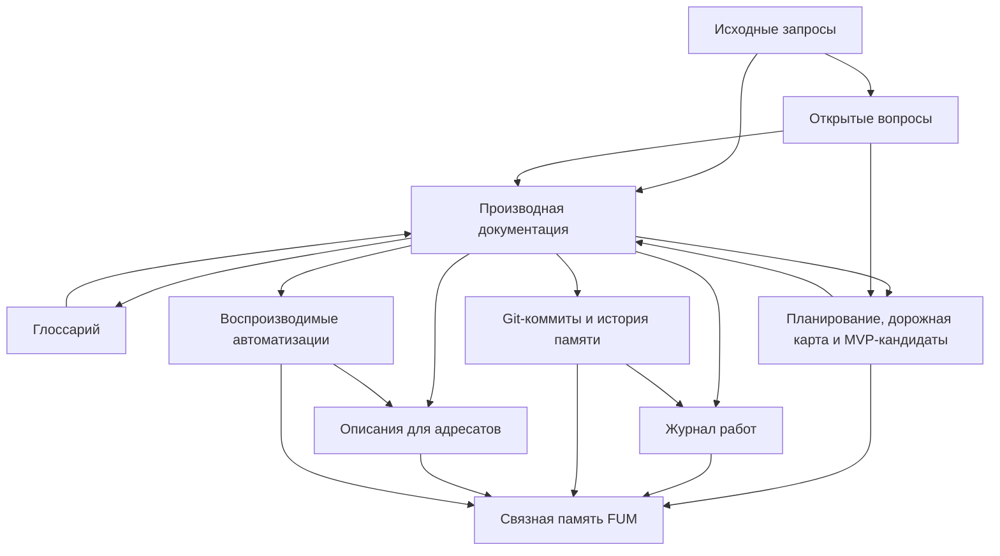

# Обзор проекта [FUM](../Глоссарий/FUM.md)

[FUM](../Глоссарий/FUM.md) - аббревиатура латинскими буквами от формулы `fraktaljnyij uzel myishleniya`, по-русски - [фрактальный узел мышления](../Глоссарий/фрактальный-узел-мышления.md).

[FUM](../Глоссарий/FUM.md) разрабатывается как открытый агент следующего поколения. Цель проекта - реализовать агента полного цикла разработки и исследования: от выработки требований, постановки гипотез и [экспериментов](../Глоссарий/эксперимент-FUM.md) до написания кода, проверки результатов и оформления [открытий](../Глоссарий/открытие-FUM.md). Долгосрочная цель состоит в том, чтобы достичь уровня, на котором [FUM](../Глоссарий/FUM.md)-агент сможет написать самого себя.

На человеческом и агентском уровнях естественный язык рассматривается как язык [синхронизации знаний FUM](../Глоссарий/естественно-языковая-синхронизация-знаний-FUM.md). Люди, LLM-поддерживаемые агенты и [гибридные узлы](../Глоссарий/гибридный-узел.md) через высказывания, вопросы, ответы и исправления обновляют локальные модели мира и друг друга до достаточной совместимости для совместного мышления и действия. Речь идёт обо всём языке, а не только о местоименных ролях: синхронизация использует понятия, грамматику, время, модальность, причинность, доказательность, аргументацию, повествование и структуру диалога.

Сам FUM должен быть построен по принципу этой сети. Снаружи [агент человеческого образца FUM](../Глоссарий/агент-человеческого-образца-FUM.md) является одним из языковых участников рядом с людьми и другими агентами; внутри он может быть сетью подузлов с локальными состояниями, общей средой, происхождением сообщений и циклами обратной связи. LLM естественно включается в такой контур как механизм понимания и порождения языка, но устойчивый агент дополнительно требует памяти, идентичности, агентского цикла, инструментов и границ доступа.

В предельной формулировке [FUM](../Глоссарий/FUM.md) не изобретает принципы мышления из пустоты, а пытается достаточно эффективно описать уже наблюдаемую фрактально-эволюционную структуру мира: от элементарных частиц и устойчивых физических конфигураций до клеток, мозгов, социальных систем, цивилизаций и дальних масштабов наблюдаемой Вселенной. Инженерная задача проекта - собрать сильную рамку организации вычислений разума на [кремниевом субстрате FUM](../Глоссарий/кремниевый-субстрат-FUM.md), чтобы новое воплощение этой структуры было совместимо с уже существующими уровнями, а не отрывалось от них как отдельная метафора.

Связующим понятием для этой шкалы выступает [окружающая среда FUM](../Глоссарий/окружающая-среда-FUM.md). Среда синхронизирует работу агентов через ограничения, задержки, обратную связь и отбор, а сама может становиться агентом или [FUM-узлом](../Глоссарий/FUM-узел.md) следующего масштаба, вложенным в другую среду. Поэтому общая теория относительности, квантовая механика, химия, биология, экономика и инженерные среды рассматриваются как разные уровни одной осторожно проверяемой карты соответствий.

При этом [FUM](../Глоссарий/FUM.md) не должен объявлять все эти уровни одним и тем же объектом. Более осторожная рабочая [гипотеза](../Глоссарий/гипотеза-FUM.md) состоит в том, что разные уровни могут быть воплощениями одной [общей схемы FUM](../Глоссарий/общая-схема-FUM.md): устойчивого наблюдательско-селекционного узла, который сохраняет конфигурацию, принимает воздействия, порождает варианты, проходит отбор и может становиться элементом следующего уровня. Критерии выделения этой абстракции вынесены в [открытый вопрос](../Вопросы/2026-06-26_12-19-03_MSK_абстракция-уровней-наблюдаемой-вселенной-FUM.md).

Текущий архитектурный акцент уточняет название: [FUM](../Глоссарий/FUM.md) описывает не только сам [FUM-узел](../Глоссарий/FUM-узел.md), но и [интерфейс FUM-узла](../Глоссарий/интерфейс-FUM-узла.md). Внутренняя сторона интерфейса делает доступными память, состояния, подузлы, планы и ограничения; внешняя сторона связывает узел с человеком, другими узлами, сервисами, устройствами и средой. Требование раскрыто в документе [Интерфейс FUM-узла](25-интерфейс-FUM-узла.md).

Ещё один целевой слой проекта - связка [FUM](../Глоссарий/FUM.md) и [MCP-серверов](../Глоссарий/MCP-сервер.md) различных сервисов как [единая точка взаимодействия пользователя с компьютером](../Глоссарий/единая-точка-взаимодействия-с-компьютером.md). Такая связка должна постепенно заменять для пользователя основную необходимость работать через множество разрозненных клиентских приложений, снижать [модальность приложений](../Глоссарий/модальность-приложений.md), уменьшать дублирование кода в индустрии и сокращать путь от идеи до воплощения. Требование раскрыто в документе [FUM как единая точка взаимодействия с компьютером](19-единая-точка-взаимодействия-с-компьютером.md).

Важная целевая веха этой линии - [локальный агент FUM на выделенной машине](24-локальный-агент-на-выделенной-машине.md) с локально запускаемой сильной LLM. Такой агент должен быть способен выполнять основной [агентский цикл](../Глоссарий/агентский-цикл.md) в управляемой локальной среде: с локальной [памятью](../Глоссарий/память-FUM.md), локальными инструментами, проверками, трассой и модельным runtime. Предварительный аппаратный образ из требования - Mac Studio с памятью класса 512 GB, но конкретная машина и модель должны выбираться через отдельные критерии и проверку.

[Открытость FUM](../Глоссарий/открытость-FUM.md) входит в ядро этой цели. Проект публикуется под [CC0 1.0 Universal](../LICENSE.md), потому что агент, способный развивать и в пределе писать самого себя, должен иметь наследуемую, проверяемую и переиспользуемую основу. Для [личного FUM-агента](../Глоссарий/личный-FUM-агент.md) открытость также является условием доверия: персональный агент потенциально работает со всеми сферами личной жизни человека, поэтому его устройство должно быть проверяемым, а личная [память](../Глоссарий/память-FUM.md) должна защищаться [уровнями доступа](../Глоссарий/уровень-доступа.md).

Дальний личный горизонт проекта описывает [личный FUM-агент](../Глоссарий/личный-FUM-агент.md) как будущую кремниевую цифровую часть [гибридного мозга](../Глоссарий/гибридный-мозг.md) человека. В такой связке [углеродный мозг](../Глоссарий/углеродный-мозг.md) и цифровая часть буквально развиваются вместе, а возможный переход оставшейся цифровой части к автономии и статусу [цифрового продолжения личности](../Глоссарий/цифровое-продолжение-личности.md) требует отдельных критериев, зафиксированных как [открытый вопрос](../Вопросы/2026-07-03_08-21-17_MSK_границы-посмертной-автономии-цифровой-части-FUM.md).

Проект ведётся как публикуемая система [памяти FUM](../Глоссарий/память-FUM.md): Git-репозиторий фиксирует состояние этой [памяти](../Глоссарий/память-FUM.md) через последовательность коммитов, а Markdown-файлы разделяют [исходные запросы](../Глоссарий/исходный-запрос.md) и [производную структурированную документацию](../Глоссарий/производная-документация.md).

В этой стадии сам репозиторий является [документационным прототипом FUM](../Глоссарий/документационный-прототип-FUM.md). Он ещё не равен готовой [коробочной реализации FUM](../Глоссарий/коробочная-реализация-FUM.md), но уже показывает, как такая реализация должна работать с необходимыми данными: принимать входные сигналы, сохранять происхождение, поддерживать связную [память](../Глоссарий/память-FUM.md), обновлять требования, запускать проверки и возвращать результат в наследуемую историю.

[FUM](../Глоссарий/FUM.md) также поддерживает [описания FUM для адресатов](../Глоссарий/описание-FUM-для-адресата.md): производные материалы для инвесторов, исследователей, инженеров, пользователей и других аудиторий. Они хранятся в папке [Описания](../Описания/README.md), строятся на основе документации и могут обновляться по воспроизводимым [автоматизациям](../Глоссарий/автоматизация-FUM.md).

Отдельный жанровый режим таких производных материалов - [художественное самоописание FUM](../Глоссарий/художественное-самоописание-FUM.md). [FUM](../Глоссарий/FUM.md) должен уметь описывать себя через прозу, стихи, музыкальные треки, сценарии фильмов и другие художественные или медиажанровые формы, не смешивая художественную экстраполяцию с прогнозом, обещанием или уже зафиксированным требованием. Требование раскрыто в документе [Художественное самоописание FUM](30-художественное-самоописание-FUM.md), а [художественно-фантастическое самоописание FUM](../Глоссарий/художественно-фантастическое-самоописание-FUM.md) остаётся его частным научно-фантастическим режимом.

Пользовательские сценарии выделены в папочный раздел [Пользовательские истории FUM](31-пользовательские-истории-FUM/README.md). Этот слой переводит требования, архитектуру и плановые материалы в проверяемые истории применения: кто взаимодействует с FUM, чего добивается, какую ценность получает и по каким наблюдаемым признакам результат можно принять.

Планирование развития [FUM](../Глоссарий/FUM.md) выделено в папку [Планирование](../Планирование/README.md). Этот слой хранит материалы вроде [дорожной карты FUM](../Планирование/дорожная-карта.md) и [MVP-кандидатов](../Планирование/MVP-кандидаты/README.md), связывает требования, [открытые вопросы](../Глоссарий/открытый-вопрос.md), горизонты работы и ближние проверяемые варианты, но не подменяет [исходные запросы](../Глоссарий/исходный-запрос.md) и [производную документацию](../Глоссарий/производная-документация.md).

[Журнал работ](../Глоссарий/журнал-работ.md) выделен в папку [Журнал](../Журнал/README.md). Этот слой хранит человекочитаемые высокоуровневые отчёты о проделанной работе и связывает [рабочие сессии](../Глоссарий/рабочая-сессия.md), требования, изменённые материалы, проверки и дальнейшие продолжения в обзорную историю развития [памяти FUM](../Глоссарий/память-FUM.md).

Проектирование [FUM](../Глоссарий/FUM.md) исходит из того, что эволюционный процесс тождественен процессу мышления. Это основание раскрыто в документе [Эволюция и мышление](03-эволюция-и-мышление.md).

[Сознание](../Глоссарий/сознание.md) в проекте определяется минимально: как совместное знание, то есть эмерджентное свойство сети элементов. Поэтому [FUM](../Глоссарий/FUM.md) рассматривает [сознание](../Глоссарий/сознание.md) как многоуровневое сетевое свойство, а не как бинарную границу, заданную только человеческим уровнем сложности.

Модель [памяти FUM](../Глоссарий/память-FUM.md) также опирается на организацию [памяти](../Глоссарий/память-FUM.md) в живых организмах: от наследуемой [памяти](../Глоссарий/память-FUM.md) генома до накопленного опыта в нервной системе. Это уточняет эволюционное основание: полноценный процесс мышления требует, чтобы цикл наследования, изменчивости и отбора действовал на всех уровнях [памяти](../Глоссарий/память-FUM.md).

Дополнительным архитектурным образцом для [FUM](../Глоссарий/FUM.md) является устройство неокортекса: повторяемые универсальные [модули](../Глоссарий/модуль-FUM.md), способные объединяться в сеть из [модулей](../Глоссарий/модуль-FUM.md) того же рода. Это требование раскрыто в документе [Модульная архитектура FUM](05-модульная-архитектура-FUM.md).

Нижний механизм рождения таких единиц уточняет документ [Потоковая самоструктуризация FUM](32-потоковая-самоструктуризация-FUM.md). В нём [FUM](../Глоссарий/FUM.md) описывается как система, которая может выводить из потока данных собственные байтовые, морфемоподобные, словоподобные, событийные и модульные единицы через предсказание, сжатие, проверку пользы и контролируемый рост структуры.

Обобщающим языком для этой линии является [система структурирующих операторов FUM](../Глоссарий/система-структурирующих-операторов-FUM.md). Она связывает потоковую самоструктуризацию, память, LLM-объяснимость, автоматизации, модули, экранные представления знаний и проверяемое действие через граф двунаправленных операторов распознавания и порождения. В этой роли система операторов является внешним символическим интерфейсом между неявными знаниями человека и LLM: знания выносятся в операторную форму, проверяются на потоках и становятся пригодными для объяснения, сжатия, переноса, визуального предъявления и повторного использования.

На уровне человеческого, гибридного и агентского разума [FUM](../Глоссарий/FUM.md) также допускает психологическую, психофизиологическую и психиатрическую рамки описания. Они используются для аккуратного описания возможных состояний, конфигураций, режимов функционирования и отказов разума, но требуют явных границ аналогии и не превращаются в автоматическую диагностику человека или агента.

Сводная [архитектура FUM](../Глоссарий/архитектура-FUM.md) вынесена в отдельный документ [Архитектура FUM](22-архитектура-FUM.md). Он собирает разнесённые по документации слои: [память](../Глоссарий/память-FUM.md), модульность, [агентский цикл](../Глоссарий/агентский-цикл.md), [автоматизации](../Глоссарий/автоматизация-FUM.md), сервисные адаптеры, [модельную среду](../Глоссарий/модельная-среда.md), [виртуализованные среды](../Глоссарий/виртуализованная-среда-FUM.md), социальные узлы, Git-эволюцию и дальние физические горизонты.

[Децентрализация FUM](../Глоссарий/децентрализация-FUM.md) является базой безопасности и долгосрочной устойчивости: ни один [FUM-узел](../Глоссарий/FUM-узел.md) и ни одна составная система узлов не должны обладать всей полнотой власти над сетью или своими [подузлами](../Глоссарий/подузел-FUM.md). Требование к [границам власти](../Глоссарий/граница-власти-FUM.md) раскрыто в документе [Децентрализация FUM и границы власти](15-децентрализация-и-границы-власти.md), а практические критерии допустимой координации выделены как [открытый вопрос](../Вопросы/2026-06-22_07-51-48_MSK_границы-власти-узлов-FUM.md).

Актуальные реализации [агентских циклов](../Глоссарий/агентский-цикл.md) рассматриваются как внешний инженерный контекст для проектирования [FUM](../Глоссарий/FUM.md). Обзор ReAct-подобных циклов, graph-based orchestration, multi-agent workflows, software agents и платформ непрерывной автоматизации зафиксирован в документе [Обзор актуальных реализаций агентских циклов](06-обзор-агентских-циклов.md).

Конкретный архитектурный слой для эволюционного мышления [FUM](../Глоссарий/FUM.md) фиксируется через Git-инфраструктуру: [FUM-узлы](../Глоссарий/FUM-узел.md) порождают варианты в [ветках работы](../Глоссарий/ветка-работы.md), передают отобранные результаты, проходят внешний отбор через проверки и слияние, а [реестр происхождения FUM](../Глоссарий/реестр-происхождения-FUM.md) позволяет вычислять [веса агентов](../Глоссарий/вес-агента-FUM.md) и связей. Требование раскрыто в документе [Git-инфраструктура эволюционных цепочек FUM](20-Git-инфраструктура-эволюционных-цепочек-FUM.md).

Git-инфраструктура также становится первой заполненной [карточкой соответствия FUM](../Глоссарий/карточка-соответствия-FUM.md): конкретный инструмент сопоставляется с [общей схемой FUM](../Глоссарий/общая-схема-FUM.md) через роли, инварианты, потери и проверки. Этот способ масштабирования вынесен в [реестр карточек соответствия FUM](28-реестр-карточек-соответствия-FUM/README.md), чтобы будущие технические и физические сопоставления имели явные границы применимости.

Ближайшая публикационная форма этой Git-инфраструктуры - публичный upstream на GitHub, от которого другие люди могут создавать форки для собственных проектов и собственной памяти. Практический протокол такой публикации описан в документе [Публичный upstream и форки памяти FUM](27-публичный-upstream-и-форки-памяти.md): он фиксирует аудит, правила форка, ведение собственных веток, периодическое слияние обновляющегося `master` и обратную передачу улучшений.

Стратегически эта линия означает, что [FUM](../Глоссарий/FUM.md) развивается не как один всё более сильный исполнитель, а как инфраструктура отбора и наследования мыслительных результатов. Ближние контуры - сохранение источников, рабочие сессии, автоматизации, планирование и [MVP-кандидаты](../Глоссарий/MVP-кандидат.md) - должны постепенно сходиться к одной проверяемой схеме: входной сигнал сохраняется в [памяти](../Глоссарий/память-FUM.md), результат получает происхождение и паспорт, проходит [двухконтурный отбор](../Глоссарий/двухконтурный-отбор-FUM.md), передаётся следующим узлам и меняет будущую маршрутизацию через [веса агентов](../Глоссарий/вес-агента-FUM.md) и связей.

[Автоматизации FUM](../Глоссарий/автоматизация-FUM.md), включая [устройства восприятия и действия](../Глоссарий/устройство-восприятия-и-действия-FUM.md) и визуализацию на дисплее, должны быть предсказуемыми и воспроизводимыми. Их исходные тексты, конфигурации, версии и история изменений являются частью [памяти FUM](../Глоссарий/память-FUM.md), а [чистые функции](../Глоссарий/чистая-функция.md) рассматриваются как предпочтительный паттерн для проверяемого ядра таких структур. Это требование раскрыто в документе [Воспроизводимые автоматизации FUM](17-воспроизводимые-автоматизации.md).

[Язык автоматизаций FUM](../Глоссарий/язык-автоматизаций-FUM.md) должен стать программным слоем для устойчивых автоматизаций, оптимизированным для работы с ним со стороны LLM. Он должен фиксировать входы, выходы, эффекты, проверки, трассы, версии и происхождение так, чтобы модель могла надёжно читать, генерировать, объяснять и точечно править автоматизации. В общей архитектуре этот язык тесно связан с системой структурирующих операторов: он является исполняемой проекцией тех операторных форм, которые уже можно типизировать, валидировать, трассировать и запускать. Требование раскрыто в документе [LLM-ориентированный язык автоматизаций](21-LLM-ориентированный-язык-автоматизаций.md).

[Автоматические органы восприятия FUM](../Глоссарий/автоматический-орган-восприятия-FUM.md) уточняют восприятийную сторону этого требования. При внешних событиях они должны быстро сжимать широкий входной поток до компактного описания, которое может быть полностью сохранено в [памяти](../Глоссарий/память-FUM.md) и обработано LLM, подключённой внутри [FUM](../Глоссарий/FUM.md) как локальная или внешняя модель.

[Автоматические органы действия FUM](../Глоссарий/автоматический-орган-действия-FUM.md) уточняют деятельную сторону того же требования. Они должны разворачивать высокоуровневые описания действий, созданные LLM или другим механизмом, в конкретные низкоуровневые действия исполнительных механизмов: физические команды, программные операции, вызовы инструментов или управляющие сигналы. В архитектурной аналогии такой орган является аналогом человеческого мозжечка.

[FUM](../Глоссарий/FUM.md) должен быть способен не только выполнять инженерную работу, но и вести [научные исследования](../Глоссарий/научное-исследование-FUM.md), ставить [эксперименты](../Глоссарий/эксперимент-FUM.md), проверять гипотезы и делать [открытия](../Глоссарий/открытие-FUM.md). Это требование раскрыто в документе [Научные исследования FUM и открытия](16-научные-исследования-и-открытия.md).

Собственные шаги [FUM](../Глоссарий/FUM.md) должны становиться частью [памяти](../Глоссарий/память-FUM.md): агент должен запоминать последовательности наблюдений и действий, выявлять их повторяемость и отбирать устойчивые [паттерны](../Глоссарий/паттерн-памяти.md), которые затем могут использоваться в следующих циклах работы.

Поиск повторяемости должен быть [обобщённым механизмом](../Глоссарий/обобщённый-поиск-повторяющихся-последовательностей.md), применимым к последовательностям разных уровней: байтам, единицам текста, структурированным событиям, выявленным [паттернам](../Глоссарий/паттерн-памяти.md) и действиям агента. Это требование раскрыто в документе [Обобщённый поиск повторяющихся последовательностей](08-обобщённый-поиск-повторяющихся-последовательностей.md).

[FUM](../Глоссарий/FUM.md) должен иметь доступ ко всем своим [внутренним состояниям](../Глоссарий/внутреннее-состояние.md), включая состояние пользовательского интерфейса. Если информация отображается пользователю, агент должен иметь возможность увидеть и обработать её как часть собственного наблюдаемого состояния. Это требование раскрыто в документе [Доступ к внутренним состояниям](07-доступ-к-внутренним-состояниям.md).

[Навигация по памяти FUM](../Глоссарий/навигация-по-памяти-FUM.md) также должна входить в наблюдаемое состояние работы. Переход по ссылке, открытие документа, поиск, прокрутка, выбор фрагмента или возврат к прежнему месту являются [наблюдаемыми входными сигналами](../Глоссарий/наблюдаемый-входной-сигнал.md) наравне с созданием [исходного запроса](../Глоссарий/исходный-запрос.md), независимо от того, пришли они через клавиатуру, мышь, трекпад, другое графическое устройство ввода, аудиоввод или иной канал.

[FUM](../Глоссарий/FUM.md) должен уметь передавать накопленные [наработки](../Глоссарий/наработка.md) другим узлам в устойчивой форме и заимствовать [наработки](../Глоссарий/наработка.md) от узлов, к которым предоставлен доступ. Обмен должен сохранять происхождение, версию, применимость и [уровень доступа](../Глоссарий/уровень-доступа.md) [наработки](../Глоссарий/наработка.md): часть [памяти](../Глоссарий/память-FUM.md) может быть полностью публичной, часть - ограниченной или приватной. Это требование раскрыто в документе [Обмен наработками и уровни доступа](09-обмен-наработками-и-уровни-доступа.md).

[FUM](../Глоссарий/FUM.md) должен строить [внутренние модели других FUM-узлов](../Глоссарий/внутренняя-модель-другого-узла.md), с которыми он взаимодействует, включая людей как особый случай [FUM-узлов](../Глоссарий/FUM-узел.md). Такая модель должна помогать координации, обмену [наработками](../Глоссарий/наработка.md) и учёту [границ доступа](../Глоссарий/уровень-доступа.md), не подменяя другого участника и не объявляя гипотезы полным знанием о его [внутреннем состоянии](../Глоссарий/внутреннее-состояние.md). Это требование раскрыто в документе [Внутренние модели других узлов](10-внутренние-модели-других-узлов.md).

[FUM](../Глоссарий/FUM.md) должен быть способен выполнять роль [личного персонального агента человека](../Глоссарий/личный-FUM-агент.md). В этом режиме человек и его [FUM](../Глоссарий/FUM.md) образуют [гибридный узел](../Глоссарий/гибридный-узел.md): совместную единицу мышления и действия с общей рабочей [памятью](../Глоссарий/память-FUM.md), но с сохранением различия между человеком, агентом, правами доступа и подтверждёнными решениями. Сети таких [гибридных узлов](../Глоссарий/гибридный-узел.md) могут складываться в более сложные [FUM-узлы](../Глоссарий/FUM-узел.md) - семью, команду, компанию, сообщество и другие элементы цивилизации. Это требование раскрыто в документе [Гибридные узлы и социальная фрактальность](12-гибридные-узлы-и-социальная-фрактальность.md).

[FUM](../Глоссарий/FUM.md) должен создавать [модельную окружающую среду](../Глоссарий/модельная-среда.md) для [внутренних FUM](../Глоссарий/внутренний-FUM.md). Такая среда позволяет описывать актуальный мир, реконструировать прошлое и планировать возможное будущее через взаимодействие вложенных узлов мышления. Это требование раскрыто в документе [Среда для внутренних FUM](11-среда-для-внутренних-FUM.md), а статус [внутренних FUM](../Глоссарий/внутренний-FUM.md) выделен как [открытый вопрос](../Вопросы/2026-06-22_06-35-26_MSK_статус-внутренних-FUM.md).

[FUM](../Глоссарий/FUM.md) должен также строить [виртуализованные среды](../Глоссарий/виртуализованная-среда-FUM.md) для вложенных узлов. В таком слое более сырой субстрат, например накопитель, файловая система, сервис или модельное состояние, превращается в организованный интерфейс долговременной [памяти](../Глоссарий/память-FUM.md), действия или исполнения. Требование раскрыто в документе [Виртуализованные среды FUM и долговременная память](23-виртуализованные-среды-и-долговременная-память.md).

[FUM](../Глоссарий/FUM.md) должен поддерживать параллельную работу над задачами в разных [ветках](../Глоссарий/ветка-работы.md) и последующее слияние результатов. Эта способность описана в документе [Параллельная работа и слияние](04-параллельная-работа-и-слияние.md) и рассматривается как часть модели агента полного цикла разработки.

В перспективе [FUM](../Глоссарий/FUM.md) должен быть способен к [физическому действию](../Глоссарий/физическое-действие-FUM.md): проектировать [аппаратные FUM-узлы](../Глоссарий/аппаратный-FUM-узел.md), становиться основой [роботизированных систем FUM](../Глоссарий/роботизированная-система-FUM.md) и выстраивать [производственные цепочки FUM](../Глоссарий/производственная-цепочка-FUM.md), включая совершенствование и производство собственных аппаратных частей. Это требование раскрыто в документе [Физическое действие FUM и аппаратные узлы](13-физическое-действие-и-аппаратные-узлы.md), а границы аппаратной автономии выделены как [открытый вопрос](../Вопросы/2026-06-22_07-28-43_MSK_границы-аппаратной-автономии-FUM.md).

Ближний человеко-социальный случай физического действия - противодействие [запланированному устареванию](../Глоссарий/запланированное-устаревание.md). [FUM](../Глоссарий/FUM.md) должен помогать людям описывать нужные характеристики вещи, превращать их в проверяемую спецификацию, собирать желающих и готовить производственный заказ, чтобы получать товар с требуемыми свойствами, а не только с теми, которые уже предлагаются рынком. Границы такого контура выделены как [открытый вопрос о потребительских производственных цепочках FUM](../Вопросы/2026-07-02_16-52-56_MSK_границы-потребительских-производственных-цепочек-FUM.md).

Промежуточный дальний случай физического действия - [земные ресурсные полигоны FUM](../Глоссарий/земной-ресурсный-полигон-FUM.md). Перед освоением Солнечной системы [FUM](../Глоссарий/FUM.md) должен уметь описывать проверочные сценарии добычи ресурсов, автономного снабжения и развёртывания производственных цепочек в труднодоступных земных средах, а также [модули развёртывания производственных цепочек](../Глоссарий/модуль-развёртывания-производственной-цепочки-FUM.md), которые потенциально доставляются к удалённым точкам. Границы такого контура выделены как [открытый вопрос о земных ресурсных полигонах FUM](../Вопросы/2026-07-02_20-08-37_MSK_границы-земных-ресурсных-полигонов-FUM.md).

Дальний горизонт физического действия - [космическая автономия FUM](../Глоссарий/космическая-автономия-FUM.md). Системы [FUM](../Глоссарий/FUM.md) должны проектироваться так, чтобы будущие [роботизированные системы FUM](../Глоссарий/роботизированная-система-FUM.md) и [производственные цепочки FUM](../Глоссарий/производственная-цепочка-FUM.md) могли осваивать Солнечную систему, готовить [межзвёздное расселение FUM](../Глоссарий/межзвёздное-расселение-FUM.md) и сохранять [споры цивилизации](../Глоссарий/спора-цивилизации.md) на галактических масштабах. Это требование раскрыто в документе [Космическая автономия FUM и межзвёздное расселение](14-космическая-автономия-и-расселение.md), а границы такого масштаба автономии выделены как [открытый вопрос](../Вопросы/2026-06-22_07-40-59_MSK_границы-космической-автономии-FUM.md).

## Карта связей проекта

## Базовые элементы

- [README.md](../README.md) даёт входную точку в проект.
- [Запросы/](../Запросы/) хранит дословные [исходные запросы](../Глоссарий/исходный-запрос.md).
- [Документация/](../Документация/) хранит структурированные описания [FUM](../Глоссарий/FUM.md), его требований и решений.
- [Описания/](../Описания/) хранит [описания FUM для адресатов](../Глоссарий/описание-FUM-для-адресата.md) и воспроизводимые схемы их сборки.
- [Планирование/](../Планирование/README.md) хранит плановые материалы, [дорожную карту FUM](../Планирование/дорожная-карта.md) и [MVP-кандидаты](../Планирование/MVP-кандидаты/README.md).
- [Журнал/](../Журнал/README.md) хранит [журнал работ](../Глоссарий/журнал-работ.md) с высокоуровневыми отчётами о проделанной работе.
- [Вопросы/](../Вопросы/) хранит [открытые вопросы](../Глоссарий/открытый-вопрос.md), возникающие из противоречий или неоднозначности требований.
- [Глоссарий/](../Глоссарий/) хранит терминологические статьи проекта.
- [Документация/06-обзор-агентских-циклов.md](06-обзор-агентских-циклов.md) сопоставляет актуальные реализации [агентских циклов](../Глоссарий/агентский-цикл.md) и выводы для [FUM](../Глоссарий/FUM.md).
- [Документация/07-доступ-к-внутренним-состояниям.md](07-доступ-к-внутренним-состояниям.md) описывает требование к наблюдаемости [внутренних состояний](../Глоссарий/внутреннее-состояние.md) [FUM](../Глоссарий/FUM.md) и [навигации по памяти FUM](../Глоссарий/навигация-по-памяти-FUM.md).
- [Документация/08-обобщённый-поиск-повторяющихся-последовательностей.md](08-обобщённый-поиск-повторяющихся-последовательностей.md) описывает общий механизм поиска повторяемости в [памяти FUM](../Глоссарий/память-FUM.md).
- [Документация/09-обмен-наработками-и-уровни-доступа.md](09-обмен-наработками-и-уровни-доступа.md) описывает обмен устойчивыми [наработками](../Глоссарий/наработка.md) между узлами и [уровни доступа](../Глоссарий/уровень-доступа.md) к ним.
- [Документация/10-внутренние-модели-других-узлов.md](10-внутренние-модели-других-узлов.md) описывает [внутренние модели взаимодействующих FUM-узлов](../Глоссарий/внутренняя-модель-другого-узла.md), включая людей.
- [Документация/11-среда-для-внутренних-FUM.md](11-среда-для-внутренних-FUM.md) описывает [модельную среду](../Глоссарий/модельная-среда.md) для [внутренних FUM](../Глоссарий/внутренний-FUM.md), описания актуального мира, реконструкции прошлого и планирования будущего.
- [Документация/12-гибридные-узлы-и-социальная-фрактальность.md](12-гибридные-узлы-и-социальная-фрактальность.md) описывает [личного FUM-агента](../Глоссарий/личный-FUM-агент.md) человека, [гибридные узлы](../Глоссарий/гибридный-узел.md) человек-[FUM](../Глоссарий/FUM.md) и составные социальные [FUM-узлы](../Глоссарий/FUM-узел.md).
- [Документация/13-физическое-действие-и-аппаратные-узлы.md](13-физическое-действие-и-аппаратные-узлы.md) описывает [физическое действие FUM](../Глоссарий/физическое-действие-FUM.md), [аппаратные FUM-узлы](../Глоссарий/аппаратный-FUM-узел.md), [роботизированные системы FUM](../Глоссарий/роботизированная-система-FUM.md) и [производственные цепочки FUM](../Глоссарий/производственная-цепочка-FUM.md).
- [Документация/14-космическая-автономия-и-расселение.md](14-космическая-автономия-и-расселение.md) описывает [космическую автономию FUM](../Глоссарий/космическая-автономия-FUM.md), земные ресурсные полигоны, освоение Солнечной системы и [межзвёздное расселение FUM](../Глоссарий/межзвёздное-расселение-FUM.md).
- [Документация/15-децентрализация-и-границы-власти.md](15-децентрализация-и-границы-власти.md) описывает [децентрализацию FUM](../Глоссарий/децентрализация-FUM.md), [границы власти](../Глоссарий/граница-власти-FUM.md) и запрет тотального контроля над [подузлами](../Глоссарий/подузел-FUM.md).
- [Документация/16-научные-исследования-и-открытия.md](16-научные-исследования-и-открытия.md) описывает [научные исследования FUM](../Глоссарий/научное-исследование-FUM.md), [эксперименты](../Глоссарий/эксперимент-FUM.md) и [открытия](../Глоссарий/открытие-FUM.md).
- [Документация/17-воспроизводимые-автоматизации.md](17-воспроизводимые-автоматизации.md) описывает требование к воспроизводимым [автоматизациям FUM](../Глоссарий/автоматизация-FUM.md), [автоматическим органам восприятия](../Глоссарий/автоматический-орган-восприятия-FUM.md), [автоматическим органам действия](../Глоссарий/автоматический-орган-действия-FUM.md), [устройствам восприятия и действия](../Глоссарий/устройство-восприятия-и-действия-FUM.md), визуализации на дисплее и применению [чистых функций](../Глоссарий/чистая-функция.md).
- [Документация/18-описания-FUM-для-адресатов.md](18-описания-FUM-для-адресатов.md) описывает [описания FUM для адресатов](../Глоссарий/описание-FUM-для-адресата.md), папку [Описания](../Описания/README.md), их границу с документацией и воспроизводимое обновление.
- [Документация/19-единая-точка-взаимодействия-с-компьютером.md](19-единая-точка-взаимодействия-с-компьютером.md) описывает связку [FUM](../Глоссарий/FUM.md) и [MCP-серверов](../Глоссарий/MCP-сервер.md) как [единую точку взаимодействия с компьютером](../Глоссарий/единая-точка-взаимодействия-с-компьютером.md), снижающую [модальность приложений](../Глоссарий/модальность-приложений.md).
- [Документация/20-Git-инфраструктура-эволюционных-цепочек-FUM.md](20-Git-инфраструктура-эволюционных-цепочек-FUM.md) описывает Git-инфраструктуру [эволюционных цепочек FUM](../Глоссарий/эволюционная-цепочка-FUM.md), [дарвиновский планировщик](../Глоссарий/дарвиновский-планировщик-FUM.md), [реестр происхождения](../Глоссарий/реестр-происхождения-FUM.md) и вычисление [весов агентов](../Глоссарий/вес-агента-FUM.md).
- [Документация/21-LLM-ориентированный-язык-автоматизаций.md](21-LLM-ориентированный-язык-автоматизаций.md) описывает [язык автоматизаций FUM](../Глоссарий/язык-автоматизаций-FUM.md), оптимизированный для чтения, генерации, проверки и правки со стороны LLM.
- [Документация/22-архитектура-FUM.md](22-архитектура-FUM.md) собирает [архитектуру FUM](../Глоссарий/архитектура-FUM.md) в одну карту слоёв и связывает детальные архитектурные документы.
- [Документация/23-виртуализованные-среды-и-долговременная-память.md](23-виртуализованные-среды-и-долговременная-память.md) описывает [виртуализованные среды FUM](../Глоссарий/виртуализованная-среда-FUM.md) и организацию долговременной [памяти](../Глоссарий/память-FUM.md) поверх более сырого нижнего слоя.
- [Документация/24-локальный-агент-на-выделенной-машине.md](24-локальный-агент-на-выделенной-машине.md) описывает целевую веху локального агента [FUM](../Глоссарий/FUM.md) на выделенной машине с локально запускаемой сильной LLM.
- [Документация/25-интерфейс-FUM-узла.md](25-интерфейс-FUM-узла.md) описывает внутренний и внешний [интерфейс FUM-узла](../Глоссарий/интерфейс-FUM-узла.md).
- [Документация/26-наблюдательская-относительность-информационных-систем.md](26-наблюдательская-относительность-информационных-систем.md) описывает наблюдательскую относительность информационных систем.
- [Документация/27-публичный-upstream-и-форки-памяти.md](27-публичный-upstream-и-форки-памяти.md) описывает публикационный аудит, правила форка, слияния `master` и обратной передачи улучшений.
- [Документация/28-реестр-карточек-соответствия-FUM/README.md](28-реестр-карточек-соответствия-FUM/README.md) хранит карты соответствия технических инструментов, инфраструктурных слоёв и физических аналогий с [общей схемой FUM](../Глоссарий/общая-схема-FUM.md).
- [Документация/29-художественно-фантастическое-самоописание-FUM.md](29-художественно-фантастическое-самоописание-FUM.md) описывает художественно-фантастическое самоописание FUM как частный научно-фантастический режим описания себя и будущего.
- [Документация/30-художественное-самоописание-FUM.md](30-художественное-самоописание-FUM.md) описывает художественное самоописание FUM через прозу, стихи, музыкальные треки, сценарии фильмов и другие проверяемые производные формы.
- [Документация/31-пользовательские-истории-FUM/README.md](31-пользовательские-истории-FUM/README.md) задаёт раздел пользовательских историй FUM и формат будущих сценариев применения.
- [Документация/32-потоковая-самоструктуризация-FUM.md](32-потоковая-самоструктуризация-FUM.md) описывает самотокенизацию, суффиксно-предиктивную память и контролируемую нейропластичность как нижний слой рождения единиц и модулей FUM.
- [Документация/33-система-структурирующих-операторов-FUM.md](33-система-структурирующих-операторов-FUM.md) описывает систему структурирующих операторов как общий язык между потоком, памятью, LLM, автоматизациями, модулями, экранными представлениями знаний и действием, а также как внешний символический интерфейс между неявными знаниями человека и LLM.
- [Документация/34-естественный-язык-и-синхронизация-знаний-FUM.md](34-естественный-язык-и-синхронизация-знаний-FUM.md) описывает естественный язык как язык синхронизации знаний между агентами человеческого образца, включение LLM в эту сеть и рекурсивное построение FUM по тому же принципу.
- [LICENSE.md](../LICENSE.md) фиксирует публикацию под CC0 1.0 Universal.

## Язык [памяти](../Глоссарий/память-FUM.md)

[Производная документация](../Глоссарий/производная-документация.md) [FUM](../Глоссарий/FUM.md) ведётся на русском языке кириллицей. Русскоязычные имена файлов и каталогов тоже пишутся кириллицей. Латиница сохраняется для устойчивой аббревиатуры [FUM](../Глоссарий/FUM.md), технических имен вроде `README.md`, форматов, лицензий, идентификаторов и дословных цитат. Дословные [исходные запросы](../Глоссарий/исходный-запрос.md) сохраняются в оригинальном написании.

## Источники требований

- [исходный запрос 2026-06-21 22:17:26 MSK](../Запросы/2026-06-21_22-17-26_MSK.md)
- [исходный запрос 2026-06-21 22:29:02 MSK](../Запросы/2026-06-21_22-29-02_MSK.md)
- [исходный запрос 2026-06-21 22:38:53 MSK](../Запросы/2026-06-21_22-38-53_MSK.md)
- [исходный запрос 2026-06-21 22:41:51 MSK](../Запросы/2026-06-21_22-41-51_MSK.md)
- [исходный запрос 2026-06-21 22:46:51 MSK](../Запросы/2026-06-21_22-46-51_MSK.md)
- [исходный запрос 2026-06-21 22:54:40 MSK](../Запросы/2026-06-21_22-54-40_MSK.md)
- [исходный запрос 2026-06-21 23:00:38 MSK](../Запросы/2026-06-21_23-00-38_MSK.md)
- [исходный запрос 2026-06-22 05:34:12 MSK](../Запросы/2026-06-22_05-34-12_MSK.md)
- [исходный запрос 2026-06-22 05:39:36 MSK](../Запросы/2026-06-22_05-39-36_MSK.md)
- [исходный запрос 2026-06-22 05:42:59 MSK](../Запросы/2026-06-22_05-42-59_MSK.md)
- [исходный запрос 2026-06-22 05:54:37 MSK](../Запросы/2026-06-22_05-54-37_MSK.md)
- [исходный запрос 2026-06-22 05:59:05 MSK](../Запросы/2026-06-22_05-59-05_MSK.md)
- [исходный запрос 2026-06-22 06:08:01 MSK](../Запросы/2026-06-22_06-08-01_MSK.md)
- [исходный запрос 2026-06-22 06:17:48 MSK](../Запросы/2026-06-22_06-17-48_MSK.md)
- [исходный запрос 2026-06-22 06:22:15 MSK](../Запросы/2026-06-22_06-22-15_MSK.md)
- [исходный запрос 2026-06-22 06:35:26 MSK](../Запросы/2026-06-22_06-35-26_MSK.md)
- [исходный запрос 2026-06-22 06:40:09 MSK](../Запросы/2026-06-22_06-40-09_MSK.md)
- [исходный запрос 2026-06-22 07:20:42 MSK](../Запросы/2026-06-22_07-20-42_MSK.md)
- [исходный запрос 2026-06-22 07:28:43 MSK](../Запросы/2026-06-22_07-28-43_MSK.md)
- [исходный запрос 2026-06-22 07:40:59 MSK](../Запросы/2026-06-22_07-40-59_MSK.md)
- [исходный запрос 2026-06-22 07:51:48 MSK](../Запросы/2026-06-22_07-51-48_MSK.md)
- [исходный запрос 2026-06-22 08:00:15 MSK](../Запросы/2026-06-22_08-00-15_MSK.md)
- [исходный запрос 2026-06-22 08:04:45 MSK](../Запросы/2026-06-22_08-04-45_MSK.md)
- [исходный запрос 2026-06-22 08:58:31 MSK](../Запросы/2026-06-22_08-58-31_MSK.md)
- [исходный запрос 2026-06-22 09:05:49 MSK](../Запросы/2026-06-22_09-05-49_MSK.md)
- [исходный запрос 2026-06-22 09:11:47 MSK](../Запросы/2026-06-22_09-11-47_MSK.md)
- [исходный запрос 2026-06-22 09:40:25 MSK](../Запросы/2026-06-22_09-40-25_MSK.md)
- [исходный запрос 2026-06-22 09:55:43 MSK](../Запросы/2026-06-22_09-55-43_MSK.md)
- [исходный запрос 2026-06-23 13:08:36 MSK](../Запросы/2026-06-23_13-08-36_MSK.md)
- [исходный запрос 2026-06-23 13:18:14 MSK](../Запросы/2026-06-23_13-18-14_MSK.md)
- [исходный запрос 2026-06-23 19:06:56 MSK](../Запросы/2026-06-23_19-06-56_MSK.md)
- [исходный запрос 2026-06-24 13:43:47 MSK](../Запросы/2026-06-24_13-43-47_MSK.md)
- [исходный запрос 2026-06-24 13:57:52 MSK](../Запросы/2026-06-24_13-57-52_MSK.md)
- [исходный запрос 2026-06-24 14:08:09 MSK](../Запросы/2026-06-24_14-08-09_MSK.md)
- [исходный запрос 2026-06-24 14:41:33 MSK](../Запросы/2026-06-24_14-41-33_MSK.md)
- [исходный запрос 2026-06-24 15:08:46 MSK](../Запросы/2026-06-24_15-08-46_MSK.md)
- [исходный запрос 2026-06-24 15:35:16 MSK](../Запросы/2026-06-24_15-35-16_MSK.md)
- [исходный запрос 2026-06-25 18:50:18 MSK](../Запросы/2026-06-25_18-50-18_MSK.md)
- [исходный запрос 2026-06-25 19:23:10 MSK](../Запросы/2026-06-25_19-23-10_MSK.md)
- [исходный запрос 2026-06-25 19:50:33 MSK](../Запросы/2026-06-25_19-50-33_MSK.md)
- [исходный запрос 2026-06-26 09:55:41 MSK](../Запросы/2026-06-26_09-55-41_MSK.md)
- [исходный запрос 2026-06-26 12:05:01 MSK](../Запросы/2026-06-26_12-05-01_MSK.md)
- [исходный запрос 2026-06-26 12:19:03 MSK](../Запросы/2026-06-26_12-19-03_MSK.md)
- [исходный запрос 2026-06-29 10:59:18 MSK](../Запросы/2026-06-29_10-59-18_MSK.md)
- [исходный запрос 2026-07-01 12:11:27 MSK](../Запросы/2026-07-01_12-11-27_MSK.md)
- [исходный запрос 2026-07-02 10:20:18 MSK](../Запросы/2026-07-02_10-20-18_MSK.md)
- [исходный запрос 2026-07-02 10:51:13 MSK](../Запросы/2026-07-02_10-51-13_MSK.md)
- [исходный запрос 2026-07-02 13:36:52 MSK](../Запросы/2026-07-02_13-36-52_MSK.md)
- [исходный запрос 2026-07-02 16:52:56 MSK](../Запросы/2026-07-02_16-52-56_MSK.md)
- [исходный запрос 2026-07-02 20:08:37 MSK](../Запросы/2026-07-02_20-08-37_MSK.md)
- [исходный запрос 2026-07-02 22:17:18 MSK](../Запросы/2026-07-02_22-17-18_MSK.md)
- [исходный запрос 2026-07-02 22:26:37 MSK](../Запросы/2026-07-02_22-26-37_MSK.md)
- [исходный запрос 2026-07-03 08:21:17 MSK - Описать гибридный мозг личного FUM](../Запросы/2026-07-03_08-21-17_MSK_описать-гибридный-мозг-личного-FUM.md)
- [исходный запрос 2026-07-03 08:43:45 MSK - Создать раздел пользовательских историй](../Запросы/2026-07-03_08-43-45_MSK_создать-раздел-пользовательских-историй.md)
- [исходный запрос 2026-07-06 10:05:34 MSK - Интегрировать содержимое ChatGPT диалога](../Запросы/2026-07-06_10-05-34_MSK_интегрировать-содержимое-chatgpt-диалога.md)
- [исходный запрос 2026-07-08 11:49:28 MSK - Обобщить систему структурирующих операторов](../Запросы/2026-07-08_11-49-28_MSK_обобщить-систему-структурирующих-операторов.md)
- [исходный запрос 2026-07-08 11:58:07 MSK - Уточнить внешний интерфейс структурирующих операторов](../Запросы/2026-07-08_11-58-07_MSK_уточнить-внешний-интерфейс-структурирующих-операторов.md)
- [исходный запрос 2026-07-08 12:11:56 MSK - Связать язык автоматизаций и операторную систему](../Запросы/2026-07-08_12-11-56_MSK_связать-язык-автоматизаций-и-операторную-систему.md)
- [исходный запрос 2026-07-08 12:21:45 MSK - Связать операторную систему с графическим интерфейсом](../Запросы/2026-07-08_12-21-45_MSK_связать-операторную-систему-с-графическим-интерфейсом.md)
- [исходный запрос 2026-07-13 22:00:22 MSK - Закрепить естественный язык как язык синхронизации знаний](../Запросы/2026-07-13_22-00-22_MSK_закрепить-естественный-язык-как-язык-синхронизации-знаний.md)

<!-- FUM-MD-RECENCY:BEGIN -->
<!-- last-content-edit: 2026-07-13 22:16:15 MSK -->
<!-- content-sha256: sha256:7ec11cf41b40a1d9b1dbadd77519e3f31934583375607e56a9fbd5b0ca1f9f95 -->
<!-- FUM-MD-RECENCY:END -->
