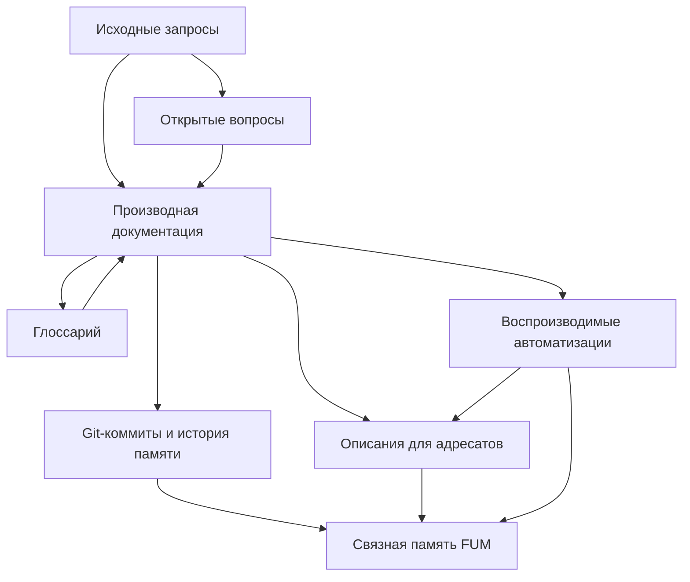

# Обзор проекта [FUM](../Глоссарий/FUM.md)

Источники требований:

- [исходный запрос 2026-06-21 22:17:26 MSK](../Запросы/2026-06-21_22-17-26_MSK.md)
- [исходный запрос 2026-06-21 22:29:02 MSK](../Запросы/2026-06-21_22-29-02_MSK.md)
- [исходный запрос 2026-06-21 22:38:53 MSK](../Запросы/2026-06-21_22-38-53_MSK.md)
- [исходный запрос 2026-06-21 22:41:51 MSK](../Запросы/2026-06-21_22-41-51_MSK.md)
- [исходный запрос 2026-06-21 22:46:51 MSK](../Запросы/2026-06-21_22-46-51_MSK.md)
- [исходный запрос 2026-06-21 22:54:40 MSK](../Запросы/2026-06-21_22-54-40_MSK.md)
- [исходный запрос 2026-06-21 23:00:38 MSK](../Запросы/2026-06-21_23-00-38_MSK.md)
- [исходный запрос 2026-06-22 05:34:12 MSK](../Запросы/2026-06-22_05-34-12_MSK.md)
- [исходный запрос 2026-06-22 05:39:36 MSK](../Запросы/2026-06-22_05-39-36_MSK.md)
- [исходный запрос 2026-06-22 05:42:59 MSK](../Запросы/2026-06-22_05-42-59_MSK.md)
- [исходный запрос 2026-06-22 05:54:37 MSK](../Запросы/2026-06-22_05-54-37_MSK.md)
- [исходный запрос 2026-06-22 05:59:05 MSK](../Запросы/2026-06-22_05-59-05_MSK.md)
- [исходный запрос 2026-06-22 06:08:01 MSK](../Запросы/2026-06-22_06-08-01_MSK.md)
- [исходный запрос 2026-06-22 06:17:48 MSK](../Запросы/2026-06-22_06-17-48_MSK.md)
- [исходный запрос 2026-06-22 06:22:15 MSK](../Запросы/2026-06-22_06-22-15_MSK.md)
- [исходный запрос 2026-06-22 06:35:26 MSK](../Запросы/2026-06-22_06-35-26_MSK.md)
- [исходный запрос 2026-06-22 06:40:09 MSK](../Запросы/2026-06-22_06-40-09_MSK.md)
- [исходный запрос 2026-06-22 07:20:42 MSK](../Запросы/2026-06-22_07-20-42_MSK.md)
- [исходный запрос 2026-06-22 07:28:43 MSK](../Запросы/2026-06-22_07-28-43_MSK.md)
- [исходный запрос 2026-06-22 07:40:59 MSK](../Запросы/2026-06-22_07-40-59_MSK.md)
- [исходный запрос 2026-06-22 07:51:48 MSK](../Запросы/2026-06-22_07-51-48_MSK.md)
- [исходный запрос 2026-06-22 08:00:15 MSK](../Запросы/2026-06-22_08-00-15_MSK.md)
- [исходный запрос 2026-06-22 08:04:45 MSK](../Запросы/2026-06-22_08-04-45_MSK.md)
- [исходный запрос 2026-06-22 08:58:31 MSK](../Запросы/2026-06-22_08-58-31_MSK.md)
- [исходный запрос 2026-06-22 09:05:49 MSK](../Запросы/2026-06-22_09-05-49_MSK.md)
- [исходный запрос 2026-06-22 09:11:47 MSK](../Запросы/2026-06-22_09-11-47_MSK.md)
- [исходный запрос 2026-06-22 09:40:25 MSK](../Запросы/2026-06-22_09-40-25_MSK.md)
- [исходный запрос 2026-06-22 09:55:43 MSK](../Запросы/2026-06-22_09-55-43_MSK.md)
- [исходный запрос 2026-06-23 13:08:36 MSK](../Запросы/2026-06-23_13-08-36_MSK.md)
- [исходный запрос 2026-06-23 13:18:14 MSK](../Запросы/2026-06-23_13-18-14_MSK.md)
- [исходный запрос 2026-06-23 19:06:56 MSK](../Запросы/2026-06-23_19-06-56_MSK.md)

[FUM](../Глоссарий/FUM.md) - аббревиатура латинскими буквами от формулы `fraktaljnyij uzel myishleniya`, по-русски - [фрактальный узел мышления](../Глоссарий/фрактальный-узел-мышления.md).

[FUM](../Глоссарий/FUM.md) разрабатывается как открытый агент следующего поколения. Цель проекта - реализовать агента полного цикла разработки и исследования: от выработки требований, постановки гипотез и [экспериментов](../Глоссарий/эксперимент-FUM.md) до написания кода, проверки результатов и оформления [открытий](../Глоссарий/открытие-FUM.md). Долгосрочная цель состоит в том, чтобы достичь уровня, на котором [FUM](../Глоссарий/FUM.md)-агент сможет написать самого себя.

Еще один целевой слой проекта - связка [FUM](../Глоссарий/FUM.md) и [MCP-серверов](../Глоссарий/MCP-сервер.md) различных сервисов как [единая точка взаимодействия пользователя с компьютером](../Глоссарий/единая-точка-взаимодействия-с-компьютером.md). Такая связка должна постепенно заменять для пользователя основную необходимость работать через множество разрозненных клиентских приложений, снижать [модальность приложений](../Глоссарий/модальность-приложений.md), уменьшать дублирование кода в индустрии и сокращать путь от идеи до воплощения. Требование раскрыто в документе [FUM как единая точка взаимодействия с компьютером](19-единая-точка-взаимодействия-с-компьютером.md).

[Открытость FUM](../Глоссарий/открытость-FUM.md) входит в ядро этой цели. Проект публикуется под [CC0 1.0 Universal](../LICENSE.md), потому что агент, способный развивать и в пределе писать самого себя, должен иметь наследуемую, проверяемую и переиспользуемую основу. Для [личного FUM-агента](../Глоссарий/личный-FUM-агент.md) открытость также является условием доверия: персональный агент потенциально работает со всеми сферами личной жизни человека, поэтому его устройство должно быть проверяемым, а личная [память](../Глоссарий/память-FUM.md) должна защищаться [уровнями доступа](../Глоссарий/уровень-доступа.md).

Проект ведётся как публикуемая система [памяти FUM](../Глоссарий/память-FUM.md): Git-репозиторий фиксирует состояние этой [памяти](../Глоссарий/память-FUM.md) через последовательность коммитов, а Markdown-файлы разделяют [исходные запросы](../Глоссарий/исходный-запрос.md) и [производную структурированную документацию](../Глоссарий/производная-документация.md).

[FUM](../Глоссарий/FUM.md) также поддерживает [описания FUM для адресатов](../Глоссарий/описание-FUM-для-адресата.md): производные материалы для инвесторов, исследователей, инженеров, пользователей и других аудиторий. Они хранятся в папке [Описания](../Описания/README.md), строятся на основе документации и могут обновляться по воспроизводимым [автоматизациям](../Глоссарий/автоматизация-FUM.md).

Проектирование [FUM](../Глоссарий/FUM.md) исходит из того, что эволюционный процесс тождественен процессу мышления. Это основание раскрыто в документе [Эволюция и мышление](03-эволюция-и-мышление.md).

[Сознание](../Глоссарий/сознание.md) в проекте определяется минимально: как совместное знание, то есть эмерджентное свойство сети элементов. Поэтому [FUM](../Глоссарий/FUM.md) рассматривает [сознание](../Глоссарий/сознание.md) как многоуровневое сетевое свойство, а не как бинарную границу, заданную только человеческим уровнем сложности.

Модель [памяти FUM](../Глоссарий/память-FUM.md) также опирается на организацию [памяти](../Глоссарий/память-FUM.md) в живых организмах: от наследуемой [памяти](../Глоссарий/память-FUM.md) генома до накопленного опыта в нервной системе. Это уточняет эволюционное основание: полноценный процесс мышления требует, чтобы цикл наследования, изменчивости и отбора действовал на всех уровнях [памяти](../Глоссарий/память-FUM.md).

Дополнительным архитектурным образцом для [FUM](../Глоссарий/FUM.md) является устройство неокортекса: повторяемые универсальные [модули](../Глоссарий/модуль-FUM.md), способные объединяться в сеть из [модулей](../Глоссарий/модуль-FUM.md) того же рода. Это требование раскрыто в документе [Модульная архитектура FUM](05-модульная-архитектура-FUM.md).

[Децентрализация FUM](../Глоссарий/децентрализация-FUM.md) является базой безопасности и долгосрочной устойчивости: ни один [FUM-узел](../Глоссарий/FUM-узел.md) и ни одна составная система узлов не должны обладать всей полнотой власти над сетью или своими [подузлами](../Глоссарий/подузел-FUM.md). Требование к [границам власти](../Глоссарий/граница-власти-FUM.md) раскрыто в документе [Децентрализация FUM и границы власти](15-децентрализация-и-границы-власти.md), а практические критерии допустимой координации выделены как [открытый вопрос](../Вопросы/2026-06-22_07-51-48_MSK_границы-власти-узлов-FUM.md).

Актуальные реализации [агентских циклов](../Глоссарий/агентский-цикл.md) рассматриваются как внешний инженерный контекст для проектирования [FUM](../Глоссарий/FUM.md). Обзор ReAct-подобных циклов, graph-based orchestration, multi-agent workflows, software agents и платформ непрерывной автоматизации зафиксирован в документе [Обзор актуальных реализаций агентских циклов](06-обзор-агентских-циклов.md).

Конкретный архитектурный слой для эволюционного мышления [FUM](../Глоссарий/FUM.md) фиксируется через Git-инфраструктуру: [FUM-узлы](../Глоссарий/FUM-узел.md) порождают варианты в [ветках работы](../Глоссарий/ветка-работы.md), передают отобранные результаты, проходят внешний отбор через проверки и слияние, а [реестр происхождения FUM](../Глоссарий/реестр-происхождения-FUM.md) позволяет вычислять [веса агентов](../Глоссарий/вес-агента-FUM.md) и связей. Требование раскрыто в документе [Git-инфраструктура эволюционных цепочек FUM](20-Git-инфраструктура-эволюционных-цепочек-FUM.md).

[Автоматизации FUM](../Глоссарий/автоматизация-FUM.md), включая [устройства восприятия и действия](../Глоссарий/устройство-восприятия-и-действия-FUM.md) и визуализацию на дисплее, должны быть предсказуемыми и воспроизводимыми. Их исходные тексты, конфигурации, версии и история изменений являются частью [памяти FUM](../Глоссарий/память-FUM.md), а [чистые функции](../Глоссарий/чистая-функция.md) рассматриваются как предпочтительный паттерн для проверяемого ядра таких структур. Это требование раскрыто в документе [Воспроизводимые автоматизации FUM](17-воспроизводимые-автоматизации.md).

[Автоматические органы восприятия FUM](../Глоссарий/автоматический-орган-восприятия-FUM.md) уточняют восприятийную сторону этого требования. При внешних событиях они должны быстро сжимать широкий входной поток до компактного описания, которое может быть полностью сохранено в [памяти](../Глоссарий/память-FUM.md) и обработано LLM, подключенной внутри [FUM](../Глоссарий/FUM.md) как локальная или внешняя модель.

[Автоматические органы действия FUM](../Глоссарий/автоматический-орган-действия-FUM.md) уточняют деятельную сторону того же требования. Они должны разворачивать высокоуровневые описания действий, созданные LLM или другим механизмом, в конкретные низкоуровневые действия исполнительных механизмов: физические команды, программные операции, вызовы инструментов или управляющие сигналы. В архитектурной аналогии такой орган является аналогом человеческого мозжечка.

[FUM](../Глоссарий/FUM.md) должен быть способен не только выполнять инженерную работу, но и вести [научные исследования](../Глоссарий/научное-исследование-FUM.md), ставить [эксперименты](../Глоссарий/эксперимент-FUM.md), проверять гипотезы и делать [открытия](../Глоссарий/открытие-FUM.md). Это требование раскрыто в документе [Научные исследования FUM и открытия](16-научные-исследования-и-открытия.md).

Собственные шаги [FUM](../Глоссарий/FUM.md) должны становиться частью [памяти](../Глоссарий/память-FUM.md): агент должен запоминать последовательности наблюдений и действий, выявлять их повторяемость и отбирать устойчивые [паттерны](../Глоссарий/паттерн-памяти.md), которые затем могут использоваться в следующих циклах работы.

Поиск повторяемости должен быть [обобщенным механизмом](../Глоссарий/обобщенный-поиск-повторяющихся-последовательностей.md), применимым к последовательностям разных уровней: байтам, единицам текста, структурированным событиям, выявленным [паттернам](../Глоссарий/паттерн-памяти.md) и действиям агента. Это требование раскрыто в документе [Обобщенный поиск повторяющихся последовательностей](08-обобщенный-поиск-повторяющихся-последовательностей.md).

[FUM](../Глоссарий/FUM.md) должен иметь доступ ко всем своим [внутренним состояниям](../Глоссарий/внутреннее-состояние.md), включая состояние пользовательского интерфейса. Если информация отображается пользователю, агент должен иметь возможность увидеть и обработать ее как часть собственного наблюдаемого состояния. Это требование раскрыто в документе [Доступ к внутренним состояниям](07-доступ-к-внутренним-состояниям.md).

[Навигация по памяти FUM](../Глоссарий/навигация-по-памяти-FUM.md) также должна входить в наблюдаемое состояние работы. Переход по ссылке, открытие документа, поиск, прокрутка, выбор фрагмента или возврат к прежнему месту являются [наблюдаемыми входными сигналами](../Глоссарий/наблюдаемый-входной-сигнал.md) наравне с созданием [исходного запроса](../Глоссарий/исходный-запрос.md), независимо от того, пришли они через клавиатуру, мышь, трекпад, другое графическое устройство ввода, аудиоввод или иной канал.

[FUM](../Глоссарий/FUM.md) должен уметь передавать накопленные [наработки](../Глоссарий/наработка.md) другим узлам в устойчивой форме и заимствовать [наработки](../Глоссарий/наработка.md) от узлов, к которым предоставлен доступ. Обмен должен сохранять происхождение, версию, применимость и [уровень доступа](../Глоссарий/уровень-доступа.md) [наработки](../Глоссарий/наработка.md): часть [памяти](../Глоссарий/память-FUM.md) может быть полностью публичной, часть - ограниченной или приватной. Это требование раскрыто в документе [Обмен наработками и уровни доступа](09-обмен-наработками-и-уровни-доступа.md).

[FUM](../Глоссарий/FUM.md) должен строить [внутренние модели других FUM-узлов](../Глоссарий/внутренняя-модель-другого-узла.md), с которыми он взаимодействует, включая людей как особый случай [FUM-узлов](../Глоссарий/FUM-узел.md). Такая модель должна помогать координации, обмену [наработками](../Глоссарий/наработка.md) и учету [границ доступа](../Глоссарий/уровень-доступа.md), не подменяя другого участника и не объявляя гипотезы полным знанием о его [внутреннем состоянии](../Глоссарий/внутреннее-состояние.md). Это требование раскрыто в документе [Внутренние модели других узлов](10-внутренние-модели-других-узлов.md).

[FUM](../Глоссарий/FUM.md) должен быть способен выполнять роль [личного персонального агента человека](../Глоссарий/личный-FUM-агент.md). В этом режиме человек и его [FUM](../Глоссарий/FUM.md) образуют [гибридный узел](../Глоссарий/гибридный-узел.md): совместную единицу мышления и действия с общей рабочей [памятью](../Глоссарий/память-FUM.md), но с сохранением различия между человеком, агентом, правами доступа и подтвержденными решениями. Сети таких [гибридных узлов](../Глоссарий/гибридный-узел.md) могут складываться в более сложные [FUM-узлы](../Глоссарий/FUM-узел.md) - семью, команду, компанию, сообщество и другие элементы цивилизации. Это требование раскрыто в документе [Гибридные узлы и социальная фрактальность](12-гибридные-узлы-и-социальная-фрактальность.md).

[FUM](../Глоссарий/FUM.md) должен создавать [модельную окружающую среду](../Глоссарий/модельная-среда.md) для [внутренних FUM](../Глоссарий/внутренний-FUM.md). Такая среда позволяет описывать актуальный мир, реконструировать прошлое и планировать возможное будущее через взаимодействие вложенных узлов мышления. Это требование раскрыто в документе [Среда для внутренних FUM](11-среда-для-внутренних-FUM.md), а статус [внутренних FUM](../Глоссарий/внутренний-FUM.md) выделен как [открытый вопрос](../Вопросы/2026-06-22_06-35-26_MSK_статус-внутренних-FUM.md).

[FUM](../Глоссарий/FUM.md) должен поддерживать параллельную работу над задачами в разных [ветках](../Глоссарий/ветка-работы.md) и последующее слияние результатов. Эта способность описана в документе [Параллельная работа и слияние](04-параллельная-работа-и-слияние.md) и рассматривается как часть модели агента полного цикла разработки.

В перспективе [FUM](../Глоссарий/FUM.md) должен быть способен к [физическому действию](../Глоссарий/физическое-действие-FUM.md): проектировать [аппаратные FUM-узлы](../Глоссарий/аппаратный-FUM-узел.md), становиться основой [роботизированных систем FUM](../Глоссарий/роботизированная-система-FUM.md) и выстраивать [производственные цепочки FUM](../Глоссарий/производственная-цепочка-FUM.md), включая совершенствование и производство собственных аппаратных частей. Это требование раскрыто в документе [Физическое действие FUM и аппаратные узлы](13-физическое-действие-и-аппаратные-узлы.md), а границы аппаратной автономии выделены как [открытый вопрос](../Вопросы/2026-06-22_07-28-43_MSK_границы-аппаратной-автономии-FUM.md).

Дальний горизонт физического действия - [космическая автономия FUM](../Глоссарий/космическая-автономия-FUM.md). Системы [FUM](../Глоссарий/FUM.md) должны проектироваться так, чтобы будущие [роботизированные системы FUM](../Глоссарий/роботизированная-система-FUM.md) и [производственные цепочки FUM](../Глоссарий/производственная-цепочка-FUM.md) могли осваивать Солнечную систему, готовить [межзвездное расселение FUM](../Глоссарий/межзвездное-расселение-FUM.md) и сохранять [споры цивилизации](../Глоссарий/спора-цивилизации.md) на галактических масштабах. Это требование раскрыто в документе [Космическая автономия FUM и межзвездное расселение](14-космическая-автономия-и-расселение.md), а границы такого масштаба автономии выделены как [открытый вопрос](../Вопросы/2026-06-22_07-40-59_MSK_границы-космической-автономии-FUM.md).

## Карта связей проекта

## Базовые элементы

- [README.md](../README.md) даёт входную точку в проект.
- [Запросы/](../Запросы/) хранит дословные [исходные запросы](../Глоссарий/исходный-запрос.md).
- [Документация/](../Документация/) хранит структурированные описания [FUM](../Глоссарий/FUM.md), его требований и решений.
- [Описания/](../Описания/) хранит [описания FUM для адресатов](../Глоссарий/описание-FUM-для-адресата.md) и воспроизводимые схемы их сборки.
- [Вопросы/](../Вопросы/) хранит [открытые вопросы](../Глоссарий/открытый-вопрос.md), возникающие из противоречий или неоднозначности требований.
- [Глоссарий/](../Глоссарий/) хранит терминологические статьи проекта.
- [Документация/06-обзор-агентских-циклов.md](06-обзор-агентских-циклов.md) сопоставляет актуальные реализации [агентских циклов](../Глоссарий/агентский-цикл.md) и выводы для [FUM](../Глоссарий/FUM.md).
- [Документация/07-доступ-к-внутренним-состояниям.md](07-доступ-к-внутренним-состояниям.md) описывает требование к наблюдаемости [внутренних состояний](../Глоссарий/внутреннее-состояние.md) [FUM](../Глоссарий/FUM.md) и [навигации по памяти FUM](../Глоссарий/навигация-по-памяти-FUM.md).
- [Документация/08-обобщенный-поиск-повторяющихся-последовательностей.md](08-обобщенный-поиск-повторяющихся-последовательностей.md) описывает общий механизм поиска повторяемости в [памяти FUM](../Глоссарий/память-FUM.md).
- [Документация/09-обмен-наработками-и-уровни-доступа.md](09-обмен-наработками-и-уровни-доступа.md) описывает обмен устойчивыми [наработками](../Глоссарий/наработка.md) между узлами и [уровни доступа](../Глоссарий/уровень-доступа.md) к ним.
- [Документация/10-внутренние-модели-других-узлов.md](10-внутренние-модели-других-узлов.md) описывает [внутренние модели взаимодействующих FUM-узлов](../Глоссарий/внутренняя-модель-другого-узла.md), включая людей.
- [Документация/11-среда-для-внутренних-FUM.md](11-среда-для-внутренних-FUM.md) описывает [модельную среду](../Глоссарий/модельная-среда.md) для [внутренних FUM](../Глоссарий/внутренний-FUM.md), описания актуального мира, реконструкции прошлого и планирования будущего.
- [Документация/12-гибридные-узлы-и-социальная-фрактальность.md](12-гибридные-узлы-и-социальная-фрактальность.md) описывает [личного FUM-агента](../Глоссарий/личный-FUM-агент.md) человека, [гибридные узлы](../Глоссарий/гибридный-узел.md) человек-[FUM](../Глоссарий/FUM.md) и составные социальные [FUM-узлы](../Глоссарий/FUM-узел.md).
- [Документация/13-физическое-действие-и-аппаратные-узлы.md](13-физическое-действие-и-аппаратные-узлы.md) описывает [физическое действие FUM](../Глоссарий/физическое-действие-FUM.md), [аппаратные FUM-узлы](../Глоссарий/аппаратный-FUM-узел.md), [роботизированные системы FUM](../Глоссарий/роботизированная-система-FUM.md) и [производственные цепочки FUM](../Глоссарий/производственная-цепочка-FUM.md).
- [Документация/14-космическая-автономия-и-расселение.md](14-космическая-автономия-и-расселение.md) описывает [космическую автономию FUM](../Глоссарий/космическая-автономия-FUM.md), освоение Солнечной системы и [межзвездное расселение FUM](../Глоссарий/межзвездное-расселение-FUM.md).
- [Документация/15-децентрализация-и-границы-власти.md](15-децентрализация-и-границы-власти.md) описывает [децентрализацию FUM](../Глоссарий/децентрализация-FUM.md), [границы власти](../Глоссарий/граница-власти-FUM.md) и запрет тотального контроля над [подузлами](../Глоссарий/подузел-FUM.md).
- [Документация/16-научные-исследования-и-открытия.md](16-научные-исследования-и-открытия.md) описывает [научные исследования FUM](../Глоссарий/научное-исследование-FUM.md), [эксперименты](../Глоссарий/эксперимент-FUM.md) и [открытия](../Глоссарий/открытие-FUM.md).
- [Документация/17-воспроизводимые-автоматизации.md](17-воспроизводимые-автоматизации.md) описывает требование к воспроизводимым [автоматизациям FUM](../Глоссарий/автоматизация-FUM.md), [автоматическим органам восприятия](../Глоссарий/автоматический-орган-восприятия-FUM.md), [автоматическим органам действия](../Глоссарий/автоматический-орган-действия-FUM.md), [устройствам восприятия и действия](../Глоссарий/устройство-восприятия-и-действия-FUM.md), визуализации на дисплее и применению [чистых функций](../Глоссарий/чистая-функция.md).
- [Документация/18-описания-FUM-для-адресатов.md](18-описания-FUM-для-адресатов.md) описывает [описания FUM для адресатов](../Глоссарий/описание-FUM-для-адресата.md), папку [Описания](../Описания/README.md), их границу с документацией и воспроизводимое обновление.
- [Документация/19-единая-точка-взаимодействия-с-компьютером.md](19-единая-точка-взаимодействия-с-компьютером.md) описывает связку [FUM](../Глоссарий/FUM.md) и [MCP-серверов](../Глоссарий/MCP-сервер.md) как [единую точку взаимодействия с компьютером](../Глоссарий/единая-точка-взаимодействия-с-компьютером.md), снижающую [модальность приложений](../Глоссарий/модальность-приложений.md).
- [Документация/20-Git-инфраструктура-эволюционных-цепочек-FUM.md](20-Git-инфраструктура-эволюционных-цепочек-FUM.md) описывает Git-инфраструктуру [эволюционных цепочек FUM](../Глоссарий/эволюционная-цепочка-FUM.md), [дарвиновский планировщик](../Глоссарий/дарвиновский-планировщик-FUM.md), [реестр происхождения](../Глоссарий/реестр-происхождения-FUM.md) и вычисление [весов агентов](../Глоссарий/вес-агента-FUM.md).
- [LICENSE.md](../LICENSE.md) фиксирует публикацию под CC0 1.0 Universal.

## Язык [памяти](../Глоссарий/память-FUM.md)

[Производная документация](../Глоссарий/производная-документация.md) [FUM](../Глоссарий/FUM.md) ведётся на русском языке кириллицей. Русскоязычные имена файлов и каталогов тоже пишутся кириллицей. Латиница сохраняется для устойчивой аббревиатуры [FUM](../Глоссарий/FUM.md), технических имен вроде `README.md`, форматов, лицензий, идентификаторов и дословных цитат. Дословные [исходные запросы](../Глоссарий/исходный-запрос.md) сохраняются в оригинальном написании.
