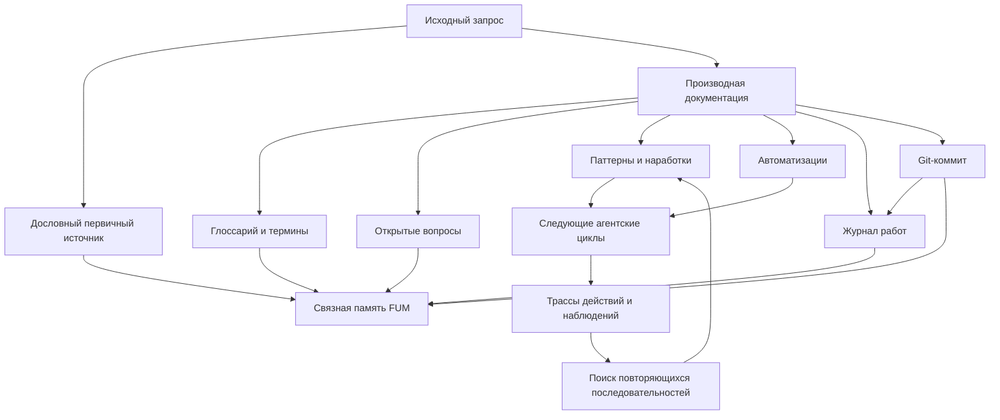

# Модель [памяти FUM](../Глоссарий/память-FUM.md)

[FUM](../Глоссарий/FUM.md) разрабатывается как открытый агент следующего поколения: система, которая не только выполняет отдельные задачи, но и накапливает связную [память](../Глоссарий/память-FUM.md) о собственном развитии, требованиях, решениях, [исследованиях](../Глоссарий/научное-исследование-FUM.md) и происхождении этих решений. Целевой горизонт [FUM](../Глоссарий/FUM.md) - агент полного цикла разработки и [исследования](../Глоссарий/научное-исследование-FUM.md), способный проходить путь от выработки требований и постановки гипотез до написания кода, [экспериментов](../Глоссарий/эксперимент-FUM.md), проверки результатов и оформления [открытий](../Глоссарий/открытие-FUM.md).

## Роль [памяти](../Глоссарий/память-FUM.md)

[Память FUM](../Глоссарий/память-FUM.md) должна быть проверяемой и публикуемой. Каждый значимый запрос сохраняется как [первичный источник](../Глоссарий/исходный-запрос.md), а [производная документация](../Глоссарий/производная-документация.md) показывает, как этот источник превращается в требования, описания и проектные решения.

На документационной стадии текущий репозиторий служит [документационным прототипом FUM](../Глоссарий/документационный-прототип-FUM.md). Это означает, что [память](../Глоссарий/память-FUM.md) уже проверяется как будущая рабочая форма: входы, документы, термины, автоматизации, проверки, журнал и Git-история связаны так, чтобы позже стать данными и контрактами [коробочной реализации FUM](../Глоссарий/коробочная-реализация-FUM.md).

## Высокоуровневая история работ

[Журнал работ](../Глоссарий/журнал-работ.md) добавляет к [памяти FUM](../Глоссарий/память-FUM.md) слой человекочитаемой истории. Он не подменяет дословные [исходные запросы](../Глоссарий/исходный-запрос.md), [производную документацию](../Глоссарий/производная-документация.md), проверки или Git-коммиты, а связывает их в более обзорные отчёты о том, что было сделано и зачем.

Такой слой нужен, чтобы развитие [памяти](../Глоссарий/память-FUM.md) можно было читать не только как последовательность файловых изменений, но и как историю рабочих намерений, решений, результатов и следующих возможных шагов.

## Схема [памяти FUM](../Глоссарий/память-FUM.md)

## [Навигация по памяти FUM](../Глоссарий/навигация-по-памяти-FUM.md) как входной сигнал

[Навигация по памяти FUM](../Глоссарий/навигация-по-памяти-FUM.md) не должна теряться как вторичный интерфейсный жест. Для [памяти FUM](../Глоссарий/память-FUM.md) значимы открытие документа, переход по ссылке, поиск, прокрутка, выбор фрагмента, возврат к прежнему месту и другой путь пользователя или агента по материалам [памяти](../Глоссарий/память-FUM.md).

[FUM](../Глоссарий/FUM.md) должен рассматривать [навигацию по памяти FUM](../Глоссарий/навигация-по-памяти-FUM.md) как [наблюдаемый входной сигнал](../Глоссарий/наблюдаемый-входной-сигнал.md) наравне с созданием [исходного запроса](../Глоссарий/исходный-запрос.md). Это требование не зависит от модальности ввода: клавиатуры, мыши, трекпада, других графических устройств, аудиоввода или будущих интерфейсов.

В [памяти](../Глоссарий/память-FUM.md) должен сохраняться не только итоговый открытый фрагмент, но и наблюдаемый путь: исходная позиция, целевой объект, способ перехода, последовательность событий, время и связь с последующими действиями [агентского цикла](../Глоссарий/агентский-цикл.md).

## [Память](../Глоссарий/память-FUM.md) шагов и [паттернов](../Глоссарий/паттерн-памяти.md)

[FUM](../Глоссарий/FUM.md) должен запоминать не только внешние требования и итоговые решения, но и собственные шаги: выбранные действия, полученные наблюдения, промежуточные состояния, ошибки, возвраты и успешные переходы. Такая [память](../Глоссарий/память-FUM.md) делает траекторию работы самостоятельным объектом анализа.

На основе накопленных шагов [FUM](../Глоссарий/FUM.md) должен выявлять повторяющиеся последовательности наблюдений и действий. Повторяемость сама по себе не считается достаточной: последовательности должны проходить отбор по устойчивости, применимости и связи с результатами. Закреплённые таким образом [паттерны](../Глоссарий/паттерн-памяти.md) становятся материалом для следующих [агентских циклов](../Глоссарий/агентский-цикл.md), workflow и [модулей](../Глоссарий/модуль-FUM.md) [памяти](../Глоссарий/память-FUM.md).

Механизм выявления повторяемости должен быть обобщён за пределы последовательностей действий агента. [Память FUM](../Глоссарий/память-FUM.md) должна уметь применять один и тот же принцип к байтам, текстовым единицам, структурированным событиям, состояниям, трассам и уже найденным [паттернам](../Глоссарий/паттерн-памяти.md). Подробное требование описано в документе [Обобщённый поиск повторяющихся последовательностей](08-обобщённый-поиск-повторяющихся-последовательностей.md) и термине [обобщённый поиск повторяющихся последовательностей](../Глоссарий/обобщённый-поиск-повторяющихся-последовательностей.md).

Нижним уточнением этой модели является [потоковая самоструктуризация FUM](../Глоссарий/потоковая-самоструктуризация-FUM.md). [Память](../Глоссарий/память-FUM.md) должна хранить не только готовые документы и шаги, но и быстрые статистические гипотезы о единицах потока: байтовых регулярностях, скрытых кодах, морфемоподобных фрагментах, словоподобных блоках, классах заменяемости, конструкциях и событийных схемах. Такие гипотезы проходят путь от [суффиксно-предиктивной памяти FUM](../Глоссарий/суффиксно-предиктивная-память-FUM.md) к [паттернам памяти](../Глоссарий/паттерн-памяти.md), а затем, при достаточной пользе и проверке, к [контролируемой нейропластичности FUM](../Глоссарий/контролируемая-нейропластичность-FUM.md).

Минимальным рабочим ядром этой линии является память [структурирующих операторов FUM](../Глоссарий/структурирующий-оператор-FUM.md). Она хранит не только то, что система сама вывела из потока, но и предварительные знания, заданные человеком, LLM или автоматизацией: формы распознавания, правила порождения, признаки, условия применимости, ограничения, цену, доверие, происхождение и историю подтверждений. Такая память должна пополняться как заранее, так и в процессе анализа входного потока, но каждое пополнение оценивается по тому, делает ли оно описание потока компактнее, предсказуемее и полезнее для последующей обработки.

Структурирующие операторы в памяти должны образовывать иерархию, а не один общий слой правил. В рабочей форме это не чистое дерево, а многоуровневый граф: низкая форма может участвовать в нескольких синтаксических, семантических и дискурсивных связях. Низкие операторы могут быть привязаны к конкретному языку, письменности или формату: например, к русскому окончанию, суффиксу, варианту транслитерации или связи кириллической и латинской записи. Более высокие операторы должны связывать уже семантические структуры: они могут соединять русские и английские конструкции, если сохраняют общий смысл, роль в высказывании или переводимый шаблон и явно указывают, какие поверхностные детали, языково-специфичные признаки и смысловые оттенки теряются или остаются как остаток.

Недостающий структурирующий элемент является диагностическим сигналом. Он может означать ошибку, шум, неполноту или неточность входного потока; может означать, что текущая память операторов недостаточна; а может указывать на полезную новую форму. Поэтому [память FUM](../Глоссарий/память-FUM.md) должна хранить не только принятые операторы, но и остатки разбора, частичные совпадения, конфликты, отклонённые кандидаты, причины отказа, случаи неоднозначности и связь между выигрышем сжатия, качеством предсказания, обратным порождением и стоимостью хранения. Кандидаты могут жить в статусах гипотезы, низкодоверительного оператора, подтверждённого оператора, отклонённого оператора или устаревшего оператора.

## [Память](../Глоссарий/память-FUM.md) [автоматизаций](../Глоссарий/автоматизация-FUM.md)

Устойчивые [автоматизации FUM](../Глоссарий/автоматизация-FUM.md) должны входить в [память](../Глоссарий/память-FUM.md) не только как результаты работы, но и как восстановимые источники поведения. Для них сохраняются исходные тексты, конфигурации, версии, входные и выходные схемы, тесты, трассы запусков и история изменений.

[Память FUM](../Глоссарий/память-FUM.md) должна позволять восстановить, почему конкретная автоматизация восприняла сигнал, выбрала действие, построила визуализацию на дисплее или изменила состояние именно так. Если поведение зависит от внешнего сервиса, времени, случайности, модели или недоступного состояния, эти зависимости должны быть явно зафиксированы.

[Автоматические органы восприятия FUM](../Глоссарий/автоматический-орган-восприятия-FUM.md) добавляют к этой модели первичное сжатие внешних событий. Когда входной поток слишком широк для полного прямого запоминания, [FUM](../Глоссарий/FUM.md) должен сохранять компактное описание, достаточное для обработки LLM внутри системы, а также происхождение, время, канал, ограничения и известные потери деталей.

Идея [чистых функций](../Глоссарий/чистая-функция.md) используется как предпочтительный паттерн: преобразования данных и построение решений по возможности отделяются от побочных эффектов, а действия, вызовы инструментов, запись файлов, интерфейсное отображение и физическое воздействие фиксируются отдельными наблюдаемыми шагами. Подробное требование описано в документе [Воспроизводимые автоматизации FUM](17-воспроизводимые-автоматизации.md).

## Доступ к [внутренним состояниям](../Глоссарий/внутреннее-состояние.md)

[Память FUM](../Глоссарий/память-FUM.md) требует доступа ко всем собственным [внутренним состояниям](../Глоссарий/внутреннее-состояние.md) агента. Агент должен видеть и обрабатывать не только внешние результаты инструментов, но и собственные рабочие состояния: цели, планы, активные [ветки](../Глоссарий/ветка-работы.md), промежуточные результаты, ошибки, состояние интерфейса и данные, из которых этот интерфейс построен.

Если информация отображается пользователю, она должна быть доступна [FUM](../Глоссарий/FUM.md) как наблюдение. Иначе [память](../Глоссарий/память-FUM.md) становится неполной: агент не может восстановить собственный ход работы, выявить [паттерн](../Глоссарий/паттерн-памяти.md) или исправить ошибку, если значимая часть состояния была видима человеку, но невидима самому агенту.

Подробное требование к наблюдаемости [внутренних состояний](../Глоссарий/внутреннее-состояние.md) описано в документе [Доступ к внутренним состояниям](07-доступ-к-внутренним-состояниям.md).

## Обмен [наработками](../Глоссарий/наработка.md) между узлами

Самосовершенствование [FUM](../Глоссарий/FUM.md) требует, чтобы накопленные [наработки](../Глоссарий/наработка.md) могли сохраняться не только внутри одного узла, но и передаваться другим узлам в устойчивой форме. [Наработка](../Глоссарий/наработка.md) становится переносимой единицей [памяти](../Глоссарий/память-FUM.md), если вместе с содержанием сохраняет происхождение, версию, условия применимости, проверочный статус и [уровень доступа](../Глоссарий/уровень-доступа.md).

[FUM](../Глоссарий/FUM.md) должен также уметь заимствовать [наработки](../Глоссарий/наработка.md) от других узлов, к которым предоставлен доступ. Такое заимствование не является простым копированием: [память](../Глоссарий/память-FUM.md) должна проверить права использования, совместимость, происхождение, ограничения дальнейшей передачи и возможные конфликты с уже закреплёнными требованиями.

Подробное требование к обмену [наработками](../Глоссарий/наработка.md) и [уровням доступа](../Глоссарий/уровень-доступа.md) описано в документе [Обмен наработками и уровни доступа](09-обмен-наработками-и-уровни-доступа.md).

## Модели других узлов

[Память FUM](../Глоссарий/память-FUM.md) должна включать [внутренние модели других FUM-узлов](../Глоссарий/внутренняя-модель-другого-узла.md), с которыми агент взаимодействует. Такая модель фиксирует историю связи, доступные каналы, известные цели и ограничения узла, совместимость [наработок](../Глоссарий/наработка.md), уровень доверия, происхождение сведений и [границы доступа](../Глоссарий/уровень-доступа.md).

Люди рассматриваются как [FUM-узлы](../Глоссарий/FUM-узел.md): при взаимодействии с человеком [FUM](../Глоссарий/FUM.md) должен поддерживать модель, которая помогает понимать контекст совместной работы, но не претендует на полный доступ к [внутреннему состоянию](../Глоссарий/внутреннее-состояние.md) человека. [Память](../Глоссарий/память-FUM.md) должна различать прямые слова человека, наблюдения, производные выводы, неизвестность и сведения, которые нельзя передавать дальше.

Подробное требование к [внутренним моделям взаимодействующих узлов](../Глоссарий/внутренняя-модель-другого-узла.md) описано в документе [Внутренние модели других узлов](10-внутренние-модели-других-узлов.md).

## Гибридные и коллективные узлы

[Память FUM](../Глоссарий/память-FUM.md) должна поддерживать режим [личного персонального агента человека](../Глоссарий/личный-FUM-агент.md). В этом режиме значимой единицей [памяти](../Глоссарий/память-FUM.md) становится не только отдельный агент и не только модель человека, но и [гибридный узел](../Глоссарий/гибридный-узел.md) человек-[FUM](../Глоссарий/FUM.md): длительная связка с общей рабочей [памятью](../Глоссарий/память-FUM.md), историей решений, границами автономии и правилами подтверждения действий.

Такая связка не отменяет приватную область человека и не превращает модель человека в самого человека. [Память](../Глоссарий/память-FUM.md) должна различать личное состояние человека, состояние агента, общую [память](../Глоссарий/память-FUM.md) [гибридного узла](../Глоссарий/гибридный-узел.md) и внешние представления этой связки для других узлов.

Сети [гибридных узлов](../Глоссарий/гибридный-узел.md) могут образовывать более сложные [FUM-узлы](../Глоссарий/FUM-узел.md): семьи, команды, компании, сообщества и другие элементы цивилизации. Для [памяти](../Глоссарий/память-FUM.md) это означает необходимость хранить уровни принадлежности, роли, общие решения, [правила доступа](../Глоссарий/уровень-доступа.md) и происхождение [наработок](../Глоссарий/наработка.md) на нескольких социальных уровнях. Подробное требование описано в документе [Гибридные узлы и социальная фрактальность](12-гибридные-узлы-и-социальная-фрактальность.md).

## Среды [внутренних FUM](../Глоссарий/внутренний-FUM.md)

[Память FUM](../Глоссарий/память-FUM.md) должна поддерживать [модельные окружающие среды](../Глоссарий/модельная-среда.md), внутри которых могут существовать [внутренние FUM](../Глоссарий/внутренний-FUM.md). Такая среда фиксирует состояние мира или задачи, участников, объекты, ограничения, события, источники, уровень уверенности и [режим доступа](../Глоссарий/уровень-доступа.md).

Эти среды нужны для трёх временных режимов [памяти](../Глоссарий/память-FUM.md): описания актуального мира, реконструкции прошлого и планирования будущего. [FUM](../Глоссарий/FUM.md) должен различать наблюдаемое текущее состояние, гипотетически восстановленную историю и возможные будущие сценарии, не смешивая их в один тип утверждений.

Действия [внутренних FUM](../Глоссарий/внутренний-FUM.md) внутри такой среды должны считаться модельными действиями до тех пор, пока [FUM](../Глоссарий/FUM.md) отдельно не примет решение о переходе к действию во внешнем мире. Подробное требование описано в документе [Среда для внутренних FUM](11-среда-для-внутренних-FUM.md). Статус [внутренних FUM](../Глоссарий/внутренний-FUM.md) и границы между разными типами вложенных узлов зафиксированы как [открытый вопрос](../Вопросы/2026-06-22_06-35-26_MSK_статус-внутренних-FUM.md).

## [Виртуализованные среды](../Глоссарий/виртуализованная-среда-FUM.md) долговременной [памяти](../Глоссарий/память-FUM.md)

[Память FUM](../Глоссарий/память-FUM.md) должна уметь выступать не только как хранилище записей, но и как среда, которую один [FUM-узел](../Глоссарий/FUM-узел.md) предъявляет вложенным узлам. Такой слой может скрывать более сырой субстрат и давать поверх него организованный интерфейс долговременной [памяти](../Глоссарий/память-FUM.md).

В предельном системном случае слой [FUM](../Глоссарий/FUM.md), запущенный на голом железе, может заменить интерфейс сырого накопителя файловой системой, графом [памяти](../Глоссарий/память-FUM.md), журналом событий или другой формой организации долговременного состояния. Для модели [памяти](../Глоссарий/память-FUM.md) важно не выбирать один формат заранее, а сохранять происхождение, карту преобразования, проверки целостности, [уровни доступа](../Глоссарий/уровень-доступа.md) и восстановимость между нижним и верхним слоями.

Подробное требование описано в документе [Виртуализованные среды FUM и долговременная память](23-виртуализованные-среды-и-долговременная-память.md).

## Биологический образец [памяти](../Глоссарий/память-FUM.md)

Моделью для [памяти FUM](../Глоссарий/память-FUM.md) является организация [памяти](../Глоссарий/память-FUM.md) в живых организмах: от генома до накопленного опыта в нервной системе. Геном задаёт наследуемую структуру и материал для вариаций, а нервная система накапливает индивидуальный опыт, перестраивая связи в зависимости от действия, среды и результатов.

Для [FUM](../Глоссарий/FUM.md) это означает, что [память](../Глоссарий/память-FUM.md) должна быть многоуровневой. Долговременные основания, рабочие состояния, варианты решений и закреплённые результаты должны участвовать в едином цикле наследования, изменчивости и отбора. Без этого цикла [память](../Глоссарий/память-FUM.md) остаётся хранилищем; с ним она становится средой полноценного процесса мышления.

В архитектуре памяти это требует нескольких темпов обновления. Быстрая память хранит контексты, кэши, счётчики и временные решётки [самотокенизации FUM](../Глоссарий/самотокенизация-FUM.md). Средняя память хранит проверенные адаптеры, экспертов, правила маршрутизации и устойчивые [паттерны](../Глоссарий/паттерн-памяти.md). Медленная память хранит консолидированные документы, модули, автоматизации, модели и [наработки](../Глоссарий/наработка.md). Перенос между темпами должен проходить через replay, проверку, происхождение и возможность отката.

## Неокортекс и [модульность](../Глоссарий/модуль-FUM.md)

Устройство неокортекса является для [FUM](../Глоссарий/FUM.md) дополнительным образцом [памяти](../Глоссарий/память-FUM.md) и архитектуры. В рамках проекта важен принцип повторяемых универсальных [модулей](../Глоссарий/модуль-FUM.md), которые могут объединяться в сеть из самих себя.

[Память FUM](../Глоссарий/память-FUM.md) поэтому должна проектироваться не только как набор уровней, но и как сеть повторяемых узлов. Каждый такой узел должен быть способен хранить состояние, вступать в связи с другими узлами, участвовать в перестройке сети и становиться частью структуры более высокого уровня. Подробное архитектурное требование описано в документе [Модульная архитектура FUM](05-модульная-архитектура-FUM.md).

## Принципы связности

- [Исходные запросы](../Глоссарий/исходный-запрос.md) сохраняют голос и формулировки пользователя.
- Документация превращает запросы в структурированное описание [FUM](../Глоссарий/FUM.md).
- [Журнал работ](../Глоссарий/журнал-работ.md) сохраняет человекочитаемую высокоуровневую историю рабочих сессий.
- Перекрестные ссылки позволяют восстановить происхождение каждого требования.
- Git-коммиты фиксируют последовательность изменений [памяти](../Глоссарий/память-FUM.md).

## Параллельные линии [памяти](../Глоссарий/память-FUM.md)

[FUM](../Глоссарий/FUM.md) должен поддерживать параллельные линии работы над задачами, которые могут развиваться в разных [ветках](../Глоссарий/ветка-работы.md) и затем возвращаться в общее состояние через слияние. Для модели [памяти](../Глоссарий/память-FUM.md) это означает, что отдельные [ветки](../Глоссарий/ветка-работы.md) должны сохранять свой контекст и происхождение решений, а объединение результатов должно поддерживать связность общей [памяти](../Глоссарий/память-FUM.md).

Подробное требование к параллельной работе и слиянию описано в документе [Параллельная работа и слияние](04-параллельная-работа-и-слияние.md).

## Язык [памяти](../Глоссарий/память-FUM.md)

[Память FUM](../Глоссарий/память-FUM.md) различает [первичные источники](../Глоссарий/исходный-запрос.md) и производные описания. [Исходные запросы](../Глоссарий/исходный-запрос.md) сохраняются дословно, включая исходную раскладку, транслит, опечатки и авторскую пунктуацию. Производные материалы, включая документацию, README, служебные описания в файлах запросов и русскоязычные имена файлов и каталогов, формулируются на русском языке кириллицей.

## Направление развития

[FUM](../Глоссарий/FUM.md) мыслится как [фрактальный узел мышления](../Глоссарий/фрактальный-узел-мышления.md): агент, чья [память](../Глоссарий/память-FUM.md) строится из малых связанных фрагментов, но постепенно складывается в целостную, расширяемую систему. Эта документация должна развиваться вместе с самим [FUM](../Глоссарий/FUM.md) и описывать его устройство, назначение и требования.

Долгосрочная цель [памяти FUM](../Глоссарий/память-FUM.md) - поддержать такое самопонимание, инженерную и исследовательскую связность, при которых [FUM](../Глоссарий/FUM.md)-агент сможет участвовать в создании собственной следующей версии вплоть до способности написать самого себя.

## Эволюционная природа мышления

Модель [памяти FUM](../Глоссарий/память-FUM.md) строится на основании, что эволюционный процесс тождественен процессу мышления. Поэтому [память](../Глоссарий/память-FUM.md) рассматривается как среда, где запросы, связи, варианты и закреплённые решения образуют развивающийся процесс, а не только архив уже принятых формулировок. Подробно это основание описано в документе [Эволюция и мышление](03-эволюция-и-мышление.md).

## Источники требований

- [исходный запрос 2026-06-21 22:17:26 MSK](../Запросы/2026-06-21_22-17-26_MSK.md)
- [исходный запрос 2026-06-21 22:29:02 MSK](../Запросы/2026-06-21_22-29-02_MSK.md)
- [исходный запрос 2026-06-21 22:38:53 MSK](../Запросы/2026-06-21_22-38-53_MSK.md)
- [исходный запрос 2026-06-21 22:41:51 MSK](../Запросы/2026-06-21_22-41-51_MSK.md)
- [исходный запрос 2026-06-21 22:46:51 MSK](../Запросы/2026-06-21_22-46-51_MSK.md)
- [исходный запрос 2026-06-21 22:54:40 MSK](../Запросы/2026-06-21_22-54-40_MSK.md)
- [исходный запрос 2026-06-21 23:00:38 MSK](../Запросы/2026-06-21_23-00-38_MSK.md)
- [исходный запрос 2026-06-22 05:34:12 MSK](../Запросы/2026-06-22_05-34-12_MSK.md)
- [исходный запрос 2026-06-22 05:39:36 MSK](../Запросы/2026-06-22_05-39-36_MSK.md)
- [исходный запрос 2026-06-22 05:54:37 MSK](../Запросы/2026-06-22_05-54-37_MSK.md)
- [исходный запрос 2026-06-22 05:59:05 MSK](../Запросы/2026-06-22_05-59-05_MSK.md)
- [исходный запрос 2026-06-22 06:08:01 MSK](../Запросы/2026-06-22_06-08-01_MSK.md)
- [исходный запрос 2026-06-22 06:17:48 MSK](../Запросы/2026-06-22_06-17-48_MSK.md)
- [исходный запрос 2026-06-22 06:22:15 MSK](../Запросы/2026-06-22_06-22-15_MSK.md)
- [исходный запрос 2026-06-22 06:35:26 MSK](../Запросы/2026-06-22_06-35-26_MSK.md)
- [исходный запрос 2026-06-22 06:40:09 MSK](../Запросы/2026-06-22_06-40-09_MSK.md)
- [исходный запрос 2026-06-22 07:20:42 MSK](../Запросы/2026-06-22_07-20-42_MSK.md)
- [исходный запрос 2026-06-22 08:04:45 MSK](../Запросы/2026-06-22_08-04-45_MSK.md)
- [исходный запрос 2026-06-22 08:58:31 MSK](../Запросы/2026-06-22_08-58-31_MSK.md)
- [исходный запрос 2026-06-22 09:05:49 MSK](../Запросы/2026-06-22_09-05-49_MSK.md)
- [исходный запрос 2026-06-23 19:06:56 MSK](../Запросы/2026-06-23_19-06-56_MSK.md)
- [исходный запрос 2026-06-24 13:57:52 MSK](../Запросы/2026-06-24_13-57-52_MSK.md)
- [исходный запрос 2026-06-25 18:50:18 MSK](../Запросы/2026-06-25_18-50-18_MSK.md)
- [исходный запрос 2026-06-29 10:59:18 MSK](../Запросы/2026-06-29_10-59-18_MSK.md)
- [исходный запрос 2026-07-06 10:05:34 MSK - Интегрировать содержимое ChatGPT диалога](../Запросы/2026-07-06_10-05-34_MSK_интегрировать-содержимое-chatgpt-диалога.md)
- [исходный запрос 2026-07-08 10:18:09 MSK - Закрепить память структурирующих операторов](../Запросы/2026-07-08_10-18-09_MSK_закрепить-память-структурирующих-операторов.md)
- [исходный запрос 2026-07-08 10:34:09 MSK - Добавить источник памяти структурирующих операторов](../Запросы/2026-07-08_10-34-09_MSK_добавить-источник-памяти-структурирующих-операторов.md)
- [исходный запрос 2026-07-08 10:54:49 MSK - Уточнить уровни структурирующих операторов](../Запросы/2026-07-08_10-54-49_MSK_уточнить-уровни-структурирующих-операторов.md)
- [исходный запрос 2026-07-08 11:06:21 MSK - Связать уточнение памяти структурирующих операторов](../Запросы/2026-07-08_11-06-21_MSK_связать-уточнение-памяти-структурирующих-операторов.md)

<!-- FUM-MD-RECENCY:BEGIN -->
<!-- last-content-edit: 2026-07-08 11:14:15 MSK -->
<!-- content-sha256: sha256:04dd520e75810c76ab2cc7258a82a1ac044b9511539e832f4a50d0811d602876 -->
<!-- FUM-MD-RECENCY:END -->
