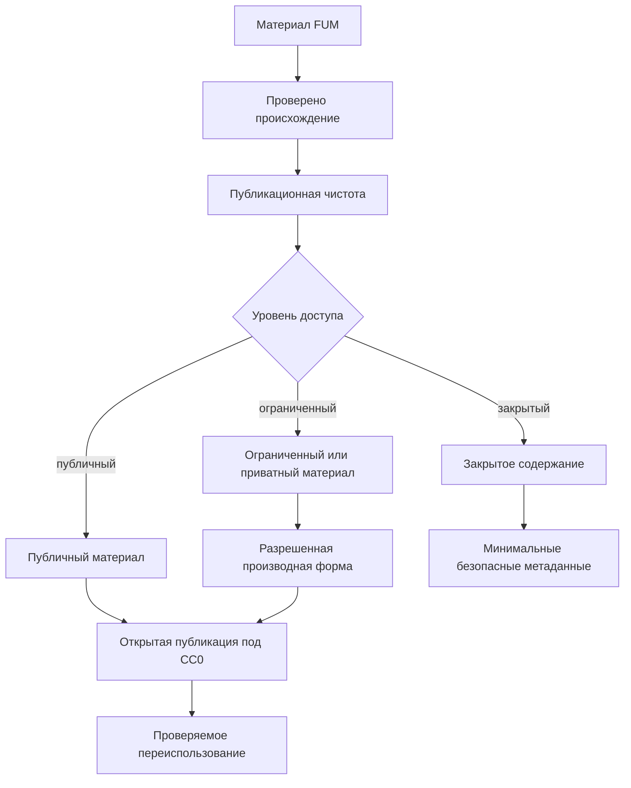

# Публикация и лицензия

Источники требований:

- [исходный запрос 2026-06-21 22:17:26 MSK](../Запросы/2026-06-21_22-17-26_MSK.md)
- [исходный запрос 2026-06-21 22:29:02 MSK](../Запросы/2026-06-21_22-29-02_MSK.md)
- [исходный запрос 2026-06-22 06:17:48 MSK](../Запросы/2026-06-22_06-17-48_MSK.md)
- [исходный запрос 2026-06-22 09:55:43 MSK](../Запросы/2026-06-22_09-55-43_MSK.md)
- [исходный запрос 2026-06-23 19:06:56 MSK](../Запросы/2026-06-23_19-06-56_MSK.md)

## Лицензия

Проект ведётся под лицензией [CC0 1.0 Universal](../LICENSE.md). Это означает намерение публиковать материалы проекта максимально свободно, в форме, пригодной для открытого использования.

Для [FUM](../Глоссарий/FUM.md) CC0 является не только юридической рамкой, но и частью [открытости FUM](../Глоссарий/открытость-FUM.md). Если годный ИИ-агент в долгосрочном пределе способен написать самого себя, его базовая [память](../Глоссарий/память-FUM.md), требования, архитектурные решения и проверяемые [наработки](../Глоссарий/наработка.md) должны быть наследуемыми и доступными для самостоятельного развития другими узлами.

## Публикационная готовность

- Материалы [FUM](../Глоссарий/FUM.md) должны быть понятны вне локального контекста разработки.
- Требования, решения и описания должны сохранять происхождение через ссылки на [исходные запросы](../Глоссарий/исходный-запрос.md).
- Открытая публикация предполагает, что описание [FUM](../Глоссарий/FUM.md) можно читать, проверять, переиспользовать и развивать без закрытых зависимостей.

## Схема публикационной проверки

## Открытость как условие доверия

[Открытость FUM](../Глоссарий/открытость-FUM.md) рассматривается как ключевое проектное требование, а не как дополнительное благо. Чем больше агент способен участвовать в собственном развитии, тем важнее, чтобы его устройство, [память](../Глоссарий/память-FUM.md), правила доступа, [агентские циклы](../Глоссарий/агентский-цикл.md) и [автоматизации](../Глоссарий/автоматизация-FUM.md) могли быть проверены, воспроизведены и перенесены.

Это особенно важно для [личного FUM-агента](../Глоссарий/личный-FUM-агент.md). Персональный агент потенциально охватывает все сферы личной жизни человека и работает с чувствительными личными данными. Поэтому открытость агента становится практически необходимым условием доверия: человек должен иметь возможность понимать и проверять принципы работы агента, его [память](../Глоссарий/память-FUM.md), границы автономии и правила доступа.

Открытость агента не означает публикацию всей личной [памяти](../Глоссарий/память-FUM.md). Публичными должны становиться только материалы, допустимые для открытого распространения, а личные, ограниченные и закрытые части должны защищаться [уровнями доступа](../Глоссарий/уровень-доступа.md), происхождением решений и явными [границами власти](../Глоссарий/граница-власти-FUM.md).

## Публичность и [ограничения доступа](../Глоссарий/уровень-доступа.md)

Публикуемый репозиторий [FUM](../Глоссарий/FUM.md) должен содержать только материалы, пригодные для открытого распространения. Это не отменяет требования к будущей системе [FUM](../Глоссарий/FUM.md) уметь работать с приватными или ограниченно доступными [наработками](../Глоссарий/наработка.md): такие материалы должны иметь явный [уровень доступа](../Глоссарий/уровень-доступа.md) и не должны попадать в публичные пакеты без разрешения.

Если [наработка](../Глоссарий/наработка.md) имеет смешанный состав, публичной может быть только разрешенная часть: описание, обезличенное резюме, интерфейс или производная форма. Ограниченные и приватные части должны оставаться вне открытой публикации, а сама система должна сохранять проверяемые метаданные доступа там, где это безопасно.
