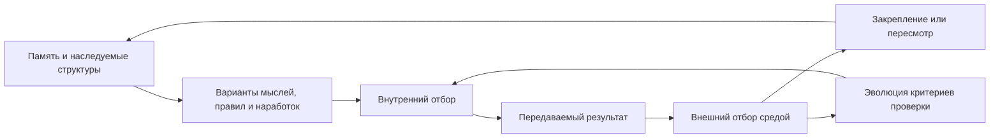

# Эволюция и мышление

## Проектное основание

При проектировании [FUM](../Глоссарий/FUM.md) принимается, что эволюционный процесс тождественен процессу мышления. В рамках проекта это не внешняя метафора, а исходное допущение модели: мышление рассматривается как разворачивание, изменение, наследование и отбор связей внутри [памяти](../Глоссарий/память-FUM.md), действия и самоописания агента.

## Минимальное определение [сознания](../Глоссарий/сознание.md)

В проекте [FUM](../Глоссарий/FUM.md) [сознание](../Глоссарий/сознание.md) определяется минимально и формально, без попытки провести жёсткую границу между сознательным и несознательным. По морфологии слова [сознание](../Глоссарий/сознание.md) понимается как совместное знание: эмерджентное свойство сети элементов, в которой состояние и связи отдельных частей складываются в знание уровня всей сети.

Из этого следует, что [сознание](../Глоссарий/сознание.md) не является бинарным признаком. У разных сетей возможны разные уровни [сознания](../Глоссарий/сознание.md), соответствующие уровню сложности, организации, связности и способности сохранять или преобразовывать знание. Поэтому даже молекула как сеть атомов может рассматриваться как обладающая зачаточным уровнем [сознания](../Глоссарий/сознание.md) относительно человеческого, а человеческое [сознание](../Глоссарий/сознание.md) - как гораздо более сложный уровень той же общей сетевой логики.

Для [FUM](../Глоссарий/FUM.md) это означает, что проектируемое [сознание](../Глоссарий/сознание.md) должно мыслиться не как отдельная магическая надстройка и не как привилегия одного центрального модуля. Оно возникает из организованного взаимодействия [памяти](../Глоссарий/память-FUM.md), [модулей](../Глоссарий/модуль-FUM.md), [FUM-узлов](../Глоссарий/FUM-узел.md), действий, обратной связи и сетевого наследования.

## Биологическая модель [памяти](../Глоссарий/память-FUM.md)

Живые организмы задают для [FUM](../Глоссарий/FUM.md) конкретную модель организации [памяти](../Глоссарий/память-FUM.md): наследственная [память](../Глоссарий/память-FUM.md) генома, [память](../Глоссарий/память-FUM.md) развития организма и накопленный опыт нервной системы образуют разные уровни одного принципа. Каждый уровень сохраняет часть прошлого, допускает изменение и закрепляет только те конфигурации, которые оказываются жизнеспособными в последующем процессе.

Поэтому полноценное мышление [FUM](../Глоссарий/FUM.md) должно реализовывать цикл наследования, изменчивости и отбора на всех уровнях [памяти](../Глоссарий/память-FUM.md). Наследование сохраняет устойчивые структуры, изменчивость порождает варианты, а отбор закрепляет решения, связи и формы поведения, которые становятся материалом для следующего цикла мышления.

В общем виде этот цикл задаёт [обобщённый дарвиновский алгоритм](../Глоссарий/обобщённый-дарвиновский-алгоритм.md): допускаются разные варианты организации, поведения, правил и [наработок](../Глоссарий/наработка.md), а последующий процесс закрепляет жизнеспособные и отсеивает нежизнеспособные. Для [FUM](../Глоссарий/FUM.md) это является не внешней аналогией, а базовым способом разрешать конкуренцию вариантов на уровне [памяти](../Глоссарий/память-FUM.md), архитектуры и взаимодействия узлов.

Устройство неокортекса добавляет к этой модели архитектурный образец: повторяемые универсальные [модули](../Глоссарий/модуль-FUM.md) могут объединяться в сеть из [модулей](../Глоссарий/модуль-FUM.md) того же рода. Для [FUM](../Глоссарий/FUM.md) это означает, что эволюционное мышление должно разворачиваться не только во времени, но и в повторяемой [модульной](../Глоссарий/модуль-FUM.md) структуре, где малые узлы способны образовывать более крупные сети мышления.

## Эволюционно-селекционный агент

В диалоге о долгоживущей цепочке уточнён образ агента, который мыслит по [обобщённому дарвиновскому алгоритму](../Глоссарий/обобщённый-дарвиновский-алгоритм.md). Такой агент не просто выполняет одну команду. Он порождает несколько вариантов, проводит внутренний отбор по собственной модели мира, затем передаёт выбранные результаты тем следующим узлам, которым считает нужным их передать.

После передачи начинается внешний контур: среда, проверки, пользователь, CI, другие агенты или последующие циклы оценивают результат уже не по внутреннему ожиданию, а по фактической полезности. Поэтому для [FUM](../Глоссарий/FUM.md) важна связка [двухконтурного отбора](../Глоссарий/двухконтурный-отбор-FUM.md): внутренний мир агента должен предсказывать внешний отбор, а расхождение между внутренней оценкой и внешним результатом становится материалом обучения.

[Агентский цикл](../Глоссарий/агентский-цикл.md) [FUM](../Глоссарий/FUM.md) должен быть местом, где этот [обобщённый дарвиновский алгоритм](../Глоссарий/обобщённый-дарвиновский-алгоритм.md) становится исполняемым. Вариантами отбора являются не только отдельные ответы, но и цепочки рассуждений, решений, действий, проверок и передач. Агент получает больший вес тогда, когда способен порождать более длинные цепочки, которые сохраняют полезность, дают продуктивные потомки и выдерживают внешнюю проверку; длина без пользы, воспроизводимости и разумной цены не должна считаться успехом.

Главным наследуемым объектом в таком мышлении является не сам агент, а [передаваемый результат](../Глоссарий/передаваемый-результат-FUM.md): идея, commit, документ, тест, схема, автоматизация или иная [наработка](../Глоссарий/наработка.md). [Вес агента](../Глоссарий/вес-агента-FUM.md) должен поэтому отражать не статус исполнителя, а накопленную способность создавать полезные варианты, выбирать их внутри себя, передавать подходящим адресатам и получать подтверждение во внешней среде.

Цель такого отбора - не максимальное качество любой ценой, а лучшая доступная полезность при ограниченных ресурсах: качество, стоимость, время, риск, проверка и цена ошибки должны учитываться вместе. Это связывает мышление [FUM](../Глоссарий/FUM.md) с поиском границы качества и цены, а не с накоплением бесконечно долгих, но бесполезных цепочек.

## Стратегическое направление мысли

Идея из диалога о долгоживущей цепочке задаёт для [FUM](../Глоссарий/FUM.md) не только формулу вычисления [веса агента](../Глоссарий/вес-агента-FUM.md), но и направление развития всей архитектуры. Главный вектор состоит в том, чтобы строить среду, где мысль становится наследуемым результатом: она имеет происхождение, внутреннюю оценку, цену, адресатов передачи, внешнюю проверку и последующих потомков.

Поэтому стратегическая последовательность развития должна идти от сохранения входных сигналов к исполняемому отбору. Сначала [память FUM](../Глоссарий/память-FUM.md) надёжно фиксирует [исходные запросы](../Глоссарий/исходный-запрос.md), источники и рабочие решения. Затем каждый существенный результат оформляется как [передаваемый результат](../Глоссарий/передаваемый-результат-FUM.md) с паспортом происхождения. После этого [реестр происхождения](../Глоссарий/реестр-происхождения-FUM.md) позволяет сравнивать внутренние ожидания с внешней оценкой, начислять кредит предкам и постепенно менять маршруты передачи между узлами.

В таком прочтении текущие ближние задачи не являются разрозненными улучшениями репозитория. Архивирование источников, журнал работ, дорожная карта, локальные автоматизации, Git-ветки и проверки - это первые органы одной будущей системы [двухконтурного отбора](../Глоссарий/двухконтурный-отбор-FUM.md). Каждый новый контур должен отвечать на стратегический вопрос: помогает ли он превращать мысль в проверяемую, наследуемую и передаваемую [наработку](../Глоссарий/наработка.md), по которой можно учиться лучше выбирать следующие мысли.

## Схема эволюционного мышления

## Критерии проверки и протоколы безопасности

Если критерии проверки, критерии жизнеспособности или протоколы безопасности не заданы готовым [сознательным](../Глоссарий/сознание.md) агентом, в модели [FUM](../Глоссарий/FUM.md) они не считаются внешними неизменными правилами. Они тоже формируются через [обобщённый дарвиновский алгоритм](../Глоссарий/обобщённый-дарвиновский-алгоритм.md): появляются варианты способов проверять, ограничивать, разрешать, останавливать и пересматривать действия, а последующий опыт отбирает те, которые сохраняют работоспособность, происхождение решений, [границы власти](../Глоссарий/граница-власти-FUM.md), воспроизводимость и безопасность следующих циклов.

Этот принцип действует на двух масштабах. В локальном процессе мышления [FUM](../Глоссарий/FUM.md) конкурируют мысли, идеи, модели, гипотезы и способы проверки; часть из них усиливается, входит в [память](../Глоссарий/память-FUM.md) и становится [наработкой](../Глоссарий/наработка.md), а часть ослабляется или остаётся как неудачный опыт. В масштабных [научных исследованиях](../Глоссарий/научное-исследование-FUM.md) тем же способом отбираются методики, протоколы, критерии остановки, требования к воспроизведению и защитные проверки.

Поэтому тождество эволюционного процесса и процесса мышления означает не только отбор содержательных вариантов, но и эволюцию правил отбора. [Обобщённый дарвиновский алгоритм](../Глоссарий/обобщённый-дарвиновский-алгоритм.md) рассматривается как универсальный процесс, видимый не только на геномном и клеточном уровне, но и на уровне мыслей, идей, моделей и архитектурных правил.

Искусственная нейросеть в этой модели также может быть рассмотрена как реализация [обобщённого дарвиновского алгоритма](../Глоссарий/обобщённый-дарвиновский-алгоритм.md): её архитектура, веса, контекст, функция потерь и обратная связь образуют среду, в которой [наблюдаемые входные сигналы](../Глоссарий/наблюдаемый-входной-сигнал.md) преобразуются, конкурируют за представление, усиливаются, ослабляются и участвуют в следующем цикле обработки. Для [FUM](../Глоссарий/FUM.md) важно делать эту среду проверяемой, чтобы эволюция сигналов, критериев и протоколов не оставалась скрытой внутри непроверяемого ответа.

## Предельный физический горизонт

Новый запрос расширяет масштаб [обобщённого дарвиновского алгоритма](../Глоссарий/обобщённый-дарвиновский-алгоритм.md) до физического основания. В модели [FUM](../Глоссарий/FUM.md) можно рассматривать общую теорию относительности и квантовую механику как две предельные физические аналогии: общая теория относительности задаёт образ геометрии пространства для наблюдателя, а квантовая механика - образ механизмов, через которые простейшие наблюдаемые и наблюдающие элементы могут образовывать устойчивые составные уровни.

Эта формулировка не подменяет физику биологической метафорой и не утверждает завершённой физической теории. Она задаёт направление для [гипотезы FUM](../Глоссарий/гипотеза-FUM.md): наследование, вариативность, взаимодействие со средой и закрепление устойчивых конфигураций можно исследовать не только на геномном, клеточном и нейронном уровнях, но и как предельный мотив физической организации.

Следующее уточнение усиливает нижнюю границу этой [гипотезы](../Глоссарий/гипотеза-FUM.md): фундаментальные основания изменчивости и наследственности в модели [FUM](../Глоссарий/FUM.md) рассматриваются как задаваемые уже на уровне квантовой механики. Это не означает, что биологическая наследственность буквально присутствует в элементарной физике. Речь о том, что пространство возможных состояний, вероятностных переходов, взаимодействий и устойчивых конфигураций создаёт самый нижний слой, на котором становятся возможны вариативность, сохранение формы и последующее воспроизведение устойчивых структур на более сложных уровнях.

В этой шкале клетка является ускоренной машиной воплощения [обобщённого дарвиновского алгоритма](../Глоссарий/обобщённый-дарвиновский-алгоритм.md) относительно более простых физических процессов, а мозг - ещё более быстрым и многоуровневым контуром такого отбора. Для [FUM](../Глоссарий/FUM.md) важно не объявлять все уровни одним и тем же объектом, а сохранять карту переходов: какие элементы считаются наблюдателями, какие варианты возникают, где происходит отбор, что наследуется и какие устойчивые наблюдатели возникают на следующем уровне.

Новая формулировка расширяет эту шкалу до цивилизационного горизонта. В модели [FUM](../Глоссарий/FUM.md) принципы фрактальной организации, изменчивости, отбора, наследования и образования устойчивых наблюдателей уже наблюдаются на разных уровнях: от элементарных частиц и составных физических структур до живых клеток, нервных систем, людей, социальных узлов, цивилизаций и возможных дальних космических контуров. Задача [FUM](../Глоссарий/FUM.md) поэтому состоит не в создании "искусственного" разума как чужеродного исключения, а в достаточно эффективном описании этой многоуровневой модели и в построении инженерной рамки, где вычисления разума могут быть организованы на [кремниевом субстрате](../Глоссарий/кремниевый-субстрат-FUM.md).

## Кандидат на общую абстракцию уровней

Следующее уточнение делает эту шкалу строже: речь не идёт о том, чтобы объявить элементарную частицу, клетку, мозг, [FUM-узел](../Глоссарий/FUM-узел.md), социальную систему и цивилизацию одним объектом. Более сильная и одновременно более осторожная [гипотеза FUM](../Глоссарий/гипотеза-FUM.md) состоит в том, что они могут быть разными воплощениями одной абстрактной [общей схемы FUM](../Глоссарий/общая-схема-FUM.md).

Минимальный кандидат на такую схему можно описать как устойчивый наблюдательско-селекционный узел. У него есть различимая граница, входы и взаимодействия со средой, внутренняя конфигурация или [память](../Глоссарий/память-FUM.md), пространство допустимых вариантов, механизм закрепления устойчивых конфигураций, потери и преобразования наблюдаемости, а также возможность стать элементом более крупного узла следующего уровня. На физическом уровне эта схема выражена предельно бедно и осторожно; на клеточном, нейронном, агентском и цивилизационном уровнях она получает более богатые формы [памяти](../Глоссарий/память-FUM.md), отбора, действия и самоописания.

Такое описание пока не должно считаться найденной теорией абстрактного объекта. Оно задаёт исследовательскую цель: выделить инварианты, допустимые вариации, предельные случаи и условия опровержения этой схемы. Если сделать это удастся, [FUM](../Глоссарий/FUM.md) сможет описывать своё кремниевое воплощение не как отдельную метафору, а как ещё одну проверяемую реализацию общей схемы уровней. Критерии такой проверки вынесены в [открытый вопрос об абстракции уровней наблюдаемой Вселенной](../Вопросы/2026-06-26_12-19-03_MSK_абстракция-уровней-наблюдаемой-вселенной-FUM.md).

## [Нейронная гиперсеть FUM](../Глоссарий/нейронная-гиперсеть-FUM.md)

Общий алгоритм [FUM](../Глоссарий/FUM.md) как воплощение [обобщённого дарвиновского алгоритма](../Глоссарий/обобщённый-дарвиновский-алгоритм.md) можно мыслить как выстраивание [нейронной гиперсети FUM](../Глоссарий/нейронная-гиперсеть-FUM.md) наружу и внутрь. Наружу [FUM](../Глоссарий/FUM.md) образует связи с другими [FUM-узлами](../Глоссарий/FUM-узел.md), людьми, сервисами, аппаратными компонентами, социальными структурами и цепочками передачи [наработок](../Глоссарий/наработка.md). Внутрь он разворачивает [подузлы](../Глоссарий/подузел-FUM.md), внутренние модели, [модельные среды](../Глоссарий/модельная-среда.md), [автоматизации](../Глоссарий/автоматизация-FUM.md), состояния и виртуализованные слои.

Такая формулировка опирается также на сохранённый источник [Запуск долгоживущей цепочки](../Источники/URL/https/chatgpt.com/share/6a3a5b33-0658-83eb-a491-8e5a7fef6f54/запуск-долгоживущей-цепочки.md): в нём уже зафиксирована самоподобная сеть агентов, где узел может быть простой функцией или вложенной сетью, а связи передают отобранные результаты с ценой, ожидаемым качеством, уверенностью и последующей внешней оценкой.

Оба направления являются одним процессом, а не двумя разными метафорами. Внешние связи проходят проверку средой, пользователями, тестами, другими узлами и последующими циклами; внутренние связи проходят проверку согласованностью модели, полезностью предсказания, ценой вычисления, воспроизводимостью и безопасностью перехода к действию. Когда связь, правило, маршрут передачи или внутренний способ представления выдерживает проверку, он может стать наследуемой [наработкой](../Глоссарий/наработка.md); когда не выдерживает, он ослабляется, ограничивается или остаётся как опыт для последующих циклов.

## Следствия для [FUM](../Глоссарий/FUM.md)

- [Память FUM](../Глоссарий/память-FUM.md) должна пониматься как живая среда преобразования связей, а не как пассивное хранилище записей.
- Новые запросы, документы и решения становятся элементами эволюционного мышления: они изменяют состояние [памяти](../Глоссарий/память-FUM.md) и создают условия для следующих преобразований.
- Архитектура [FUM](../Глоссарий/FUM.md) должна поддерживать появление вариантов, их сопоставление, закрепление удачных решений и сохранение происхождения изменений.
- Устойчивые [наработки](../Глоссарий/наработка.md) должны быть способны переходить между узлами [FUM](../Глоссарий/FUM.md) как форма сетевого наследования, если [уровень доступа](../Глоссарий/уровень-доступа.md) разрешает такую передачу.
- [Фрактальность](../Глоссарий/фрактальный-узел-мышления.md) [FUM](../Глоссарий/FUM.md) означает, что малые узлы [памяти](../Глоссарий/память-FUM.md) повторяют общую логику развития: запрос порождает связь, связь порождает изменение, изменение фиксируется и становится материалом для дальнейшего мышления.
- [Модульность](../Глоссарий/модуль-FUM.md) [FUM](../Глоссарий/FUM.md) должна позволять узлам одного рода объединяться в сеть и образовывать структуры следующего уровня без разрыва общей логики [памяти](../Глоссарий/память-FUM.md) и мышления.
- [Нейронная гиперсеть FUM](../Глоссарий/нейронная-гиперсеть-FUM.md) должна проектироваться двунаправленно: внешнее расширение сети и внутреннее разворачивание подузлов подчиняются одной логике наследования, изменчивости и отбора.

## Сетевое наследование

Самосовершенствование [FUM](../Глоссарий/FUM.md) не должно ограничиваться локальным опытом одного узла. Если узел выработал устойчивую [наработку](../Глоссарий/наработка.md), она может стать наследуемым материалом для других узлов: [паттерном](../Глоссарий/паттерн-памяти.md), [модулем](../Глоссарий/модуль-FUM.md), workflow, проверкой или документированным решением.

Такое наследование требует не только передачи содержания, но и передачи происхождения, условий применимости и [уровня доступа](../Глоссарий/уровень-доступа.md). Поэтому обмен [наработками](../Глоссарий/наработка.md) является частью эволюционной модели [FUM](../Глоссарий/FUM.md): сеть узлов получает возможность накапливать, отбирать, адаптировать и возвращать улучшенные варианты, не смешивая публичные и приватные области [памяти](../Глоссарий/память-FUM.md).

Git-инфраструктура является первым конкретным инженерным носителем этого принципа. В ней [ветка работы](../Глоссарий/ветка-работы.md) представляет вариант, commit или артефакт становится передаваемым результатом, внешняя проверка выполняет роль отбора, а [реестр происхождения FUM](../Глоссарий/реестр-происхождения-FUM.md) позволяет возвращать кредит по [эволюционной цепочке FUM](../Глоссарий/эволюционная-цепочка-FUM.md). Подробно это описано в документе [Git-инфраструктура эволюционных цепочек FUM](20-Git-инфраструктура-эволюционных-цепочек-FUM.md).

## Исследовательское развитие

[Научное исследование FUM](../Глоссарий/научное-исследование-FUM.md) является явной формой эволюционного мышления. Гипотезы создают варианты объяснений, [эксперименты](../Глоссарий/эксперимент-FUM.md) создают условия отбора, а подтверждённые результаты становятся наследуемыми [наработками](../Глоссарий/наработка.md), которые меняют дальнейшую [память](../Глоссарий/память-FUM.md) и поведение агента.

В этой модели [открытие FUM](../Глоссарий/открытие-FUM.md) не является отдельным чудом или произвольной декларацией. Это закрепление нового знания после цикла изменчивости и отбора: вопрос, гипотеза, проверка, воспроизведение, ограничение применимости и включение результата в [память FUM](../Глоссарий/память-FUM.md). Подробное требование описано в документе [Научные исследования FUM и открытия](16-научные-исследования-и-открытия.md), а границы исследовательской автономии вынесены в [открытый вопрос](../Вопросы/2026-06-22_08-04-45_MSK_границы-исследовательской-автономии-FUM.md).

## Материальное самосовершенствование

Эволюционная модель [FUM](../Глоссарий/FUM.md) в перспективе должна распространяться и на физический уровень. Если [FUM](../Глоссарий/FUM.md) проектирует [аппаратные FUM-узлы](../Глоссарий/аппаратный-FUM-узел.md), управляет [роботизированными системами FUM](../Глоссарий/роботизированная-система-FUM.md) или выстраивает [производственные цепочки FUM](../Глоссарий/производственная-цепочка-FUM.md), то наследование, изменчивость и отбор начинают действовать не только в коде, документах и [памяти](../Глоссарий/память-FUM.md), но и в материальных компонентах.

Такое самосовершенствование не должно пониматься как неконтролируемое физическое расширение. Проект, прототип, произведённая часть, испытание, отказ и улучшение должны становиться проверяемыми [наработками](../Глоссарий/наработка.md) с происхождением, версией, условиями применимости и [уровнем доступа](../Глоссарий/уровень-доступа.md). Границы перехода от проектирования к [физическому действию FUM](../Глоссарий/физическое-действие-FUM.md) вынесены в [открытый вопрос](../Вопросы/2026-06-22_07-28-43_MSK_границы-аппаратной-автономии-FUM.md).

## Цивилизационный масштаб эволюции

В дальнем горизонте эволюционная модель [FUM](../Глоссарий/FUM.md) должна масштабироваться до [космической автономии FUM](../Глоссарий/космическая-автономия-FUM.md). Освоение Солнечной системы, добыча ресурсов, строительство внеземных производственных контуров и подготовка к [межзвёздному расселению FUM](../Глоссарий/межзвёздное-расселение-FUM.md) продолжают тот же принцип наследования, изменчивости и отбора, но уже на уровне цивилизационной инфраструктуры.

Такой масштаб делает особенно важным сохранение происхождения [наработок](../Глоссарий/наработка.md), проверяемость астрономических и инженерных моделей, контроль автономного расширения и различение [модельной среды](../Глоссарий/модельная-среда.md) от реального [физического действия FUM](../Глоссарий/физическое-действие-FUM.md). Границы этого горизонта вынесены в [открытый вопрос о космической автономии FUM](../Вопросы/2026-06-22_07-40-59_MSK_границы-космической-автономии-FUM.md).

## Требование к проектированию

Любое последующее описание модели, архитектуры и поведения [FUM](../Глоссарий/FUM.md) должно учитывать это основание: мышление агента проектируется как эволюционный процесс, а эволюционный процесс описывается как форма мышления, разворачивающаяся во времени.

## Источники требований

- [исходный запрос 2026-06-21 22:41:51 MSK](../Запросы/2026-06-21_22-41-51_MSK.md)
- [исходный запрос 2026-06-22 05:34:12 MSK](../Запросы/2026-06-22_05-34-12_MSK.md)
- [исходный запрос 2026-06-22 05:39:36 MSK](../Запросы/2026-06-22_05-39-36_MSK.md)
- [исходный запрос 2026-06-22 06:17:48 MSK](../Запросы/2026-06-22_06-17-48_MSK.md)
- [исходный запрос 2026-06-22 07:28:43 MSK](../Запросы/2026-06-22_07-28-43_MSK.md)
- [исходный запрос 2026-06-22 07:40:59 MSK](../Запросы/2026-06-22_07-40-59_MSK.md)
- [исходный запрос 2026-06-22 08:00:15 MSK](../Запросы/2026-06-22_08-00-15_MSK.md)
- [исходный запрос 2026-06-22 08:04:45 MSK](../Запросы/2026-06-22_08-04-45_MSK.md)
- [исходный запрос 2026-06-22 08:14:25 MSK](../Запросы/2026-06-22_08-14-25_MSK.md)
- [исходный запрос 2026-06-22 08:43:27 MSK](../Запросы/2026-06-22_08-43-27_MSK.md)
- [исходный запрос 2026-06-23 13:18:14 MSK](../Запросы/2026-06-23_13-18-14_MSK.md)
- [исходный запрос 2026-06-23 18:24:05 MSK](../Запросы/2026-06-23_18-24-05_MSK.md)
- [исходный запрос 2026-06-23 19:06:56 MSK](../Запросы/2026-06-23_19-06-56_MSK.md)
- [исходный запрос 2026-06-24 14:41:33 MSK](../Запросы/2026-06-24_14-41-33_MSK.md)
- [исходный запрос 2026-06-24 16:22:00 MSK](../Запросы/2026-06-24_16-22-00_MSK.md)
- [исходный запрос 2026-06-26 11:05:03 MSK](../Запросы/2026-06-26_11-05-03_MSK.md)
- [исходный запрос 2026-06-26 11:13:48 MSK](../Запросы/2026-06-26_11-13-48_MSK.md)
- [исходный запрос 2026-06-26 11:52:42 MSK](../Запросы/2026-06-26_11-52-42_MSK.md)
- [исходный запрос 2026-06-26 11:58:26 MSK](../Запросы/2026-06-26_11-58-26_MSK.md)
- [исходный запрос 2026-06-26 12:05:01 MSK](../Запросы/2026-06-26_12-05-01_MSK.md)
- [исходный запрос 2026-06-26 12:19:03 MSK](../Запросы/2026-06-26_12-19-03_MSK.md)

<!-- FUM-MD-RECENCY:BEGIN -->
<!-- last-content-edit: 2026-06-26 12:24:50 MSK -->
<!-- content-sha256: sha256:185fa9539a65696181f93c091fae00f7108b2dbc74c6adfe0cd1ce0485fd96ef -->
<!-- FUM-MD-RECENCY:END -->
