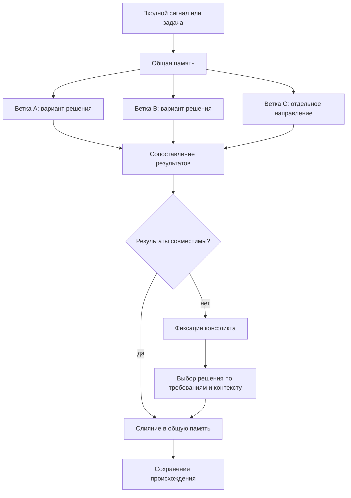

# Параллельная работа и слияние

## Требование

Проектируемый [FUM](../Глоссарий/FUM.md)-агент должен быть способен вести параллельную работу над задачами в разных [ветках](../Глоссарий/ветка-работы.md) и затем объединять результаты через слияние. Такая модель сближает работу агента с командной разработкой людей, где несколько направлений могут развиваться одновременно, а общее состояние проекта собирается через согласование результатов.

## Модель ветвления

[Ветка в FUM](../Глоссарий/ветка-работы.md) понимается как отдельная линия работы над задачей, гипотезой или набором изменений. Она должна сохранять собственный контекст, промежуточные решения, следы происхождения требований и результат работы. Несколько веток могут развиваться параллельно, не разрушая целостность общей [памяти](../Глоссарий/память-FUM.md) проекта.

Такая параллельность важна не только для ускорения работы. Она позволяет [FUM](../Глоссарий/FUM.md) удерживать несколько вариантов решения, сравнивать их, развивать независимые направления и возвращать их в общий контур мышления через управляемое слияние.

## Последовательность задач внутри ветки

Параллельность разных [веток работы](../Глоссарий/ветка-работы.md) не означает одновременное изменение одного checkout несколькими независимыми корневыми задачами. Несколько сессий могут быть запущены параллельно, но перед записью каждая атомарно регистрирует билет в общей FIFO-очереди. Единственный владелец изменяет память, а все более поздние сессии ждут завершения предшественников.

Порядок задаётся возрастающим `seq` первого успешного compare-and-swap, а не настенными часами или моментом создания окна: общий host не предоставляет надёжной атомарной метки такого события. Одна проверка чистоты рабочего дерева тоже недостаточна, потому что несколько задач могут одновременно увидеть чистый checkout. Служебная Git-ссылка и атомарное назначение `seq` превращают регистрацию в единый порядок. Переупорядочивание, приоритеты, уступка позиции и принудительный обход более раннего билета в текущей модели не поддерживаются.

Каждый билет запоминает проверенный `HEAD`. После атомарного коммита владельца передний ожидающий билет обнаруживает новую ревизию, перечитывает изменившиеся правила и материалы, подтверждает точный новый object ID и лишь затем может стать владельцем. Поэтому продолжительное ожидание не оставляет задачу работать по устаревшему снимку контракта, а возобновление того же уже допущенного корневого сеанса сохраняет его поколение владения. Долгоживущий `wait-until-actionable` продолжает read-only-наблюдение внутри одного процесса и сам не печатает промежуточный `waiting`; при поддержке среды продолжения процесса удерживаются внутри одного оркестрационного вызова и по возможности не превращаются в сообщения пользователю или возвраты модели. Команда завершается только при действенном состоянии, например `reload_required`, `admitted`, `dirty` или ошибке. Ограниченный пятиминутный `wait` остаётся совместимым запасным путём: его неизменный результат не требует отдельного содержательного сообщения, но сам служебный возврат и новый инструментальный ход могут занять контекст. Обязательные обновления и poll-события host имеют приоритет над репозиторной политикой.

Завершение задачи связано не с концом отдельного диалогового хода, а с проверяемой передачей. При осмысленном изменении владелец строит commit object из проверенного индекса, а одна Git-транзакция одновременно сравнивает и обновляет ref ветки и JSON-состояние очереди. Падение до транзакции не передаёт право следующей задаче; успешная транзакция фиксирует результат и убирает владельца вместе. Изменения вне корневой `.obsidian/` должны быть полностью staged либо отсутствовать, а состояние `.obsidian/` проходит отдельные правила классификации и публикации.

Законная no-op-задача — например, read-only проверка без замечаний или устаревший автоматический запуск до первой записи — использует отдельное `finish-clean`. Оно требует точного поколения, неизменного `HEAD`, чистоты вне `.obsidian/` и отсутствия любых staged-изменений, затем одной транзакцией проверяет ref ветки и снимает владельца без коммита. Это отмена пустой работы, а не обход или изменение порядка. До любой передачи корень дожидается всех потенциальных поздних писателей; после `finish-clean` он больше ничего не записывает, не публикует и не изменяет резервацию запуска через `rearm` или `release`.

Успешный commit+handoff завершает обычную корневую задачу `master` локально. После передачи прежняя задача не выполняет `push` или `publish`, поэтому автоматическая цепочка может без поэтапного сетевого подтверждения передать очередь следующему готовому шагу. Ручной `push`, инициированный пользователем отдельно, подтверждает публикацию только точного проверенного коммита и его предков; он не разрешает автоматически включать провайдеры, получать новые секреты, нести затраты, читать пользовательские данные или производить иные внешние эффекты. Удалённая вершина не участвует в вычислении готовности, выборе шага, claim или FIFO-допуске. Расхождение истории требует отдельного решения пользователя и не разрешает автоматические `pull`, merge, rebase или force-push.

Субагенты не являются отдельными билетами. Они могут параллельно исполнять непересекающиеся части уже допущенной корневой задачи и синхронизировать выводы штатными сообщениями, но не меняют ветки, индекс и историю. Корневой исполнитель собирает общий diff и перед передачей очереди дожидается всех процессов и субагентов, способных позднее записать результат. Чистота Git сама по себе не доказывает отсутствие уже запущенного отложенного писателя.

Целевой [пишущий подузел FUM](../Глоссарий/пишущий-подузел-FUM.md) является другим классом исполнителя, а не ослабленным режимом такого субагента. Он получает отдельный клон целевого репозитория, точный `base_oid`, уникальную [ветку шага](../Глоссарий/ветка-шага-FUM.md), собственную границу владения и устойчивую ссылку на [кандидатный коммит](../Глоссарий/кандидатный-коммит-FUM.md). Текущая очередь одного checkout не координирует эти клоны; параллельное производство разрешается на разных refs, а интеграция одной целевой ветки сериализуется отдельным владельцем по идентичности репозитория и полного ref.

Над однопакетными пишущими попытками целевой корневой оркестратор управляет [универсальными исполнительными подузлами FUM](../Глоссарий/универсальный-исполнительный-подузел-FUM.md). Такой долговечный дочерний узел обладает тем же общим профилем планирования, очереди, диспетчеризации, проверки и передачи, что и родитель, но действует только внутри явной делегации. Родитель может передать ему конечную линейную цепочку зависимых карточек в отдельной рабочей ветке, параллельно вести другие непересекающиеся цепочки, наблюдать сохранённое состояние и позднее отдельной задачей проверить, принять, отклонить либо отправить результат на доработку.

Долговечный дочерний fork или самостоятельный репозиторий регистрируется в композиционной сборке как Git submodule на точном принятом commit. Сам submodule остаётся detached-снимком и не является рабочим клоном: каждая пишущая цепочка исполняется в отдельном живом клоне с собственной очередью физической рабочей копии и защитными поколениями. Корневая задача не удерживает своё FIFO-поколение на всё время дочерней работы; запуск, наблюдение, проверка и интеграция возобновляются из версионированного состояния делегации.

Текущее локальное воплощение хранит канонический JSON blob под ref, привязанным к физическому worktree, и использует обычные `hash-object`, `update-ref`, `write-tree` и `commit-tree`. Оно не зависит от project hooks, POSIX-блокировок, hard links или сигналов и работает с SHA-1 и SHA-256 object ID. Штатный Python HEAD-bootstrap запускается в isolated mode, исключает checkout из пути импорта, очищает унаследованные Git-перенаправления, ограничивает загрузку 30 секундами, читает сценарий из буквального закоммиченного `HEAD` и закрепляет корень checkout последним аргументом; внутренние Git-вызовы также не учитывают replace-объекты, optional locks и перенаправляющие Git-переменные. Поэтому ожидающая сессия не исполняет незавершённую или локально подменённую копию автоматизации из общего diff. Кооперативная граница действует для задач одного checkout и общего Git-каталога, но не координирует отдельные клоны.

Ни ожидающий билет, ни владелец не истекают автоматически. Удаление исчезнувшего предшественника изменило бы строгий порядок, а захват поверх молчаливого владельца мог бы создать двух писателей. Та же корневая задача может возобновить свой билет или поколение; ожидающий вправе отменить только себя, а допущенный владелец обязан выполнить commit+handoff либо `finish-clean`. Неявного восстановления, TTL и захвата поверх потерянной задачи нет.

Единственное штатное восстановительное исключение терминализирует всю точную очередь, а не пропускает один билет. Оно начинается только отдельным подтверждённым пользовательским ходом в существующей постоянной задаче [диспетчера автоматизаций FUM](../Глоссарий/диспетчер-автоматизаций-FUM.md), никогда не запускается heartbeat и не входит в заблокированную очередь. План закрепляет физический checkout, полный ref локальной именованной ветки, точный `HEAD`, объект `queue-ref`, идентичность диспетчера, участников, изменённые пути, preimage/target каждого изменённого tracked-пути, связанные служебные ссылки и фиксированную эпоху диспетчерских резерваций. Специальный Git-видимый неигнорируемый untracked-объект даёт `unsupported_untracked_type` уже до подготовки. Каждый переход резервации сдвигает эпоху в той же Git-транзакции, поэтому даже создание ранее отсутствовавшей резервации конфликтует с подготовкой. После точного подтверждения CAS-запись `reset-record` в самой ссылке очереди блокирует обычные переходы FIFO, диспетчерские резервации, карточочные claim и создание новых задач до терминального исхода.

До подготовки каждый прежний участник, кроме точно совпавшего диспетчера, должен разрешаться актуальным точным host-снимком. Текущий host API не предоставляет чистый stop произвольной задачи, поэтому статус `active`, неизвестность или неоднозначность закрывают ход до первой мутации, а `handoff` не заменяет остановку. При доказанной неактивности применение повторно сверяет локальные ref и `HEAD`, отказывает на грязном submodule или неотслеживаемой границе вложенного Git-репозитория и восстанавливает индекс и отслеживаемые файлы. Прерванный `read-tree` повторяется только при индексе в точном preimage либо target и каждом tracked-пути в собственном preimage либо target; позднее tracked-, index- или untracked-расхождение блокирует текущий вызов до дальнейшего удаления. После повторной сверки удаляются точные Git-видимые неигнорируемые неотслеживаемые обычные файлы и символические ссылки, включая такие пути `.obsidian/`, но сохраняются игнорируемые данные. До финала продолжение хранит активный reset-record; затем одна транзакция даёт `queue-ref` пустые `owner` и `waiting` и атомарно создаёт отдельную долговечную квитанцию терминального исхода `reset`. Старые билеты больше не дают права записи, а сохранённая резервация восстанавливается по квитанции только с точными reservation-ref/OID и recovery `released` либо `unclaimed`, даже после смены `last_completion`; вызвавший сброс ход после `apply` ничего не пишет и не запускает. Живая приёмка остановки остаётся открытой до появления проверяемого host-stop.

## Выбор следующего шага ветки

Последовательный допуск отвечает на вопрос, когда checkout свободен, но не определяет, что именно делать дальше. Для автоматически развиваемой именованной ветки эти решения разделяются: рабочий набор [следующего шага ветки](../Глоссарий/следующий-шаг-ветки.md) сохраняет доступную и отложенные актуальные [карточки шагов](../Глоссарий/карточка-шага.md), а локальная очередь разрешает исполнение готовой карточки без одновременной записи другой корневой задачи.

Общий пул [карточек шагов](../Глоссарий/карточка-шага.md) не является исполняемой очередью. Ветка получает один рабочий набор схемы `5` с точным полным ref и состоянием `open` или `done`. Открытый набор хранит конечный whitelist режимов `automatic`, `paused` и `blocked`; каждый кандидат закрепляет собственные `step_id`, `card_id`, хэш карточки и точные `requires_completed_card_ids`, а явная пауза или блокировка дополнительно называет условие возобновления. Задача, критерии и источники остаются только в карточке. Runtime-готовность `automatic` вычисляется heartbeat по literal-`completed` у всех зависимостей и не означает предварительного назначения на запуск.

Явная пауза, блокировка или незавершённая зависимость отдельной карточки не останавливает независимую готовую работу. После выполнения задача сохраняет остальные актуальные кандидаты, убирает выполненное поколение и обновляет whitelist индивидуальной допустимости, но не вычисляет победителя следующего запуска; открытый набор без runtime-готового кандидата допустим при наличии автоматических ожиданий, пауз или блокировок, а `done` означает отсутствие кандидатов. Одинаковый полный ref в разных репозиториях не означает одну ветку: самостоятельный проект получает собственный репозиторий, паспорт, очередь и рабочий набор, а родительская [репозиторная композиция](../Глоссарий/репозиторная-композиция-FUM.md) хранит только точный gitlink проекта.

Общий [диспетчер автоматизаций FUM](../Глоссарий/диспетчер-автоматизаций-FUM.md) учитывает более широкую занятость, чем локальная очередь. Его канонический реестр `master` содержит ровно одно активное задание `master.next-step`, которое маршрутизирует запуск в специализированный карточочный адаптер. Если максимальный поддерживаемый recent-снимок Codex показывает хотя бы одну другую активную задачу, диспетчер не резервирует задание и не создаёт исполнителя. После первой проверки host он валидирует общий реестр и рабочий набор, а только вторая успешная инвентаризация разрешает специализированным `show` и `claim` выбрать не более одного runtime-`ready` из точного `HEAD`. Политика `dynamic-readiness-source-history-first-parent-v2` сохраняет прежний мягкий порядок по ограниченной first-parent-истории источников и не отменяет зависимости, явные паузы или блокировки, безопасность, полномочия, выбор пользователя и контекстную посильность.

Общий запуск и карточочный выбор защищены раздельно. Один свежий UUID служит клиентской попыткой общей резервации и lease специализированного claim, но `job_id` и поколение задания не заменяют `step_id`, объект `selection` и хэш карточки. После FIFO-допуска исполнитель сначала связывает и проверяет общую резервацию по своему фактическому `CODEX_THREAD_ID`, точным `generation` и `base_head`, затем отдельно выполняет карточочные `bind-run` и `verify-run` для `branch_ref`, `step_id`, `selection.id`, `selection.head` и claim. Предварительный `clientThreadId` из асинхронного создания не заменяет фактическую идентичность задачи. Только успех обоих уровней разрешает запись.

Создание задачи не считается завершением запуска. Следующий общий тик сопоставляет точные идентичность и поколение с текущим `last_completion` очереди либо с самодостаточной reset-квитанцией, доказавшей совпадение reservation-ref и OID: `committed` терминализирует успех, а `finished_clean` или reset — безопасный отказ только после host-доказательства окончательной остановки возможного исполнителя и подтверждения `released` либо `unclaimed` специализированного claim. Явный полный откат живого исполнителя по-прежнему выполняет карточочный `rearm` перед `finish-clean`; успешно созданная задача не вызывает `release`, а внешнее освобождение допустимо только для доказанно остановленного возможного исполнителя.

Сам плановый тик не получает FIFO-билет и не становится писателем. Пользовательский ход в той же прикреплённой задаче не наследует это исключение: изменение host или репозитория проходит обычный корневой контракт, кроме отдельно подтверждённого штатного сброса самой FIFO-очереди по описанному выше `reset-record`. Штатные `Stop` и `Start` всего heartbeat сохраняют цель, расписание и историю и не освобождают уже созданный общий запуск либо карточочный claim.

## Схема ветвления и слияния

## Слияние результатов

Слияние должно быть осмысленным этапом работы, а не механическим объединением файлов. [FUM](../Глоссарий/FUM.md) должен сопоставлять изменения из разных веток, обнаруживать пересечения и противоречия, сохранять происхождение решений и формировать связное итоговое состояние.

Если результаты веток совместимы, агент должен объединять их в общую [память](../Глоссарий/память-FUM.md) проекта. Если между [ветками](../Глоссарий/ветка-работы.md) возникают содержательные конфликты, [FUM](../Глоссарий/FUM.md) должен фиксировать место конфликта, показывать варианты разрешения и выбирать решение на основании требований, контекста и при необходимости обратной связи пользователя.

Автоматическое разрешение допустимо только для заранее зарегистрированных детерминированных классов с полной повторной проверкой: непересекающегося чистого слияния, регенерации производных файлов, структурного объединения по устойчивым идентификаторам без противоречащих нормативных полей и продвижения gitlink к доказанному потомку. Расходящиеся gitlink объединяются сначала внутри дочернего репозитория. Неизвестный, смысловой, безопасностный, бинарный, rename/delete-конфликт или недоказанное изменение `.gitmodules` закрывает публикацию, сохраняет исходные коммиты и создаёт отдельный ограниченный пакет разрешения.

## Git как носитель эволюционных веток

В Git-инфраструктуре [ветка работы](../Глоссарий/ветка-работы.md) становится не только технической линией изменений, но и гипотезой, участвующей в отборе. Несколько веток или worktree могут развивать разные варианты ответа на один входной сигнал, затем [FUM](../Глоссарий/FUM.md) сравнивает их по качеству, стоимости, риску и проверкам, а успешный результат передаётся дальше как [наработка](../Глоссарий/наработка.md).

Слияние в этой модели означает подтверждённое выживание результата внутри [эволюционной цепочки FUM](../Глоссарий/эволюционная-цепочка-FUM.md). Длительность существования ветки сама по себе не должна считаться успехом: ветка считается жизнеспособной, если её результат прошёл внешний отбор, породил полезных потомков или был включён в общую [память](../Глоссарий/память-FUM.md). Общая эволюционная модель описана в [Git-инфраструктуре эволюционных цепочек FUM](20-Git-инфраструктура-эволюционных-цепочек-FUM.md), а отдельные fork-подузлы, проекты-submodule, изолированные клоны и двухфазная передача — в [репозиторном графе пишущих подузлов и проектов FUM](44-репозиторный-граф-пишущих-подузлов-и-проектов-FUM.md).

## Архитектурные следствия

- [FUM](../Глоссарий/FUM.md) должен поддерживать несколько одновременно активных линий работы.
- Текущая параллельность одной корневой задачи использует непересекающиеся области общего checkout без Git-операций субагентов; целевые пишущие подузлы используют отдельные клоны и refs, а интеграция одной целевой ветки передаёт владение последовательно.
- Универсальный дочерний исполнитель может вести целую конечную цепочку, но каждый её пишущий переход остаётся отдельным контекстно посильным шагом с собственным commit, проверками и восстанавливаемой передачей.
- Общий профиль способностей дочернего узла не наследует полномочия родителя: рекурсивная делегация требует явных конечных границ глубины, числа параллельных детей, ресурсов, доступа и внешних эффектов.
- Каждая автоматически развиваемая ветка должна иметь ровно один рабочий набор [следующих шагов](../Глоссарий/следующий-шаг-ветки.md), в котором допускаются несколько индивидуально готовых и несколько независимо отложенных кандидатов, а один победитель выбирается только при запуске.
- Каждая линия работы должна иметь проверяемое происхождение: [исходные запросы](../Глоссарий/исходный-запрос.md), производные решения и итоговые изменения.
- Объединение веток должно сохранять связность [памяти](../Глоссарий/память-FUM.md) и не терять историю возникновения решений.
- Конфликты между [ветками](../Глоссарий/ветка-работы.md) должны рассматриваться как материал мышления, а не как чисто техническая ошибка.
- Модель командной разработки людей служит ориентиром для организации параллельной работы, проверки результатов и возвращения отдельных вкладов в общее состояние проекта.

## Источники требований

- [исходный запрос 2026-08-07 20:34:22 MSK — Добавить штатный сброс очереди](../Журнал/2026-08-07_20-34-22_MSK_добавить-штатный-сброс-очереди/запрос.md)
- [исходный запрос 2026-08-05 15:49:53 MSK — Управлять универсальными пишущими подузлами](../Журнал/2026-08-05_15-49-53_MSK_управлять-универсальными-пишущими-подузлами/запрос.md)
- [исходный запрос 2026-08-05 12:02:53 MSK — Перенести автозапуск шагов в универсальный диспетчер](../Журнал/2026-08-05_12-02-53_MSK_перенести-автозапуск-шагов-в-универсальный-диспетчер/запрос.md)
- [исходный запрос 2026-08-01 09:16:33 MSK — Исправить повторный автозапуск после отката](../Журнал/2026-08-01_09-16-33_MSK_исправить-повторный-автозапуск-после-отката/запрос.md)
- [исходный запрос 2026-07-31 16:31:18 MSK — Отключить автоматическую публикацию master](../Журнал/2026-07-31_16-31-18_MSK_отключить-автоматическую-публикацию-master/запрос.md)
- [исходный запрос 2026-07-29 09:04:03 MSK — Расширить динамический выбор следующего шага](../Журнал/2026-07-29_09-04-03_MSK_расширить-динамический-выбор-следующего-шага/запрос.md)
- [исходный запрос 2026-07-27 18:28:42 MSK — Выбирать следующий шаг при запуске с учётом истории коммитов](../Журнал/2026-07-27_18-28-42_MSK_выбирать-следующий-шаг-при-запуске-с-учётом-истории-коммитов/запрос.md)
- [исходный запрос 2026-07-27 15:21:35 MSK — Сделать диспетчер автоматизаций ветки универсальным](../Журнал/2026-07-27_15-21-35_MSK_сделать-диспетчер-автоматизаций-ветки-универсальным/запрос.md)
- [исходный запрос 2026-07-26 15:15:18 MSK - Публиковать работу в GitHub автоматически](../Журнал/2026-07-26_15-15-18_MSK_публиковать-работу-в-GitHub-автоматически/запрос.md)
- [исходный запрос 2026-07-22 14:53:29 MSK - Устранить холостые возвраты ожидания очереди](../Журнал/2026-07-22_14-53-29_MSK_устранить-холостые-возвраты-ожидания-очереди/запрос.md)
- [исходный запрос 2026-07-22 11:17:21 MSK - Увеличить ожидание очереди до пяти минут](../Журнал/2026-07-22_11-17-21_MSK_увеличить-ожидание-очереди-до-пяти-минут/запрос.md)
- [исходный запрос 2026-06-21 23:00:38 MSK](../Журнал/2026-06-21_23-00-38_MSK/запрос.md)
- [исходный запрос 2026-06-23 13:18:14 MSK](../Журнал/2026-06-23_13-18-14_MSK/запрос.md)
- [исходный запрос 2026-06-23 19:06:56 MSK](../Журнал/2026-06-23_19-06-56_MSK/запрос.md)
- [исходный запрос 2026-07-20 16:11:17 MSK - Сериализовать задачи в ветке](../Журнал/2026-07-20_16-11-17_MSK_сериализовать-задачи-в-ветке/запрос.md)
- [исходный запрос 2026-07-20 20:06:04 MSK - Запускать следующие шаги веток](../Журнал/2026-07-20_20-06-04_MSK_запускать-следующие-шаги-веток/запрос.md)
- [исходный запрос 2026-07-21 14:49:08 MSK - Закрыть пропуск веточного барьера](../Журнал/2026-07-21_14-49-08_MSK_закрыть-пропуск-веточного-барьера/запрос.md)
- [исходный запрос 2026-07-21 16:20:02 MSK - Разрешить работу субагентов через веточный барьер](../Журнал/2026-07-21_16-20-02_MSK_разрешить-работу-субагентов-через-веточный-барьер/запрос.md)
- [исходный запрос 2026-07-21 18:31:35 MSK — Ввести последовательную очередь сессий без hooks](../Журнал/2026-07-21_18-31-35_MSK_ввести-последовательную-очередь-сессий-без-hooks/запрос.md)
- [исходный запрос 2026-07-22 02:59:22 MSK - Декомпозировать предложения на карточки шагов](../Журнал/2026-07-22_02-59-22_MSK_декомпозировать-предложения-на-карточки-шагов/запрос.md)
- [исходный запрос 2026-07-22 03:38:35 MSK - Разрешить выполнение доступных карточек шагов](../Журнал/2026-07-22_03-38-35_MSK_разрешить-выполнение-доступных-карточек-шагов/запрос.md)
- [исходный запрос 2026-07-26 12:59:08 MSK — Спроектировать Git-граф пишущих субагентов и проектов](../Журнал/2026-07-26_12-59-08_MSK_спроектировать-Git-граф-пишущих-субагентов-и-проектов/запрос.md)

<!-- FUM-MD-RECENCY:BEGIN -->
<!-- last-content-edit: 2026-08-08 01:22:44 MSK -->
<!-- content-sha256: sha256:047111fff3c143f80725403e8f4562ba44cb61f048dc616bb8da7a4afb40a9a0 -->
<!-- FUM-MD-RECENCY:END -->
