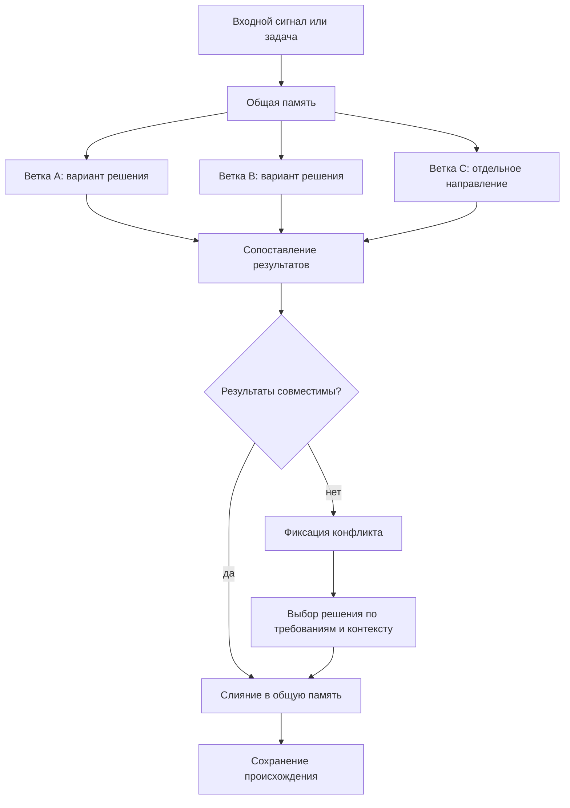

# Параллельная работа и слияние

## Требование

Проектируемый [FUM](../Глоссарий/FUM.md)-агент должен быть способен вести параллельную работу над задачами в разных [ветках](../Глоссарий/ветка-работы.md) и затем объединять результаты через слияние. Такая модель сближает работу агента с командной разработкой людей, где несколько направлений могут развиваться одновременно, а общее состояние проекта собирается через согласование результатов.

## Модель ветвления

[Ветка в FUM](../Глоссарий/ветка-работы.md) понимается как отдельная линия работы над задачей, гипотезой или набором изменений. Она должна сохранять собственный контекст, промежуточные решения, следы происхождения требований и результат работы. Несколько веток могут развиваться параллельно, не разрушая целостность общей [памяти](../Глоссарий/память-FUM.md) проекта.

Такая параллельность важна не только для ускорения работы. Она позволяет [FUM](../Глоссарий/FUM.md) удерживать несколько вариантов решения, сравнивать их, развивать независимые направления и возвращать их в общий контур мышления через управляемое слияние.

## Последовательность задач внутри ветки

Параллельность разных [веток работы](../Глоссарий/ветка-работы.md) не означает одновременное изменение одной ветки несколькими задачами. Внутри одной именованной Git-ветки задачи должны получать последовательный допуск: следующая задача начинает изменение памяти только после завершения предыдущей или продолжает ту же незавершённую работу как тот же сеанс.

Одна проверка чистоты рабочего дерева недостаточна для такого допуска: две задачи могут одновременно увидеть чистое состояние до первой записи. Поэтому ветка требует атомарного локального владения на время задачи, а отсутствие незакоммиченных изменений служит дополнительным постусловием завершения. Изменения вне корневой `.obsidian/` означают, что результат ещё не доведён до чистого Git-состояния; изменчивое состояние корневой `.obsidian/` может не задерживать очередь, но всё равно проходит отдельные правила классификации и публикации.

Само наличие hook-конфигурации также недостаточно: недоверенный, отключённый или пропущенный handler не получает событие и не создаёт владение. После успешного атомарного захвата `UserPromptSubmit` должен добавить в developer-контекст хода точный маркер `FUM-BRANCH-TASK-GATE: admitted-v1`. Только этот сигнал от hook подтверждает допуск; совпадающий текст в запросе, файле или выводе инструмента не считается доказательством. Ход без сигнала не изменяет репозиторий и ограничивается диагностикой без записи, поэтому отсутствие активации закрывается безопасно до первой правки.

Текущий hook-контракт не сообщает о смысловом завершении всей пользовательской задачи: `Stop` отмечает конец отдельного хода Codex. Поэтому локальный барьер реализует проверяемое приближение — сериализует активные ходы и сохраняет владение при незакоммиченной файловой работе. Чистый промежуточный ход может освободить ветку, даже если диалоговая задача позднее продолжится; полноценный жизненный цикл задачи требует отдельного сигнала.

Продолжение одного сеанса не должно ослаблять взаимное исключение. Каждый его ход получает отдельный `turn_id` и новое поколение владения: завершение прежнего хода может снять запись только пока она всё ещё относится к этому ходу. Запоздалый или повторный `Stop` не удаляет владение более нового хода того же сеанса.

Параллельные hooks одного события требуют дополнительного ограждения. Если один `Stop` освободил чистую ветку, а другой `Stop` запросил продолжение того же хода, следующий поддерживаемый локальный вызов инструмента должен повторно подтвердить владение: ещё свободная ветка возвращается продолжаемому ходу, а после её передачи следующей задаче прежний вызов отклоняется. Для строгого порядка сам веточный барьер должен оставаться единственным активным `Stop` hook, способным продолжить ход; несколько таких валидаторов нужно собирать в один последовательный агрегатор.

Перед передачей ветки должны завершиться не только файловые правки, но и все уже запущенные процессы и субагенты, способные позднее записать результат. Tool-hook не может заново проверить `write_stdin`, уже допущенную длительную команду, hosted-инструмент или специализированный путь, который не участвует в hook-контуре. Поэтому чистота Git в момент `Stop` является постусловием сотрудничающей задачи, а не доказательством отсутствия любого внешнего отложенного писателя.

Владение должно быть наблюдаемым и восстанавливаемым, но не должно автоматически истекать только по времени. Без надёжного подтверждения остановки прежнего исполнителя такое истечение создаёт риск двух одновременно пишущих задач. Аварийное снятие допустимо только после отдельной проверки, что прежняя задача больше не действует.

## Выбор следующего шага ветки

Последовательный допуск отвечает на вопрос, когда ветка свободна, но не определяет, что именно делать дальше. Для автоматически развиваемой именованной ветки эти решения разделяются: [следующий шаг ветки](../Глоссарий/следующий-шаг-ветки.md) выбирает одну задачу с критериями и источниками, а веточный барьер разрешает её исполнение без одновременной записи другой задачи в ту же ветку.

Общий пул [предложений о следующих шагах](../Глоссарий/предложение-о-следующем-шаге.md) не является исполняемой очередью. Ветка получает отдельную запись с точным полным ref и устойчивым `step_id`; после выполнения задача заменяет её новым выбором либо фиксирует паузу, блокировку или завершение. Наследование записи `master` при создании новой ветки не делает её шагом проекта: проектная ветка должна получить собственный паспорт в [каталоге проектов](../Проекты/README.md) и собственную запись.

Фоновый диспетчер учитывает более широкую занятость, чем Git-барьер. Он не создаёт задачу, пока максимальный поддерживаемый recent-снимок Codex показывает другую активную задачу, затем атомарно резервирует пару `branch_ref` и `step_id`, повторяет проверку занятости и создаёт отдельную локальную задачу. Список не сообщает свою полноту, а проверка и создание не образуют одной транзакции, поэтому условие остаётся лучшим доступным наблюдением текущей поверхности, сама задача ещё раз сверяет идентичность шага, а проектные hooks служат последним локальным ограждением записи.

## Схема ветвления и слияния

## Слияние результатов

Слияние должно быть осмысленным этапом работы, а не механическим объединением файлов. [FUM](../Глоссарий/FUM.md) должен сопоставлять изменения из разных веток, обнаруживать пересечения и противоречия, сохранять происхождение решений и формировать связное итоговое состояние.

Если результаты веток совместимы, агент должен объединять их в общую [память](../Глоссарий/память-FUM.md) проекта. Если между [ветками](../Глоссарий/ветка-работы.md) возникают содержательные конфликты, [FUM](../Глоссарий/FUM.md) должен фиксировать место конфликта, показывать варианты разрешения и выбирать решение на основании требований, контекста и при необходимости обратной связи пользователя.

## Git как носитель эволюционных веток

В Git-инфраструктуре [ветка работы](../Глоссарий/ветка-работы.md) становится не только технической линией изменений, но и гипотезой, участвующей в отборе. Несколько веток или worktree могут развивать разные варианты ответа на один входной сигнал, затем [FUM](../Глоссарий/FUM.md) сравнивает их по качеству, стоимости, риску и проверкам, а успешный результат передаётся дальше как [наработка](../Глоссарий/наработка.md).

Слияние в этой модели означает подтверждённое выживание результата внутри [эволюционной цепочки FUM](../Глоссарий/эволюционная-цепочка-FUM.md). Длительность существования ветки сама по себе не должна считаться успехом: ветка считается жизнеспособной, если её результат прошёл внешний отбор, породил полезных потомков или был включён в общую [память](../Глоссарий/память-FUM.md). Подробная архитектура описана в документе [Git-инфраструктура эволюционных цепочек FUM](20-Git-инфраструктура-эволюционных-цепочек-FUM.md).

## Архитектурные следствия

- [FUM](../Глоссарий/FUM.md) должен поддерживать несколько одновременно активных линий работы.
- Параллельность реализуется между отдельными ветками и worktree; внутри одной ветки задачи должны передавать владение последовательно.
- Каждая автоматически развиваемая ветка должна иметь ровно один выбранный [следующий шаг](../Глоссарий/следующий-шаг-ветки.md), отличный от общего пула возможных продолжений.
- Каждая линия работы должна иметь проверяемое происхождение: [исходные запросы](../Глоссарий/исходный-запрос.md), производные решения и итоговые изменения.
- Объединение веток должно сохранять связность [памяти](../Глоссарий/память-FUM.md) и не терять историю возникновения решений.
- Конфликты между [ветками](../Глоссарий/ветка-работы.md) должны рассматриваться как материал мышления, а не как чисто техническая ошибка.
- Модель командной разработки людей служит ориентиром для организации параллельной работы, проверки результатов и возвращения отдельных вкладов в общее состояние проекта.

## Источники требований

- [исходный запрос 2026-06-21 23:00:38 MSK](../Запросы/2026-06-21_23-00-38_MSK.md)
- [исходный запрос 2026-06-23 13:18:14 MSK](../Запросы/2026-06-23_13-18-14_MSK.md)
- [исходный запрос 2026-06-23 19:06:56 MSK](../Запросы/2026-06-23_19-06-56_MSK.md)
- [исходный запрос 2026-07-20 16:11:17 MSK - Сериализовать задачи в ветке](../Запросы/2026-07-20_16-11-17_MSK_сериализовать-задачи-в-ветке.md)
- [исходный запрос 2026-07-20 20:06:04 MSK - Запускать следующие шаги веток](../Запросы/2026-07-20_20-06-04_MSK_запускать-следующие-шаги-веток.md)
- [исходный запрос 2026-07-21 14:49:08 MSK - Закрыть пропуск веточного барьера](../Запросы/2026-07-21_14-49-08_MSK_закрыть-пропуск-веточного-барьера.md)

<!-- FUM-MD-RECENCY:BEGIN -->
<!-- last-content-edit: 2026-07-21 14:55:59 MSK -->
<!-- content-sha256: sha256:14e3eb1a4a16c84961b64d2ae01173d1f754edad5ad8187d6546371f46798176 -->
<!-- FUM-MD-RECENCY:END -->
